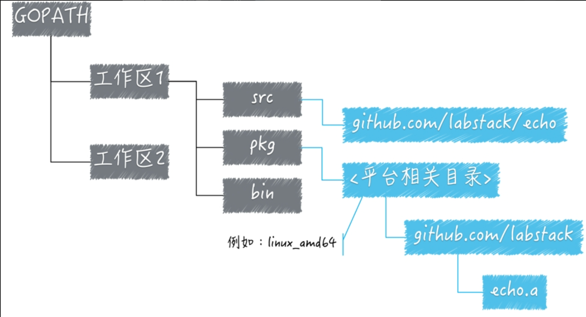

# go简介
Go 是一个开源的编程语言，它能让构造简单、可靠且高效的软件变得容易。

Go是从2007年末由Robert Griesemer, Rob Pike, Ken Thompson主持开发，后来还加入了Ian Lance Taylor, Russ Cox等人，并最终于2009年11月开源，在2012年早些时候发布了Go 1稳定版本。现在Go的开发已经是完全开放的，并且拥有一个活跃的社区。

Go 语言被设计成一门应用于搭载 Web 服务器，存储集群或类似用途的巨型中央服务器的系统编程语言。

对于高性能分布式系统领域而言，Go 语言无疑比大多数其它语言有着更高的开发效率。它提供了海量并行的支持，这对于游戏服务端的开发而言是再好不过了。

go语言具有以下特色：
- 简洁、快速、安全
- 并行、有趣、开源
- 内存管理、数组安全、编译迅速

你可以尝试编写第一个go程序，记住go程序文件以`.go`结尾
```go
package main
  
import "fmt"

func main() {
        fmt.Println("Hello,World!")
}
```
可以使用`go run`直接运行程序，也可以使用`go build`编译为二进制文件再执行。

# Go工作区区和GoPath

在使用Go工作区时需要配置三个环境变量
- GOROOT：Go语言安装根目录的路径，也就是GO语言的安装路径。
- GOPATH：若干工作区目录的路径。
- GOBIN：GO程序生成的可执行文件的路径。

其中GOPATH背后的概念是最多的，也是最重要的。那么为什么我们要设置GOPATH呢？

可以把GOPATH简单理解为GO语言的工作目录，它的值是一个目录的路径，也可以是多个目录路径，每个目录都代表Go语言的一个工作区(workspace)。

我们需要利用这些工作区，去放置Go语言的源码文件(source file)，以及安装(install)后的归档文件(archive file，也就是以".a"为扩展名的文件)和可执行文件(executable file)。

事实上，由于Go语言项目在其生命周期内的所有操作（编码、依赖管理、构建、测试、安装等）基本上都是围绕着GOPATH和工作区进行的。所以，它的背后至少有3个知识点，分别是：
1. Go语言源码的组织方式是怎么样的；
2. 是否了解源码安装后的结果(只有在安装后，Go语言源码才能被我们或其他代码使用)；
3. 是否理解构建和安装Go程序的过程
## Go语言源码的组织方式

与许多编程语言一样，Go语言的源码也是以代码包为基本组织单位的。在文件系统中，这些代码包其实是与目录一一对应的。由于目录可以有子目录，所以代码包也可以有子包。

一个代码包中可以包含任意个以.go为扩展名的源码文件，这些源码文件都需要被声明属于同一个代码包。

代码包的名称一般会与源码文件所在的目录同名。如果不同名，那么在构建、安装的过程中会以代码包名称为准。

每个代码包都会有导入路径。代码包的导入路径是其他代码在使用该包中的程序实体时，需要引入的路径。在实际使用程序实体之前，我们必须先导入其所在的代码包。具体的方式就是import该代码包的导入路径。就像这样：
```go
import "github.com/labstack/echo"
```

在工作区中，一个代码包的导入路径实际上就是从src子目录，到该包的实际存储位置的相对路径。所以说，Go语言源码的组织方式就是以环境变量GOPATH、工作区、src目录和代码包为主线的。一般情况下，Go语言的源码文件都需要被存放在环境变量GOPATH包含的某个工作区（目录）中的src目录下的某个代码包（目录）中。
## 了解源码安装后的结果

源码文件以及安装后的结果文件都会放到哪里呢？我们都知道，源码文件通常会被放在某个工作区的src子目录下。那么在安装后如果产生了归档文件（以“.a”为扩展名的文件）​，就会放进该工作区的pkg子目录；如果产生了可执行文件，就可能会放进该工作区的bin子目录。

再讲一下归档文件存放的具体位置和规则。

源码文件会以代码包的形式组织起来，一个代码包其实就对应一个目录。安装某个代码包而产生的归档文件是与这个代码包同名的。

放置它的相对目录就是该代码包的导入路径的直接父级。比如，一个已存在的代码包的导入路径是
```go
github.com/labstack/echo
```
那么执行命令：
```go
go install github.com/labstack/echo
```

生成的归档文件的相对目录就是github.com/labstack ，文件名为echo.a 。

顺便说一下，上面这个代码包导入路径还有另外一层含义，那就是：该代码包的源码文件存在于GitHub网站的labstack组的代码仓库echo中。

再说回来，归档文件的相对目录与pkg目录之间还有一级目录，叫做平台相关目录。平台相关目录的名称是由build（也称“构建”​）的目标操作系统、下划线和目标计算架构的代号组成的。

## 理解构建和安装Go程序的过程

再来说说构建和安装Go程序的过程都是怎样的，以及它们的异同点。

构建使用命令go build，安装使用命令go install。构建和安装代码包的时候都会执行编译、打包等操作，并且，这些操作生成的任何文件都会先被保存到某个临时的目录中。

如果构建的是库源码文件，那么操作后产生的结果文件只会存在于临时目录中。这里的构建的主要意义在于检查和验证。

如果构建的是命令源码文件，那么操作的结果文件会被搬运到源码文件所在的目录中。​

安装操作会先执行构建，然后还会进行链接操作，并且把结果文件搬运到指定目录。

进一步说，如果安装的是库源码文件，那么结果文件会被搬运到它所在工作区的pkg目录下的某个子目录中。

如果安装的是命令源码文件，那么结果文件会被搬运到它所在工作区的bin目录中，或者环境变量GOBIN指向的目录中。

这里你需要记住的是，构建和安装的不同之处，以及执行相应命令后得到的结果文件都会出现在哪里。

# 语言结构
一般来说，go语言由以下几个部分组成：
- 包声明
- 引入包
- 函数
- 变量
- 语句/表达式
- 注释

比如说下面这段程序
```go
// 包声明 
package main 

// 导入包 
import ( 
	"fmt" 
	"math"
) 

// 常量声明 
const greeting = "Hello, World!" 

// 自定义类型和方法 
type greeter struct { 
	name string 
	} 
	
func (g greeter) greet() { 
	fmt.Println(greeting, g.name) 
	} 

func add(a int, b int) int {
	return a + b 
}

// 主函数 
func main() 
{ 
	// 变量声明和赋值 
	var s int = 42
	var g = greeter{name: "Go"} 
	// 方法调用 
	g.greet() 
}
```
- `包声明`：第一行是包声明，必须在源文件非注释的第一行指明这个文件属于哪个包，如:`package main`指明这是一个可独立执行的程序，每个Go应用程序都应该包含一个名为main的包。
- `导入包`：`import`告诉Go编译器这个程序需要使用哪些包。导入的包必须使用，否则报错。
- `常量声明`：使用`const`声明常量，常量在声明时必须赋值，且值不能更改。
- `类型声明`：`使用type`来声明一个类型。
- `方法声明`：方法是带有接收者参数的函数。在这个例子中，`greet`方法的接收者是`greeter`类型的变量`g`。
- `函数声明`：函数可以定义参数和类型，还能使用`return`返回值。
- `主函数`：_func main()_ 是程序开始执行的函数。main 函数是每一个可执行程序所必须包含的，一般来说都是在启动后第一个执行的函数（如果有 init() 函数则会先执行该函数）。
- `变量声明`：使用`var`声明一个变量，可以在函数外声明全局变量，也可以在函数内声明局部变量。也可以使用`s := 123`声明一个短变量，并由Go编译器自动推算变量类型。定义的变量必须使用，否则报错，可以使用`_ = 123`避免。
- `注释`：/\*...\*/是块注释，//是单行注释
- 当标识符（包括常量、变量、类型、函数名、结构字段等等）以一个大写字母开头，如：Group1，那么使用这种形式的标识符的对象就可以被外部包的代码所使用（客户端程序需要先导入这个包），这被称为导出（像面向对象语言中的 public）；标识符如果以小写字母开头，则对包外是不可见的，但是他们在整个包的内部是可见并且可用的（像面向对象语言中的 protected ）。
**注意：导入包的包名要使用双引号；函数的左`{`不能单独在一行；Go中一行代表一个语句结束，如果想将多个语句写在一行则必须使用`;`人为区分，但并不建议。**

# 包导入
在上面我们介绍了如果想要使用一个包的功能，需要使用`import`关键字引入才能使用。

可以是相对路径，也可以是绝对路径，推荐使用绝对路径(起始于工程根目录)

1.  点操作
```go
import (
	. "fmt"
)
```
这个点操作的含义就是这个包导入之后在调用这个包的函数时，可以省略前缀的包名。不推荐在大量导入包时使用。

2.  别名操作
```go
import (
	f "fmt"
)
```
在调用时可以使用别名。

3.  \_操作
```go
import (
	_ "fmt"
)
```
\_操作其实是引入该包，而不直接使用包里面的函数，而是调用包的init函数。
# Go命令

go常用命令一般有以下几个：

| 命令         | 说明                       | 示例                                                                               |
| ---------- | ------------------------ | -------------------------------------------------------------------------------- |
| go run     | 运行go程序                   | go run main.go                                                                   |
| go build   | 编译go程序，不指定编译文件会编译目录下所有文件 | go build main.go                                                                 |
| go install | 编译并安装包和依赖                | go install ./...                                                                 |
| go get     | 下载并安装包和依赖                | go get github.com/gin-gonic/gin                                                  |
| go clean   | 移除对象文件和缓存                | go clean                                                                         |
| go test    | 运行测试                     | go test ./...                                                                    |
| go fmt     | 格式化go源码                  | go fmt main.go                                                                   |
| go vet     | 静态代码分析工具，用于发现潜在的错误       | go vet main.go                                                                   |
| go mod     | 管理go模块                   | 初始化模块：go mod init example.com/mymodule <br>下载依赖项：go mode tidy<br>更新依赖项：go get -u |
| go doc     | 显示包或符号的文档                | go doc fmt.Println                                                               |
| go env     | 显示或设置Go环境变量              | go env                                                                           |
| go list    | 列出包信息                    | go list ./...                                                                    |
| go tool    | 运行指定的go工具                | go tool pprof                                                                    |
在go命令行中`./...`是一个特殊的模式，用于递归匹配当前目录及其所有子目录中的所有Go包。`.`表示当前目录，`...`是一个通配符，表示递归匹配所有子目录。

其中和编译相关的有build,get,install,run这四个。以下是这些命令通用的选项

| 选项    | 说明                                                                                                  |
| ----- | --------------------------------------------------------------------------------------------------- |
| -a    | 用于强制重新编译所有涉及的Go语言代码包，即使它们已经是最新的了。该选项可以让我们有机会通过改动底层的代码做一些实验。                                         |
| -n    | 使命令打印其执行过程中用到的所有命令，而不去真正执行它们。如果只想查看或者验证命令的执行过程，而不想改变任何东西，使用它正好合适。                                   |
| -race | 用于检测并报告指定Go语言程序中存在的数据竞争问题。当用Go语言编写并发程序的时候，这是很重要的检测手段之一。                                             |
| -v    | 用于打印命令执行过程中涉及的代码包。这一定包括我们指定的目标代码包，并且有时还会包括该代码包直接或间接依赖的那些代码包。这会让你知道哪些代码包被执行过了。                       |
| -work | 用于打印命令执行时生成和使用的临时工作目录的名字，且命令执行完成后不删除它。这个目录下的文件可能会对你有用，也可以从侧面了解命令的执行过程。如果不添加此标记，那么临时工作目录会在命令执行完毕前删除。 |
| -x    | 使命令打印其执行过程中用到的所有命令，并同时执行它们。                                                                         |


# 基础语法
**标识符**
标识符一般用来命名变量、类型等程序实体。一个标识符由数字、字母和下划线构成，但不能由数字开头。

以下是无效的标识符：
- 1ab（数字开头）
- case（不能使用关键字）
- a+b（不能使用运算）

**字符串连接**
Go语言中的字符串连接可以通过`+`实现。
```go
package main
import "fmt"
func main() {
	fmt.Println("Google" + "Runoob")
}

# 结果：GoogleRunoob
```

**格式化字符串**
Go 语言中使用 fmt.Sprintf 或 fmt.Printf 格式化字符串并赋值给新串：
- **Sprintf** 根据格式化参数生成格式化的字符串并返回该字符串。
- **Printf** 根据格式化参数生成格式化的字符串并写入标准输出。

**Sprintf示例**
```go
package main

import (
"fmt"
)

func main() {
        var a = 123
        var enddata = "2023-12-23"
        var url = "Code=%d&endDate=%s"
        var target = fmt.Sprintf(url,a,enddata)
        fmt.Println(target)
}

# Code=123&endDate=2023-12-23
```

```go
package main

import (
"fmt"
)

func main() {
        var a = 123
        var enddata = "2023-12-23"
        var url = "Code=%d&endDate=%s"
        fmt.Printf(url,a,enddata)
}

# Code=123&endDate=2023-12-23
```
**Sprintf输出后会自动换行，Printf不会。**


# 数据类型
在Go中，数据类型用于声明函数和变量。

数据类型的出现是为了把数据分成所需内存大小不同的数据，编程的时候需要用到大数据时才申请大内存，这样可以充分利用内存。

Go 语言按类别有以下几种数据类型：

|序号|类型和描述|
|---|---|
|1|**布尔型**  <br>布尔型的值只可以是常量 true 或者 false。一个简单的例子：var b bool = true。|
|2|**数字类型**  <br>整型 int 和浮点型 float32、float64，Go 语言支持整型和浮点型数字，并且支持复数，其中位的运算采用补码。|
|3|**字符串类型:**  <br>字符串就是一串固定长度的字符连接起来的字符序列。Go 的字符串是由单个字节连接起来的。Go 语言的字符串的字节使用 UTF-8 编码标识 Unicode 文本。|
|4|**派生类型:**  <br>包括：<br><br>- (a) 指针类型（Pointer）<br>- (b) 数组类型<br>- (c) 结构化类型(struct)<br>- (d) Channel 类型<br>- (e) 函数类型<br>- (f) 切片类型<br>- (g) 接口类型（interface）<br>- (h) Map 类型|


## 数字类型

Go 也有基于架构的类型，例如：int、uint 和 uintptr。

|序号|类型和描述|
|---|---|
|1|**uint8**  <br>无符号 8 位整型 (0 到 255)|
|2|**uint16**  <br>无符号 16 位整型 (0 到 65535)|
|3|**uint32**  <br>无符号 32 位整型 (0 到 4294967295)|
|4|**uint64**  <br>无符号 64 位整型 (0 到 18446744073709551615)|
|5|**int8**  <br>有符号 8 位整型 (-128 到 127)|
|6|**int16**  <br>有符号 16 位整型 (-32768 到 32767)|
|7|**int32**  <br>有符号 32 位整型 (-2147483648 到 2147483647)|
|8|**int64**  <br>有符号 64 位整型 (-9223372036854775808 到 9223372036854775807)|

## 浮点型

|序号|类型和描述|
|---|---|
|1|**float32**  <br>IEEE-754 32位浮点型数|
|2|**float64**  <br>IEEE-754 64位浮点型数|
|3|**complex64**  <br>32 位实数和虚数|
|4|**complex128**  <br>64 位实数和虚数|


## 其他数字类型

以下列出了其他更多的数字类型：

|序号|类型和描述|
|---|---|
|1|**byte**  <br>类似 uint8|
|2|**rune**  <br>类似 int32|
|3|**uint**  <br>32 或 64 位|
|4|**int**  <br>与 uint 一样大小|
|5|**uintptr**  <br>无符号整型，用于存放一个指针|
# Go变量

变量来源于数学，是计算机语言中能储存计算结果或能表示值抽象概念。

变量可以通过变量名访问。

Go 语言变量名由字母、数字、下划线组成，其中首个字符不能为数字。

声明变量的一般形式是使用 var 关键字：
```go
var identifier type

# 可以一次性声明多个变量
var identifier1, identifier12 type
```


