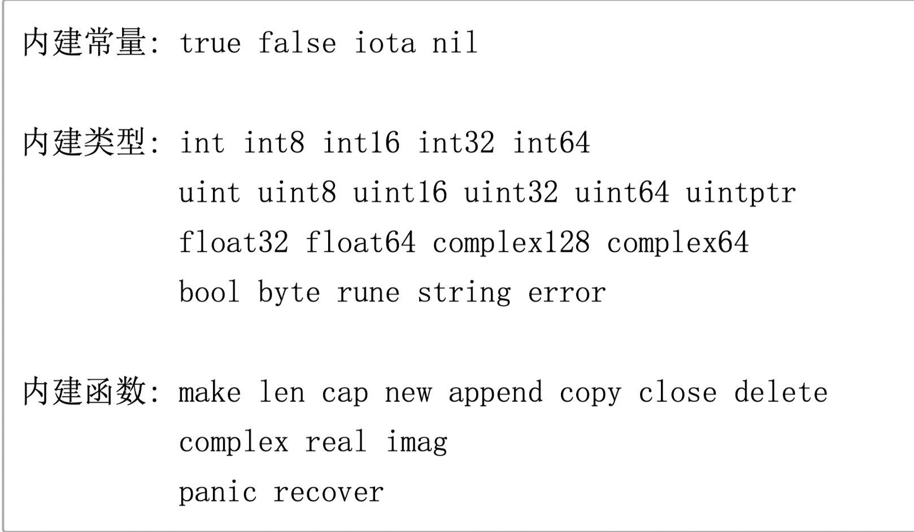
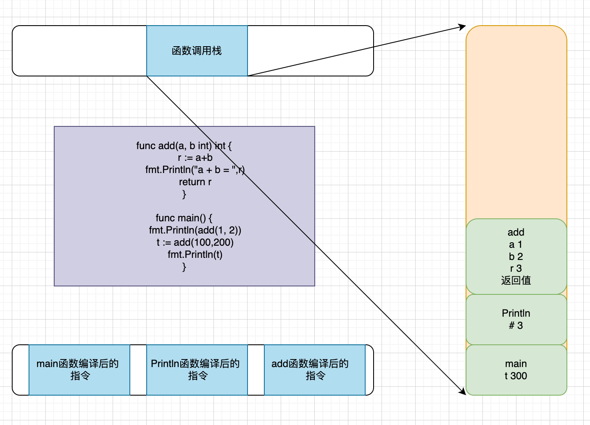
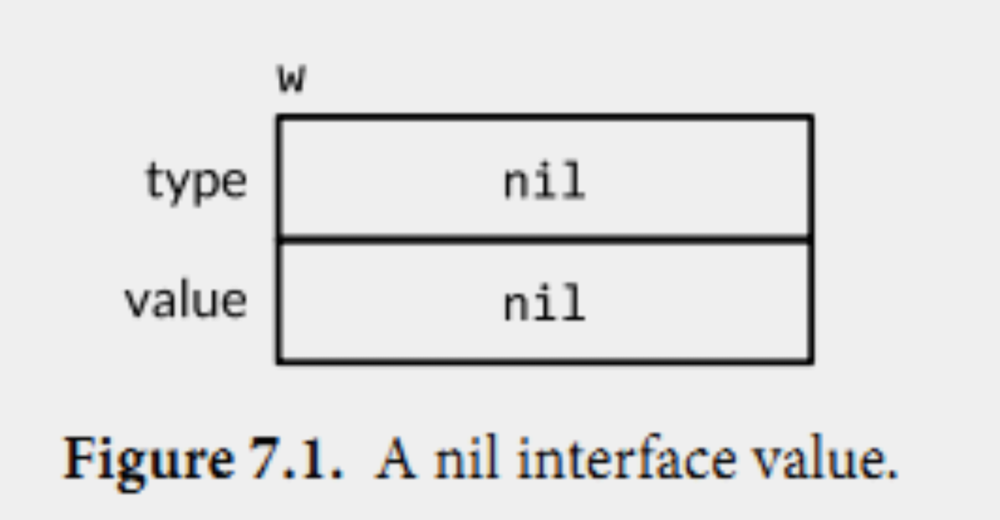
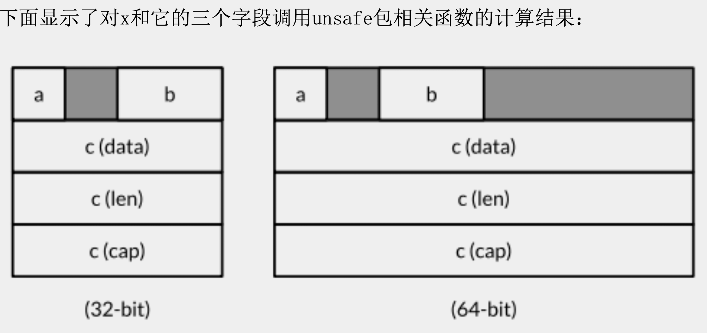

# 1 go简介
Go 是一个开源的编程语言，它能让构造简单、可靠且高效的软件变得容易。

Go是从2007年末由Robert Griesemer, Rob Pike, Ken Thompson主持开发，后来还加入了Ian Lance Taylor, Russ Cox等人，并最终于2009年11月开源，在2012年早些时候发布了Go 1稳定版本。现在Go的开发已经是完全开放的，并且拥有一个活跃的社区。

Go 语言被设计成一门应用于搭载 Web 服务器，存储集群或类似用途的巨型中央服务器的系统编程语言。

对于高性能分布式系统领域而言，Go 语言无疑比大多数其它语言有着更高的开发效率。它提供了海量并行的支持，这对于游戏服务端的开发而言是再好不过了。

go语言具有以下特色：
- 简洁、快速、安全
- 并行、有趣、开源
- 内存管理、数组安全、编译迅速

你可以尝试编写第一个go程序，记住go程序文件以`.go`结尾
```go
package main
  
import (
   . "fmt" // 在使用时不需要写包名
   f "fmt" // 在使用时可以使用别名
   _ "fmt" // 不使用该包的函数，而是调用init函数
)

func main() {
        fmt.Println("Hello,World!")
}
```
可以使用`go run`直接运行程序，也可以使用`go build`编译为二进制文件再执行。

也可以在包路径下使用`go mod init 包名`，然后使用`go mod tidy`更新依赖，使用`go install`安装可执行文件。
# 2 go安装配置

先在Go官网上https://go.dev/dl/下载对应的压缩包，然后把压缩包解压到指定目录。接来下设置Go环境变量：

 - GOROOT：Go语言安装根目录的路径，也就是GO语言的安装路径。一般是自动设置的，只有在安装了多版本或者go的安装路径不在默认位置需要指定GOROOT。
 
- GOPATH：若干工作区目录的路径。
    - scr：里面每一个子目录都是一个包，包里面是源码。
    - pkg：编译后生成的包的位置。
    - bin：生成的可执行文件位置。

- GOBIN：`GOBIN` 指定了 `go install` 命令安装可执行文件的目录。如果未设置 `GOBIN`，则默认安装到 `GOPATH/bin` 目录。

- PATH：环境变量路径。

注意把export语句写到`profile`/`.bashrc`文件中，否则只对当前会话有效。
# 3 go执行原理及相关命令

## 3.1 命令源码文件

声明自己属于 main 代码包、包含无参数声明和结果声明的 main 函数。

命令源码文件被安装以后，GOPATH 如果只有一个工作区，那么相应的可执行文件会被存放当前工作区的 bin 文件夹下；如果有多个工作区，就会安装到 GOBIN 指向的目录下。

命令源码文件是 Go 程序的入口。

同一个代码包中最好也不要放多个命令源码文件。多个命令源码文件虽然可以分开单独 go run 运行起来，但是无法通过 go build 和 go install。
## 3.2 库源码文件

库源码文件就是不具备命令源码文件上述两个特征的源码文件。存在于某个代码包中的普通的源码文件。

库源码文件被安装后，相应的归档文件（.a 文件）会被存放到当前工作区的 pkg 的平台相关目录下。
## 3.3 测试源码文件

名称以 _test.go 为后缀的代码文件，并且必须包含 Test 或者 Benchmark 名称前缀的函数：

```
func TestXXX( t *testing.T) {

}
```

名称以 Test 为名称前缀的函数，只能接受 *testing.T 的参数，这种测试函数是功能测试函数。

```
func BenchmarkXXX( b *testing.B) {

}
```

名称以 Benchmark 为名称前缀的函数，只能接受 *testing.B 的参数，这种测试函数是性能测试函数。
## 3.4 Go常用命令

我们可以打开终端输入：go help即可看到Go的这些命令以及简介。

```
	bug         start a bug report
	build       compile packages and dependencies
	clean       remove object files and cached files
	doc         show documentation for package or symbol
	env         print Go environment information
	fix         update packages to use new APIs
	fmt         gofmt (reformat) package sources
	generate    generate Go files by processing source
	get         download and install packages and dependencies
	install     compile and install packages and dependencies
	list        list packages or modules
	mod         module maintenance
	run         compile and run Go program
	test        test packages
	tool        run specified go tool
	version     print Go version
	vet         report likely mistakes in packages
```

其中和编译相关的有build、get、install、run这4个。接下来就依次看看这四个的作用。

且各个命令通用的命令标记，以下这些命令都可适用的：

| 名称    | 说明                                                                                                  |
| ----- | --------------------------------------------------------------------------------------------------- |
| -a    | 用于强制重新编译所有涉及的 Go 语言代码包（包括 Go 语言标准库中的代码包），即使它们已经是最新的了。该标记可以让我们有机会通过改动底层的代码包做一些实验。                    |
| -n    | 使命令仅打印其执行过程中用到的所有命令，而不去真正执行它们。如果不只想查看或者验证命令的执行过程，而不想改变任何东西，使用它正好合适。                                 |
| -race | 用于检测并报告指定 Go 语言程序中存在的数据竞争问题。当用 Go 语言编写并发程序的时候，这是很重要的检测手段之一。                                         |
| -v    | 用于打印命令执行过程中涉及的代码包。这一定包括我们指定的目标代码包，并且有时还会包括该代码包直接或间接依赖的那些代码包。这会让你知道哪些代码包被执行过了。                       |
| -work | 用于打印命令执行时生成和使用的临时工作目录的名字，且命令执行完成后不删除它。这个目录下的文件可能会对你有用，也可以从侧面了解命令的执行过程。如果不添加此标记，那么临时工作目录会在命令执行完毕前删除。 |
| -x    | 使命令打印其执行过程中用到的所有命令，并同时执行它们。                                                                         |
## 3.5 run 

专门用来运行命令源码文件的命令，**注意，这个命令不是用来运行所有 Go 的源码文件的！**

go run 命令只能接受一个命令源码文件以及若干个库源码文件（必须同属于 main 包）作为文件参数，且**不能接受测试源码文件**。它在执行时会检查源码文件的类型。如果参数中有多个或者没有命令源码文件，那么 go run 命令就只会打印错误提示信息并退出，而不会继续执行。

想知道`go run`命令具体做了什么事情，可以使用`-n`选项查看。

`go run`命令在第二次执行的时候，如果发现导入的代码包没有发生变化，那么`go run`不会再次编译这个导入的代码包，而是直接静态链接过来。

## 3.6 build

`go build`命令主要是用于测试编译，在包的编译过程中，若有必要，会同时编译与之相关的包。

- 如果是普通包，执行这个命令不会产生任何文件。

- 如果是main包，当只执行该命令后，会在当前目录下生成一个可执行文件。

- 如果某个文件夹下有多个文件，而你只想编译其中一个文件，可以在命令之后加上文件名。

- 也可以指定编译输出的文件名，只需要加上-o选项即可。否则默认使用package包名或者是第一个源文件名。
## 3.7 install

`go install`命令是用来编译并安装代码包或源码文件的。

`go install`命令实际上做了两步操作：一是生成结果文件(可执行文件或.a包)，二是会把编译好的文件移动到指定的目录中。

可执行文件：一般是go install带main函数的go文件产生的，有函数入口，所以可以直接运行。

.a应用包：一般是go install不包含main函数的go文件产生的，没有函数入口，只能被调用。
## 3.8 get

`go get`命令是用来从远程仓库上下载并安装代码包。**注意：go get命令会把当前的代码包下载到$GOPATH中的第一个工作区的src目录中，并安装。**

`go get`有一个智能下载的功能，在使用它检出货更新代码包之后，它会寻找与本地已安装Go语言的版本号相对应的标签或分支。

常用选项如下

| 命令        | 说明                                                                                   |
| --------- | ------------------------------------------------------------------------------------ |
| -d        | 让命令程序只执行下载动作，而不执行安装动作                                                                |
| -f        | 仅在使用-u选项时才有效。该标记会让命令程序忽略掉对已下载代码包的导入路径的检查。如果下载并安装的代码包所属的项目是你从别人那里fork过来的，那么这么做就尤为重要了。 |
| -fix      | 让命令程序在下载代码包后先执行修正动作，而后再进行编译和安装。                                                      |
| -insecure | 允许命令程序使用非安全的scheme去下载指定的代码包。                                                         |
| -t        | 让命令程序同时下载并安装指定的代码包中的测试源码文件中依赖的代码包。                                                   |
| -u        | 让命令利用网络来更新已有代码包及其依赖包。默认情况下，该命令只会从网络上下载本地不存在的代码包，而不会更新已有的代码包。                         |
| -x        | 打印输出命令所执行的操作。                                                                        |
## 3.9 其他命令

| 命令         | 说明                                                                                      |
| ---------- | --------------------------------------------------------------------------------------- |
| go clean   | 移除当前源码包里面编译生成的文件                                                                        |
| go fmt     | 格式化所有写好的代码文件，-w选项修改文件                                                                   |
| go test    | 自动读取源码目录下名为*_test.go文件，生成并且允许测试用的可执行文件。                                                 |
| go doc     | 查看对应包的使用文档，`go doc builtin`；查看对应函数的，`go doc fmt Printf`；查看对应代码，`go doc -src fmt Printf` |
| go fix     | 用来修复以前老版本的代码到新版本                                                                        |
| go version | 查看go当前版本                                                                                |
| go env     | 查看当前go的环境变量                                                                             |
| go list    | 列出当前全部安装的package                                                                        |
# 4 编码规范

本规范旨在为日常Go项目开发提供一个代码的规范指导，方便团队形成一个统一的代码风格，提高代码的可读性，规范性和统一性。本规范将从命名规范，注释规范，代码风格和 Go 语言提供的常用的工具这几个方面做一个说明。该规范参考了 go 语言官方代码的风格制定。

## 4.1 命名规范

命名是代码规范中很重要的一部分，统一的命名规则有利于提高的代码的可读性，好的命名仅仅通过命名就可以获取到足够多的信息。

Go在命名时以字母a到Z或a到Z或下划线开头，后面跟着零或更多的字母、下划线和数字(0到9)。Go不允许在命名时中使用@、$和%等标点符号。Go是一种区分大小写的编程语言。因此，Manpower和manpower是两个不同的命名。

> 1. 当命名（包括常量、变量、类型、函数名、结构字段等等）以一个大写字母开头，如：Group1，那么使用这种形式的标识符的对象就**可以被外部包的代码所使用**（客户端程序需要先导入这个包），这被称为导出（像面向对象语言中的 public）； > 2. **命名如果以小写字母开头，则对包外是不可见的，但是他们在整个包的内部是可见并且可用的**（像面向对象语言中的 private ）

### 4.1.1 包命名：package

保持package的名字和目录保持一致，尽量采取有意义的包名，简短，有意义，尽量和标准库不要冲突。包名应该为**小写**单词，不要使用下划线或者混合大小写。

```
package demo

package main
```

### 4.1.2 文件命名

尽量采取有意义的文件名，简短，有意义，应该为**小写**单词，使用**下划线**分隔各个单词。

```
my_test.go
```

### 4.1.3 结构体命名

- 采用驼峰命名法，首字母根据访问控制大写或者小写
    
- struct 申明和初始化格式采用多行，例如下面：
    

```
// 多行申明
type User struct{
    Username  string
    Email     string
}

// 多行初始化
u := User{
    Username: "astaxie",
    Email:    "astaxie@gmail.com",
}

```

### 4.1.4 接口命名

- 命名规则基本和上面的结构体类型
- 单个函数的结构名以 “er” 作为后缀，例如 Reader , Writer 。

```
type Reader interface {
        Read(p []byte) (n int, err error)
}

```

### 4.1.5 变量命名

- 和结构体类似，变量名称一般遵循驼峰法，首字母根据访问控制原则大写或者小写，但遇到特有名词时，需要遵循以下规则：
    - 如果变量为私有，且特有名词为首个单词，则使用小写，如 apiClient
    - 其它情况都应当使用该名词原有的写法，如 APIClient、repoID、UserID
    - 错误示例：UrlArray，应该写成 urlArray 或者 URLArray
- 若变量类型为 bool 类型，则名称应以 Has, Is, Can 或 Allow 开头

```
var isExist bool
var hasConflict bool
var canManage bool
var allowGitHook bool
```

### 4.1.6 常量命名

常量均需使用全部大写字母组成，并使用下划线分词

```
const APP_VER = "1.0"
```

如果是枚举类型的常量，需要先创建相应类型：

```
type Scheme string

const (
    HTTP  Scheme = "http"
    HTTPS Scheme = "https"
)

```

### 4.1.7 关键字

下面的列表显示了Go中的保留字。这些保留字不能用作常量或变量或任何其他标识符名称。


此外，还有大约30多个预定义的名字，比如int和true等，主要对应内建的常量、类型和函数。



## 4.2 注释

Go提供C风格的`/* */`块注释和C ++风格的`//`行注释。行注释是常态；块注释主要显示为包注释，但在表达式中很有用或禁用大量代码。

- 单行注释是最常见的注释形式，你可以在任何地方使用以 // 开头的单行注释
- 多行注释也叫块注释，均已以 /* 开头，并以 */ 结尾，且不可以嵌套使用，多行注释一般用于包的文档描述或注释成块的代码片段

go 语言自带的 godoc 工具可以根据注释生成文档，生成可以自动生成对应的网站（ [golang.org](http://golang.org/) 就是使用 godoc 工具直接生成的），注释的质量决定了生成的文档的质量。每个包都应该有一个包注释，在package子句之前有一个块注释。对于多文件包，包注释只需要存在于一个文件中，任何一个都可以。包评论应该介绍包，并提供与整个包相关的信息。它将首先出现在`godoc`页面上，并应设置下面的详细文档。

详细的如何写注释可以 参考：<[http://golang.org/doc/effective_go.html#commentary](http://golang.org/doc/effective_go.html#commentary)>

### 4.2.1 包注释

每个包都应该有一个包注释，一个位于package子句之前的块注释或行注释。包如果有多个go文件，只需要出现在一个go文件中（一般是和包同名的文件）即可。 包注释应该包含下面基本信息(请严格按照这个顺序，简介，创建人，创建时间）：

- 包的基本简介（包名，简介）
- 创建者，格式： 创建人： rtx 名
- 创建时间，格式：创建时间： yyyyMMdd

例如 util 包的注释示例如下

```
// util 包， 该包包含了项目共用的一些常量，封装了项目中一些共用函数。
// 创建人： hanru
// 创建时间： 20190419
```

### 4.2.2 结构（接口）注释

每个自定义的结构体或者接口都应该有注释说明，该注释对结构进行简要介绍，放在结构体定义的前一行，格式为： 结构体名， 结构体说明。同时结构体内的每个成员变量都要有说明，该说明放在成员变量的后面（注意对齐），实例如下：

```
// User ， 用户对象，定义了用户的基础信息
type User struct{
    Username  string // 用户名
    Email     string // 邮箱
}
```

### 4.2.3 函数（方法）注释

每个函数，或者方法（结构体或者接口下的函数称为方法）都应该有注释说明，函数的注释应该包括三个方面（严格按照此顺序撰写）：

- 简要说明，格式说明：以函数名开头，“，”分隔说明部分
- 参数列表：每行一个参数，参数名开头，“，”分隔说明部分
- 返回值： 每行一个返回值

示例如下：

```
// NewtAttrModel ， 属性数据层操作类的工厂方法
// 参数：
//      ctx ： 上下文信息
// 返回值：
//      属性操作类指针
func NewAttrModel(ctx *common.Context) *AttrModel {
}
```

### 4.2.4 代码逻辑注释

对于一些关键位置的代码逻辑，或者局部较为复杂的逻辑，需要有相应的逻辑说明，方便其他开发者阅读该段代码，实例如下：

```
// 从 Redis 中批量读取属性，对于没
```
# 5 代码风格
## 5.1 语句的结尾

Go语言中是不需要使用结尾符的，默认一行就是一条数据；但如果打算将多个语句写在一行，则必须使用分号
## 5.2 括号和空格

括号和空格方面，go会强制左大括号不换行，否则会报错；所有的运算符和操作数之间要留空格。

# 6 变量的使用

## 6.1 什么是变量

变量是为存储特定类型的值而提供给内存位置的名称。在go中声明变量有多种语法。

所以变量的本质就是一小块内存，用于存储数据，在程序运行过程中数值可以改变

## 6.2 声明变量

var名称类型是声明单个变量的语法。

> 以字母或下划线开头，由一个或多个字母、数字、下划线组成

声明一个变量

第一种，指定变量类型，声明后若不赋值，使用默认值

```
var name type
name = value
```

第二种，根据值自行判定变量类型(类型推断Type inference)

如果一个变量有一个初始值，Go将自动能够使用初始值来推断该变量的类型。因此，如果变量具有初始值，则可以省略变量声明中的类型。

```
var name = value
```

第三种，省略var, 注意 :=左侧的变量不应该是已经声明过的(多个变量同时声明时，至少保证一个是新变量)，否则会导致编译错误(简短声明).且简短声明不能声明全局变量。

简短变量声明左边的变量可能并不是全部都是刚刚声明的。如果有一些已 经在相同的词法域声明过了，那么简短变量声明语句对这些已经声明过的变量就只有赋值行为了。

**简短变量声明语句只有对已经在同级词法域声明过的变量才和赋值操作语句等价，如果变量是在外部词法域声明的，那么简短变量声明语句将会在当前词法域重新声明一个新的变量。**

> 在Go语言中，​**​词法域（lexical scope）​**​ 指的是程序中通过花括号`{}`明确的代码块范围，以及由语言规则隐式定义的代码边界。
> 
> 1. ​**​显式代码块​**​：  
    用花括号`{}`明确包裹的代码段（如函数体、if/for块）
>    
>2. ​**​隐式词法域​**​：
 >   
    - 函数参数和返回值的作用域
    - `if`/`switch`条件表达式的作用域
    - `for`循环变量的作用域
    - 包级别的全局作用域


```
name := value

// 例如
var a int = 10
var b = 10
c : = 10
```

> 这种方式它只能被用在函数体内，而不可以用于全局变量的声明与赋值

示例代码：

```
package main
var a = "Hello"
var b string = "World"
var c bool

func main(){
    println(a, b, c)
}
```

运行结果：

```
Hello World false
```

**在包级别，声明的顺序并不会影响作用域范围**，因此一个先声明的可以引用它自身或者是引用后面的一个声明，这可以让我们定义一些相互嵌套或递归的类型或函数。但是如果一个变量或常量递归引用了自身，则会产生编译错误。

### 6.2.1 多变量声明

第一种，以逗号分隔，声明与赋值分开，若不赋值，存在默认值

```
var name1, name2, name3 type
name1, name2, name3 = v1, v2, v3
```

第二种，直接赋值，下面的变量类型可以是不同的类型

```
var name1, name2, name3 = v1, v2, v3
```

第三种，集合类型

```
var (
    name1 type1
    name2 type2
)
```

## 6.3 注意事项

如果在相同的代码块中，我们不可以再次对于相同名称的变量使用初始化声明，例如：a := 20 就是不被允许的，编译器会提示错误 no new variables on left side of :=，但是 a = 20 是可以的，因为这是给相同的变量赋予一个新的值。

如果你在定义变量 a 之前使用它，则会得到编译错误 undefined: a。如果你声明了一个局部变量却没有在相同的代码块中使用它，同样会得到编译错误，例如下面这个例子当中的变量 a：

```
func main() {
   var a string = "abc"
   fmt.Println("hello, world")
}
```

尝试编译这段代码将得到错误 a declared and not used

此外，单纯地给 a 赋值也是不够的，这个值必须被使用，所以使用

在同一个作用域中，已存在同名的变量，则之后的声明初始化，则退化为赋值操作。但这个前提是，最少要有一个新的变量被定义，且在同一作用域，例如，下面的y就是新定义的变量

```
package main

import (
	"fmt"
)

func main() {
	x := 140
	fmt.Println(&x)
	x, y := 200, "abc"
	fmt.Println(&x, x)
	fmt.Print(y)
}
```

运行结果：

```
0xc04200a2b0
0xc04200a2b0 200
abc
```

## 6.4 变量生命周期

那么垃Go语言的自动圾收集器是如何知道一个变量是何时可以被回收的呢?这里我们可以避开完整的技 术细节，基本的实现思路是，从每个包级的变量和每个当前运行函数的每一个局部变量开始，通过指针 或引用的访问路径遍历，是否可以找到该变量。如果不存在这样的访问路径，那么说明该变量是不可达 的，也就是说它是否存在并不会影响程序后续的计算结果。

**一个变量的有效周期只取决于是否可达。**

编译器会自动选择在栈上还是在堆上分配局部变量的存储空间，但可能令人惊讶的是，这个选择并不是 由用var还是new声明变量的方式决定的。

```go
package main  
  
import "fmt"  
  
var global *int  
  
func f() {  
    var x = 1  
    global = &x  
}  
  
func g() {  
    y := new(int)  
    *y = 1  
}  
  
func main() {  
    f()  
    g()  
    fmt.Println(*global)  
}
```

f函数里的x变量必须在堆上分配，因为它在函数退出后依然可以通过包一级的global变量找到，虽然它 是在函数内部定义的;用Go语言的术语说，这个x局部变量从函数f中逃逸了。相反，当g函数返回时，变 量 \*y 将是不可达的，也就是说可以马上被回收的。因此， \*y 并没有从函数g中逃逸，编译器可以选择在栈 上分配 \*y 的存储空间(译注:也可以选择在堆上分配，然后由Go语言的GC回收这个变量的内存空间)， 虽然这里用的是new方式。其实在任何时候，你并不需为了编写正确的代码而要考虑变量的逃逸行为，要 记住的是，逃逸的变量需要额外分配内存，同时对性能的优化可能会产生细微的影响。

```go
# 显示所有逃逸分析详情
go build -gcflags="-m" main.go

# 更详细信息（两个 -m）
go build -gcflags="-m -m" main.go
```

## 6.5 赋值

最简单的赋值就是把变量名放在=的左边，把表达式放在=的右边。

```go
a := 1
b += 1
b++
```

上面的两个赋值语句可以简化成第三种形式。但**++/--不是表达式，而是语句，所以不能对其赋值**。

```go
x,y := 1,1  
x,y = y,x
```

元组赋值是另一种形式的赋值语句，它允许同时更新多个变量的值。在赋值之前，赋值语句右边的所有表达式将会先进行求值，然后再统一更新左边对应变量的值。这对于处理有些同时出现在元组赋值语句左右两边的变量很有帮助

# 7 常量

常量是一个简单值的标识符，在程序运行时，不会被修改的量。**常量不被引用也不会报错**。

常量中的数据类型只可以是布尔型、数字型（整数型、浮点型和复数）和字符串型。

**常量必须赋值才能使用，没有默认值。**

**所有常量的运算都可以在编译期完成，这样可以减少运行时的工作，也方便其他编译优化。** 当操作数是常量时，一些运行时的错误也可以在编译时被发现，例如整数除零、字符串索引越界、任何导致无效浮点数的操作等。

常量的定义格式：
```go
const identifier [type] = value
```

你可以省略类型说明符 \[type]，因为编译器可以根据变量的值来推断其类型。

- 显式类型定义： `const b string = "abc"`  
    
- 隐式类型定义： `const b = "abc"`

多个相同类型的声明可以简写为：

```go
const c_name1, c_name2 = value1, value2
```

以下实例演示了常量的应用：

```go
package main  
  
import "fmt"  
  
func main() {  
   const LENGTH int = 10  
   const WIDTH int = 5    
   var area int  
   const a, b, c = 1, false, "str" //多重赋值  
  
   area = LENGTH * WIDTH  
   fmt.Printf("面积为 : %d", area)  
   println()  
   println(a, b, c)    
}  
```

以上实例运行结果为：

```go
面积为 : 50
1 false str
```

常量还可以用作枚举，在枚举中，**如果一个常量没有赋值，默认值和上一个非空常量值一样**：

```go
const (
    Unknown = 0
    Female = 1
    Male = 2
)

const (
    a = 1
    b = 2
    c = 3
)
```

数字 0、1 和 2 分别代表未知性别、女性和男性。

常量可以用len(), cap(), unsafe.Sizeof()函数计算表达式的值。常量表达式中，函数必须是内置函数，否则编译不过

```go
package main  
  
import "unsafe"  
const (  
    a = "abc"  
    b = len(a)  
    c = unsafe.Sizeof(a)  
)  
  
func main(){  
    println(a, b, c)  
}  
```
以上实例运行结果为：

```go
abc 3 16
```
## 7.1 iota

iota，特殊常量，可以认为是一个可以被编译器修改的常量。是一个无类型的整数常量，通常用于生成一组相关的整数常量。

iota 在 const关键字出现时将被重置为 0(const 内部的第一行之前)，const 中每新增一行常量声明将使 iota 计数一次(iota 可理解为 const 语句块中的行索引)。

iota 可以被用作枚举值：

```go
const (   // 在一个新的const关键字中会被重置为0
    a = iota
    b = iota
    c = iota
)
```

第一个 iota 等于 0，每当 iota 在新的一行被使用时，它的值都会自动加 1；所以 a=0, b=1, c=2 可以简写为如下形式：

```go
const (
    a = iota
    b
    c
)
```

### 7.1.1 iota 用法

```go
package main  
  
import "fmt"  
  
func main() {  
    const (  
            a = iota   //0  
            b          //1  
            c          //2  
            d = "ha"   //独立值，iota += 1  
            e          //"ha"   iota += 1  
            f = 100    //iota +=1  
            g          //100  iota +=1  
            h = iota   //7,恢复计数  
            i          //8  
    )  
    fmt.Println(a,b,c,d,e,f,g,h,i)  
}  
```

以上实例运行结果为：

```go
0 1 2 ha ha 100 100 7 8
```


```go
package main  
  
import "fmt"  
const (  
    i=1<<iota  
    j=3<<iota  
    k  
    l  
)  
  
func main() {  
    fmt.Println("i=",i)  
    fmt.Println("j=",j)  
    fmt.Println("k=",k)  
    fmt.Println("l=",l)  
}  

以上实例运行结果为：

i= 1
j= 6
k= 12
l= 24
```

iota 表示从 0 开始自动加 1，所以 i=1<<0, j=3<<1（**<<** 表示左移的意思），即：i=1, j=6，这没问题，关键在 k 和 l，从输出结果看 k=3<<2，l=3<<3。

简单表述:

- **i=1**：左移 0 位，不变仍为 1。
- **j=3**：左移 1 位，变为二进制 **110**，即 6。
- **k=3**：左移 2 位，变为二进制 **1100**，即 12。
- **l=3**：左移 3 位，变为二进制 **11000**，即 24。
## 7.2 无类型常量

Go语言的常量有个不同寻常之处。虽然一个常量可以有任意有一个确定的基础类型，例如int或 float64，或者是类似time.Duration这样命名的基础类型，但是许多常量并没有一个明确的基础类型。 编译器为这些没有明确的基础类型的数字常量提供比基础类型更高精度的算术运算;你可以认为至少有 256bit的运算精度。这里有六种未明确类型的常量类型，分别是无类型的布尔型、无类型的整数、无类 型的字符、无类型的浮点数、无类型的复数、无类型的字符串。

通过延迟明确常量的具体类型，无类型的常量不仅可以提供更高的运算精度，而且可以直接用于更多的 表达式而不需要显式的类型转换。

1. ​**​声明时无类型​**​  
    使用未指定类型的字面量或简单表达式声明：
    
    const num = 42         // 无类型整数常量
    const str = "hello"    // 无类型字符串常量
    const ratio = 3.14     // 无类型浮点常量
    const enabled = true   // 无类型布尔常量
    
2. ​**​自动类型推导​**​  
    当赋值给变量或参与运算时，自动转换为合适类型：
    
    var a int = num        // 被用作int
    var b float64 = ratio  // 被用作float64
# 8 数据类型

在 Go 编程语言中，数据类型用于声明函数和变量。

数据类型的出现是为了把数据分成所需内存大小不同的数据，编程的时候需要用大数据的时候才需要申请大内存，就可以充分利用内存。

Go 语言按类别有以下几种数据类型：

| 序号  | 类型和描述                                                                                                                                                                       |
| --- | --------------------------------------------------------------------------------------------------------------------------------------------------------------------------- |
| 1   | **布尔型**  <br>布尔型的值只可以是常量 true 或者 false。一个简单的例子：var b bool = true。                                                                                                           |
| 2   | **数字类型**  <br>整型 int 和浮点型 float32、float64，Go 语言支持整型和浮点型数字，并且支持复数，其中位的运算采用补码。                                                                                                |
| 3   | **字符串类型:**  <br>字符串就是一串固定长度的字符连接起来的字符序列。Go 的字符串是由单个字节连接起来的。Go 语言的字符串的字节使用 UTF-8 编码标识 Unicode 文本。**请注意单引号：字符，双引号：字符串和\`\`：原始字符串字面量**                                         |
| 4   | **派生类型:**  <br>包括：<br><br>- (a) 指针类型（Pointer）<br>- (b) 数组类型<br>- (c) 结构化类型(struct)<br>- (d) Channel 类型<br>- (e) 函数类型<br>- (f) 切片类型<br>- (g) 接口类型（interface）<br>- (h) Map 类型 |


## 8.1 数字类型

Go 也有基于架构的类型，例如：int、uint 和 uintptr。

|序号|类型和描述|
|---|---|
|1|**uint8**  <br>无符号 8 位整型 (0 到 255)|
|2|**uint16**  <br>无符号 16 位整型 (0 到 65535)|
|3|**uint32**  <br>无符号 32 位整型 (0 到 4294967295)|
|4|**uint64**  <br>无符号 64 位整型 (0 到 18446744073709551615)|
|5|**int8**  <br>有符号 8 位整型 (-128 到 127)|
|6|**int16**  <br>有符号 16 位整型 (-32768 到 32767)|
|7|**int32**  <br>有符号 32 位整型 (-2147483648 到 2147483647)|
|8|**int64**  <br>有符号 64 位整型 (-9223372036854775808 到 9223372036854775807)|

### 8.1.1 浮点型

|序号|类型和描述|
|---|---|
|1|**float32**  <br>IEEE-754 32位浮点型数|
|2|**float64**  <br>IEEE-754 64位浮点型数|
|3|**complex64**  <br>32 位实数和虚数|
|4|**complex128**  <br>64 位实数和虚数|

一个float32类型的浮点数可以提供大约6个十进制数的精度，而float64则可以提供约15个十进制数的精 度;通常应该优先使用float64类型，因为float32类型的累计计算误差很容易扩散，并且float32能精确 表示的正整数并不是很大(译注:因为float32的有效bit位只有23个，其它的bit位用于指数和符号;当 整数大于23bit能表达的范围时，float32的表示将出现误差)

## 8.2 其他数字类型

以下列出了其他更多的数字类型：

|序号|类型和描述|
|---|---|
|1|**byte**  <br>类似 uint8|
|2|**rune**  <br>类似 int32|
|3|**uint**  <br>32 或 64 位|
|4|**int**  <br>与 uint 一样大小|
|5|**uintptr**  <br>无符号整型，用于存放一个指针|
## 8.3 数据类型转换：Type Convert

语法格式：Type(Value)

常数：在有需要的时候，会自动转型

变量：需要手动转型 T(V)

注意点：兼容类型可以转换

```go
func main() {  
    var a int8 = 16  
    var b int64  
    b = int64(a)  
    fmt.Printf("%T\n%d\n%T\n%d\n", a, a, b, b)  
}
```
## 8.4 字符串类型

Go中的字符串是一个字节的切片。可以通过将其内容封装在“”中来创建字符串。Go中的字符串是Unicode兼容的，并且是UTF-8编码的。一个字符串是一个不可改变的字节序列。字符串可以包含任意的数据，包括byte值0，但是通常是用来包含人类可读的文本。文本字符串通常被解释为采用UTF8编码的Unicode码点(rune)序列

一些基本操作需要使用`string`包。

```go
func main() {  
    str := "123"  
    num, err := strconv.Atoi(str)  
    if err != nil {  
        fmt.Println("转换错误:", err)  
    } else {  
        fmt.Printf("字符串 '%s' 转换为整数为：%d\n", str, num)  
    }  
}
```

内置的len函数可以返回一个字符串中的字节数目(不是rune字符数目)，索引操作s[i]返回第i个字节 的字节值，i必须满足0 ≤ i< len(s)条件约束。

## 8.5 类型分类

### 8.5.1 值类型

值类型在赋值、传递参数或返回值时，直接复制其值。每个变量都有自己独立的内存空间，修改一个变量不会影响其他变量。

 常见的值类型

- **基本数据类型**：int, float64, bool, string 等
- **数组**：如 `[5]int`
- **结构体**：如 `struct`

特性

1. **独立副本**：赋值或传递时创建独立的副本。
2. **内存分配**：每个变量都有自己独立的内存空间。
3. **性能**：由于复制整个值，可能会有性能开销，特别是对于大数据结构。

### 8.5.2 引用类型

引用类型在赋值、传递参数或返回值时，传递的是内存地址的引用。多个变量可以引用同一个内存地址，修改其中一个变量会影响到其他引用同一地址的变量。

 常见的引用类型

- **切片（Slice）**
- **映射（Map）**
- **通道（Channel）**
- **指针（Pointer）**
- **接口（Interface）**

特性

1. **共享内存**：多个变量可以引用同一个内存地址。
2. **内存分配**：引用类型的变量存储的是内存地址，而不是实际的数据。
3. **性能**：由于传递的是内存地址，通常比值类型的复制操作更高效。

### 8.5.3 值类型和引用类型的对比

| 特性   | 值类型        | 引用类型               |
| ---- | ---------- | ------------------ |
| 内存分配 | 独立的内存空间    | 共享的内存地址            |
| 赋值   | 复制整个值      | 复制内存地址             |
| 参数传递 | 传递值的副本     | 传递内存地址             |
| 修改影响 | 修改副本不影响原值  | 修改引用会影响所有引用同一地址的变量 |
| 性能   | 可能有较高的复制开销 | 通常更高效，特别是对于大数据结构   |
# 9 格式化输出

Go 语言中使用 fmt.Sprintf 或 fmt.Printf 格式化字符串并赋值给新串：

- **Sprintf** 根据格式化参数生成格式化的字符串并返回该字符串。
- **Printf** 根据格式化参数生成格式化的字符串并写入标准输出。

Go 字符串格式化符号:

| **类别**      | ​**动词** | ​**说明**                | ​**示例（输入 → 输出）​**                         |
| ----------- | ------- | ---------------------- | ----------------------------------------- |
| ​**通用格式**   | `%v`    | 默认格式，自动推导类型            | `42` → `42`                               |
|             | `%+v`   | 输出结构体时包含字段名            | `struct{A int}{42}` → `{A:42}`            |
|             | `%#v`   | 输出 Go 语法表示的完整结构（包含类型）  | `struct{A int}{42}` → `main.Struct{A:42}` |
|             | `%T`    | 输出变量类型                 | `3.14` → `float64`                        |
|             | `%%`    | 输出一个百分号                | `%%` → `%`                                |
| ​**布尔值**    | `%t`    | 输出 `true` 或 `false`    | `true` → `true`                           |
| ​**整数**     | `%d`    | 十进制整数                  | `42` → `42`                               |
|             | `%b`    | 二进制表示                  | `42` → `101010`                           |
|             | `%o`    | 八进制表示                  | `42` → `52`                               |
|             | `%x`    | 十六进制（小写字母）             | `42` → `2a`                               |
|             | `%X`    | 十六进制（大写字母）             | `42` → `2A`                               |
|             | `%U`    | Unicode 格式（如 `U+0031`） | `42` → `U+002A`                           |
|             | `%c`    | 输出对应的 Unicode 字符       | `65` → `A`                                |
| ​**浮点数**    | `%f`    | 十进制浮点数（默认精度 6 位）       | `3.1415926` → `3.141593`                  |
|             | `%e`    | 科学计数法（小写 `e`）          | `3.14` → `3.140000e+00`                   |
|             | `%E`    | 科学计数法（大写 `E`）          | `3.14` → `3.140000E+00`                   |
|             | `%g`    | 自动选择 `%f` 或 `%e`（更紧凑）  | `3.1415926` → `3.1415926`                 |
|             | `%G`    | 自动选择 `%f` 或 `%E`       | `3.1415926` → `3.1415926`                 |
| ​**字符串/字节** | `%s`    | 原始字符串                  | `"Go"` → `Go`                             |
|             | `%q`    | 带引号的转义字符串,会转义特殊字符      | `"Go"` → `"Go"`                           |
|             | `%x`    | 十六进制（每字节两个字符）          | `"Go"` → `476f`                           |
|             | `%X`    | 大写十六进制                 | `"Go"` → `476F`                           |
| ​**指针/地址**  | `%p`    | 指针的十六进制地址              | `&x` → `0xc0000180a8`                     |
通过在格式化字符串中使用宽度和对齐参数，可以控制生成的字符串的对齐方式。

常用的对齐参数有：

- `%s`：字符串格式，可以使用以下对齐参数：
    - `%s`：默认对齐方式，左对齐。
    - `%10s`：指定宽度为 10 的右对齐。
    - `%-10s`：指定宽度为 10 的左对齐。
# 10 运算符

运算符用于在程序运行时执行数学或逻辑运算。

Go 语言内置的运算符有：

- 算术运算符
- 关系运算符
- 逻辑运算符
- 位运算符
- 赋值运算符
- 其他运算符

接下来让我们来详细看看各个运算符的介绍。

## 10.1 算术运算符

下表列出了所有Go语言的算术运算符。假定 A 值为 10，B 值为 20。

|运算符|描述|实例|
|---|---|---|
|+|相加|A + B 输出结果 30|
|-|相减|A - B 输出结果 -10|
|*|相乘|A * B 输出结果 200|
|/|相除|B / A 输出结果 2|
|%|求余|B % A 输出结果 0|
|++|自增|A++ 输出结果 11|
|--|自减|A-- 输出结果 9|
## 10.2 关系运算符

下表列出了所有Go语言的关系运算符。假定 A 值为 10，B 值为 20。

| 运算符 | 描述                                    | 实例               |
| --- | ------------------------------------- | ---------------- |
| ==  | 检查两个值是否相等，如果相等返回 True 否则返回 False。     | (A == B) 为 False |
| !=  | 检查两个值是否不相等，如果不相等返回 True 否则返回 False。   | (A != B) 为 True  |
| >   | 检查左边值是否大于右边值，如果是返回 True 否则返回 False。   | (A > B) 为 False  |
| <   | 检查左边值是否小于右边值，如果是返回 True 否则返回 False。   | (A < B) 为 True   |
| >=  | 检查左边值是否大于等于右边值，如果是返回 True 否则返回 False。 | (A >= B) 为 False |
| <=  | 检查左边值是否小于等于右边值，如果是返回 True 否则返回 False。 | (A <= B) 为 True  |
## 10.3 逻辑运算符

下表列出了所有Go语言的逻辑运算符。假定 A 值为 True，B 值为 False。

| 运算符 | 描述                                                | 实例               |
| --- | ------------------------------------------------- | ---------------- |
| &&  | 逻辑 AND 运算符。 如果两边的操作数都是 True，则条件 True，否则为 False。   | (A && B) 为 False |
| \|  | 逻辑 OR 运算符。 如果两边的操作数有一个 True，则条件 True，否则为 False。   | (A \| B) 为 True  |
| !   | 逻辑 NOT 运算符。 如果条件为 True，则逻辑 NOT 条件 False，否则为 True。 | !(A && B) 为 True |
## 10.4 位运算符

位运算符对整数在内存中的二进制位进行操作。

下表列出了位运算符 &, |, 和 ^ 的计算：

| p   | q   | p & q | p \| q | p ^ q |
| --- | --- | ----- | ------ | ----- |
| 0   | 0   | 0     | 0      | 0     |
| 0   | 1   | 0     | 1      | 1     |
| 1   | 1   | 1     | 1      | 0     |
| 1   | 0   | 0     | 1      | 1     |
Go 语言支持的位运算符如下表所示。假定 A 为60，B 为13：

| 运算符 | 描述                                                                                    | 实例                              |
| --- | ------------------------------------------------------------------------------------- | ------------------------------- |
| &   | 按位与运算符"&"是双目运算符。 其功能是参与运算的两数各对应的二进位相与。                                                | (A & B) 结果为 12, 二进制为 0000 1100  |
| \|  | 按位或运算符"\|"是双目运算符。 其功能是参与运算的两数各对应的二进位相或                                                | (A \| B) 结果为 61, 二进制为 0011 1101 |
| ^   | 按位异或运算符"^"是双目运算符。 其功能是参与运算的两数各对应的二进位相异或，当两对应的二进位相异时，结果为1。                             | (A ^ B) 结果为 49, 二进制为 0011 0001  |
| <<  | 左移运算符"<<"是双目运算符。左移n位就是乘以2的n次方。 其功能把"<<"左边的运算数的各二进位全部左移若干位，由"<<"右边的数指定移动的位数，高位丢弃，低位补0。 | A << 2 结果为 240 ，二进制为 1111 0000  |
| >>  | 右移运算符">>"是双目运算符。右移n位就是除以2的n次方。 其功能是把">>"左边的运算数的各二进位全部右移若干位，">>"右边的数指定移动的位数。           | A >> 2 结果为 15 ，二进制为 0000 1111   |
## 10.5 赋值运算符

下表列出了所有Go语言的赋值运算符。

| 运算符 | 描述                      | 实例                           |
| --- | ----------------------- | ---------------------------- |
| =   | 简单的赋值运算符，将一个表达式的值赋给一个左值 | C = A + B 将 A + B 表达式结果赋值给 C |
| +=  | 相加后再赋值                  | C += A 等于 C = C + A          |
| -=  | 相减后再赋值                  | C -= A 等于 C = C - A          |
| *=  | 相乘后再赋值                  | C *= A 等于 C = C * A          |
| /=  | 相除后再赋值                  | C /= A 等于 C = C / A          |
| %=  | 求余后再赋值                  | C %= A 等于 C = C % A          |
| <<= | 左移后赋值                   | C <<= 2 等于 C = C << 2        |
| >>= | 右移后赋值                   | C >>= 2 等于 C = C >> 2        |
| &=  | 按位与后赋值                  | C &= 2 等于 C = C & 2          |
| ^=  | 按位异或后赋值                 | C ^= 2 等于 C = C ^ 2          |
| \|= | 按位或后赋值                  | C \|= 2 等于 C = C \| 2        |
## 10.6 其他运算符

下表列出了Go语言的其他运算符。

| 运算符 | 描述       | 实例              |
| --- | -------- | --------------- |
| &   | 返回变量存储地址 | &a; 将给出变量的实际地址。 |
| *   | 指针变量。    | *a; 是一个指针变量     |
## 10.7 运算符优先级

有些运算符拥有较高的优先级，二元运算符的运算方向均是从左至右。下表列出了所有运算符以及它们的优先级，由上至下代表优先级由高到低：

|优先级|运算符|
|---|---|
|5|* / % << >> & &^|
|4|+ - \| ^|
|3|== != < <= > >=|
|2|&&|
|1|\||

当然，你可以通过使用括号来临时提升某个表达式的整体运算优先级。
# 11 Go 语言条件语句

条件语句需要开发者通过指定一个或多个条件，并通过测试条件是否为 true 来决定是否执行指定语句，并在条件为 false 的情况在执行另外的语句。

下图展示了程序语言中条件语句的结构：


Go 语言提供了以下几种条件判断语句：

| 语句                                                                                    | 描述                                                                                  |
| ------------------------------------------------------------------------------------- | ----------------------------------------------------------------------------------- |
| [if 语句](https://www.runoob.com/go/go-if-statement.html "Go if 语句")                    | **if 语句** 由一个布尔表达式后紧跟一个或多个语句组成。                                                     |
| [if...else 语句](https://www.runoob.com/go/go-if-else-statement.html "Go if...else 语句") | **if 语句** 后可以使用可选的 **else 语句**, else 语句中的表达式在布尔表达式为 false 时执行。                      |
| [if 嵌套语句](https://www.runoob.com/go/go-nested-if-statements.html "Go if 嵌套语句")        | 你可以在 **if** 或 **else if** 语句中嵌入一个或多个 **if** 或 **else if** 语句。                       |
| [switch 语句](https://www.runoob.com/go/go-switch-statement.html "Go switch 语句")        | **switch** 语句用于基于不同条件执行不同动作。                                                        |
| [select 语句](https://www.runoob.com/go/go-select-statement.html "Go select 语句")        | **select** 语句类似于 **switch** 语句，但是select会随机执行一个可运行的case。如果没有case可运行，它将阻塞，直到有case可运行。 |

> 注意：Go 没有三目运算符，所以不支持 **?:** 形式的条件判断。


```go
func main() {  
    var num int  
    fmt.Scan(&num)  
    if num < 10 {    // 还可以在判断前面先进行赋值，if num:=20 ; num <10 
       fmt.Println("num小于10")  
    } else if num < 20 {  
       fmt.Println("num小于20")  
    } else {  
       fmt.Println("error")  
    }  
    switch num {  // 如果省略参数，默认作用在true上
    case 1, 2, 3:  
        fmt.Println(num)  
        fallthrough // 强制执行吓一条语句，且不会进行判断，且只能在语句的后面
    case 5:  
        fmt.Println(num)  
    default:  
        fmt.Println(num)  
}
}
```
# 12 Go 语言循环语句

在不少实际问题中有许多具有规律性的重复操作，因此在程序中就需要重复执行某些语句。

以下为大多编程语言循环程序的流程图：


Go 语言提供了以下几种类型循环处理语句：

|循环类型|描述|
|---|---|
|[for 循环](https://www.runoob.com/go/go-for-loop.html)|重复执行语句块|
|[循环嵌套](https://www.runoob.com/go/go-nested-loops.html)|在 for 循环中嵌套一个或多个 for 循环|

## 12.1 循环控制语句

循环控制语句可以控制循环体内语句的执行过程。

GO 语言支持以下几种循环控制语句：

|控制语句|描述|
|---|---|
|[break 语句](https://www.runoob.com/go/go-break-statement.html)|经常用于中断当前 for 循环或跳出 switch 语句|
|[continue 语句](https://www.runoob.com/go/go-continue-statement.html)|跳过当前循环的剩余语句，然后继续进行下一轮循环。|
|[goto 语句](https://www.runoob.com/go/go-goto-statement.html)|将控制转移到被标记的语句。|

```go
func main() {  
    for i := 0; i <= 10; i++ {  
       fmt.Println(i)  
    }  
    i := 1  
    for i <= 10 {  
       i++  
       fmt.Println(i)  
    }  
  
    for {  
       fmt.Println(i) // 无限循环  
    }  
  
    strings := []string{"google", "runoob"}  
    for i, s := range strings { // 这种格式的循环可以对字符串、数组、切片等进行迭代输出元素。  
       fmt.Println(i, s)  
    }  
    /* 定义局部变量 */    var a int = 10  
  
    /* 循环 */    LOOP: for a < 20 {  
    if a == 15 {  
       /* 跳过迭代 */       a = a + 1  
       goto LOOP  
    }  
    fmt.Printf("a的值为 : %d\n", a)  
    a++  
}  
}  
}
```
# 13 Go 语言数组

Go 语言提供了数组类型的数据结构。

数组是具有相同唯一类型的一组已编号且长度固定的数据项序列，这种类型可以是任意的原始类型例如整型、字符串或者自定义类型。

相对于去声明 **number0, number1, ..., number99** 的变量，使用数组形式 **numbers\[0], numbers\[1] ..., numbers\[99]** 更加方便且易于扩展。

数组元素可以通过索引（位置）来读取（或者修改），索引从 0 开始，第一个元素索引为 0，第二个索引为 1，以此类推。


---

## 13.1 声明数组

Go 语言数组声明需要指定元素类型及元素个数，语法格式如下：

var arrayName \[size]dataType

其中，**arrayName** 是数组的名称，**size** 是数组的大小，**dataType** 是数组中元素的数据类型，**且数组是定长的，一旦声明不可更改长度**。

以下定义了数组 balance 长度为 10 类型为 float32：

var balance \[10]float32

## 13.2 初始化数组

以下演示了数组初始化：

以下实例声明一个名为 numbers 的整数数组，其大小为 5，在声明时，数组中的每个元素都会根据其数据类型进行默认零值初始化，对于整数类型，初始值为 0。

var numbers \[5]int

还可以使用初始化列表来初始化数组的元素：

var numbers = \[5]int{1, 2, 3, 4, 5}

以上代码声明一个大小为 5 的整数数组，并将其中的元素分别初始化为 1、2、3、4 和 5。

另外，还可以使用 := 简短声明语法来声明和初始化数组：

numbers := \[5]int{1, 2, 3, 4, 5}

以上代码创建一个名为 numbers 的整数数组，并将其大小设置为 5，并初始化元素的值。

**注意：** 在 Go 语言中，数组的大小是类型的一部分，因此不同大小的数组是不兼容的，也就是说 \[5]int 和 \[10]int 是不同的类型。

以下定义了数组 balance 长度为 5 类型为 float32，并初始化数组的元素：

var balance = \[5]float32{1000.0, 2.0, 3.4, 7.0, 50.0}

我们也可以通过字面量在声明数组的同时快速初始化数组：

balance := \[5]float32{1000.0, 2.0, 3.4, 7.0, 50.0}

如果数组长度不确定，可以使用 `...` 代替数组的长度，编译器会根据元素个数自行推断数组的长度：

var balance = \[...]float32{1000.0, 2.0, 3.4, 7.0, 50.0}
或
balance := \[...]float32{1000.0, 2.0, 3.4, 7.0, 50.0}

如果设置了数组的长度，我们还可以通过指定下标来初始化元素：

//  将索引为 1 和 3 的元素初始化
balance := \[5]float32{1:2.0,3:7.0}

初始化数组中 {} 中的元素个数不能大于 \[] 中的数字。

如果忽略 \[] 中的数字不设置数组大小，Go 语言会根据元素的个数来设置数组的大小：

 balance\[4] = 50.0

以上实例读取了第五个元素。数组元素可以通过索引（位置）来读取（或者修改），索引从 0 开始，第一个元素索引为 0，第二个索引为 1，以此类推。


如果一个数组的元素类型是可以相互比较的，那么数组类型也是可以相互比较的，这时候我们可以直接 通过`==`比较运算符来比较两个数组，只有当两个数组的所有元素都是相等的时候数组才是相等的。不相 等比较运算符!=遵循同样的规则。

## 13.3 访问数组元素

数组元素可以通过索引（位置）来读取。格式为数组名后加中括号，中括号中为索引的值。例如：

var salary float32 = balance\[9]

以上实例读取了数组 balance 第 10 个元素的值。

以下演示了数组完整操作（声明、赋值、访问）的实例：

## 13.4 实例 1
```go
package main  
  
import "fmt"  
  
func main() {  
   var n [10]int /* n 是一个长度为 10 的数组 */  
   var i,j int  
  
   /* 为数组 n 初始化元素 */          
   for i = 0; i < 10; i++ {  
      n[i] = i + 100 /* 设置元素为 i + 100 */  
   }  
  
   /* 输出每个数组元素的值 */  
   for j = 0; j < 10; j++ {  
      fmt.Printf("Element[%d] = %d\n", j, n[j] )  
   }  
}  

以上实例执行结果如下：

Element[0] = 100
Element[1] = 101
Element[2] = 102
Element[3] = 103
Element[4] = 104
Element[5] = 105
Element[6] = 106
Element[7] = 107
Element[8] = 108
Element[9] = 109
```
## 13.5 实例 2
```go
package main  
  
import "fmt"  
  
func main() {  
   var i,j,k int  
   // 声明数组的同时快速初始化数组  
   balance := [5]float32{1000.0, 2.0, 3.4, 7.0, 50.0}  
  
   /* 输出数组元素 */         ...  
   for i = 0; i < 5; i++ {  
      fmt.Printf("balance[%d] = %f\n", i, balance[i] )  
   }  
     
   balance2 := [...]float32{1000.0, 2.0, 3.4, 7.0, 50.0}  
   /* 输出每个数组元素的值 */  
   for j = 0; j < 5; j++ {  
      fmt.Printf("balance2[%d] = %f\n", j, balance2[j] )  
   }  
  
   //  将索引为 1 和 3 的元素初始化  
   balance3 := [5]float32{1:2.0,3:7.0}    
   for k = 0; k < 5; k++ {  
      fmt.Printf("balance3[%d] = %f\n", k, balance3[k] )  
   }  
}  

以上实例执行结果如下：

balance[0] = 1000.000000
balance[1] = 2.000000
balance[2] = 3.400000
balance[3] = 7.000000
balance[4] = 50.000000
balance2[0] = 1000.000000
balance2[1] = 2.000000
balance2[2] = 3.400000
balance2[3] = 7.000000
balance2[4] = 50.000000
balance3[0] = 0.000000
balance3[1] = 2.000000
balance3[2] = 0.000000
balance3[3] = 7.000000
balance3[4] = 0.000000
```
## 13.6 多维数组

Go 语言支持多维数组，以下为常用的多维数组声明方式：
```go
var variable_name [SIZE1][SIZE2]...[SIZEN] variable_type
```

以下实例声明了三维的整型数组：
```go
var threedim [5][10][4]int
```
## 13.7 函数传递数组

Go 语言中的数组是值类型，因此在将数组传递给函数时，实际上是传递数组的副本。

如果你想向函数传递数组参数，你需要在函数定义时，声明形参为数组，我们可以通过以下两种方式来声明：

### 13.7.1 方式一

形参设定数组大小：
```go
func myFunction(param [10]int) {
    ....
}
```

### 13.7.2 方式二

形参未设定数组大小：
```go
func myFunction(param []int) {
    ....
}
```

如果你想要在函数内修改原始数组，可以通过传递数组的指针来实现。
# 14 Go 语言切片(Slice)

Go 语言切片是对数组的抽象,**实际存储数据的是数组**。

Go 数组的长度不可改变，在特定场景中这样的集合就不太适用，Go 中提供了一种灵活，功能强悍的内置类型切片("动态数组")，与数组相比切片的长度是不固定的，可以追加元素，在追加时可能使切片的容量增大。

一个slice是一个轻量级的数据结构，提供了访问数组子序列(或者 全部)元素的功能，而且slice的底层确实引用一个数组对象。一个slice由三个部分构成:**指针、长度 和容量**。指针指向第一个slice元素对应的底层数组元素的地址，要注意的是slice的第一个元素并不一 定就是数组的第一个元素。长度对应slice中元素的数目;长度不能超过容量，容量一般是从slice的开 始位置到底层数据的结尾位置。内置的len和cap函数分别返回slice的长度和容量。

**多个slice之间可以共享底层的数据，并且引用的数组部分区间可能重叠。**

## 14.1 定义切片

你可以声明一个未指定大小的数组来定义切片：

var identifier \[]type

切片不需要说明长度。

或使用 **make()** 函数来创建切片:

var slice1 \[]type = make(\[]type, len)

也可以简写为

slice1 := make(\[]type, len)

也可以指定容量，其中 **capacity** 为可选参数。

make(\[]T, length, capacity)

这里 len 是数组的长度并且也是切片的初始长度。

和数组不同的是，slice之间不能比较，因此我们不能使用`==`操作符来判断两个slice是否含有全部相等 元素。

### 14.1.1 切片初始化

s :=\[] int {1,2,3 } 

直接初始化切片，\[]int 表示是切片类型，**{1,2,3}** 初始化值依次是 1,2,3，其 **cap=len=3**。

s := arr\[:] 

初始化切片 **s**，是数组 arr 的引用。

s := arr\[startIndex:endIndex] 

将 arr 中从下标 startIndex 到 endIndex-1 下的元素创建为一个新的切片。

s := arr\[startIndex:] 

默认 endIndex 时将表示一直到arr的最后一个元素。

s := arr\[:endIndex] 

默认 startIndex 时将表示从 arr 的第一个元素开始。

s1 := s\[startIndex:endIndex] 

通过切片 s 初始化切片 s1。

s :=make(\[]int,len,cap) 

通过内置函数 **make()** 初始化切片**s**，**\[]int** 标识为其元素类型为 int 的切片。


## 14.2 len() 和 cap() 函数

切片是可索引的，并且可以由 len() 方法获取长度。

切片提供了计算容量的方法 cap() 可以测量切片最长可以达到多少。

以下为具体实例：

## 14.3 实例

```go
package main  
  
import "fmt"  
  
func main() {  
   var numbers = make([]int,3,5)  
  
   printSlice(numbers)  
}  
  
func printSlice(x []int){  
   fmt.Printf("len=%d cap=%d slice=%v\n",len(x),cap(x),x)  
}  

以上实例运行输出结果为:

len=3 cap=5 slice=[0 0 0]
```

## 14.4 空(nil)切片

一个切片在未初始化之前默认为 nil，长度为 0，实例如下：

```go
package main  
  
import "fmt"  
  
func main() {  
   var numbers []int  
  
   printSlice(numbers)  
  
   if(numbers == nil){  
      fmt.Printf("切片是空的")  
   }  
}  
  
func printSlice(x []int){  
   fmt.Printf("len=%d cap=%d slice=%v\n",len(x),cap(x),x)  
}  

以上实例运行输出结果为:

len=0 cap=0 slice=[]
切片是空的

```

## 14.5 切片截取

可以通过设置下限及上限来设置截取切片 \[lower-bound:upper-bound]，实例如下：

```go
package main  
  
import "fmt"  
  
func main() {  
   /* 创建切片 */  
   numbers := []int{0,1,2,3,4,5,6,7,8}    
   printSlice(numbers)  
  
   /* 打印原始切片 */  
   fmt.Println("numbers ==", numbers)  
  
   /* 打印子切片从索引1(包含) 到索引4(不包含)*/  
   fmt.Println("numbers[1:4] ==", numbers[1:4])  
  
   /* 默认下限为 0*/  
   fmt.Println("numbers[:3] ==", numbers[:3])  
  
   /* 默认上限为 len(s)*/  
   fmt.Println("numbers[4:] ==", numbers[4:])  
  
   numbers1 := make([]int,0,5)  
   printSlice(numbers1)  
  
   /* 打印子切片从索引  0(包含) 到索引 2(不包含) */  
   number2 := numbers[:2]  
   printSlice(number2)  
  
   /* 打印子切片从索引 2(包含) 到索引 5(不包含) */  
   number3 := numbers[2:5]  
   printSlice(number3)  
  
}  
  
func printSlice(x []int){  
   fmt.Printf("len=%d cap=%d slice=%v\n",len(x),cap(x),x)  
}  

执行以上代码输出结果为：

len=9 cap=9 slice=[0 1 2 3 4 5 6 7 8]
numbers == [0 1 2 3 4 5 6 7 8]
numbers[1:4] == [1 2 3]
numbers[:3] == [0 1 2]
numbers[4:] == [4 5 6 7 8]
len=0 cap=5 slice=[]
len=2 cap=9 slice=[0 1]
len=3 cap=7 slice=[2 3 4]
```
## 14.6 append() 和 copy() 函数

如果想增加切片的容量，我们必须创建一个新的更大的切片并把原分片的内容都拷贝过来。

下面的代码描述了从拷贝切片的 copy 方法和向切片追加新元素的 append 方法。

```go
package main  
  
import "fmt"  
  
func main() {  
   var numbers []int  
   printSlice(numbers)  
  
   /* 允许追加空切片 */  
   numbers = append(numbers, 0)  
   printSlice(numbers)  
  
   /* 向切片添加一个元素 */  
   numbers = append(numbers, 1)  
   printSlice(numbers)  
  
   /* 同时添加多个元素 */  
   numbers = append(numbers, 2,3,4)  
   printSlice(numbers)  

   /* 允许将另一个切片添加 */  
   numbers = append(numbers, numbers...)  
   printSlice(numbers)  
  
   /* 创建切片 numbers1 是之前切片的两倍容量*/  
   numbers1 := make([]int, len(numbers), (cap(numbers))*2)  
  
   /* 拷贝 numbers 的内容到 numbers1 */  
   copy(numbers1,numbers)  
   printSlice(numbers1)    
}  
  
func printSlice(x []int){  
   fmt.Printf("len=%d cap=%d slice=%v\n",len(x),cap(x),x)  
}  

以上代码执行输出结果为：

len=0 cap=0 slice=[]
len=1 cap=1 slice=[0]
len=2 cap=2 slice=[0 1]
len=5 cap=6 slice=[0 1 2 3 4]
len=5 cap=12 slice=[0 1 2 3 4]

```

**append在扩容时，如果没有超过原始容量则不会创建新的切片，一旦超过原始容量就会创建一个新切片并复制老切片的内容进行新增。**
## 14.7 深拷贝和浅拷贝

- 浅拷贝：浅拷贝是指复制对象时，只复制对象的引用，而不复制对象本身。对于引用类型，浅拷贝后的新对象和原对象共享同一块内存，修改其中一个对象会影响到另一个对象。

- 深拷贝：深拷贝是指复制对象时，不仅复制对象的引用，还复制对象本身及其所有嵌套的对象。深拷贝后的新对象和原对象是完全独立的，修改其中一个对象不会影响到另一个对象。

|特性|浅拷贝|深拷贝|
|---|---|---|
|内存分配|复制引用，指向同一块内存|复制对象及其所有嵌套对象|
|数据共享|是|否|
|修改影响|修改一个对象会影响另一个对象|修改一个对象不会影响另一个对象|
|性能|通常更高效|可能有较高的性能开销|
# 15 Go 语言Map(集合)

Map 是一种无序的键值对的集合。其中所有的key都是不同 的，然后通过给定的key可以在常数时间复杂度内检索、更新或删除对应的value。其中K对应的key必须是支持`==`比较运算符的数据类型。

Map 最重要的一点是通过 key 来快速检索数据，key 类似于索引，指向数据的值。

Map 是一种集合，所以我们可以像迭代数组和切片那样迭代它。不过，Map 是无序的，遍历 Map 时返回的键值对的顺序是不确定的，并且不同的哈希函数实现可能导致不同的遍历顺序。在实践中，遍历的顺序 是随机的，每一次遍历的顺序都不相同。这是故意的，每次都使用随机的遍历顺序可以强制要求程序不 会依赖具体的哈希函数实现。

在获取 Map 的值时，如果键不存在，返回该类型的零值，例如 int 类型的零值是 0，string 类型的零值是 ""。

Map 是引用类型，如果将一个 Map 传递给一个函数或赋值给另一个变量，它们都指向同一个底层数据结构，因此对 Map 的修改会影响到所有引用它的变量。

**和slice一样，map之间也不能进行相等比较;唯一的例外是和nil进行比较。**
### 15.1.1 定义 Map

可以使用内建函数 make 或使用 map 关键字来定义 Map:

```go
/* 使用 make 函数 */
map_variable := make(map[KeyType]ValueType, initialCapacity)
```

其中 KeyType 是键的类型，ValueType 是值的类型，initialCapacity 是可选的参数，用于指定 Map 的初始容量。Map 的容量是指 Map 中可以保存的键值对的数量，当 Map 中的键值对数量达到容量时，Map 会自动扩容。如果不指定 initialCapacity，Go 语言会根据实际情况选择一个合适的值。

```go
// 通过这种方式创建的map，默认值为nil，且不能插入值，否则会panic
var m1 map[string]int

// 创建一个空的 Map
m := make(map[string]int)  
  
// 创建一个初始容量为 10 的 Map  
m := make(map[string]int, 10)  

也可以使用字面量创建 Map：

// 使用字面量创建 Map
m := map[string]int{
    "apple": 1,
    "banana": 2,
    "orange": 3,
}

获取元素：

// 获取键值对
v1 := m["apple"]
v2, ok := m["pear"]  // 如果键不存在，ok 的值为 false，v2 的值为该类型的零值

修改元素：

// 修改键值对
m["apple"] = 5

获取 Map 的长度：

// 获取 Map 的长度
len := len(m)

遍历 Map：

// 遍历 Map
for k, v := range m {
    fmt.Printf("key=%s, value=%d\n", k, v)
}

删除元素：

// 删除键值对
delete(m, "banana")
```

```go
package main  
  
import "fmt"  
  
func main() {  
    var siteMap map[string]string /*创建集合 */  
    siteMap = make(map[string]string)  
  
    /* map 插入 key - value 对,各个国家对应的首都 */  
    siteMap [ "Google" ] = "谷歌"  
    siteMap [ "Runoob" ] = "菜鸟教程"  
    siteMap [ "Baidu" ] = "百度"  
    siteMap [ "Wiki" ] = "维基百科"  
  
    /*使用键输出地图值 */  
    for site := range siteMap {  
        fmt.Println(site, "首都是", siteMap [site])  
    }  
  
    /*查看元素在集合中是否存在 */  
    name, ok := siteMap [ "Facebook" ] /*如果确定是真实的,则存在,否则不存在 */  
    /*fmt.Println(capital) */  
    /*fmt.Println(ok) */  
    if (ok) {  
        fmt.Println("Facebook 的 站点是", name)  
    } else {  
        fmt.Println("Facebook 站点不存在")  
    }  
}  

以上实例运行结果为：

Wiki 首都是 维基百科
Google 首都是 谷歌
Runoob 首都是 菜鸟教程
Baidu 首都是 百度
Facebook 站点不存在
```

## 15.2 delete() 函数

delete() 函数用于删除集合的元素, 参数为 map 和其对应的 key。实例如下：

```go
package main  
  
import "fmt"  
  
func main() {  
        /* 创建map */  
        countryCapitalMap := map[string]string{"France": "Paris", "Italy": "Rome", "Japan": "Tokyo", "India": "New delhi"}  
  
        fmt.Println("原始地图")  
  
        /* 打印地图 */  
        for country := range countryCapitalMap {  
                fmt.Println(country, "首都是", countryCapitalMap [ country ])  
        }  
  
        /*删除元素*/ delete(countryCapitalMap, "France")  
        fmt.Println("法国条目被删除")  
  
        fmt.Println("删除元素后地图")  
  
        /*打印地图*/  
        for country := range countryCapitalMap {  
                fmt.Println(country, "首都是", countryCapitalMap [ country ])  
        }  
}  

以上实例运行结果为：

原始地图
India 首都是 New delhi
France 首都是 Paris
Italy 首都是 Rome
Japan 首都是 Tokyo
法国条目被删除
删除元素后地图
Italy 首都是 Rome
Japan 首都是 Tokyo
India 首都是 New delhi
```
# 16 Go 语言函数

函数是基本的代码块，用于执行一个任务。

Go 语言最少有个 main() 函数。

你可以通过函数来划分不同功能，逻辑上每个函数执行的是指定的任务。

函数声明告诉了编译器函数的名称，返回类型，和参数。

Go 语言标准库提供了多种可动用的内置的函数。例如，len() 函数可以接受不同类型参数并返回该类型的长度。如果我们传入的是字符串则返回字符串的长度，如果传入的是数组，则返回数组中包含的元素个数。

## 16.1 函数定义

Go 语言函数定义格式如下：

```go
func function_name( [parameter list] ) [return_types] {
   函数体
}
```

函数定义解析：

- func：函数由 func 开始声明
- function_name：函数名称，参数列表和返回值类型构成了函数签名。
- parameter list：参数列表，参数就像一个占位符，当函数被调用时，你可以将值传递给参数，这个值被称为实际参数。参数列表指定的是参数类型、顺序、及参数个数。参数是可选的，也就是说函数也可以不包含参数。
- return_types：返回类型，函数返回一列值。return_types 是该列值的数据类型。有些功能不需要返回值，这种情况下 return_types 不是必须的。
- 函数体：函数定义的代码集合。

函数的类型被称为函数的标识符。如果两个函数形式参数列表和返回值列表中的变量类型一一对应，那么这两个函数被认为有相同的类型和标识符。形参和返回值的变量名不影响函数标识符也不影响它们是否可以以省略参数类型的形式表示。

以下实例为 max() 函数的代码，该函数传入两个整型参数 num1 和 num2，并返回这两个参数的最大值：

```go
/* 函数返回两个数的最大值 */  
func max(num1, num2 int) int {  
   /* 声明局部变量 */  
   var result int  
  
   if (num1 > num2) {  
      result = num1  
   } else {  
      result = num2  
   }  
   return result  
}  
```

## 16.2 函数调用

当创建函数时，你定义了函数需要做什么，通过调用该函数来执行指定任务。

调用函数，向函数传递参数，并返回值，例如：

```go
package main  
  
import "fmt"  
  
func main() {  
   /* 定义局部变量 */  
   var a int = 100  
   var b int = 200  
   var ret int  
  
   /* 调用函数并返回最大值 */  
   ret = max(a, b)  
  
   fmt.Printf( "最大值是 : %d\n", ret )  
}  
  
/* 函数返回两个数的最大值 */  
func max(num1, num2 int) int {  
   /* 定义局部变量 */  
   var result int  
  
   if (num1 > num2) {  
      result = num1  
   } else {  
      result = num2  
   }  
   return result  
}  

以上实例在 main() 函数中调用 max（）函数，执行结果为：

最大值是 : 200
```

## 16.3 函数返回多个值

```go
Go 函数可以返回多个值，例如：

package main  
  
import "fmt"  
  
func swap(x, y string) (string, string) {  
   return y, x  
}  
  
func main() {  
   a, b := swap("Google", "Runoob")  
   fmt.Println(a, b)  
}  

以上实例执行结果为：

Runoob Google

// 也可以直接在返回值写默认值
// 如果为空，sum默认为类型的默认值
func swap(x, y string) (sum int) {  
   return  
}  
```

如果一个函数将所有的返回值都显示的变量名，那么该函数的return语句可以省略操作数。这称之为 bare return。

```go
func a() (l int) {  
    fmt.Println(l)  
    return  
  
}  
  
func main() {  
    a()  
}
```

## 16.4 函数参数

函数如果使用参数，该变量可称为函数的形参。

形参就像定义在函数体内的局部变量。

调用函数，可以通过两种方式来传递参数：

| 传递类型                                                                 | 描述                                                     |
| -------------------------------------------------------------------- | ------------------------------------------------------ |
| [值传递](https://www.runoob.com/go/go-function-call-by-value.html)      | 值传递是指在调用函数时将实际参数复制一份传递到函数中，这样在函数中如果对参数进行修改，将不会影响到实际参数。 |
| [引用传递](https://www.runoob.com/go/go-function-call-by-reference.html) | 引用传递是指在调用函数时将实际参数的地址传递到函数中，那么在函数中对参数所进行的修改，将影响到实际参数。   |

```go
// 值传递
func swap(x, y int) int {
   var temp int

   temp = x /* 保存 x 的值 */
   x = y    /* 将 y 值赋给 x */
   y = temp /* 将 temp 值赋给 y*/

   return temp;
}

// 引用传递
func swap(x *int, y *int) {
   var temp int
   temp = *x    /* 保持 x 地址上的值 */
   *x = *y      /* 将 y 值赋给 x */
   *y = temp    /* 将 temp 值赋给 y */
}
```

默认情况下，Go 语言使用的是值传递，即在调用过程中不会影响到实际参数。

在函数中，除了一对一传递参数的方式，也可以使用**可变参数**的形式进行传递。

```go
// 如果多个形参类型都一样，可以只在最后写类型
func add(x,y int) int {
    return x+y
}

// 可变参数是一个slice，如果想把一个slice作为参数传递func(slice...)
// 最多只能有一个可变参数，且要在参数列表最后
// 不设置返回值也可以使用retuen来结束函数
func add(x ...int) int {  
    var sum int  
    for i := 0; i < len(x); i++ {  
       sum += x[i]  
    }  
    return sum  
}
```

虽然在可变参数函数内部，`...int` 型参数的行为看起来很像切片类型，但实际上，可变参数函数和以切 片作为参数的函数是不同的。

## 16.5 函数用法

| 函数用法                                                                  | 描述                   |
| --------------------------------------------------------------------- | -------------------- |
| [函数作为另外一个函数的实参](https://www.runoob.com/go/go-function-as-values.html) | 函数定义后可作为另外一个函数的实参数传入 |
| [闭包](https://www.runoob.com/go/go-function-closures.html)             | 闭包是匿名函数，可在动态编程中使用    |
| [方法](https://www.runoob.com/go/go-method.html)                        | 方法就是一个包含了接受者的函数      |


```go

// 函数作为另一个函数的参数
func operat(a, b int, fun func(x ...int) int) {  
    res := fun(a, b)  
    fmt.Println(res)  
}  
  
func main() {  
    /* 使用函数 */  
   // 外面使用函数作为参数的是高级函数
   // 被调用的函数被叫做回调函数
    operat(1, 2, add)  
  
}

// 闭包
/*
闭包（Closure）是一种**函数 + 环境变量**的组合，它允许函数**捕获并保留外部作用域的变量**，即使外部函数已经执行完毕。
1. ​**捕获外部变量**  
    闭包可以访问其外部作用域的变量，且这些变量的生命周期会延长到闭包不再被使用为止。
2. ​**状态封装**  
    闭包可以封装私有状态，通过闭包函数间接操作这些状态，实现类似“面向对象”的封装性。
3. ​**延迟执行**  
    闭包可以将逻辑封装为函数，并在需要时执行（例如异步任务、回调函数）。
*/
func getSequence() func() int {  
   i:=0  
   return func() int {  
      i+=1  
     return i    
   }  
}  
  
func main(){  
   /* nextNumber 为一个函数，函数 i 为 0 */  
   nextNumber := getSequence()    
  
   /* 调用 nextNumber 函数，i 变量自增 1 并返回 */  
   fmt.Println(nextNumber())  
   fmt.Println(nextNumber())  
   fmt.Println(nextNumber())  
     
   /* 创建新的函数 nextNumber1，并查看结果 */  
   nextNumber1 := getSequence()    
   fmt.Println(nextNumber1())  
   fmt.Println(nextNumber1())  
}


// 方法
/* 定义结构体 */  
type Circle struct {  
  radius float64  
}  
  
func main() {  
  var c1 Circle  
  c1.radius = 10.00  
  fmt.Println("圆的面积 = ", c1.getArea())  
}  
  
//该 method 属于 Circle 类型对象中的方法  
func (c Circle) getArea() float64 {  
  //c.radius 即为 Circle 类型对象中的属性  
  return 3.14 * c.radius * c.radius  
}
```
## 16.6 递归函数

- 递归函数(recursion)：一个函数自己调用自己，并且设置了一个出口，这样的函数就叫做递归函数。

```go
	
func fact(n int) int {
    if n == 0 {
        return 1
    }
    return n * fact(n-1)
}
```
## 16.7 defer关键字

defer用于资源的释放，会在return之后执行，但函数返回之前进行调用。

需要注意的是，延迟函数是延迟函数被执行，而不是延迟函数被调用，所以在运行到函数被调用时参数已经传递过去了，只不过要到最后才执行。

如果有多个defer表达式，调用顺序类似于栈，越后面的defer表达式越先被调用。

```go
func f() (r int) {
     t := 5
     defer func() {
       t = t + 5
     }()
     return t
}  // 返回值为5
```

为什么这个例子里面的返回值不是10呢？

defer是在return之前执行的。这个在 [官方文档](http://golang.org/ref/spec#defer_statements)中是明确说明了的。要使用defer时不踩坑，最重要的一点就是要明白，**return xxx这一条语句并不是一条原子指令!**

函数返回的过程是这样的：先给返回值赋值，然后调用defer表达式，最后才是返回到调用函数中。

所以如果改写成下面这样就不会有疑惑为什么返回值不是10了。

```go
func f() (r int) {
     t := 5
     r = t //赋值指令
     func() {        //defer被插入到赋值与返回之间执行，这个例子中返回值r没被修改过
         t = t + 5.  // 如果这里使用r的话就会返回10
     }
     return        //空的return指令
}
```

我们知道，defer语句中的函数会在return语句更新返回值变量后再执行，又因为在函数中定义的匿名函 数可以访问该函数包括返回值变量在内的所有变量，所以，对匿名函数采用defer机制，可以使其观察函 数的返回值。

```go
func a() (r int) {  
    var t = 5  
  
    defer func() {fmt.Println(r)}()  
  
    return t  
}
```

## 16.8 匿名函数

匿名函数就是没有名字的函数。由于没有名字，匿名函数往往只能使用一次，除非将这个匿名函数赋值给一个变量。

```go
t := func(a,b int) int {  
    fmt.Println("匿名函数")  
    return a+b
}(3,4)

s :=func() {  
    fmt.Println("匿名函数")  
}
```

拥有函数名的函数只能在包级语法块中被声明，通过函数字面量(function literal)，我们可绕过这 一限制，在任何表达式中表示一个函数值。函数字面量的语法和函数声明相似，区别在于func关键字后 没有函数名。函数值字面量是一种表达式，它的值被成为匿名函数(anonymous function)。

**更为重要的是，通过这种方式定义的函数可以访问完整的词法环境(lexical environment)，这意味着 在函数中定义的内部函数可以引用该函数的变量。**

```go
  
func a() func() int {  
    var s int  
    return func() int {  
       s++  
       return s  
    }  
  
}  
  
func main() {  
    p := a()  
    fmt.Println(p())  
    fmt.Println(p())  
    fmt.Println(p())  
}
```
## 16.9 捕获迭代变量

- 问题代码：

```go
for _, dir := range tempDirs() {
    d := dir // 1.22版本之前
    os.MkdirAll(d, 0755)
    rmdirs = append(rmdirs, func() {
        os.RemoveAll(d) // 这里引用了循环变量dir
    })
}
```

1. ​**​循环变量重用​**​：
    
    - Go的循环变量（如本例中的`dir`）在每次迭代中​**​被重用​**​（相同的内存位置）
    - 所有闭包捕获的是​**​同一个`dir`变量​**​的引用，而不是每次迭代中的值
2. ​**​延迟求值​**​：
    
    - 闭包函数在定义时​**​不会立即执行​**​删除操作
    - 它们会在后续某个时间点被调用（可能是循环结束后）

**Go 1.22修复了循环变量捕获问题：无需修改代码，循环变量默认按迭代创建副本**

在Go 1.21及之前的版本中，在循环中创建的闭包会捕获循环变量的地址，而循环变量在每次迭代中会被重用，导致所有闭包实际上引用的是同一个变量。这会导致在闭包执行时，它们看到的都是循环变量最后的值。

Go 1.22 修改了这种行为的语义，使得在每次迭代中，循环变量会被创建新的副本，从而闭包捕获的是各自迭代中的变量值。
## 16.10 方法

Go语言中同时有函数和方法，一个方法就是一个包含了接受者的函数，接受者可以是命名类型或者结构体的一个值或者是一个指针。所有给定类型的方法属于该类型的方法集。

**方法可以被声明到任意类型，只要 不是一个指针或者一个interface。** 只有类型(Point)和指向他们的指针(\*Point)，才是可能会出现在接收器声明里的两种接收器。此外，为 了避免歧义，在声明方法时，如果一个类型名本身是一个指针的话，是不允许其出现在接收器中的

方法只是一个函数，它带有一个特殊的接收器类型，它是在func关键字和方法名之间编写的，接收器可以是struct类型或者非struct类型。接收方可以在方法内部访问。

方法名可以相同，只要调用者不同即可。

```go
// 定义
func (t type) methodName(parameter list)(return list){}

func main() {  
    s := struct {  
       name string  
       age  int  
    }{  
       name: "wang",  
       age:  20,  
    }  
  
    t := student{  
       name: "jack",  
       books: book{  
          name:  "price",  
          price: 10,  
       },  
    }  
  
    t.printStu()  
      
    fmt.Printf("%s\n%T\n", s, s)  
}  
  
type book struct {  
    name  string  
    price int  
}  
  
type student struct {  
    name  string  
    books book  
}  
  
func (t student) printStu() {  
    fmt.Println(t.name, "在学习。。。")  
}

func (b book) printBook() {
    fmt.Println("如果是匿名字段实现的方法即可调用")
} // 如果student使用的是book匿名字段，则student类型接收方可以直接调用这个方法
```
## 16.11 方法值和表达式

我们经常选择一个方法，并且在同一个表达式里执行，比如常见的p.Distance()形式，实际上将其分成 两步来执行也是可能的。p.Distance叫作“选择器”，选择器会返回一个方法"值"->一个将方法 (Point.Distance)绑定到特定接收器变量的函数。这个函数可以不通过指定其接收器即可被调用;即调 用时不需要指定接收器(译注:因为已经在前文中指定过了)，只要传入函数的参数即可:

```go
ts := s{a: 1}  
l := ts.add // func(i int)  
l(1) // 2
```

和方法"值"相关的还有方法表达式。当调用一个方法时，与调用一个普通的函数相比，我们必须要用选择器(p.Distance)语法来指定方法的接收器。

当T是一个类型时，方法表达式可能会写作T.f或者(\*T).f，会返回一个函数"值"，这种函数会将其第一 个参数用作接收器，所以可以用通常(不写选择器)的方式来对其进行调用。

当你根据一个变量来决定调用同一个类型的哪个函数时，方法表达式就显得很有用了。你可以根据选择 来调用接收器各不相同的方法。

```go
  
type s struct {  
    a int  
}  
  
var p []*s  
  
func (s *s) add(i int) {  
    fmt.Println(s.a + i)  
}  
  
func opt(pList []*s, op bool) {  
    ops := (*s).add // ops func(*s, int)  
  
    for i, _ := range pList {  
       ops(pList[i], 1)  
    }  
}  
  
func main() {  
    p = []*s{  
       &s{1},  
       &s{2},  
    }  
    opt(p, true)  
}
```

 这个Distance实际上是指定了Point对象为接收器的一个方法func (p Point) Distance()，但通过Point.Distance得到的函数需要比实际的Distance方法多一个参数，**即其需要用第一个额外参数指定接收器**，后面排列Distance方法的参数。
## 16.12 Bit数组

位运算最好使用无符号整数。使用Bit切片来模拟集合。

```go
package main  
  
import (  
    "fmt"  
    "math/rand/v2")  
  
type IntSet struct {  
    words []uint64  
}  
  
func (s *IntSet) Has(n int) bool {  
    word, bit := n/64, uint(n%64)  
    return word < len(s.words) && (s.words[word]&1<<bit) != 0  
}  
  
func (s *IntSet) Add(n int) {  
    word, bit := n/64, uint(n%64)  
  
    for word >= len(s.words) {  
       s.words = append(s.words, 0)  
    }  
  
    s.words[word] |= 1 << bit  
}  
  
func (s *IntSet) UnionWith(t *IntSet) {  
    for i, _ := range t.words {  
       if i < len(s.words) {  
          s.words[i] |= t.words[i]  
       } else {  
          s.words = append(s.words, t.words[i])  
       }  
    }  
}  
  
func main() {  
    var l IntSet  
    for v := range rand.IntN(100) {  
       l.Add(v)  
       if v > 50 {  
          break  
       }  
    }  
    fmt.Println(l.Has(30))  
    fmt.Println(l.words)  
}
```
# 17 Go 语言指针

Go 语言中指针是很容易学习的，Go 语言中使用指针可以更简单的执行一些任务。

我们都知道，变量是一种使用方便的占位符，用于引用计算机内存地址。

Go 语言的取地址符是 &，放到一个变量前使用就会返回相应变量的内存地址。

```go
以下实例演示了变量在内存中地址：

package main  
  
import "fmt"  
  
func main() {  
   var a int = 10    
  
   fmt.Printf("变量的地址: %x\n", &a  )  
}  

执行以上代码输出结果为：

变量的地址: 20818a220
```
## 17.1 什么是指针

一个指针变量指向了一个值的内存地址。

类似于变量和常量，在使用指针前你需要声明指针。指针声明格式如下：

```go
var var_name *var-type
```

var-type 为指针类型，var_name 为指针变量名，* 号用于指定变量是作为一个指针。以下是有效的指针声明：
```go
var ip *int        /* 指向整型*/
var fp *float32    /* 指向浮点型 */
```

## 17.2 如何使用指针

指针使用流程：

- 定义指针变量。
- 为指针变量赋值。
- 访问指针变量中指向地址的值。

在指针类型前面加上 * 号（前缀）来获取指针所指向的内容。
`
```go
package main  
  
import "fmt"  
  
func main() {  
   var a int= 20   /* 声明实际变量 */  
   var ip *int        /* 声明指针变量 */  
  
   ip = &a  /* 指针变量的存储地址 */  
  
   fmt.Printf("a 变量的地址是: %x\n", &a  )  
  
   /* 指针变量的存储地址 */  
   fmt.Printf("ip 变量储存的指针地址: %x\n", ip )  
  
   /* 使用指针访问值 */  
   fmt.Printf("*ip 变量的值: %d\n", *ip )  
}  

以上实例执行输出结果为：

a 变量的地址是: 20818a220
ip 变量储存的指针地址: 2081`8a220
*ip 变量的值: 20
```

## 17.3 NEW函数

在 Go 语言中，`new` 是一个内置函数，用于分配内存并返回指向该内存的指针。与 `make` 不同，`new` 只分配内存，不初始化内存。`new` 函数适用于值类型（如数组、结构体等），而 `make` 函数则用于分配和初始化引用类型（如切片、映射和通道）。
- **`new`**：用于分配内存并返回指向该内存的指针。适用于值类型，如数组、结构体等。分配的内存会被初始化为零值。
- **`make`**：用于分配和初始化引用类型，如切片、映射和通道。返回的是初始化后的引用类型，而不是指针。
```go
func main() {
    // 使用 make 分配和初始化切片
    s := make([]int, 5)
    fmt.Printf("Type: %T, Value: %v\n", s, s)
    // 输出: Type: []int, Value: [0 0 0 0 0]

    // 使用 make 分配和初始化映射
    m := make(map[string]int)
    fmt.Printf("Type: %T, Value: %v\n", m, m)
    // 输出: Type: map[string]int, Value: map[]

    // 使用 make 分配和初始化通道
    c := make(chan int, 5)
    fmt.Printf("Type: %T, Value: %v\n", c, c)
    // 输出: Type: chan int, Value: 0xc0000b2000
}
```

## 17.4 Go 空指针

当一个指针被定义后没有分配到任何变量时，它的值为 nil。

nil 指针也称为空指针。

nil在概念上和其它语言的null、None、nil、NULL一样，都指代零值或空值。

一个指针变量通常缩写为 ptr。

查看以下实例：
```go
package main  
  
import "fmt"  
  
func main() {  
   var  ptr *int  
  
   fmt.Printf("ptr 的值为 : %x\n", ptr  )  
}  

以上实例输出结果为：

ptr 的值为 : 0

空指针判断：

if(ptr != nil)     /* ptr 不是空指针 */
if(ptr == nil)    /* ptr 是空指针 */
```

## 17.5 Go指针更多内容

接下来我们将为大家介绍Go语言中更多的指针应用：

| 内容                                                                              | 描述                     |
| ------------------------------------------------------------------------------- | ---------------------- |
| [Go 指针数组](https://www.runoob.com/go/go-array-of-pointers.html)                  | 你可以定义一个指针数组来存储地址       |
| [Go 指向指针的指针](https://www.runoob.com/go/go-pointer-to-pointer.html)              | Go 支持指向指针的指针           |
| [Go 向函数传递指针参数](https://www.runoob.com/go/go-passing-pointers-to-functions.html) | 通过引用或地址传参，在函数调用时可以改变其值 |
```go
// 数组指针
func main() {  
    arr := [4]int{1, 2, 3, 4}  
    var p1 *[4]int  // 数组指针
    p1 = &arr  
    fmt.Printf("%T\n", p1)  
  
    p1[1] = 100    
    (*p1)[2] = 200  // 等价，修改数组内容 
    fmt.Println(arr)  
}

// 指针数组
a := 1  
b := 2  
arr2 := [2]int{a, b}  
p2 := [2]*int{&a, &b}   // 指针数组
fmt.Println(arr2, p2)

// 指向指针的指针
func main() {

   var a int
   var ptr *int
   var pptr **int

   a = 3000

   /* 指针 ptr 地址 */
   ptr = &a

   /* 指向指针 ptr 地址 */
   pptr = &ptr

   /* 获取 pptr 的值 */
   fmt.Printf("变量 a = %d\n", a )
   fmt.Printf("指针变量 *ptr = %d\n", *ptr )
   fmt.Printf("指向指针的指针变量 **pptr = %d\n", **pptr)
}
```
# 18 Go 语言结构体

Go 语言中数组可以存储同一类型的数据，但在结构体中我们可以为不同项定义不同的数据类型。

结构体是由一系列具有相同类型或不同类型的数据构成的数据集合。

结构体表示一项记录，比如保存图书馆的书籍记录，每本书有以下属性：

- Title ：标题
- Author ： 作者
- Subject：学科
- ID：书籍ID

## 18.1 定义结构体

结构体定义需要使用 type 和 struct 语句。struct 语句定义一个新的数据类型，结构体中有一个或多个成员。type 语句设定了结构体的名称。结构体的格式如下：

```go
type struct_variable_type struct {
   member definition
   member definition
   ...
   member definition
}
```

结构体成员的输入顺序也有重要的意义。我们也可以将Position成员合并(因为也是字符串类型)，或 者是交换Name和Address出现的先后顺序，那样的话就是定义了不同的结构体类型。通常，我们只是将相关的成员写到一起。

一旦定义了结构体类型，它就能用于变量的声明，语法格式如下：

```go
variable_name := structure_variable_type {value1, value2...valuen}
或
variable_name := structure_variable_type { key1: value1, key2: value2..., keyn: valuen}
```

实例如下：
```go
package main  
  
import "fmt"  
  
type Books struct {  
   title string  
   author string  
   subject string  
   book_id int  
}  
  
  
func main() {  
  
    // 创建一个新的结构体  
    fmt.Println(Books{"Go 语言", "www.runoob.com", "Go 语言教程", 6495407})  
  
    // 也可以使用 key => value 格式  
    fmt.Println(Books{title: "Go 语言", author: "www.runoob.com", subject: "Go 语言教程", book_id: 6495407})  
  
    // 忽略的字段为 0 或 空  
   fmt.Println(Books{title: "Go 语言", author: "www.runoob.com"})  
}  

输出结果为：

{Go 语言 www.runoob.com Go 语言教程 6495407}
{Go 语言 www.runoob.com Go 语言教程 6495407}
{Go 语言 www.runoob.com  0}
```

一个命名为S的结构体类型将不能再包含S类型的成员:因为一个聚合的值不能包含它自身。(该限制同 样适应于数组。)但是S类型的结构体可以包含 \*S 指针类型的成员，这可以让我们创建递归的数据结构， 比如链表和树结构等。下面实现了一个二叉树用来排序

```go
package main  
  
import "fmt"  
  
type tree struct {  
    v           int  
    left, right *tree  
}  
  
func sort(values []int) {  
    var root *tree  
    for _, v := range values {  
       root = add(root, v)  
    }  
  
    addValues(values[:0], root)  
    fmt.Println(values)  
}  
  
func addValues(value []int, t *tree) []int {  
    if t != nil {  
       value = addValues(value, t.left)  
       value = append(value, t.v)  
       value = addValues(value, t.right)  
    }  
    return value  
}  
  
func add(t *tree, value int) *tree {  
    if t == nil {  
       t = new(tree)  
       t.v = value  
       return t  
    }  
  
    if value < t.v {  
       t.left = add(t.left, value)  
    } else if value > t.v {  
       t.right = add(t.right, value)  
    }  
    return t  
}  
  
func main() {  
    v := []int{1, 10, 9, 2, 8}  
    sort(v)  
}
```

## 18.2 访问结构体成员

如果要访问结构体成员，需要使用点号 . 操作符，格式为：

结构体.成员名

结构体类型变量使用 struct 关键字定义，实例如下：
```go
package main  
  
import "fmt"  
  
type Books struct {  
   title string  
   author string  
   subject string  
   book_id int  
}  
  
func main() {  
   var Book1 Books        /* 声明 Book1 为 Books 类型 */  
   var Book2 Books        /* 声明 Book2 为 Books 类型 */  
  
   /* book 1 描述 */  
   Book1.title = "Go 语言"  
   Book1.author = "www.runoob.com"  
   Book1.subject = "Go 语言教程"  
   Book1.book_id = 6495407  
  
   /* book 2 描述 */  
   Book2.title = "Python 教程"  
   Book2.author = "www.runoob.com"  
   Book2.subject = "Python 语言教程"  
   Book2.book_id = 6495700  
  
   /* 打印 Book1 信息 */  
   fmt.Printf( "Book 1 title : %s\n", Book1.title)  
   fmt.Printf( "Book 1 author : %s\n", Book1.author)  
   fmt.Printf( "Book 1 subject : %s\n", Book1.subject)  
   fmt.Printf( "Book 1 book_id : %d\n", Book1.book_id)  
  
   /* 打印 Book2 信息 */  
   fmt.Printf( "Book 2 title : %s\n", Book2.title)  
   fmt.Printf( "Book 2 author : %s\n", Book2.author)  
   fmt.Printf( "Book 2 subject : %s\n", Book2.subject)  
   fmt.Printf( "Book 2 book_id : %d\n", Book2.book_id)  
}  

以上实例执行运行结果为：

Book 1 title : Go 语言
Book 1 author : www.runoob.com
Book 1 subject : Go 语言教程
Book 1 book_id : 6495407
Book 2 title : Python 教程
Book 2 author : www.runoob.com
Book 2 subject : Python 语言教程
Book 2 book_id : 6495700
```

如果结构体的全部成员都是可以比较的，那么结构体也是可以比较的，那样的话两个结构体将可以使用 `==`或`!=`运算符进行比较。相等比较运算符`==`将比较两个结构体的每个成员，因此下面两个比较的表达式 是等价的:

```go
type a struct {  
    p int  
}  
  
func main() {  
    c := a{1}  
    d := a{2}  
    fmt.Println(c == d)  // false  
    fmt.Println(c.p == d.p) // false  
}
```

## 18.3 结构体作为函数参数

你可以像其他数据类型一样将结构体类型作为参数传递给函数。并以以上实例的方式访问结构体变量：

```go
package main  
  
import "fmt"  
  
type Books struct {  
   title string  
   author string  
   subject string  
   book_id int  
}  
  
func main() {  
   var Book1 Books        /* 声明 Book1 为 Books 类型 */  
   var Book2 Books        /* 声明 Book2 为 Books 类型 */  
  
   /* book 1 描述 */  
   Book1.title = "Go 语言"  
   Book1.author = "www.runoob.com"  
   Book1.subject = "Go 语言教程"  
   Book1.book_id = 6495407  
  
   /* book 2 描述 */  
   Book2.title = "Python 教程"  
   Book2.author = "www.runoob.com"  
   Book2.subject = "Python 语言教程"  
   Book2.book_id = 6495700  
  
   /* 打印 Book1 信息 */  
   printBook(Book1)  
  
   /* 打印 Book2 信息 */  
   printBook(Book2)  
}  
  
func printBook( book Books ) {  
   fmt.Printf( "Book title : %s\n", book.title)  
   fmt.Printf( "Book author : %s\n", book.author)  
   fmt.Printf( "Book subject : %s\n", book.subject)  
   fmt.Printf( "Book book_id : %d\n", book.book_id)  
}  

以上实例执行运行结果为：

Book title : Go 语言
Book author : www.runoob.com
Book subject : Go 语言教程
Book book_id : 6495407
Book title : Python 教程
Book author : www.runoob.com
Book subject : Python 语言教程
Book book_id : 6495700
```

## 18.4 结构体指针

你可以定义指向结构体的指针类似于其他指针变量，格式如下：

```go
var struct_pointer *Books
```

以上定义的指针变量可以存储结构体变量的地址。查看结构体变量地址，可以将 & 符号放置于结构体变量前：

```go
struct_pointer = &Book1
```

使用结构体指针访问结构体成员，使用 "." 操作符：

```go
struct_pointer.title
```

接下来让我们使用结构体指针重写以上实例，代码如下：

```go
package main  
  
import "fmt"  
  
type Books struct {  
   title string  
   author string  
   subject string  
   book_id int  
}  
  
func main() {  
   var Book1 Books        /* 声明 Book1 为 Books 类型 */  
   var Book2 Books        /* 声明 Book2 为 Books 类型 */  
  
   /* book 1 描述 */  
   Book1.title = "Go 语言"  
   Book1.author = "www.runoob.com"  
   Book1.subject = "Go 语言教程"  
   Book1.book_id = 6495407  
  
   /* book 2 描述 */  
   Book2.title = "Python 教程"  
   Book2.author = "www.runoob.com"  
   Book2.subject = "Python 语言教程"  
   Book2.book_id = 6495700  
  
   /* 打印 Book1 信息 */  
   printBook(&Book1)  
  
   /* 打印 Book2 信息 */  
   printBook(&Book2)  
}  
func printBook( book *Books ) {  
   fmt.Printf( "Book title : %s\n", book.title)  
   fmt.Printf( "Book author : %s\n", book.author)  
   fmt.Printf( "Book subject : %s\n", book.subject)  
   fmt.Printf( "Book book_id : %d\n", book.book_id)  
}  

以上实例执行运行结果为：

Book title : Go 语言
Book author : www.runoob.com
Book subject : Go 语言教程
Book book_id : 6495407
Book title : Python 教程
Book author : www.runoob.com
Book subject : Python 语言教程
Book book_id : 6495700
```
## 18.5 匿名结构体

匿名结构体跟匿名函数一样就是没有名字的结构体。

```go
func main() {  
    s := struct {  
       name string   // 可以省略字段名，会自动用数据类型作为字段名
       age  int  
    }{  
       name: "wang",  
       age:  20,  
    }  
    fmt.Printf("%s\n%T\n", s, s)  
}
```
## 18.6 结构体嵌套

结构体嵌套就是在一个结构体的字段设置为另一个结构体。

Go语言有一个特性让我们只声明一个成员对应的数据类型而不指名成员的名字;这类成员就叫匿名成 员。匿名成员的数据类型必须是命名的类型或指向一个命名的类型的指针。下面的代码中，Circle有一个匿名成员。我们可以说Point类型被嵌入到了Circle结构体。

```go
  
type Point struct {  
    x int  
}  
  
type Circle struct {  
    //x string  
    point  
}  
  
func main() {  
    s := Circle{Point{x: 1}} // 但在定义时不能省略匿名路径
    fmt.Printf("%#v", s.x)   // 使用时可以省略匿名成员路径，等同于s.point.x  
    //fmt.Println(s.point.x) // 如果父结构体中有跟嵌入结构体一样的字段就不能省略路径  
}
```

因为匿名成员也有一个隐式的名字，因此不能同时包含两个类型相同的匿名成员，这会导致名字冲突。 同时，因为成员的名字是由其类型隐式地决定的，所有匿名成员也有可见性的规则约束。在上面的例子 中，Point和Circle匿名成员都是导出的。即使它们不导出(比如改成小写字母开头的point和 circle)，我们依然可以用简短形式访问匿名成员嵌套的成员。

但是在包外部，因为circle和point没有导出不能访问它们的成员，因此简短的匿名成员访问语法也是禁 止的。

到目前为止，我们看到匿名成员特性只是对访问嵌套成员的点运算符提供了简短的语法糖。稍后，我们将会看到匿名成员并不要求是结构体类型;其实任何命令的类型都可以作为结构体的匿名成员。但是为什么要嵌入一个没有任何子成员类型的匿名成员类型呢?

答案是匿名类型的方法集。简短的点运算符语法可以用于选择匿名成员嵌套的成员，也可以用于访问它 们的方法。实际上，外层的结构体不仅仅是获得了匿名成员类型的所有成员，而且也获得了该类型导出 的全部的方法。这个机制可以用于将一个有简单行为的对象组合成有复杂行为的对象。组合是Go语言中 面向对象编程的核心。
# 19 Go 语言接口

Go 语言提供了另外一种数据类型即接口，它把所有的具有共性的方法定义在一起，任何其他类型只要实现了这些方法就是实现了这个接口。

接口类型是对其它类型行为的抽象和概括;因为接口类型不会和特定的实现细节绑定在一起，通过这种抽象的方式我们可以让我们的函数更加灵活和更具有适应能力。

接口可以让我们将**不同的类型**绑定到一组公共的方法上，从而实现多态和灵活的设计。

Go 语言中的接口是隐式实现的，也就是说，如果一个类型实现了一个接口定义的所有方法，那么它就自动地实现了该接口。因此，我们可以通过将接口作为参数来实现对不同类型的调用，从而实现多态。。这种设计可以让你创建一个新的接口类型满足已经存在的具体类型却不会去改变这些类型的定义。

```go
/* 定义接口 */  
type interface_name interface {  
   method_name1 [return_type]  
   method_name2 [return_type]  
   method_name3 [return_type]  
   ...  
   method_namen [return_type]  
}  
  
/* 定义结构体 */  
type struct_name struct {  
   /* variables */  
}  
  
/* 实现接口方法 */  
func (struct_name_variable struct_name) method_name1() [return_type] {  
   /* 方法实现 */  
}  
...  
func (struct_name_variable struct_name) method_namen() [return_type] {  
   /* 方法实现*/  
}  
```

以下两个实例演示了接口的使用：

```go
package main  
  
import (  
    "fmt"  
)  
  
type Phone interface {  
    call()  
}  
  
type NokiaPhone struct {  
}  
  
func (nokiaPhone NokiaPhone) call() {  
    fmt.Println("I am Nokia, I can call you!")  
}  
  
type IPhone struct {  
}  
  
func (iPhone IPhone) call() {  
    fmt.Println("I am iPhone, I can call you!")  
}  
  
func main() {  
    var phone Phone  
  
    phone = new(NokiaPhone)  
    phone.call()  
  
    phone = new(IPhone)  
    phone.call()  
  
}  
```

在上面的例子中，我们定义了一个接口 **Phone**，接口里面有一个方法 call()。然后我们在 **main** 函数里面定义了一个 **Phone** 类型变量，并分别为之赋值为 **NokiaPhone** 和 **IPhone**。然后调用 call() 方法，输出结果如下：

```go
I am Nokia, I can call you!
I am iPhone, I can call you!
```

第二个接口实例：

```go
package main  
  
import "fmt"  
  
type Shape interface {  
    area() float64  
}  
  
type Rectangle struct {  
    width  float64  
    height float64  
}  
  
func (r Rectangle) area() float64 {  
    return r.width * r.height  
}  
  
type Circle struct {  
    radius float64  
}  
  
func (c Circle) area() float64 {  
    return 3.14 * c.radius * c.radius  
}  
  
func main() {  
    var s Shape  
  
    s = Rectangle{width: 10, height: 5}  
    fmt.Printf("矩形面积: %f\n", s.area())  
  
    s = Circle{radius: 3}  
    fmt.Printf("圆形面积: %f\n", s.area())  
}  
```

以上实例中，我们定义了一个 Shape 接口，它定义了一个方法 area()，该方法返回一个 float64 类型的面积值。然后，我们定义了两个结构体 Rectangle 和 Circle，它们分别实现了 Shape 接口的 area() 方法。在 main() 函数中，我们首先定义了一个 Shape 类型的变量 s，然后分别将 Rectangle 和 Circle 类型的实例赋值给它，并通过 area() 方法计算它们的面积并打印出来，输出结果如下：

矩形面积: 50.000000
圆形面积: 28.260000

需要注意的是，**接口类型变量可以存储任何实现了该接口的类型的值**。在示例中，我们将 Rectangle 和 Circle 类型的实例都赋值给了 Shape 类型的变量 s，并通过 area() 方法调用它们的面积计算方法。
## 19.1 接口约定

目前为止，我们看到的类型都是具体的类型。一个具体的类型可以准确的描述它所代表的值并且展示出对类型本身的一些操作方式就像数字类型的算术操作，切片类型的索引、附加和取范围操作。具体的类型还可以通过它的方法提供额外的行为操作。总的来说，当你拿到一个具体的类型时你就知道它的本身是什么和你可以用它来做什么。

在Go语言中还存在着另外一种类型:接口类型。接口类型是一种抽象的类型。它不会暴露出它所代表的 对象的内部值的结构和这个对象支持的基础操作的集合;它们只会展示出它们自己的方法。也就是说当 你有看到一个接口类型的值时，你不知道它是什么，唯一知道的就是可以通过它的方法来做什么。

我们通过 `Fprintf` 函数和 `io.Writer` 接口来看下具体的接口约定：

```go
func Fprintf(w io.Writer, format string, args ...interface{}) (int, error)

type Writer interface {
     Write(p []byte) (n int, err error)
}
```

io.Writer类型定义了函数Fprintf和这个函数调用者之间的约定。一方面这个约定需要调用者提供具体 类型的值就像*os.File和*bytes.Buffer，这些类型都有一个特定签名和行为的Write的函数。另一方面这个约定保证了Fprintf接受任何满足io.Writer接口的值都可以工作。

因为fmt.Fprintf函数没有对具体操作的值做任何假设而是仅仅通过io.Writer接口的约定来保证行为， 所以第一个参数可以安全地传入一个任何具体类型的值只需要满足io.Writer接口。一个类型可以自由的 使用另一个满足相同接口的类型来进行替换被称作可替换性(LSP里氏替换)。这是一个面向对象的特征。

>LSP（Liskov Substitution Principle）是面向对象设计原则SOLID中的“L”，即里氏替换原则。这个原则的核心思想是：子类型必须能够替换掉它们的父类型，而不影响程序的正确性。
>
>换句话说，如果程序中使用基类对象的地方，都可以用派生类的对象来替换，而程序的行为没有变化，那么这样的派生类就是符合里氏替换原则的。
>
>关键点：
>
>1. 子类必须完全实现父类的所有方法（包括行为要求）。
>
>2. 子类可以有自己的特性，但是子类不能改变父类原有的功能（即不能重写父类非抽象方法？实际上，重写父类方法是可以的，但要保证行为一致）。
>
>3. 在子类中重写父类方法时，参数条件要比父类更宽松（比如参数类型更宽泛，或者对参数的限制条件更少）？实际上这里有一个误解，需要澄清。

## 19.2 空接口

不包含任何的方法，正因为如此，所有的类型都实现了空接口，因此空接口可以存储任意类型的数值。

```go
func test(a ...interface{}) {  
    fmt.Printf("%v\n", a)  
}  
  
func main() {  
    test(1, 2, 5, "1", 3.444, m)  
}
```
## 19.3 接口嵌套

Go语言中习惯定义单方法接口，然后再通过简单接口组合成复杂接口。

```go
func main(){
    c := Cat{}  
    c.test1()  
    c.test2()  
}  
type A interface {  
    test1()  
}  
  
type B interface {  
    A     // 嵌套A接口，需要实现嵌套的所有方法
    test2()  
}  
  
type Cat struct {  
      
}  
  
func (c Cat) test1(){  
    fmt.Println("test1().......")  
}  
  
func (c Cat) test2(){  
    fmt.Println("test2()........")  
}
```
## 19.4 接口值

概念上讲一个接口的值，接口值，由两个部分组成，一个具体的类型和那个类型的值。它们被称为接口 的动态类型和动态值。对于像Go语言这种静态类型的语言，类型是编译期的概念;因此一个类型不是一 个值。在我们的概念模型中，一些提供每个类型信息的值被称为类型描述符，比如类型的名称和方法。 在一个接口值中，类型部分代表与之相关类型的描述符。

在Go语言中，变量总是被一个定义明确的值初始化，即使接口类型也不例外。对于一个接口的零值就是 它的类型和值的部分都是nil



一个接口值基于它的动态类型被描述为空或非空，所以这是一个空的接口值。你可以通过使用w`==`nil或 者w!=nil来判读接口值是否为空。调用一个空接口值上的任意方法都会产生panic。

```go
// 在运行时，接口值在内存中的表示：

type iface struct {
    tab  *itab      // 指向类型信息和方法表的指针
    data unsafe.Pointer // 指向具体数据的指针
}

或者对于空接口：

type eface struct {
    _type *_type    // 指向类型信息的指针
    data  unsafe.Pointer // 指向具体数据的指针
}
```

> 比较规则

1. 两个接口值只有在都为 `nil` 时才相等
2. 如果类型相同且值相同则相等（值必须是可比较类型）
3. 类型不同则一定不相等
4. 注意：包含 `nil` 指针的接口值不等于 `nil` 接口值

然而，如果两个接口值的动态类型相同，但是这个动态类型是不可比较的(比如切片)，将它们进行比 较就会失败并且panic。

**一个接口值可以持有任意大的动态值**。

当我们处理错误或者调试的过程中，得知接口值的动态类型是非常有帮助的。所以我们使用fmt包的`%T`动 作:

```go
 var w io.Writer
 fmt.Printf("%T\n", w) // "<nil>"
 w = os.Stdout
 fmt.Printf("%T\n", w) // "*os.File"
 w = new(bytes.Buffer)
 fmt.Printf("%T\n", w) // "*bytes.Buffer"
```

 在fmt包内部，使用反射来获取接口动态类型的名称。

包含 `nil` 的接口不是空接口

```go
var w io.Writer
var buf *bytes.Buffer = nil
w = buf

// w是否为nil?
fmt.Println(w == nil) // false

// 但调用方法会发生什么?
w.Write([]byte("test")) // 调用成功？会发生panic!
```

解释：

- `w` 不是 `nil` 接口值（类型部分为 `*bytes.Buffer`，数据部分为 `nil`）
- 当调用 `Write` 时，如果实现的方法是指针接收者，则接收者是 `nil`，通常会导致 panic

## 19.5 接口断言

因为空接口没有定义任何方法，因此Go中所有类型都实现了空接口，**所有类型都可以看作是空接口的实例**。当一个函数的形参是空接口，那么在函数中需要对形参进行断言，从而得到它的真实类型。

类型断言是一个使用在接口值上的操作。语法上它看起来像x.(T)被称为断言类型，这里x表示一个接口 的类型和T表示一个类型。一个类型断言检查它操作对象的动态类型是否和断言的类型匹配。

这里有两种可能。第一种，如果断言的类型T是一个具体类型，然后类型断言检查x的动态类型是否和T相 同。如果这个检查成功了，类型断言的结果是x的动态值，当然它的类型是T。换句话说，具体类型的类型断言从它的操作对象中获得具体的值。如果检查失败，接下来这个操作会抛出panic。

```go
// 安全的断言
// 如果失败v会是目标类型的零值
v,ok = value.(type)

// 非安全的断言,会panic
v = value.(type)
```

```go
func main() {  
    var i interface{} = "Hello, World"  
    str, ok := i.(string)  
    if ok {  
        fmt.Printf("'%s' is a string\n", str)  
    } else {  
        fmt.Println("conversion failed")  
    }  
}
```

第二种，如果相反断言的类型T是一个接口类型，然后类型断言检查是否x的动态类型满足T。如果这个检 查成功了，动态值没有获取到;这个结果仍然是一个有相同类型和值部分的接口值，但是结果有类型T。 换句话说，对一个接口类型的类型断言改变了类型的表述方式，改变了可以获取的方法集合(通常更 大)，但是它保护了接口值内部的动态类型和值的部分。

```go
// 假设有两个接口：  
type Reader interface {  
Read([]byte) (int, error)  
}

type Writer interface {  
Write([]byte) (int, error)  
}

type ReadWriter interface {  
Reader  
Writer  
}

/*
然后有一个具体类型实现了Reader和Writer，也就是实现了ReadWriter。

现在，假设我们有一个Reader接口类型的变量，但它的动态类型其实是实现了ReadWriter的类型。我们想通过类型断言将其转为ReadWriter接口。
*/

var r Reader = ...   // 假设动态类型是一个同时实现了Reader和Writer的类型（比如*bytes.Buffer）

// 现在，我们将其断言为ReadWriter
if rw, ok := r.(ReadWriter); ok {
    // 在这个代码块中，rw的类型是ReadWriter接口类型
    // 但是，rw和r共享相同的动态类型和动态值。
    // 不同的是，通过rw我们可以调用Write方法，而r则不能。
}

// 所以，这个类型断言本质上只是验证了x的动态类型确实满足T（这里T是ReadWriter），然后返回了一个新的接口值，这个接口值的类型部分被标记为T（ReadWriter），但是动态类型和动态值没有变化。
```
## 19.6 类型开关

在它最简单的形式中，一个类型开关像普通的switch语句一样，它的运算对象是x.(type)-它使用了关 键词字面量type-并且每个case有一到多个类型。一个类型开关基于这个接口值的动态类型使一个多路 分支有效。这个nil的case和if x == nil匹配，并且这个default的case和如果其它case都不匹配的情况匹配。

```go
var num interface{} = 1  
  
switch num.(type) {  
case int:  
    fmt.Println("为int类型")  
case string:  
    fmt.Println("为string类型")  
default:  
    fmt.Println("default")  
}
```

当一个或多个case类型是接口时，case的顺序就会变得很重要，因为可能会有 两个case同时匹配的情况。default case相对其它case的位置是无所谓的。它不会允许落空发生。

注意到在原来的函数中，对于bool和string情况的逻辑需要通过类型断言访问提取的值。因为这个做法 很典型，类型开关语句有一个扩展的形式，它可以将提取的值绑定到一个在每个case范围内的新变量。

```go
switch x := x.(type) { /* ... */ }
```
## 19.7 接口使用建议

当设计一个新的包时，新的Go程序员总是通过创建一个接口的集合开始和后面定义满足它们的具体类 型。这种方式的结果就是有很多的接口，它们中的每一个仅只有一个实现。不要再这么做了。这种接口 是不必要的抽象;它们也有一个运行时损耗。你可以使用导出机制来限制一个类型的方法或一个 结构体的字段是否在包外可见。接口只有当有两个或两个以上的具体类型必须以相同的方式进行处理时 才需要。

当一个接口只被一个单一的具体类型实现时有一个例外，就是由于它的依赖，这个具体类型不能和这个接口存在在一个相同的包中。这种情况下，一个接口是解耦这两个包的一个好好方式。

因为在Go语言中只有当两个或更多的类型实现一个接口时才使用接口，它们必定会从任意特定的实现细 节中抽象出来。结果就是有更少和更简单方法(经常和io.Writer或 fmt.Stringer一样只有一个)的更 小的接口。当新的类型出现时，小的接口更容易满足。对于接口设计的一个好的标准就是 ask only for what you need(只考虑你需要的东西)

## 19.8 type关键字

在Go语言中，`type` 关键字用于定义新的类型。它可以用来创建类型别名、定义结构体、接口、函数类型、切片、映射等。通过 `type` 关键字，你可以为现有类型创建新的名字，或者定义完全新的类型。

```go
type NewType ExistingType
```

```go
// 定义别名，和类型可以互相转化，在1.9之后
// 类型别名在编译时会被替换为原始类型。
type Myint = int

// 定义新类型
type Myint int
func main() {  
    var a Myint = 2  
    var b int = 3  
    var c Myint  
    c = int(b)   // 注意新类型和原始类型不能相互转换
    fmt.Println(a, b, c)  
}


// 定义函数类型
type Myfuns func() int  
  
func Ms() Myfuns {  
    a := 1  
    return func() int {  
       a++  
       return a  
    }  
}  
  
func main() {  
    t := Ms()  
    fmt.Println(t())  
}
```

在使用type设置别名的时候，**请注意不能把别的包的类型在本包中设置别名，要么就直接定义为新类型，要么就在本地包定义**。

```go
// 不能把time包的类型在main包中设置别名
type Mytime = time.Duration
```
# 20 Go 错误处理

Go 语言通过内置的错误接口提供了非常简单的错误处理机制。

error 类型是一个接口类型，这是它的定义：

```go
type error interface {
    Error() string
}
```

我们可以在编码中通过实现 error 接口类型来生成错误信息。

函数通常在最后的返回值中返回错误信息。使用 errors.New 可返回一个错误信息：

```go
func Sqrt(f float64) (float64, error) {
    if f < 0 {
        return 0, errors.New("math: square root of negative number")
    }
    // 实现
    // 使用Errorf也可以返回输出错误
    fmt.Errorf("您给定的数字%f小于0",f)
}
```

在下面的例子中，我们在调用 Sqrt 的时候传递的一个负数，然后就得到了 non-nil 的 error 对象，将此对象与 nil 比较，结果为 true，所以 fmt.Println(fmt 包在处理 error 时会调用 Error 方法)被调用，以输出错误，请看下面调用的示例代码：
```go
result, err:= Sqrt(-1)

if err != nil {
   fmt.Println(err)
}
```
## 20.1 重写Error方法

```go
package main

import (
    "fmt"
)

// 定义一个 DivideError 结构
type DivideError struct {
    dividee int
    divider int
}

// 实现 `error` 接口
func (de *DivideError) Error() string {
    strFormat := `
    Cannot proceed, the divider is zero.
    dividee: %d
    divider: 0
`
    return fmt.Sprintf(strFormat, de.dividee)
}

// 定义 `int` 类型除法运算的函数
func Divide(varDividee int, varDivider int) (result int, errorMsg string) {
    if varDivider == 0 {
            dData := DivideError{
                    dividee: varDividee,
                    divider: varDivider,
            }
            errorMsg = dData.Error()
            return
    } else {
            return varDividee / varDivider, ""
    }

}

func main() {

    // 正常情况
    if result, errorMsg := Divide(100, 10); errorMsg == "" {
            fmt.Println("100/10 = ", result)
    }
    // 当除数为零的时候会返回错误信息
    if _, errorMsg := Divide(100, 0); errorMsg != "" {
            fmt.Println("errorMsg is: ", errorMsg)
    }

}


// 案例二
package main  
  
import (  
    "fmt"  
    "math")  
  
func main() {  
    r, err := cir(-4.1)  
    if err != nil {  
       fmt.Println(r, err)  
    } else {  
       fmt.Println(r)  
    }  
}  
  
type rediu struct {  
    msg   string  
    redis float64  
}  
  
func (r *rediu) Error() string {  
    return fmt.Sprintf("提供的半径有问题%f,%s", r.redis, r.msg)  
}  
  
func cir(r float64) (float64, error) {  
    if r < 0 {  
       return r, &rediu{  
          msg:   "半径小于0",  
          redis: r,  
       }  
    }  
    return math.Pi * r, nil  
}
```
## 20.2 panic和recover

Go中引入了两个内置函数panic和recover来触发和终止异常处理流程，同时引入关键字defer来延迟执行defer后面的函数。

- panic
    - 内建函数
    - 假如函数F中书写了panic语句，会终止其后要执行的代码，在panic所在函数F内如果存在要执行的defer函数列表，按照defer逆序执行。
    - 返回函数F的调用者G，在G中，调用函数F语句之后的代码不会执行，假如函数G中存在要执行的defer函数列表，按照defer逆序执行。
    - **在Go的panic机制中，延迟函数的调用在释放堆栈信息之前。**
- recover
    - 内建函数
    - 用来控制panicking行为，捕获panic，从而恢复正常代码的执行。
    - 可以获取通过panic传递的error。但只能捕获同一个函数内的pannic。
    - 安全的做法是有选择性的recover。换句话说，只恢复应该被恢复的panic异常，此外， 这些异常所占的比例应该尽可能的低。为了标识某个panic是否应该被恢复，我们可以将panic value设 置成特殊类型。在recover时对panic value进行检查，如果发现panic value是特殊类型，就将这个 panic作为errror处理，如果不是，则按照正常的panic进行处理

| 概念           | panic（恐慌）                 | recover（恢复）               |
| ------------ | ------------------------- | ------------------------- |
| ​**​本质​**​   | 程序异常终止信号                  | 恐慌捕获机制                    |
| ​**​触发方式​**​ | `panic(value)` 显式调用或运行时错误 | `recover()` 只能在defer函数中调用 |
| ​**​传播方式​**​ | 沿调用栈向上传播                  | 只能在当前goroutine中捕获         |
| ​**​后果​**​   | 导致程序崩溃（未恢复时）              | 阻止panic传播，恢复正常执行          |


# 21 包

Go语言使用包(package)这种语法来组织源码，所有语法可见性均定义在package这个级别。

任何包系统设计的目的都是为了简化大型程序的设计和维护工作，通过将一组相关的特性放进一个独立的单元以便于理解和更新，在每个单元更新的同时保持和程序中其它单元的相对独立性。这种模块化的特性允许每个包可以被其它的不同项目共享和重用，在项目范围内、甚至全球范围统一的分发和复用。

每个包一般都定义了一个不同的名字空间用于它内部的每个标识符的访问。每个名字空间关联到一个特定的包，给类型、函数等选择简短明了的名字，这样可以避免在我们使用它们的时候减少和其它部分名字的冲突。

当我们修改了一个源文件，我们必须重新编译该源文件对应的包和所有依赖该包的其他包。即使是从头 构建，Go语言编译器的编译速度也明显快于其它编译语言。Go语言的闪电般的编译速度主要得益于三个 语言特性。**第一点**，所有导入的包必须在每个文件的开头显式声明，这样的话编译器就没有必要读取和 分析整个源文件来判断包的依赖关系。**第二点**，禁止包的环状依赖，因为没有循环依赖，包的依赖关系 形成一个有向无环图，每个包可以被独立编译，而且很可能是被并发编译。**第三点**，编译后包的目标文 件不仅仅记录包本身的导出信息，目标文件同时还记录了包的依赖关系。因此，在编译一个包的时候， 编译器只需要读取每个直接导入包的目标文件，而不需要遍历所有依赖的文件。

可以使用 `goimports` 工具来自动添加或删除包。

```go
go get golang.org/x/tools/cmd/goimports
```
## 21.1 main包

Go语言的入口main()函数所在的包叫main，main包想要引用别的代码，需要import导入。

## 21.2 package

同一个目录下的所有.go文件的第一行添加包声名，以标记该文件归属的包

```go
package 包名
```

包需要满足：
- 一个目录下的同级文件归属一个包，也就是说，在同一个包下面的所有文件的package名都是一样的。
- 在同一个包下面的文件`package`名都建议设为该目录名，但也可以不是。
- 包名为main的包为应用程序的入口包，其他包不能使用。

```go
ts
├── go.mod
├── main.go
└── mytest
    └── t.go

// t.go定义
package ts

import "fmt"

func Tts(){  // 只有首字母大写才能被外包导出
        fmt.Println("这是调用函数")
}

// main函数引用
package main

import (
        "fmt"
        my "ts/mytest"  // 使用绝对路径引用
        // 只有不同的包之间需要导入，同一个包下可以直接使用
)

func main(){
        fmt.Println("这是main函数")
        my.Tts()
}
```

通常来说，默认的包名就是包导入路径名的最后一段，因此即使两个包的导入路径不同，它们依然可能 有一个相同的包名。

如果我们想同时导入两个有着名字相同的包，例如math/rand包和crypto/rand包，那么导入声明必须至 少为一个同名包指定一个新的包名以避免冲突。**这叫做导入包的重命名**。
## 21.3 init函数

init函数式go语言中的保留函数。我们可以在源码中，定义init()函数。此函数会在包被导入时执行，例如在main中导入包，包中存在init()，那么init函数中的代码会在main函数执行前执行，用于初始化包所需要的特定资料。

init函数跟main函数类似，不能有参数和返回值。只能被go自动调用，不能引用。可以应用于任意包中，且可以定义多个。

在同一个文件中，init函数的顺序是从上到下的。对于一个package中存在的多个init函数，按照文件名字符串从小到大排序执行。对 于不同的package，如果不存在引用关系的话，按照import导入顺序执行。如果有引用关系，先执行引用的最后一个层级的包。就算一个包被重复引用，但不能存在循环导入，但也只会被初始化一次。

当我们只想使用包的`init`函数的时候，需要匿名导入该包来避开“**unused import**”编译错误。

```go
import _ "os"
```
## 21.4 内部包

在Go语音程序中，包的封装机制是一个重要的特性。没有导出的标识符只在同一个包内部可以访问，而 导出的标识符则是面向全宇宙都是可见的。

有时候，一个中间的状态可能也是有用的，对于一小部分信任的包是可见的，但并不是对所有调用者都可见。例如，当我们计划将一个大的包拆分为很多小的更容易维护的子包，但是我们并不想将内部的子包结构也完全暴露出去。同时，我们可能还希望在内部子包之间共享一些通用的处理包，或者我们只是想实验一个新包的还并不稳定的接口，暂时只暴露给一些受限制的用户使用。

为了满足这些需求，Go语言的构建工具对包含`internal`名字的路径段的包导入路径做了特殊处理。这种包叫internal包，一个internal包只能被和internal目录有同一个父目录的包所导入。例如， net/http/internal/chunked内部包只能被net/http/httputil或net/http包导入，但是不能被net/url包导入。不过net/url包却可以导入net/http/httputil包。
# 22 time包

`time`包提供了丰富的功能来处理和计算时间。示例：
```go
package main  
  
import (  
    "fmt"  
    "time")  
  
func main() {  
    // 获取当前时间  
    t1 := time.Now()  
    fmt.Println(t1)  
  
    // 获取指定时间  
    t2 := time.Date(2008, 1, 2, 14, 30, 28, 0, time.Local)  
    fmt.Println(t2)  
  
    // time->string类型转换  
    s1 := t1.Format("2006-1-2 15:04:05")  
    fmt.Println(s1)  
  
    // string-》time  
    // 时间模板必须一样  
    s2 := "2009-01-02"  
    t3, error := time.Parse("2006-1-2", s2)  
    if error == nil {  
       fmt.Println(t3)  
    }  
  
    // 根据时间获取对应的值  
    year, month, day := t1.Date()  
    fmt.Println(year, month, day)  
  
    hour, min, second := t1.Clock()  
    fmt.Println(hour, min, second)  
  
    fmt.Println(t1.Year())  
    fmt.Println(t1.YearDay()) // 今年过去的时间  
    fmt.Println(t1.Month())  
    fmt.Println(t1.Day())  
    fmt.Println(t1.Unix()) // 获取距离1970-1-1的时间  
  
    // 计算时间  
    t4 := t1.Add(time.Hour) // 加一个小时  
    fmt.Println(t4)  
  
    t5 := t1.AddDate(1, 0, 0) // 根据年月日进行计算  
    fmt.Println(t5)  
  
    t6 := t1.Add(-time.Hour) // 减去时间  
    fmt.Println(t6)  
  
    // 计算差值  
    t7 := t6.Sub(t1)  
    fmt.Println(t7)  
  
    time.Sleep(time.Minute) // 让程序睡眠一分钟  
}
```
# 23 文件操作

文件操作一般包含在os包内。
```go
func ManFile() {  
    // 路径  
    filename1 := "/Users/ayohuang/Documents/gotest/a.txt"  
    filename2 := "a.txt"  
  
    fmt.Println(filepath.IsAbs(filename1)) // 判断是否是绝对路径  
    fmt.Println(filepath.IsAbs(filename2))  
  
    fmt.Println(filepath.Abs(filename1)) // 获取绝对路径  
    fmt.Println(filepath.Abs(filename2))  
  
    fmt.Println(path.Join(filename1, "..")) // 获取父目录  
  
    // 目录  
    err := os.Mkdir("/Users/ayohuang/Documents/gotest/aa", os.ModePerm) // 创建单个目录  
    if err != nil {  
       fmt.Println(err)  
    } else {  
       fmt.Println("创建目录成功！！！")  
    }  
  
    // 创建多级目录  
    err = os.MkdirAll("/Users/ayohuang/Documents/gotest/aa/bb/cc", os.ModePerm)  
    if err != nil {  
       fmt.Println(err)  
       return  
    } else {  
       fmt.Println("创建目录成功！！！")  
    }  
      
    // 删除多级目录  
    err = os.RemoveAll("/Users/ayohuang/Documents/gotest/aa/bb/cc")  
    if err != nil {  
       fmt.Println(err)  
       return  
    } else {  
       fmt.Println("删除目录成功！！！")  
    }  
}

```

## 23.1 文件操作

文件打开模式：
```go
const (
    O_RDONLY int = syscall.O_RDONLY // 只读模式打开文件
    O_WRONLY int = syscall.O_WRONLY // 只写模式打开文件
    O_RDWR   int = syscall.O_RDWR   // 读写模式打开文件
    O_APPEND int = syscall.O_APPEND // 写操作时将数据附加到文件尾部
    O_CREATE int = syscall.O_CREAT  // 如果不存在将创建一个新文件
    O_EXCL   int = syscall.O_EXCL   // 和O_CREATE配合使用，文件必须不存在
    O_SYNC   int = syscall.O_SYNC   // 打开文件用于同步I/O
    O_TRUNC  int = syscall.O_TRUNC  // 如果可能，打开时清空文件
)
```

```go
type File
//File代表一个打开的文件对象。

func Create(name string) (file *File, err error)
//Create采用模式0666（任何人都可读写，不可执行）创建一个名为name的文件，如果文件已存在会截断它（为空文件）。如果成功，返回的文件对象可用于I/O；对应的文件描述符具有O_RDWR模式。如果出错，错误底层类型是*PathError。

func Open(name string) (file *File, err error)
//Open打开一个文件用于读取。如果操作成功，返回的文件对象的方法可用于读取数据；对应的文件描述符具有O_RDONLY模式。如果出错，错误底层类型是*PathError。

func OpenFile(name string, flag int, perm FileMode) (file *File, err error)
//OpenFile是一个更一般性的文件打开函数，大多数调用者都应用Open或Create代替本函数。它会使用指定的选项（如O_RDONLY等）、指定的模式（如0666等）打开指定名称的文件。如果操作成功，返回的文件对象可用于I/O。如果出错，错误底层类型是*PathError。perm FileMode指定失败后创建目录的模式

func NewFile(fd uintptr, name string) *File
//NewFile使用给出的Unix文件描述符和名称创建一个文件。

func Pipe() (r *File, w *File, err error)
//Pipe返回一对关联的文件对象。从r的读取将返回写入w的数据。本函数会返回两个文件对象和可能的错误。

func (f *File) Name() string
//Name方法返回（提供给Open/Create等方法的）文件名称。

func (f *File) Stat() (fi FileInfo, err error)
//Stat返回描述文件f的FileInfo类型值。如果出错，错误底层类型是*PathError。

func (f *File) Fd() uintptr
//Fd返回与文件f对应的整数类型的Unix文件描述符。

func (f *File) Chdir() error
//Chdir将当前工作目录修改为f，f必须是一个目录。如果出错，错误底层类型是*PathError。

func (f *File) Chmod(mode FileMode) error
//Chmod修改文件的模式。如果出错，错误底层类型是*PathError。

func (f *File) Chown(uid, gid int) error
//Chown修改文件的用户ID和组ID。如果出错，错误底层类型是*PathError。

func (f *File) Close() error
//Close关闭文件f，使文件不能用于读写。它返回可能出现的错误。
```

## 23.2 文件读取
```go
func (f *File) Readdir(n int) (fi []FileInfo, err error)
//Readdir读取目录f的内容，返回一个有n个成员的[]FileInfo，这些FileInfo是被Lstat返回的，采用目录顺序。对本函数的下一次调用会返回上一次调用剩余未读取的内容的信息。如果n&gt;0，Readdir函数会返回一个最多n个成员的切片。这时，如果Readdir返回一个空切片，它会返回一个非nil的错误说明原因。如果到达了目录f的结尾，返回值err会是io.EOF。如果n&lt;=0，Readdir函数返回目录中剩余所有文件对象的FileInfo构成的切片。此时，如果Readdir调用成功（读取所有内容直到结尾），它会返回该切片和nil的错误值。如果在到达结尾前遇到错误，会返回之前成功读取的FileInfo构成的切片和该错误。

func (f *File) Readdirnames(n int) (names []string, err error)
//Readdir读取目录f的内容，返回一个有n个成员的[]string，切片成员为目录中文件对象的名字，采用目录顺序。对本函数的下一次调用会返回上一次调用剩余未读取的内容的信息。如果n&gt;0，Readdir函数会返回一个最多n个成员的切片。这时，如果Readdir返回一个空切片，它会返回一个非nil的错误说明原因。如果到达了目录f的结尾，返回值err会是io.EOF。如果n&lt;=0，Readdir函数返回目录中剩余所有文件对象的名字构成的切片。此时，如果Readdir调用成功（读取所有内容直到结尾），它会返回该切片和nil的错误值。如果在到达结尾前遇到错误，会返回之前成功读取的名字构成的切片和该错误。

func (f *File) Truncate(size int64) error
//Truncate改变文件的大小，它不会改变I/O的当前位置。 如果截断文件，多出的部分就会被丢弃。如果出错，错误底层类型是*PathError。

func (f *File) Read(b []byte) (n int, err error)
//Read方法从f中读取最多len(b)字节数据并写入b。它返回读取的字节数和可能遇到的任何错误。文件终止标志是读取0个字节且返回值err为io.EOF。

func (f *File) ReadAt(b []byte, off int64) (n int, err error)
//ReadAt从指定的位置（相对于文件开始位置）读取len(b)字节数据并写入b。它返回读取的字节数和可能遇到的任何错误。当n&lt;len(b)时，本方法总是会返回错误；如果是因为到达文件结尾，返回值err会是io.EOF。

func (f *File) Write(b []byte) (n int, err error)
//Write向文件中写入len(b)字节数据。它返回写入的字节数和可能遇到的任何错误。如果返回值n!=len(b)，本方法会返回一个非nil的错误。

func (f *File) WriteString(s string) (ret int, err error)
//WriteString类似Write，但接受一个字符串参数。

func (f *File) WriteAt(b []byte, off int64) (n int, err error)
//WriteAt在指定的位置（相对于文件开始位置）写入len(b)字节数据。它返回写入的字节数和可能遇到的任何错误。如果返回值n!=len(b)，本方法会返回一个非nil的错误。

func (f *File) Seek(offset int64, whence int) (ret int64, err error)
//Seek设置下一次读/写的位置。offset为相对偏移量，而whence决定相对位置：0为相对文件开头，1为相对当前位置，2为相对文件结尾。它返回新的偏移量（相对开头）和可能的错误。

func (f *File) Sync() (err error)
//Sync递交文件的当前内容进行稳定的存储。一般来说，这表示将文件系统的最近写入的数据在内存中的拷贝刷新到硬盘中稳定保存。
```
# 24 io包

io读操作：
```go
package main

import (
	"fmt"
	"io"
	"os"
)

func main() {
	filename := "/Users/ayohuang/Documents/gotest/a.txt"
	b := make([]byte, 4, 4)

	f, err := os.Open(filename)
	if err != nil {
		fmt.Println(err)
		return
	}

	n := -1
	for {
		n, err = f.Read(b)
		if n == 0 && err == io.EOF {
			fmt.Println("已读到文件结尾了！！！")
			break
		} else {
			fmt.Println(string(b[:n]), n)
		}
	}

	// 第一次读取
	//n, err := f.Read(b)
	//fmt.Println(n) // 4
	//fmt.Println(err) // nil
	//fmt.Println(string(b)) // abcd
	//defer f.Close()
	// 第二次读取
	//n, err = f.Read(b)
	//fmt.Println(n)  // 3
	//fmt.Println(err) // nil
	//fmt.Println(string(b)) // efgd
	// 第三次读取
	//n, err = f.Read(b)
	//fmt.Println(n) // 0
	//fmt.Println(err) // EOF
	//fmt.Println(string(b)) // efgd
}

```

io写操作：
```go
package main

import (
	"fmt"
	"io"
	"os"
)

func main() {
	filename := "/Users/ayohuang/Documents/gotest/a.txt"
	f, err := os.OpenFile(filename, os.O_CREATE|os.O_RDWR, os.ModePerm)
	if err != nil {
		fmt.Println(err)
		return
	}
	p := []byte{97, 98, 99, 100}
	n, err := f.Write(p) // 每次都是从文件开头写，也就是覆盖模式
	if err != nil {
		fmt.Println(err)
		return
	}
	defer f.Close()

	b := make([]byte, 4, 4)
	n = 0
	for {
		n, err = f.ReadAt(b, int64(n)) // 指定文件读取位置，否则写的时候已经到了文件末尾
		if n == 0 && err == io.EOF {
			fmt.Println("文件已经读到结尾！！")
			break
		} else {
			fmt.Println(n, "\t", string(b))
		}
	}

}

```

复制文件操作：
```go
package main

import (
	"fmt"
	"io"
	"os"
)

func main() {
	//// 方法1:使用Read方法和Write方法
	//src_filename := "/Users/ayohuang/Documents/gotest/a.txt"
	//des_filename := "/Users/ayohuang/Documents/gotest/b.txt"
	//src, err := os.Open(src_filename)
	//Handleerr(err)
	//des, err := os.OpenFile(des_filename, os.O_CREATE|os.O_RDWR, os.ModePerm)
	//Handleerr(err)
	//defer des.Close()
	//defer src.Close()
	//
	//b := make([]byte, 1024, 1024)
	//b, total := ReadSrc(b, src)
	//WriteDes(b, des, total)

	// 方法2:使用io包的copy方法
	src_filename := "/Users/ayohuang/Documents/gotest/a.txt"
	des_filename := "/Users/ayohuang/Documents/gotest/b.txt"
	src, err := os.Open(src_filename)
	Handleerr(err)
	des, err := os.OpenFile(des_filename, os.O_CREATE|os.O_RDWR, os.ModePerm)
	Handleerr(err)
	defer src.Close()
	defer des.Close()
	wrilen, err := io.Copy(des, src)
	if err != nil {
		fmt.Println(wrilen)
	} else {
		return
	}
}

func WriteDes(b []byte, f *os.File, total int) {

	n, err := f.WriteString(string(b[:total]))
	Handleerr(err)
	if n != 0 {
		fmt.Println("文件写入成功！！！", n)
	} else {
		fmt.Println("文件写入失败！！！", n)
	}
}

func ReadSrc(b []byte, f *os.File) ([]byte, int) {
	total := 0
	for {
		n, err := f.Read(b)
		if n == 0 && err == io.EOF {
			fmt.Println("已经读到文件结尾！！！")
			break
		} else {
			total += n
		}
	}
	fmt.Printf("total:=%d\n", total)
	return b, total
}

func Handleerr(err error) {
	if err != nil {
		fmt.Println(err)
		return
	}
}


```
## 24.1 扩展

在io包内，除了Copy方法外，还提供了CopyN和CopyBuffer方法。
```go
Copy(dst,src)   为复制src全部到dst中
CopyN(dst,src,n)  为复制src中n个字节到dst
CopyBuffer(dst,src,buf) 为指定一个buf缓冲区，以这个大小完全复制，类似于第一种方法中指定的切片大小
```

他们的关系如下

事实上，Copy和CopyN方法都是调用的CopyBuffer方法，不指定大小则会创建一个默认的缓冲区大小为`size := 32 * 1024`
## 24.2 断点续传
```go
Seek(offset int64, whence int) (int64, error)
设置指针光标的位置
SeekStart means relative to the start of the file, SeekCurrent means relative to the current offset, and SeekEnd means relative to the end

  
const (  
    SeekStart   = 0 // seek relative to the origin of the file  
    SeekCurrent = 1 // seek relative to the current offset  
    SeekEnd     = 2 // seek relative to the end  
)
```

断点续传的思路其实就是记录下已经传递数据的位置，然后使用Seek方法从已经传递数据的位置上继续。
```go
package main

import (
	"fmt"
	"io"
	"os"
)

func main() {
	filename := "/Users/ayohuang/Documents/gotest/a.txt"
	f, err := os.Open(filename)
	Handleer(err)
	b := []byte{0}
	n, err := f.Read(b)
	Handleer(err)
	if n != 0 {
		fmt.Println(string(b))
	}
	f.Seek(3, io.SeekStart) // 把光标设置离文件开始1个位置
	n, err = f.Read(b)
	Handleer(err)
	if n != 0 {
		fmt.Println(string(b))
	}
}
func Handleer(err error) {
	if err != nil {
		fmt.Println(err)
		return
	}
}

```
# 25 bufio

bufio是通过缓冲来提高效率。

io操作本身的效率并不低，低的是频繁的访问本地磁盘的文件。所以bufio就提供了缓冲区(分配一块内存)，读和写都先在缓冲区中，最后再读写文件，来降低访问本地磁盘的次数，从而提高效率。

简单来说就是，把文件读取进缓冲之后再读取的时候就可以避免文件系统的IO从而提高速度。同理，在进行写操作时，先把文件写入缓冲，然后由缓冲写入文件系统。

bufio.Read(p \[\]byte)相当于读取大小len(p)的内容，思路如下：
1. 当缓存区有内容时，将缓存区内容全部填入p并清空缓存区
2. 当缓存区没有内容的时候且len(p)>len(buf)，即要读取的内容比缓存区还要大，直接去文件读取即可
3. 当缓存区没有内容的时候且len(p)<len(buf)，即要读取的内容比缓存区小，缓存区从文件读取内容充满缓存区，并将p填满
4. 以后再次读取时缓存区有内容，将缓存区内容全部填入p并清空缓存区
# 26 并发编程

Go是并发语言，而不是并行语言。

并发程序指的是同时做好几件事情的程序，随着硬件的发展，并发程序显得越来越重要。
## 26.1 进程/线程/协程

**进程(Process)，线程(Thread)，协程(Coroutine，也叫轻量级线程)**

进程 进程是一个程序在一个数据集中的一次动态执行过程，可以简单理解为“正在执行的程序”，它是CPU资源分配和调度的独立单位。 进程一般由程序、数据集、进程控制块三部分组成。我们编写的程序用来描述进程要完成哪些功能以及如何完成；数据集则是程序在执行过程中所需要使用的资源；进程控制块用来记录进程的外部特征，描述进程的执行变化过程，系统可以利用它来控制和管理进程，它是系统感知进程存在的唯一标志。 **进程的局限是创建、撤销和切换的开销比较大。**

线程 线程是在进程之后发展出来的概念。 线程也叫轻量级进程，它是一个基本的CPU执行单元，也是程序执行过程中的最小单元，由线程ID、程序计数器、寄存器集合和堆栈共同组成。一个进程可以包含多个线程。 线程的优点是减小了程序并发执行时的开销，提高了操作系统的并发性能，缺点是线程没有自己的系统资源，只拥有在运行时必不可少的资源，但同一进程的各线程可以共享进程所拥有的系统资源，如果把进程比作一个车间，那么线程就好比是车间里面的工人。不过对于某些独占性资源存在锁机制，处理不当可能会产生“死锁”。

协程 协程是一种用户态的轻量级线程，又称微线程，英文名Coroutine，协程的调度完全由用户控制。人们通常将协程和子程序（函数）比较着理解。 子程序调用总是一个入口，一次返回，一旦退出即完成了子程序的执行。

**与传统的系统级线程和进程相比，协程的最大优势在于其"轻量级"，可以轻松创建上百万个而不会导致系统资源衰竭，而线程和进程通常最多也不能超过1万的。这也是协程也叫轻量级线程的原因。**

> 协程与多线程相比，其优势体现在：协程的执行效率极高。因为子程序切换不是线程切换，而是由程序自身控制，因此，没有线程切换的开销，和多线程比，线程数量越多，协程的性能优势就越明显。

**Go语言对于并发的实现是靠协程，Goroutine**
## 26.2 Goroutine

Goroutine是Go语言特有的名词。区别于进程Process，线程Thread，协程Coroutine，因为Go语言的创造者们觉得和他们是有所区别的，所以专门创造了Goroutine。

**在Go语言中，每一个并发的执行单元叫作一个goroutine。**

Goroutine是与其他函数或方法同时运行的函数或方法。Goroutines可以被认为是轻量级的线程。与线程相比，创建Goroutine的成本很小，它就是一段代码，一个函数入口。以及在堆上为其分配的一个堆栈（初始大小为2K，会随着程序的执行自动增长删除）。因此它非常廉价，Go应用程序可以并发运行数千个Goroutines。

>Goroutines在线程上的优势。 
>
>1. 与线程相比，Goroutines非常便宜。它们只是堆栈大小的几个kb，堆栈可以根据应用程序的需要增长和收缩，而在线程的情况下，堆栈大小必须指定并且是固定的 
>
>2. Goroutines被多路复用到较少的OS线程。在一个程序中可能只有一个线程与数千个Goroutines。如果线程中的任何Goroutine都表示等待用户输入，则会创建另一个OS线程，剩下的Goroutines被转移到新的OS线程。所有这些都由运行时进行处理，我们作为程序员从这些复杂的细节中抽象出来，并得到了一个与并发工作相关的干净的API。 
>
>3. 当使用Goroutines访问共享内存时，通过设计的通道可以防止竞态条件发生。通道可以被认为是Goroutines通信的管道。
>
>4.  线程被操作系统内核调度，线程切换需要完整的上下文切换。而Go的运行时包含了自己的调度器，这个调度器使用了一些技术手段，比如m:n调度，因为其会在n个操 作系统线程上多工(调度)m个goroutine。和操作系统的线程调度不同的是，Go调度器并不是用一个硬件定时器而是被Go语言"建筑"本身进行调度 的。例如当一个goroutine调用了time.Sleep或者被channel调用或者mutex操作阻塞时，调度器会使其进 入休眠并开始执行另一个goroutine直到时机到了再去唤醒第一个goroutine。因为因为这种调度方式不 需要进入内核的上下文，所以重新调度一个goroutine比调度一个线程代价要低得多。
>
>5. Go的调度器使用了一个叫做GOMAXPROCS的变量来决定会有多少个操作系统的线程同时执行Go的代码。其 默认的值是运行机器上的CPU的核心数，所以在一个有8个核心的机器上时，调度器一次会在8个OS线程上 去调度GO代码。(GOMAXPROCS是前面说的m:n调度中的n)。在休眠中的或者在通信中被阻塞的goroutine是 不需要一个对应的线程来做调度的。

### 26.2.1 主Goroutine

封装main函数的goroutine称为主goroutine。

主goroutine所做的事情并不是执行main函数那么简单。它首先要做的是：设定每一个goroutine所能申请的栈空间的最大尺寸。在32位的计算机系统中此最大尺寸为250MB，而在64位的计算机系统中此尺寸为1GB。如果有某个goroutine的栈空间尺寸大于这个限制，那么运行时系统就会引发一个栈溢出(stack overflow)的运行时恐慌。随后，这个go程序的运行也会终止。

此后，主goroutine会进行一系列的初始化工作，涉及的工作内容大致如下：

1. 创建一个特殊的defer语句，用于在主goroutine退出时做必要的善后处理。因为主goroutine也可能非正常的结束
    
2. 启动专用于在后台清扫内存垃圾的goroutine，并设置GC可用的标识
    
3. 执行mian包中的init函数
    
4. 执行main函数
    
    执行完main函数后，它还会检查主goroutine是否引发了运行时恐慌，并进行必要的处理。最后主goroutine会结束自己以及当前进程的运行。

当主函数返回时，所有的goroutine都会直接打断，程序退出。除了从主函数退出或者直接退出程序之外，没有其它的编程方法能够让一个goroutine来打断另一个的执行，但是可以通过goroutine之间的通信来让一个goroutine请求其它的goroutine，并让其自己结束执 行。
### 26.2.2 使用Goroutine

在函数或方法调用前面加上关键字go，您将会同时运行一个新的Goroutine。

```go
package main  
  
import "fmt"  
  
func hello() {  
    fmt.Println("hello main")  
}  
  
func main() {  
    go hello()  
    fmt.Println("yes")  
}
// 输出yes
```

**了解Goroutine的规则**

1. 当新的Goroutine开始时，Goroutine调用立即返回。与函数不同，go不等待Goroutine执行结束。当Goroutine调用，并且Goroutine的任何返回值被忽略之后，go立即执行到下一行代码。

2. main的Goroutine应该为其他的Goroutines执行。如果main的Goroutine终止了，程序将被终止，而其他Goroutine将不会运行。

```go
package main  
  
import (  
    "fmt"  
    "time")  
  
func hello() {  
    fmt.Println("hello main")  
}  
  
func main() {  
    go hello()  
    time.Sleep(1 * time.Second)  
    fmt.Println("yes")  
}
// 这样信息就会被全部输出了
```
## 26.3 runtime包

包含与 Go 运行时系统交互的操作，例如用于控制 goroutine 的函数。它还包含 reflect 包使用的低级类型信息

**`runtime` 调度器是个非常有用的东西，关于 `runtime` 包几个方法:**

- **NumCPU**：返回当前系统的 `CPU` 核数量
    
- **GOMAXPROCS**：设置最大的可同时使用的 `CPU` 核数
    
    通过runtime.GOMAXPROCS函数，应用程序何以在运行期间设置运行时系统中得P最大数量。但这会引起“Stop the World”。所以，应在应用程序最早的调用。并且最好是在运行Go程序之前设置好操作程序的环境变量GOMAXPROCS，而不是在程序中调用runtime.GOMAXPROCS函数。
    
    无论我们传递给函数的整数值是什么值，运行时系统的P最大值总会在1~256之间。
    

> go1.8后，默认让程序运行在多个核上,可以不用设置了 > go1.8前，还是要设置一下，可以更高效的利益cpu

- **Gosched**：让当前线程让出 `cpu` 以让其它线程运行,它不会挂起当前线程，因此当前线程未来会继续执行
    
    这个函数的作用是让当前 `goroutine` 让出 `CPU`，当一个 `goroutine` 发生阻塞，`Go` 会自动地把与该 `goroutine` 处于同一系统线程的其他 `goroutine` 转移到另一个系统线程上去，以使这些 `goroutine` 不阻塞。
    
- **Goexit**：退出当前 `goroutine`(但是`defer`语句会照常执行)
    
- **NumGoroutine**：返回正在执行和排队的任务总数
    
    runtime.NumGoroutine函数在被调用后，会返回系统中的处于特定状态的Goroutine的数量。这里的特指是指Grunnable\Gruning\Gsyscall\Gwaition。处于这些状态的Groutine即被看做是活跃的或者说正在被调度。
    
    注意：垃圾回收所在Groutine的状态也处于这个范围内的话，也会被纳入该计数器。
    
- **GOOS**：目标操作系统，常量。
    
- **runtime.GC**:会让运行时系统进行一次强制性的垃圾收集
    
    1. 强制的垃圾回收：不管怎样，都要进行的垃圾回收。
    2. 非强制的垃圾回收：只会在一定条件下进行的垃圾回收（即运行时，系统自上次垃圾回收之后新申请的堆内存的单元（也成为单元增量）达到指定的数值）。
- **GOROOT** :获取goroot目录
## 26.4 临界资源安全问题

**临界资源:** 指并发环境中多个进程/线程/协程共享的资源。

但是在并发编程中对临界资源的处理不当， 往往会导致数据不一致的问题。**无论任何时候，只要有两个goroutine并发访问同 一变量，且至少其中的一个是写操作的时候就会发生数据竞争**。

```go
package main

import (
	"fmt"
	"time"
)

func main()  {
	a := 1
	go func() {
		a = 2
		fmt.Println("子goroutine。。",a)
	}()
	a = 3
	time.Sleep(1)
	fmt.Println("main goroutine。。",a)
}

% go run --race main.go
==================
main goroutine。。 3
子goroutine。。 2
Found 1 data race(s)
exit status 66

```

```go
package main  
  
import (  
    "fmt"  
    "math/rand"    "time")  
  
var ticket int = 5  
  
func main() {  
    go ticket_shell("a")  
    go ticket_shell("b")  
    go ticket_shell("c")  
    go ticket_shell("d")  
    time.Sleep(5 * time.Second)  
}  
  
func ticket_shell(name string) {  
    r := rand.New(rand.NewSource(time.Now().UnixNano()))  
    for {  
       if ticket > 0 {  
          time.Sleep(time.Duration(r.Int()) * time.Millisecond)  
          fmt.Println(name, ticket)  
          ticket--  
       } else {  
          fmt.Println("售罄：", ticket)  
          break  
       }  
    }  
}

============
d 5
d 4
a 5
a 2
c 5
售罄： 0
b 5
售罄： -1
```

避免数据竞争的方法是，避免从多个goroutine访问变量。由于其它的goroutine不能够直接访问变量，它们只能使用一个channel来发送给指定的goroutine请求来 查询更新变量。这也就是Go的口头禅“**不要使用共享内存来通信;使用通信来共享内存**”。

还有一种避免数据竞争的方法是允许很多goroutine去访问变量，但是在同一个时刻最多只有一个 goroutine在访问。这种方式被称为“互斥”。
### 26.4.1 互斥锁

什么是锁呢？就是某个协程（线程）在访问某个资源时先锁住，防止其它协程的访问，等访问完毕解锁后其他协程再来加锁进行访问。一般用于处理并发中的临界资源问题。

Go语言包中的 sync 包提供了两种锁类型：sync.Mutex 和 sync.RWMutex。

Mutex 是最简单的一种锁类型，互斥锁，同时也比较暴力，当一个 goroutine 获得了 Mutex 后，其他 goroutine 就只能乖乖等到这个 goroutine 释放该 Mutex。

每个资源都对应于一个可称为 “互斥锁” 的标记，这个标记用来保证在任意时刻，只能有一个协程（线程）访问该资源。其它的协程只能等待。

互斥锁是传统并发编程对共享资源进行访问控制的主要手段，它由标准库sync中的Mutex结构体类型表示。sync.Mutex类型只有两个公开的指针方法，Lock和Unlock。Lock锁定当前的共享资源，Unlock进行解锁。

在使用互斥锁时，一定要注意：对资源操作完成后，**一定要解锁**，否则会出现流程执行异常，死锁等问题。通常借助defer。锁定后，立即使用defer语句保证互斥锁及时解锁。**不要试图重复获取锁**，Go中没有重入锁，会导致 `panic`。

```go
package main  
  
import (  
    "fmt"  
    "math/rand"    
    "sync"    
    "time"
    )  
  
var ticket int = 5  
  
var w sync.WaitGroup  // 创建同步等待组
var l sync.Mutex   // 创建互斥锁
  
func main() {  
    w.Add(4)  // waitGroup中加4
    go ticket_shell("a")  
    go ticket_shell("b")  
    go ticket_shell("c")  
    go ticket_shell("d")  
    w.Wait()  // 等待w中的计数变为0
    //time.Sleep(5 * time.Second)  
}  
  
func ticket_shell(name string) {  
    r := rand.New(rand.NewSource(300))  
    defer w.Done()  // 执行完之后给w减一
    for {  
       l.Lock()  // 加锁
       if ticket > 0 {  
          time.Sleep(time.Duration(r.Int()) * time.Millisecond)  
          fmt.Println(name, ticket)  
          ticket--  
       } else {  
          l.Unlock()  // 释放锁
          fmt.Println("售罄：", ticket)  
          break  
       }  
       l.Unlock()  // 释放锁
    }  
}
/*
通过使用sync包中的WaitGroup和Mutex对goroutine执行进行等待和对临界资源进行加锁的方式避免临界资源数据不一致问题
*/
```

封装限制一个程序中的意外交互的方式，可以使我们获得数据结构的不变性。因为某种原因，封装还帮我们获得了并发的不变性。当你使用mutex时，**确保mutex和其保护的变量没有被导出**(在go 里也就是小写，且不要被大写字母开头的函数访问)，无论这些变量是包级的变量还是一个struct的字 段。

当你使用互斥锁（mutex）来保护共享数据时，如果不进行封装，那么其他代码可能绕过锁直接访问数据，导致数据竞争（data race）。因此，需要确保mutex和受保护的变量不被导出（即使用小写字母开头），这样外部包就无法直接访问它们。同时，提供受控的访问方法（通常是导出的函数或方法，即大写字母开头），在这些方法中加锁以保证操作的原子性。

```go
// 正确做法：mutex和变量都是非导出的
type safeCounter struct {
    mu    sync.Mutex // 非导出mutex
    count int        // 非导出变量
}

// 错误做法：暴露了内部状态
type UnsafeCounter struct {
    Mu    sync.Mutex // 导出mutex - 危险！
    Count int        // 导出变量 - 危险！
}
```


### 26.4.2 读写锁

我们怎么理解读写锁呢？当有一个 goroutine 获得写锁定，其它无论是读锁定还是写锁定都将阻塞直到写解锁；当有一个 goroutine 获得读锁定，其它读锁定仍然可以继续；当有一个或任意多个读锁定，写锁定将等待所有读锁定解锁之后才能够进行写锁定。所以说这里的读锁定（RLock）目的其实是告诉写锁定：有很多人正在读取数据，你给我站一边去，等它们读（读解锁）完你再来写（写锁定）。我们可以将其总结为如下三条：

1. 同时只能有一个 goroutine 能够获得写锁定。
2. 同时可以有任意多个 gorouinte 获得读锁定。
3. 同时只能存在写锁定或读锁定（读和写互斥）。

所以，RWMutex这个读写锁，该锁可以加多个读锁或者一个写锁，其经常用于读次数远远多于写次数的场景。

读写锁的写锁只能锁定一次，解锁前不能多次锁定，读锁可以多次，但读解锁次数最多只能比读锁次数多一次，一般情况下我们不建议读解锁次数多于读锁次数。

基本遵循两大原则：

​ 1、可以随便读，多个goroutine同时读。

​ 2、写的时候，啥也不能干。不能读也不能写。

读写锁即是针对于读写操作的互斥锁。它与普通的互斥锁最大的不同就是，它可以分别针对读操作和写操作进行锁定和解锁操作。读写锁遵循的访问控制规则与互斥锁有所不同。在读写锁管辖的范围内，它允许任意个读操作的同时进行。但是在同一时刻，它只允许有一个写操作在进行。

并且在某一个写操作被进行的过程中，读操作的进行也是不被允许的。也就是说读写锁控制下的多个写操作之间都是互斥的，并且写操作与读操作之间也都是互斥的。但是，多个读操作之间却不存在互斥关系。

```go
package main  
  
import (  
    "fmt"  
    "sync"    "time")  
  
var rwmetux *sync.RWMutex  
var wg sync.WaitGroup  
  
func main() {  
    rwmetux = new(sync.RWMutex)  
    wg.Add(3)  
    go Wdata(1)  
    go Rdata(2)  
    go Rdata(3)  
    wg.Wait()  
}  
  
func Rdata(i int) {  
    defer wg.Done()  
    fmt.Println(i, "开始读取数据。。。")  
    rwmetux.RLock()  // 加读锁
    fmt.Println(i, "正在读取数据。。。。")  
    time.Sleep(3 * time.Second)  
    fmt.Println(i, "结束读取数据。。。")  
    rwmetux.RUnlock()  // 解读锁
}  
  
func Wdata(i int) {  
    defer wg.Done()  
    fmt.Println(i, "开始写数据。。。")  
    rwmetux.Lock()  // 加写锁
    fmt.Println(i, "正在写数据。。。。")  
    time.Sleep(3 * time.Second)  
    fmt.Println(i, "结束写数据。。。")  
    rwmetux.Unlock()  // 解开写锁
}
```

在Go的并发编程中有一句很经典的话：**不要以共享内存的方式去通信，而要以通信的方式去共享内存。**

在Go语言中并不鼓励用锁保护共享状态的方式在不同的Goroutine中分享信息(以共享内存的方式去通信)。而是鼓励通过**channel**将共享状态或共享状态的变化在各个Goroutine之间传递（以通信的方式去共享内存），这样同样能像用锁一样保证在同一的时间只有一个Goroutine访问共享状态。

当然，在主流的编程语言中为了保证多线程之间共享数据安全性和一致性，都会提供一套基本的同步工具集，如锁，条件变量，原子操作等等。Go语言标准库也毫不意外的提供了这些同步机制，使用方式也和其他语言也差不多。
### 26.4.3 竞争条件检测

只要在go build，go run或者go test命令后面加上-race的flag，就会使编译器创建一个你的应用 的“修改”版或者一个附带了能够记录所有运行期对共享变量访问工具的test，并且会记录下每一个读 或者写共享变量的goroutine的身份信息。另外，修改版的程序会记录下所有的同步事件，比如go语句， channel操作，以及对(\*sync.Mutex).Lock，(\*sync.WaitGroup).Wait等等的调用。

竞争检查器会检查这些事件，会寻找在哪一个goroutine中出现了这样的case，例如其读或者写了一个共 享变量，这个共享变量是被另一个goroutine在没有进行干预同步操作便直接写入的。这种情况也就表明 了是对一个共享变量的并发访问，即数据竞争。这个工具会打印一份报告，内容包含变量身份，读取和 写入的goroutine中活跃的函数的调用栈。这些信息在定位问题时通常很有用。

竞争检查器会报告所有的已经发生的数据竞争。然而，它只能检测到运行时的竞争条件;并不能证明之后不会发生数据竞争。所以为了使结果尽量正确，请保证你的测试并发地覆盖到了你到包。

- 竞争检测是概率性的，不是穷尽式的
- 受限于测试覆盖率，未执行的代码路径可能隐藏竞争
- 即使测试通过，生产环境中不同负载可能触发新竞争
# 27 通道

通道可以被认为是Goroutines通信的管道。类似于管道中的水从一端到另一端的流动，数据可以从一端发送到另一端，通过通道接收。

Go语言中，要传递某个数据给另一个goroutine(协程)，可以把这个数据封装成一个对象，然后把这个对象的指针传入某个channel中，另外一个goroutine从这个channel中读出这个指针，并处理其指向的内存对象。**Go从语言层面保证同一个时间只有一个goroutine能够访问channel里面的数据，为开发者提供了一种优雅简单的工具，所以Go的做法就是使用channel来通信，通过通信来传递内存数据，使得内存数据在不同的goroutine中传递，而不是使用共享内存来通信**。

两个相同类型的channel可以使用`==`运算符比较。如果两个channel引用的是相通的对象，那么比较的结 果为真。一个channel也可以和nil进行比较。
## 27.1 通道使用

通道是什么，通道就是goroutine之间的通道。它可以让goroutine之间相互通信。

每个通道都有与其相关的类型。该类型是通道允许传输的数据类型。(通道的零值为nil。nil通道没有任何用处，因此通道必须使用类似于map和切片的方法来定义。)

```go
var 数据名 chan 数据类型
数据名 := make(chan 数据类型[,capacity]) //可以选择创建缓冲通道
```

channel是引用类型的数据，在作为参数传递的时候，传递的是内存地址。

```go
package main

import (
	"fmt"
)

func main() {
	ch1 := make(chan int)
	fmt.Printf("%T,%p\n",ch1,ch1)

	test1(ch1)

}

func test1(ch chan int){
	fmt.Printf("%T,%p\n",ch,ch)
}

```

Channel通道在使用的时候，有以下几个注意点：

- 1.用于goroutine，传递消息的。

- 2.通道，每个都有相关联的数据类型, nil chan，不能使用，类似于nil map，不能直接存储键值对

- 3.使用通道传递数据：chan <- data,发送数据到通道。data <- chan,从通道中获取数据。

- 4.阻塞： 发送数据：chan <- data,阻塞的，直到另一条goroutine，读取数据来解除阻塞 读取数据：data <- chan,也是阻塞的。直到另一条goroutine，写出数据解除阻塞。

- 5.本身channel就是同步的，意味着同一时间，只能有一条goroutine来操作。

最后：**通道是goroutine之间的连接，所以通道的发送和接收必须处在不同的goroutine中。**
## 27.2 关闭通道和范围循环

Channel还支持close操作，用于关闭channel，随后对基于该channel的任何发送操作都将导致panic异常。对一个已经被close过的channel之行接收操作依然可以接受到之前已经成功发送的数据;如果 channel中已经没有数据的话讲产生一个零值的数据。

如果发送者知道，没有更多的值需要发送到channel的话，那么让接收者也能及时知道没有多余的值可接 收将是有用的，因为接收者可以停止不必要的接收等待。这可以通过内置的close函数来关闭channel实现：

```go
package main

import (
	"fmt"
)

func main() {
	ch := make(chan int)
	go sendate(ch)
	//for {
	//	time.Sleep(1 * time.Second)
	//	v, ok := <-ch   // 如果ok为
	//	if !ok {
	//		fmt.Println("通道已经关闭！", ok, v)
	//		break
	//	}
	//}
	for v := range ch { // 使用range循环读取通道内的值，直到通道关闭
		fmt.Println(v)
	}
}

func sendate(ch chan int) {
	for i := 0; i < 10; i++ {
		ch <- i
	}
	close(ch) // 关闭通道
}
```

没有办法直接测试一个channel是否被关闭，但是接收操作有一个变体形式:它多接收一个结果，多接收的第二个结果是一个布尔值ok，ture表示成功从channels接收到值，false表示channels已经被关闭并且里面没有值可接收。

```go
naturals := make(chan int)  
  
go func() {  
    for i := 0; i < 50; i = rand.IntN(100) {  
       naturals <- i  
    }  
    close(naturals)
}()  
  
for {  
    if v, ok := <-naturals; ok {  
       fmt.Println(v)  
    }  
    break  
}
```

我们关闭了一个channel并且被消费掉了所有已发送的值，操作channel之后的代码可以立即被 执行，并且会产生零值。我们可以将这个机制扩展一下，来作为我们的广播机制:不要向channel发送 值，而是用关闭一个channel来进行广播。

```go
naturals := make(chan struct{})  
  
go func() {  
    select {  
    case <-naturals:  
       break  
    }  
}()  
  
if n, err := os.Stdin.Read(make([]byte, 1)); err == nil {  
    fmt.Println(n)  
    close(naturals)  
}
```

## 27.3 不带缓存的Channel

一个基于无缓存Channels的发送操作将导致发送者goroutine阻塞，直到另一个goroutine在相同的
 Channels上执行接收操作，当发送的值通过Channels成功传输之后，两个goroutine可以继续执行后面的语句。反之，如果接收操作先发生，那么接收者goroutine也将阻塞，直到有另一个goroutine在相同的 Channels上执行发送操作。
 
基于无缓存Channels的发送和接收操作将导致两个goroutine做一次同步操作。因为这个原因，无缓存 Channels有时候也被称为同步Channels。当通过一个无缓存Channels发送数据时，接收者收到数据发生在唤醒发送者goroutine之前

在讨论并发编程时，当我们说x事件在y事件之前发生(happens before)，我们并不是说x事件在时间上 比y时间更早;我们要表达的意思是要保证在此之前的事件都已经完成了，例如在此之前的更新某些变量的操作已经完成，你可以放心依赖这些已完成的事件了。

当我们说x事件既不是在y事件之前发生也不是在y事件之后发生，我们就说x事件和y事件是并发的。这并 不是意味着x事件和y事件就一定是同时发生的，我们只是不能确定这两个事件发生的先后顺序。
## 27.4 缓冲通道

缓冲通道就是指一个通道，带有一个缓冲区。发送到一个缓冲通道只有在缓冲区满时才被阻塞。类似地，从缓冲通道接收的信息只有在缓冲区为空时才会被阻塞。

可以通过将额外的容量参数传递给make函数来创建缓冲通道，该函数指定缓冲区的大小。

带缓冲的通道是可以看作一个队列，读取数据和写入数据按照**先入先出**的规则。

语法：

```go
ch := make(chan type, capacity)  
```

上述语法的容量应该大于0，以便通道具有缓冲区。默认情况下，无缓冲通道的容量为0，因此在之前创建通道时省略了容量参数。

关于无缓存或带缓存channels之间的选择，或者是带缓存channels的容量大小的选择，都可能影响程序 的正确性。无缓存channel更强地保证了每个发送操作与相应的同步接收操作;但是对于带缓存 channel，这些操作是解耦的。同样，即使我们知道将要发送到一个channel的信息的数量上限，创建一个对应容量大小带缓存channel也是不现实的，因为这要求在执行任何接收操作之前缓存所有已经发送的值。如果未能分配足够的缓冲将导致程序死锁。
## 27.5 单向通道

通道，channel，是用于实现goroutine之间的通信的。一个goroutine可以向通道中发送数据，另一条goroutine可以从该通道中获取数据。把这种通道叫做双向通道。

单向通道，也就是定向通道。也就是只能写或者只能读的一种通道。

这种场景是典型的。当一个channel作为一个函数参数是，它一般总是被专门用于只发送或者只接收。

为了表明这种意图并防止被滥用，Go语言的类型系统提供了单方向的channel类型，分别用于只发送或只接收的channel。类型`chan<- int`表示一个只发送int的channel，只能发送不能接收。相反，类型`<-chan int` 表示一个只接收int的channel，只能接收不能发送。(箭头 <- 和关键字chan的相对位置表明了 channel的方向。)这种限制将在编译期检测。

```go
func sendate(ch chan <-int) { // 只写  
    for i := 0; i < 10; i++ {  
       ch <- i  
    }  
    close(ch)  
}

func revdate(ch <- chan int) { // 只读 
    for i := 0; i < 10; i++ {  
       i <- ch
    }   
}
```

因为关闭操作只用于断言不再向channel发送新的数据，所以只有在发送者所在的goroutine才会调用 close函数，因此对一个只接收的channel调用close将是一个编译错误。
## 27.6 select语句

Select语句是堵塞的，如果没有 `default` 分支的话，永久阻塞直到任一case可以执行。空Select语句是永久阻塞的。**即使有多个case满足，但一次只会有一个case被执行。所有case都会被随机公平轮询（避免饥饿）** 

```go
package main  
  
import (  
    "fmt"  
    "time")  
  
func main() {  
    ch1 := make(chan int)  
    ch2 := make(chan int)  
  
    go func() {  
       ch1 <- 1  
    }()  
  
    time.Sleep(1 * time.Second)  
    select {  
    case num1 := <-ch1:  
       fmt.Println("num1:", num1)  
    case num2 := <-ch2:  
       fmt.Println("num2", num2)  
    default:  
       fmt.Println("default")  
    }  
}
```
# 28 反射

不同语言的反射模型不尽相同，有些语言还不支持反射。《Go 语言圣经》中是这样定义反射的：

> Go 语言提供了一种机制在运行时更新变量和检查它们的值、调用它们的方法，但是在编译时并不知道这些变量的具体类型，这称为反射机制。

为什么要用反射?

需要反射的 2 个常见场景：

1. 有时你需要编写一个函数，但是并不知道传给你的参数类型是什么，可能是没约定好；也可能是传入的类型很多，这些类型并不能统一表示。这时反射就会用的上了。

2. 有时候需要根据某些条件决定调用哪个函数，比如根据用户的输入来决定。这时就需要对函数和函数的参数进行反射，在运行期间动态地执行函数。

但是对于反射，还是有几点不太建议使用反射的理由：

1. 与反射相关的代码，经常是难以阅读的。在软件工程中，代码可读性也是一个非常重要的指标。

2. Go 语言作为一门静态语言，编码过程中，编译器能提前发现一些类型错误，但是对于反射代码是无能为力的。所以包含反射相关的代码，很可能会运行很久，才会出错，这时候经常是直接 panic，可能会造成严重的后果。

3. 反射对性能影响还是比较大的，比正常代码运行速度慢一到两个数量级。所以，对于一个项目中处于运行效率关键位置的代码，尽量避免使用反射特性。

## 28.1 基础

反射是如何实现的？我们以前学习过 interface，它是 Go 语言实现抽象的一个非常强大的工具。当向接口变量赋予一个实体类型的时候，接口会存储实体的类型信息，反射就是通过接口的类型信息实现的，反射建立在类型的基础上。

Go 语言在 reflect 包里定义了各种类型，实现了反射的各种函数，通过它们可以在运行时检测类型的信息、改变类型的值。在进行更加详细的了解之前，我们需要重新温习一下Go语言相关的一些特性，所谓温故知新，从这些特性中了解其反射机制是如何使用的。

| 特点             | 说明                                                                       |
| -------------- | ------------------------------------------------------------------------ |
| go语言是静态类型语言。   | 编译时类型已经确定，比如对已基本数据类型的再定义后的类型，反射时候需要确认返回的是何种类型。                           |
| 空接口interface{} | go的反射机制是要通过接口来进行的，而类似于Java的Object的空接口可以和任何类型进行交互，因此对基本数据类型等的反射也直接利用了这一特点 |
| Go语言的类型：       |                                                                          |

- 变量包括（type, value）两部分
    
    ​ 理解这一点就知道为什么nil != nil了
    
- type 包括 static type和concrete type. 简单来说 static type是你在编码是看见的类型(如int、string)，concrete type是runtime系统看见的类型
    
- 类型断言能否成功，取决于变量的concrete type，而不是static type。因此，一个 reader变量如果它的concrete type也实现了write方法的话，它也可以被类型断言为writer。
    

Go语言的反射就是建立在类型之上的，Golang的指定类型的变量的类型是静态的（也就是指定int、string这些的变量，它的type是static type），在创建变量的时候就已经确定，反射主要与Golang的interface类型相关（它的type是concrete type），只有interface类型才有反射一说。

在Golang的实现中，每个interface变量都有一个对应pair，pair中记录了实际变量的值和类型:

```
(value, type)
```

value是实际变量值，type是实际变量的类型。一个interface{}类型的变量包含了2个指针，一个指针指向值的类型【对应concrete type】，另外一个指针指向实际的值【对应value】。

例如，创建类型为\*os.File的变量，然后将其赋给一个接口变量r：

```go
tty, err := os.OpenFile("/dev/tty", os.O_RDWR, 0)

var r io.Reader
r = tty
```

接口变量r的pair中将记录如下信息：(tty, \*os.File)，这个pair在接口变量的连续赋值过程中是不变的，将接口变量r赋给另一个接口变量w:

```go
var w io.Writer
w = r.(io.Writer)
```

接口变量w的pair与r的pair相同，都是:(tty, \*os.File)，即使w是空接口类型，pair也是不变的。

interface及其pair的存在，是Golang中实现反射的前提，理解了pair，就更容易理解反射。反射就是用来检测存储在接口变量内部(值value；类型concrete type) pair对的一种机制。

所以我们要理解两个基本概念 Type 和 Value，它们也是 Go语言包中 reflect 空间里最重要的两个类型。

Go语言中的反射使用的是reflect包。

既然反射就是用来检测存储在接口变量内部(值value；类型concrete type) pair对的一种机制。那么在Golang的reflect反射包中有什么样的方式可以让我们直接获取到变量内部的信息呢？ 它提供了两种类型（或者说两个方法）让我们可以很容易的访问接口变量内容，分别是reflect.ValueOf() 和 reflect.TypeOf()，看看官方的解释

```go
// ValueOf returns a new Value initialized to the concrete value
// stored in the interface i.  ValueOf(nil) returns the zero 
func ValueOf(i interface{}) Value {...}

翻译一下：ValueOf用来获取输入参数接口中的数据的值，如果接口为空则返回0


// TypeOf returns the reflection Type that represents the dynamic type of i.
// If i is a nil interface value, TypeOf returns nil.
func TypeOf(i interface{}) Type {...}

翻译一下：TypeOf用来动态获取输入参数接口中的值的类型，如果接口为空则返回nil

```

reflect.TypeOf()是获取pair中的type，reflect.ValueOf()获取pair中的value。

```go
package main

import (
	"fmt"
	"reflect"
)

func main() {
	var s int = 3
	rt := reflect.TypeOf(s)
	rv := reflect.ValueOf(s)

	fmt.Printf("rt:%T,%v\n", rv, rv)
	fmt.Printf("rt:%T,%v\n", rt, rt)

	fmt.Println("value kind is int:", rv.Kind() == reflect.Int)
	fmt.Println("value type:", rv.Type())
	fmt.Println("value:", rv.Int())
}
```

在可能的情况下，应该避免在一个包中暴露和反射相关的接口。可以定义一个未导出的接口，然后使用导出接口来进行简单包装。
## 28.2 转换

其实反射的操作步骤非常的简单，就是通过实体对象获取反射对象(Value、Type)，然后操作相应的方法即可。

下图描述了实例、Value、Type 三者之间的转换关系：


反射 API 的分类总结如下：

**1) 从实例到 Value**

通过实例获取 Value 对象，直接使用 reflect.ValueOf() 函数。例如：

```go
func ValueOf(i interface {}) Value
```

**2) 从实例到 Type**

通过实例获取反射对象的 Type，直接使用 reflect.TypeOf() 函数。例如：

```go
func TypeOf(i interface{}) Type
```

**3) 从 Type 到 Value**

Type 里面只有类型信息，所以直接从一个 Type 接口变量里面是无法获得实例的 Value 的，但可以通过该 Type 构建一个新实例的 Value。reflect 包提供了两种方法，示例如下：

```go
//New 返回的是一个 Value，该 Value 的 type 为 PtrTo(typ)，即 Value 的 Type 是指定 typ 的指针类型
func New(typ Type) Value
//Zero 返回的是一个 typ 类型的零佳，注意返回的 Value 不能寻址，位不可改变
func Zero(typ Type) Value
```

如果知道一个类型值的底层存放地址，则还有一个函数是可以依据 type 和该地址值恢复出 Value 的。例如：

```go
func NewAt(typ Type, p unsafe.Pointer) Value
```

**4) 从 Value 到 Type**

从反射对象 Value 到 Type 可以直接调用 Value 的方法，因为 Value 内部存放着到 Type 类型的指针。例如：

```go
func (v Value) Type() Type
```

**5) 从 Value 到实例**

Value 本身就包含类型和值信息，reflect 提供了丰富的方法来实现从 Value 到实例的转换。例如：

```go
//该方法最通用，用来将 Value 转换为空接口，该空接口内部存放具体类型实例
//可以使用接口类型查询去还原为具体的类型
func (v Value) Interface() （i interface{})

//Value 自身也提供丰富的方法，直接将 Value 转换为简单类型实例，如果类型不匹配，则直接引起 panic
func (v Value) Bool () bool
func (v Value) Float() float64
func (v Value) Int() int64
func (v Value) Uint() uint64
```

**6) 从 Value 的指针到值**

从一个指针类型的 Value 获得值类型 Value 有两种方法，示例如下。

```go
//如果 v 类型是接口，则 Elem() 返回接口绑定的实例的 Value，如采 v 类型是指针，则返回指针值的 Value，否则引起 panic
func (v Value) Elem() Value
//如果 v 是指针，则返回指针值的 Value，否则返回 v 自身，该函数不会引起 panic
func Indirect(v Value) Value
```

**7) Type 指针和值的相互转换**

指针类型 Type 到值类型 Type。例如：

```go
//t 必须是 Array、Chan、Map、Ptr、Slice，否则会引起 panic
//Elem 返回的是其内部元素的 Type
t.Elem() Type
```

值类型 Type 到指针类型 Type。例如：

```go
//PtrTo 返回的是指向 t 的指针型 Type
func PtrTo(t Type) Type
```

**8) Value 值的可修改性**

Value 值的修改涉及如下两个方法：

```go
//通过 CanSet 判断是否能修改
func (v Value ) CanSet() bool
//通过 Set 进行修改
func (v Value ) Set(x Value)
```

Value 值在什么情况下可以修改？我们知道实例对象传递给接口的是一个完全的值拷贝，如果调用反射的方法 reflect.ValueOf() 传进去的是一个值类型变量， 则获得的 Value 实际上是原对象的一个副本，这个 Value 是无论如何也不能被修改的。

**根据 Go 官方关于反射的博客，反射有三大定律：**

> 1. Reflection goes from interface value to reflection object. > 2. Reflection goes from reflection object to interface value. > 3. To modify a reflection object, the value must be settable.

第一条是最基本的：反射可以从接口值得到反射对象。

​ 反射是一种检测存储在 interface中的类型和值机制。这可以通过 TypeOf函数和 ValueOf函数得到。

第二条实际上和第一条是相反的机制，反射可以从反射对象获得接口值。

​ 它将 ValueOf的返回值通过 Interface()函数反向转变成 interface变量。

前两条就是说 接口型变量和 反射类型对象可以相互转化，反射类型对象实际上就是指的前面说的 reflect.Type和 reflect.Value。

第三条不太好懂：如果需要操作一个反射变量，则其值必须可以修改。

​ 反射变量可设置的本质是它存储了原变量本身，这样对反射变量的操作，就会反映到原变量本身；反之，如果反射变量不能代表原变量，那么操作了反射变量，不会对原变量产生任何影响，这会给使用者带来疑惑。所以第二种情况在语言层面是不被允许的。


- 已知类型转换
```go
package main

import (
	"fmt"
	"reflect"
)

func main() {
	var s float32

	// 接口类型变量转换为反射类型对象
	rv := reflect.ValueOf(s)

	// 反射类型对象转换为接口类型变量，类型必须一致，否则panic
	convertValue := rv.Interface().(float32)
	fmt.Printf("convertValue:%T\t%v\n", convertValue, convertValue)
	fmt.Printf("convertValue:%T\t%v\n", rv.Float(), convertValue)
}
```

- 未知类型转换
```go
package main

import (
	"fmt"
	"reflect"
)

type Person struct {
	Name string
	Age  int
	Sex  string
}

func (p Person) Say(msg string) {
	fmt.Println("hello,", msg)
}

func (p Person) Printinfo() {
	fmt.Printf("name:%s\tage:%d\tsex:%s\t\n")
}

func main() {
	p := Person{
		Name: "王二狗",
		Age:  10,
		Sex:  "男",
	}
	Getmesg(p)
}

func Getmesg(input interface{}) {
	rt := reflect.TypeOf(input)
	rv := reflect.ValueOf(input)

	fmt.Println("input Type:", rt.Name()) // Peerson
	fmt.Println("input kind:", rt.Kind()) // struct

	for i := 0; i < rt.NumField(); i++ {
		filed := rt.Field(i)
		value := rv.Field(i).Interface()
		fmt.Printf("name:%s\ttype:%s\tvalue:%v\n", filed.Name, filed.Type, value)
	}

	for i := 0; i < rt.NumMethod(); i++ {
		method := rt.Method(i)
		fmt.Printf("method name:%s\t method type : %s\n", method.Name, method.Type)
	}

}

/*
input Type: Person
input kind: struct
name:Name       type:string     value:王二狗
name:Age        type:int        value:10
name:Sex        type:string     value:男
method name:Printinfo    method type : func(main.Person)
method name:Say  method type : func(main.Person, string)

*/

```
## 28.3 修改值

reflect.Value是通过reflect.ValueOf(X)获得的，只有当X是指针的时候，才可以通过reflect.Value修改实际变量X的值，即：要修改反射类型的对象就一定要保证其值是“addressable”的。

也就是说：要想修改一个变量的值，那么必须通过该变量的指针地址，取消指针的引用。通过refptrVal:=reflect.ValueOf(&val)的方式获取指针类型，使用refptrVal.elem().set(一个新的reflect.value)来进行更改，传递给set()的值也必须是一个reflect.value

```go
package main

import (
	"fmt"
	"reflect"
)

func main() {
	var p int = 32

	pt := reflect.ValueOf(&p) // 必须传递指针，否则修改时会panic
	NewValue := pt.Elem()
	fmt.Println("类型为：", NewValue.Type())
	fmt.Println("是否可以修改：", NewValue.CanSet())

	NewValue.SetInt(44) // set函数不能直接使用
	fmt.Println(p)      // 44
}

```
## 28.4 函数/方法调用

- 方法调用

```go
package main

import (
	"fmt"
	"reflect"
)

type Person struct {
	Name string
	Age  int
	Sex  string
}

func (p Person) Say(msg string) {
	fmt.Println("hello,", msg)
}

func (p Person) Printinfo() {
	fmt.Printf("name:%s\tage:%d\tsex:%s\t\n", p.Name, p.Age, p.Sex)
}

func main() {
	p := Person{
		Name: "王二狗",
		Age:  10,
		Sex:  "男",
	}
	rv := reflect.ValueOf(p)
	methodValue := rv.MethodByName("Printinfo")
	fmt.Printf("kind:%v\ttype:%v\n", methodValue.Kind(), methodValue.Type()) //kind:func       type:func()
	methodValue.Call(nil)                                                    // 没有参数,可以直接传递nil
	arg1 := make([]reflect.Value, 0)
	methodValue.Call(arg1)
	
	arg2 := []reflect.Value{reflect.ValueOf("反射")}
	methodValue = rv.MethodByName("Say")
	methodValue.Call(arg2)
}
```

- 函数调用

```go
package main

import (
	"fmt"
	"reflect"
)

func test1(i int) {
	fmt.Println(i)
}

func test2() (i int) {
	fmt.Println("test2....")
	return 1
}

func main() {
	t1 := reflect.ValueOf(test1)
	t1.Call([]reflect.Value{reflect.ValueOf(32)}) // 函数调用

	t2 := reflect.ValueOf(test2)
	rvalue := t2.Call(nil)  // 返回的是[]Value
	fmt.Println(len(rvalue))
	fmt.Println(rvalue[0].Kind(), rvalue[0].Type())
	fmt.Println(rvalue[0].Interface())
}

```
# 29 底层编程

Go语言的设计包含了诸多安全策略，限制了可能导致程序运行出现错误的用法。编译时类型检查检查可 以发现大多数类型不匹配的操作，例如两个字符串做减法的错误。字符串、map、slice和chan等所有的 内置类型，都有严格的类型转换规则。

对于无法静态检测到的错误，例如数组访问越界或使用空指针，运行时动态检测可以保证程序在遇到问题的时候立即终止并打印相关的错误信息。自动内存管理(垃圾内存自动回收)可以消除大部分野指针和内存泄漏相关的问题。

Go语言的实现刻意隐藏了很多底层细节。我们无法知道一个结构体真实的内存布局，也无法获取一个运 行时函数对应的机器码，也无法知道当前的goroutine是运行在哪个操作系统线程之上。事实上，Go语言 的调度器会自己决定是否需要将某个goroutine从一个操作系统线程转移到另一个操作系统线程。一个指 向变量的指针也并没有展示变量真实的地址。因为垃圾回收器可能会根据需要移动变量的内存位置，当 然变量对应的地址也会被自动更新。
  
有时候我们可能会放弃使用部分语言特性而优先选择更好具有更好性能的方法，例如需要与其他语言编 写的库互操作，或者用纯Go语言无法实现的某些函数。这个时候可以使用 `unsafe` 包绕过Go语言的限制。

属于黑魔法，虽然可能功能很强大，但是也容易误伤到自 己。如果没有处理好细节，它们可能导致各种不可预测的并且隐晦的错误，甚至连有经验的的C语言程 序员也无法理解这些错误。使用unsafe包的同时也放弃了Go语言保证与未来版本的兼容性的承诺，因为 它必然会在有意无意中会使用很多实现的细节，而这些实现的细节在未来的Go语言中很可能会被改变。

要注意的是，unsafe包是一个采用特殊方式实现的包。虽然它可以和普通包一样的导入和使用，但它实 际上是由编译器实现的。它提供了一些访问语言内部特性的方法，特别是内存布局相关的细节。将这些 特性封装到一个独立的包中，是为在极少数情况下需要使用的时候，同时引起人们的注意。此外，有一些环境因为安全的因素可能限制这个包的使用。
## 29.1 unsafe.Sizeof,Alignof和offsetof

unsafe.Sizeof函数返回操作数在内存中的字节大小，参数可以是任意类型的表达式，但是它并不会对表 达式进行求值。一个Sizeof函数调用是一个对应uintptr类型的常量表达式，因此返回的结果可以用作数 组类型的长度大小，或者用作计算其他的常量。

```go
s := "aasdasdajkjaksljalkjsdlkajdlkajlkdjalkdjalksjlkjslksjlkadlksajlkdjalksjdlkasjlkdaaaaaaaaaaaaaaa"  
fmt.Println(unsafe.Sizeof(s)) // 16
```

Sizeof函数返回的大小只包括数据结构中固定的部分，例如字符串对应结构体中的指针和字符串长度部 分，但是并不包含指针指向的字符串的内容。Go语言中非聚合类型通常有一个固定的大小，尽管在不同 工具链下生成的实际大小可能会有所不同。考虑到可移植性，引用类型或包含引用类型的大小在32位平 台上是4个字节，在64位平台上是8个字节。

计算机在加载和保存数据时，如果内存地址合理地对齐的将会更有效率。例如2字节大小的int16类型的 变量地址应该是偶数，一个4字节大小的rune类型变量的地址应该是4的倍数，一个8字节大小的 float64、uint64或64-bit指针类型变量的地址应该是8字节对齐的。但是对于再大的地址对齐倍数则是 不需要的，即使是complex128等较大的数据类型最多也只是8字节对齐。

由于地址对齐这个因素，一个聚合类型(结构体或数组)的大小至少是所有字段或元素大小的总和，或 者更大因为可能存在内存空洞。内存空洞是编译器自动添加的没有被使用的内存空间，用于保证后面每 个字段或元素的地址相对于结构或数组的开始地址能够合理地对齐(译注:内存空洞可能会存在一些随 机数据，可能会对用unsafe包直接操作内存的处理产生影响)。

| 类型                                            | 大小 (字节)                                                                                                        |
| --------------------------------------------- | -------------------------------------------------------------------------------------------------------------- |
| ​**​`bool`​**​                                | 1                                                                                                              |
| ​**​`intN`, `uintN`, `floatN`, `complexN`​**​ | ​**​N/8​**​ (例如 `int32`/`uint32`/`float32` 为 4, `int64`/`uint64`/`float64`/`complex64` 为 8, `complex128` 为 16) |
| ​**​`int`, `uint`, `uintptr`​**​              | ​**​1个机器字​**​ (32位平台通常为4, 64位平台通常为8)                                                                           |
| ​**​`*T`​**​ (指针)                             | ​**​1个机器字​**​                                                                                                  |
| ​**​`string`​**​                              | ​**​2个机器字​**​ (底层结构：`data`指针, `len`长度)                                                                         |
| ​**​`[]T`​**​ (切片)                            | ​**​3个机器字​**​ (底层结构：`data`指针, `len`长度, `cap`容量)                                                                |
| ​**​`map`​**​                                 | ​**​1个机器字​**​ (指向底层实现结构的指针)                                                                                    |
| ​**​`func`​**​ (函数)                           | ​**​1个机器字​**​ (指向函数代码的指针)                                                                                      |
| ​**​`chan`​**​ (通道)                           | ​**​1个机器字​**​ (指向底层实现结构的指针)                                                                                    |
| ​**​`interface`​**​ (接口)                      | ​**​2个机器字​**​ (底层结构：`type`类型信息指针, `value`值指针/值)                                                                |
unsafe.Alignof 函数返回对应参数的类型需要对齐的倍数. 和 Sizeof 类似, Alignof 也是返回一个常 量表达式, 对应一个常量. 通常情况下布尔和数字类型需要对齐到它们本身的大小(最多8个字节), 其它 的类型对齐到机器字大小.

|数据类型|大小(字节)|对齐要求(字节)|示例地址|
|---|---|---|---|
|`bool`, `int8`, `uint8`|1|1|0x1001, 0x1002|
|`int16`, `uint16`|2|2|0x1002, 0x1004|
|`int32`, `uint32`, `rune`, `float32`|4|4|0x1004, 0x1008|
|`int64`, `uint64`, `float64`, `complex64`|8|8|0x1008, 0x1010|
|`complex128`|16|8|0x1010, 0x1018|
|指针(64位系统)|8|8|0x1008, 0x1010|
|结构体|不定|取其字段的最大对齐值|-|
|数组|元素大小*数量|等于元素对齐要求|-

unsafe.Offsetof 函数的参数必须是一个字段 x.f, 然后返回 f 字段相对于 x 起始地址的偏移量, 包 括可能的空洞.

```go
var x struct {  
    a bool  
    b int16  
    c []int  
}
```


32位系统:



64位系统:


## 29.2 unsafe.Pointer

 大多数指针类型会写成 \*T ，表示是“一个指向T类型变量的指针”。unsafe.Pointer是特别定义的一种指 针类型(译注:类似C语言中的 void\* 类型的指针)，它可以包含任意类型变量的地址。当然，我们不可以直接通过 \*p 来获取unsafe.Pointer指针指向的真实变量的值，因为我们并不知道变量的具体类型。普通指针一样，unsafe.Pointer指针也是可以比较的，并且支持和nil常量比较判断是否为空指针。

一个普通的 \*T 类型指针可以被转化为unsafe.Pointer类型指针，并且一个unsafe.Pointer类型指针也可 以被转回普通的指针，被转回普通的指针类型并不需要和原始的 \*T 类型相同。通过将 \*float64 类型指针 转化为 \*uint64 类型指针，我们可以查看一个浮点数变量的位模式。

