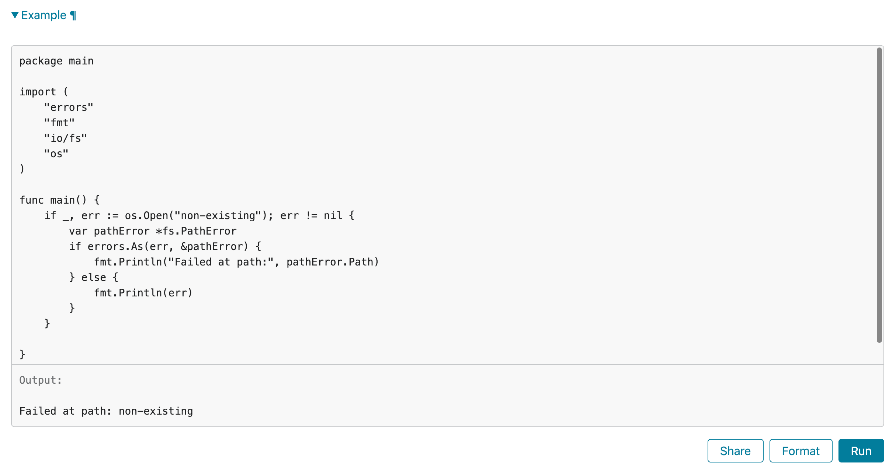

Go中的所有测试文件以`_test`结尾，并且与测试目标函数在同一个包下。

- 单元测试：测试用例以TestTagetFuncName命名，参数为`t testing.T`
- 基准测试：测试用例以BenchmarkTargetFuncName命名，参数为`b *testing.B`
- 网络测试：跟单元测试一致

在`*_test.go`文件中，有三种类型的函数:测试函数、基准测试函数、示例函数。一个**测试函数**是以Test 为函数名前缀的函数，用于测试程序的一些逻辑行为是否正确;go test命令会调用这些测试函数并报告 测试结果是PASS或FAIL。**基准测试函数**是以Benchmark为函数名前缀的函数，它们用于衡量一些函数的性 能;go test命令会多次运行基准函数以计算一个平均的执行时间。**示例函数**是以Example为函数名前缀 的函数，提供一个由编译器保证正确性的示例文档。

go test命令会遍历所有的`*_test.go`文件中符合上述命名规则的函数，然后生成一个临时的main包用于调用相应的测试函数，然后构建并运行、报告测试结果，最后清理测试中生成的临时文件。
# 单元测试

单元测试使用的是Go语言标准库`testing`进行测试。

Go 语言推荐测试文件和源代码文件放在一块，测试文件以 `_test.go` 结尾。比如，当前 package 有 `calc.go` 一个文件，我们想测试 `calc.go` 中的 `Add` 函数，那么应该新建 `calc_test.go` 作为测试文件。

```go
example/  
   |--calc.go  
   |--calc_test.go
```

假如`calc.go`的代码如下：

```go
func Add(a int, b int) int {  
    return a + b  
}
```

那么`calc_test.go`可以这样写

```go
func TestAdd(t *testing.T) {
	if ans := Add(1, 2); ans != 3 {
		t.Errorf("1 + 2 expected be 3,but %d got", ans)
	}

	if ans := Add(-10, -20); ans != -30 {
		t.Errorf("-10 + -20 expected be -30, but %d got", ans)
	}
}
```

- 测试用例名称一般命名为 `Test` 加上待测试的方法名，方法名要大写。
- 测试用的参数有且只有一个，在这里是 `t *testing.T`。 t 参数用于报告测试失败和附件的日志信息。
- 基准测试(benchmark)的参数是 `*testing.B`，TestMain 的参数是 `*testing.M` 类型。

运行 `go test`，该 package 下所有的测试用例都会被执行。

```go
$ go test  
ok      example 0.009s
```

或 `go test -v`，`-v` 参数会显示每个用例的测试结果，另外 `-cover` 参数可以查看覆盖率。如果没有参数指定包那么将默认采用当前目录对应的包.

```go
$ go test -v  
=== RUN   TestAdd  
--- PASS: TestAdd (0.00s)   
PASS  
ok      example 0.007s

```

如果只想运行其中的一个用例，例如 `TestAdd`，可以用 `-run` 参数指定，该参数支持通配符 `*`，和部分正则表达式，例如 `^`、`$`。

```go
$ go test -run TestAdd -v  
=== RUN TestAdd  
--- PASS: TestAdd (0.00s)  
PASS  
ok example 0.007s
```

失败的测试的输出并不包括调用 t.Errorf 时刻的堆栈调用信息. 不像其他语言或测试框架的 assert 断言, t.Errorf 调用也没有引起 panic 或停止测试的执行. 即使表格中前面的数据导致了测试的失败, 表格后面的测试数据依然会运行测试, 因此在一个测试中我们可能了解多个失败的信息.

测试失败的信息一般的形式是 "f(x) = y, want z", f(x) 解释了失败的操作和对应的输出, y 是实际 的运行结果, z 是期望的正确的结果. 就像前面检查回文字符串的例子, 实际的函数用于 f(x) 部分. 如果显示 x 是表格驱动型测试中比较重要的部分, 因为同一个断言可能对应不同的表格项执行多次. 要 避免无用和冗余的信息. 在测试类似 IsPalindrome 返回布尔类型的函数时, 可以忽略并没有额外信息 的 z 部分. 如果 x, y 或 z 是 y 的长度, 输出一个相关部分的简明总结即可.
## 子测试

子测试是 Go 语言内置支持的，可以在某个测试用例中，根据测试场景使用 `t.Run`创建不同的子测试用例：

```go
// calc_test.go  
  
func TestMul(t *testing.T) {  
	t.Run("pos", func(t *testing.T) {  
		if Mul(2, 3) != 6 {  
			t.Fatal("fail")  
		}  
  
	})  
	t.Run("neg", func(t *testing.T) {  
		if Mul(2, -3) != -6 {  
			t.Fatal("fail")  
		}  
	})  
}
```

- 之前的例子测试失败时使用 `t.Error/t.Errorf`，这个例子中使用 `t.Fatal/t.Fatalf`，区别在于前者遇错不停，还会继续执行其他的测试用例，后者遇错即停。

运行某个子测试：

```go
$ go test -run TestMul/pos -v  
=== RUN   TestMul  
=== RUN   TestMul/pos  
--- PASS: TestMul (0.00s)  
    --- PASS: TestMul/pos (0.00s)  
PASS  
ok      example 0.008s
```

对于多个子测试的场景，更推荐如下的写法(table-driven tests)：

```go
//  calc_test.go  
func TestMul(t *testing.T) {  
	cases := []struct {  
		Name           string  
		A, B, Expected int  
	}{  
		{"pos", 2, 3, 6},  
		{"neg", 2, -3, -6},  
		{"zero", 2, 0, 0},  
	}  
  
	for _, c := range cases {  
		t.Run(c.Name, func(t *testing.T) {  
			if ans := Mul(c.A, c.B); ans != c.Expected {  
				t.Fatalf("%d * %d expected %d, but %d got",  
					c.A, c.B, c.Expected, ans)  
			}  
		})  
	}  
}
```

所有用例的数据组织在切片 `cases` 中，看起来就像一张表，借助循环创建子测试。这样写的好处有：

- 新增用例非常简单，只需给 cases 新增一条测试数据即可。
- 测试代码可读性好，直观地能够看到每个子测试的参数和期待的返回值。
- 用例失败时，报错信息的格式比较统一，测试报告易于阅读。

如果数据量较大，或是一些二进制数据，推荐使用相对路径从文件中读取。
## 帮助函数

对一些重复的逻辑，抽取出来作为公共的帮助函数(helpers)，可以增加测试代码的可读性和可维护性。 借助帮助函数，可以让测试用例的主逻辑看起来更清晰。

例如，我们可以将创建子测试的逻辑抽取出来：

```go
// calc_test.go  
package main  
  
import "testing"  
  
type calcCase struct{ A, B, Expected int }  
  
func createMulTestCase(t *testing.T, c *calcCase) {  
	// t.Helper()  
	if ans := Mul(c.A, c.B); ans != c.Expected {  
		t.Fatalf("%d * %d expected %d, but %d got",  
			c.A, c.B, c.Expected, ans)  
	}  
  
}  
  
func TestMul(t *testing.T) {  
	createMulTestCase(t, &calcCase{2, 3, 6})  
	createMulTestCase(t, &calcCase{2, -3, -6})  
	createMulTestCase(t, &calcCase{2, 0, 1}) // wrong case  
}

```

在这里，我们故意创建了一个错误的测试用例，运行 `go test`，用例失败，会报告错误发生的文件和行号信息：

```go
$ go test  
--- FAIL: TestMul (0.00s)  
    calc_test.go:11: 2 * 0 expected 1, but 0 got  
FAIL  
exit status 1  
FAIL    example 0.007s
```

可以看到，错误发生在第11行，也就是帮助函数 `createMulTestCase` 内部。18, 19, 20行都调用了该方法，我们第一时间并不能够确定是哪一行发生了错误。有些帮助函数还可能在不同的函数中被调用，报错信息都在同一处，不方便问题定位。因此，Go 语言在 1.9 版本中引入了 `t.Helper()`，用于标注该函数是帮助函数，报错时将输出帮助函数调用者的信息，而不是帮助函数的内部信息。

修改 `createMulTestCase`，调用 `t.Helper()`

```go
func createMulTestCase(c *calcCase, t *testing.T) {  
    t.Helper()  
	t.Run(c.Name, func(t *testing.T) {  
		if ans := Mul(c.A, c.B); ans != c.Expected {  
			t.Fatalf("%d * %d expected %d, but %d got",  
				c.A, c.B, c.Expected, ans)  
		}  
	})  
}
```

运行 `go test`，报错信息如下，可以非常清晰地知道，错误发生在第 20 行。

```go
$ go test  
--- FAIL: TestMul (0.00s)  
    calc_test.go:20: 2 * 0 expected 1, but 0 got  
FAIL  
exit status 1  
FAIL    example 0.006s
```

关于 `helper` 函数的 2 个建议：

- 不要返回错误， 帮助函数内部直接使用 `t.Error` 或 `t.Fatal` 即可，在用例主逻辑中不会因为太多的错误处理代码，影响可读性。
- 调用 `t.Helper()` 让报错信息更准确，有助于定位。
## setup和teardown

如果在同一个测试文件中，每一个测试用例运行前后的逻辑是相同的，一般会写在 setup 和 teardown 函数中。例如执行前需要实例化待测试的对象，如果这个对象比较复杂，很适合将这一部分逻辑提取出来；执行后，可能会做一些资源回收类的工作，例如关闭网络连接，释放文件等。标准库 `testing` 提供了这样的机制：

```go
func setup() {
	fmt.Println("Before all tests")
}

func teardown() {
	fmt.Println("After all tests")
}

func Test1(t *testing.T) {
	fmt.Println("I'm test1")
}

func Test2(t *testing.T) {
	fmt.Println("I'm test2")
}

func TestMain(m *testing.M) {
	setup()
	code := m.Run()
	teardown()
	os.Exit(code)
}
```

- 在这个测试文件中，包含有2个测试用例，`Test1` 和 `Test2`。
- 如果测试文件中包含函数 `TestMain`，那么生成的测试将调用 TestMain(m)，而不是直接运行测试。
- 调用 `m.Run()` 触发所有测试用例的执行，并使用 `os.Exit()` 处理返回的状态码，如果不为0，说明有用例失败。
- 因此可以在调用 `m.Run()` 前后做一些额外的准备(setup)和回收(teardown)工作。

执行 `go test`，将会输出

```go
$ go test
Before all tests
I'm test1
I'm test2
PASS
After all tests
ok      example 0.006s
```
# 网络测试

针对 http 开发的场景，使用标准库 `net/http/httptest` 进行测试更为高效。

```go
package main

import (
	"fmt"
	"io/ioutil"
	"net/http"
	"net/http/httptest"
	"testing"
)

// helloHandler 是一个简单的 HTTP 处理器，返回 "hello world"
func helloHandler(w http.ResponseWriter, r *http.Request) {
	fmt.Fprint(w, "hello world")
}

func TestConn(t *testing.T) {
	// 创建一个新的 HTTP 请求
	req := httptest.NewRequest("GET", "http://example.com/foo", nil)
	// 创建一个新的 HTTP 响应记录器
	w := httptest.NewRecorder()
	// 调用 helloHandler 处理请求
	helloHandler(w, req)
	// 读取响应的主体
	bytes, _ := ioutil.ReadAll(w.Result().Body)

	// 检查响应内容是否为 "hello world"
	if string(bytes) != "hello world" {
		t.Fatal("expected hello world, but got", string(bytes))
	}
}
```

# 基准测试

基准测试（benchmark）是 go testing 库提供的，用来度量程序性能，算法优劣的利器。

基准测试报告每一列值对应的含义如下：

```go
type BenchmarkResult struct {  
    N         int           // 迭代次数  
    T         time.Duration // 基准测试花费的时间  
    Bytes     int64         // 一次迭代处理的字节数  
    MemAllocs uint64        // 总的分配内存的次数  
    MemBytes  uint64        // 总的分配内存的字节数  
}
```

```go
// 编写被测函数
// main.go
package main

func Fib(n int) int {
	if n < 2 {
		return n
	}
	return Fib(n-1) + Fib(n-2)
}

func main() {

}

// 编写测试用例
// main_test.go
package main  
  
import "testing"  
  
func BenchmarkFib10(b *testing.B) {  
    for n := 0; n < b.N; n++ {  
       Fib(10)  
    }  
}  
  
func BenchmarkFib20(b *testing.B) {  
    for n := 0; n < b.N; n++ {  
       Fib(20)  
    }  
}
```

- `go test [packages]` 指定测试范围

|方法一|方法二|
|---|---|---|
|运行当前 package 内的用例|go test packageName|go test .|
|运行子 package 内的用例|go test packageName/subName|go test ./subName|
|递归运行所有的用例|go test packageName/...|go test ./...|

- `go test` 命令默认不执行 benchmark 测试，需要加上 `-bench` 参数，该参数支持正则表达式，只有匹配到的测试用例才会执行，使用 `.` 则运行所有测试用例
```go
# go test -bench=".*Fib.*" .
goos: darwin
goarch: arm64
pkg: test1
cpu: Apple M3 Pro
BenchmarkFib10-12        6945440               148.6 ns/op
BenchmarkFib20-12          65966             18432 ns/op
PASS
ok      test1   2.776s

```
- BenchmarkFib10-12：即 `GOMAXPROCS`，默认等于 CPU 核数
-  `6945440 148.6 ns/op`：表示在单位时间内（默认是1s）被测函数运行了6945440，每次运行耗时148.6 ns。
- `ok      test1   2.776s`：表示本次测试总耗时。
## 参数

| 参数                 | 说明                   |
| ------------------ | -------------------- |
| -benchtime t\[\|x] | 指定测试至少使用时间或测试用例运行总次数 |
| -count n           | 指定测试执行次数             |
| -cpu n             | 指定测试用例使用的CPU核心数      |
| -benchmem          | 测试用例显示内存属性           |
| -race              | 报告测试用例中的数据竞争问题       |
```go
# go test -bench=".*Fib.*" -benchtime=1000x  .
goos: darwin
goarch: arm64
pkg: test1
cpu: Apple M3 Pro
BenchmarkFib10-12           1000               390.7 ns/op
BenchmarkFib20-12           1000             34976 ns/op
PASS
ok      test1   0.207s


# go test -bench=".*Fib.*" -count=3  .        
goos: darwin
goarch: arm64
pkg: test1
cpu: Apple M3 Pro
BenchmarkFib10-12        7158513               149.1 ns/op
BenchmarkFib10-12        8126667               149.6 ns/op
BenchmarkFib10-12        8212851               147.6 ns/op
BenchmarkFib20-12          66843             18019 ns/op
BenchmarkFib20-12          66022             18513 ns/op
BenchmarkFib20-12          64130             18534 ns/op
PASS
ok      test1   8.309s

// 这里看到使用6个核心性能就不会再上升了
#  go test -bench=".*Fib.*" -cpu=1,2,4,6,8  .
goos: darwin
goarch: arm64
pkg: test1
cpu: Apple M3 Pro
BenchmarkFib10           7026470               155.9 ns/op
BenchmarkFib10-2         7953574               147.6 ns/op
BenchmarkFib10-4         7234066               147.4 ns/op
BenchmarkFib10-6         8240185               147.2 ns/op
BenchmarkFib10-8         7673361               146.9 ns/op
BenchmarkFib20             65749             18297 ns/op
BenchmarkFib20-2           65668             18423 ns/op
BenchmarkFib20-4           65403             18649 ns/op
BenchmarkFib20-6           65172             19101 ns/op
BenchmarkFib20-8           63703             18575 ns/op
PASS
ok      test1   13.644s

// 每次分配0个字节的内存，分配0次
# go test -bench=".*Fib.*" -benchmem  .
goos: darwin
goarch: arm64
pkg: test1
cpu: Apple M3 Pro
BenchmarkFib10-12        7144215               151.7 ns/op             0 B/op          0 allocs/op
BenchmarkFib20-12          65829             18396 ns/op               0 B/op          0 allocs/op
PASS
ok      test1   2.819s

```
## 其他函数

如果在编写测试用例时，需要一些前期准备工作，这个时候就可以使用下面三个函数来将这部分耗时去掉。

- b.ResetTimer()：重置计时器，忽略前面的准备时间
- b.StopTimer()/b.StartTimer()：暂停计时和开始计时
## 并发性能

在基准测试中，可以使用`RunParallel`来测试并发性能

```go
package main  
  
import "testing"  
  
func BenchmarkFib20(b *testing.B) {  
    for n := 0; n < b.N; n++ {  
       Fib(20)  
    }  
}  
  
func BenchmarkFibParallel20(b *testing.B) {  
    b.SetParallelism(4)  // 设置并行度
    b.RunParallel(func(pb *testing.PB) {  
       for pb.Next() {  // pb.Next控制循环次数到b.N次
          Fib(20)  
       }  
    })  
}

/*
goos: darwin
goarch: arm64
pkg: test1
cpu: Apple M3 Pro
BenchmarkFib20-6                   57039             18897 ns/op
BenchmarkFibParallel20-6          348778              3397 ns/op
PASS
ok      test1   2.963s

*/
```

这里可以看到设置在4个goroutine中运行比1个的时候快了6倍左右。

调用了 b.RunParallel 方法的测试函数将会在单独的 goroutine 中启动。 需要注意的是，b.StartTimer、b.StopTime、b.ResetTimer 三个方法会影响到所有 goroutine，因此不要在并行测试中调用。

并行基准测试其并发度受环境变量 GOMAXPROCS 控制，默认情况下是 CPU 核心数。 可以在测试开始前，通过 b.SetParallelism 方法实现对并发度的控制，例如执行b.SetParallelism(2) 则意味着并发度为 2\*GOMAXPROCS。
# 性能分析

Go语言支持多种类型的剖析性能分析, 每一种关注不同的方面, 但它们都涉及到每个采样记录的感兴趣 的一系列事件消息, 每个事件都包含函数调用时函数调用堆栈的信息. 内建的 `go test` 工具对几种分析 方式都提供了支持.

CPU分析文件标识了函数执行时所需要的CPU时间. 当前运行的系统线程在每隔几毫秒都会遇到操作系统 的中断事件, 每次中断时都会记录一个分析文件然后恢复正常的运行.

堆分析则记录了程序的内存使用情况. 每个内存分配操作都会触发内部平均内存分配例程, 每个 512KB 的内存申请都会触发一个事件.

阻塞分析则记录了goroutine最大的阻塞操作, 例如系统调用, 管道发送和接收, 还有获取锁等. 分析库 会记录每个goroutine被阻塞时的相关操作.

在测试环境下只需要一个标志参数就可以生成各种分析文件. 当一次使用多个标志参数时需要当心, 因 为分析操作本身也可能会影像程序的运行.

```go
 $ go test -cpuprofile=cpu.out
 $ go test -blockprofile=block.out
 $ go test -memprofile=mem.out
```
# 示例函数

 以 Example 为函数名开头. 示例函数没有函数参数和返 回值. 

```go
 func ExampleIsPalindrome() {
     fmt.Println(IsPalindrome("A man, a plan, a canal: Panama"))
     fmt.Println(IsPalindrome("palindrome"))
     // Output:
     // true
     // false
}
```

示例函数有三个用处. 最主要的一个是**用于文档**: 一个包的例子可以更简洁直观的方式来演示函数的用 法, 会文字描述会更直接易懂, 特别是作为一个提醒或快速参考时. 一个例子函数也可以方便展示属于 同一个接口的几种类型或函数直接的关系, 所有的文档都必须关联到一个地方, 就像一个类型或函数声 明都统一到包一样. 同时, 示例函数和注释并不一样, 示例函数是完整真是的Go代码, 需要介绍编译器 的编译时检查, 这样可以保证示例代码不会腐烂成不能使用的旧代码.

根据示例函数的后缀名部分, godoc 的web文档会将一个示例函数关联到某个具体函数或包本身, 因此 ExampleIsPalindrome 示例函数将是 IsPalindrome 函数文档的一部分, Example 示例函数将是包文档 的一部分.

示例文档的第二个用处是**在 go test 执行测试的时候也运行示例函数测试**. 如果示例函数内含有类似上 面例子中的 / Output: 这样的注释, 那么测试工具会执行这个示例函数, 然后检测这个示例函数的标准 输出和注释是否匹配.

示例函数的第三个目的**提供一个真实的演练场**. golang.org 是由 dogoc 提供的服务, 它使用了 Go Playground 技术让用户可以在浏览器中在线编辑和运行每个示例函数, 就像图所示的那样. 这 通常是学习函数使用或Go语言特性的最快方式.

```go
func ExampleAs() {  
    if _, err := os.Open("non-existing"); err != nil {  
       var pathError *fs.PathError  
       if errors.As(err, &pathError) {  
          fmt.Println("Failed at path:", pathError.Path)  
       } else {  
          fmt.Println(err)  
       }  
    }  
  
    // Output:  
    // Failed at path: non-existing}
```

