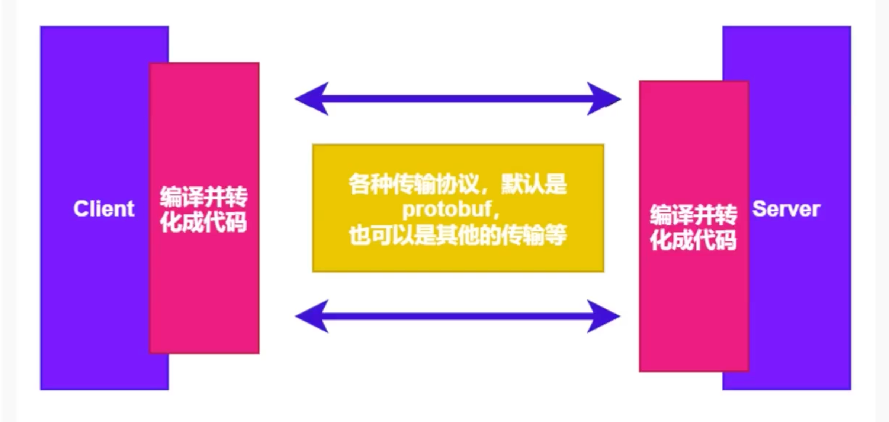

# gRPC

## 1 gRPC

**gRPC是什么？**

根据[官方文档](https://grpc.io/)的话来说，**A high performance, open source universal RPC framework**，也就是一个高性能的开源RPC框架。

在gRPC中，我们称调用方为client，被调用方为server。跟其他RPC框架一样，gRPC也是基于 **服务定义** 思想。简单来说，就是我们通过一种方式来描述一个服务，这种描述方式跟语言无关。在这个服务定义的过程中，我们描述了我们提供的服务名是什么，有哪些方法可以被调用，这些方法有什么样的入参，有什么样的回参。

也就是说，在定义好这些服务，这些方法之后，gRPC会屏蔽底层的细节，client只需要直接调用定义好的方法，就能拿到预期的返回结果。对于server端来说，还需要实现我们定义的方法。同样的，gRPC也会帮我们屏蔽底层的细节，我们只需要实现所定义的方法的具体逻辑即可。

在上述描述过程中，所谓的"服务定义"，跟接口是很接近的。更像是一种约定，双方约定好接口，然后server实现这个接口，client调用这个接口的代理对象。至于其他的细节，交给gRPC。

此外，gRPC还是语言无关的。可以使用C++作为服务端，使用Java，Go等作为客户端。为了实现这一点，在定义服务和编码和解码的过程中，应该做到语言无关。

因此，gRPC使用了 `Protocol Buffss`作为接口描述语言，这是谷歌开源的一套成熟的数据结构序列化机制。

这个工具可以把我们定义的方法，转换成特定语言的代码。比如你定义了一种类型的参数，他会帮你转换成Go中的struct结构体，你定义的方法，他会帮你转换成func函数，此外，在发送请求和接受响应的时候，这个工具还会完成对应的编码和解码工作，将你即将发送的数据编码成gRPC能够传输的形式，又或者将即将接收到的数据解码为编程语言能够理解的数据格式。

> 序列化：将数据结构或对象转换成二进制串的过程\
> 反序列化：将在序列化过程中所产生的二进制串转换成数据结构或对象的过程

`protobuf`是谷歌开源的一种数据格式，适合高性能，对响应速度有要求的数据传输场景。因为protobuf是二进制数据格式，需要编码和解码。数据本身不具有可读性。因此只能反序列化之后得到真正可读的数据。

**优势：**

1. 序列化后的体积比XML/JSON更加，适合网络传输
2. 支持跨平台多语言
3. 消息格式升级和兼容性不错
4. 序列化和反序列化速度很快

可以查看[gPRC中文文档](https://doc.oschina.net/grpc?t=56831)，或[gPRC官方文档](https://grpc.io/)查看更多gRPC详细信息。

## 2 gRPC使用

* 下载

```go
go get google.golang.org/grpc // gRPC库

// 按照生成go代码的插件
go install google.golang.org/protobuf/cmd/protoc-gen-go@latest
go install google.golang.org/grpc/cmd/protoc-gen-go-grpc@latest
```

使用gRPC之前要先编写[Protobuf](Protobuf/Protobuf.md)。

## 3 编写服务端

* 创建 gRPC Server对象，可以理解为是Server端的抽象对象
* 将server(包含需要被调用的服务端接口)注册到gRPC Server的内部注册中心。这样可以在接受到请求时，通过内部的服务发现，发现该服务端接口并转接进行逻辑处理
* 创建Listen，监听TCP端口
* gRPC Server开始list.Accept，直到Stop

```go
package main  
  
import (  
    "context"  
    "fmt"    pb "go-rpc/hello-server/proto"  
    "google.golang.org/grpc"    "net")  
  
type server struct {  
    pb.UnimplementedSayHelloServer  
}  
  
func (s *server) SayHello(c context.Context, re *pb.HelloRequest) (*pb.HelloResponse, error) {  
    return &pb.HelloResponse{ResponseMsg: fmt.Sprintf("%s SayHello", re.RequestName)}, nil  
}  
  
func main() {  
    // 开启端口  
    listen, _ := net.Listen("tcp", ":9090")  
  
    // 创建gRPC服务  
    grpcServer := grpc.NewServer()  
    // 在grpc服务端注册自己编写的服务  
    pb.RegisterSayHelloServer(grpcServer, &server{})  
  
    // 启动服务  
    err := grpcServer.Serve(listen)  
    if err != nil {  
       fmt.Println(err)  
    }  
}
```

## 4 编写客户端

* 创建与给定目标(服务端)的连接交互
* 创建Server的客户端对象
* 发送RPC请求，等待同步响应，得到回调后返回响应结果
* 输出响应结果

```go
package main  
  
import (  
    "context"  
    "fmt"    pb "go-rpc/hello-server/proto"  
    "google.golang.org/grpc"    "google.golang.org/grpc/credentials/insecure"    "log")  
  
func main() {  
    // 连接到server端，此处禁用安全传输，没有加密和验证  
    c, err := grpc.NewClient("localhost:9090", grpc.WithTransportCredentials(insecure.NewCredentials()))  
    if err != nil {  
       log.Fatal(err)  
    }  
    defer c.Close()  
  
    // 建立连接  
    client := pb.NewSayHelloClient(c)  
  
    // 执行rpc调用，在服务器端实现并返回结果  
    resp, _ := client.SayHello(context.Background(), &pb.HelloRequest{RequestName: "kelly"})  
    fmt.Println(resp.GetResponseMsg())  
  
}
```

## 5 认证-安全传输

`gRPC` 是一个典型的C/S模型，需要开发客户端和服务端，客户端与服务端需要达成协议，使用某一个确认的传输协议来传输数据，gRPC通常默认是使用protobuf来作为传输协议，当然也可以使用其他自定义的。

所以需要使用一种认证，来让客户端知道自己的数据是发送给哪一个明确的服务端，让服务端知道自己的数据要返回给谁。

此处说到的认证，不是用户的身份认证，而是指多个server和多个client之间，如何识别对方是谁，并且可以安全的进行数据传输。

* SSL/TLS认证方式（采用http2协议）
* 基于token的认证方式（基于安全连接）
* 不采用任何措施的连接，这是不安全的连接（默认采用http1）
* 自定义的身份认证

客户端和服务端之间调用，可以通过加入证书的方式，实现调用的安全性。

TLS（Transport Layer Security，安全传输层），TLS是建立在传输层TCP协议之上的协议，服务于应用层，它的前身是SSL（Secure Socket Layer，安全套接字层），它实现了将应用层的报文进行加密后再交由TCp进行传输的功能

TLS主要解决如下三个网络安全问题：

1. 保密，保密通过加密encryption实现，所有信息都加密传输，第三方无法嗅探
2. 完整性，通过MAC校验机制，一旦被篡改，通信双方会立刻发现
3. 认证，双方认证，双方都可以配备证书，防止身份被冒充

> 生产环境可以购买证书或者使用一些平台发放的免费证书

key：服务器上的私钥文件，用于对发送给客户端数据的加密，以及对从客户端接收到数据的解密

csr：证书签名请求文件，用于提交给证书颁发机构(CA)对证书签名

crt：由证书颁发机构签名后的证书，或者是开发者自签名的证书，包含证书持有人信息，持有人公钥，以及签署者的签名信息

pem：是基于Base64编码的证书格式，扩展名包括PEM，CRT和CER

### 5.1 SSL/TLS认证方式

```bash
// 生成私钥
openssl genrsa -out server.key 2048

// 生成证书
openssl req -new -x509 -key server.key -out server.crt -days 36500
-----
Country Name (2 letter code) [AU]:
State or Province Name (full name) [Some-State]:
Locality Name (eg, city) []:
Organization Name (eg, company) [Internet Widgits Pty Ltd]:
Organizational Unit Name (eg, section) []:
Common Name (e.g. server FQDN or YOUR name) []:
Email Address []:

// 生成csr
openssl req -new -key server.key -out server.csr
-----
Country Name (2 letter code) [AU]:
State or Province Name (full name) [Some-State]:
Locality Name (eg, city) []:
Organization Name (eg, company) [Internet Widgits Pty Ltd]:
Organizational Unit Name (eg, section) []:
Common Name (e.g. server FQDN or YOUR name) []:
Email Address []:

Please enter the following 'extra' attributes
to be sent with your certificate request
A challenge password []:
An optional company name []:
```

```bash
# 复制一份openssl.cnf文件到当前项目，修改以下内容

# Extension copying option: use with caution.  
copy_extensions = copy

req_extensions = v3_req # The extensions to add to a certificate request

[ v3_req ]  
subjectAltName = @alt_names

[ alt_names ]  
DNS.1 = *.kelly.com

%% 1. ​**​`copy_extensions = copy`​**​
    
    - ​**​作用​**​：允许在签发证书时，将证书请求（CSR）中的扩展字段（如SAN）复制到最终证书中。
    - ​**​场景​**​：当CA需要继承CSR中的扩展信息时使用，确保动态生成的SAN等信息被包含在证书里。
2. ​**​`req_extensions = v3_req`​**​
    
    - ​**​作用​**​：指定生成证书请求时应包含的扩展部分，此处指向`[v3_req]`块。
    - ​**​场景​**​：在创建CSR时激活X.509 v3扩展，如主题备用名称（SAN）。
3. ​**​[v3_req] 块中的 `subjectAltName = @alt_names`​**​
    
    - ​**​作用​**​：定义主题备用名称（SAN），引用`alt_names`部分的列表。
    - ​**​场景​**​：为证书配置多个域名或IP地址 %%
```

```bash
// 生成证书私钥
openssl genpkey -algorithm RSA -out test.key

// 通过私钥生成证书请求文件
openssl req -new -nodes -key test.key -out test.csr -days 3650 -subj "/C=cn/OU=myorg/O=mycomp/CN=myname" -config ./openssl.cnf -extensions v3_req

// 生成SAN证书
openssl x509 -req -days 365 -in test.csr -out test.pem -CA server.crt -CAkey server.key -CAcreateserial -extfile ./openssl.cnf -extensions v3_req

```

```go
// server
package main  
  
import (  
    "context"  
    "fmt"    pb "go-rpc/hello-server/proto"  
    "google.golang.org/grpc"    "google.golang.org/grpc/credentials"    "net")  
  
type server struct {  
    pb.UnimplementedSayHelloServer  
}  
  
func (s *server) SayHello(c context.Context, re *pb.HelloRequest) (*pb.HelloResponse, error) {  
    return &pb.HelloResponse{ResponseMsg: fmt.Sprintf("%s SayHello", re.RequestName)}, nil  
}  
  
func main() {  

    // 加载证书和私钥
    creds, err := credentials.NewServerTLSFromFile("/Users/ayohuang/GolandProjects/go-rpc/key/test.pem", "/Users/ayohuang/GolandProjects/go-rpc/key/test.key")  
    if err != nil {  
       fmt.Println(err)  
    }  
  
    // 开启端口  
    listen, _ := net.Listen("tcp", ":9090")  
  
    // 创建gRPC服务，使用证书认证
    grpcServer := grpc.NewServer(grpc.Creds(creds))  
    // 在grpc服务端注册自己编写的服务  
    pb.RegisterSayHelloServer(grpcServer, &server{})  
  
    // 启动服务  
    err = grpcServer.Serve(listen)  
    if err != nil {  
       fmt.Println(err)  
    }  
}

// client
package main  
  
import (  
    "context"  
    "fmt"    pb "go-rpc/hello-server/proto"  
    "google.golang.org/grpc"    "google.golang.org/grpc/credentials"    "log")  
  
func main() {  
    creds, err := credentials.NewClientTLSFromFile("/Users/ayohuang/GolandProjects/go-rpc/key/test.pem", "*.kelly.com")  
  
    c, err := grpc.NewClient("localhost:9090", grpc.WithTransportCredentials(creds))  
    if err != nil {  
       log.Fatal(err)  
    }  
    defer c.Close()  
  
    // 建立连接  
    client := pb.NewSayHelloClient(c)  
  
    // 执行rpc调用，在服务器端实现并返回结果  
    resp, _ := client.SayHello(context.Background(), &pb.HelloRequest{RequestName: "kelly"})  
    fmt.Println(resp.GetResponseMsg())  
  
}
```

### 5.2 Token认证

```go
// server
package main  
  
import (  
    "context"  
    "errors"    "fmt"    pb "go-rpc/hello-server/proto"  
    "google.golang.org/grpc"    "google.golang.org/grpc/metadata"    "net")  
  
type server struct {  
    pb.UnimplementedSayHelloServer  
}  
  
func (s *server) SayHello(c context.Context, re *pb.HelloRequest) (*pb.HelloResponse, error) {  
    md, ok := metadata.FromIncomingContext(c)  
    if !ok {  
       return nil, errors.New("没有token信息")  
    }  
    var appId string  
    var appKey string  
  
    if v, ok := md["appid"]; ok {  
       appId = v[0]  
    }  
  
    if v, ok := md["appkey"]; ok {  
       appKey = v[0]  
    }  
    if appId != "kelly" || appKey != "123132" {  
       return nil, errors.New("token信息错误")  
    }  
  
    return &pb.HelloResponse{ResponseMsg: fmt.Sprintf("%s SayHello", re.RequestName)}, nil  
}  
  
func main() {  
    //creds, err := credentials.NewServerTLSFromFile("/Users/ayohuang/GolandProjects/go-rpc/key/test.pem", "/Users/ayohuang/GolandProjects/go-rpc/key/test.key")  
    //if err != nil {    // fmt.Println(err)    //}  
    // 开启端口  
    listen, _ := net.Listen("tcp", ":9090")  
  
    // 创建gRPC服务  
    grpcServer := grpc.NewServer()  
    // 在grpc服务端注册自己编写的服务  
    pb.RegisterSayHelloServer(grpcServer, &server{})  
  
    // 启动服务  
    err := grpcServer.Serve(listen)  
    if err != nil {  
       fmt.Println(err)  
    }  
}

// client
package main  
  
import (  
    "context"  
    "fmt"    pb "go-rpc/hello-server/proto"  
    "google.golang.org/grpc"    "google.golang.org/grpc/credentials/insecure"    "log")  
  
//type PerRPCCredentials interface {  
//  GetRequestMetadata(ctx context.Context, uri ...string) (map[string]string, error)  
//  RequireTransportSecurity() bool  
//}  

// 实现PerRPCCredentials
type ClientTokenAuth struct {  
}  

// 获取客户端提供的元数据
func (c ClientTokenAuth) GetRequestMetadata(ctx context.Context, uri ...string) (map[string]string, error) {  
    return map[string]string{  
       "appId":  "kelly",  
       "appKey": "123132",  
    }, nil  
}  
  
// 是否带安全认证  
func (c ClientTokenAuth) RequireTransportSecurity() bool {  
    return false  
}  
  
func main() {  
    //creds, err := credentials.NewClientTLSFromFile("/Users/ayohuang/GolandProjects/go-rpc/key/test.pem", "*.kelly.com")  
  
    var opts []grpc.DialOption  
    opts = append(opts, grpc.WithTransportCredentials(insecure.NewCredentials()))  
    opts = append(opts, grpc.WithPerRPCCredentials(new(ClientTokenAuth)))  
  
    c, err := grpc.NewClient("localhost:9090", opts...)  
    if err != nil {  
       log.Fatal(err)  
    }  
    defer c.Close()  
  
    // 建立连接  
    client := pb.NewSayHelloClient(c)  
  
    // 执行rpc调用，在服务器端实现并返回结果  
    resp, err := client.SayHello(context.Background(), &pb.HelloRequest{RequestName: "kelly"})  
    if err != nil {  
       fmt.Println(err)  
    } else {  
       fmt.Println(resp.GetResponseMsg())  
    }  
  
}
```
