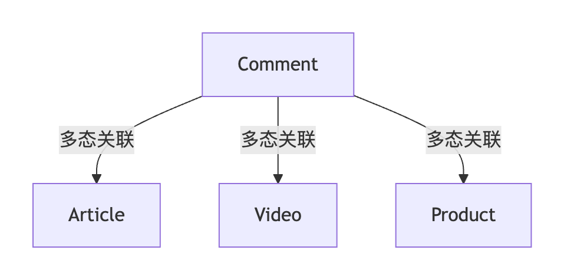

多态关联是 ORM 中处理​**​一个模型可关联多种不同类型模型​**​的高级技术，它解决了传统外键无法灵活适应多类型关联的问题。目前支持 `has one` 和 `has many`


- ​**​一个模型​**​（如 `Comment`）可关联​**​多个不同类型模型​**​（如 `Article`, `Video`, `Product`）
    
- ​**​技术实现​**​：使用 ​**​类型字段 + ID字段​**​ 替代传统外键
    
    - `commentable_id`：关联对象ID
        
    - `commentable_type`：关联对象类型（如 "Article", "Video"）

默认情况下 `polymorphic:<value>` 将在列类型和列 ID 前加上 `<value>` 前缀。

```go
// 评论模型（多态发起方）
type Comment struct {
    ID             uint
    Content        string
    CommentableID  uint      // 关联ID
    CommentableType string    // 关联类型
}

// 文章模型（被关联方）
type Article struct {
    ID      uint
    Title   string
    Comments []Comment `gorm:"polymorphic:Commentable;"` // 关键标签
}

// 视频模型（被关联方）
type Video struct {
    ID      uint
    Title   string
    Comments []Comment `gorm:"polymorphic:Commentable;"`
}

```


可以使用以下 GORM 标签单独指定多态属性：

-  `polymorphicType` ：指定列类型。

- `polymorphicId` ：指定列 ID。

- `polymorphicValue` ：指定类型的值。

| **标签​**​           | ​**​功能​**​ | ​**​默认值​**​     | ​**​适用场景​**​ |
| ------------------ | ---------- | --------------- | ------------ |
| `polymorphicType`  | 指定类型字段名    | `关联名 + "_type"` | 需要自定义类型字段名   |
| `polymorphicId`    | 指定关联ID字段名  | `关联名 + "_id"`   | 需要自定义ID字段名   |
| `polymorphicValue` | 指定类型字段值    | 模型名称            | 需要自定义存储值     |
```go
type Dog struct {
  ID   int
  Name string
  Toys []Toy `gorm:"polymorphicType:Kind;polymorphicId:OwnerID;polymorphicValue:master"`
}

type Toy struct {
  ID        int
  Name      string
  OwnerID   int
  Kind      string
}

db.Create(&Dog{Name: "dog1", Toys: []Toy{{Name: "toy1"}, {Name: "toy2"}}})
// INSERT INTO `dogs` (`name`) VALUES ("dog1")
// INSERT INTO `toys` (`name`,`owner_id`,`kind`) VALUES ("toy1",1,"master"), ("toy2",1,"master")

```
