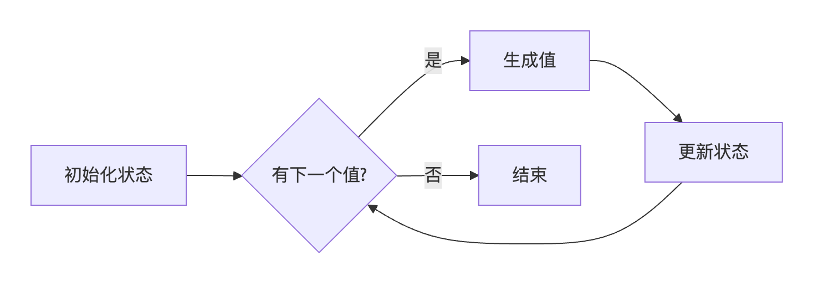

# range迭代器实现

在 Go 中实现迭代器函数是处理大型数据集或流式数据的核心技能。

**迭代器三要素**

1. ​**​状态保持​**​：记录当前迭代位置
2. ​**​值生成​**​：按需产生下一个值
3. ​**​终止条件​**​：检测迭代结束

 **实现方式对比**

| ​**​实现方式​**​ | ​**​优点​**​  | ​**​缺点​**​  | ​**​适用场景​**​ |
| ------------ | ----------- | ----------- | ------------ |
| 闭包迭代器        | 简单直接，无额外开销  | 状态复杂时代码臃肿   | 简单线性迭代       |
| 结构体迭代器       | 状态管理清晰，可复用  | 需要定义类型      | 复杂状态迭代       |
| 通道迭代器        | 原生支持并发，流式处理 | 通道开销，可能阻塞   | 并发生产-消费场景    |
| Go 1.22+ 生成器 | 语法简洁，内存高效   | 需要 Go 1.22+ | 所有新项目        |

## 闭包迭代器

```go
func SliceIterator(s []string) func() (string, bool) {  
    i := 0  
    return func() (string, bool) {  
       if i < len(s) {  
          val := s[i]  
          i++  
          return val, true  
       }  
       return "", false  
    }  
}  
  
func main() {  
    iters := SliceIterator([]string{"hello", "me", "too"})  
    for {  
       if v, ok := iters(); !ok {  
          break  
       } else {  
          fmt.Println(v)  
       }  
  
    }  
}
```

## 结构体迭代器

```go
type Iterator[T any] interface {
    Next() bool
    Value() T
    Err() error
}

// 文件行迭代器
type LineIterator struct {
    scanner *bufio.Scanner
    current string
    err     error
}

func NewLineIterator(r io.Reader) *LineIterator {
    return &LineIterator{
        scanner: bufio.NewScanner(r),
    }
}

func (it *LineIterator) Next() bool {
    if it.scanner.Scan() {
        it.current = it.scanner.Text()
        return true
    }
    it.err = it.scanner.Err()
    return false
}

func (it *LineIterator) Value() string {
    return it.current
}

func (it *LineIterator) Err() error {
    return it.err
}

// 使用
file, _ := os.Open("data.txt")
defer file.Close()

iter := NewLineIterator(file)
for iter.Next() {
    fmt.Println(iter.Value())
}
if err := iter.Err(); err != nil {
    log.Fatal("读取错误:", err)
}
```

## 通道迭代器

```go
func ChannelIterator(s []string) <-chan string {
    ch := make(chan string)
    go func() {
        defer close(ch)
        for _, v := range s {
            ch <- v
        }
    }()
    return ch
}

// 使用
for val := range ChannelIterator([]string{"X", "Y", "Z"}) {
    fmt.Println(val) // 输出 X, Y, Z
}
```
