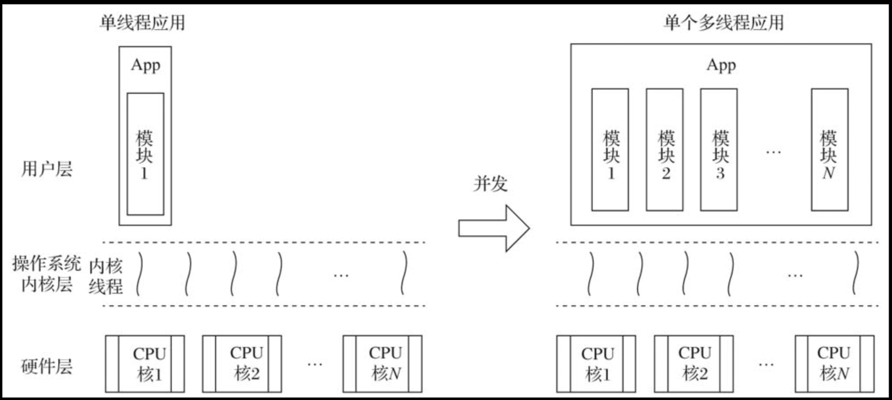
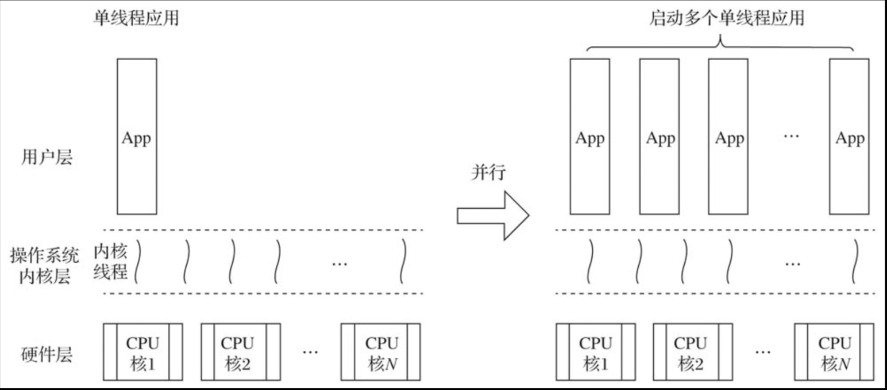

# 并发设计

> 并发不是并行，并发关乎结构，并行关乎执行。 ——Rob Pike，Go语言之父

## 并发与并行

1. ​**​并发（Concurrency）： 处理多个任务的能力​**​
   * ​**​核心思想：​**​ 在​**​一段时间内​**​，多个任务都取得了进展。它关注的是​**​任务的管理和结构​**​。
   * ​**​关键特质：​**​
     * ​**​应对阻塞/等待：​**​ 最主要目的是让系统在遇到某些任务阻塞（如等待 I/O、网络响应、用户输入）时，CPU 不闲着，可以去执行其他​**​就绪​**​的任务。当一个任务在等待，另一个任务就能得到 CPU 时间。资源利用率和系统响应能力。
     * ​**​逻辑上的同时性：​**​ 从用户或外部观察者的角度看，多个任务似乎是“同时”在进行的。比如一个 Web 服务器“同时”处理成千上万个用户的请求。
     * ​**​单核即可实现：​**​ 在只有一个 CPU 核心的情况下，并发是通过在任务之间​**​快速切换执行​**​来实现的。操作系统或运行时环境进行调度，将 CPU 时间片分配给不同的任务。宏观上看任务在同时推进，微观上看它们是​**​交错执行​**​的。
     * ​**​结构设计：​**​ 并发更关注程序的组织结构。如何将一个大任务分解成多个可以独立管理、协调执行的小任务？如何避免任务间死锁？如何安全地共享资源？
     * ​**​典型实现技术：​**​ 线程 (Threads)，协程/纤程 (Coroutines/Fibers)，事件循环 (Event Loop)，回调 (Callbacks)，`async/await` 模式。
   * ​**​核心比喻：​**​ ​**​一个咖啡师 + 多台咖啡机。​**​ 咖啡师（CPU核心）只有一双手，但他可以：
     * 启动咖啡机 A 做美式。
     * 在 A 工作的等待时间内，去启动咖啡机 B 做拿铁。
     * 再回头处理 A 完成后的事情（倒咖啡），此时 B 还在工作。
     * 再处理 B 完成后的事情（加奶泡）。
     * _结果：_ 咖啡师在一个时间段内处理了多个咖啡订单（任务），利用了等待时间提高了效率，但同一物理时刻他只在做一件事。



2. ​**​并行（Parallelism）： 同时执行多个任务的能力​**​
   * ​**​核心思想：​**​ 在​**​同一个物理时刻​**​，有多个任务真正地在执行。它关注的是​**​任务的计算量和执行速度​**​。
   * ​**​关键特质：​**​
     * ​**​加速计算：​**​ 最主要的目的是利用多个计算单元（多个 CPU 核心、多台机器、GPU 的众多流处理器）同时执行任务，将一个大计算任务拆分成小部分，​**​同时​**​在不同的计算单元上运行，从而​**​显著缩短​**​整体完成任务所需的时间。
     * ​**​物理上的同时性：​**​ 需要硬件支持（多核 CPU、分布式集群、GPU）。在某个具体的、精准的时间点上（例如一个 CPU 时钟周期内），确实有多个指令在不同核心上被执行。
     * ​**​性能与吞吐量：​**​ 并行直接提升的是系统的计算能力和处理海量数据的能力（吞吐量）。
     * ​**​资源依赖：​**​ 高度依赖可用的并行计算资源（核心数、机器数量）。
     * ​**​问题分解：​**​ 将一个大计算问题分解成多个可以​**​真正独立或很少依赖​**​地同时计算的小问题。
     * ​**​典型实现技术：​**​ 多进程 (Multiprocessing)，向量化指令 (SIMD - Single Instruction, Multiple Data)，GPU 编程 (CUDA, OpenCL)，分布式计算框架 (Hadoop, Spark, MPI)。
   * ​**​核心比喻：​**​ ​**​多个咖啡师 + 多台咖啡机。​**​
     * 咖啡师 A 负责用咖啡机 A 做美式。
     * 咖啡师 B _同时_ 负责用咖啡机 B 做拿铁。
     * 咖啡师 C _同时_ 负责洗杯子。
     * _结果：_ 在同一个物理时刻，三件事真正地并行发生，订单完成速度大大提高。



| ​**​特征​**​                                                                                                        | ​**​并发 (Concurrency)​**​    | ​**​并行 (Parallelism)​**​   |
| ----------------------------------------------------------------------------------------------------------------- | --------------------------- | -------------------------- |
| ​**​核心概念​**​                                                                                                      | 同时​**​处理​**​多个任务            | 同时​**​执行​**​多个任务           |
| ​**​硬件依赖​**​                                                                                                      | 单核CPU即可实现                   | 必须多核CPU/多处理器               |
| ​**​时间关系​**​                                                                                                      | 任务在时间上重叠（可能是交替执行）           | 任务在物理时间上真正同时执行             |
| ​**​目标​**​                                                                                                        | <p>提高资源利用率<br>增强系统响应能力</p>  | <p>缩短任务总执行时间<br>提升计算效率</p> |
| ​**​实现方式​**​                                                                                                      | 线程切换、协程、异步I/O               | 多进程、分布式计算、GPU并行            |
| ​**​资源开销​**​                                                                                                      | 上下文切换成本                     | 进程/线程通信成本                  |
| ​**​典型场景​**​                                                                                                      | <p>Web服务器处理请求<br>用户界面响应</p> | <p>科学计算、视频渲染<br>大数据处理</p>  |
| Go并未使用操作系统线程作为承载分解后的代码片段（模块）的基本执行单元，而是实现了goroutine这一由Go运行时负责调度的用户层轻量级线程为并发程序设计提供原生支持。goroutine相比传统操作系统线程而言具有如下优势。 |                             |                            |

1）资源占用小，每个goroutine的初始栈大小仅为2KB。

```go
// $GOROOT/src/runtime/stack.go

const (
    
    ...
    
    // Go代码使用的最小栈空间大小
    
    _StackMin = 2048

    )
```

2）由Go运行时而不是操作系统调度，goroutine上下文切换代价较小。 3）语言原生支持：goroutine由go关键字接函数或方法创建，函数或方法返回即表示goroutine退出，开发体验更佳。 4）语言内置channel作为goroutine间通信原语，为并发设计提供强大支撑。
