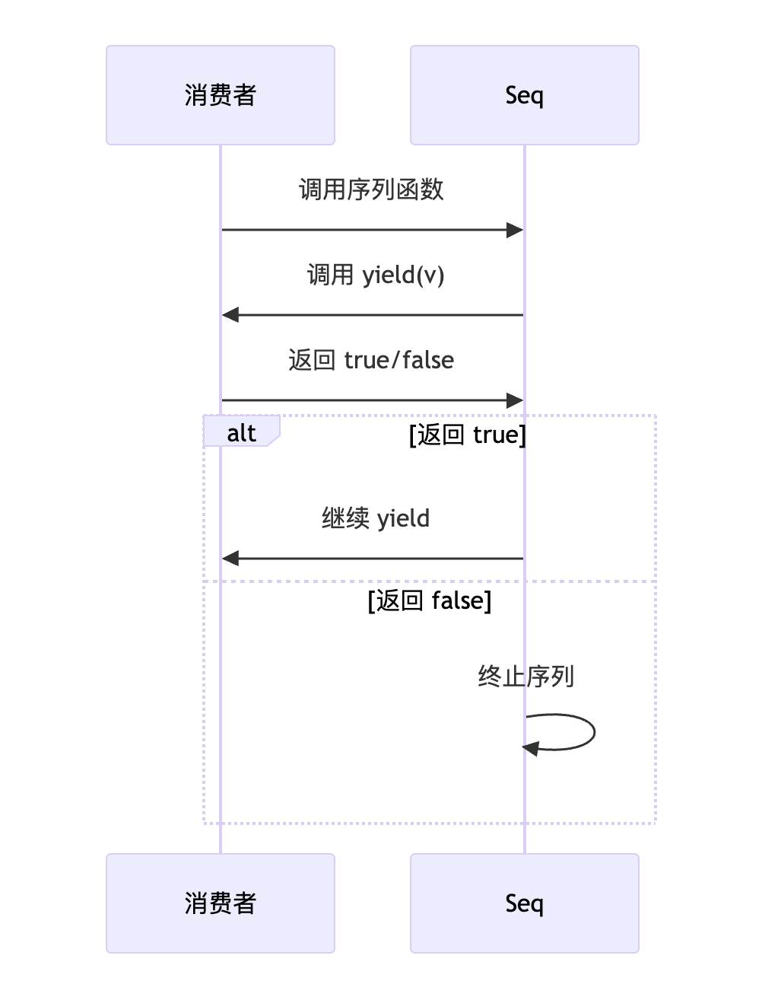

Go 1.22+的 `iter` 包提供了一种强大的迭代机制，允许我们以声明式的方式处理序列。通过组合不同的序列操作（如过滤、映射），我们可以构建出复杂的数据处理管道，同时保持代码的清晰和高效。这种迭代方式特别适合处理流式数据或大型数据集。
# 1 迭代器说明

## 1.1 迭代器本质

迭代器是​**​序列元素的生成函数​**​，通过 `yield` 回调传递值：

```go
type Seq[V any] func(yield func(V) bool)
type Seq2[K, V any] func(yield func(K, V) bool)
```
## 1.2 控制流机制

- ​**​继续迭代​**​：`yield` 返回 `true`
- ​**​提前终止​**​：`yield` 返回 `false`
- ​**​自然结束​**​：序列元素耗尽
## 1.3 安全变异模式

**问题​**​：迭代器本身不直接支持修改

​**​解决方案​**​：位置迭代器模式

```go
// 1. 定义位置类型
type Pos[V any] struct { 
    node *TreeNode[V] 
}

// 2. 实现变异方法
func (p *Pos[V]) Delete() { 
    removeNode(p.node) 
}

// 3. 提供位置迭代器
func (t *Tree[V]) Positions() iter.Seq[*Pos[V]] {
    return func(yield func(*Pos[V]) bool) {
        traverse(t.root, func(n *TreeNode[V]) bool {
            return yield(&Pos{node: n})
        })
    }
}

// 4. 使用
for p := range tree.Positions() {
    if p.Value() < threshold {
        p.Delete() // 安全变异
    }
}
```
## 1.4 总结

1. ​**​抽象维度​**​：
    
    - 统一集合访问接口
    - 分离生成与消费逻辑
    - 隐藏底层数据结构
2. ​**​资源维度​**​：
    
    - 惰性加载节省内存
    - 精确控制资源生命周期
    - 流式处理无限数据
3. ​**​性能维度​**​：
    
    - 零拷贝数据管道
    - 按需计算避免浪费
    - 并发友好设计
4. ​**​扩展维度​**​：
    
    - 可组合的函数管道
    - 领域特定语言基础
    - 跨数据源统一访问

# 2 序列
## 2.1 Seq\[T\] 类型

```go
type Seq[T any] func(yield func(T) bool)
```

- ​**​本质​**​：接收 yield 函数的函数
- ​**​行为​**​：
    - 每次调用 `yield(value)` 产生一个值
    - 若 `yield` 返回 `false`，停止生成
- ​**​特点​**​：
    - 惰性求值（按需生成）
    - 可中断迭代
    - 无状态复用
    - ​**​声明式迭代​**​：描述"生成什么"而非"如何生成"
    - ​**​消费者驱动​**​：消费者通过 `yield` 控制流程
    - ​**​提前终止​**​：当 `yield` 返回 `false` 时停止

- **生命周期**：


```go
// 创建整数序列
func CountTo(n int) iter.Seq[int] {
    return func(yield func(int) bool) {
        for i := 1; i <= n; i++ {
            if !yield(i) { // 消费者可能中断
                fmt.Println("序列中断")
                return
            }
        }
    }
}

// 使用
for v := range CountTo(5) {
    if v == 3 {
        break // 提前中断
    }
    fmt.Println(v)
}
// 输出:
// 1
// 2
// 序列中断
```

## 2.2 Seq2\[T1, T2\] 类型

```go
type Seq2[T1, T2 any] func(yield func(T1, T2) bool)
```

- 用于生成键值对等二元组序列
- 典型应用：映射遍历、分页数据
-  **二元组迭代​**​：同时产生键和值
-  ​**​天然映射​**​：适合键值对数据结构
 - ​**​高效遍历​**​：避免中间数据结构
 - ​**​模式匹配​**​：`for k, v := range` 语法糖

```go
func IterateMap[K comparable, V any](m map[K]V) iter.Seq2[K, V] {
    return func(yield func(K, V) bool) {
        for k, v := range m {
            if !yield(k, v) {
                return
            }
        }
    }
}

// 使用
users := map[int]string{
    101: "Alice",
    202: "Bob",
}

for id, name := range IterateMap(users) {
    fmt.Printf("用户ID: %d, 姓名: %s\n", id, name)
}
// 输出:
// 用户ID: 101, 姓名: Alice
// 用户ID: 202, 姓名: Bob
```

## 2.3 总结

`Seq` 和 `Seq2` 类型为 Go 带来了现代化的迭代器模式，具有以下优势：

1. ​**​声明式语法​**​：代码更简洁易读
2. ​**​资源安全​**​：与 `defer` 完美结合
3. ​**​无限序列​**​：支持无限序列的处理
4. ​**​组合能力​**​：轻松组合多个操作
5. ​**​并发友好​**​：天然支持并发处理
# 3 工具函数

## 3.1 Pull：手动控制迭代

```go
func Pull(seq Seq[T]) (next func() (T, bool), stop func())
```

- **`seq Seq[V]`：任意类型的推送式迭代器序列
- ​**​返回值​**​：
    - `next func() (V, bool)`：获取下一个值
        - 返回值：`(value, true)` 有效值
        - 结束信号：`(zero_value, false)`
    - `stop func()`：终止迭代，不会进行任何清理行为

```go
package main

import (
	"fmt"
	"iter"
)

func main() {
	// 创建推送式迭代器（生成1-5）
	seq := func(yield func(int) bool) {
		for i := 1; i <= 5; i++ {
			if !yield(i) {
				return // 消费者中断
			}
		}
	}

	// 转换为拉取式迭代器
	next, stop := iter.Pull(seq)
	defer stop() // 确保资源释放

	// 读取前3个值
	for i := 0; i < 3; i++ {
		val, ok := next()
		fmt.Printf("值: %d, 有效: %v\n", val, ok)
	}
	// 输出:
	// 值: 1, 有效: true
	// 值: 2, 有效: true
	// 值: 3, 有效: true

	// 提前终止（不再读取4和5）
	stop()

	// 终止后尝试读取
	val, ok := next()
	fmt.Printf("终止后: %d, 有效: %v\n", val, ok)
	// 输出: 终止后: 0, 有效: false
}
```

**关键特性**

1. ​**​惰性控制​**​：按需拉取值，不预加载
2. ​**​安全终止​**​：`stop` 确保资源释放
3. ​**​错误传播​**​：panic 自动传递
4. ​**​线程安全​**​：禁止并发调用
## 3.2 Pull2：二元组版本

```go
func Pull2(seq Seq2[T1, T2]) (next func() (T1, T2, bool), stop func())
```

这两个函数用于将“推送式”迭代器（Seq 或 Seq2）转换为“拉取式”迭代器，通过返回的 `next` 和 `stop` 函数来控制迭代。

- `seq Seq2[K, V]`：键值对类型的推送式迭代器
- ​**​返回值​**​：
    - `next func() (K, V, bool)`：获取下一个键值对
        - 返回值：`(key, value, true)` 有效值
        - 结束信号：`(zero_k, zero_v, false)`
    - `stop func()`：终止迭代

```go
package main

import (
	"fmt"
	"iter"
)

func main() {
	// 创建键值对迭代器
	userSeq := func(yield func(int, string) bool) {
		users := map[int]string{
			101: "Alice",
			202: "Bob",
			303: "Charlie",
		}
		for id, name := range users {
			if !yield(id, name) {
				return
			}
		}
	}

	// 转换为拉取式
	next, stop := iter.Pull2(userSeq)
	defer stop()

	// 读取所有用户
	for {
		id, name, ok := next()
		if !ok {
			break
		}
		fmt.Printf("ID: %d, 姓名: %s\n", id, name)
	}
	// 输出（顺序随机）:
	// ID: 101, 姓名: Alice
	// ID: 202, 姓名: Bob
	// ID: 303, 姓名: Charlie
}
```

### 3.2.1 数据库分页查询

```go
func QueryUsers(pageSize int) iter.Seq2[int, string] {
	return func(yield func(int, string) bool) {
		page := 1
		for {
			users, hasNext := db.Query("SELECT id, name FROM users LIMIT ? OFFSET ?", pageSize, (page-1)*pageSize)
			if !hasNext {
				return
			}
			
			for _, user := range users {
				if !yield(user.ID, user.Name) {
					return
				}
			}
			
			page++
		}
	}
}

// 使用
func main() {
	userSeq := QueryUsers(100) // 每页100条
	next, stop := iter.Pull2(userSeq)
	defer stop()

	// 只处理前50条
	for i := 0; i < 50; i++ {
		id, name, ok := next()
		if !ok {
			break
		}
		processUser(id, name)
	}
}
```
## 3.3 资源清理

可以把资源清理动作交给调用者，使迭代器代码专注于生成序列。

```go
func QueryRows(query string, args ...any) iter.Seq[Row] {
    return func(yield func(Row) bool) {
        // 资源管理交给调用者
    }
}

func RunQuery(ctx context.Context, query string) error {
    seq := QueryRows(query)
    next, stop := iter.Pull(seq)
    defer stop()
    
    // 创建带超时的连接
    db, err := sql.Open("driver", "dsn")
    if err != nil {
        return err
    }
    
    // 绑定关闭到 stop
    stop = func() {
        db.Close()
        stop()
    }
    
    rows, err := db.QueryContext(ctx, query)
    if err != nil {
        return err
    }
    
    for {
        if !rows.Next() {
            break
        }
        
        var row Row
        if err := rows.Scan(&row); err != nil {
            return err
        }
        
        if !yield(row) {
            break
        }
    }
    
    return rows.Err()
}
```

也可以使用自动绑定的方式

```go
func WithResource[V any](open func() (io.Closer, error), seq iter.Seq[V]) iter.Seq[V] {
    return func(yield func(V) bool) {
        // 仍然保持空实现
    }
}

func AutoPull[V any](seq iter.Seq[V]) (next func() (V, bool), stop func(), err error) {
    // 尝试打开资源
    var resource io.Closer
    if rs, ok := seq.(interface{ Open() (io.Closer, error) }); ok {
        resource, err = rs.Open()
        if err != nil {
            return nil, nil, err
        }
    }
    
    next, stop = iter.Pull(seq)
    
    // 创建增强版stop
    enhancedStop := func() {
        if resource != nil {
            resource.Close()
        }
        stop()
    }
    
    return next, enhancedStop, nil
}

// 使用
seq := WithResource(
    func() (io.Closer, error) { return os.Open("data.txt") },
    FileLinesSeq(),
)

next, stop, err := AutoPull(seq)
if err != nil {
    log.Fatal(err)
}
defer stop()

for data, ok := next(); ok; data, ok = next() {
    process(data)
}
```
## 3.4 Next函数行为

在单次使用迭代器中，迭代器函数通常绑定到一个不可重放的流式数据源（如网络连接）。一旦迭代器函数返回（即序列结束），即使后续数据源又有新数据产生，迭代器也不会再产生新值。

但是，问题描述的场景是：在调用`next`函数返回`(zero, false)`（表示序列结束）之后，如果网络连接又传输了新数据，那么再次调用`next`会返回新数据吗？

答案：不会。原因如下：

1. ​**​单次使用迭代器的定义​**​：单次使用迭代器设计用于遍历一个序列一次。一旦序列结束（即迭代器函数返回），迭代器就处于结束状态，后续调用`next`只会返回`(zero, false)`。
    
2. ​**​迭代器函数的行为​**​：迭代器函数内部通常是一个循环，该循环在数据源可用时产生值，并在数据源结束或外部通过`yield`返回`false`中断时退出。一旦这个循环退出，迭代器函数就返回了，不会再次进入循环。
    
3. ​**​网络连接的特殊性​**​：如果网络连接是一个持续产生数据的流（例如TCP连接），那么迭代器函数通常不会主动结束，除非遇到以下情况：
    
    - 网络连接关闭（读到EOF）
    - 读取发生错误
    - 外部通过`yield`返回`false`要求停止

```go
func FileSend(file *os.File) iter.Seq[string] {  
    read := bufio.NewReader(file)  
    return func(yield func(string) bool) {  
       for {  
          s, _, _ := read.ReadLine()  
          if len(s) > 0 {  
             if !yield(string(s)) {  
                return  
             }  
          }  
       }  
    }  
}  
  
func main() {  
    f, err := os.Open("test.txt")  
    defer f.Close()  
    if err != nil {  
       fmt.Println(err)  
    }  
  
    fiter := FileSend(f)  
    next, stop := iter.Pull(fiter)  
    defer stop()  
    for {  
       s, ok := next()  
       fmt.Println(s, ok)  
       time.Sleep(1 * time.Second)  
    }  
}
```

## 3.5 总结

1. ​**​控制反转​**​：
    
    - 消费者决定何时获取值
    - 精确控制处理节奏
    - 支持条件中断
2. ​**​资源安全​**​：
    
    - `defer stop()` 保证释放
    - 自动处理迭代器 panic
    - 零值安全处理
3. ​**​模式转换​**​：
    
    - 无缝衔接 push/pull 模式
    - 支持传统循环控制
    - 兼容复杂处理逻辑
4. ​**​应用场景​**​：
    
    - 大数据集分块处理
    - 条件搜索与过滤
    - 资源敏感型操作
    - 流式处理中断