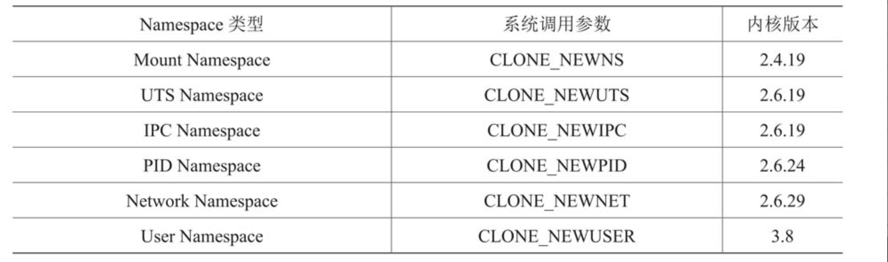

# 项目说明

## 初始化目录

在开始做一个项目之前，先初始化一个go项目，并使用`go module`进行管理。

```bash
mkdir mydocker
cd mydocker
go mod init mydocker
```

## Linux Namespace

Namespace是Kernel的一个功能，它可以隔离一系列的系统资源，比如PID、User ID、Network等。详细可以查看[02-容器基础：隔离与限制](../../../云计算/容器/深入剖析kubernetes/02-容器基础：隔离与限制.md)

Namespace的API主要使用如下3个系统调用。

* clone 创建新进程。根据系统调用参数来判断哪些类型的Namespace被创建，而且它们的子进程也会被包含到这些Namespace中。
* unshare 将进程移出某个Namespace。
* setns 将进程加入到Namespace中。

目前Linux一共实现了以下几种不同类型的NameSpace。



* UTS Namespace：主要用来隔离nodename和daminname这两个系统标识。
* IPC Namespace：主要用来隔离System V IPC和POSIX message queues。
* PID NameSpace：主要用来隔离进程ID。
* Mount NameSpace：主要用来隔离各个进程看到的挂载点视图。
* User NameSpace：主要用来隔离用户和用户组ID。
* Network NameSpace：用来隔离网络设备，IP地址端口等网络栈的NameSpace.

### 代码实现

```go
// main
package main

import (
        ik "mydocker/inidk"
)

func main(){
        ik.NameSpaceInit()
}

// inidk/namespace.go 
package inidk

import (
        "os/exec"
        "syscall"
        "os"
        "log"
)

func NameSpaceInit(){
        cmd := exec.Command("/bin/bash", "-c", "mount --make-rprivate / && mount -t proc proc /proc && exec /bin/sh")
        cmd.SysProcAttr = &syscall.SysProcAttr{
                Cloneflags: syscall.CLONE_NEWUTS|syscall.CLONE_NEWIPC|syscall.CLONE_NEWPID|syscall.CLONE_NEWNS|syscall.CLONE_NEWUSER|syscall.CLONE_NEWNET,
                Pdeathsig: syscall.SIGKILL,
        }

        cmd.Stdin = os.Stdin
        cmd.Stdout = os.Stdout
        cmd.Stderr = os.Stderr


        if err := cmd.Run();err!=nil{
                log.Fatal(err)
        }
}

```

查看共享挂载信息

```bash
[root@mydocker conf.d]# cat /proc/self/mountinfo |grep proc
19 40 0:3 / /proc rw,nosuid,nodev,noexec,relatime shared:5 - proc proc rw
44 19 0:37 / /proc/sys/fs/binfmt_misc rw,relatime shared:26 - autofs systemd-1 rw,fd=33,pgrp=1,timeout=0,minproto=5,maxproto=5,direct,pipe_ino=14204
```

## Cgroup
