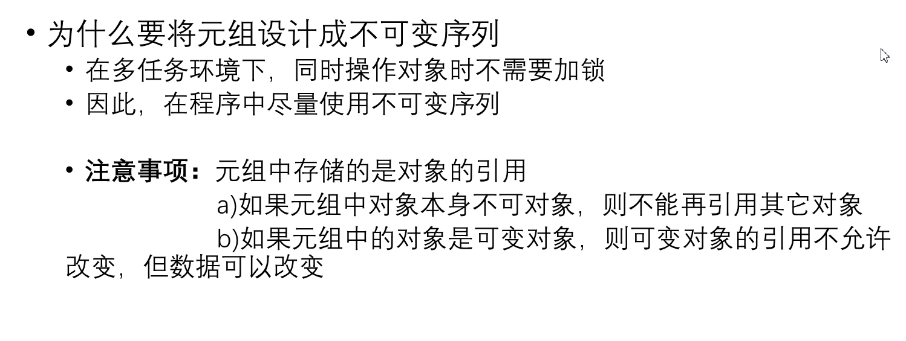
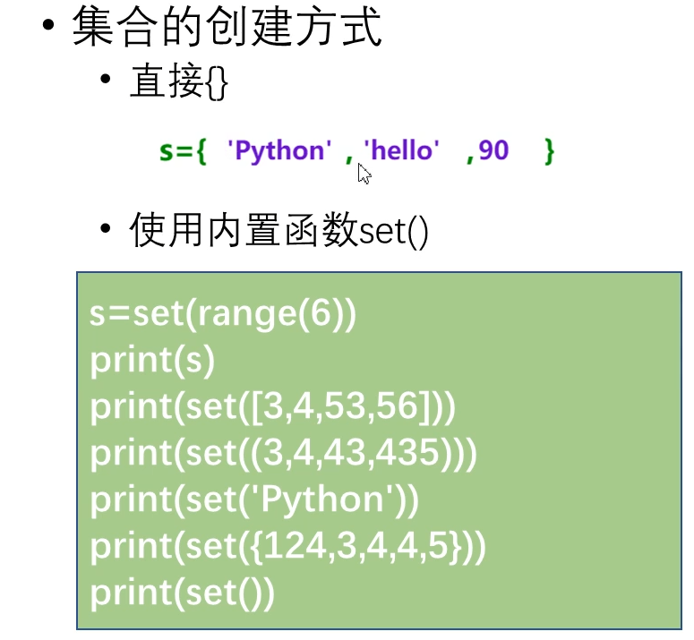
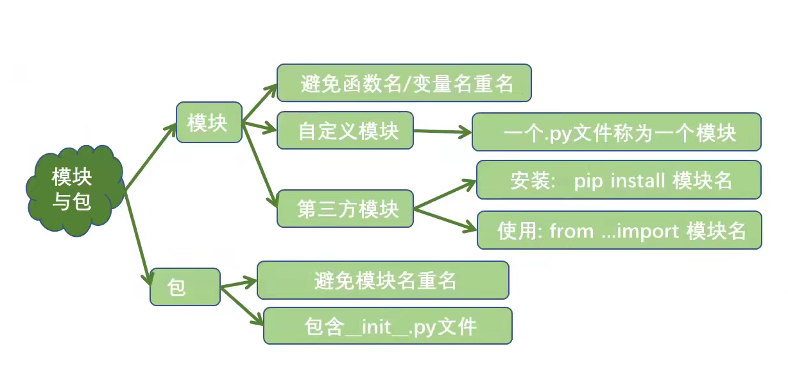

[toc]
## 1 Python简介
Python是一个高层次的结合了解释性、编译性、互动性和面向对象的脚本语言。
- 解释性：这意味python在运行过程中没有编译这个过程
- 交互式：意味着可以直接运行代码而不用像c语言一样在main函数中执行代码
- 面向对象的语言：意味着python支持面向对象或代码封装的编程技术
## 2 Python编码
- 如果 python 源码文件 没有声明编码格式，python 解释器会默认使用 ASCII 编码
- 可以在文件头写#encoding=gbk等修改python默认的编码格式或者# -*- coding: UTF-8 -*-修改
- 若文件中出现与编码格式不一致的字符时python解释器就会报错


## 3 python模块安装之pip
- pip是Python的包安装程序。其实pip就是python标准库中的一个包，可以用来管理python标准库中的包，也可以用来安装非python标准库的包
- 一般python安装包已经自带pip
- pip使用
  - 可以在cmd界面中用pip help install查看安装使用说明
  - 可以直接pip install+包名来安装包
  - 安装时还可以指定版本安装包,例下：
    ```
    pip install SomePackage              # 最新版本
    pip install SomePackage==1.0.4       # 指定版本
    pip install 'SomePackage>=1.0.4'     # 最小版本
    ```
- 查看安装包信息
  - pip freeze 查看已经安装的包及版本信息
  - 还可以导出包信息到指定文件。如：pip freeze > requirements.txt，文件名称随意；也可以使用 pip install -r requirements.txt，两者等效。
- 包卸载
  - 卸载包命令：pip uninstall <包名> 
  - 批量卸载，把包信息导入到文件 pip uninstall -r requirements.txt
- 包升级
  - pip install -U <包名> 或：pip install <包名> --upgrade
- 列出安装包
  - pip list 查看已经安装的包及版本信息
  - pip list -o 查看可更新的包信息
- 显示包所在目录及信息
  - pip show <包名>
  - pip show -f <包名> 查看包的详细信息
- 搜索包
  - pip search <关键字>
## 4 python的缩进规则
- python一般用新行作为语句的结束标识
- python中用缩进来区分代码块
- Python PEP8 编码规范，指导使用4个空格作为缩进。
- 但是在复杂代码中会选择用2个空格作为缩进，使代码更容易读懂
- 物理行与逻辑行区别
  - 物理行：代码编辑器中显示的代码，每一行内容是一个物理行
  - 逻辑行：Python解释器对代码进行介绍，一个语句是一个逻辑行
  - 相同的逻辑行要保持相同的缩进
  - ":"标记一个新的逻辑层  
    增加缩进表示进入下一个逻辑层  
    减少缩进表示返回上一个逻辑层
  - 使用；可以把多个逻辑行合成一个物理行
  - 使用\可以把逻辑行分成多行
## 5 标识符
- 标识符是编程时使用的名字，用于给变量、函数、语句块等命名，Python 中标识符由字母、数字、下划线组成，不能以数字开头，区分大小写。
- 以下划线开头的标识符有特殊含义
  - _xxx ，表示不能直接访问的类属性，需通过类提供的接口进行访问，不能用 from xxx import * 导入
  - 双下划线开头的标识符，如：__xx，表示私有成员
  - 双下划线开头和结尾的标识符，如：\_\_xx\_\_，表示 Python 中内置标识，如：\_\_init\_\_() 表示类的构造函数

> python中主要存在四种命名方式：
>
> 1、object #公用方法
>
> 2、_object #半保护
>
> ​         \#被看作是“protect”，意思是只有类对象和子类对象自己能访问到这些变量，
>
> ​         在模块或类外不可以使用，不能用’from module import *’导入。
>
> ​        \#__object 是为了避免与子类的方法名称冲突， 对于该标识符描述的方法，父
>
> ​         类的方法不能轻易地被子类的方法覆盖，他们的名字实际上是
>
> ​         _classname__methodname。
>
> 3、_ _ object #全私有，全保护
>
> ​            \#私有成员“private”，意思是只有类对象自己能访问，连子类对象也不能访
>
> ​             问到这个数据，不能用’from module import *’导入。
>
> 4、_ _ object_ _   #**内建方法，用户不要这样定义**

### 5.1 关键字
and|exec|not|assert|finally|or
--|--|-|-|-|-
break|for|pass|class|from|print
continue|global|raise|def|if|return
del|import|try|elif|in|while
else|is|with|except|lambda|yield
- 自定义标识符时不能使用关键字
## 6 转义字符
- 需要在字符中使用特殊字符时，就需要用到转义字符，在python里用反斜杠‘\’转义字符。
- 当字符串中包含反斜杠、单引号和双引号等有特殊用途的字符时，必须使用反斜杠对这些字符进行转义(转换一个含义)
- ·当字符串中包含换行、回车，水平制表符或退格等无法直接表示的特殊字符时，也可以使用转义字符当字符串中包含换行、回车，水平制表符或退格等无法直接表示的特殊字符时，也可以使用转义字符

## 7 注释
- Python 解释器在执行代码时会忽略注释，不做任何处理。
- 注释最大的作用就是提高代码的可读性

### 7.1 单行注释
```
# 注释内容
```
### 7.2 多行注释
```
Python 使用三个连续的单引号'''或者三个连续的双引号"""注释多行内容，如：
'''
注释内容
'''

"""
注释内容
"""
```
## 8 输出函数
- python输出函数为print，无论什么类型的数据都可以直接输出，使用如下：
```python
print(*objects, sep=' ', end='\n', file=sys.stdout)
```
- objects参数：表示输出对象。输出多个对象时，需要用逗号分隔
- sep参数：用来间隔多个对象
- end参数：用来设定以什么结尾
- file参数：要写入的文件对象
```python
#如果直接输出字符串，而不是用对象表示的话，可以不使用逗号
print("Duan""Yixuan")
print("Duan","Yixuan")
 
运行结果如下：
DuanYixuan
Duan Yixuan
可知，不添加逗号分隔符，字符串之间没有间隔
```
- 在输出前加r表示原样输出
```
print(r'\hello word')
# \hello word
```
### 8.1 格式化输出

### 8.2 精度和宽度控制

```python
f = 123.333
# 意思为f变量保留两位小数
print(f'{f:.2f}')
```


- 在“：”后分别加^,<,>分别表示输出居中，左对齐，右对齐
- 第二三种不可控，其他格式控制方式与C语言一样
### 8.3 转换标志
- 转换标志：-表示左对齐；+表示在数值前要加上正负号；" "(空白字符)表示正数之前保留空格()；0表示转换值若位数不够则用0填充。
```
p=3.141592653
print('%+3.1f'%p)
# +3.1
```

```
p=3.141592653
print('%010.1f'%p)
# 00000003.1
```

```
p=3.141592653
print('%-3.1f'%p)
#3.1
```
### 8.4 格式字符归纳
格式符|格式符输出|格式符|格式符输出
|-|-|-|-|
%s|字符串输出|%r|字符串输出
%c|单个字符输出|%b|二进制整数输出
%d|十进制整数输出|%i|十进制整数
%o|八进制整数输出|%x|十六进制整数输出
%e|指数输出(e为基底)|%E|上同(E为基底)
%f|浮点数|%F|浮点数
%g|指数(e)或浮点数(根据显示长度)|%G|指数(E)或浮点数(根据显示长度)
### 控制输出字体样色

## 9 输入函数
- python使用input()控制键盘录入
```
input('请输入：')
# 请输入：
```
- 一次性输入多个变量
```
a,b,c=input('请输入：').split(',')
# 录入多个数且用逗号隔开
```
- 以上一种方式的类型转换
```
a,b,c=map(int,input('请输入：').split(','))
# 这样就可以把所有数转换为int类型
```
## 10 变量与常量
- 变量：一般值改变后内存地址随着改变

- 局部变量和全局变量
  
- 常量：python没有常规意义上的常量，约定用全大写标识符表示常量，但其值还是可以改变
- 所以后来用户可以自定义类来实现常量
```
# -*- coding: utf-8 -*-
# python 3.x
# Filename:const.py
# 定义一个常量类实现常量的功能
# 
# 该类定义了一个方法__setattr()__,和一个异常ConstError, ConstError类继承 
# 自类TypeError. 通过调用类自带的字典__dict__, 判断定义的常量是否包含在字典 
# 中。如果字典中包含此变量，将抛出异常，否则，给新创建的常量赋值。 
# 最后两行代码的作用是把const类注册到sys.modules这个全局字典中。
class _const:
    class ConstError(TypeError):pass
    def __setattr__(self,name,value):
        if name in self.__dict__:
            raise self.ConstError("Can't rebind const (%s)" %name)
        self.__dict__[name]=value
        
import sys
sys.modules[__name__]=_const()
```
```
# test.py
import const
const.PI=3.14
print(const.PI)
```
#### python变量域

> python中的4种作用域 
>
> L：Local，局部作用域，也就是我们在函数中定义的变量；
>
> E：Enclosing，嵌套的父级函数的局部作用域，即包含此函数的上级函数的局部作用域，但不是全局的；
>
> G：Globa，全局变量，就是模块级别定义的变量；
>
> B：Built-in，系统内置模块里面的变量，比如int, bytearray等。
>
> 查找循序也是由上往下
>
> 当参数为可变对象时，传参采用的是引用传递，修改形参将对实参造成影响；当参数为不可变对象时，传参采用的是值传递，修改形参对实参无影响

## 11 数据类型 

- python常用数据类型：

类型|类型名|实例
|-|-|-|
整数类型|int|88
浮点类型|float|3.123
布尔类型|bool|True，False
字符串类型|str|'人生苦短，我用python'
空值|None|None
- 整数类型：

- 浮点类型：
- 
- 布尔类型：

- 字符串类型：

### 11.1 数据类型转换
- 数据类型转化事项：

- 特别注意int()函数有两个参数，如果只有一个参数则转换为整数，如果有第二个参数，则为指定转换的进制
  ```
  c='123'
  print(int(c,16))
  #291
  ```
## 12 python运算符
| 算术运算符 | 赋值运算符 | 比较运算符 |
| ---------- | ---------- | ---------- |
| 布尔运算符 | 位运算符   | 海象运算符 |

- 算术运算符：
  
  
  - 整除一正一负向下取整 
  
- 赋值运算符：
  
  
  - <span style="color:red">python没有自增自减运算符，自增自减用+=、-+实现</span>
  
- 比较运算符：
  

- 布尔运算符：
  

- 位运算符：
  

- 海象运算符

  ```python
  # 符号：:=
  # 作用： 为变量赋值
  # 一般不单独使用
  if a:=20 > 18:
      print('已经成年')
  ```

  
### 12.1 算术运算符的优先级
- 算术运算符优先级：

### 12.2 对象的布尔值
- python一切皆对象，所有对象都有一个布尔值
  - 可以使用内置函数bool()获取对象的布尔值
- 布尔值为False的对象：

False|数值0|None|空字符串
|-|-|-|-|
空列表|空元组|空字典|空字典
- 其他对象布尔值为True
## 13 选择结构
- 语法结构：
  
  
  - python的选择条件可以使用数学方式表达：
  ```
  # 与c不一样，c不能连续比较
  if 90<=score<=100
  ```
  - <span style="color:red">else后面不能接条件，只能接：</span>
  ```
  if 100>90:
    print('小于')
  else:
    print('大于')
  ```
  - 嵌套if
  
### 13.1 条件表达式
- 基本语法：
```
print(100 if 100>90 else 90)
# 输出100
# if判断条件为True输出前面，否则输出后面
```
### 13.2 pass语句
- pass简介

## 14 循环结构
### 14.1 range函数
- 用于生成一个整数序列,默认从0开始
- 基础语法：

### 14.2 while循环
- 基础语法：
```
i=0
while i<5:
    print(i)
    i+=1
# 0 1 2 3 4
```
### 14.3 for-in循环
- 基础语法：

```
for i in range(3):
  print(i)
# 0 1 2
```
  - 不需要变量时：
  ```
  for _ in range(3):
    print('人生苦短，我用python')
  ```
### 14.4 流程控制语句
- break语句
  - 基础语法：
  
- continue语句：
  - 基础语法：
  
- else语句：
  - 基础语法：
  
### 14.5 循环总结

## 15 列表
- 列表可存储不同类型的值
### 15.1 列表的基本操作
- 创建列表：
```
r=[12,"i"]
print(r)
# [12, 'i']
```
```
r=list('1234')
print(r)
# ['1', '2', '3', '4']
```

- 列表的特点：

- 获取列表指定元素的索引(index()函数)
```
l=[1,2,3]
print(l.index(1))
# 0
```

- 获取列表的多个元素(切片)
  
  - <span style="color:red">切片会产生新的列表</span>
```
l=[1,2,3]
print(l[1:])
# [2, 3]
```
- 列表查询与遍历
  
  
  ```
  l=[1,2,3]
  print(1 in l)
  # True
  ```
- 列表的增加操作
  
  
  ```
  l=[1,2,3]
  # 在末尾加一个元素
  l.append(4)
  print(l)
  # 在末尾加任意多元素，参数为列表
  l.extend([5,6])
  print(l)
  # 在第6个位置加上一个7元素
  l.insert(6,7)
  print(l)
  # 切片，把切出去的部分用新列表替换
  l[1:]=[8]
  print(l)
  ```
- 列表的删除
  
  
  ```
  l=[1,1,2,3]
  # 删除1元素
  l.remove(1)
  print(l)
  # 删除第0个元素，若不指定则删除最后一个元素
  l.pop(0)
  print(l)
  # 切片出第0个到第1个元素
  print(l[0:1])
  # 清除全部元素
  l.clear()
  print(l)
  # 删除列表
  del(l)
  print(l)
  23
  
  # [1, 2, 3]
  # [2, 3]
  # [2]
  # []
  # 报错，没有l变量
  ```
- 列表的排序
  
  
  - <span style="color:red">sort()不会产生新列表对象</span>
  - <span style="color:red">sorted()会产生新的列表对象</span>
  ```
  l=[3,2,1]
  # 不会产生新对象
  l.sort()
  print(l)
  # 会产生新对象
  r=sorted(l)
  print(l)
  ```
- 列表生成式
  - 基本语法：
    - i for i in 迭代器
  ```
  # 生成一个1-9元素的列表
  lst=[i for i in range(1,10)]
  ```
## 16 字典
- 以键值对的方式无序存储数据
 
- 把key进过哈希函数计算得出位置
- key要求为不可变序列
- key不可重复
### 16.1 字典的基本操作
- 创建字典：

   - dict.fromkeys(seq,value)->dict:以序列 seq 中元素做字典的键，value 为字典所有键对应的初始值

   

- 字典元素的获取
  
  
  ```
  s={"张三":100}
  t=s["张三"]
  print(t)
  # 设置默认查找值，当查字典没有的元素时返回默认值
  t=s.get("lisi",99)
  print(t)
  #100
  #99
  ```
  
- key的判断、元素删除、元素新增
  
  

- 获取字典视图
  
  
  ```
  s={"张三":100}
  # 获取所有key
  print(s.keys())
  # 获取所有值
  print(s.values())
  # 获取所有键值对
  print(s.items())
  #dict_keys(['张三'])
  # dict_values([100])
  # dict_items([('张三', 100)])
  ```
  
- 字典遍历
  ```
  s={"张三":100}
  # item 获取的是key
  # s[item]获取值
  for item in s:
    print(item)
    print(s[item])
  ```

- 字典生成式
  
  
  - 基本语法
    - for({列表:列表 for 列表,列表 in zip(列表, 列表)})
    ```
    s=[1,2,3]
    t=[4,5]
    print({s: t for s, t in zip(s, t)})
    ```
    - 若zip打包的两个列表元素数目不一样，则按元素数目少的列表打包
### 16.2 字典总结
  
## 17 元组
- 是一个不可变序列
### 17.1 元组的基本操作
- 元组的创建
  
  
    - <span style="color:red">第一种方式可以省略小括号</span>
    - <span style="color:red">第三种方式如果省略逗号，会被认为是元素原来的类型</span>
- 为什么要把元组设计成不可变序列？
  
- 遍历元组：
  ```
  t=1,2,3,4
  for i in t:
    print(i)
  ```
- 元组生成式
  - <span style="color:red">元组没有生成式</span>
## 18 集合
- 集合是没有value的字典
  
### 18.1 集合的基本操作
- 集合的创建
  
  
  - <span style="color:red">集合的元素不能重复</span>
  - <span style="color:red">空集合创建只能用内置函数进行设置</span>
- 集合的判断，新增，删除
  
  
  ```
  s={1,2,3}
  # 末尾增加一个元素
  s.add(4)
  print(s)
  # 末尾至少增加一个元素
  s.update([5])
  print(s)
  # 删除一个指定元素
  s.remove(2)
  print(s)
  # 删除一个指定元素
  s.discard(1)
  print(s)
  # 一次删除头部一个元素
  s.pop()
  print(s)
  # 清空元素
  s.clear()
  ```
- 集合间的关系
  
  
  ```
  s={1,2,3,4}
  t={3,4}
  # 判断集合是否相等
  print(s==t)
  # 判断集合t是否是集合s的子集
  print(t.issubset(s))
  # 判断集合s的父集是否是t
  print(s.issuperset(t))
  # 判断两个集合是否是没有交集
  print(s.isdisjoint(t))
  
  #False
  #True
  #True
  #False
  ```
- 集合的数学操作
  
  
  ```
  s={1,2,3,4}
  t={3,4,5,6}
  # 集合的交集
  print(s.intersection(t))
  print(s&t)
  
  # 集合的并集
  print(s.union(t))
  print(s|t)
  
  # 集合的差集
  print(s.difference(t))
  print(s-t)
  
  # 集合的对称差集
  print(s.symmetric_difference(t))
  print(s^t)
  ```
- 集合生成式
  
  
  ```
  print({i for i in range(1,10)})
  ```
### 18.2 元组与集合总结
  
## 19 序列总结

  - <span style="color:red">不可变序列还有字符串</span>

> 可变对象和不可变对象的区别：
>
> - 可变对象：改变对象内容，对象在内存中的地址`不会`被改变
> - 不可变对象：改下对象内容，对象在内存中的地址会被改变；如果必须存储一个不同的值，则必须创建新的对象

## 20 字符串
- python基本数据类型，是一个不可变序列
### 20.1 字符串的驻留机制
- 基本概述
  
  
  - <span style="color:red">pycharm中对字符串的驻留机制进行了优化，只要是字符串都可以驻留</span>
- 驻留机制优缺点
  
### 20.2 字符串的操作
- 字符串的查询
  
  
  ```
  s='python人生苦短，我用python'
  # 查找子串第一次出现的位置，无子串报错
  print(s.index('python'))
  # 查找子串最后一次出现的位置，无子串报错
  print(s.rindex('python'))
  # 查找子串第一次出现的位置，无子串返回-1
  print(s.find('python'))
  # 查找子串最后一次出现的位置，无子串返回-1
  print(s.rfind('python'))
  
  #0
  #13
  #0
  #13
  ```
- 字符串的大小写转换
  
  
  ```
  s='人生苦短python，我用Python'
  # 全部字符转换为大写
  print(s.upper())
  # 全部字符转换为小写
  print(s.lower())
  # 大写转小写，小写转大写
  print(s.swapcase())
  # 第一个字符转换为大写，其他字符转换为小写
  print(s.capitalize())
  # 把每个单词第一个字母大写，其他为小写
  print(s.title())
  
  # 人生苦短PYTHON，我用PYTHON
  # 人生苦短python，我用python
  # 人生苦短PYTHON，我用pYTHON
  # 人生苦短python，我用python
  # 人生苦短Python，我用Python
  ```
- 字符串对齐
  
  
  ```
  s='人生苦短python，我用Python'
  # 居中
  print(s.center(48))
  # 右对齐
  print(s.rjust(48))
  # 左对齐
  print(s.ljust(48))
  # 右对齐
  print(s.zfill(48))
  ```
  
- 字符串的劈分
  
  
  ```
  s='hello,world '
  print(s.split(sep=',',maxsplit=1))
  
  # ['hello', 'world ']
  # 对于split函数，对于分隔符出现在首尾的情况，在首尾处分割，会产生同一个空串（有几个分隔符就有几个空串），对于出现在字符串中间的情况，单独出现，和普通情况没有区别，如果出现多个，两个分隔符中间就会产生一个空串。
  ```
- 字符串的判断
  
  
  ```
  s='hello2022'
  # 判断是否为合法的标识符
  print(s.isidentifier())
  # 判断是否全由空白字符组成
  print(s.isspace())
  # 判断是否全为字母
  print(s.isalpha())
  # 判断是否全为十进制数字
  print(s.isdecimal())
  # 判断是否全为数字
  print(s.isnumeric())
  # 判断是否全为字母和数字
  print(s.isalnum())
  
  #True
  #False
  #False
  #False
  #False
  #True
  ```
- 字符串的替换与合并
  
  
  ```
  s='hello2022'
  lst=["1,2,3",'木头人']
  # 将指定子串替换
  print(s.replace('2','1'))
  # 在每两个列表元素中间加一个字符串
  print(s.join(lst))
  
  # hello1011
  # 1,2,3hello2022木头人
  ```
- 字符串的比较
  
  
  ```
  s='hello2022'
  r='H'
  print(s>r)
  print(s>=r)
  print(s<r)
  print(s<=r)
  print(s==r)
  print(s!=r)
  
  # True
  # True
  # False
  # False
  # False
  # True
  ```
- 字符串的切片
  - <span style="color:red">由于字符串是不可变序列，字符串的增删改切片等操作都会产生新的对象</span>
- 字符串的编码转换
  
  
  - 字符串的编码
    - 使用str类的encode方法
  - 字符串的解码
    - 使用decode方法
  ```
  s='天涯共此时'
  # 编码
  print(s.encode(encoding='GBK'))
  print(s.encode(encoding='UTF-8'))
  # 解码
  r=s.encode(encoding='GBK')
  print(r.decode(encoding='GBK'))
  
  # b'\xcc\xec\xd1\xc4\xb9\xb2\xb4\xcb\xca\xb1'
  # b'\xe5\xa4\xa9\xe6\xb6\xaf\xe5\x85\xb1\xe6\xad\xa4\xe6\x97\xb6'
  # 天涯共此时
  ```
  - <span style="color:red">编码和解码所使用的的字符编码必须一致否则会报错</span>
## 21 函数
- 函数就是执行特定任务和完成特定功能的一段代码
- 函数的好处  
  1. 复用代码
  2. 隐藏实现细节
  3. 提高可维护性
  4. 提高可读性便于调试
- 函数的创建
  ```
  def 函数名(输入参数):
    函数体
    [return xxx]
  ```
- 函数参数传递
  
  
  - 默认值参数
  
  - 其他类型参数
    
    - <span style="color:red">如果两个参数都有，则可边的位置参数要在可变的关键字参数前面</span>
    - <span style="color:red">当\*args，\*\*kwargs接受参数后，\*args意思为把args元组里的数据打散为位置参数，\*\*kwargs为把kwargs字典里的数据打散为关键字参数</span>
- 参数总结
   
- 函数内存分析
  - 如果不可变对象，那么在函数体内的修改不会影响实参的值，如果是可变对象，在函数体的修改会影响到实参
- 函数的返回值
  - python支持多返回值
    1.  如果函数没有返回值，return可以省略不写
    2.  函数的返回值如果是一个直接返回类型
    3.  函数的返回值如果是多个，返回的结果是一个元组
### 21.1 递归函数
- 如果一个函数的函数体调用了函数本身，这个函数就被称为递归函数
  

### 21.2 lambda表达式

python使用lambda来创建匿名函数

- lambda只是一个表达式，函数体比def简单很多
- lambda的主体只是一个表达式，而不是一个代码块。仅仅能在lambda表达式中封装有限的逻辑进去
- lambda函数拥有自己的命名空间，且不能访问自有参数列表之外或全局命名空间里的参数

#### 21.2.1 语法

```python
lambda [arg1[,arg2....]]:expression

# 实例
sum = lambda x, y: print(x+y)
sum(1,2)

# 3
```

### 21.3 函数文档

> 使用help()内置函数来查看函数文档

```python
print(help(print))
print(help(print.__doc__))

'''
print(...)
	# 函数原型
    print(value, ..., sep=' ', end='\n', file=sys.stdout, flush=False)
    
    # 函数功能
    Prints the values to a stream, or to sys.stdout by default.
    # 参数解释
    Optional keyword arguments:
    file:  a file-like object (stream); defaults to the current sys.stdout.
    sep:   string inserted between values, default a space.
    end:   string appended after the last value, default a newline.
    flush: whether to forcibly flush the stream.

None
'''

# 编写函数文档
def exchange(dollar, rate=6.32):
    """
    功能：汇率转换
    :param dollar: 美元数
    :param rate: 汇率
    :return: 人民币数量
    """
    return dollar * rate
'''
exchange(dollar, rate=6.32)
    功能：汇率转换
    :param dollar: 美元数
    :param rate: 汇率
    :return: 人民币数量
'''
```


## 22 异常处理机制

- 被动掉坑类型(try-expect)
  
  
  - <span style="color:red">当存在多个expect结构时应该按照先子类再父类的顺序捕获异常，为避免遗漏可能出现的异常，可以在最后加BaseException</span>
- try-except-else:
  
- try-except-else-finally:
  
- python常见的BUG类型
  
- traceback模块
  
  
  - 可以把异常打印在日记文件中
- 手动抛出异常
  ```
  if 0<=score<=100:
    print('分数为：',score)
  else:
    raise Exception('分数不正确')
  ```
  - 当没有try语句时，异常由python捕获

### 22.1 raise语句

```python
# 语法
raise 错误类型(打印的错误语句)

# 直接抛出错误，以及打印错误语句
```


### 22.2 BUG总结
  
## 23 python类
- 创建python类
  
  
  - 类之外的叫函数，类里面的叫方法
  - <span style="color:red">类属性，类方法，静态方法都可以直接类名.属性名调用，不需要创建对象</span>
  
- 对象的创建
  
  
- 动态绑定属性和方法

  > 在python类中，可以使用\__slots__变量限制实例对象的属性和方法
  >
  > 如果子类中没有定义\_\_slots\_\_属性，则不会继承父类的\_\_slots\_\_属性，如果定义了该属性，则子类对象允许的实例属性包括子类加上父类的限制
  >
  > ```python
  > __slots__ = ('_name', '_age', '_gender','show')
  > ```


```
  class Student:
    def __init__(self,name,age):
        self.name=name
        self.age=age
    def show(self):
        print('我是{},今年{}'.format(self.name,self.age))
  def show():
      print('我是函数')
  stu=Student('李磊',20)
  stu.show()
  stu.show=show
  stu.show()

  #我是李磊,今年20
  #我是函数

```

- 抽象类

  ```python
  # 在python中并没有像java一样很好的支持抽象类
  # 所以要导入abc库中的`ABCMeta`元类和`abstractmethod`包装器来负责设置抽象类和抽象方法
  # 当一个类中有抽象方法时，该类无法实例化
  
  from abc import abstractmethod, ABCMeta
  
  class A(object, metaclass=ABCMeta):
      def __init__(self):
          self._age = 18
          self._name = '1'
  
      @abstractmethod
      def voice(self):
          pass
  
  
  class B(A):
      def __init__(self):
          super().__init__()
  
      def voice(self):
          pass
  
  ```


- 运算符重载

​    在python中在类里通过重写内置运算符函数啦重载运算符

```python
#ex0716.py  加法运算符重载和减法运算符重载的实现
class Computing:
    def __init__(self,value):
        self.value = value
    def __add__(self, other):
        lst = []
        for i in self.value:
            lst.append(i+other)#在列表末尾添加新的对象
        return lst
    def __sub__(self, other):
        lst = []
        for i in self.value:
            lst.append(i-other)
        return lst

c = Computing([-1,3,4,5])
print("+运算符重载后的列表",c+2)
print("-运算符重载后的列表",c-2)

# +运算符重载后的列表 [2, 2, 2, 2]
# -运算符重载后的列表 [-3, 1, 2, 3]

```

- 类中内置方法

  ```
  若要表现像个序列，必须满足序列的两个方法：__len__和__getitem__，类中如果没有实现__len__，因此不满足序列协议；对对象的迭代需要调用__iter__，如果没有定义该方法，python会调用__getitem__()，让迭代和in运算符可用；根据索引访问对象元素，会调用__getitem__()
  ```

  

### 23.1 类总结

## 24 面向对象的三大特征

### 24.1 封装
- python没有专门的封装关键字，所以在属性名前用__表示私有
```
class A:
    __place="吉林"
# 列出A中所有属性
print(dir(A))
print(A._A__place)
# ['_A__place']
# 吉林
```
### 24.2 继承

```
class A:
    pass
class B:
    pass
# 继承A，B类 
class C(A,B):
    pass
```
- 方法重写

### 24.3 object类

- object类特殊的方法和属性

```
class C:
    pass
class B(C):
    pass
class A(B,C):
    pass
a=A()
print(a.__class__)# <class '__main__.A'> 输出对象所属类
print(A.__base__)#<class 'object'>  输出类的基类
print(A.__bases__)# (<class '__main__.B'>, <class '__main__.C'>) 输出所有父类
print(A.__mro__)#(<class '__main__.A'>, <class '__main__.B'>, <class '__main__.C'>, <class 'object'>) 输出基础层次
print(C.__subclasses__())# [<class '__main__.B'>, <class '__main__.A'>]  输出所有子类的列表
```
  - __new__与__init__(new在前)
    
### 24,4 多态

- 静态语言和动态语言关于多态的区别
  
### 24.5 面向对象总结

## 25 类的浅拷贝与深拷贝
- 基础介绍

  ```python
  from copy import copy,deepcopy
  
  # 浅拷贝
  copy(x)
  
  # 深拷贝
  deepcopy(x)
  ```

  

- 浅拷贝

  浅拷贝会创建一个`新对象`，该新对象存储`原始元素`的引用

  ```python
  import copy
  class CPU:
      pass
  class Disk:
      pass
  class Computer:
          def __init__(self,Disk,CPU):
              self.Disk=Disk
              self.CPU=CPU
  disk=Disk()
  cpu=CPU()
  a=Computer(disk,cpu)
  b=copy.copy(a)
  print(a,a.Disk,a.CPU)
  print(b,b.Disk,b.CPU)
  
  # <__main__.Computer object at 0x016B0A18> <__main__.Disk object at 0x00ACE580> <__main__.CPU object at 0x00A9AF40>
  # <__main__.Computer object at 0x016F4310> <__main__.Disk object at 0x00ACE580> <__main__.CPU object at 0x00A9AF40>
  ```
  

- 浅拷贝的四种实现方式
  
  ```python
  # 1.使用切片
  old_list = [1, 2, [3, 4]]
  new_list = old_list[:]
  
  # 2.使用工厂函数(list(),set(),dict())
  old_list = [1, 2, [3, 4]]
  new_list = list(old_list)
  
  # 3.使用数据类型的copy函数
  old_list = [1, 2, [3, 4]]
  new_list = old_list.copy()
  
  # 4.使用copy库的copy函数
  ```
  
  
  
- 深拷贝
  
  - 在浅拷贝基础上拷贝子对象
#### 浅拷贝与深拷贝区别

- 浅拷贝和深拷贝只有在可变对象才会生效，不可变对象的赋值、浅拷贝、深拷贝的效果都是一样的
- 浅拷贝会将对象复制生成一个新对象，但新对象任然存储原始对象的引用，当原始对象时可变对象，然后修改它的值时，新旧对象会同时改变
- 深拷贝不仅会将对象复制生成一个新对象，且所有原始对象都会复制生成新对象，及时原始对象时可变对象，新对象存储的对象引用也是新的，所以改变旧对象的可改变对象时，不会影响新对象

## 26 模块化编程
- 模块基础

- 创建与导入模块
  
  - 使用import时只能接包名和模块名，from...import可以导入包，模块，变量
  - 同一目录下直接导入
    
    - from post_packaging.method import *
  - 不同目录下导入
  
- python包
  
### 26.1 主程序运行

### 26.2 python常用模块

### 26.3 模块总结

## 27 python文件操作
- 文件的读写
  
  
  
  ```
  file=open(file,mode='r',encoding='gbk')
  ```
- 常用文件处理方式

- 文件常用方法
  
  
    - <span style="color:red">文件对象调用完一定要关闭</span>
- with语句

```
with open('a.txt','r) as file:
  print(file.read())
```
### 27.1.文件操作设置模式


### 27.2 os 模块

- 操作目录的方法
  
  - os.walk()会把所有子目录和文件遍历出来
- os.path操作目录常用函数
  
## 28 python文件打包
- Pyinstaller -F py_word.py 打包exe
- Pyinstaller -F -w py_word.py 不带控制台的打包
- Pyinstaller -F -w -i chengzi.ico py_word.py 打包指定exe图标打包
## 29 正则表达式

- 正则支持普通字符
- 元字符：
  - \d:匹配一个数字的数字
  - \w:匹配一个数字、字母、下划线
  - \W,\D:匹配与上面取反(\D就是取数字以外的内容)
  - []:取范围
  - [^]:取范围之外的
  - .:匹配换行符之外的东西
- 量词：
  - 控制前面元字符出现的频次
  - +:前面元字符出现1次或多次
  - *:前面元字符出现0次或多次，尽可能多的匹配结果
  - ？:前面元字符出现0次或多次
- 惰性匹配
  - 1.*2：以1开头2结尾的尽可能长的字符
  - 1.*？2：以1开头以2结尾尽可能短的字符(惰性匹配)
### 29.1 re模块
| 函数                              | 作用                                                         |
| --------------------------------- | ------------------------------------------------------------ |
| re.findall("正则表达式","字符串") | 拿到列表                                                     |
| re.search                         | 拿到第一个结果就返回，返回一个match对象，要输出match对象的话要用到group方法 |
| re.finditer                       | 把拿到的对象全放到迭代器里，也是match对象，结果比较大就用这个 |

- 预加载
  - obj=re.conpile(r"正则表达式")
  - 先创建一个正则表达对象
  - obj.findall("字符串")
- 提取惰性匹配的值
  
  - 也可以用groupdict方法，输出为字典
## 30 闭包

> 在计算机科学中，闭包（英语：Closure），又称词法闭包（Lexical Closure）或函数闭包（function closures），是引用了自由变量的函数。这个被引用的自由变量将和这个函数一同存在，即使已经离开了创造它的环境也不例外。所以，有另一种说法认为闭包是由函数和与其相关的引用环境组合而成的实体。闭包在运行时可以有多个实例，不同的引用环境和相同的函数组合可以产生不同的实例。

- 本层函数对外层函数的局部变量的使用，此时内层函数被称为闭包函数
- nonlocal关键字
  - 用来在函数或者其他作用域中使用改变外层(非全局)变量
- global关键字
  - 使局部变量改变全局变量
- 闭包作用
  - 让一个变量常驻于内存
  - 可以在外部使用改变局部变量
  - 可以避免全局变量被修改 
```
def func(fn):
    def inner():
        print('fn进来了')
        fn()
        print('fn出去了')
        return 'f'
    return inner
```
## 31 装饰器
- 装饰器本质就是闭包，对外部参数的引用
  
- 装饰器的一个关键特性是，它们在被装饰的函数定义之后立即运行
  
  
  
- 作用：再不改变原有函数调用下，给函数增加新功能
  

- 被装饰函数的参数问题
  

  - 被装饰函数有参数的话，返回函数和目标函数都要加参数

- 装饰器参数问题

  > 使用带有参数的装饰器，起始是在装饰器外面又包裹了一个函数，使用该函数接受参数，返回是装饰器
  >
  > 装饰器只能接受一个参数，并且还是函数类型

  ```python
  def logging(flag):
      def decorator(fn):
          def inner(num1, num2):
              if flag == "+":
                  print("--正在努力加法计算--")
              elif flag == "-":
                  print("--正在努力减法计算--")
              result = fn(num1, num2)
              return result
          return inner
      return decorator
  
  @logging("+")             # @logging("+") ==> @decorator
  def add(a, b):
      return a + b
  
  @logging("-")             # @logging("-") ==> @decorator
  def sub(a, b):
      return a - b
  
  result = add(1, 2)
  print(result)
  
  result = sub(1, 2)
  print(result)
  
  ===运行结果：=======================================================================
  
  --正在努力加法计算--
  3
  --正在努力减法计算--
  -1
  
  ```

  

- 一个函数可被多个装饰器装饰
  

- 通用装饰器写法
  
## 32 迭代器

- 迭代器基本概念
  
  
  - 迭代器的特点
    1. 只能向前不能反复
    2. 特别节省内存
    3. 惰性机制 

## 33 生成器
- 本质就是迭代器
- 生成器函数
  
  
  ```
  def order():
    lst=[]
    for i in range(100):
        lst.append(f"衣服{i}")
        if len(lst)==3:
            yield lst
            lst=[]
  gen=order()
  print(gen.__next__())
  print(gen.__next__())
  
  # ['衣服0', '衣服1', '衣服2']
  # ['衣服3', '衣服4', '衣服5']
  ```
- 推导式
  
- 生成器表达式
  - 优点：用好了特别节省内存
  - 生成器表达式是一次性的
  - 语法：
    - (数据 for循环 if)

## 34.并发编程

### 34.1.概念

> `进程`就是操作系统中执行的一个程序，操作系统以进程为单位分配存储空间，每个进程都有自己的地址空间、数据栈以及其他用于跟踪进程执行的辅助数据，操作系统管理所有进程的执行，为它们合理的分配资源。进程可以通过fork或spawn的方式来创建新的进程来执行其他的任务，不过新的进程也有自己独立的内存空间，因此必须通过进程间通信机制（IPC，Inter-Process Communication）来实现数据共享，具体的方式包括管道、信号、套接字、共享内存区等。
>
> 一个进程还可以拥有多个并发的执行线索，简单的说就是拥有多个可以获得CPU调度的执行单元，这就是所谓的`线程`。由于线程在同一个进程下，它们可以共享相同的上下文，因此相对于进程而言，线程间的信息共享和通信更加容易。当然在单核CPU系统中，真正的并发是不可能的，因为在某个时刻能够获得CPU的只有唯一的一个线程，多个线程共享了CPU的执行时间。使用多线程实现并发编程为程序带来的好处是不言而喻的，最主要的体现在提升程序的性能和改善用户体验，今天我们使用的软件几乎都用到了多线程技术
>
> **并发编程就是为了提升程序运行速度**

- `多线程`：threading,利用CPU和IO可以同时执行的原理，让CPU不会等IO完成再工作

- `多进程`：multiprocessing,利用多核CPU的能力，真正的并行执行任务

- `异步IO`：asyncio，在单线程利用CPU和IO同时执行的原理，实现函数异步执行


- 使用Lock对资源进行加锁，防止冲突访问
- 使用Queue实现不同进程/线程之间的数据通信，实现生产者-消费者模式
- 使用线程池Pool/进程池Pool,简化进程/线程的任务体检、等待结束、获取结果
- 使用subprocess启动外部程序的进程，并进行输入输出交互

### 34.2.全局解释器锁(GIL)

1. python速度慢的原因

   1. python是动态类型语言，边解释边执行
   2. 、存在GIL，无法利用多核CPU并发执行

2. GIL是什么？

   1. 是计算机程序设计语言解释器用于同步线程的一种机制，它使得任何时刻仅有一个线程在执行

   2. 即便在多核处理器上，使用GIL的解释器也只允许同一时间执行一个线程

      

3. 为什么要有GIL？

   - 在python设计初期，为了解决多线程之间数据完整性和状态同步问题，设置出了GIL
   - 为了应对GIL问题，python提供了multiprocessing，使用该模块的多进程机制实现并行计算、利用多核CPU优势

### 34.3.多线程编程

任何线程执行前必须先获得GIL锁，然后每执行100条字节码，解释器就自动释放GIL锁，让别的线程有机会执行

线程堵塞的几种情况

- 线程调用了sleep方法
- 线程等待接受用户输入的数据
- 线程识图获取某个对象的同步锁，如果该锁被其他线程持有，则该线程会进入堵塞状态
- 线程调用wait方法

```python
# 直接使用Thread类创建线程
from random import randint
from threading import Thread
from time import time, sleep


def download(filename):
    print('开始下载%s...' % filename)
    time_to_download = randint(5, 10)
    sleep(time_to_download)
    print('%s下载完成! 耗费了%d秒' % (filename, time_to_download))


def main():
    start = time()
    # 创建线程
    # target参数为目标函数名，args参数为函数所需要参数，以元组形式，kwargs参数以字典的方式，为 target 指定的方法传递参数，daemon参数指定所创建的线程是否为后代线程，name参数为线程设置名字。
    # 有一种线程，它是在后台运行的，它的任务是为其他线程提供服务，这种线程被称为“后台线程（Daemon Thread）”，又称为“守护线程”或“精灵线程”。Python 解释器的垃圾回收线程就是典型的后台线程。当所有前台线程终止时，后台线程会自动终止
    t1 = Thread(target=download, args=('Python从入门到住院.pdf',))
    t1.start()
    t2 = Thread(target=download, args=('Peking Hot.avi',))
    t2.start()
    t3 = Thread(target=download, args=('python.pdf',))
    # 线程开始
    t3.start()
    # 等待线程
    # join是在程序指定位置，优先让该方法的调用者使用 CPU 资源
    # timeout为唯一参数，为指定线程最多可霸占CPU资源时间
    t1.join()
    t2.join()
    t3.join()
    end = time()
    print('总共耗费了%.3f秒' % (end - start))


if __name__ == '__main__':
    main()
    
# 使用继承Thread类进行创建进程
from random import randint
from threading import Thread
from time import time, sleep


class DownloadTask(Thread):

    def __init__(self, filename):
        super().__init__()
        self._filename = filename

    # 重写run方法
    def run(self):
        print('开始下载%s...' % self._filename)
        time_to_download = randint(5, 10)
        sleep(time_to_download)
        print('%s下载完成! 耗费了%d秒' % (self._filename, time_to_download))


def main():
    start = time()
    t1 = DownloadTask('Python从入门到住院.pdf')
    t1.start()
    t2 = DownloadTask('Peking Hot.avi')
    t2.start()
    t1.join()
    t2.join()
    end = time()
    print('总共耗费了%.2f秒.' % (end - start))


if __name__ == '__main__':
    main()
```

因为多个线程可以共享进程的内存空间，因此要实现多个线程间的通信相对简单，大家能想到的最直接的办法就是设置一个全局变量，多个线程共享这个全局变量即可。但是当多个线程共享同一个变量（我们通常称之为“资源”）的时候，很有可能产生不可控的结果从而导致程序失效甚至崩溃。如果一个资源被多个线程竞争使用，那么我们通常称之为“临界资源”，对“临界资源”的访问需要加上保护，否则资源会处于“混乱”的状态。下面的例子演示了100个线程向同一个银行账户转账（转入1元钱）的场景，在这个例子中，银行账户就是一个临界资源，在没有保护的情况下我们很有可能会得到错误的结果。

```python
from time import sleep
from threading import Thread


class Account(object):

    def __init__(self):
        self._balance = 0

    def deposit(self, money):
        # 计算存款后的余额
        new_balance = self._balance + money
        # 模拟受理存款业务需要0.01秒的时间
        sleep(0.01)
        # 修改账户余额
        self._balance = new_balance

    @property
    def balance(self):
        return self._balance


class AddMoneyThread(Thread):

    def __init__(self, account, money):
        super().__init__()
        self._account = account
        self._money = money

    def run(self):
        self._account.deposit(self._money)


def main():
    account = Account()
    threads = []
    # 创建100个存款的线程向同一个账户中存钱
    for _ in range(100):
        t = AddMoneyThread(account, 1)
        threads.append(t)
        t.start()
    # 等所有存款的线程都执行完毕
    for t in threads:
        t.join()
    print('账户余额为: ￥%d元' % account.balance)


if __name__ == '__main__':
    main()
    
'''
运行结果远远少于100元,这是因为当多个线程同时向账户中存取时，会一起执行计算余额的操作，而多线程得到的账户余额都是初始状态下的0，所以最后得到的结果才会远远小于100
'''
```

针对上面出现的问题，可以使用threading模块中的`锁`，可以通过`锁`来保护`临界资源`，只有获得`锁`的线程才能访问`临界资源`，没有得到`锁`的进程就只能被阻塞起来，知道获得`锁`的进程释放了`锁`，其他进程才能获取，进而访问被保护的`临界资源`。

其实，除非必须将多线程使用的资源设置为公共资源，[Python](http://c.biancheng.net/python/) threading 模块还提供了一种可彻底避免数据不同步问题的方法，即 local() 函数。

使用 local() 函数创建的变量，可以被各个线程调用，但和公共资源不同，各个线程在使用 local() 函数创建的变量时，都会在该线程自己的内存空间中拷贝一份。这意味着，local() 函数创建的变量看似全局变量（可以被各个线程调用），但各线程调用的都是该变量的副本（各调用各的，之间并无关系）。

可以这么理解，使用 threading 模块中的 local() 函数，可以为各个线程创建完全属于它们自己的变量（又称线程局部变量）。正是由于各个线程操作的是属于自己的变量，该资源属于各个线程的私有资源，因此可以从根本上杜绝发生数据同步问题。

```python
from time import sleep
from threading import Thread, Lock


class Account(object):

    def __init__(self):
        self._balance = 0
        self._lock = Lock()

    def deposit(self, money):
        # 先获取锁才能执行后续的代码
        self._lock.acquire()
        try:
            new_balance = self._balance + money
            sleep(0.01)
            self._balance = new_balance
        finally:
            # 在finally中执行释放锁的操作保证正常异常锁都能释放
            self._lock.release()

    @property
    def balance(self):
        return self._balance


class AddMoneyThread(Thread):

    def __init__(self, account, money):
        super().__init__()
        self._account = account
        self._money = money

    def run(self):
        self._account.deposit(self._money)


def main():
    account = Account()
    threads = []
    for _ in range(100):
        t = AddMoneyThread(account, 1)
        threads.append(t)
        t.start()
    for t in threads:
        t.join()
    print('账户余额为: ￥%d元' % account.balance)


if __name__ == '__main__':
    main()
    
```

```python
import threading

# 创建全局ThreadLocal对象:
local = threading.local()

def process():
    # 3.获取当前线程关联的resource:
    res = local.resource
    print (res + "http://c.biancheng.net/python/")

def process_thread(res):
    # 1.为当前线程绑定ThreadLocal的resource:
    local.resource = res
    # 2.线程的调用函数不需要传递res了，可以通过全局变量local访问
    process()

t1 = threading.Thread(target=process_thread, args=('t1线程',))
t2 = threading.Thread(target=process_thread, args=('t2线程',))
t1.start()
t2.start()
t1.join()
t2.join()
```

​								**对于不同线程之间的数据通信，可以用queue.Queue**

|          方法          |       说明       |
| :--------------------: | :--------------: |
|        Queue()         |   创建Queue类    |
|         put()          | 添加元素(会堵塞) |
|         get()          | 获取元素(会堵塞) |
|        qsize()         |  查看元素的多少  |
|        empty()         |   判断是否为空   |
|         full()         |   判断是否满了   |
| 此类只能在单进程内使用 |                  |


新建线程需要分配资源、终止线程需要回收资源，如果可以重用线程，则可以减去新建与终止的开销。这就是`线程池`的作用，可以提升性能，避免系统因为创建线程过多，而导致系统负荷太大相应变慢等问题。适合处理突发性大量请求或大量线程完成任务，但实际任务处理时间较短


```python
# 导入模块
from concurrent.futures import ThreadPoolExecutor,as_completed

# 方法1
# shutdown()可关闭线程池
with ThreadPoolExecutor() as pool:
    # craw为执行函数，urls为全部参数列表
    # map函数的结果的入参是顺序对应的
    results = pool.map(craw,urls)
    
    for result in results:
        print(result)

# 方法2
with ThreadPoolExecutor() as pool:
    
    # sumbit方法一次只能提交一个参数列表
    futures = [pool.submit(craw.url) for url in urls]
    
    # 这种遍历方法会等线程全部结束在按循序进行遍历输出
    for future in futures:
        print(future.result())
    
    # 这种遍历方法不会等全部线程结束，而是线程池里一有结果就输出
    for future in as_completed(futures):
        print(future.result())
    
```


### 34.4.多进程编程

当遇到CPU密集型运算时，使用多进程能更好的加快程序运行速度，multiprocessing模块就是python为了解决GIL缺席引入的一个模块，原理是用多进程在多CPU上并行执行

```python
from multiprocessing import Process
from os import getpid
from random import randint
from time import time, sleep


def download_task(filename):
    print('启动下载进程，进程号[%d].' % getpid())
    print('开始下载%s...' % filename)
    time_to_download = randint(5, 10)
    sleep(time_to_download)
    print('%s下载完成! 耗费了%d秒' % (filename, time_to_download))


def main():
    start = time()
    # 跟线程一样
    p1 = Process(target=download_task, args=('Python从入门到住院.pdf', ))
    p1.start()
    p2 = Process(target=download_task, args=('Peking Hot.avi', ))
    p2.start()
    p1.join()
    p2.join()
    end = time()
    print('总共耗费了%.2f秒.' % (end - start))


if __name__ == '__main__':
    main()
```

### 34.5.多进程与多线程总结


### 34.6.协程编程

现代操作系统对I/O操作的改进中最为重要的就是支持异步I/O。如果充分利用操作系统提供的异步I/O支持，就可以用单进程单线程模型来执行多任务，这种全新的模型称为事件驱动模型。Nginx就是支持异步I/O的Web服务器，它在单核CPU上采用单进程模型就可以高效地支持多任务。在多核CPU上，可以运行多个进程（数量与CPU核心数相同），充分利用多核CPU。用Node.js开发的服务器端程序也使用了这种工作模式，这也是当下并发编程的一种流行方案。

在Python语言中，单线程+异步I/O的编程模型称为协程，有了协程的支持，就可以基于事件驱动编写高效的多任务程序。协程最大的优势就是极高的执行效率，因为子程序切换不是线程切换，而是由程序自身控制，因此，`没有线程切换的开销`。协程的第二个优势就是`不需要多线程的锁机制`，因为只有一个线程，也不存在同时写变量冲突，在协程中控制共享资源不用加锁，只需要判断状态就好了，所以执行效率比多线程高很多。如果想要充分利用CPU的多核特性，最简单的方法是多进程+协程，既充分利用多核，又充分发挥协程的高效率，可获得极高的性能。

- event_loop事件循环:程序开启一个无限循环，程序员会把一些函数注册到事件循环上。当满足事件发生的时候，调用相应的协程函数
- coroutine协程:协程对象，指一个使用async关键字定义的函数，它的调用不会立即执行函数，而是返回一个协程对象。协程对象需要注册到事件循环，由事件循环调用
- task任务:一个协程对象就是一个原生可以挂起的函数，任务则是对协程进一步封装，其中包含任务的各种状态
- future:代表将来执行或没有执行的任务的结果。和task一样
- async/await:用于定义协程的关键字，async定义一个协程，await用于挂起阻塞的异步调用接口
- async with:异步上下文管理器，指的是在`enter`和`exit`方法处能暂定执行的上下文管理器
- async for ：异步迭代器

#### 创建协程

```python
import time
import asyncio

now = lambda : time.time()

# async关键字定义协程
async def do_some_work(x):
    print('Waiting: ', x)

start = now()

coroutine = do_some_work(2)

# get_event_loop()注册一个事件循环
loop = asyncio.get_event_loop()

# 将协程注册到事件循环
loop.run_until_complete(coroutine)

print('TIME: ', now() - start)

```

#### 创建task

协程对象不能直接运行，在注册事件循环的时候，其实是run_until_complete方法将协程包装成为了一个任务（task）对象。所谓task对象是Future类的子类。保存了协程运行后的状态，用于未来获取协程的结果。

```python
import asyncio
import time

now = lambda : time.time()

async def do_some_work(x):
    print('Waiting: ', x)

start = now()

coroutine = do_some_work(2)
loop = asyncio.get_event_loop()
# task = asyncio.ensure_future(coroutine)
# 创建一个task对象
task = loop.create_task(coroutine)
print(task)
loop.run_until_complete(task)
print(task)
print('TIME: ', now() - start)

'''
<Task pending name='Task-1' coro=<do_some_work() running at D:/pycharm项目/python-100-days/python-1.py:6>>
Waiting:  2
<Task finished name='Task-1' coro=<do_some_work() done, defined at D:/pycharm项目/python-100-days/python-1.py:6> result=None>
TIME:  0.001995086669921875

asyncio.ensure_future(coroutine) 和 loop.create_task(coroutine)都可以创建一个task，run_until_complete的参数是一个futrue对象。当传入一个协程，其内部会自动封装成task，task是Future的子类。isinstance(task, asyncio.Future)将会输出True。
'''
```

#### 绑定回调

```python
import time
import asyncio

now = lambda : time.time()

async def do_some_work(x):
    print('Waiting: ', x)
    return 'Done after {}s'.format(x)

def callback(future):
    print('Callback: ', future.result())

start = now()

coroutine = do_some_work(2)
loop = asyncio.get_event_loop()
task = asyncio.ensure_future(coroutine)
# 绑定回调
task.add_done_callback(callback)
loop.run_until_complete(task)

print('TIME: ', now() - start)

```

```python
def callback(t, future):
    print('Callback:', t, future.result())

task.add_done_callback(functools.partial(callback, 2))
```

#### 阻塞与await

如果在异步协程中出现了同步模块相关的代码，那么则无法实现异步

```python
import asyncio
import time

now = lambda: time.time()

async def do_some_work(x):
    print('Waiting: ', x)
    
    # 协程遇到await，如果后面跟的是阻塞事件，事件循环将会挂起协程，执行别的协程
    # 如果是别的协程，则会转执行别的协程
    await asyncio.sleep(x)
    return 'Done after {}s'.format(x)

start = now()

coroutine = do_some_work(2)
loop = asyncio.get_event_loop()
task = asyncio.ensure_future(coroutine)
loop.run_until_complete(task)

print('Task ret: ', task.result())
print('TIME: ', now() - start)  
```

#### 并发与并行

并发通常指有多个任务需要同时进行，并行则是同一时刻有多个任务执行。

asyncio实现并发，就需要多个协程来完成任务，每当有任务阻塞的时候就await，然后其他协程继续工作。创建多个协程的列表，然后将这些协程注册到事件循环中。

```python
import asyncio

import time

now = lambda: time.time()

async def do_some_work(x):
    print('Waiting: ', x)

    await asyncio.sleep(x)
    return 'Done after {}s'.format(x)

start = now()

coroutine1 = do_some_work(1)
coroutine2 = do_some_work(2)
coroutine3 = do_some_work(4)

tasks = [
    asyncio.ensure_future(coroutine1),
    asyncio.ensure_future(coroutine2),
    asyncio.ensure_future(coroutine3)
]

loop = asyncio.get_event_loop()

# asyncio.wait(tasks) 也可以使用 asyncio.gather(*tasks) ,前者接受一个task列表，后者接收一堆task。
# wait会返回完成的任务列表(done)和等待(Future)完成的任务列表(pending)
# gather返回的是协程结果集
loop.run_until_complete(asyncio.wait(tasks))

for task in tasks:
    print('Task ret: ', task.result())

print('TIME: ', now() - start)


'''
结果为：
Waiting:  1
Waiting:  2
Waiting:  4
Task ret:  Done after 1s
Task ret:  Done after 2s
Task ret:  Done after 4s
TIME:  4.005150556564331
'''

```

#### 协程嵌套

嵌套的协程，即一个协程中await了另外一个协程，如此连接起来

```python
import asyncio

import time

now = lambda: time.time()

async def do_some_work(x):
    print('Waiting: ', x)

    await asyncio.sleep(x)
    return 'Done after {}s'.format(x)

async def main():
    coroutine1 = do_some_work(1)
    coroutine2 = do_some_work(2)
    coroutine3 = do_some_work(4)

    tasks = [
        asyncio.ensure_future(coroutine1),
        asyncio.ensure_future(coroutine2),
        asyncio.ensure_future(coroutine3)
    ]
	'''
	# 可以使用asyncio.gather()，但是返回的是结果集
	results = await asyncio.gather(*tasks)

    for result in results:
        print('Task ret: ', result)
	'''
    dones, pendings = await asyncio.wait(tasks)
	'''
	# 可以使用as_completed方法
	for task in asyncio.as_completed(tasks):
        result = await task
        print('Task ret: {}'.format(result))
	'''
    for task in dones:
        print('Task ret: ', task.result())

start = now()

loop = asyncio.get_event_loop()

# main协程若有返回值，该函数会返回main协程的返回值
loop.run_until_complete(main())

print('TIME: ', now() - start)

```

#### 协程停止

一般来说，future有以下几种状态：

- Pending：刚创建future对象时
- Running：事件循环调用时
- Done：调用完毕
- Cancelled：取消调用

```python
import asyncio

import time

now = lambda: time.time()

async def do_some_work(x):
    print('Waiting: ', x)

    await asyncio.sleep(x)
    return 'Done after {}s'.format(x)

coroutine1 = do_some_work(1)
coroutine2 = do_some_work(2)
coroutine3 = do_some_work(2)

tasks = [
    asyncio.ensure_future(coroutine1),
    asyncio.ensure_future(coroutine2),
    asyncio.ensure_future(coroutine3)
]

start = now()

loop = asyncio.get_event_loop()
try:
    loop.run_until_complete(asyncio.wait(tasks))
except KeyboardInterrupt as e:
    print(asyncio.Task.all_tasks())
    # 读取task列表
    for task in asyncio.Task.all_tasks():
        # 取消task调用
        print(task.cancel())
    # 暂停事件循环，暂停循环后需要再次开启循环最后关闭，不然会抛出异常
    loop.stop()
    # 再次开启循环
    loop.run_forever()
finally:
    # 关闭循环
    loop.close()

print('TIME: ', now() - start)


'''
当发生协程嵌套时，只需要终止最外层的协程就行了
loop = asyncio.get_event_loop()
task = loop.ensure_future(main())
try:
    loop.run_until_complete(asyncio.wait(task))
except KeyboardInterrupt as e:
    # 读取task列表
    asyncio.gather(*asyncio.Task.all_tasks().cancel())
    # 暂停事件循环，暂停循环后需要再次开启循环最后关闭，不然会抛出异常
    loop.stop()
    # 再次开启循环
    loop.run_forever()
finally:
    # 关闭循环
    loop.close()
'''
```

#### 不同线程的事件循环

很多时候，我们的事件循环用于注册协程，而有的协程需要动态的添加到事件循环中。一个简单的方式就是使用多线程。当前线程创建一个事件循环，然后在新建一个线程，在新线程中启动事件循环。当前线程不会被block。

```python
import asyncio
from threading import Thread
import time


def start_loop(loop):
    # 将 loop 设置为当前 OS 线程的当前事件循环。
    asyncio.set_event_loop(loop)
    # 运行事件循环直到 stop() 被调用。
    loop.run_forever()


def more_work(x):
    print('More work {}'.format(x))
    time.sleep(x)
    print('Finished more work {}'.format(x))


now_time = lambda: time.time()
start = now_time()
# 创建一个新循环
new_loop = asyncio.new_event_loop()
old_loop = asyncio.get_event_loop()
t = Thread(target=start_loop, args=(new_loop,))
t.start()
print('TIME: {}'.format(time.time() - start))

new_loop.call_soon_threadsafe(more_work, 6)
new_loop.call_soon_threadsafe(more_work, 3)

```

#### 新线程协程

```python
def start_loop(loop):
    asyncio.set_event_loop(loop)
    loop.run_forever()

async def do_some_work(x):
    print('Waiting {}'.format(x))
    await asyncio.sleep(x)
    print('Done after {}s'.format(x))

def more_work(x):
    print('More work {}'.format(x))
    time.sleep(x)
    print('Finished more work {}'.format(x))

start = now()
new_loop = asyncio.new_event_loop()
t = Thread(target=start_loop, args=(new_loop,))
t.start()
print('TIME: {}'.format(time.time() - start))

asyncio.run_coroutine_threadsafe(do_some_work(6), new_loop)
asyncio.run_coroutine_threadsafe(do_some_work(4), new_loop)

'''
主线程中创建一个new_loop，然后在另外的子线程中开启一个无限事件循环。主线程通过run_coroutine_threadsafe新注册协程对象。这样就能在子线程中进行事件循环的并发操作，同时主线程又不会被block。一共执行的时间大概在6s左右。
'''
```


#### 主线程与子线程

因为协程更适合单线程，当有了不同类型任务时，我们可以开多线程协程来处理不同任务，如主线程用来监听队列，子线程用来处理队列。

退出可以把子线程设置为守护线程，当主线程退出后自动退出

```python
new_loop = asyncio.new_event_loop()
t = Thread(target=start_loop, args=(new_loop,))
t.setDaemon(True)    # 设置子线程为守护线程
t.start()

try:
    while True:
        # print('start rpop')
        task = rcon.rpop("queue")
        if not task:
            time.sleep(1)
            continue
        asyncio.run_coroutine_threadsafe(do_some_work(int(task)), new_loop)
except KeyboardInterrupt as e:
    print(e)
    new_loop.stop()
```

#### aiohttp模块

##### session请求

在aiohttp模块中，发起一个session请求需要创建一个ClientSession对象

```python
import asyncio,aiohttp

async def fetch_async(url):
	print(url)
    # 如果要自定义cookie，则要在创建对象的时候引入
    async with aiohttp.ClientSession(cookie=自定义cookie字典) as session:
        # 跟requests一样的请求方式
        # requests是基于同步
        # aiohttp是基于异步
        # 如果要携带参数的话，直接字典传入params参数
        # 代理使用proxy参数
        asycn with session.get(url) as resp:
            print(resp.status)
            # text()返回字符串的响应数据
            # read()返回二进制的响应数据
            # json()返回json类型响应数据
            print(await resp.text())

'''
除了上面的请求方式外
session.put('http://httpbin.org/put', data=b'data')
session.delete('http://httpbin.org/delete')
session.head('http://httpbin.org/get')
session.options('http://httpbin.org/get')
session.patch('http://httpbin.org/patch', data=b'data')
'''
```

> cookie总结：
>
> 当我们使用rp.cookie时，只会获取到当前url下设置的cookie,不会维护整站的cookie
>
> 而session.cookie_jar.filter_cookies("https://segmentfault.com")会一直保留这个网站的所有设置cookies，含有我们在会话时设置的cookie，并且会根据响应修改更新cookie。这个才是我们需要的
>
> 而我们设置cookie，也是需要在aiohttp.ClientSession(cookies=cookies)中设置

##### 使用字节流形式获取数据

text(),read(),json()都是直接把整个响应体读入内存，如果要获取大量数据，请考虑使用字节流读取数据，我们获取的session.get()是Response对象，继承与StreamResponse

```python
async def func1(url,params,filename):
    async with aiohttp.ClientSession() as session:
        async with session.get(url,params=params) as r:
            with open(filename,"wb") as fp:
                while True:
                    chunk = await r.content.read(10)
                    if not chunk:
                        break
                    fp.write(chunk)
```

##### 控制同时连接的数量(链接池)

TcpConnector维持链接池，限制并行链接的总量，当池满了，有请求退出再加入新请求

```python
async def func1():
    cookies = {'my_cookie': "my_value"}
    conn = aiohttp.TCPConnector(limit=2)　　#默认100，0表示无限
    async with aiohttp.ClientSession(cookies=cookies,connector=conn) as session:
        for i in range(7,35):
            url = "https://www.ckook.com/list-%s-1.html"%i
            async with session.get(url) as rp:
                print('---------------------------------')
                print(rp.status)
```

### 34.并发编程总结

1. 什么是CUP密集型计算、IO密集型计算？

   `CPU密集型`(CPU-bound)：也叫作计算密集型，是指I/O在很短的时间就可以完成，CPU需要大量的计算和处理，特点是CPU占用率相当高

   如：压缩解压缩、加密解密、正则表达式搜索

   `IO密集型(I/O-bound)`：指系统运作大部分的状况是CPU在等I/O的读/写操作，CPU占用率较低

   例如：文件处理程序、网络爬虫程序、读写数据库程序

2. 对比

   > `多进程`：Process(multiprocessing)
   >
   > 优点：可以利用多核CPU并行运算
   >
   > 缺点：占用资源最多，可启动数目比线程少
   >
   > 适用于：CPU密集型计算

   > `多线程`:Thread(threading)
   >
   > 优点：相比于进程，更轻量级、占用资源少
   >
   > 缺点：
   >
   > - 相比于进程：多线程只能并发执行，不能利用多CPU(GIL)
   > - 相比于协程：启动数目有限制，占用内存资源，有线程切换开销
   >
   > 适用于：IO密集型计算、同时运行的任务数目要求不多

   > `多协程`:Coroutine(asyncio)
   >
   > 优点：内存开销最少，启动协程数量最多
   >
   > 缺点：支持的库有限制，代码实现复杂
   >
   > 适用于：IO密集型计算，适合于需要超多任务运行，但有现成库支持的场景

   > 一个进程中可以启动N个线程，一个线程中可以启动N个协程

   

##  35.断言

对一个函数所谓断言，就是证明，使用 assert 对输入函数输入参数和函数返回结果分别做前校验和后校验

```python
def  zero(a):
    assert type(a) == int,"a的类型错误" # 如果不等于int类型，函数无法向下执行，且会报错
    return a

zero('1') # AssertionError: a的类型错误
```

## 36.反射

**python的反射，它的核心本质其实就是利用字符串的形式去对象（模块）中操作（查找/获取/删除/添加）成员，一种基于字符串的事件驱动！**

常用方法：

1. hasattr：判断对象是否有这个方法或变量

   ```python
   class A:
       def __init__(self,name):
           self.name = name
   
       def a(self):
           return 1
   
   t= A('456')
   print(hasattr(t,'a'))
   print(hasattr(t,'name'))
   
   # True
   # True
   ```

   

2. getattr(obj,str,default=None)：获取对象中的方法会变量的内存地址，第三个参数设置没找到时默认输出

   ```python
   class A:
       def __init__(self,name):
           self.name = name
   
       def a(self):
           return 1
   
   t= A('456')
   print(getattr(t,'name'))
   print(getattr(t,'a'))
   print(getattr(t,'abc','not found'))
   
   '''
   456
   <bound method A.a of <__main__.A object at 0x000001BBEFE06700>>
   not found
   '''
   ```

   

3. setattr：为对象添加方法或变量，第三个参数为设置的值

   ```python
   class A:
       def __init__(self,name):
           self.name = name
   
       def a(self):
           return 1
   
   t= A('456')
   setattr(t,'name','789')
   setattr(t,'name1','456')
   print(t.name,t.name1)
   ```

4. delattr：删除对象中的变量，不能删除方法

   ```python
   class Person(object):
       def __init__(self,name):
           self.name = name
       def talk(self):
           print("%s正在交谈"%self.name)
   
   p = Person("laowang")
   
   delattr(p,"name")       # 删除name变量
   print(p.name)           # 此时将报错
   ```


## 37.泛型

**参考资料**：[[Python - typing 模块 —— TypeVar 泛型 - 小菠萝测试笔记 - 博客园 (cnblogs.com)](https://www.cnblogs.com/poloyy/p/15154196.html)]([Python - typing 模块 —— TypeVar 泛型 - 小菠萝测试笔记 - 博客园 (cnblogs.com)](https://www.cnblogs.com/poloyy/p/15154196.html))

> python是一种`动态类型`语言，运行时不需要指定变量类型
>
> 同时也存在无法及时给出语法提示或类型出错等问题

```python
def split_str(s):
    strs = s.split(",")

'''
在传递s参数时，由于无法知道s类型
所以无法在编程时给出语法提示
'''
```

为了解决上述问题，Python3.5、3.6新增两个特性PEP 484 和PEP 526

- [PEP 484](https://www.python.org/dev/peps/pep-0484/)：函数参数提示
- [PEP 526](https://www.python.org/dev/peps/pep-0526/)：变量提示

### 变量类型设置

```python
from typing import List, ClassVar, Dict

# int 变量，默认为0
num : int = 0

# bool 变量，默认值为True
bool_var : bool = True

# 字典变量，默认为空
dict_var : Dict = {}

# 列表变量，且列表元素为 int
primes : List[int] = []

class Starship:
    # 类变量，字典类型，键 - 字符串，值 - 整型
    '''
    ClassVar是typing模块的一个特殊类
    它想静态类型检查器指示不应该在类实例设置此变量
    '''
    stats : ClassVar[Dict[str,int]] = {}
    # 实例变量
    num : int
```

当你传入参数与设置的参数类型不一样时，只会warning，而不会报错

### 类型提示的元组打包

```python
# 正常的元组打包
a = 1, 2, 3

# 加上类型提示的元组打包
t: Tuple[int, ...] = (1, 2, 3)
print(t)

t = 1, 2, 3
print(t)

# py3.8+ 才有的写法
# 不加...会有warning提示
t: Tuple[int, ...] = 1, 2, 3
print(t)

t = 1, 2, 3
print(t)


# 输出结果
(1, 2, 3)
(1, 2, 3)
(1, 2, 3)
(1, 2, 3)
```

### 变量类型提示-元组解包

```python
# 正常元组解包
message = (1, 2, 3)
a, b, c = message
print(a, b, c)  # 输出 1 2 3

# 加上类型提示的元组解包
header: str
kind: int
body: Optional[List[str]]

# 不会 warning 的栗子
header, kind, body = ("str", 123, ["1", "2", "3"])

# 会提示 warning 的栗子
header, kind, body = (123, 123, ["1", "2", "3"])
```

### 函数参数类型提示

```python
# 参数 name 类型提示 str，而函数返回值类型提示也是 str
def greeting(name: str) -> str:
    return 'Hello ' + name
```

### 常用类型

- int,float：整型，浮点型
- bool,str：布尔型，字符串类型
- List,Tuple,Dict,Set:列表，元组，字典，集合
- Iterable,Iterator：可迭代类型，迭代器类型
- Generator：生成器类型

> 除了第一和第二点，其他都要import typing模块进行导入
>
> 指定类型的时候用list、set、dict、tuple也是可以的，但是不能指定里面的元素类型
>
> 且List[T]、Set[T]只能传一个类型，传多个会报错
>
> Dict[T,T]第一个参数指定键的类型，第二个参数指定值得类型
>
> Tuple[T] 指定一个类型的时候，仅针对同一个索引下的元素类型
>
> 如果想向List[T]一样指定全部的类型，可以Tuple[T,...] 

### 变量别名

可以将复杂一点类型给个别名，这样好用一点

```python
# 别名
vector = List[float]

var: vector = [1.1, 2.2]
# 等价写法
var: List[float] = [1.1, 2.2]
```

### NewType

可以自定义一个新类型：

- 主要用于类型检查
- NewType(name,tp)返回一个函数，这个函数返回其原本的值
- 静态类型检查器会将新类型看做原始类型的一个子类
- tp就是原始类型

```python
# NewType
from typing import NewType

UserId = NewType('UserId', int)


def name_by_id(user_id: UserId) -> str:
    print(user_id)


UserId('user')  # Fails type check
num = UserId(5)  # type: int

name_by_id(42)  # Fails type check
name_by_id(UserId(42))  # OK

print(type(UserId(5)))

# 输出结果
42
42
<class 'int'>

# UserId不等于int类型，编译器检查会Warning
# 使用 UserId 类型做算术运算，得到的是 int 类型数据
```

### Callable

> 内置函数，返回一个变量是否可以回调
>
> 或者typing库函数

```python
from typing import Callable
def f():
    return 1

print(callable(f)) # 内置函数
print(isinstance(f, Callable))


# True
# True
```

```python
# 语法
Callable type; Callable[[int], str] is a function of (int) -> str.

# 
第一个类型[int]代表参数类型
第二个类型[str]代表返回值类型

from typing import Callable

def print_name(name: str):
    print(name)


# Callable 作为函数参数使用，其实只是做一个类型检查的作用，检查传入的参数值 get_func 是否为可调用对象
# Callable  作为函数返回值使用，其实只是做一个类型检查的作用，看看返回值是否为可调用对象
def get_name(get_func: Callable[[str], None]):
    return get_func


vars = get_name(print_name)
vars("test")


```

### TypeVar泛型

```
from typing import TypeVar

# 设置T为任意类型
T = TypeVar('T')
# 设置可以是int类型也可以是str类型
AA = TypeVar('AA',int, str)
```

### Any Type

- 特殊类型Any
- 静态类型检查器会将每种类型都视为与Any兼容

```python
from typing import Any


def foo(item: Any) -> int:
    # Typechecks; 'item' 可以是任意类型
    print(item)
    return 

# 隐式使用 Any
def legacy_parser(text):
    ...
    return data

```

### Union

> 联合类型
>
> Union[int,str] 表示既可以是int，也可以是str

```
from typing import Union

var : Union[int,str]

# union 嵌套 union 会自动解包
Union[Union[int, str], float] == Union[int, str, float]
```

### Optional

可选类型

- 不过 Optional 和默认参数其实没啥实质上的区别，只是写法不同
- 使用 Optional 是为了让 IDE 识别到该参数有一个类型提示，可以传指定的类型和 None，且参数是可选非必传的
- Optional[int] 等价于 Union[int, None]
- 意味着：既可以传指定的类型 int，也可以传 None
- Optional[] 里面只能写一个数据类型

```python
def foo_func(arg: Optional[int] = None):
    print(arg)


foo_func()
foo_func(1)


# 输出结果
None
1
```


