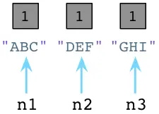
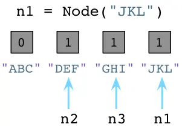
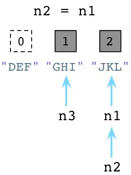

## python垃圾回收机制

python使用了自动化内存管理，这种管理机制以`引用计数`为基础，同时也引入了`标记-清除`和`分代收集`两种机制为辅的策略

导致引用计数+1的情况：

- 对象被创建，如`a = 23`
- 对象被引用，如`b = a`
- 对象被作为参数，传入到一个函数中,如`f(a)`
- 对象作为一个元素，存储在容器中，如`list1 = [a, a]`

导致引用计数-1的情况：

- 对象的别名被销毁，如`del a`
- 对象的别名被赋予新的对象
- 一个对象离开它的作用域，例如f函数执行完毕时，f函数中的局部变量
- 对象所在的日期被销毁，或从容器中删除对象

一下情况会导致垃圾回收：

- 调用`gc.collect()`
- `gc`模块的计数器达到阈值
- 程序退出

### 引用计数机制

python里每一个东西都是对象，它们的核心就是一个结构体：`PyObject`

```python
 typedef struct_object {
 int ob_refcnt; # 作为引用计数
 struct_typeobject *ob_type;
} PyObject;
    
#define Py_INCREF(op)   ((op)->ob_refcnt++) //增加计数
#define Py_DECREF(op) \ //减少计数
    if (--(op)->ob_refcnt != 0) \
        ; \
    else \
        __Py_Dealloc((PyObject *)(op))
```

- 引用计数机制的优点：

  1. 简单
  2. 实时性：一旦没有引用，内存就直接释放了。不用像其他等待机制等到特定实际。实时性还带来一个好处：处理回收内存的世界分摊到了平时

- 缺点：

  1. 维护引用计数消耗资源
  2. 循环引用

  ```
  list1 = []
  list2 = []
  list1.append(list2)
  list2.append(list1)
  ```

  list1与list2相互引用，如果不存在其他对象对他们的引用，list1与list2的引用计数也任然为1，所占用内存永远无法被回收，这是致命的。所以就有了编辑清除和分带收集

### GC

GC系统不仅仅承担垃圾回收机制，实际上：

1. 为新生成的对象分配内存
2. 识别那些垃圾对象
3. 从垃圾对象哪里回收内存

当python创建一个对象时，总是在对象的c结构体里保存一个整数，称为引用数



当我们改变了N1指向时，ABC的引用数变为0，此时会被垃圾回收释放内存



当一个对象有多个引用时




