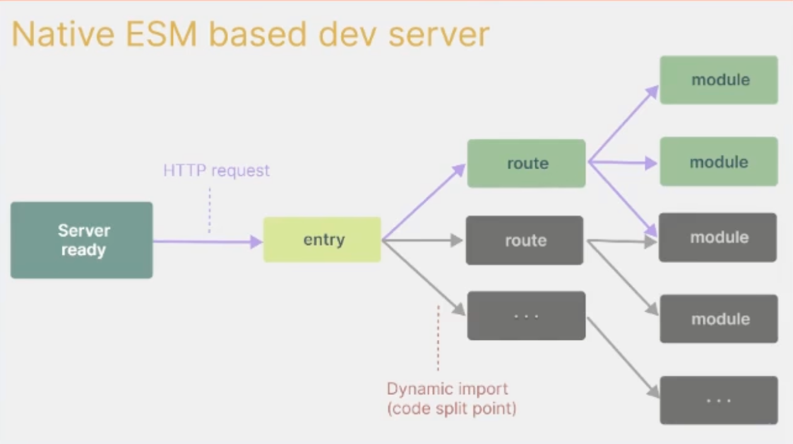
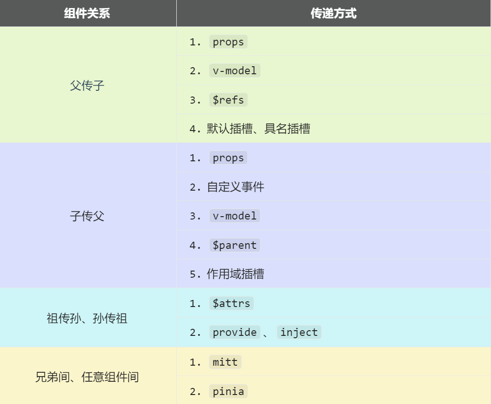

官方文档可在[vue](https://cn.vuejs.org/)查看。

vue是开源项目，学习源码可以访问[vue项目地址](https://github.com/vuejs/core)。
# 1 创建vue3工程

- 目前 `vue-cli` 已处于维护模式，官方推荐基于 [Vite](https://cn.vitejs.dev/) 创建项目。
- `vite`是新一代前端构建工具，`vite`优势如下：
    - 轻量快速的热重载(HMR)，能实现极速的服务启动。
    - 对 `TypeScript`、`JSX`、`CSS`等支持开箱即用。
    - 真正的按需编译，不再等待整个应用编译完成。
    - `webpack` 构建与 `vite` 构建对比如下：




- 创建vue项目步骤，可查看[官方文档](https://cn.vuejs.org/guide/quick-start.html)

```javascript
// 这一指令将会安装并执行 [create-vue](https://github.com/vuejs/create-vue)，它是 Vue 官方的项目脚手架工具。
$ npm create vue@latest

✔ Project name: … <your-project-name>
✔ Add TypeScript? … No / Yes
✔ Add JSX Support? … No / Yes
✔ Add Vue Router for Single Page Application development? … No / Yes
✔ Add Pinia for state management? … No / Yes
✔ Add Vitest for Unit testing? … No / Yes
✔ Add an End-to-End Testing Solution? … No / Cypress / Nightwatch / Playwright
✔ Add ESLint for code quality? … No / Yes
✔ Add Prettier for code formatting? … No / Yes
✔ Add Vue DevTools 7 extension for debugging? (experimental) … No / Yes

Scaffolding project in ./<your-project-name>...
Done.

// 如果不确定是否要开启某个功能，你可以直接按下回车键选择 `No`。在项目被创建后，通过以下步骤安装依赖并启动开发服务器：
$ cd <your-project-name>
$ npm install
$ npm run dev

```

- 推荐的 IDE 配置是 [Visual Studio Code](https://code.visualstudio.com/) + [Vue - Official 扩展](https://marketplace.visualstudio.com/items?itemName=Vue.volar)。如果使用其他编辑器，参考 [IDE 支持章节](https://cn.vuejs.org/guide/scaling-up/tooling.html#ide-support)。
- 更多工具细节，包括与后端框架的整合，我们会在[工具链指南](https://cn.vuejs.org/guide/scaling-up/tooling.html)进行讨论。
- 要了解构建工具 Vite 更多背后的细节，请查看 [Vite 文档](https://cn.vitejs.dev/)。
- 如果你选择使用 TypeScript，请阅读 [TypeScript 使用指南](https://cn.vuejs.org/guide/typescript/overview.html)。

- 当你准备将应用发布到生产环境时，请运行：

```javascript
npm run build
```

此命令会在 `./dist` 文件夹中为你的应用创建一个生产环境的构建版本。关于将应用上线生产环境的更多内容，请阅读[生产环境部署指南](https://cn.vuejs.org/guide/best-practices/production-deployment.html)。
## 1.1 项目结构

```bash
my-vue-project/
├── node_modules/     # 项目依赖的第三方库（npm install 后自动生成）
├── public/           # 静态资源目录（不会被构建工具处理）
├── src/              # 源代码目录（核心开发区域）
├── .gitignore        # Git 忽略文件配置
├── index.html        # 应用入口 HTML 文件
├── package.json      # 项目配置和依赖管理
├── vite.config.js    # Vite 配置文件（构建、插件、代理等）
├── tsconfig.json     # TypeScript 配置（如果选择 TypeScript）
└── README.md         # 项目说明文档
```

- `vite`项目中，`index.html`是项目的入口文件，在项目的最外层。
- 加载 `index.html` 后，`vite` 解析 `<script type="module" src="/src/main.js"></script>` 指向的 `javascript`。
- `vue3` 中通过 `createApp` 函数创建一个应用实例。​

> (1) public/ 目录​​

- ​**​作用​**​：存放无需经过构建工具处理的静态资源（如 `favicon.ico`、`robots.txt` 等）。
- ​**​特点​**​：
    - 文件会直接复制到构建输出目录（如 `dist/`）。
    - 通过 `/文件名` 直接访问（例如 ``）。

> ​(2) src/ 目录​​

```
src/
├── assets/           # 静态资源（图片、字体、CSS 等，会被构建工具处理）
├── components/       # 可复用的 Vue 组件（如 Button.vue、Header.vue）
├── App.vue           # 根组件（应用入口组件）
├── main.js           # 应用入口文件（初始化 Vue 实例）
└── ...
```

- ​**​`assets/`​**​  
    存放需要经过构建工具处理的静态资源（如 SCSS 文件、图片等）。构建时会优化这些资源（如压缩图片、编译 SCSS 到 CSS）。
    
- ​**​`components/`​**​  
    存放可复用的 Vue 组件。建议按功能或模块划分子目录（如 `components/Button`、`components/Modal`）。
    
- ​**​`App.vue`​**​  
    应用的根组件，所有页面和组件会在此组件内渲染。
    
- ​**​`main.js`​**​  
    应用入口文件，初始化 Vue 实例并挂载到 DOM：

```javascript
// vue中导出分为默认导出和命名导出，命名导出在别的文件导入必须用{}包裹
export default function() { console.log('默认导出') }
export const PI = 3.14
export const sum = (a, b) => a + b

import { createApp } from 'vue'      // 从 Vue 库导入应用创建函数
import App from './App.vue'          // 导入根组件

createApp(App).mount('#app')         // 创建应用实例并挂载到 DOM
```
    

> ​(3) 其他常见目录（按需添加）​​

- ​**​`router/`​**​  
    存放 Vue Router 配置（需手动安装 `vue-router`）：
    
    ```javascript
    // router/index.js
    import { createRouter, createWebHistory } from 'vue-router'
    import Home from '../views/Home.vue'
    
    const routes = [
      { path: '/', component: Home }
    ]
    
    export default createRouter({
      history: createWebHistory(),
      routes
    })
    ```
    
- ​**​`stores/`​**​  
    存放 Pinia 状态管理配置（需手动安装 `pinia`）：
    
    ```javascript
    // stores/counter.js
    import { defineStore } from 'pinia'
    
    export const useCounterStore = defineStore('counter', {
      state: () => ({ count: 0 }),
      actions: {
        increment() { this.count++ }
      }
    })
    ```
    
- ​**​`views/` 或 `pages/`​**​  
    存放页面级组件（如 `Home.vue`、`About.vue`），与路由对应。

- `index.html`

```javascript
// main.js中绑定的DOM
<div id="app"></div> 

// 导入main.js
<script type="module" src="/src/main.js"></script> 
```

> ​配置文件详解​​

> ​**​(1) `vite.config.js`​**​

- ​**​作用​**​：配置 Vite 构建行为（如插件、代理、别名等）。
- ​**​示例​**​：
    
    ```javascript
    import { defineConfig } from 'vite'
    import vue from '@vitejs/plugin-vue'
    
    export default defineConfig({
      plugins: [vue()],
      resolve: {
        alias: {
          '@': '/src'  // 路径别名（在代码中通过 import '@/components/Button.vue' 引用）
        }
      },
      server: {
        proxy: {
          '/api': 'http://localhost:3000'  // 开发服务器代理配置
        }
      }
    })
    ```
    

> ​**​(2) `package.json`​**​

- ​**​作用​**​：定义项目依赖、脚本命令和元信息。
- ​**​关键字段​**​：
    
    ```json
    {
      "scripts": {
        "dev": "vite",          // 启动开发服务器
        "build": "vite build",  // 构建生产环境代码
        "preview": "vite preview" // 预览构建后的应用
      },
      "dependencies": {
        "vue": "^3.4.0"         // 项目依赖
      },
      "devDependencies": {
        "vite": "^5.0.0",       // 开发依赖
        "@vitejs/plugin-vue": "^4.5.0"
      }
    }
    ```

> 环境变量文件​​

- ​**​`.env`​**​  : 存放环境变量（需以 `VITE_` 前缀开头才能在代码中访问）：
    
    ```
    VITE_API_URL=https://api.example.com
    ```
    
- ​**​代码中访问​**​：
    
    ```javascript
    const apiUrl = import.meta.env.VITE_API_URL
    ```
## 1.2 简单示例

> App.vue

```javascript
// vue文件里写三种标签

<template>
    <!-- html结构 -->
     <div class="app">
        <h1>你好啊！</h1>
        
     </div>
     <!-- 使用组件 -->
     <person/> 
</template>

<script lang="ts">
    // js代码或ts
    import person from "./components/Person.vue";
    export default {
        name: 'App',
        components:{person} // 注册组件
        
    }
</script>

<style>
    /* 样式 */
    .app {
        background-color: aqua;
        box-shadow: 0 0 10px;
        border-radius: 10px;
        padding: 20px;
    }
</style>

```

1. `export default`作用

| 类型           | 语法                   | 特点            |
| ------------ | -------------------- | ------------- |
| ​**​默认导出​**​ | `export default ...` | 一个模块只能有一个默认导出 |
| ​**​命名导出​**​ | `export const ...`   | 可导出多个，按名称引用   |

2. `lang="ts"` 的作用​​

- ​**​启用 TypeScript​**​：告诉 Vue 编译器此 `<script>` 块内的代码使用 TypeScript 语法
- ​**​类型检查​**​：会触发 TypeScript 的类型系统验证（需要项目中已配置 `tsconfig.json`）
- ​**​VS Code 支持​**​：结合 Volar 插件可获得完善的 TS 代码提示

 3. `name: 'App'` 的作用​​

- ​**​组件标识​**​：定义当前组件在 DevTools 中显示的名称
- ​**​递归组件​**​：当组件内部调用自身时需要依赖 `name` 属性
- ​**​`<keep-alive>` 缓存​**​：在 `include/exclude` 配置中通过 `name` 指定要缓存的组件

> components/Person.vue

```javascript
// 以下方式是用vue2语法定义

<template>
    <!-- html结构 -->
     <div class="person">
        <h2>姓名：{{ name }}</h2>
        <h2>年龄：{{ age }}</h2>
        <button @click="changeName">修改名字</button>
        <button @click="changeage">修改年龄</button>
        <button @click="showTel">显示联系方式</button>
     </div>
</template>

<script lang="ts">
    // js代码或ts
    export default {
        // 选项式API
        name: 'person',
        // 变量定义
        data(){
            return {
                name : "kelly",
                age: 18,
                tel: '12312312313'
            }
        },
        // 方法定义
        methods: {
            changeName(){
                this.name = "zhang-san"
            },
            changeage(){
                this.age += 1
            },
            showTel(){
                alert(this.tel)
            }
        }
    }
</script>

<style>
    /* 样式 */
    .person {
        background-color: aqua;
        box-shadow: 0 0 10px;
        border-radius: 10px;
        padding: 20px;
    }
</style>
```
# 2 vue3核心语法
## 2.1 OptionsAPI与CompositionAPI

- `vue2` 的 `API` 设计是 `Options`(配置)风格的。
- `vue3` 的 `API` 设计是 `Composition`(组合)风格的。

## 2.2 Options API 的弊端

`Options`类型的 `API`，数据、方法、计算属性等，是分散在：`data`、`methods`、`computed`中的，若想新增或者修改一个需求，就需要分别修改：`data`、`methods`、`computed`，不便于维护和复用。


## 2.3 Composition API 的优势

可以用函数的方式，更加优雅的组织代码，让相关功能的代码更加有序的组织在一起。


> 说明：以上四张动图原创作者：大帅老猿
## 2.4 setup

`setup`是`Vue3`中一个新的配置项，值是一个函数，它是 `Composition API` **“表演的舞台**_**”**_，组件中所用到的：数据、方法、计算属性、监视......等等，均配置在`setup`中。

特点如下：

- `setup`函数返回的对象中的内容，可直接在模板中使用。
- `setup`中访问`this`是`undefined`。
- `setup`函数会在`beforeCreate`之前调用，它是“领先”所有钩子执行的。

```vue
<template>
    <!-- html结构 -->
     <div class="person">
        <h2>姓名：{{ name }}</h2>
        <h2>年龄：{{ age }}</h2>
        <h2>{{ b }}</h2>
        <button @click="changeName">修改名字</button>
        <button @click="changeage">修改年龄</button>
        <button @click="showTel">显示联系方式</button>
     </div>
</template>

<script lang="ts">
    // js代码或ts
    export default {
        name: 'person', // 如果不指定默认为文件名
        // setup(){
            // 数据
            // let tel = '123123123131' // 此时的tel不是响应式的，函数修改对应变量后外部引用不会改变

            // 方法
        
            // function showTel(){
            //     alert(tel)
            // }

            // 暴露数据和函数，模板中才能使用
            // return {a:name,age,changeName,changeage,showTel}
            // 也可以直接返回渲染函数指定渲染的内容
            // 简写（箭头函数） ()=> '哈哈'
            // return function(){
            //     return '哈哈'
            // }
        // }

    }
</script>

<!-- setup语法糖：默认该标签内的都是setup -->
<!-- 该文件内的所有script必须是同一种语言 -->
 <!-- 同一个文件的setup必须唯一 -->
<!-- <script lang="ts" setup name="Person123"> -->
 <script lang="ts" setup>
    let b = 666
    let name = '张三'  //
            let age = 18
            let tel = '123123123131' // 此时的tel不是响应式的，函数修改对应变量后外部引用不会改变

            // 方法
            function changeName() {
                name = 'zhang-san'
            }

            function changeage(){
                age += 1
            }

            function showTel(){
                alert(tel)
            }
</script>

<style>
    /* 样式 */
    .person {
        background-color: aqua;
        box-shadow: 0 0 10px;
        border-radius: 10px;
        padding: 20px;
    }
</style>
```

- 如果想直接在 `setup` 语法糖中指定组件名：

```node
// 下载对应插件
npm i vite-plugin-vue-setup-extend -D

// vite.config.js文件中配置插件
import VueSetup from 'vite-plugin-vue-setup-extend'

export default defineConfig({
  plugins: [
    vue(),
    vueDevTools(),
    VueSetup
  ],
```

### 2.4.1 setup 与 Options API 的关系

- `Vue2` 的配置（`data`、`methos`......）中**可以访问到** `setup`中的属性、方法。
- 但在`setup`中**不能访问到**`Vue2`的配置（`data`、`methos`......）。
- 如果与`Vue2`冲突，则`setup`优先。
## 2.5 ref创建响应式数据

- **作用：**定义响应式变量。
- **语法：**`let xxx = ref(初始值)`。
- **返回值：**一个`RefImpl`的实例对象，简称`ref对象`或`ref`，`ref`对象的`value`**属性是响应式的**。

- **注意点：**

    - `JS`中操作数据需要：`xxx.value`，但模板中不需要`.value`，直接使用即可。
    - 对于`let name = ref('张三')`来说，`name`不是响应式的，`name.value`是响应式的。
    - ref对象在reactive中时可以直接使用 `name` 访问值，会自动解包
    - ref在模板中使用也可以不使用 `.value`

```vue
<template>
  <div class="person">
    <h2>姓名：{{name}}</h2>
    <h2>年龄：{{age}}</h2>
    <button @click="changeName">修改名字</button>
    <button @click="changeAge">年龄+1</button>
    <button @click="showTel">点我查看联系方式</button>
  </div>
</template>

<script setup lang="ts" name="Person">
  import {ref} from 'vue'
  // name和age是一个RefImpl的实例对象，简称ref对象，它们的value属性是响应式的。
  let name = ref('张三')
  let age = ref(18)
  // tel就是一个普通的字符串，不是响应式的
  let tel = '13888888888'

  function changeName(){
    // JS中操作ref对象时候需要.value
    name.value = '李四'
    console.log(name.value)

    // 注意：name不是响应式的，name.value是响应式的，所以如下代码并不会引起页面的更新。
    // name = ref('zhang-san')
  }
  function changeAge(){
    // JS中操作ref对象时候需要.value
    age.value += 1 
    console.log(age.value)
  }
  function showTel(){
    alert(tel)
  }
</script>

```
## 2.6 reactive 创建：对象类型的响应式数据

- **作用：**定义一个**响应式对象**（基本类型不要用它，要用`ref`，否则报错）
- **语法：**`let 响应式对象= reactive(源对象)`。
- **返回值：**一个`Proxy`的实例对象，简称：响应式对象。
- **注意点：**`reactive`定义的响应式数据是“深层次”的。

```vue
<template>
  <div class="person">
    <h2>汽车信息：一台{{ car.brand }}汽车，价值{{ car.price }}万</h2>
    <h2>游戏列表：</h2>
    <ul>
      <!-- v-for="i in games"​:Vue 的 ​​循环渲染指令​​。-->
      <!-- :key="g.id":为每个元素绑定 ​​唯一标识​​，优化虚拟 DOM 的更新效率。-->
      <li v-for="g in games" :key="g.id">{{ g.name }}</li>
    </ul>
    <h2>测试：{{obj.a.b.c.d}}</h2>
    <button @click="changeCarPrice">修改汽车价格</button>
    <button @click="changeFirstGame">修改第一游戏</button>
    <button @click="test">测试</button>
  </div>
</template>

<script lang="ts" setup name="Person">
import { reactive } from 'vue'

// 数据
let car = reactive({ brand: '奔驰', price: 100 })
let games = reactive([
  { id: 'ahsgdyfa01', name: '英雄联盟' },
  { id: 'ahsgdyfa02', name: '王者荣耀' },
  { id: 'ahsgdyfa03', name: '原神' }
])
let obj = reactive({
  a:{
    b:{
      c:{
        d:666
      }
    }
  }
})

function changeCarPrice() {
  car.price += 10
}
function changeFirstGame() {
  games[0].name = '流星蝴蝶剑'
}
function test(){
  obj.a.b.c.d = 999
}
</script>
```
## 2.7 ref 创建：对象类型的响应式数据

- 其实`ref`接收的数据可以是：**基本类型**、**对象类型**。
- 若`ref`接收的是对象类型，内部其实也是调用了`reactive`函数。

```vue
<template>
  <div class="person">
    <h2>汽车信息：一台{{ car.brand }}汽车，价值{{ car.price }}万</h2>
    <h2>游戏列表：</h2>
    <ul>
      <li v-for="g in games" :key="g.id">{{ g.name }}</li>
    </ul>
    <h2>测试：{{obj.a.b.c.d}}</h2>
    <button @click="changeCarPrice">修改汽车价格</button>
    <button @click="changeFirstGame">修改第一游戏</button>
    <button @click="test">测试</button>
  </div>
</template>

<script lang="ts" setup name="Person">
import { ref } from 'vue'

// 数据
let car = ref({ brand: '奔驰', price: 100 })
let games = ref([
  { id: 'ahsgdyfa01', name: '英雄联盟' },
  { id: 'ahsgdyfa02', name: '王者荣耀' },
  { id: 'ahsgdyfa03', name: '原神' }
])
let obj = ref({
  a:{
    b:{
      c:{
        d:666
      }
    }
  }
})

console.log(car)

function changeCarPrice() {
  car.value.price += 10
}
function changeFirstGame() {
  games.value[0].name = '流星蝴蝶剑'
}
function test(){
  obj.value.a.b.c.d = 999
}
</script>
```

## 2.8 ref 对比 reactive

宏观角度看：

> 1. `ref`用来定义：**基本类型数据**、**对象类型数据**；
>
> 2. `reactive`用来定义：**对象类型数据**。

- 区别：

> 1. `ref`创建的变量必须使用`.value`（可以使用`Vue - Official`插件自动添加`.value`）。
>
>     
>
> 2. `reactive`重新分配一个新对象，会**失去**响应式（可以使用`Object.assign`去整体替换）。


- 使用原则：

> 1. 若需要一个基本类型的响应式数据，必须使用`ref`。
> 2. 若需要一个响应式对象，层级不深，`ref`、`reactive`都可以。
> 3. 若需要一个响应式对象，且层级较深，推荐使用`reactive`。

## 2.9 toRefs 与 toRef

- 作用：将一个响应式对象中的每一个属性，转换为`ref`对象。**将一个响应式对象解构必定丢失响应式。**
- 备注：`toRefs`与`toRef`功能一致，但`toRefs`可以批量转换。
- 语法如下：

```vue
<template>
  <div class="person">
    <h2>姓名：{{person.name}}</h2>
    <h2>年龄：{{person.age}}</h2>
    <h2>性别：{{person.gender}}</h2>
    <button @click="changeName">修改名字</button>
    <button @click="changeAge">修改年龄</button>
    <button @click="changeGender">修改性别</button>
  </div>
</template>

<script lang="ts" setup name="Person">
  import {ref,reactive,toRefs,toRef} from 'vue'

  // 数据
  let person = reactive({name:'张三', age:18, gender:'男'})
	
  // 通过toRefs将person对象中的n个属性批量取出，且依然保持响应式的能力
  let {name,gender} =  toRefs(person)
	
  // 通过toRef将person对象中的gender属性取出，且依然保持响应式的能力
  let age = toRef(person,'age')

  // 方法
  function changeName(){
    name.value += '~'
  }
  function changeAge(){
    age.value += 1
  }
  function changeGender(){
    gender.value = '女'
  }
</script>
```
## 2.10 computed

作用：根据已有数据计算出新数据（和`Vue2`中的`computed`作用一致）。

  

```vue
<template>
  <div class="person">
   <!--v-model: 双向绑定-->
    姓：<input type="text" v-model="firstName"> <br>
    名：<input type="text" v-model="lastName"> <br>
    全名：<span>{{fullName}}</span> <br>
    <button @click="changeFullName">全名改为：li-si</button>
  </div>
</template>

<script setup lang="ts" name="App">
  import {ref,computed} from 'vue'

  let firstName = ref('zhang')
  let lastName = ref('san')

  // 计算属性——只读取，不修改，返回的也是ref类型
  /* let fullName = computed(()=>{
    return firstName.value + '-' + lastName.value
  }) */


  // 计算属性——既读取又修改
  let fullName = computed({
    // 读取
    get(){
      return firstName.value + '-' + lastName.value
    },
    // 修改
    set(val){
      console.log('有人修改了fullName',val)
      firstName.value = val.split('-')[0]
      lastName.value = val.split('-')[1]
    }
  })

  // 调用set方法并传参
  function changeFullName(){
    fullName.value = 'li-si'
  } 
</script>
```
## 2.11 watch

- 作用：监视数据的变化（和`Vue2`中的`watch`作用一致）
- 特点：`Vue3`中的`watch`只能监视以下**四种数据**：

> 1. `ref`定义的数据。
> 2. `reactive`定义的数据。
> 3. 函数返回一个值（`getter`函数）。
> 4. 一个包含上述内容的数组。

我们在`Vue3`中使用`watch`的时候，通常会遇到以下几种情况：

> 情况一：监视【ref】定义的【基本类型】数据

- 监视`ref`定义的【基本类型】数据：直接写数据名即可，监视的是其`value`值的改变。

```vue
<template>
    <div class="person">
      <h1>情况一：监视【ref】定义的【基本类型】数据</h1>
      <h1>{{ sum  }}</h1>
      <button @click="changeSum">增加值</button>
    </div>
  </template>
    
  <script setup lang="ts" name="App">
    import {ref, watch} from 'vue'
    let sum = ref(0)

    function changeSum(){
        sum.value += 1
    }

    // watch(谁？,回调函数)：情况1:监视【ref】定义的【基本类型】数据
    // 返回的值即是取消监控函数
    const stopWatch = watch(sum,(newValue,oldValue)=>{
        console.log("sum变化了",newValue,oldValue)
        if(newValue >= 10){
          stopWatch()
        }
    })
     
  </script>
```

> 情况二：监视【ref】定义的【对象类型】数据

- 监视`ref`定义的【对象类型】数据：直接写数据名，监视的是对象的【地址值】，若想监视对象内部的数据，要手动开启深度监视。

```vue
<template>
    <div class="person">
      <h1>情况二：监视【ref】定义的【对象类型】数据</h1>
      <h1>{{ person.name }},{{ person.age }}</h1>
      <button @click="changeName">修改名字</button>
      <button @click="changeAge">修改年龄</button>
      <button @click="changePer">修改人</button>
    </div>
  </template>
    
  <script setup lang="ts" name="App">
    import {ref, watch} from 'vue'
    let person = ref({
      name: 'zhang-san',
      age : 18
    })

    function changeName(){
      person.value.name += '~'
    }

    function changeAge(){
        person.value.age += 1
    }

    function changePer(){
      person.value = {name:"zhang",age:19  }
    }

    /* watch(谁？,回调函数,watch配置对象)：情况2:监视【ref】定义的【对象类型】数据。监视的是对象的地址值，若想监视对象内部属性的变化，需要手动开启深度监视
    
    监视，情况二：监视【ref】定义的【对象类型】数据，监视的是对象的地址值，若想监视对象内部属性的变化，需要手动开启深度监视
    watch的第一个参数是：被监视的数据
    watch的第二个参数是：监视的回调
    watch的第三个参数是：配置对象（deep、immediate等等.....） 
  */
    watch(person,(newValue,oldValue)=>{
      console.log('person变化了',newValue,oldValue)
    },{deep:true,immediate:true})
     
  </script>
```

> 注意：
> 
> * 若修改的是`ref`定义的对象中的属性，`newValue` 和 `oldValue` 都是新值，因为它们是同一个对象。
>
> * 若修改整个`ref`定义的对象，`newValue` 是新值， `oldValue` 是旧值，因为不是同一个对象了。

> 情况三：监视【reactive】定义的【对象类型】数据，且默认开启了深度监视

- 监视`reactive`定义的【对象类型】数据，且默认开启了深度监视。

```vue
<template>
    <div class="person">
      <h1>情况三：监视【reactive】定义的【对象类型】数据，且默认开启了深度监视</h1>
      <h1>{{ person.name }},{{ person.age }}</h1>
      <button @click="changeName">修改名字</button>
      <button @click="changeAge">修改年龄</button>
      <button @click="changePer">修改人</button>
    </div>
  </template>
    
  <script setup lang="ts" name="App">
    import {reactive, watch} from 'vue'
    let person = reactive({
      name: 'zhang-san',
      age : 18
    })

    function changeName(){
      person.name += '~'
    }

    function changeAge(){
        person.age += 1
    }

    function changePer(){
      Object.assign(person,{name:"zhang",age:19  })
    }

    // watch(谁？,回调函数)：情况三：监视【reactive】定义的【对象类型】数据，且默认开启了深度监视
    watch(person,(newValue,oldValue)=>{
      console.log('person变化了',newValue,oldValue)
    })
     
  </script>
```

> 情况四：监视`ref`或`reactive`定义的【对象类型】数据中的**某个属性**

监视`ref`或`reactive`定义的【对象类型】数据中的**某个属性**，注意点如下：

1. 若该属性值**不是**【对象类型】，需要写成函数形式。
2. 若该属性值是**依然**是【对象类型】，可直接编，也可写成函数，建议写成函数。

结论：监视的要是对象里的属性，那么最好写函数式，注意点：若是对象监视的是地址值，需要关注对象内部，需要手动开启深度监视。

```vue
<template>
    <div class="person">
      <h1>情况四：监视ref或reactive定义的【对象类型】数据中的某个属性</h1>
      <h1>姓名：{{ person.name }}</h1>
      <h1>年龄：{{ person.age }}</h1>
      <h1>车：{{ person.car.c1 }} {{ person.car.c2 }}</h1>
      <button @click="changeName">修改名字</button>
      <button @click="changeAge">修改年龄</button>
      <button @click="changeC1">修改第一台车</button>
      <button @click="changeC2">修改第二台车</button>
      <button @click="changePer">修改人</button>
    </div>
  </template>
    
  <script setup lang="ts" name="App">
  import {reactive, toRef, watch} from 'vue'
  let person = reactive({
    name: '章三',
    age: 18,
    car:{
      c1:'奔驰',
      c2:'宝马'
  }
  })
  
  function changeName(){
      person.name += '~'
    }

    function changeAge(){
        person.age += 1
    }

    function changePer(){
      Object.assign(person,{name:"zhang",age:19,car:{c1:"小米su7"}})
    }

    function changeC1(){
      person.car.c1 = '奥迪'
    }
    function changeC2(){
      person.car.c2 = '大众'
    }

    watch(()=>person.name,(newValue,oldValue)=>{
      console.log("person name改变了",newValue,oldValue)
    })

       // 监视的还是一个对象，可以直接写，也可以写成函数式
    watch(()=>person.car,(newValue,oldValue)=>{
      console.log("person name改变了",newValue,oldValue)
    },{deep:true})
     
  </script>
```

> 情况五：监视上述多个数据

```vue
watch([()=>person.name,person.car],(newValue,oldValue)=>{
      console.log("person name和car改变了",newValue,oldValue)
    })
```
## 2.12 watchEffect

* 官网：立即运行一个函数，同时响应式地追踪其依赖，并在依赖更改时重新执行该函数。

* `watch`对比`watchEffect`

>   1. 都能监听响应式数据的变化，不同的是监听数据变化的方式不同
  >
  > 2. `watch`：要明确指出监视的数据
  >
  > 3. `watchEffect`：不用明确指出监视的数据（函数中用到哪些属性，那就监视哪些属性）。

```vue
<template>
  <div class="person">
    <h1>需求：在水温大于60或水位大于80的时候给服务器发送请求</h1>
    <h1>水温：{{ temp }}</h1>
    <h1>水位：{{ height }}</h1>
    <button @click="changeTemp">增加温度</button>
    <button @click="changeHeight">增加水位</button>
  </div>
</template>
  
<script setup lang="ts" name="App">
  import {ref, watch,watchEffect} from 'vue'
  let temp = ref(10)
  let height = ref(0)

  function changeTemp(){
    temp.value += 10
  }
  function changeHeight(){
    height.value += 10
  }
  // watch实现
  // watch([temp,height],(value)=>{
  //   let [newTemp,newHight] = value
  //   if (newTemp > 60 || newHight > 80) {
  //       console.log("给服务器发请求",newTemp,newHight )
  //   }
  // })

  watchEffect((value)=>{

    if (temp.value > 60 || height.value > 80) {
        console.log("给服务器发请求",temp.value,height.value )
    }
  })
   
</script>
```
## 2.13 标签中的ref属性

作用：用于注册模板引用。

> * 用在普通`DOM`标签上，获取的是`DOM`节点。
>
> * 用在组件标签上，获取的是组件实例对象。

用在普通`DOM`标签上：

```vue
<template>
  <div class="person">
    <h1 ref="title1">尚硅谷</h1>
    <h2 ref="title2">前端</h2>
    <h3 ref="title3">Vue</h3>
    <input type="text" ref="inpt"> <br><br>
    <button @click="showLog">点我打印内容</button>
  </div>
</template>

<script lang="ts" setup name="Person">
  import {ref} from 'vue'
	
  let title1 = ref()
  let title2 = ref()
  let title3 = ref()

  function showLog(){
    // 通过id获取元素
    const t1 = document.getElementById('title1')
    // 打印内容
    console.log((t1 as HTMLElement).innerText)
    console.log((<HTMLElement>t1).innerText)
    console.log(t1?.innerText)
    
		/************************************/
		
    // 通过ref获取元素
    console.log(title1.value)
    console.log(title2.value)
    console.log(title3.value)
  }
</script>
```

用在组件标签上：

```vue
<!-- 父组件App.vue -->
<template>
  <Person ref="ren"/>
  <button @click="test">测试</button>
</template>

<script lang="ts" setup name="App">
  import Person from './components/Person.vue'
  import {ref} from 'vue'

  let ren = ref()

  function test(){
    console.log(ren.value.name)
    console.log(ren.value.age)
  }
</script>


<!-- 子组件Person.vue中要使用defineExpose暴露内容 -->
<script lang="ts" setup name="Person">
  import {ref,defineExpose} from 'vue'
	// 数据
  let name = ref('张三')
  let age = ref(18)
  /****************************/
  /****************************/
  // 使用defineExpose将组件中的数据交给外部
  defineExpose({name,age})
</script>
```
## 2.14 props

- **Props​**​ 是组件之间传递数据的核心机制，用于父组件向子组件传递数据。

```typescript
// index.ts
// 定义一种接口，用于限制person对象的具体属性
export interface PersonInter {
    id:string,
    name:string,
    age:number
    // x?:number // 可选
}

// 自定义类型
// export type Persons = Array<PersonInter>
export type Persons = PersonInter[]
```

```vue
<!-- App.vue -->
<template>
     <!-- <person a="哈哈" :list="personList"/>  -->
      <!-- v-if 判断表达式是否成立，不成立销毁组件及状态 -->
       <!-- v-show逻辑一样，但不销毁组件，只是通过display让组件不显示 -->
     <person a="哈哈" v-if="a" v-show="a"/> 

</template>

<script lang="ts" name="App" setup>
    import person from "./components/Person.vue";
    import { type Persons } from "@/types";
    import { reactive } from "vue";

    let personList = reactive<Persons>([
        {id:'1',name:'王五',age:10},
        {id:'2',name:'李四',age:20},
    ])
</script>

<style>
    /* 样式 */
    .app {
        background-color: aqua;
        box-shadow: 0 0 10px;
        border-radius: 10px;
        padding: 20px;
    }
</style>
```

```vue
<!--Person.vue-->
<template>
  <div class="person">

    <ul>
      <li v-for="i in list" :key="i.id">{{ i }}</li>
    </ul>
  
  </div>
</template>
  
<script setup lang="ts" name="App">
  // define开头都属于宏函数可以不导入使用 
  import { defineProps,withDefaults } from 'vue';
  import { type Persons } from '@/types';

  // 仅接受变量
  // defineProps(['a','list'])

  // 接收加限制
  // defineProps<{list:Persons}>()

  // 接收加限制加必要性加默认值
   withDefaults(defineProps<{list?:Persons}>(),{
    list:()=>[{id:'1',name:'zhangsan',age:19}]
   })


  // 接收加保存
  // let x = defineProps(['a','list'])
  // console.log(x.a)

</script>

<!-- scoped：定义局部样式 -->
<style scoped>
  .person {
    background-color: aqua;
  }
</style>

```
## 2.15 生命周期

> 创建阶段：`setup`
  >
  > 挂载阶段：`onBeforeMount`、`onMounted`
  >
  > 更新阶段：`onBeforeUpdate`、`onUpdated`
  >
  > 卸载阶段：`onBeforeUnmount`、`onUnmounted`

* 常用的钩子：`onMounted`(挂载完毕)、`onUpdated`(更新完毕)、`onBeforeUnmount`(卸载之前)

* 示例代码：

  ```vue
  <template>
    <div class="person">
      <h2>当前求和为：{{ sum }}</h2>
      <button @click="changeSum">点我sum+1</button>
    </div>
  </template>
  
  <!-- vue3写法 -->
  <script lang="ts" setup name="Person">
    import { 
      ref, 
      onBeforeMount, 
      onMounted, 
      onBeforeUpdate, 
      onUpdated, 
      onBeforeUnmount, 
      onUnmounted 
    } from 'vue'
  
    // 数据
    let sum = ref(0)
    // 方法
    function changeSum() {
      sum.value += 1
    }
    console.log('setup')
    // 生命周期钩子
    onBeforeMount(()=>{
      console.log('挂载之前')
    })
    onMounted(()=>{
      console.log('挂载完毕')
    })
    onBeforeUpdate(()=>{
      console.log('更新之前')
    })
    onUpdated(()=>{
      console.log('更新完毕')
    })
    onBeforeUnmount(()=>{
      console.log('卸载之前')
    })
    onUnmounted(()=>{
      console.log('卸载完毕')
    })
  </script>
  ```
## 2.16 自定义Hook

- 下载axios包

```node
npm i axios
```

- 什么是`hook`？—— 本质是一个函数，把`setup`函数中使用的`Composition API`进行了封装，类似于`vue2.x`中的`mixin`。

- 自定义`hook`的优势：复用代码, 让`setup`中的逻辑更清楚易懂。

- 命名规范使用 `usexxx` 形式。

> 示例代码：

- `useSum.ts`中内容如下：

```js
import { ref } from 'vue';
    
export default function(){
  let sum = ref(0)

  function changeSum(){
    sum.value += 1
  }
  return {sum,changeSum}
}
```
  
- `useDog.ts`中内容如下：

```typescript
import axios from 'axios';
import { reactive } from 'vue';

export default function(){
  let dogList = reactive([
    "https:\/\/images.dog.ceo\/breeds\/pembroke\/n02113023_5295.jpg"
  ])

  async function getDog(){
    try {
      let result = await axios.get("https://dog.ceo/api/breed/pembroke/images/random")
      dogList.push(result.data.message)
    } catch (error) {
      alert(error)
    }
  }
  // 向外部提供东西
  return {dogList,getDog}
}
```

- 组件中具体使用：

```vue
<template>
  <div class="person">
  <h1>{{sum}}</h1>
  <button @click="changeSum">点击加1</button>
    <hr>
  
  <br>
    <button @click="getDog">再来一只狗</button>
  </div>
</template>
  
<script setup lang="ts" name="App">
import useSum from '@/hooks/useSum';
import useDog from '@/hooks/useDog';

const {sum,changeSum} = useSum()
const {dogList,getDog} = useDog()

</script>  

<!-- scoped：定义局部样式 -->
<style scoped>
  .person {
    background-color: aqua;
  }
  
  img{
    height: 100px;
  }
</style>

```
# 3 路由

- 使用路由前需要安装路由

```node
npm i vue-router
```

> 使用路由步骤

```typescript
// router/index.ts

// 创建一个路由器，并暴露出去 

// 引入createRouter
import { createRouter, createWebHistory } from "vue-router";

// 引入呈现组件
import Home from "@/components/Home.vue";
import News from "@/components/News.vue";
import About from "@/components/About.vue";

// 创建路由器
const router = createRouter({
    history:createWebHistory(), // 路由器的工作模式
    routes:[  // 路由规则
        {
            path:'/home',
            component:Home
        },
        {
            path:'/news',
            component:News
        },
        {
            path:'/about',
            component:About
        }
    ]
})

export default router
```

```js
// main.js

import {createApp} from 'vue'
import App from './App.vue'
import router from './router'

const app = createApp(App)
app.use(router) // 在应用中使用路由
app.mount('#app')
```

```vue
<!--App.vue-->

<template>
    <h2>路由测试</h2>
    <!-- 导航区 -->
     <div class="navigate">
         <!-- RouterLink内置的超链接组件 -->
        <RouterLink to="/home" active-class="test">首页</RouterLink>
        <RouterLink to="/news" active-class="test">新闻</RouterLink>
        <RouterLink to="/about" active-class="test">关于</RouterLink>
    </div>
     <!-- 展示区 -->
      <div class="main-content">
        <!-- Routerview内置的路由视图，指定路由展示的位置 -->
            <RouterView></RouterView>
      </div>
</template>

<script lang="ts" name="App" setup>
import { RouterView,RouterLink } from 'vue-router';
</script>

<style>
    /* 样式 */
    .test{
        color: blueviolet;
        background-color: aqua;
    }
</style>
```
## 3.1 两个注意点

 1. 路由组件通常存放在`pages` 或 `views`文件夹，一般组件通常存放在`components`文件夹。
 
 2. 通过点击导航，视觉效果上“消失” 了的路由组件，默认是被**卸载**掉的，需要的时候再去**挂载**。

> 一般组件：亲手写标签出来的，如\<Dome/\>。
> 
> 路由组件：靠路由的规则渲染出来的。
## 3.2 路由器工作模式

#TODO：服务端怎么配合处理路径问题
1. `history`模式

> 优点：`URL`更加美观，不带有`#`，更接近传统的网站`URL`。
   >
> 缺点：后期项目上线，需要服务端配合处理路径问题，否则刷新会有`404`错误。
   >
   > ```js
   > const router = createRouter({
   >   	history:createWebHistory(), //history模式
   >   	/******/
   > })
   > ```

2. `hash`模式

> 优点：兼容性更好，因为不需要服务器端处理路径。
   >
> 缺点：`URL`带有`#`不太美观，且在`SEO`优化方面相对较差。
   >
   > ```js
   > const router = createRouter({
   >   	history:createWebHashHistory(), //hash模式
   >   	/******/
   > })
   > ```
   
## 3.3 to的两种写法

```vue
<!-- 第一种：to的字符串写法 -->
<router-link active-class="active" to="/home">主页</router-link>

<!-- 第二种：to的对象写法 -->
<router-link active-class="active" :to="{path:'/home'}">Home</router-link>
```
## 3.4 命名路由

作用：可以简化路由跳转及传参（后面就讲）。

给路由规则命名：

```ts
routes:[
  {
    name:'zhuye',
    path:'/home',
    component:Home
  },
  {
    name:'xinwen',
    path:'/news',
    component:News,
  },
  {
    name:'guanyu',
    path:'/about',
    component:About
  }
]
```

跳转路由：

```vue
<!--简化前：需要写完整的路径（to的字符串写法） -->
<router-link to="/news/detail">跳转</router-link>

<!--简化后：直接通过名字跳转（to的对象写法配合name属性） -->
<router-link :to="{name:'guanyu'}">跳转</router-link>
```
## 3.5 嵌套路由

1. 编写`News`的子路由：`Detail.vue`

2. 配置路由规则，使用`children`配置项：

   ```ts
   const router = createRouter({
     history:createWebHistory(),
   	routes:[
   		{
   			name:'zhuye',
   			path:'/home',
   			component:Home
   		},
   		{
   			name:'xinwen',
   			path:'/news',
   			component:News,
   			children:[
   				{
   					name:'xiang',
   					path:'detail',
   					component:Detail
   				}
   			]
   		},
   		{
   			name:'guanyu',
   			path:'/about',
   			component:About
   		}
   	]
   })
   export default router
   ```
   
3. 跳转路由（记得要加完整路径）：

   ```vue
   <router-link to="/news/detail">xxxx</router-link>
   <!-- 或 -->
   <router-link :to="{path:'/news/detail'}">xxxx</router-link>
   ```

4. 记得去`Home`组件中预留一个`<router-view>`

   ```vue
   <template>
     <div class="news">
       <nav class="news-list">
         <RouterLink v-for="news in newsList" :key="news.id" :to="{path:'/news/detail'}">
           {{news.name}}
         </RouterLink>
       </nav>
       <div class="news-detail">
         <RouterView/>
       </div>
     </div>
   </template>
   ```
## 3.6 传递参数
### 3.6.1 query参数

  1. 传递参数

      ```vue
      <!-- 跳转并携带query参数（to的字符串写法） -->
      <router-link to="/news/detail?a=1&b=2&content=欢迎你">
      	跳转
      </router-link>
      				
      <!-- 跳转并携带query参数（to的对象写法） -->
      <RouterLink 
        :to="{
          //name:'xiang', //用name也可以跳转
          path:'/news/detail',
          query:{
            id:news.id,
            title:news.title,
            content:news.content
          }
        }"
      >
        {{news.title}}
      </RouterLink>
      ```

   2. 接收参数：

      ```js
      import {useRoute} from 'vue-router'
      const route = useRoute()
      // 打印query参数
      console.log(route.query)
      ```


### 3.6.2 params参数

   1. 占位

```ts
 {
            path:'/news',
            component:News,
            children: [{
                name:'detail',
                path: 'detail/:id/:title/:content?', // 参数的必要性
                component: detail
            }]
            
        },
```

   2. 传递参数

```vue
      <!-- 跳转并携带params参数（to的字符串写法） -->
      <RouterLink :to="`/news/detail/001/新闻001/内容001`">{{news.title}}</RouterLink>
      				
      <!-- 跳转并携带params参数（to的对象写法） -->
      <RouterLink 
        :to="{
          name:'xiang', //用name跳转
          params:{
            id:news.id,
            title:news.title,
            content:news.title
          }
        }"
      >
        {{news.title}}
      </RouterLink>
 ```

   3. 接收参数：

```ts
      import {useRoute} from 'vue-router'
      const  route = useRoute()
      // 打印params参数
      console.log(route.params)
```

> 备注1：传递`params`参数时，若使用`to`的对象写法，必须使用`name`配置项，不能用`path`。
>
> 备注2：传递`params`参数时，需要提前在规则中占位。
> 
> 备注3：不允许传对象和数组。
## 3.7 路由的props配置

作用：让路由组件更方便的收到参数（可以将路由参数作为`props`传给组件）

```ts
{
	name:'xiang',
	path:'detail/:id/:title/:content',
	component:Detail,

  // props的对象写法，作用：把对象中的每一组key-value作为props传给Detail组件
  // props:{a:1,b:2,c:3}, 

  // props的布尔值写法，作用：把收到了每一组params参数，作为props传给Detail组件
  // props:true
  
  // props的函数写法，作用：把返回的对象中每一组key-value作为props传给Detail组件
  props(route){
    return route.query
  }
}
```
## 3.8 replace属性


  1. 作用：控制路由跳转时操作浏览器历史记录的模式。

  2. 浏览器的历史记录有两种写入方式：分别为```push```和```replace```：

     - ```push```是追加历史记录（默认值）。
     - `replace`是替换当前记录。

  3. 开启`replace`模式：

```vue
     <RouterLink replace .......>News</RouterLink>
```
## 3.9 编程式导航

- 路由组件的两个重要的属性：`$route`和`$router`变成了两个`hooks`

```js
import {useRoute,useRouter} from 'vue-router'

const route = useRoute()
const router = useRouter()

console.log(route.query)
console.log(route.parmas)
console.log(router.push)
console.log(router.replace)

```

> 示例代码

```vue
<script lang="ts" name="App" setup>
    import { RouterView,RouterLink,useRouter } from 'vue-router';

    const router = useRouter()

    interface NewInter {
        id: string,
        title:string,
        content:string
    }

    // 点击事件跳转
    function showNews(news:NewInter){
        router.push({  // 历史记录模式
          name:'xiang', //用name跳转
          params:{
            id:news.id,
            title:news.title,
            content:news.title
          }
        },
        ) // 该方法能写所有to能写的
    }
</script>
```
## 3.10 重定向

1. 作用：将特定的路径，重新定向到已有路由。

2. 具体编码：

```js
   {
       path:'/',
       redirect:'/about'
   }
```
# 4 pinia

- 集中式状态管理：管理共享数据。

> 准备下图效果


> 搭建pinia环境

- 下载：`npm install pinia`。

- 使用pinia：

```js
// main.js

import {createApp} from 'vue'
import App from './App.vue'
// 第一步：导入pinia
import { createPinia } from 'pinia'


const app = createApp(App)

// 第二步：创建pinia
const pinia = createPinia()

// 第三步：安装pinia
app.use(pinia)

app.mount('#app')
```
## 4.1 存储加读取数据

- 目录规范：在src目录下创建store目录，并创建count.ts文件。一般pinia文件都存放在store中，并且文件名应该和组件名一致。

1. `Store`是一个保存：**状态**、**业务逻辑** 的实体，每个组件都可以**读取**、**写入**它。

2. 它有三个概念：`state`、`getter`、`action`，相当于组件中的： `data`、 `computed` 和 `methods`。

3. 具体编码：`src/store/count.ts`

   ```ts
   // 引入defineStore用于创建store
   import {defineStore} from 'pinia'
   
   // 定义并暴露一个store
   export const useCountStore = defineStore('count',{
     // 动作
     actions:{},
     // 状态
     state(){
       return {
         sum:6
       }
     },
     // 计算
     getters:{}
   })
   ```

4. 具体编码：`src/store/talk.ts`

   ```js
   // 引入defineStore用于创建store
   import {defineStore} from 'pinia'
   
   // 定义并暴露一个store
   export const useTalkStore = defineStore('talk',{
     // 动作
     actions:{},
     // 状态
     state(){
       return {
         talkList:[
           {id:'yuysada01',content:'你今天有点怪，哪里怪？怪好看的！'},
        		{id:'yuysada02',content:'草莓、蓝莓、蔓越莓，你想我了没？'},
           {id:'yuysada03',content:'心里给你留了一块地，我的死心塌地'}
         ]
       }
     },
     // 计算
     getters:{}
   })
   ```
   
5. 组件中使用`state`中的数据

   ```vue
   <template>
     <h2>当前求和为：{{ sumStore.sum }}</h2> 
   </template>
   
   <script setup lang="ts" name="Count">
     // 引入对应的useXxxxxStore	
     import {useSumStore} from '@/store/sum'
     
     // 调用useXxxxxStore得到对应的store
     const sumStore = useSumStore()
   </script>
   ```

   ```vue
   <template>
   	<ul>
   	<!-- 在reactive对象中的ref对象不用手动value解包，自动解包了 -->
       <li v-for="talk in talkStore.talkList" :key="talk.id">
         {{ talk.content }}
       </li>
     </ul>
   </template>
   
   <script setup lang="ts" name="Count">
     import axios from 'axios'
     import {useTalkStore} from '@/store/talk'
   
     const talkStore = useTalkStore()
   </script>
   ```
## 4.2 修改数据

1. 第一种修改方式，直接修改

   ```ts
   countStore.sum = 666
   ```

2. 第二种修改方式：批量修改

   ```ts
   countStore.$patch({
     sum:999,
     school:'atguigu'
   })
   ```

3. 第三种修改方式：借助`action`修改（`action`中可以编写一些业务逻辑）

   ```js
   import { defineStore } from 'pinia'
   
   export const useCountStore = defineStore('count', {
     /*************/
     actions: {
       //加
       increment(value:number) {
         if (this.sum < 10) {
           //操作countStore中的sum
           this.sum += value
         }
       },
       //减
       decrement(value:number){
         if(this.sum > 1){
           this.sum -= value
         }
       }
     },
     /*************/
   })
   ```

4. 组件中调用`action`即可

   ```js
   // 使用countStore
   const countStore = useCountStore()
   
   // 调用对应action
   countStore.incrementOdd(n.value)
   ```
## 4.3 storeToRefs

- 借助`storeToRefs`将`store`中的数据转为`ref`对象，方便在模板中使用。

- 注意：`pinia`提供的`storeToRefs`只会将数据做转换，而`Vue`的`toRefs`会转换`store`中数据。

```vue

<template>
	<div class="count">
    	<!-- ref对象在模板中使用不用谢value -->
		<h2>当前求和为：{{sum}}</h2> 
	</div>
</template>

<script setup lang="ts" name="Count">
  import { useCountStore } from '@/store/count'
  /* 引入storeToRefs */
  import { storeToRefs } from 'pinia'

	/* 得到countStore */
  const countStore = useCountStore()
  /* 使用storeToRefs转换countStore，随后解构 */
  const {sum} = storeToRefs(countStore)
</script>

```
  
## 4.4 getters

  1. 概念：当`state`中的数据，需要经过处理后再使用时，可以使用`getters`配置。

  2. 追加```getters```配置。

     ```js
     // 引入defineStore用于创建store
     import {defineStore} from 'pinia'
     
     // 定义并暴露一个store
     export const useCountStore = defineStore('count',{
       // 动作
       actions:{
         /************/
       },
       // 状态
       state(){
         return {
           sum:1,
           school:'atguigu'
         }
       },
       // 计算
       getters:{
         bigSum:(state):number => state.sum *10,
         upperSchool():string{
           return this. school.toUpperCase()
         }
       }
     })
     ```

  3. 组件中读取数据：

     ```js
     const {increment,decrement} = countStore
     let {sum,school,bigSum,upperSchool} = storeToRefs(countStore)
     ```
## 4.5 $subscribe

通过 store 的 `$subscribe()` 方法侦听 `state` 及其变化

```ts
talkStore.$subscribe((mutate,state)=>{
  console.log('LoveTalk',mutate,state)
  localStorage.setItem('talk',JSON.stringify(talkList.value))
})
```
## 4.6 store组合式写法

```ts
import {defineStore} from 'pinia'
import axios from 'axios'
import {nanoid} from 'nanoid'
import {reactive} from 'vue'

export const useTalkStore = defineStore('talk',()=>{
  // talkList就是state
  const talkList = reactive(
    JSON.parse(localStorage.getItem('talkList') as string) || []
  )

  // getATalk函数相当于action
  async function getATalk(){
    // 发请求，下面这行的写法是：连续解构赋值+重命名
    let {data:{content:title}} = await axios.get('https://api.uomg.com/api/rand.qinghua?format=json')
    // 把请求回来的字符串，包装成一个对象
    let obj = {id:nanoid(),title}
    // 放到数组中
    talkList.unshift(obj)
  }
  return {talkList,getATalk}
})
```
# 5 组件间通信

**`Vue3`组件通信和`Vue2`的区别：**

* 移出事件总线，使用`mitt`代替。

- `vuex`换成了`pinia`。
- 把`.sync`优化到了`v-model`里面了。
- 把`$listeners`所有的东西，合并到`$attrs`中了。
- `$children`被砍掉了。

- 常见搭配形式：


## 5.1 props

概述：`props`是使用频率最高的一种通信方式，常用与 ：**父 ↔ 子**。

- 若 **父传子**：属性值是**非函数**。
- 若 **子传父**：属性值是**函数**。

> 父组件：

```vue
<template>
  <div class="father">
    <h3>父组件，</h3>
		<h4>我的车：{{ car }}</h4>
		<h4>儿子给的玩具：{{ toy }}</h4>
		<Child :car="car" :getToy="getToy"/>
  </div>
</template>

<script setup lang="ts" name="Father">
	import Child from './Child.vue'
	import { ref } from "vue";
	// 数据
	const car = ref('奔驰')
	const toy = ref()
	// 方法
	function getToy(value:string){
		toy.value = value
	}
</script>
```

> 子组件

```vue
<template>
  <div class="child">
    <h3>子组件</h3>
		<h4>我的玩具：{{ toy }}</h4>
		<h4>父给我的车：{{ car }}</h4>
		<button @click="getToy(toy)">玩具给父亲</button>
  </div>
</template>

<script setup lang="ts" name="Child">
	import { ref } from "vue";
	const toy = ref('奥特曼')
	
	defineProps(['car','getToy'])
</script>
```
## 5.2 自定义事件

1. 概述：自定义事件常用于：**子 => 父。**
2. 注意区分好：原生事件、自定义事件。

- 原生事件：
  - 事件名是特定的（`click`、`mosueenter`等等）	
  - 事件对象`$event`: 是包含事件相关信息的对象（`pageX`、`pageY`、`target`、`keyCode`）
- 自定义事件：
  - 事件名是任意名称
  - <strong style="color:red">事件对象`$event`: 是调用`emit`时所提供的数据，可以是任意类型！！！</strong >

3. 示例：

```html
<template>
  <div class="father">
    <h3>父组件</h3>
		<h4 v-show="toy">子给的玩具：{{ toy }}</h4>
		<!-- 给子组件Child绑定事件 -->
    <Child @send-toy="saveToy"/>
  </div>
</template>

<script setup lang="ts" name="Father">
  import Child from './Child.vue'
	import { ref } from "vue";
	// 数据
	let toy = ref('')
	// 用于保存传递过来的玩具
	function saveToy(value:string){
		console.log('saveToy',value)
		toy.value = value
	}
</script>
```

```js
<template>
  <div class="child">
    <h3>子组件</h3>
		<h4>玩具：{{ toy }}</h4>
		<button @click="emit('send-toy',toy)">测试</button>
  </div>
</template>

<script setup lang="ts" name="Child">
	import { ref } from "vue";
	// 数据
	let toy = ref('奥特曼')
	// 声明事件
	const emit =  defineEmits(['send-toy'])
</script>
```
## 5.3 mitt

概述：与消息订阅与发布（`pubsub`）功能类似，可以实现任意组件间通信。

- 安装`mitt`

```shell
npm i mitt
```

- 新建文件：`src\utils\emitter.ts`

```javascript
// 引入mitt 
import mitt from "mitt";

// 创建emitter
const emitter = mitt()

/*
  // 绑定事件
  emitter.on('abc',(value)=>{
    console.log('abc事件被触发',value)
  })
  emitter.on('xyz',(value)=>{
    console.log('xyz事件被触发',value)
  })

  setInterval(() => {
    // 触发事件
    emitter.emit('abc',666)
    emitter.emit('xyz',777)
  }, 1000);

  setTimeout(() => {
    // 清理事件
    emitter.all.clear()
  }, 3000); 
*/

// 创建并暴露mitt
export default emitter
```

- 接收数据的组件中：绑定事件、同时在销毁前解绑事件：

```typescript
import emitter from "@/utils/emitter";
import { onUnmounted } from "vue";

// 绑定事件
emitter.on('send-toy',(value)=>{
  console.log('send-toy事件被触发',value)
})

onUnmounted(()=>{
  // 解绑事件
  emitter.off('send-toy')
})
```

- 提供数据的组件：在合适的时候触发事件

```javascript
import emitter from "@/utils/emitter";

function sendToy(){
  // 触发事件
  emitter.emit('send-toy',toy.value)
}
```

**注意这个重要的内置关系，总线依赖着这个内置关系**
## 5.4 v-model

1. 概述：实现 **父↔子** 之间相互通信。

2. 前序知识 —— `v-model`的本质

```vue
   <!-- 使用v-model指令 -->
   <input type="text" v-model="userName">
   
   <!-- v-model的本质是下面这行代码 -->
   <input 
     type="text" 
     :value="userName" 
     @input="userName =(<HTMLInputElement>$event.target).value"
   >
   <!--
   对于原生事件，$even就是事件对象 ====》 能.target
   对于自定义事件，$event就是触发事件时所传递的数据 ===> 不能.target
   -->
   
```

3. 组件标签上的`v-model`的本质：`:moldeValue` ＋ `update:modelValue`事件。

```vue
   <!-- 组件标签上使用v-model指令 -->
   <AtguiguInput v-model="userName"/>
   
   <!-- 组件标签上v-model的本质 -->
   <AtguiguInput :modelValue="userName" @update:model-value="userName = $event"/>
```

   `AtguiguInput`组件中：

```vue
<template>
  <input 
    type="text" 
    :value="ming"
    @input="emit('update:ming',(<HTMLInputElement>$event.target).value)"
  >
  <br>
  <input 
    type="text" 
    :value="mima"
    @input="emit('update:mima',(<HTMLInputElement>$event.target).value)"
  >
</template>

<script setup lang="ts" name="AtguiguInput">
  defineProps(['ming','mima'])
  const emit = defineEmits(['update:ming','update:mima'])
</script>
```

4. 也可以更换`value`，例如改成`abc`

   ```vue
   <!-- 也可以更换value，例如改成abc-->
   <AtguiguInput v-model:abc="userName"/>
   
   <!-- 上面代码的本质如下 -->
   <AtguiguInput :abc="userName" @update:abc="userName = $event"/>
   ```

   `AtguiguInput`组件中：

   ```vue
   <template>
     <div class="box">
       <input 
          type="text" 
          :value="abc" 
          @input="emit('update:abc',$event.target.value)"
       >
     </div>
   </template>
   
   <script setup lang="ts" name="AtguiguInput">
     // 接收props
     defineProps(['abc'])
     // 声明事件
     const emit = defineEmits(['update:abc'])
   </script>
   ```

5. 如果`value`可以更换，那么就可以在组件标签上多次使用`v-model`

   ```vue
   <AtguiguInput v-model:abc="userName" v-model:xyz="password"/>
   ```
## 5.5 $attrs 

1. 概述：`$attrs`用于实现**当前组件的父组件**，向**当前组件的子组件**通信（**祖→孙**）。

2. 具体说明：`$attrs`是一个对象，包含所有父组件传入的标签属性。

   >  注意：`$attrs`会自动排除`props`中声明的属性(可以认为声明过的 `props` 被子组件自己“消费”了)

父组件：

```vue
<template>
  <div class="father">
    <h3>父组件</h3>
		<Child :a="a" :b="b" :c="c" :d="d" v-bind="{x:100,y:200}" :updateA="updateA"/>
  </div>
</template>

<script setup lang="ts" name="Father">
	import Child from './Child.vue'
	import { ref } from "vue";
	let a = ref(1)
	let b = ref(2)
	let c = ref(3)
	let d = ref(4)

	function updateA(value){
		a.value = value
	}
</script>
```

子组件：

```vue
<template>
	<div class="child">
		<h3>子组件</h3>
		<GrandChild v-bind="$attrs"/>
	</div>
</template>

<script setup lang="ts" name="Child">
	import GrandChild from './GrandChild.vue'
</script>
```

孙组件：

```vue
<template>
	<div class="grand-child">
		<h3>孙组件</h3>
		<h4>a：{{ a }}</h4>
		<h4>b：{{ b }}</h4>
		<h4>c：{{ c }}</h4>
		<h4>d：{{ d }}</h4>
		<h4>x：{{ x }}</h4>
		<h4>y：{{ y }}</h4>
		<button @click="updateA(666)">点我更新A</button>
	</div>
</template>

<script setup lang="ts" name="GrandChild">
	defineProps(['a','b','c','d','x','y','updateA'])
</script>
```
## 5.6 \$refs、\$parent

1. 概述：

   * `$refs`用于 ：**父→子。**
   * `$parent`用于：**子→父。**

2. 原理如下：

| 属性 | 说明 |
| - | - |
| `$refs` | 值为对象，包含所有被`ref`属性标识的`DOM`元素或组件实例。 |
| `$parent` | 值为对象，当前组件的父组件实例对象 |
3. 示例代码

```vue
<template>
	<div class="father">
		<h3>父组件</h3>
		<h4>房产：{{ house }}</h4>
		<button @click="changeToy">修改Child1的玩具</button>
		<button @click="changeComputer">修改Child2的电脑</button>
		<button @click="getAllChild($refs)">让所有孩子的书变多</button>
		<Child1 ref="c1"/>
		<Child2 ref="c2"/>
	</div>
</template>

<script setup lang="ts" name="Father">
	import Child1 from './Child1.vue'
	import Child2 from './Child2.vue'
	import { ref,reactive } from "vue";
	let c1 = ref()
	let c2 = ref()

	// 注意点：当访问obj.c的时候，底层会自动读取value属性，因为c是在obj这个响应式对象中的
	/* let obj = reactive({
		a:1,
		b:2,
		c:ref(3)
	})
	let x = ref(4)

	console.log(obj.a)
	console.log(obj.b)
	console.log(obj.c)
	console.log(x) */
	

	// 数据
	let house = ref(4)
	// 方法
	function changeToy(){
		c1.value.toy = '小猪佩奇'
	}
	function changeComputer(){
		c2.value.computer = '华为'
	}
	function getAllChild(refs:{[key:string]:any}){
		console.log(refs)
		for (let key in refs){
			refs[key].book += 3
		}
	}
	// 向外部提供数据
	defineExpose({house})
</script>
```

```vue
<template>
  <div class="child1">
    <h3>子组件1</h3>
		<h4>玩具：{{ toy }}</h4>
		<h4>书籍：{{ book }} 本</h4>
		<button @click="minusHouse($parent)">干掉父亲的一套房产</button>
  </div>
</template>

<script setup lang="ts" name="Child1">
	import { ref } from "vue";
	// 数据
	let toy = ref('奥特曼')
	let book = ref(3)

	// 方法
	function minusHouse(parent:any){
		parent.house -= 1
	}

	// 把数据交给外部
	defineExpose({toy,book})

</script>
```
## 5.7 provide、inject

1. 概述：实现**祖孙组件**直接通信

2. 具体使用：

   * 在祖先组件中通过`provide`配置向后代组件提供数据
   * 在后代组件中通过`inject`配置来声明接收数据

4. 具体编码：

- 【第一步】父组件中，使用`provide`提供数据

```vue
   <template>
     <div class="father">
       <h3>父组件</h3>
       <h4>资产：{{ money }}</h4>
       <h4>汽车：{{ car }}</h4>
       <button @click="money += 1">资产+1</button>
       <button @click="car.price += 1">汽车价格+1</button>
       <Child/>
     </div>
   </template>
   
   <script setup lang="ts" name="Father">
     import Child from './Child.vue'
     import { ref,reactive,provide } from "vue";
     // 数据
     let money = ref(100)
     let car = reactive({
       brand:'奔驰',
       price:100
     })
     // 用于更新money的方法
     function updateMoney(value:number){
       money.value += value
     }
     // 提供数据
     provide('moneyContext',{money,updateMoney})
     provide('car',car)
   </script>
```
   
   > 注意：子组件中不用编写任何东西，是不受到任何打扰的
   
- 【第二步】孙组件中使用`inject`配置项接受数据。
   
```vue
   <template>
     <div class="grand-child">
       <h3>我是孙组件</h3>
       <h4>资产：{{ money }}</h4>
       <h4>汽车：{{ car }}</h4>
       <button @click="updateMoney(6)">点我</button>
     </div>
   </template>
   
   <script setup lang="ts" name="GrandChild">
     import { inject } from 'vue';
     // 注入数据
    let {money,updateMoney} = inject('moneyContext',{money:0,updateMoney:(x:number)=>{}})
     let car = inject('car')
</script>
```
## 5.8 pinia

- 直接参考上述的pinia章节即可。
## 5.9 slot
### 5.9.1 默认slot（Default Slot）

- 默认插槽：

    - ​​用途​​：父组件向子组件传递内容，子组件通过 \<slot\> 标签接收内容。
    - 特点​​：一个组件中只能有一个默认插槽，未被包裹在具名插槽中的内容会全部填充到默认插槽。

- father.vue代码：

```vue

<template>
  <div class="father">
    <h3>父组件</h3>
    <div class="content">
      <Category title="热门游戏列表">
        <ul>
          <li v-for="g in games" :key="g.id">{{ g.name }}</li>
        </ul>
      </Category>
      <Category title="今日美食城市">
        
      </Category>
      <Category title="今日影视推荐">
        <video :src="videoUrl" controls></video>
      </Category>
    </div>
  </div>
</template>

<script setup lang="ts" name="Father">
  import Category from './Category.vue'
  import { ref,reactive } from "vue";

  let games = reactive([
    {id:'asgytdfats01',name:'英雄联盟'},
    {id:'asgytdfats02',name:'王者农药'},
    {id:'asgytdfats03',name:'红色警戒'},
    {id:'asgytdfats04',name:'斗罗大陆'}
  ])
  let imgUrl = ref('https://z1.ax1x.com/2023/11/19/piNxLo4.jpg')
  let videoUrl = ref('http://clips.vorwaerts-gmbh.de/big_buck_bunny.mp4')

</script>
```

- category.vue代码：

```vue
<template>
  <div class="category">
    <h2>{{title}}</h2>
    <slot>默认内容</slot>
  </div>
</template>

<script setup lang="ts" name="Category">
  defineProps(['title'])
</script>
```
### 5.9.2 具名插槽（Named Slot）

- 具名插槽：

    - ​​用途​​：当子组件需要接收 ​​多个不同位置的内容​​ 时，通过命名插槽区分。
    - 特点​​：使用 name 属性标识插槽，父组件通过 v-slot:name 或 \#name 指定内容位置。

- father.vue代码：

```vue
<template>
  <div class="father">
    <h3>父组件</h3>
    <div class="content">
      <Category>
        <template v-slot:s2>
          <ul>
            <li v-for="g in games" :key="g.id">{{ g.name }}</li>
          </ul>
        </template>
        <template v-slot:s1>
          <h2>热门游戏列表</h2>
        </template>
      </Category>

      <Category>
        <template v-slot:s2>
          
        </template>
        <template v-slot:s1>
          <h2>今日美食城市</h2>
        </template>
      </Category>

      <Category>
        <template #s2>
          <video video :src="videoUrl" controls></video>
        </template>
        <template #s1>
          <h2>今日影视推荐</h2>
        </template>
      </Category>
    </div>
  </div>
</template>

<script setup lang="ts" name="Father">
  import Category from './Category.vue'
  import { ref,reactive } from "vue";

  let games = reactive([
    {id:'asgytdfats01',name:'英雄联盟'},
    {id:'asgytdfats02',name:'王者农药'},
    {id:'asgytdfats03',name:'红色警戒'},
    {id:'asgytdfats04',name:'斗罗大陆'}
  ])
  let imgUrl = ref('https://z1.ax1x.com/2023/11/19/piNxLo4.jpg')
  let videoUrl = ref('http://clips.vorwaerts-gmbh.de/big_buck_bunny.mp4')

</script>
```

- category.vue代码：

```vue
<template>
  <div class="category">
    <slot name="s1">默认内容1</slot>
    <slot name="s2">默认内容2</slot>
  </div>
</template>

<script setup lang="ts" name="Category">
  
</script>
```
### 5.9.3 作用域插槽（Scoped Slot）

- 作用域插槽：

    - ​**​用途​**​：子组件向父组件传递数据，父组件可以 ​**​基于子组件的数据​**​ 动态渲染内容。
    - ​**​特点​**​：通过插槽的 `props` 传递数据，父组件通过 `v-slot:name="props"` 接收。

- father.vue代码：

```vue
<template>
  <div class="father">
    <h3>父组件</h3>
    <div class="content">
      <Game>
        <template v-slot="params">
          <ul>
            <li v-for="y in params.youxi" :key="y.id">
              {{ y.name }}
            </li>
          </ul>
        </template>
      </Game>

      <Game>
        <template v-slot="params">
          <ol>
            <li v-for="item in params.youxi" :key="item.id">
              {{ item.name }}
            </li>
          </ol>
        </template>
      </Game>

      <Game>
        <template #default="{youxi}">
          <h3 v-for="g in youxi" :key="g.id">{{ g.name }}</h3>
        </template>
      </Game>

    </div>
  </div>
</template>

<script setup lang="ts" name="Father">
  import Game from './Game.vue'
</script>
```

- category.vue代码：

```vue
<template>
  <div class="game">
    <h2>游戏列表</h2>
    <slot :youxi="games" x="哈哈" y="你好"></slot>
  </div>
</template>

<script setup lang="ts" name="Game">
  import {reactive} from 'vue'
  let games = reactive([
    {id:'asgytdfats01',name:'英雄联盟'},
    {id:'asgytdfats02',name:'王者农药'},
    {id:'asgytdfats03',name:'红色警戒'},
    {id:'asgytdfats04',name:'斗罗大陆'}
  ])
</script>
```
# 6 其他API
## 6.1 shallowRef 与 shallowReactive

> `shallowRef`

1. 作用：创建一个响应式数据，但只对顶层属性进行响应式处理。

2. 用法：

   ```js
   let myVar = shallowRef(initialValue);
   ```

3. 特点：只跟踪引用值的变化，不关心值内部的属性变化。

> shallowReactive

1. 作用：创建一个浅层响应式对象，只会使对象的最顶层属性变成响应式的，对象内部的嵌套属性则不会变成响应式的

2. 用法：

   ```js
   const myObj = shallowReactive({ ... });
   ```

3. 特点：对象的顶层属性是响应式的，但嵌套对象的属性不是。

> 通过使用 [`shallowRef()`](https://cn.vuejs.org/api/reactivity-advanced.html#shallowref) 和 [`shallowReactive()`](https://cn.vuejs.org/api/reactivity-advanced.html#shallowreactive) 来绕开深度响应。浅层式 `API` 创建的状态只在其顶层是响应式的，对所有深层的对象不会做任何处理，避免了对每一个内部属性做响应式所带来的性能成本，这使得属性的访问变得更快，可提升性能。
## 6.2 readonly 与 shallowReadonly

> readonly

1. 作用：用于创建一个对象的深只读副本。

2. 用法：

   ```js
   const original = reactive({ ... });
   const readOnlyCopy = readonly(original);
   ```

3. 特点：

   * 对象的所有嵌套属性都将变为只读。
   * 任何尝试修改这个对象的操作都会被阻止（在开发模式下，还会在控制台中发出警告）。

4. 应用场景：
   * 创建不可变的状态快照。
   * 保护全局状态或配置不被修改。

> shallowReadonly

1. 作用：与 `readonly` 类似，但只作用于对象的顶层属性。

2. 用法：

   ```js
   const original = reactive({ ... });
   const shallowReadOnlyCopy = shallowReadonly(original);
   ```

3. 特点：

   * 只将对象的顶层属性设置为只读，对象内部的嵌套属性仍然是可变的。

   * 适用于只需保护对象顶层属性的场景。

## 6.3 toRaw 与 markRaw

> toRaw

1. 作用：用于获取一个响应式对象的原始对象， `toRaw` 返回的对象不再是响应式的，不会触发视图更新。

   > 官网描述：这是一个可以用于临时读取而不引起代理访问/跟踪开销，或是写入而不触发更改的特殊方法。不建议保存对原始对象的持久引用，请谨慎使用。

   > 何时使用？ —— 在需要将响应式对象传递给非 `Vue` 的库或外部系统时，使用 `toRaw` 可以确保它们收到的是普通对象

2. 具体编码：

   ```js
   import { reactive,toRaw,markRaw,isReactive } from "vue";
   
   /* toRaw */
   // 响应式对象
   let person = reactive({name:'tony',age:18})
   // 原始对象
   let rawPerson = toRaw(person)
   
   
   /* markRaw */
   let citysd = markRaw([
     {id:'asdda01',name:'北京'},
     {id:'asdda02',name:'上海'},
     {id:'asdda03',name:'天津'},
     {id:'asdda04',name:'重庆'}
   ])
   // 根据原始对象citys去创建响应式对象citys2 —— 创建失败，因为citys被markRaw标记了
   let citys2 = reactive(citys)
   console.log(isReactive(person))
   console.log(isReactive(rawPerson))
   console.log(isReactive(citys))
   console.log(isReactive(citys2))
   ```

> markRaw

1. 作用：标记一个对象，使其**永远不会**变成响应式的。

   > 例如使用`mockjs`时，为了防止误把`mockjs`变为响应式对象，可以使用 `markRaw` 去标记`mockjs`

2. 编码：

   ```js
   /* markRaw */
   let citys = markRaw([
     {id:'asdda01',name:'北京'},
     {id:'asdda02',name:'上海'},
     {id:'asdda03',name:'天津'},
     {id:'asdda04',name:'重庆'}
   ])
   // 根据原始对象citys去创建响应式对象citys2 —— 创建失败，因为citys被markRaw标记了
   let citys2 = reactive(citys)
   ```
## 6.4 customRef

作用：创建一个自定义的`ref`，并对其依赖项跟踪和更新触发进行逻辑控制。

实现防抖效果（`useSumRef.ts`）：

```typescript
import {customRef } from "vue";

export default function(initValue:string,delay:number){
  let msg = customRef((track,trigger)=>{
    let timer:number
    return {
    // msg被读取时调用
      get(){
        track() // 告诉Vue数据msg很重要，要对msg持续关注，一旦变化就更新
        return initValue
      },
      // msg被修改时
      set(value){
        clearTimeout(timer)
        timer = setTimeout(() => {
          initValue = value
          trigger() //通知Vue数据msg变化了
        }, delay);
      }
    }
  }) 
  return {msg}
}
```
## 6.5 Teleport

- 什么是Teleport？—— Teleport 是一种能够将我们的**组件html结构**移动到指定位置的技术。

```html
<!--to：将包裹的组件放在指定组件内-->
<teleport to='body' >
    <div class="modal" v-show="isShow">
      <h2>我是一个弹窗</h2>
      <p>我是弹窗中的一些内容</p>
      <button @click="isShow = false">关闭弹窗</button>
    </div>
</teleport>
```
## 6.6 Suspense

-  等待异步组件时渲染一些额外内容，让应用有更好的用户体验 
-  使用步骤： 
   -  异步引入组件
   -  使用`Suspense`包裹组件，并配置好`default` 与 `fallback`

```tsx
import { defineAsyncComponent,Suspense } from "vue";
const Child = defineAsyncComponent(()=>import('./Child.vue'))
```

```vue
<template>
    <div class="app">
        <h3>我是App组件</h3>
        <Suspense>
          <template v-slot:default>
            <Child/>
          </template>
          <template v-slot:fallback>
            <h3>加载中.......</h3>
          </template>
        </Suspense>
    </div>
</template>
```
## 6.7 全局API转移到应用对象

- `app.component`
- `app.config`
- `app.directive`
- `app.mount`
- `app.unmount`
- `app.use`