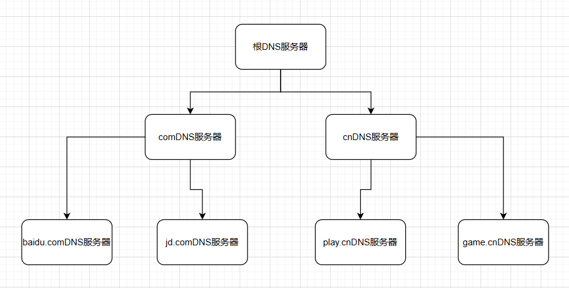
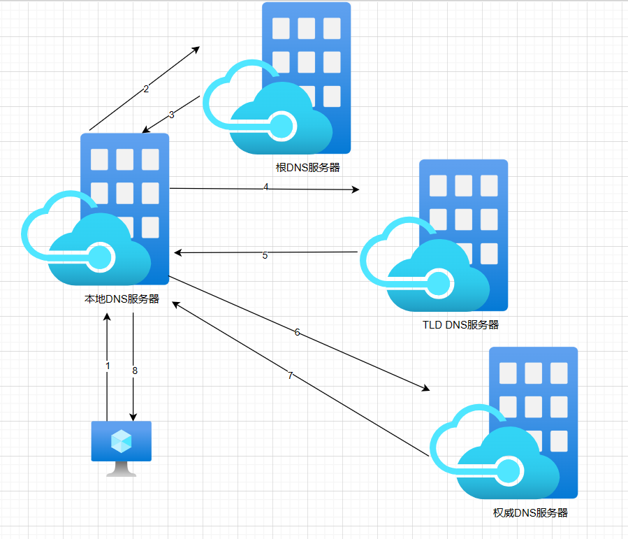

#  1.DNS与CDN

DNS是**域名系统**的缩写，它是一种将域名和IP地址相互映射的分布式数据库，能够使人更方便地访问互联网。

DNS的主要功能是将**域名解析为IP地址**。当你在浏览器中输入一个网址时，浏览器会向DNS服务器发送一个请求，以获取该网址对应的IP地址。如果DNS服务器有该网址对应的IP地址，则会返回该IP地址给浏览器，浏览器就可以向该IP地址对应的服务器发送请求了。

CDN是指**内容分发网络**，是一种通过互联网互联全球分布式服务器来提供高可用性、高性能内容分发服务的网络架构。CDN的基本思路是尽可能的将用户请求的内容分发到离用户最近的节点上，使用户可以就近取得所需内容，提高用户访问网站的响应速度和成功率。

DNS和CDN都是互联网中的重要技术，但是它们的作用不同。DNS（Domain Name System）是将域名转换为IP地址的系统，而CDN（Content Delivery Network）是一种分布式服务器系统，可以缓存和分发静态内容，以提高用户访问速度。CDN服务本身并不具备DNS解析功能，而是依托于DNS智能解析功能，由DNS根据用户所在地、所用线路进行智能分配最合适的CDN服务节点，然后把缓存在该服务节点的静态缓存内容返回给用户。


# 2.DNS

## 2.1.什么是DNS

DNS是指域名系统，它作为将域名和IP地址相互映射的一个分布式数据库，能够使人更方便地访问互联网。DNS使用TCP和UDP端口53。

> DNS是：
>
> 1. 一个由分层的DNS服务器实现的**分布式数据库**
> 2. 一个使得主机能够查询分布式数据库的**应用层协议**

DNS是一个应用层协议，主要功能是发送一个包含目标主机名的请求，返回目标主机名的IP地址：`FQDN-->IP`

FQDN 是 Fully Qualified Domain Name 的缩写，是指一个完整的域名，包括主机名和域名。

DNS是一个分布式数据库，DNS不是一台服务器负责全球域名映射，而是由全球各个区域多个服务器组合成的一个复杂的系统，每个服务器负责一部分映射

所有DNS的查询过程就是去向这些服务器查询目标主机的IP，直到返回目标主机IP为止

DNS的主要功能包括：

- 域名解析
- 负载均衡
- 防止DNS攻击

DNS的优点有：

- 方便用户记忆
- 降低网络管理成本
- 提高网络安全性

DNS的缺点有：

- DNS缓存污染
- DNS劫持
- DNS攻击

## 2.2.分层架构

就如上述所说的，DNS是由很多服务器组成的复杂系统，那么如果这些服务器没有层次的话，就不能很精准的查找目标

DNS服务器分为：根DNS服务器、顶级域DNS服务器和权威服务器，层次结构如下：



- 根DNS服务器

以一个常规域名举例`www.baidu.com`，有人可能认为`com`就是根域名，其实这是顶级域名，其实我们平时的域名写的是不完整的，完整域名其实是`www.baidu.com.`，最后这个`.`就是根域名

根域名服务器的作用就是管理所有的顶级域名服务器，记录着所有顶级域名的IP地址

- 顶级域名服务器

就像上面提到的`com`，顶级域名服务器，也就是TLD，作用就是管理下一级权威DNS服务器的IP地址

- 权威DNS服务器

权威DNS是经过上一级授权对域名进行解析的服务器，同时它可以把解析授权转授给其他人，如COM顶级服务器可以授权xxorg.com这个域名的的权威服务器为NS.ABC.COM，同时NS.ABC.COM还可以把授权转授给NS.DDD.COM，这样NS.DDD.COM就成了ABC.COM实际上的权威服务器了。

权威服务器一般就是我们查询IP地址的最后一站，能返回IP的最终映射


上述结构时单向的，也就是说只有上机服务器知道下级服务器的IP地址，下级服务器不知道上机服务器的地址。


## 2.3.本地DNS服务器

本地DNS服务器不属于DNS层次结构，更像是一个代理服务器，负责把本地的请求转发到DNS服务器层次结构中

每个ISP(Internet Service Provider的缩写，即互联网服务提供商)都有一台本地DNS服务器，比如一个居民区的 ISP、一个大学的 ISP、一个机构的 ISP，都有一台或多台本地 DNS 服务器。



1. 首先，主机 `m.n.com` 向它的本地 DNS 服务器发送一个 DNS 查询报文，其中包含期待被转换的主机名 `a.b.com`；

2. 本地 DNS 服务器将该报文转发到根 DNS 服务器；

3. 该根 DNS 服务器注意到 `com` 前缀，便向本地 DNS 服务器返回 `com` 对应的顶级域 DNS 服务器（TLD）的 IP 地址列表。

   意思就是，我不知道 `a.b.com` 的 IP，不过这些 TLD 服务器可能知道，你去问他们吧；

4. 本地 DNS 服务器则向其中一台 TLD 服务器发送查询报文；

5. 该 TLD 服务器注意到 `b.com` 前缀，便向本地 DNS 服务器返回权威 DNS 服务器的 IP 地址。

   意思就是，我不知道 `a.b.com` 的 IP，不过这些权威服务器可能知道，你去问他们吧；

6. 本地 DNS 服务器又向其中一台权威服务器发送查询报文；

7. 终于，该权威服务器返回了 `a.b.com` 的 IP 地址；一般来说，如果权威服务器查找不到IP地址，就说明该域名不存在

8. 本地 DNS 服务器将 `a.b.com` 跟 IP 地址的映射返回给主机 `m.n.com`，`m.n.com` 就可以用该 IP 向 `a.b.com` 发送请求啦。

> 一般来说，主机向本地域名服务器发出的请求是**递归查询**，只发出一次，本地域名服务器就返回了IP地址
>
> 本地域名服务器去查询目标主机IP就是**迭代查询**，一般发出多次请求
>
> 但是也可以所有请求都是递归，每个机器只发出一次请求，但是一般来说要减轻根服务器的压力，所有一般都是上述查询方式
>
> 从理论上讲，**任何 DNS 查询既可以是递归的，也可以是迭代的**。

有时 TLD 只是知道中间的某个 DNS 服务器，再由这个中间 DNS 服务器去找到权威 DNS 服务器。这种时候，整个查询过程就需要更多的 DNS 报文。

除此之外还有转发DNS，可以理解为本地DNS和用户之间的一个中转站，它不提供直接解析域名的服务，它将请求转发给本地DNS，然后将本地DNS的结果转发一下，也提供缓存作用。比如，日常家用的路由器，它的DNS服务器一般都是192.168.1.1，只是转发给本地DNS。

还有公共DNS是本地DNS的一种特例，它是一种全网开放的本地DNS服务，而传统的本地DNS信息一般由运营商分发给用户。比如：

| 运营商            | anycast             | 官网                                                         | DNS                               |
| ----------------- | ------------------- | ------------------------------------------------------------ | --------------------------------- |
| 南京信风公共DNS   | 南京、济南、芝加哥  | [www.114dns.com](https://link.juejin.cn?target=https%3A%2F%2Fwww.114dns.com) | 114.114.114..114  114.114.115.115 |
| 阿里云公共DNS     | 成都、深圳、杭州    | [http://w](https://link.juejin.cn?target=http%3A%2F%2Fwww.alidns.com)[ww.alidns.com](https://link.juejin.cn?target=http%3A%2F%2Fwww.alidns.com) | 233.5.5.5  233.6.6.6              |
| Google Public DNS | Google 36个数据中心 | [developers.google.com/speed/publi…](https://link.juejin.cn?target=https%3A%2F%2Fdevelopers.google.com%2Fspeed%2Fpublic-dns%2F) | 8.8.8.8  8.8.4.4                  |


## 2.4.DNS缓存

为了让我们更快的拿到想要的 IP，DNS 广泛使用了缓存技术。DNS 缓存的原理非常简单，在一个 DNS 查询的过程中，当某一台 DNS 服务器接收到一个 DNS 应答（例如，包含某主机名到 IP 地址的映射）时，它就能够将映射缓存到本地，下次查询就可以直接用缓存里的内容。当然，缓存并不是永久的，每一条映射记录都有一个对应的生存时间，一旦过了生存时间，这条记录就应该从缓存移出。

DNS的缓存过期时间由应答服务器设置

事实上，**有了缓存，大多数 DNS 查询都绕过了根 DNS 服务器**，需要向根 DNS 服务器发起查询的请求很少。

一般多台主机的集群会搭建自己的DNS缓存域名服务器，提高重复查询时的速度，方便管理所有的域名以及可以维护一个域名黑名单列表，控制上网行为


## 2.5.DNS解析类型

DNS正向解析记录类型：

- A记录：将域名解析为IPv4地址。

- AAAA记录：将域名解析为IPv6地址。

- CNAME记录：将一个域名解析为另一个域名。

DNS反向解析记录类型：

- PTR记录：将IP地址解析为域名。

反向解析记录主要用于邮件服务器，因为邮件服务器收到的邮件中包含的IP地址无法直接识别发件人，需要通过反向解析记录将其转化为域名，从而识别发件人。


常见的解析类型为：

1. A记录：将主机名解析为IPv4地址。
2. AAAA记录：将主机名解析为IPv6地址。
3. CNAME记录：将主机名解析为另一个主机名，通常用于将子域名指向父域名。
4. MX记录：指定邮件服务器的地址。
5. NS记录：指定域名服务器的地址。
6. PTR记录：反向解析，将IP地址解析为主机名。
7. SOA记录：指定域名的起始授权机构和其他元数据。
8. SRV记录：指定服务的位置，用于服务发现。
9. TXT记录：包含任意文本信息，常用于验证域名的所有权和SPF邮件验证。


## 2.6.配置DNS服务器

1. 安装bind包

   - BIND是一个广泛使用的DNS服务器软件，进程名为named，提供的协议为DNS
   - `/etc/named.conf`：主配置文件，它定义了 DNS 服务器的各种参数和选项。
   - `/var/named`：工作目录

   ```bash
   yum instal -y bind
   ```

2. 安装bind-chroot(可选)

   - 切根程序，用来切换默认目录到另外一个深层的安全的目录`/var/named/chroot`

   ```
   yum install-y bind-root
   ```

3. 写配置文件

   ```bash
   options {
        directory "/var/named"; # 配置工作目录
        statistics-file "/var/named/stat"; # 指定统计文件
        listen-on port 53 { 127.0.0.1； 172.16.199.1 }; # 注意空格
   };# 全局配置
   
   zone "." IN {
   #type：
   #    master指的是主dns解析
   #    slave指的是从dns解析
   #    hint指的是根域名解析（根提示域）
   #    forward指的是转发，转发不使用file
         type hint;
         file "named.ca";
   }; # 定义根区域
   
   zone "localhost" IN {
   	type master; # 定义类型
   	file "localhost.zone"; # 数据文件
   }; # 定义DNS服务器管理的区域
   
   # 反向解析命名规则为:反向网段.in-addr.arpa
   zone "0.0.127.in-addr.arpa" IN {
   	type master;
   	file "name.local"
   }; # 定义反向解析域
   
   # 也能直接在全局配置中定义forwarders
   # 会把除了zone定义的外全部转发
   # 转发类型分为first、only
   # first会首先转发到一台服务器，没有结果则转发到根服务器
   # only只转发到一台服务器
   zone "megedu.com" IN {
   	type forward;
   	forwarders { 172.168.19.1; }; 
   	forward only;
   }
   ```

   

4. 写区域配置文件

   ```bash
   # 配置根域的地址
   $ named.ca
   dig -t NS . > named.ca
   
   # 配置本地解析
   # 只能包含宏定义和资源记录
   # 资源记录：name [TTL] IN RECORD_TYPE VALUE
   $ localhost.zone
   ; 宏定义，必大写
   $TTL 600
   
   ;# 第一条记录必是SOA
   ;# @代表当前区域的名称
   ;# ns.magedu.com.为主要名称服务器
   ;# admin.localhost.为负责人邮箱地址
   @ IN SOA ns.magedu.com. admin.magedu.com (
   				0    ; 序列号 
   				1H   ; 刷新时间
   				10M  ; 重试时间
   				1W   ; 过期时间
   				1D   ; 否定时间
   )	
   
   ; #一般SOA记录后接NS记录
   ; #如果name跟上一条记录一样，可以省略
   ; #写域名必要带上根域
        IN  NS ns
     
     # 设置一个优先级为10的邮箱服务器
     # 一般只出现在正向解析中
        IN MX 10 mail
   
   ;   #NS记录后必跟A记录
       #可以只写子域名，如果写全记得带上根域
   ns IN A 192.168.19.136
   mail IN A 192.168.19.0
   www IN A 192.168.19.20
   www IN A 192.168.19.21 # 有A记录的域名不能再使用CNAME，但可以使用多个A记录
   
   $ named.local
   $TTL 1D
   @	IN SOA	localhost. admin.localhost (
   					0	; serial
   					1D	; refresh
   					1H	; retry
   					1W	; expire
   					3H )	; minimum
       NS	localhost.
   	
   # 反向解析可以只写主机地址
   1	PTR	localhost.
   
   
   # 配置成功后，可以使用命令检查语法错误
   named-checkconf 配置文件路径
   named-checkzone 检查的区域名称(example.com) 检查的文件路径
   named-checkconf -z # 以上两种命令的集合 
   
   # 启动服务后，需要往/etc/resolv.conf文件添加域名服务器地址
   # /etc/resolv.conf 是 DNS 客户机配置文件，用于设置 DNS 服务器的 IP 地址及 DNS 域名，还包含了主机的域名搜索顺序。
   # 最多写三条
   echo localhost > /etc/resolv.conf
   
   # 就可以进行解析
   # nslookup是一种网络工具，用于查询DNS域名解析的信息。它可以用于查找IP地址、域名、MX记录等信息。
   nslookup www.magedu.com
   Server:		192.168.19.136
   Address:	192.168.19.136#53
   
   Name:	www.magedu.com
   Address: 192.168.19.20
   
   ```
   
   

## 2.7.主从架构实战

> DNS解析顺序

本地缓存----->本地hosts文件---->DNS server(/etc/resolv.conf)

- DNS Server：
  - 如果查询请求是本机所负责区域中的数据的话，要通过查询区域数据文件返回结果
  - 如果查询请求不是本机所负责区域中的数据的话，就查询缓存
  - 如果缓存中没有答案，则向根发起查询请求


> DNS服务器类型

- 主：在区域内，主要负责区域解析的服务器
- 辅助：复制主服务器数据
- 缓存：缓存不负责解析任何区域(除了localhost)
  - 装bind包和caching-nameserver包就直接是个缓存服务器了
  - 或者配置有根域、本机域和本机反向域的也是缓存服务器
  
- 转发器： 不解析任何请求，只转发请求

> notify(通知机制)：在主服务器数据更新后，通知辅助服务器同步信息
>
> 同步信息的过程称为区域传送(zone transfer)
>
> 完全：axfr 使用dig -t axfr magedu.com @域名 可以查看DNS服务区域的完全数据
>
> 增量：ixfr  


> 实例

```bash
$ 172.16.100.1主
# 要设置一台服务器为主DNS服务器
zone "DNS.com" IN {
    type master;
    file "DNS.com.zone";
    notify yes; # 启用通知功能，以便在区域文件发生更改时通知其他服务器。
    allow-transfer { 172.16.100.2 }; # 指定允许传输区域文件的服务器的IP地址。可以指定在options中
};

$ 172.16.100.2从
# 要设置为从服务器
zone "DNS.com" IN {
    type slave;
    file "slaves/DNS.com.zone"; # 指定区域文件的名称和路径。
    masters { 172.16.100.1; }; # 指定主服务器的IP地址。
};

# 可以定义acl列表控制访问权限
# 定义一个叫MYSLAVES的控制列表
# 定义在文件的最上方，只允许本机访问
acl MYSLAVES {
	127.0.0.1；
	172.168.0.0/16；
}；
options {
	allow-recursion { MYSLAVES; } # 只允许本机和172.168网段的客户端递归
};
```


### 2.7.1.Rndc

提供的一种控制域名服务运行的工具，它可以运行在其他计算机上，通过网络与 DNS服务器 进行连接，然后根据管理员的指令对named进程进行远程控制，此时，管理员不需要DNS服务器的根用户权限。

使用rndc可以在不停止DNS服务器工作的情况进行数据的更新，使修改后的配置文件生效

- 生成一个rndc配置文件

  - rndc-confgen > /etc/rndc.conf
  - 生成之后把指定部分复制到/etc/named.conf下重启服务就能使用了

- rndc

  - reload：重新载入配置文件和区域文件

  - reload zone：重新载入区域文件
  - reconfig：重新载入修改过的配置文件和区域文件
  - retransfer zone：重新传区域文件
  - freeze zone：将某个区域冻结起来
  - stats：将统计数据写入统计文件
    - statistics-file：options参数，指定统计文件，需要自己创建，注意属主和属组
  - stop：停止服务
  - flush：清空缓存
  - status：查看服务器状态


## 2.8.子域

DNS子域是指主域下的一个 子域名，当一个子域的流量过大时，主域的DNS服务器可以把一个子域的查询授权给一台专门的子域服务器，称为子域授权或子域委派

而子域授权非常简单，只需要：

```bash
tedu IN NS ns.tedu
ms.tedu IN A 172.168.1.100
# 如果有主从结构，则两台机器都需要写
# 再在两台机器上做跟父域类似的配置即可
```


> 压力测试

bind包自带一个压力测试工具：queryperf，但是rpm包中没有，所以需要去源码包中自己编译

```bash
# 指定测试文件和DNS服务器
queryperf -d /tmp/querytest -s 172.16.100.1

# querytest文件格式
www.magedu.com A 
```


> DNS监控

dnstop是一个DNS流量监控工具，它可以实时监控DNS服务器的流量，以及DNS服务器的响应时间、查询类型、查询结果等信息。它可以帮助管理员快速发现DNS服务器的问题，提高DNS服务器的可用性

```bash
# 安装
yum install -y dnstop

# 使用格式
dnstop [options] [device]
dnstop -4 -R -Q ens33
```


> DLZ

DLZ是DNS Lookaside Zone的缩写，是BIND DNS服务器的一个功能。DLZ允许BIND使用外部数据库来存储DNS数据，而不是使用BIND自己的文件格式。DLZ可以使用MySQL、PostgreSQL、Oracle、LDAP等数据库来存储DNS数据。DLZ的使用可以使BIND更容易地与其他应用程序集成，例如Web服务器、邮件服务器等。DLZ还可以使BIND更容易地与其他DNS服务器集成，例如Microsoft Active Directory等。


## 2.9.视图

> DMZ

DMZ是英文“Demilitarized Zone”的缩写，中文名称为“隔离区”，也称“非军事化区”。 它是为了解决安装防火墙后外部网络不能访问内部网络服务器的问题，而设立的一个位于内部网络与外部网络之间的缓冲区，在这个网络区域内可以放置一些公开的服务器资源。 例如FTP服务器、E-Mail服务器及网站服务器等允许外部用户访问这些服务器，但不可能接触到存放在内网中的信息，就算黑客入侵DMZ 中服务器，也不会影响到公司内部网络安全，不允许任何外部网络的直接访问，实现内外网分离，在企业的信息安全防护加了一道屏障。 DMZ区域针对不同资源提供不同安全级别的保护，网络主要分为三个区域：安全级别最高的内网，安全级别中等的DMZ区域和安全级别最低的外网


> NAT

NAT是网络地址转换的缩写，它是一种将内部网络的私有IP地址映射到公共IP地址的服务，以便在将数据包发送到外部网络之前进行转换

NAT是一种网络功能，可以通过隐藏内部网络来减少组织安全风险。默认情况下，如果没有预先存在的NAT转换，则外部公共IP无法与内部私有IP主机通信。因此，NAT分离了公共和私有网络。


> 视图

DNS视图是指DNS服务器根据不同的客户来源（指的是IP），使用不同的数据文件来完成解析过程。DNS视图可以对同一个资源记录根据的DNS请求来源IP地址不同，分配到解析器的解析结果也不同，也就是说它可以提供这样的功能

```bash
options {
      directory "/var/named";
      statistics-file "/var/named/stat";
      listen-on port 53 { 127.0.0.1; };
      allow-transfer { 192.168.19.137; };
};

view "NSD" {
      match-clients { 192.168.0.0/16; }; # 指定内网网段
      recursion yes; # 允许递归
zone "magedu.com" IN {
      type master;
      file "magedu.com.zone";
};
zone "qq.com" IN {
      type master;
      file "qq.com.zone";
      allow-update { none; }; # 一般禁止DNS动态更新
};
};

view "other" {
 match-clients { any; }; # 指定允许进行此视图的用户
 recursion no; 
 zone "magedu.com" IN {
        type master;
        file "magedu.com.other";  # 不同的文件区分不同访问
};
zone "qq.com" IN {
        type master;
        file "qq.com.other";
};
zone "." IN {
        type hint;
        file "named.ca";
};
};
```

**一旦使用view，每一个zone都要在view中。且按照顺序访问**


## 2.10.手工定制DNS启动脚本

> 编译安装bind

1. 下载bind包
2. 手动编译
   - --prefix=PREFIX：指定安装路径
   - --sysconfdir=DIR：指定配置文件路径
   - --localstatedir=DIR：指定进程pid文件路径
   - --with-dlz-mysql=PATH：构建过程中使用MySQL库的路径
   - --enable-threads=boolean：是否开启线程功能
   - --disable-openssl-version-check：禁用版本检测

```bash
./configure --sysconfdir=/etc --disable-ipv6 --enable-largefile --enable-threads=no --prefix=/usr/local/named --disable-openssl-version-check --localstatedir=/var

make && make install
```


## 2.11.智能DNS

> 部署准备

1. 安装mysql

> MySQL二进制安装需要用到二进制包，二进制包其实就是编译好的源码包，这样我们就省去了编译的步骤了。
>
> 1.卸载MariaDB
> yum -y remove mariadb-libs.x86_64
>
> 2.创建用户
> useradd -M -s /sbin/nologin -r mysql
>
> 3.安装依赖包：
> yum install -y ncurses-devel libaio-devel gcc gcc-c++ glibc cmake autoconf
>
> 4.下载MySQL二进制包
> wget https://dev.mysql.com/get/Downloads/MySQL-5.7/mysql-5.7.35-linux-glibc2.12-x86_64.tar.gz
>
> 5.解压二进制包并做好软链接
> tar -xf mysql-5.7.35-linux-glibc2.12-x86_64.tar.gz 
> mv mysql-5.7.35-linux-glibc2.12-x86_64 /usr/local/
> ln -s /usr/local/mysql-5.7.35-linux-glibc2.12-x86_64/ /usr/local/mysql
>
> 6.配置MySQL数据存放目录并授权
> chown -R mysql.mysql /usr/local/mysql-5.7.35-linux-glibc2.12-x86_64
> mkdir /mysql_data
> chown -R mysql.mysql /mysql_data/
>
> 7.初始化MySQL服务
> # 在这里我们了解一下MySQL5.6与MySQL5.7在安装时的一些区别
> 	1）首先是需要安装boost_1_59_0，这里推荐二进制安装MySQL5.7，因为已经过了cmake阶段，已经安装好了
> 	2）初始化命令有所不同：
> 	# 5.6初始化命令
> 	/service/mysql/scripts/mysql_install_db --user=mysql --basedir= --datadir=
> 	# 5.7初始化命令
> 	/usr/local/mysql/bin/mysqld --initialize --user=mysql --basedir= --datadir=
> 	# 这里的--initialize会生成一个临时的随机密码，通常密码的路径会告诉我们，我们需要使用这个密码登录数据库，并且修改密码也需要一定的强度，不然会提示你密码不安全，一般包含大小写字母，数字以及特殊符号
> 	# 如果不想生成这个密码的话，还可以使用这个参数 --initialize-insecure
> bin/mysqld --initialize --user=mysql --basedir=/usr/local/mysql --datadir=/mysql_data
> 参数解释：
> --initialize	： 指定初始化（生成一个临时密码）
> --user			： 指定用户（一般为mysql用户）
> --basedir		： mysql安装目录
> --datadir		： 数据保存的目录
>
> 8.编写配置文件并启动
> # 编写配置文件
> 注：MySQL的配置文件默认是/etc/my.cnf
> cat /etc/my.cnf
>
> [mysqld]
>
> basedir=/usr/local/mysql
>
> datadir=/mysql_data
>
> port=3306
>
> socket=/usr/local/mysql/mysql.sock
>
> character-set-server=utf8mb4
>
> log-error=/var/log/mysqld.log
>
> pid-file=/tmp/mysqld.pid
>
> skip-grant-tables # 设置免密。设置密码后删除			
>
> [mysql]
>
> socket=/usr/local/mysql/mysql.sock
>
> [client]
> socket=/usr/local/mysql/mysql.sock
>
> # 启动MySQL服务
> 将目录中的MySQL启动脚本拷贝到/etc/init.d/mysqld,并添加一些内容
> cp support-files/mysql.server /etc/init.d/mysqld
> vim /etc/init.d/mysqld
> basedir=/usr/local/mysql
> datadir=/mysql_data
> chmod +x /etc/init.d/mysqld
> /etc/init.d/mysqld start 
>
> 9.配置环境变量
> vim /etc/profile.d/mysql.sh
> export PATH=/usr/local/mysql/bin:$PATH
> source /etc/profile
>
> 10.配置system管理
> vim /usr/lib/systemd/system/mysqld.service
>
> [Unit]
> Description=MySQL Server
> Documentation=man:mysqld(8)
> Documentation=https://dev.mysql.com/doc/refman/en/using-systemd.html
> After=network.target
> After=syslog.target
> [Install]
> WantedBy=multi-user.target
> [Service]
> User=mysql
> Group=mysql
> ExecStart=/usr/local/mysql/bin/mysqld --defaults-file=/etc/my.cnf
> LimitNOFILE = 5000
>
> systemctl daemon-reload
> systemctl start mysqld
>
> 11.修改登录密码
> 在我们知道一开始生成的密码的情况下，我们登入MySQL
> mysql -uroot -p"xxxxx"
> 在MySQL命令行中执行
> update mysql.user set authentication_string=password('root') where user='root';	# 密码强度要符合要求
> FLUSH PRIVILEGES;

2. 安装bind

> 1. 官网下载Bind包
> 2. 编译安装
>
> tar xzf bind-9.9.1-P2.tar.gz
> cd bind-9.9.1-P2
> ./configure --prefix=/usr/local/bind/ --disable-openssl-version-check --with-dlz-mysql=/usr/local/mysql
> make
> make install

3. 配置bind

> 1. 配置rndc
>
> cd /usr/local/bind/etc
> ../sbin/rndc-confgen -r /dev/urandom >rndc.conf
> tail -n10 rndc.conf | head -n9 | sed -e s/#\//g>named.conf
>
> 2. 配置named.conf
>
> 添加以下配置：
>
> include "/usr/local/bind/etc/CHINANET.acl"; //联通ACL
> include "/usr/local/bind/etc/CNC.acl"; //电信ACL
> include "/usr/local/bind/etc/view.conf"; //DLZ相关的配置

4. 配置view.conf

```bash
view "CHINANET_view" {
  match-clients  { CHINANET; };
  allow-query-cache { none; };
  allow-recursion { none; };
  allow-transfer { none; };
  recursion no;
 
    dlz "Mysql zone" { # 标记一个DLZ区域
    database "mysql     # 使用数据库存储
    {host=127.0.0.1 dbname=dns_data ssl=false port=3306 user=root pass=root}  # 链接数据库
    {select zone from dns_records where zone = '$zone$' and  view = 'any' limit 1}
    {select ttl,type,mx_priority,case when lower(type)='txt' then concat('\"',data,'\"') when lower(type)    =  'soa'  then   concat_ws(' ',  data,  resp_person,  serial,  refresh,  retry,  expire,  minimum)   else   data   end   as   mydata   from   dns_records where zone = '$zone$'   and host = '$record$' and view=(select view from dns_records where zone = '$zone$' and host = '$record$' and (view='CHINANET' or view='any') order by priority asc limit 1)}"; # 查询信息
};
};
view "CNC_view" {
  match-clients  { CNC; };
  allow-query-cache { none; };
  allow-recursion { none; };
  allow-transfer { none; };
  recursion no;
 
    dlz "Mysql zone" {
    database "mysql
    {host=127.0.0.1 dbname=dns_data ssl=false port=3306 user=root pass=root}
    {select zone from dns_records where zone = '$zone$' and  view = 'any' limit 1}
    {select ttl,type,mx_priority,case when lower(type)='txt' then concat('\"',data,'\"') when lower(type)    =  'soa'  then   concat_ws(' ',  data,  resp_person,  serial,  refresh,  retry,  expire,  minimum)   else   data   end   as   mydata   from   dns_records where zone = '$zone$'   and host = '$record$' and view=(select view from dns_records where zone = '$zone$' and host = '$record$' and (view='CNC' or view='any') order by priority asc limit 1)}";
};
};
view "any_view" {
  match-clients  { any; };
  allow-query-cache { none; };
  allow-recursion { none; };
  allow-transfer { none; };
  recursion no;
 
    dlz "Mysql zone" {
    database "mysql
    {host=127.0.0.1 dbname=dns_data ssl=false port=3306 user=root pass=root}
    {select zone from dns_records where zone = '$zone$' and view = 'any' limit 1}
    {select ttl,type,mx_priority,case when lower(type)='txt' then concat('\"',data,'\"') when lower(type) = 'soa' then concat_ws(' ',data,resp_person,serial,refresh,retry,expire,minimum) else  data end as mydata from dns_records where zone = '$zone$' and host ='$record$' and view = 'any'}";
};
};
```

5. 数据库配置

```bash
mysql>create database dns_data;        //创建数据库名为 dns_data
   mysql>use dns_data;
   DROP TABLE IF EXISTS `dns_records`;
   CREATE TABLE `dns_records` (
   `id` int(10) unsigned NOT NULL auto_increment,
   `zone` varchar(255) NOT NULL,
   `host` varchar(255) NOT NULL default '@',
   `type` enum('MX','CNAME','NS','SOA','A','PTR') NOT NULL,
   `data` varchar(255) default NULL,
   `ttl` int(11) NOT NULL default '800',
   `view` char(20) default 'any',     //any 代表默认，SOA 查询需，其它可以分，CNC……
   `mx_priority` int(11) default NULL,
   `priority` int(3) default 255,  //any为255，其它如CNC,CHINANET等线路为200
   `refresh` int(11) NOT NULL default '3600',
   `retry` int(11) NOT NULL default '3600',
   `expire` int(11) NOT NULL default '86400',
   `minimum` int(11) NOT NULL default '3600',
   `serial` bigint(20) NOT NULL default '2008082700',
   `resp_person` varchar(64) NOT NULL default 'root.domain.com.',
   `primary_ns` varchar(64) NOT NULL default 'ns1.domain.com.',
   `data_count` int(11) NOT NULL default '0',
   PRIMARY KEY          (`id`),
   KEY `type` (`type`),
   KEY `host` (`host`),
   KEY `zone` (`zone`)
   ) ENGINE=MyISAM AUTO_INCREMENT=1 DEFAULT CHARSET=gbk;
   
   
   mysql> describe dns_records;
+-------------+------------+------+-----+---------+-------+
| Field       | Type       | Null | Key | Default | Extra |
+-------------+------------+------+-----+---------+-------+
| zone        | text       | YES  |     | NULL    |       |
| host        | text       | YES  |     | NULL    |       |
| type        | text       | YES  |     | NULL    |       |
| data        | text       |      |     |         |       |
| ttl         | int(11)    | YES  |     | NULL    |       |
| mx_priority | text       | YES  |     | NULL    |       |
| refresh     | int(11)    | YES  |     | NULL    |       |
| retry       | int(11)    | YES  |     | NULL    |       |
| expire      | int(11)    | YES  |     | NULL    |       |
| minimum     | int(11)    | YES  |     | NULL    |       |
| serial      | bigint(20) | YES  |     | NULL    |       |
| resp_person | text       | YES  |     | NULL    |       |
| primary_ns  | text       | YES  |     | NULL    |       |
+-------------+------------+------+-----+---------+-------+
13 rows in set (0.00 sec)
```


# 3.CDN

CDN是指**内容分发网络**，是一种通过互联网互联全球分布式服务器来提供高可用性、高性能内容分发服务的网络架构。CDN的基本思路是尽可能的将用户请求的内容分发到离用户最近的节点上，使用户可以就近取得所需内容，提高用户访问网站的响应速度和成功率。

CDN的主要功能包括：

- 静态内容加速
- 动态内容加速
- 安全防护
- 视频点播加速
- 直播加速

CDN的优点有：

- 加速网站访问速度
- 降低源站压力
- 提高网站可用性和稳定性
- 提高用户体验

CDN的缺点有：

- 成本较高
- 需要专业技术支持
- 无法缓存动态内容

**CND功能可依靠DNS视图功能完成**