# ELK日志平台

## 1.ELK架构介绍

ELK是一个应用套件，ELK 是 Elasticsearch、Logstash 和 Kibana 的缩写，是一种流行的开源日志管理解决方案。Elasticsearch 是一个分布式搜索和分析引擎，Logstash 是一个用于收集、处理和转发日志的工具，Kibana 是一个用于可视化 Elasticsearch 数据的工具。

是一套开源免费、功能强大的日志分析管理系统。ELK可以将系统日志、网站日志、应用系统日志等各种日志进行收集、过滤、清洗、如何进行集中存放并可用于实时检索、分析


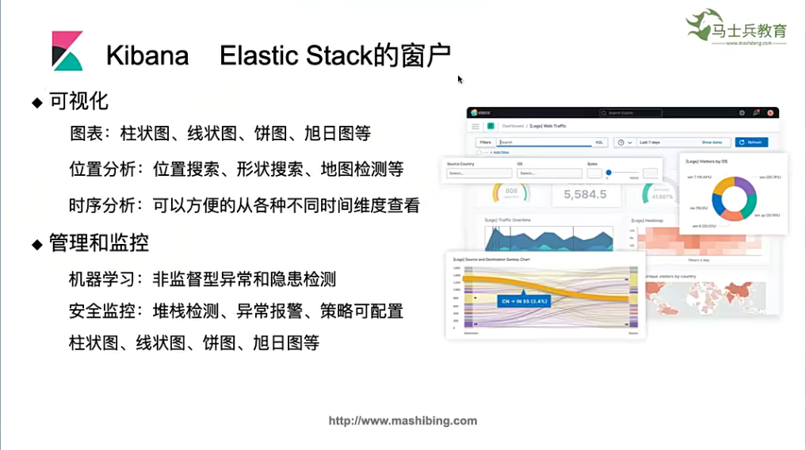


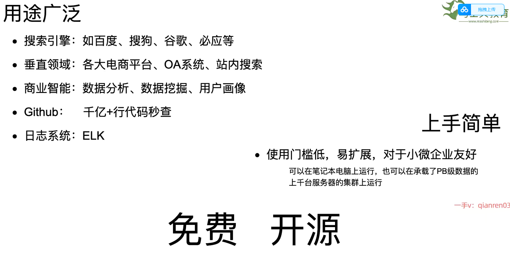

* Elasticsearch
  * 是一个实时的分布式搜索和分析引擎，它可以用于全文搜索，结构化搜索以及分析，采用java语言编写。是一个搜索引擎类的数据库
  * 实时搜索，实时分析
  * 分布式架构、实时文件存储，并将每一个字段都编入索引
  * 文档导向，所有的对象都是文档
  * 高可用性、易拓展、支持集群、分片和复制
  * 接口友好，支持JSON
*   Logstash

    * 是一款轻量级的、开源的日志收集处理框架，它可以方便的把分散的、多样化的日志搜集起来，并进行自定义过滤分析处理，然后传输到指定的位置，比如某个服务器或者文件。Logstash采用JRuby语言编写
    * input：数据收集
    * filter：数据加工，如过滤，改写等
    * output：数据输出

    

    
* Kibana
  * 是一个开源的数据分析可视化平台。使用Kibana可以为Logstash和Elasticsearch提供的日志数据进行高效的搜索、可视化汇总和多维度分析，还可以与Elasticsearch搜索引擎中的数据进行交互。它基于浏览器的界面操作可以快速创建动态仪表板，实时监控Elasticsearch的数据状态与更改


## 2.环境安装


### 1.安装JDK


### 2.安装Elasticsearch

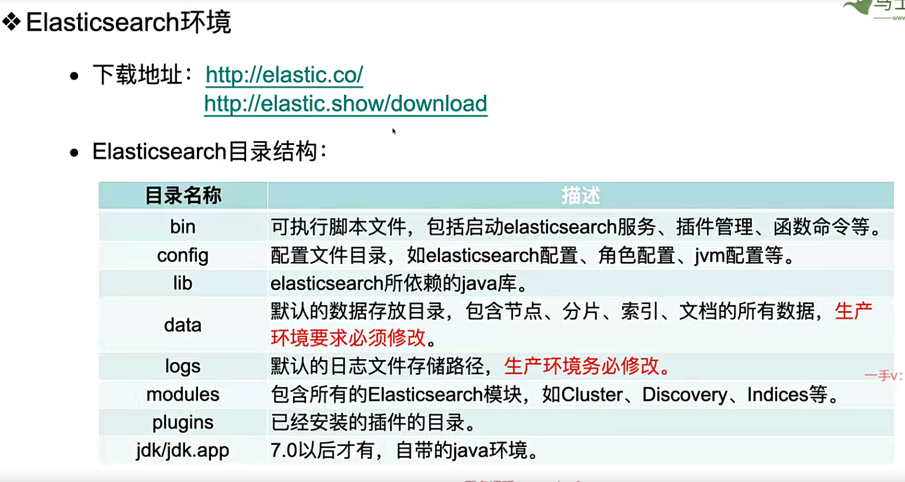

```bash
curl -L -O https://artifacts.elastic.co/downloads/elasticsearch/elasticsearch-7.3.2-darwin-x86_64.tar.gz
tar -xvf elasticsearch-7.3.2-linux-x86_64.tar.gz
```


```bash
./elasticsearch

# 可以使用root运行
bin/elasticsearch -Des.insecure.allow.root=true
```

```bash
修改文件/etc/security/limits.conf，添加如下内容：
* soft nofile 65535
* hard nofile 65535

修改文件/etc/sysctl.conf，添加如下内容：
vm.max_map_count=262144

修改文件/etc/security/limits.d/20-nproc.conf，将如下内容：
* soft nproc 1024

修改为：
* soft nproc 4096

修改elasticsearch.yml文件，添加如下内容：

cluster.name: elkcluster #集群名称
node.name: elk    	  #节点名称
cluster.initial_master_nodes: ["elk"] #主节点信息
path.data: /data/es/data       #数据存放路径
path.logs: /data/es/logs       #日志存放路径，这两个最好设置在Elasticsearch的安装目录之外，避免更新覆盖数据
bootstrap.memory_lock: false   
bootstrap.system_call_filter: false
network.host: 0.0.0.0				#所有ip可以访问，
discovery.seed_hosts: ["elk"] #输出至elasticsearch服务器
discovery.zen.minimum_master_nodes: 2 	#最多有几个可参与主节点选举
http.cors.enabled: true
http.max_initial_line_length: "1024k"
http.max_header_size: "1024k"
```

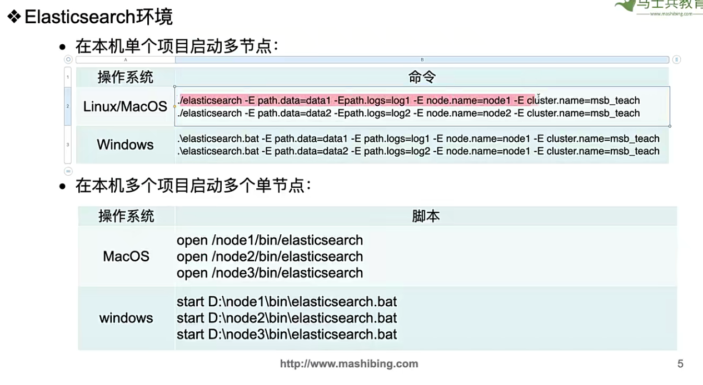

### 3.安装Kibana

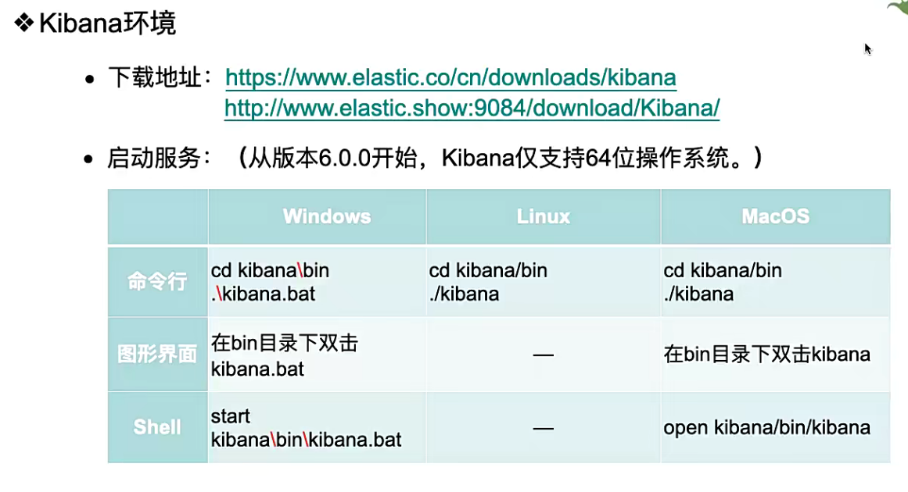

```bash
# 注意版本需求，需要跟Elasticsearch配合
curl -O https://artifacts.elastic.co/downloads/kibana/kibana-7.10.2-linux-x86_64.tar.gz
tar xvf kibana-7.10.2-linux-x86_64.tar.gz
```

```bash
# 修改config/kibana.yml
server.port: 5601 # 指定端口
server.host: "0.0.0.0"  # 修改服务地址
elasticsearch.hosts: ["http://localhost:9200"] # 指定Elasticsearch地址
kibana.index: ".kibana" # 指定索引
i18n.locale: "zh-CN"  # 修改为中文

# 配置秘钥
xpack.reporting.encryptionKey: "chenqionghe"
xpack.security.encryptionKey: "122333444455555666666777777788888888"
xpack.encryptedSavedObjects.encryptionKey: "122333444455555666666777777788888888"

# 启动，启动之前必须启动Elasticsearch
[root@localhost kibana-7.10.2-linux-x86_64]# bin/kibana --allow-root # 可以使用root启动
```

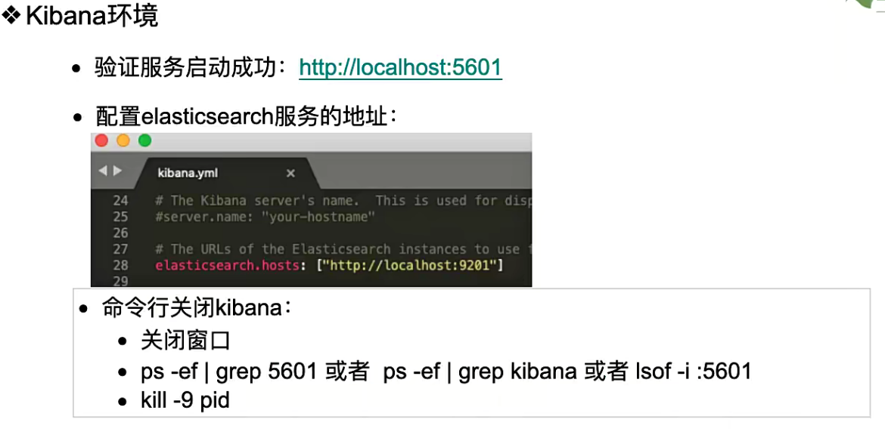

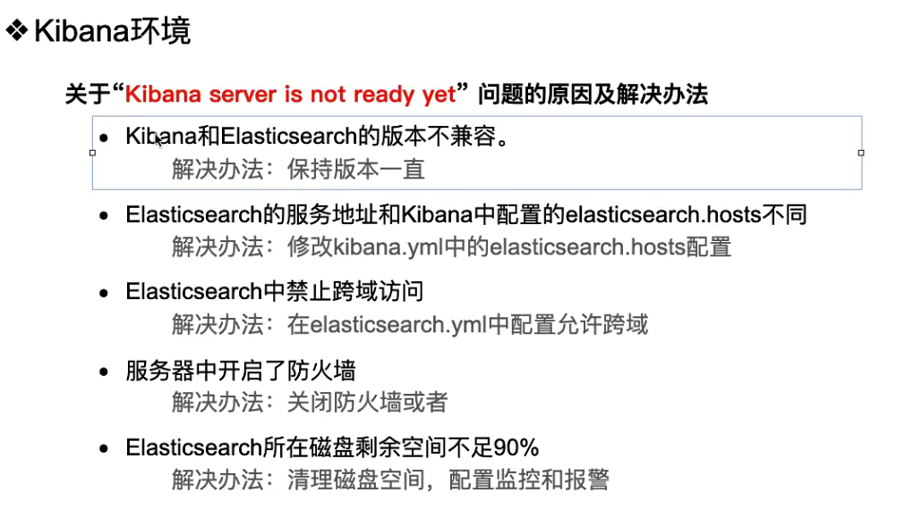

### 4.安装Head插件


```bash
# 添加环境变量
echo "export PATH=$PATH:/usr/local/node/bin" > /etc/profile.d/node.sh

# 安装依赖库
sudo yum install glibc glibc-devel libstdc++ libstdc++-devel

# 直接安装也行
yum install -y nodejs
npm install -g grunt-cli
npm install grunt --save-dev


git clone git://github.com/mobz/elasticsearch-head.git
cd elasticsearch-head
npm install
npm run start
open http://localhost:9100/
```


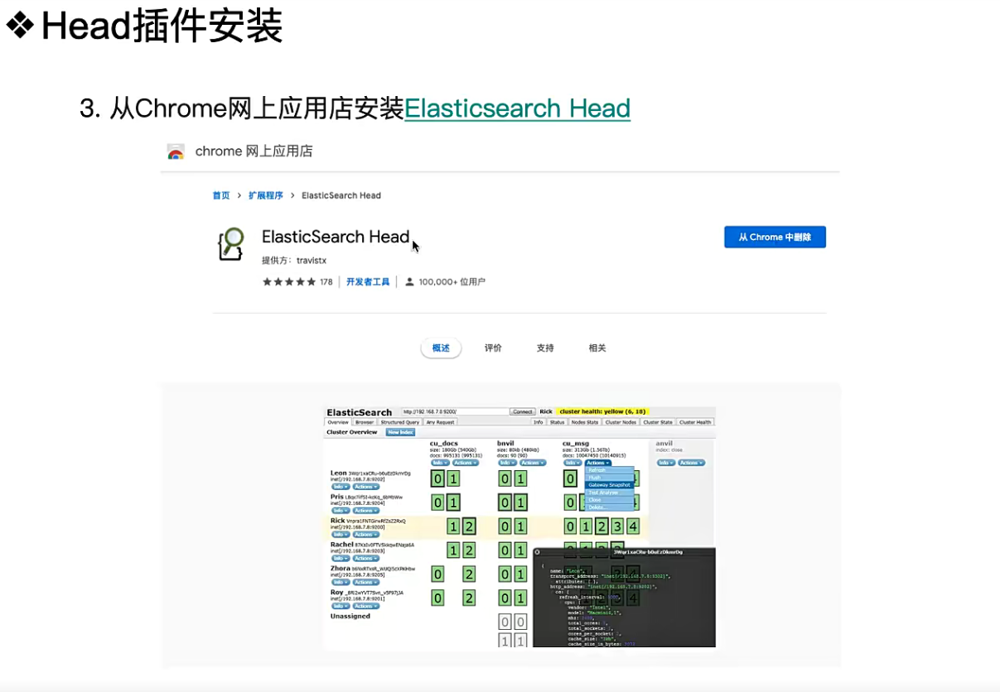

### 5.YUM安装

```bash
sudo rpm --import https://artifacts.elastic.co/GPG-KEY-elasticsearch
sudo vi /etc/yum.repos.d/elasticsearch.repo

在编辑器中添加以下内容：
[elasticsearch-7.x]
name=Elasticsearch repository for 7.x packages
baseurl=https://artifacts.elastic.co/packages/7.x/yum  # https://mirrors.aliyun.com/elasticstack/7.x/yum
gpgcheck=1
gpgkey=https://artifacts.elastic.co/GPG-KEY-elasticsearch
enabled=1
autorefresh=1
type=rpm-md

保存并退出编辑器。然后运行以下命令：
sudo yum install elasticsearch kibana -y
```

#### 1.集群的健康值检查


```bash
{
  "cluster_name" : "elkcluster",  # 集群名称
  "status" : "green",  # 集群健康状态
  "timed_out" : false,  # 指示集群是否有操作超时
  "number_of_nodes" : 1, # 集群中的节点数量
  "number_of_data_nodes" : 1,  # 集群中的数据节点数量
  "active_primary_shards" : 10,  # 当前活跃的主分片数量
  "active_shards" : 10,         # 当前活跃的分片数量
  "relocating_shards" : 0,      # 迁移分片
  "initializing_shards" : 0,     # 初始化分片
  "unassigned_shards" : 0,       # 未分配分片
  "delayed_unassigned_shards" : 0, # 延迟未分配的分片数量
  "number_of_pending_tasks" : 0,  # 在等待中的任务数量
  "number_of_in_flight_fetch" : 0,  # 正在进行中的获取任务数量
  "task_max_waiting_in_queue_millis" : 0,  # 任务等待队列的最大等待时间
  "active_shards_percent_as_number" : 100.0 # 活跃分片的百分比
}
```

## 3.核心概念

> 什么是搜索引擎

1. 全文搜索引擎
   * 自然语言处理(NLP)、爬虫、网页处理、大数据处理。
   * 如谷歌、百度等等
2. 垂直搜索引擎
   * 有明确搜索目的的搜索行为
   * 如各大电商网站、OA、站内搜索、视频网站等

> 搜索引擎应该具备那些要求？

* 查询速度快
  * 高效的压缩算法
  * 快速的编码和解码速度
* 结果准确
  * BM25
  * TF-IDF
* 检索结果丰富
  * 召回率

> 索引

* 帮助快速检索
* 以数据结构为载体
* 以文件的形式落地

> Lucene

* Lucene是一个成熟的全文检索库，由Java语言编写，具有高性能、可伸缩的特点，并且开源、免费

> 全文检索

* 索引系统通过扫描文章中的每一个词，对其创建索引，指明在文章中出现的次数和位置，当用户查询时，索引系统就会根据实现建立的索引进行查找，并将查找的结果反馈给用户的检索方式

### 1.倒排索引

倒排索引（Inverted Index）是一种数据库索引，用于存储从内容到文档的映射。使用倒排索引可以很好的支持全文搜索，被广泛应用于信息检索（搜索引擎、数据库）中。 倒排索引是实现“单词-文档矩阵”的一种具体存储形式，通过倒排索引，可以根据单词快速获取包含这个单词的文档列表。

倒排索引的原理是将文档中的每个单词映射到包含该单词的所有文档的列表中，然后用该列表替换单词。倒排索引在文本搜索和信息检索中广泛应用，如搜索引擎、网站搜索、文本分类等场景中。 具体来说，一个倒排索引包含一个词语词典和每个词语对应的倒排列表。2倒排列表中记录了包含该词语的所有文档的编号、词频等信息。2这让我们能够在O(1)的时间内判断某个文档是否包含某个词，而且还可以基于词频、相关度等统计信息进行搜索结果排序。

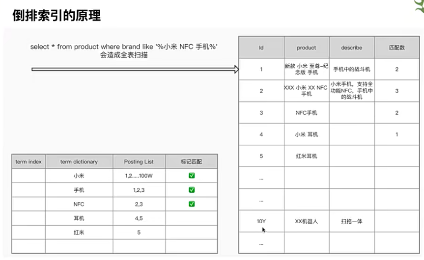


#### 1.FOR压缩算法

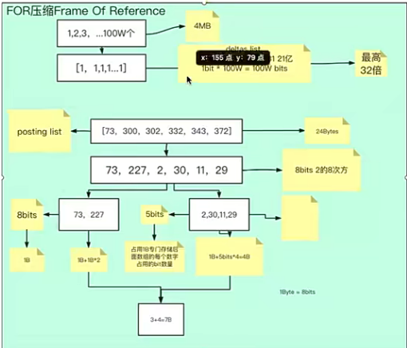

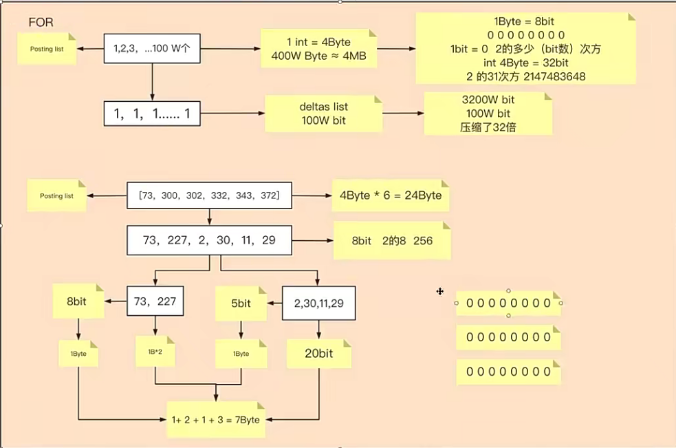

#### 2.RBM压缩算法

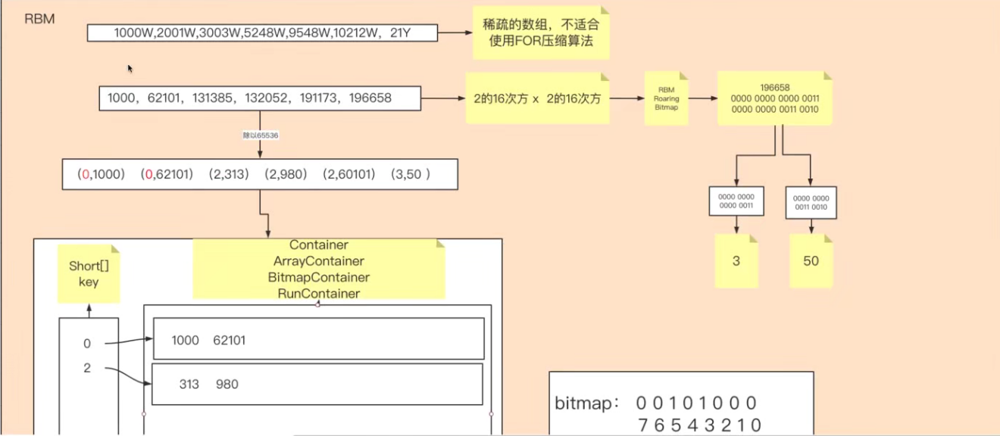

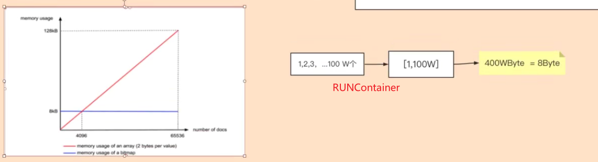

#### 3.FST压缩算法

> 为什么要安装term的字典序处理？

* 为了生成最小化的FST的数据结构

> Trie前缀树

前缀树（Prefix Tree），又称字典树（Trie Tree），是一种树形结构，是一种哈希树的变种。 它的典型应用是用于统计和排序大量的字符串（但不仅限于字符串），所以经常被搜索引擎系统用于文本词频统计。 前缀树的每一个节点代表一个字符串（前缀）。每一个节点会有多个子节点，通往不同子节点的路径上有着不同的字符。 子节点代表的字符串是由节点到根节点路径上所有字符连接起来的字符串。

前缀树的主要优点是可以最大限度地减少无谓的字符串比较，查询效率比哈希表高。前缀树常用于搜索提示、自动补全、拼写检查等场景中

> FST

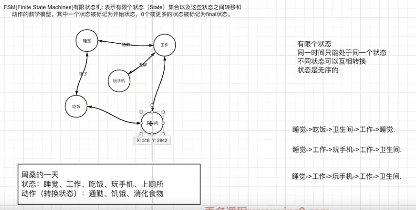


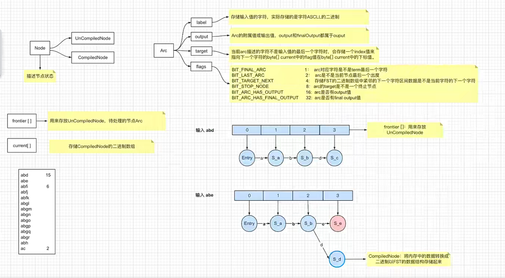

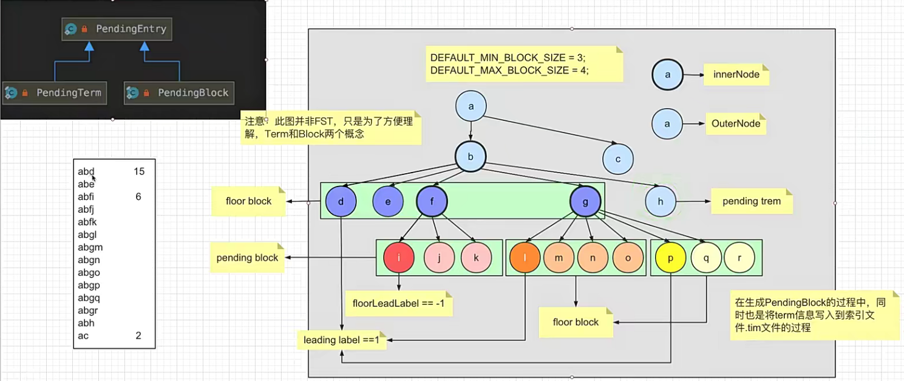


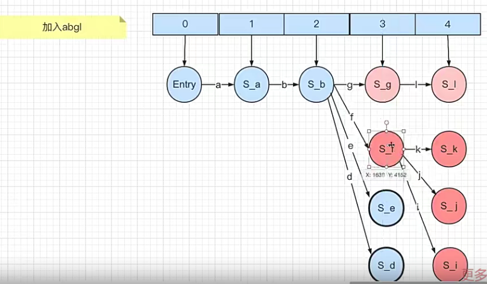


### 2.tip和tim文件内部结构


#### 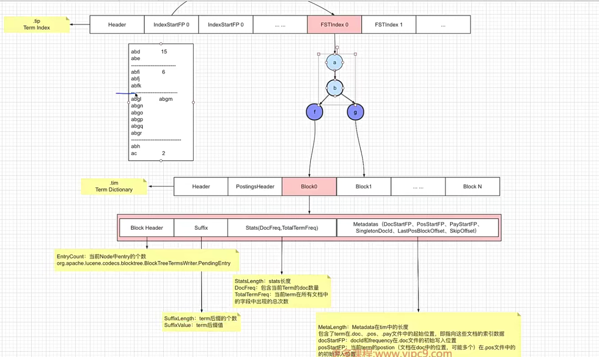

### 3.FSt在Lucene中的构建和读取过程


### 4.集群、节点和分片

> 节点

* 每个节点就是一个Elasticsearch实例
* 一个节点≠一台服务器


> 分片

* 一个索引包含一个或多个分片，在7.0之前默认五个主分片，每个主分片一个副本；在7.0之后默认一个主分片。副本可以在索引创建之后修改数量，但是主分片的数量一旦确认不可修改，只能创建索引
* 每个分片都是一个Lucene实例，有完整的创建索引和处理请求的能力
* ES会自动在nodes上做分片均衡
* 一个doc不可能同时存在于多个主分片中，但是当每个主分片的副本数量不为一时，可以同时存在与多个副本中
* 每个主分片和其副本分片不能同时存在与同一个节点上，所以最低的可用配置是两个节点互为主备

> 集群

* 原生分布式
* 一个节点≠一台服务器

## 4.索引的CRUD


```bash
# 查看一个索引的全部信息
GET /index/_search

# 查看索引的具体某条信息
GET /inde/_doc/2

# 修改具体索引中的值
POST /index/_update/1
{
  "doc":{
    "1":2
  }
}

# 删除具体索引中的值
DELETE /index/_doc/2
```

## 5.Mapping

### 1.概念

* 概念：映射是定义文档及其包含的字段的存储和索引方式的过程。优点类似于RDB中"表结构"的概念。在Mapping中包含一些属性，比如字段名称、类型、字段使用的分词器、是否评分、是否创建索引等属性。并且在ES中一个字段可以有对应类型
* 两种映射方式
  * dynamic mapping(动态映射或自动映射)
  * expllcit mapping(静态映射或手工映射或显示映射)

### 2.查看mapping

* GET /index/\_mapping

### 3.ES数据类型


### 4.两种映射类型

* **Dynamic field mapping**


```bash
   # 为text数据类型数据，自动创建一个fields类型，里面包含一个keyword，用于基准匹配，且默认长度为256
   "3" : {
          "type" : "text",
          "fields" : {
            "keyword" : {
              "type" : "keyword",
              "ignore_above" : 256
            }
          }
        },
```

* **Expllcit field mapping：手动映射**


```bash
# 手工创建mapping(fields的mapping只能创建，无法修改)
PUT /product
{
  "mappings":{
    "properties": {
      "data":{
        "type":"text"
      }
    }
  }
}
```

### 5.映射参数

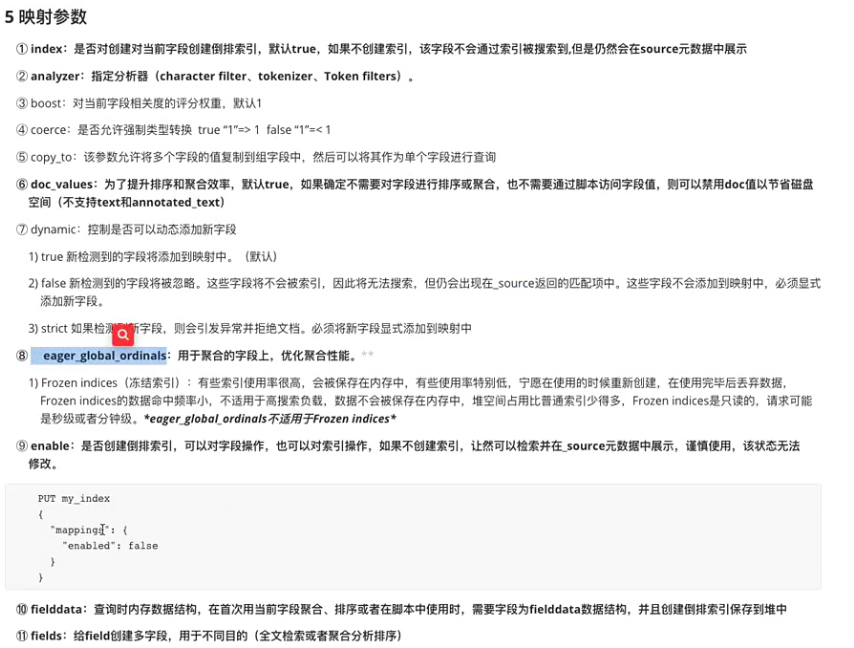


## 6.搜索和查询

### 1.相关度评分

**未指定排序字段时，会按照评分进行排序**

### 2.元数据\_source

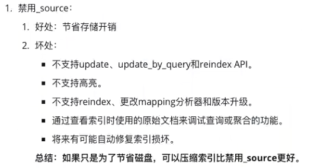

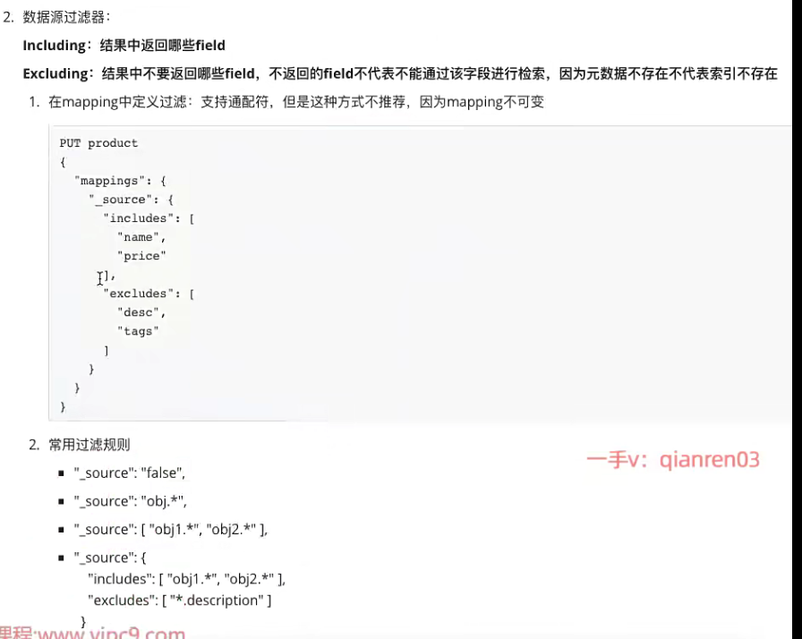

> 发生冲突时，以excludes为准

### 3.Query String

*   **查询所有：**

    GET /product/\_search
*   **带参数**

    GET /product/\_search?q=name:xiaomi
*   **分页**

    GET /product/\_search?from=0\&size=2$sort=price:asc
*   **精准匹配exact value**

    GET /product/\_search?q=name:xiaomi
*   **\_all搜索 相当于在所有有索引字段中检索**

    GET /product/\_search?q=xiaomi

    如果设置字段不设置索引，那么就不会搜索该字段

    

### 4.全文检索：match

> DSL(Domain Specific Language)

* Query string search
* 全文检索：fulltext search
* 过滤器：filter
* 精准匹配：exact match
* 组合查询：boo query

> 全文检索

全文搜索，也被称为全文检索、关键词搜索，是一种能对文档进行搜索的技术，它的主要特点是用户可以输入一个或多个关键词，搜索结果返回所有包含这些关键词的文档。


```bash
# match：匹配任意分词
GET product/_search
{
  "query": {
    "match": {
      "name": "xiaomi nfs phone"
    }
  }
}

# match_all
GET product/_search
{
  "query": {
    "match_all": {}
  }
}

# multi_match：在多个字段里搜索任一词项
GET product/_search
{
  "query": {
    "multi_match": {
      "query": "nfc 111",
      "fields": ["name","desc"]
    }
  }
}

# match_phrase：在字段里包含全部词项
GET product/_search
{
  "query": {
    "match_phrase": {
      "name": "xiaomi nfc"
    }
  }
}
```

### 5.精准匹配：exact match


```bash
# term
GET product/_search
{
  "query": {
    "term": {
      "name": "xiaomi nfs phone"
    }
  }
}

# terms
GET product/_search
{
  "query": {
    "terms": {
      "name": [
        "xiaomi",
        "phone"
      ]
    }
  }
}

# range
GET /product/_search
{
  "query": {
    "range": {
      "data": {
      # "time_zone": "+8:00";给当前时区加8小时
      # "2021-01-02T08:00:00";匹配8点
        "gte": now-1d/d, #>=
        "gt" # >
        # <=now,以天为单位
        "lte": now/d  #<=
        "lt"  #<
      }
    }
  }
}
```

### 6.过滤器


* filter：query和filter的主要区别在：filter是结果导向的而query是过程导向。query倾向于当前文档和查询的语句的相关度，而filter倾向于当前文档和查询的条件是不是相符。即在查询过程中，query是要对查询的每个结果计算相关性得分的，而filter不会。另外filter有相应的缓存机制，可以提高查询效率

### 7.组合查询：bool query


```bash
# 组合查询
# 如果一个组合查询中should字句遇上must或filter子句，那么它的判定条件会变为0，如果不想这样，在bool子句中添加"minimum_should_match":1
# 让他至少满足一个条件
GET product/_search
{
  "query": {
    "bool": {
    # 先使用filter提升性能
      "filter": [
        {
          "range": {
            "price": {
              "lte": 4000
            }
          }
        }
      ],
      "must": [
        {
          "match": {
            "desc": "zhichi"
          }
        }
      ]
    }
  }
}
```

## 7.分词器

* 规范化：normalization
* 字符过滤器：character filter
* 分词器：tokenizer
* 令牌过滤器：token filter

### 1.使用分词器查看分词结果

```bash
GET _analyze
{
  "analyzer": "standard",
  "text" : "xiaomi nfc phone"
}

# 结果
{
  "tokens" : [
    {
      "token" : "xiaomi",
      "start_offset" : 0,
      "end_offset" : 6,
      "type" : "<ALPHANUM>",
      "position" : 0
    },
    {
      "token" : "nfc",
      "start_offset" : 7,
      "end_offset" : 10,
      "type" : "<ALPHANUM>",
      "position" : 1
    },
    {
      "token" : "phone",
      "start_offset" : 11,
      "end_offset" : 16,
      "type" : "<ALPHANUM>",
      "position" : 2
    }
  ]
}

```

### 2.normalization

**文档规范化，提高召回率**

* 停用词
* 时态转换
* 大小写
* 同义词
* 语气词

### 3.字符过滤器

**分词之前的预处理，过滤无用字符**

* HTML Strip
* Mapping
* Pattern Replace

```bash
# HTML Strip Character Filter
# 测试数据:<p>I&apos;m so <a>happy</a>!</p>
DELETE my_index
PUT my_index
{
  "settings": {
    "analysis": {
      "char_filter": {
        "my_chart_filter":{
          "type":"html_strip",
          "escaped_tags":["a"] # 保留的html标签
        }
      }, 
      "analyzer": {
        "my_analyzer":{
          "tokenizer":"keyword",
          "char_filter":"my_chart_filter"
        }
      }
    }
  }
}
GET my_index/_analyze
{
  "analyzer": "my_analyzer",
  "text": "<p>I&apos;m so <a>happy</a>!</p>"
}

# 结果
{
  "tokens" : [
    {
      "token" : """
I'm so <a>happy</a>!
""",
      "start_offset" : 0,
      "end_offset" : 32,
      "type" : "word",
      "position" : 0
    }
  ]
}


# mapping
PUT my_index
{
  "settings": {
    "analysis": {
      "char_filter": {
        "my_chart_filter":{
          "type":"mapping",
          "mappings":[
            "滚 => *",
            "垃 => *",
            "圾 => *"
            ]
        }
      }, 
      "analyzer": {
        "my_analyzer":{
          "tokenizer":"keyword",
          "char_filter":"my_chart_filter"
        }
      }
    }
  }
}
GET my_index/_analyze
{
  "analyzer": "my_analyzer",
  "text": "你就是个垃圾，滚"
}

# 结果
{
  "tokens" : [
    {
      "token" : "你就是个**，*",
      "start_offset" : 0,
      "end_offset" : 8,
      "type" : "word",
      "position" : 0
    }
  ]
}


# Pattern Replace
PUT my_index
{
  "settings": {
    "analysis": {
      "char_filter": {
        "my_chart_filter":{
          "type":"pattern_replace",
          "pattern":"(\\d{3})\\d{4}(\\d{4})",
          "replacement":"$1*****$2"
        }
      }, 
      "analyzer": {
        "my_analyzer":{
          "tokenizer":"keyword",
          "char_filter":"my_chart_filter"
        }
      }
    }
  }
}
GET my_index/_analyze
{
  "analyzer": "my_analyzer",
  "text": "17287371738"
}

# 结果
{
  "tokens" : [
    {
      "token" : "172*****1738",
      "start_offset" : 0,
      "end_offset" : 11,
      "type" : "word",
      "position" : 0
    }
  ]
}

```

### 4.令牌过滤器：token filter

**停用词、时态转换、大小写转换、同义词转换、语气词处理等**

**ES的令牌过滤器和字符过滤器是用于分析器的两种过滤器。字符过滤器用于在将字符流传递给分词器之前对其进行预处理，将原始文本作为字符流接收，并可以通过添加、删除或更改字符来转换流。而令牌过滤器则是在分词器生成单词后，对单词进行进一步的处理，如删除停用词、同义词转换等等。**

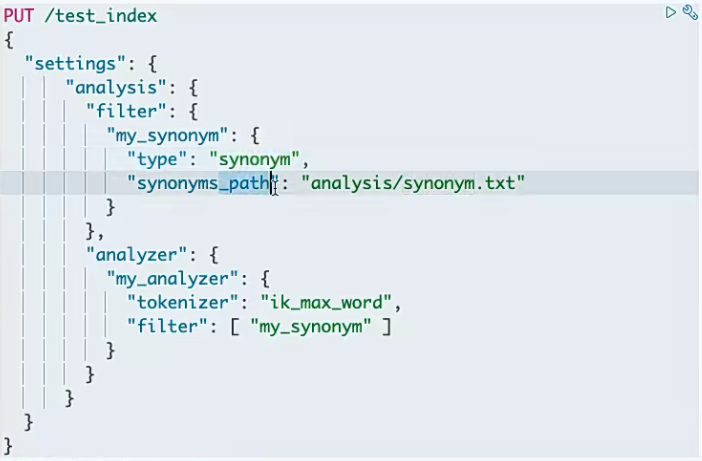


### 5.分词器：tokenizer

**切词**

> 常见分词器

* standard analyzer:默认分词器，中文支持的不理想，会逐字拆分
* pattern tokenizer:以正则匹配分隔符，把文本拆分成若干词项
* simple pattern tokenizer:以正则匹配词项，速度比pattern tokenizer快
* whitespace analyzer:以空白符分隔 tim\_cookie

> 自定义分词器

```bash
PUT custom
{
  "settings": {
    "analysis": {
      "char_filter": {
        "my_char":{
          "type":"mapping",
          "mappings":[
            "& => and",
            "| => or"
            ]
        }
      },
      "filter": {
        "my_stopword":{
          "type":"stop",
          "stopwards":[
            "is","in","the","a","at","for"
            ]
        }
      },
      "tokenizer": {
        "my_tokenizer":{
          "type":"pattern",
          "pattern":"[,!?]"
        }
      }
      , "analyzer": {
        "my_analyzer":{
          "type":"custom", # 自定义分析器
          "char_filter":"my_char",
          "tokenizer":"my_tokenizer"
        }
      }
    }
  }
}
```

### 6.中文分词器

[Github地址](https://github.com/medcl/elasticsearch-analysis-ik)

Analyzer: `ik_smart` , `ik_max_word` , Tokenizer: `ik_smart` , `ik_max_word`

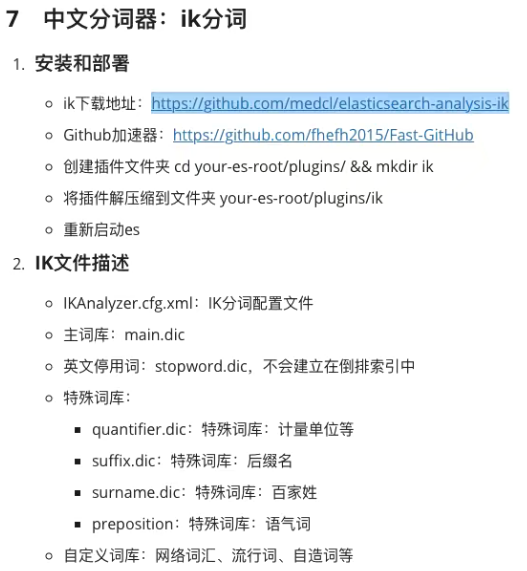

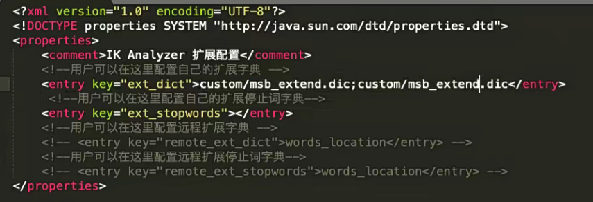

### 7.关于热更新

#### 1.关于远程词库的热更新

#### 2.关于基于数据库的热更新

## 8.聚合查询：Aggregation

### 1.基础聚合

```bash
# 语法
GET /product/_search
{
  "aggs": {
    "NAME": {
      "AGG_TYPE": {}
    },
    "NAME2 ": {
      "AGG_TYPE": {}
    }
  }
}
```

```bash
DELETE product
PUT product
{
  "mappings": {
    "properties": {
      "createtime":{
        "type": "date"
      },
      "desc":{
        "type": "text",
         "fields": {
          "keyword":{
            "type": "keyword",
            "ignore_above" : 256
          }
        },
        "analyzer": "ik_max_word"
      },
      "lv":{
        "type": "text",
        "fields": {
          "keyword":{
            "type": "keyword",
            "ignore_above" : 256
          }
        }
      },
      "name":{
        "type": "text"
        , "analyzer": "ik_max_word",
        "fields": {
          "keyword":{
            "type": "keyword",
            "ignore_above" : 256
          }
        }
      },
      "price":{
        "type": "long"
      },
      "tags":{
        "type": "text",
        "fields": {
          "keyword":{
            "type": "keyword",
            "ignore_above" : 256
          }
        }
      },
      "type" :{
        "type": "text",
        "fields": {
          "keyword":{
            "type": "keyword",
            "ignore_above" : 256
          }
        }
      }
    }
  }
}
PUT /product/_doc/1
{
  "name":"小米手机",
  "desc":"手机中的战斗机",
  "price": "3999",
  "lv":"旗舰机",
  "type":"手机",
  "createtime":"2020-10-01T08:00:00Z",
  "tags":[
    "性价比",
    "发烧",
    "不卡顿"
    ]
}
PUT /product/_doc/2
{
  "name":"NFC手机",
  "desc":"手机中的轰炸机",
  "price": "2999",
  "lv":"高端机",
  "type":"手机",
  "createtime":"2020-06-20",
  "tags":[
    "性价比",
    "快充",
    "门禁卡"
    ]
}
PUT /product/_doc/3
{
  "name":"挨炮",
  "desc":"除了CPU一无是处",
  "price": "3299",
  "lv":"旗舰机",
  "type":"手机",
  "createtime":"2020-07-21",
  "tags":[
    "割韭菜",
    "割韭菜",
    "割新韭菜"
    ]
}
```

#### 1.分桶聚合(Bucket agregations)

```bash
# 分桶聚合(Bucket agregations)：统计不同标签的商品数量
GET /product/_search
{
  "size": 0, 
  "aggs": {
    "aggs_tag": {
      "terms": {
        "field": "tags.keyword",
        "size": 10,
        "order": {
          "_count": "asc"
        }
      }
    }
  }
}


# 结果
{
  "took" : 8,
  "timed_out" : false,
  "_shards" : {
    "total" : 1,
    "successful" : 1,
    "skipped" : 0,
    "failed" : 0
  },
  "hits" : {
    "total" : {
      "value" : 3,
      "relation" : "eq"
    },
    "max_score" : null,
    "hits" : [ ]
  },
  "aggregations" : {
    "aggs_tag" : {
      "doc_count_error_upper_bound" : 0,
      "sum_other_doc_count" : 0,
      "buckets" : [
        {
          "key" : "不卡顿",
          "doc_count" : 1
        },
        {
          "key" : "割新韭菜",
          "doc_count" : 1
        },
        {
          "key" : "割韭菜",
          "doc_count" : 1
        },
        {
          "key" : "发烧",
          "doc_count" : 1
        },
        {
          "key" : "快充",
          "doc_count" : 1
        },
        {
          "key" : "门禁卡",
          "doc_count" : 1
        },
        {
          "key" : "性价比",
          "doc_count" : 2
        }
      ]
    }
  }
}
```

#### 2.指标聚合(Metrics agregations)

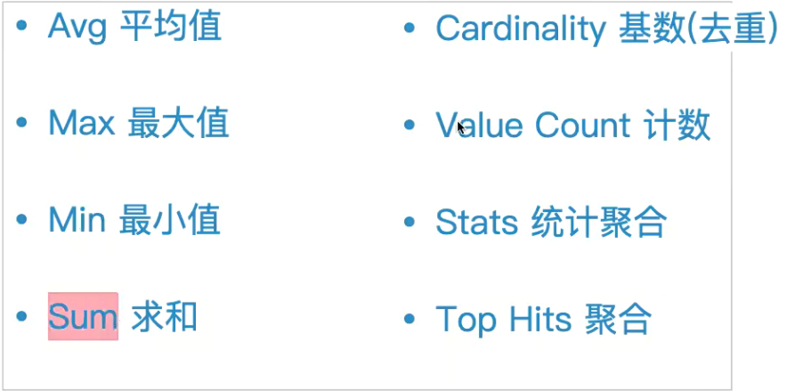

```bash
# 指标聚合(Metrics agregations)：统计最贵、最便宜和平均价格
GET product/_search
{
  "size": 0, 
  "aggs": {
    "max_price": {
      "max": {
        "field": "price"
      }
    },
    "min_price":{
      "min": {
        "field": "price"
      }
    },
    "avg_price":{
      "avg": {
        "field": "price"
      }  
    },
    "price_stats":{
      "stats": {
        "field": "price"
      }
    },
    "name_count":{
      "cardinality": {
        "field": "name.keyword"
      }
    }
  }
}

# 结果
{
  "took" : 1,
  "timed_out" : false,
  "_shards" : {
    "total" : 1,
    "successful" : 1,
    "skipped" : 0,
    "failed" : 0
  },
  "hits" : {
    "total" : {
      "value" : 3,
      "relation" : "eq"
    },
    "max_score" : null,
    "hits" : [ ]
  },
  "aggregations" : {
    "max_price" : {
      "value" : 3999.0
    },
    "min_price" : {
      "value" : 2999.0
    },
    "avg_price" : {
      "value" : 3432.3333333333335
    },
    "price_stats" : {
      "count" : 3,
      "min" : 2999.0,
      "max" : 3999.0,
      "avg" : 3432.3333333333335,
      "sum" : 10297.0
    },
    "name_count" : {
      "value" : 3
    }
  }
}
```

#### 3.管道聚合(Pipeline agregation)


```bash
# 管道聚合
# 统计平均价格最低的商品分类
GET product/_search
{
  "size": 0, 
  "aggs": {
    "type_bucket": {
      "terms": {
        "field": "tags.keyword",
        "size": 10
      },
      "aggs": {
        "price_bucket": {
          "avg": {
            "field": "price"
          }
        }
      }
    },
    "min_buckets":{
      "min_bucket": {
        "buckets_path": "type_bucket>price_bucket"
      }
    }
  }
}


# 结果
{
  "took" : 15,
  "timed_out" : false,
  "_shards" : {
    "total" : 1,
    "successful" : 1,
    "skipped" : 0,
    "failed" : 0
  },
  "hits" : {
    "total" : {
      "value" : 3,
      "relation" : "eq"
    },
    "max_score" : null,
    "hits" : [ ]
  },
  "aggregations" : {
    "type_bucket" : {
      "doc_count_error_upper_bound" : 0,
      "sum_other_doc_count" : 0,
      "buckets" : [
        {
          "key" : "性价比",
          "doc_count" : 2,
          "price_bucket" : {
            "value" : 3499.0
          }
        },
        {
          "key" : "不卡顿",
          "doc_count" : 1,
          "price_bucket" : {
            "value" : 3999.0
          }
        },
        {
          "key" : "割新韭菜",
          "doc_count" : 1,
          "price_bucket" : {
            "value" : 3299.0
          }
        },
        {
          "key" : "割韭菜",
          "doc_count" : 1,
          "price_bucket" : {
            "value" : 3299.0
          }
        },
        {
          "key" : "发烧",
          "doc_count" : 1,
          "price_bucket" : {
            "value" : 3999.0
          }
        },
        {
          "key" : "快充",
          "doc_count" : 1,
          "price_bucket" : {
            "value" : 2999.0
          }
        },
        {
          "key" : "门禁卡",
          "doc_count" : 1,
          "price_bucket" : {
            "value" : 2999.0
          }
        }
      ]
    },
    "min_buckets" : {
      "value" : 2999.0,
      "keys" : [
        "快充",
        "门禁卡"
      ]
    }
  }
}
```

### 2.嵌套聚合：基于聚合结果的聚合

```bash
# 嵌套聚合
# 统计每个商品类型中不同档次分类商品中平均价格最低的档次
GET product/_search
{
  "size": 0, 
  "aggs": {
    "type_lv_agg": {
      "terms": {
        "field": "type.keyword"
      },
      "aggs": {
        "count_num": {
          "terms": {
            "field": "lv.keyword"
          },
          "aggs": {
            "price_avg": {
              "avg": {
                "field": "price"
              }
            }
          }
        },
         "min_bucket":{
      "min_bucket": {
        "buckets_path": "count_num>price_avg"
      }
    }
      }
    }
  }
}
```

### 3.基于查询结果的聚合和基于聚合结果的查询

```bash
# 基于查询结果的聚合
# 基于查询结果的聚合
GET product/_search
{
  "query": {
    "match": {
      "type": "手机"
    }
  },
  "aggs":{
      "price":{
        "terms": {
          "field": "price"
        }
      }
    }
}
```

```bash
# 基于聚合结果的查询：用来看聚合的详细信息
GET product/_search
{
  "aggs":{
      "price":{
        "terms": {
          "field": "type.keyword"
        }
      }
    },
  "post_filter": {
    "match": {
      "type": "手机"
    }
  }
}

# 结果
{
  "took" : 5,
  "timed_out" : false,
  "_shards" : {
    "total" : 1,
    "successful" : 1,
    "skipped" : 0,
    "failed" : 0
  },
  "hits" : {
    "total" : {
      "value" : 3,
      "relation" : "eq"
    },
    "max_score" : 1.0,
    "hits" : [
      {
        "_index" : "product",
        "_type" : "_doc",
        "_id" : "1",
        "_score" : 1.0,
        "_source" : {
          "name" : "小米手机",
          "desc" : "手机中的战斗机",
          "price" : "3999",
          "lv" : "旗舰机",
          "type" : "手机",
          "createtime" : "2020-10-01T08:00:00Z",
          "tags" : [
            "性价比",
            "发烧",
            "不卡顿"
          ]
        }
      },
      {
        "_index" : "product",
        "_type" : "_doc",
        "_id" : "2",
        "_score" : 1.0,
        "_source" : {
          "name" : "NFC手机",
          "desc" : "手机中的轰炸机",
          "price" : "2999",
          "lv" : "高端机",
          "type" : "手机",
          "createtime" : "2020-06-20",
          "tags" : [
            "性价比",
            "快充",
            "门禁卡"
          ]
        }
      },
      {
        "_index" : "product",
        "_type" : "_doc",
        "_id" : "3",
        "_score" : 1.0,
        "_source" : {
          "name" : "挨炮",
          "desc" : "除了CPU一无是处",
          "price" : "3299",
          "lv" : "旗舰机",
          "type" : "手机",
          "createtime" : "2020-07-21",
          "tags" : [
            "割韭菜",
            "割韭菜",
            "割新韭菜"
          ]
        }
      }
    ]
  },
  "aggregations" : {
    "price" : {
      "doc_count_error_upper_bound" : 0,
      "sum_other_doc_count" : 0,
      "buckets" : [
        {
          "key" : "手机",
          "doc_count" : 3
        },
        {
          "key" : "玩具",
          "doc_count" : 1
        }
      ]
    }
  }
}

```

```bash
# 截断查询条件
# 基于查询结果的聚合
GET product/_search
{
  "query": {
    "range": {
      "price": {
        "gte": 3000,
        "lte": 4000
      }
    }
  },
  "aggs":{
      "max_price":{
        "max": {
          "field": "price"
        }
      },
      "min_price":{
        "global": {}, # 如果这里用filter，此后查询条件会是这个查询条件和上面那个查询的集合
        "aggs": {
          "min": {
            "min": {
              "field": "price"
            }
          }
        }
      }
    }
}
```

### 4.聚合排序

```
GET product/_search?size=0
{
  "aggs": {
    "type_avg_price": {
      "terms": {
        "field": "type.keyword",
        "order": {
          "agg_stats>stats.min": "asc"
        }
      },
    "aggs": {
      "agg_stats": {
        "filter": {
          "terms": {
            "type.keyword": ["手机","玩具"]
          }
        },
      "aggs": {
       "stats": {
         "stats": {
          "field": "price"
        }
      }
    }
      }
    }
    }
  }
}

# 结果
{
  "took" : 12,
  "timed_out" : false,
  "_shards" : {
    "total" : 1,
    "successful" : 1,
    "skipped" : 0,
    "failed" : 0
  },
  "hits" : {
    "total" : {
      "value" : 4,
      "relation" : "eq"
    },
    "max_score" : null,
    "hits" : [ ]
  },
  "aggregations" : {
    "type_avg_price" : {
      "doc_count_error_upper_bound" : 0,
      "sum_other_doc_count" : 0,
      "buckets" : [
        {
          "key" : "手机",
          "doc_count" : 3,
          "agg_stats" : {
            "doc_count" : 3,
            "stats" : {
              "count" : 3,
              "min" : 2999.0,
              "max" : 3999.0,
              "avg" : 3432.3333333333335,
              "sum" : 10297.0
            }
          }
        },
        {
          "key" : "玩具",
          "doc_count" : 1,
          "agg_stats" : {
            "doc_count" : 1,
            "stats" : {
              "count" : 1,
              "min" : 3299.0,
              "max" : 3299.0,
              "avg" : 3299.0,
              "sum" : 3299.0
            }
          }
        }
      ]
    }
  }
}

```

### 5.常见的聚合函数

#### 1.histogram

> 使用range

```bash
GET product/_search?size=0
{
  "aggs": {
    "price_range": {
      "range": {
        "field": "price",
        "ranges": [
          {
            "from": 2000,
            "to": 3000
          },
          {
            "from": 3000,
            "to": 4000
          }
        ]
      }
    }
  }
}
```

> 使用histogram

```bash
# histogram
GET product/_search?size=0
{
  "aggs": {
    "price": {
      "histogram": {
        "field": "price",
        "interval": 1000,
        "keyed": true,  # 改变形式
        "min_doc_count": 0, # 显示的最小值
        "missing": 1999 # 对字段空值赋予默认值
      }
    }
  }
}

# date-histogram
GET product/_search?size=0
{
  "aggs": {
    "date": {
      "date_histogram": {
        "field": "createtime",
        "calendar_interval": "1M",
        "format": "yyyy-MM", 
        "extended_bounds": { # 扩展显示数据
          "min": "2020-01",
          "max": "2020-12"
        }# 完全显示1-12月的数据
      }
    },
    "aggs":{
    "sum_agg":{
    "sum":{
    "field":"price"
    }
    },
    # 进行累加操作
    "my_cumulative_sum":{
    "cumulative_sum":{
    "backets_path":"sum_agg"
    }
    }
    }
  }
}

# auto_date_histogram：根据buckets来自动设置interval
GET product/_search
{
  "aggs": {
    "auto": {
      "auto_date_histogram": {
        "field":"createtime",
        "format":"yyyy-MM-dd",
        "buckets":365
      }
    }
  }
}

```

#### 2.percentile

```bash
GET product/_search
{
  "aggs": {
    "price_percenties": {
      "percentiles": {
        "field": "price",
        "percents": [
          1,
          5,
          25,
          50,
          75,
          95,
          99
        ]
      }
    }
  }
}

# 结果
{
  "took" : 2,
  "timed_out" : false,
  "_shards" : {
    "total" : 1,
    "successful" : 1,
    "skipped" : 0,
    "failed" : 0
  },
  "hits" : {
    "total" : {
      "value" : 4,
      "relation" : "eq"
    },
    "max_score" : null,
    "hits" : [ ]
  },
  "aggregations" : {
    "price_percenties" : {
      "values" : {
        "1.0" : 2999.0,
        "5.0" : 2999.0,
        "25.0" : 3149.0,
        "50.0" : 3299.0,
        "75.0" : 3649.0,
        "95.0" : 3999.0,
        "99.0" : 3999.0
      }
    }
  }
}

```

```bash
GET product/_search?size=0
{
  "aggs": {
    "price_percenties": {
      "percentile_ranks": {
        "field": "price",
      "values": [
        1000,
        2000,
        3000,
        4000
        ]
        
      }
      
      }
  }
}

# 结果
{
  "took" : 1,
  "timed_out" : false,
  "_shards" : {
    "total" : 1,
    "successful" : 1,
    "skipped" : 0,
    "failed" : 0
  },
  "hits" : {
    "total" : {
      "value" : 4,
      "relation" : "eq"
    },
    "max_score" : null,
    "hits" : [ ]
  },
  "aggregations" : {
    "price_percenties" : {
      "values" : {
        "1000.0" : 0.0,
        "2000.0" : 0.0,
        "3000.0" : 12.583333333333332,
        "4000.0" : 100.0
      }
    }
  }
}

```

## 9.脚本查询:Scripting

### 1.概念

Scripting是Elasticsearch支持的一种专门用于复杂场景下支持自定义编程的强大的脚本功能，ES支持多种脚本语言，如painless，其语法类似于java，也有注释、关键字、类型、变量、函数等，其相对于其他脚本高出几倍性能，并且安全可靠，可以用于内联合存储脚本

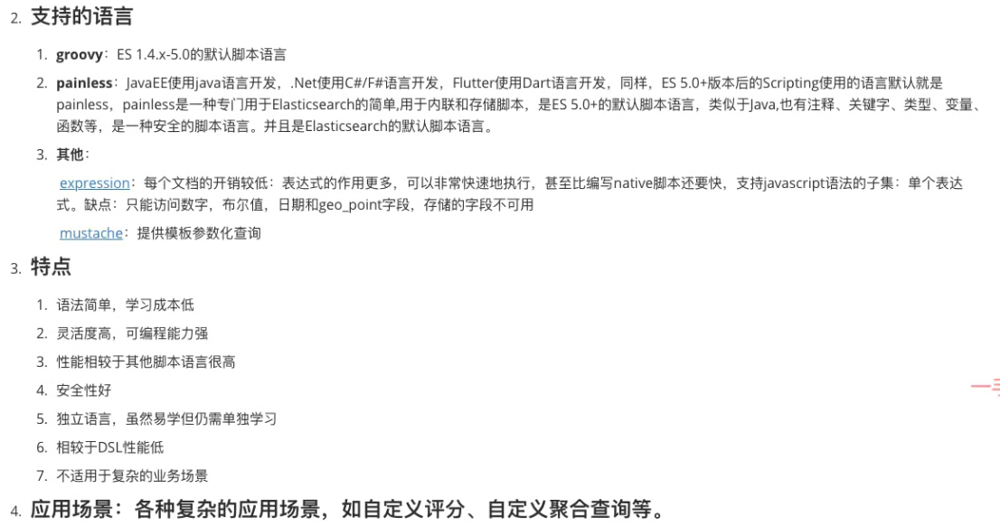

```bash
# 语法
POST product/_update/2
{
  "script": {
    "source": "SCRIPT"
  }
}
```

### 2.基础使用

```bash
POST product2/_update/1
{
  "script": {
  # ctx表示上下文
    "source": "ctx._source.num-=1"
  }
}

```

### 3.scripting的CURD

```bash
# 备份数据
POST _reindex
{
  "source": {
    "index": "product"
  },
  "dest": {
    "index": "product3"
  }
}
```

#### 1.修改新增

```bash
POST product/_update/2
{
  "script": {
    "lang": "painless",
    "source": "ctx._source.tags.add('无线充电')"
  }
}

# upsert update + insert
# 如果有2这条数据就修改price，没有就新增下面那条语句
POST product/_update/2
{
  "script": {
    "lang": "painless",
    "source": "ctx._source.price +=100'"
  },
  "upsert": {
    "name":"xiaomi",
    "desc":123,
    "price":199
  }
}
```

#### 2.删除

```bash
POST product/_update/2
{
  "script": {
    "lang": "painless",
    "source": "ctx.op='delete'"
  }
}
```

#### 3.查询

```bash
# 查询
GET product/_search
{
  "script_fields": {
    "my_price": {
      "script":{
      "lang": "expression", 
      "source": "doc['price']"
    }
  }
}
}
GET product/_search
{
  "script_fields": {
    "my_price": {
      "script":{
      "lang": "painless", 
      "source": "doc['price'].value+100"
    }
  }
}
}
```

### 4.参数化脚本

**Elasticsearch在执行脚本之前需要编译脚本，这是一个相对耗时的操作。为了提高性能，可以使用params参数来避免编译脚本。params参数可以在脚本中使用，它允许你在执行脚本时传递参数，而不是在脚本中写死参数值。这样，如果脚本只是参数值不同，就可以避免重复编译脚本，从而提高性能。**

```bash
# 参数化脚本
POST product/_update/1
{
  "script": {
    "lang": "painless",
    "source": "ctx._source.tags.add(params.tags_name); ctx._source.tags.add(params.tags_name2)",
    "params": {
      "tags_name":"无线充电",
      "tags_name2":"快充"
    }
  }
}
GET product/_search
{
  "script_fields": {
    "price": {
      "script": {
        "lang": "painless",
        "source": "[doc['price'].value * params.d8,doc['price'].value * params.d7,doc['price'].value * params.d6]",
        "params": {
          "d8":0.8,
          "d7":0.7,
          "d6":0.6
        }
        
      }
    }
  }
}
```

### 5.scripts模板

**Elasticsearch会把模板保存在集群的缓存中**

```bash
# Stored scripts
# /_scripts/{id}
# 创建模板
POST _scripts/calculate
{
  "script": {
    "lang": "painless",
    "source": "doc.price.value * params.discount"
  }
}
# 查看模板
GET _scripts/calculate
# 使用脚本
GET product/_search
{
  "script_fields": {
    "discount_fields": {
      "script": {
        "id": "calculate",
        "params": {
          "discount":0.8
        }
      }
    }
  }
}
```

### 6.函数式编程


```bash
GET product/_search
{
  "script": {
    "lang": "painless",
    "source": """
    if(ctx._source.name ==~ /[\s\S]*小米[\s\S]*/) {
      ctx._source.name+="***"
    }else{
      ctx.op="noop"
    }
    """
  }
}
```

```bash
# 统计所有价格小于1000的商品的tag数量
GET product/_search
{
  "query": {
    "constant_score": {
      "filter": {
        "range": {
          "price": {
            "lte":1000
          }
        }
      }
    }
  }, 
  "aggs": {
    "tag_agg": {
      "sum": {
        "script": 
          """
          int total = 0;
          for(int i= 0; i<doc['tags'].length; i++){
          total++;
          }
         """
        
      }
      
    }
  }
}
```

### 7.doc\['field'].value和params\['\_source']\['field']区别

**doc和params都只能查询\_source中的数据**

在Elasticsearch中，doc\[‘field’].value和params\[‘\_source’]\[‘field’]都是用于访问文档字段的方式。但是，它们之间有一些区别。

doc\[‘field’].value是一种更快的方式，它将字段的术语加载到内存中，以便脚本可以更快地访问它们。但是，它只能访问简单字段值，例如数字或字符串。

params\[‘\_source’]\[‘field’]是一种更通用的方式，它可以访问复杂字段值，例如嵌套对象或数组。但是，它比doc\[‘field’].value慢，因为它需要从磁盘中加载整个文档并解析JSON格式。

## 10.索引的批量操作

### 1.基于mget的批量查询

```bash
GET /_mget
{
  "docs": [
    {
      "_index": "product",
      "_id":3
    },
    {
      "_index": "product",
      "_id":1
    }
  ]
}

#
GET product/_mget
{
  "ids":[3,1]
}


# 
GET /_mget
{
  "docs": [
    {
      "_index": "product",
      "_id": 3,
      "_source":[
        "price"
      ]
    },
    {
      "_index": "product",
      "_id": 1,
      "_source": {
        "include":[
          "name"
          ],
          "exclude":[
            "price"]
      }
    }
  ]
}
```

### 2.文档的操作类型


```bash
# create
PUT test_index/_create/3
{
    "test_field":"test",
    "test_title":"title"
}
# 自动生成id
POST test_index/_doc
{
  "test_field":"test",
  "test_title":"title"
}
# delete:懒删除
DELETE test_index/_doc/3

# update
# 全量或增量更新
POST /test_index/_update/iXifgIkBcdO9ST1Q54i5/
{
  "doc": {
    "test_field": "test",
    "test_title": "title"
  }
}
# 全量
POST /test_index/_doc/iXifgIkBcdO9ST1Q54i5/
{

    "test_field": "test",
    "test_title": "title"
}
# index：可以是创建，也可以是全量替换
PUT test_index/_doc/iXifgIkBcdO9ST1Q54i5?op_type=index
{
  "test_title":1
}
#?filter_path=items.*.error:只输出错误的信息
```

### 3.基于\_bulk的增删改

**传统的增删改都要在内存中序列化成JSON对象，而是用bulk不消耗额外内存**

```bash
#POST /_bulk
#POST /<index>/_bulk
#{"action": {"metadata"}}
#{"data"}
POST _bulk?filter_path=items.*.error
{ "create": {"_index": "product","_id": 2}}
{"name":"_bulk create"}
{ "delete": {"_index": "product","_id": 2}}
{ "update": {"_index": "product","_id": 2}}
{"doc":{"name":"_bulk create11"}}

```

## 11.模糊查询

### 1.prefix：前缀搜索


### 2.wildcard：通配符


### 3.regexp：正则表达式

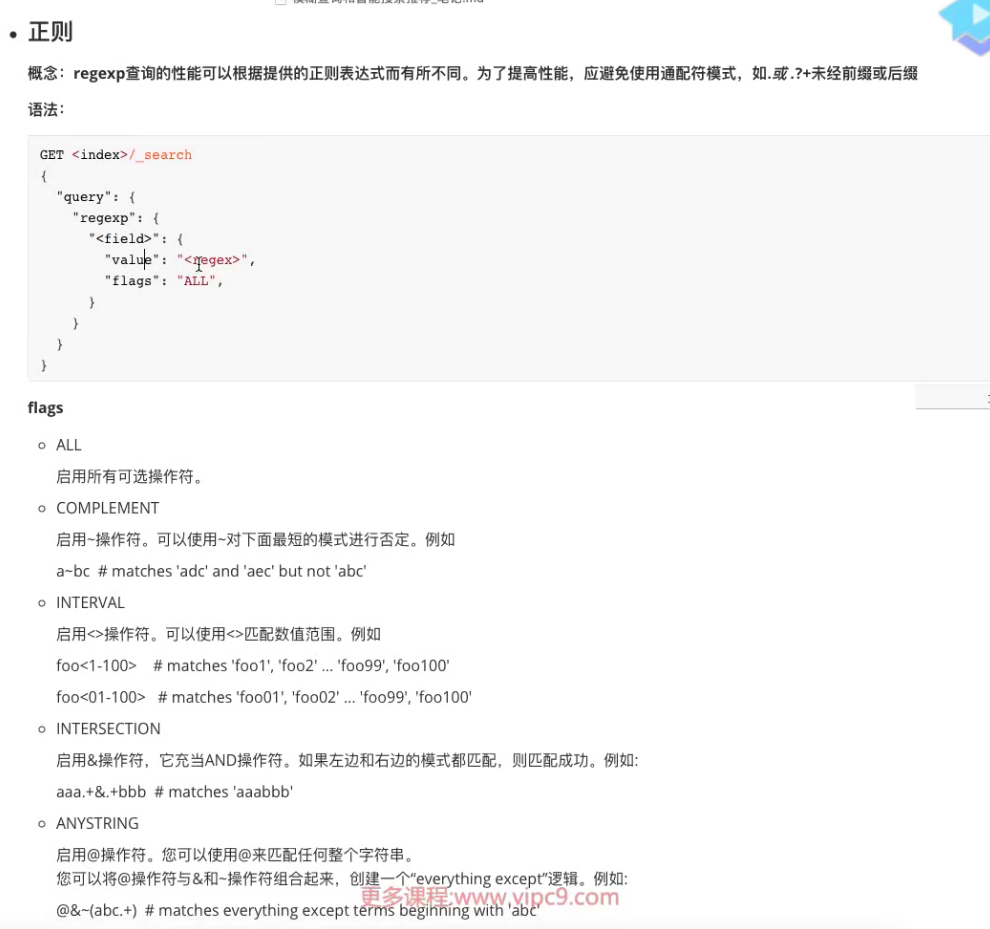

### 4.fuzzy模糊查询

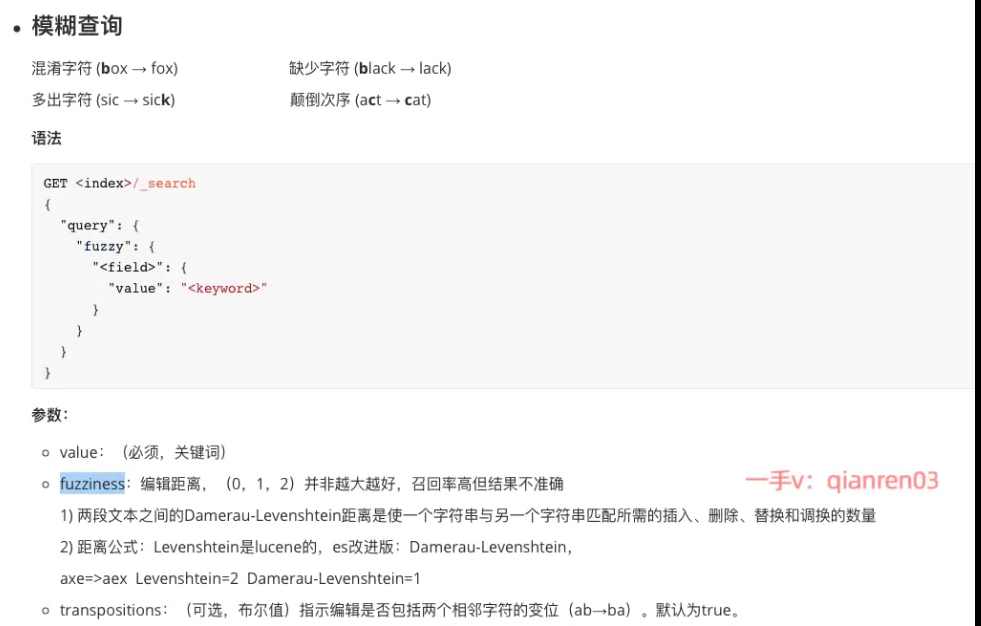

```bash
# match也可用使用模糊查询，但是match是分词的，fuzzy是不分词的
GET product/_search
{
  "query": {
    "match": {
      "desc": {
        "query": "nfe quaha",
        "fuzziness": 1
      }
    }
  }
}
```

### 5.match\_phrase\_prefix：短语前缀


```bash
GET product/_search
{
  "query": {
    "match_phrase_prefix": {
      "desc": {
        "query": "zhong",
        "max_expansions": 10, # 是分片级别的限制
        "slop": 3
      }
    }
  }
}
```

### 6.ngram和edge-ngram


**ngram默认的min\_gram和max\_gram分别是1和2，edge\_ngram都是1**

```
# ngram可以在前缀，中缀，后缀都能使用
# edge_ngram只能在前缀使用
GET _analyze
{
  "tokenizer": "standard",
  "filter": ["edge_ngram"],
  "text": "reba always loves me"
}

# ngram结果
{
  "tokens" : [
    {
      "token" : "r",
      "start_offset" : 0,
      "end_offset" : 4,
      "type" : "<ALPHANUM>",
      "position" : 0
    },
    {
      "token" : "re",
      "start_offset" : 0,
      "end_offset" : 4,
      "type" : "<ALPHANUM>",
      "position" : 0
    },
    {
      "token" : "e",
      "start_offset" : 0,
      "end_offset" : 4,
      "type" : "<ALPHANUM>",
      "position" : 0
    },
    {
      "token" : "eb",
      "start_offset" : 0,
      "end_offset" : 4,
      "type" : "<ALPHANUM>",
      "position" : 0
    },
    {
      "token" : "b",
      "start_offset" : 0,
      "end_offset" : 4,
      "type" : "<ALPHANUM>",
      "position" : 0
    },
    {
      "token" : "ba",
      "start_offset" : 0,
      "end_offset" : 4,
      "type" : "<ALPHANUM>",
      "position" : 0
    },
    {
      "token" : "a",
      "start_offset" : 0,
      "end_offset" : 4,
      "type" : "<ALPHANUM>",
      "position" : 0
    },
    {
      "token" : "a",
      "start_offset" : 5,
      "end_offset" : 11,
      "type" : "<ALPHANUM>",
      "position" : 1
    },
    {
      "token" : "al",
      "start_offset" : 5,
      "end_offset" : 11,
      "type" : "<ALPHANUM>",
      "position" : 1
    },
    {
      "token" : "l",
      "start_offset" : 5,
      "end_offset" : 11,
      "type" : "<ALPHANUM>",
      "position" : 1
    },
    {
      "token" : "lw",
      "start_offset" : 5,
      "end_offset" : 11,
      "type" : "<ALPHANUM>",
      "position" : 1
    },
    {
      "token" : "w",
      "start_offset" : 5,
      "end_offset" : 11,
      "type" : "<ALPHANUM>",
      "position" : 1
    },
    {
      "token" : "wa",
      "start_offset" : 5,
      "end_offset" : 11,
      "type" : "<ALPHANUM>",
      "position" : 1
    },
    {
      "token" : "a",
      "start_offset" : 5,
      "end_offset" : 11,
      "type" : "<ALPHANUM>",
      "position" : 1
    },
    {
      "token" : "ay",
      "start_offset" : 5,
      "end_offset" : 11,
      "type" : "<ALPHANUM>",
      "position" : 1
    },
    {
      "token" : "y",
      "start_offset" : 5,
      "end_offset" : 11,
      "type" : "<ALPHANUM>",
      "position" : 1
    },
    {
      "token" : "ys",
      "start_offset" : 5,
      "end_offset" : 11,
      "type" : "<ALPHANUM>",
      "position" : 1
    },
    {
      "token" : "s",
      "start_offset" : 5,
      "end_offset" : 11,
      "type" : "<ALPHANUM>",
      "position" : 1
    },
    {
      "token" : "l",
      "start_offset" : 12,
      "end_offset" : 17,
      "type" : "<ALPHANUM>",
      "position" : 2
    },
    {
      "token" : "lo",
      "start_offset" : 12,
      "end_offset" : 17,
      "type" : "<ALPHANUM>",
      "position" : 2
    },
    {
      "token" : "o",
      "start_offset" : 12,
      "end_offset" : 17,
      "type" : "<ALPHANUM>",
      "position" : 2
    },
    {
      "token" : "ov",
      "start_offset" : 12,
      "end_offset" : 17,
      "type" : "<ALPHANUM>",
      "position" : 2
    },
    {
      "token" : "v",
      "start_offset" : 12,
      "end_offset" : 17,
      "type" : "<ALPHANUM>",
      "position" : 2
    },
    {
      "token" : "ve",
      "start_offset" : 12,
      "end_offset" : 17,
      "type" : "<ALPHANUM>",
      "position" : 2
    },
    {
      "token" : "e",
      "start_offset" : 12,
      "end_offset" : 17,
      "type" : "<ALPHANUM>",
      "position" : 2
    },
    {
      "token" : "es",
      "start_offset" : 12,
      "end_offset" : 17,
      "type" : "<ALPHANUM>",
      "position" : 2
    },
    {
      "token" : "s",
      "start_offset" : 12,
      "end_offset" : 17,
      "type" : "<ALPHANUM>",
      "position" : 2
    },
    {
      "token" : "m",
      "start_offset" : 18,
      "end_offset" : 20,
      "type" : "<ALPHANUM>",
      "position" : 3
    },
    {
      "token" : "me",
      "start_offset" : 18,
      "end_offset" : 20,
      "type" : "<ALPHANUM>",
      "position" : 3
    },
    {
      "token" : "e",
      "start_offset" : 18,
      "end_offset" : 20,
      "type" : "<ALPHANUM>",
      "position" : 3
    }
  ]
}


# edge_ngram结果
{
  "tokens" : [
    {
      "token" : "r",
      "start_offset" : 0,
      "end_offset" : 4,
      "type" : "<ALPHANUM>",
      "position" : 0
    },
    {
      "token" : "a",
      "start_offset" : 5,
      "end_offset" : 11,
      "type" : "<ALPHANUM>",
      "position" : 1
    },
    {
      "token" : "l",
      "start_offset" : 12,
      "end_offset" : 17,
      "type" : "<ALPHANUM>",
      "position" : 2
    },
    {
      "token" : "m",
      "start_offset" : 18,
      "end_offset" : 20,
      "type" : "<ALPHANUM>",
      "position" : 3
    }
  ]
}

```

## 12.搜索推荐


### 1.Term Suggester

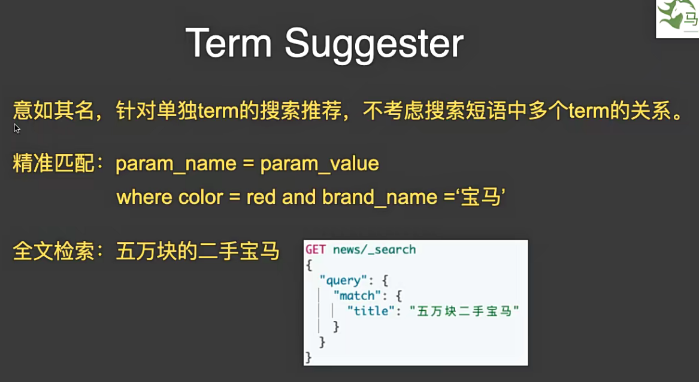

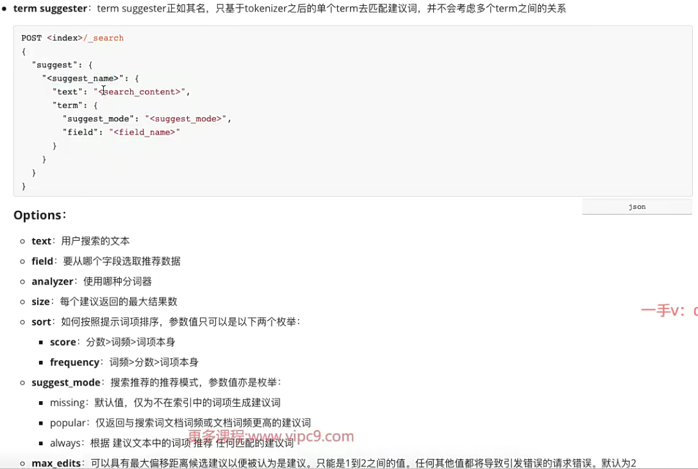

### 2.phrase suggester


**在使用Phrase之前，需要定义一个特定的mapping**

### 3.completion suggester


**使用之前先创建mapping**


### 4.Context Suggester


**使用之前也必须创建mapping**

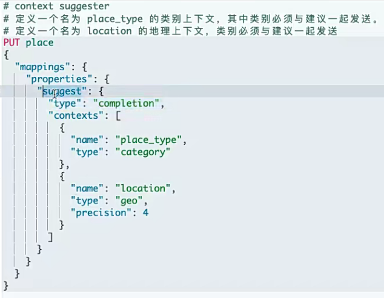


## 13.数据建模

### 1.嵌套类型查询：Nested

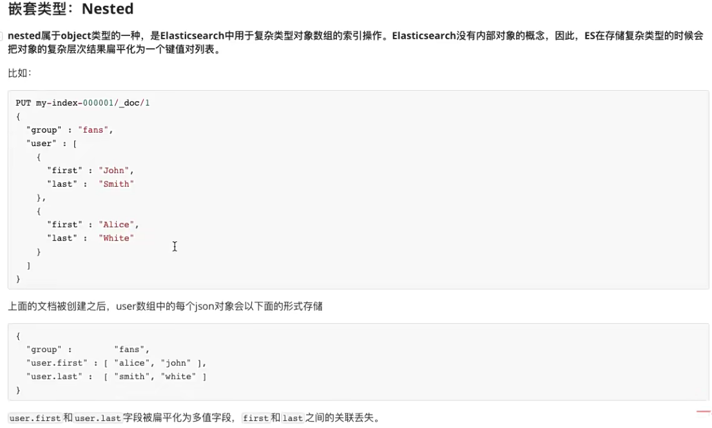

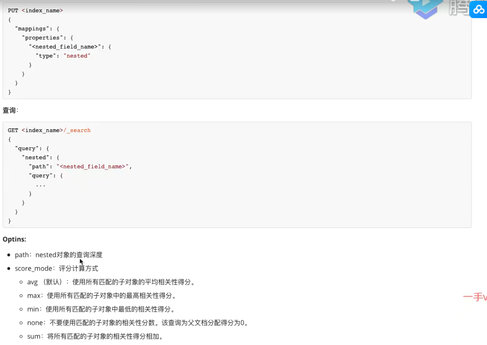


### 2.父子级关系查询：Join

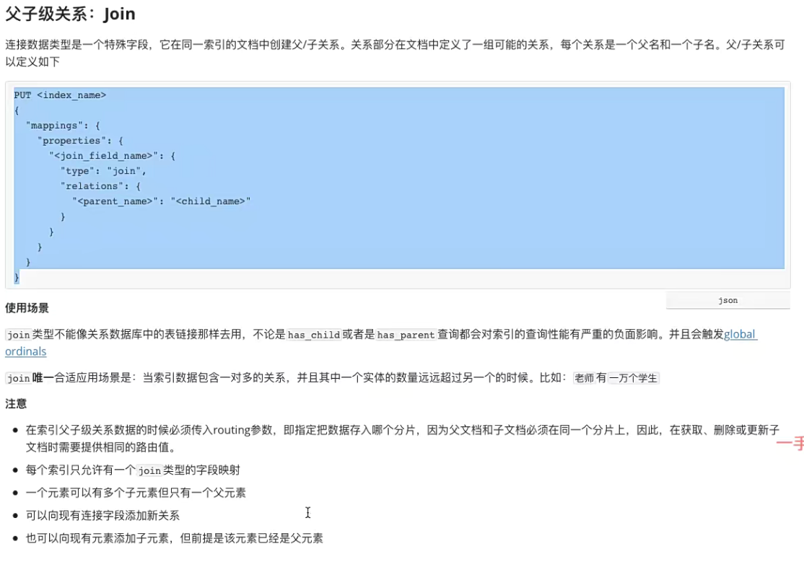


**使用routing指定分片**


### 3.数据建模


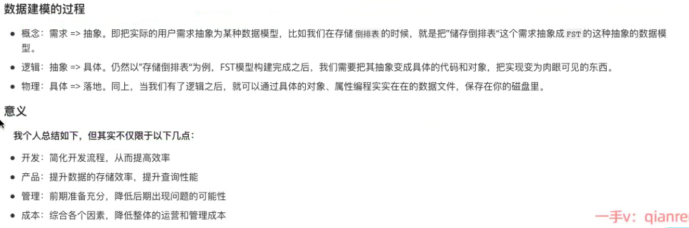


## 14.es客户端


## 15.Elasticsearch分布式原理

### 1.单机服务有哪些问题？

* 性能有限
* 可用性差
* 难以扩展

### 2.分布式的好处

* 高可用性：集群可容忍部分节点宕机而保持服务的可用性和数据的完整性
* 易扩展性：当集群的性能不满足业务要求时，可以方便快速的扩容集群，而无需停止服务
* 高性能：集群通过负载均衡器分摊并发请求压力，可以大大提高集群的吞吐能力和并发能力

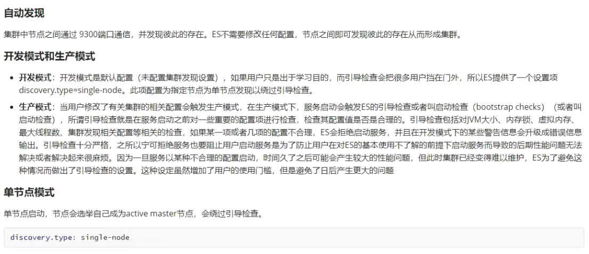


