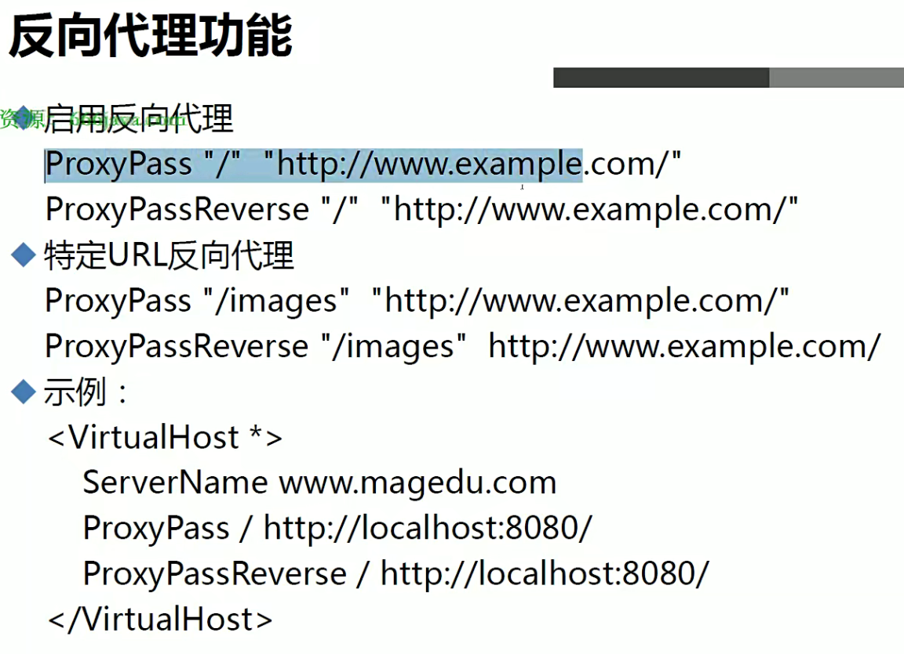
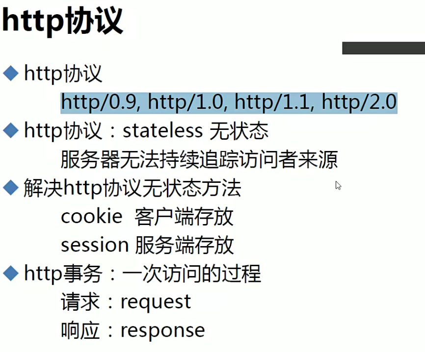

# 1.httpd基础知识


# 2.HTTPD工作模型


# 3.HTTPD

## 1.MPM


## 2.安装


## 3.配置


```bash
# 在httpd2.4，设置文档页面之后需要授权
DocumentRoot "/var/www/html"

#
# Relax access to content within /var/www.
#
<Directory "/var/www">
    AllowOverride None #该指令指定不允许在该目录中覆盖 Apache 的默认设置。这可以增加服务器的安全性，因为阻止了用户可能通过 .htaccess 文件来修改服务器的行为。
    # Allow open access:
    Require all granted # 定义了访问控制规则
</Directory>
```


```bash
ErrorLog "logs/error_log"
# LogLevel: Control the number of messages logged to the error_log.
LogLevel warn
    # a CustomLog directive (see below).
    LogFormat "%h %l %u %t \"%r\" %>s %b \"%{Referer}i\" \"%{User-Agent}i\"" combined
    LogFormat "%h %l %u %t \"%r\" %>s %b" common
      LogFormat "%h %l %u %t \"%r\" %>s %b \"%{Referer}i\" \"%{User-Agent}i\" %I %O" combinedio
    # The location and format of the access logfile (Common Logfile Format).
    #CustomLog "logs/access_log" common
    # (Combined Logfile Format) you can use the following directive.
    CustomLog "logs/access_log" combined
```


> 需要加载`auth_basic`模块


# 4.多虚拟主机

## 1.基于ip


## 2.基于port


## 3.基于多主机


# 5.mod_deflate模块


# 6.https


```bash
# 安装ssl模块
# 安装之后
 yum install mod_ssl
 
 # 加密配置文件
/etc/httpd/conf.d/ssl.conf
# SSLCertificateFile /etc/pki/tls/certs/localhost.crt 证书
# SSLCertificateKeyFile /etc/pki/tls/private/localhost.key 私钥

#SSLCertificateChainFile /etc/pki/tls/certs/server-chain.crt CA证书
```


```bash
<VirtualHost *:80>
    #DocumentRoot /var/www/asite
    ServerName www.a.com
    Redirect temp / https://www.a.com/
</VirtualHost>

<VirtualHost *:443>
    DocumentRoot /var/www/asite
    ServerName www.a.com
    SSLEngine on
    SSLCertificateFile /etc/httpd/conf.d/ssl/httpd.crt
    SSLCertificateKeyFile /etc/httpd/conf.d/ssl/httpd.key

    # 添加其他HTTPS相关配置
</VirtualHost>
```


# 7.重定向


> 如果不在虚拟主机中使用`Redirect`，可能会造成循环重定向问题


# 8.代理





# 9.Sendfile(零复制)


# 10.HTTP协议




# 11.HTTPD编译安装


# 12.LAMP


## 1.PHP


## 2.Module方式


```bash
# 优先解析index.php
DirectoryIndex index.php index.html
```


## 3.LAMP部署应用


### 1.phpadmin


### 2.wordpress


### 3.powerdns


## 4.PHP FastCGI方式


```bash
DirectoryIndex index.php
ProxyRequests off
ProxyPassMatch "^/.*\.php(.*)$" "fcgi://127.0.0.1:9000/var/www/html/"
```


## 5.编译PHP


