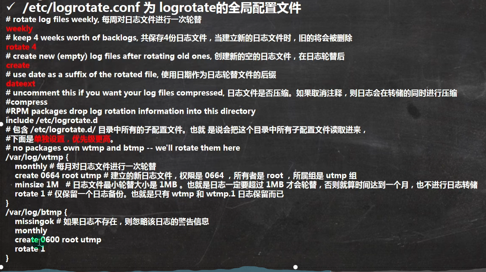
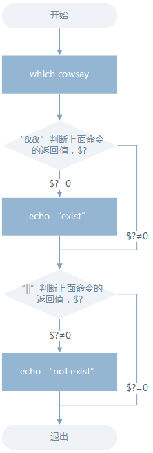

# 1.概述

## 1.1.Linux的应用范围


​																														**Linux适用范围**

- 个人桌面领域的应用
- 服务器领域：
  - Linux在服务器领域的应用是最强的
  - Linux免费、稳定、高效等特点特别适合
- 嵌入式领域
  - Linux运行稳定、对网络的良好支持性、低成本，且可以根据需要进行软件裁剪，内核最小可以达到几百KB等特点，使其近些年在嵌入式领域的应用得到非常大的提高
  - 如：机顶盒、数字电视、手机、智能家居、智能硬件等，以后在物联网中应用会更加广泛。

## 1.2.Linux介绍

Linux是一个开源、免费的操作系统，其稳定性、安全性、处理多并发已经得到业界的认可，目前很多企业级的项目都会部署到Linux

Linux主要的发行版：**Ubuntu**、**RedHat**、**CentOS**、Debain、Fedora、SuSe、OpenSUSE。

- 服务器分类
  - 塔式服务器、机架式服务器、刀片服务器
- Linux指令格式
  - command [-options] parameter1 parameter2
  - 各个部分之间用空格间隔
  - Linux中区分大小写


#  2. 虚拟机设置

## 2.1.网络的三种连接方式

- 桥接模式
  - 虚拟系统可以和外部系统通讯
  - 虚拟机上的网段会和主机的网段一致，所以容易造成网段冲突
- NAT模式
  - 网络地址转换模式
  - 虚拟机会随机生成一个网段地址，主机会随之生成一个同网段地址，虚拟机与主机可独立通信，不造成IP冲突
- 主机模式
  - 独立的系统，不和外部发生联系


安装vmtools后可以设置Windows和Linux的共享文件夹

> 如果你想要多个相同的虚拟机可以在vmwave中使用==克隆==功能
>
> 
>
> 在我们学习中，可能经常需要更改虚拟机的设置，但我们不能保证不会出错，在这时可以使用vmwave的==快照==功能，相当于状态回溯
>
> 
>
> 虚拟机的本质就是==文件==，所以虚拟机的迁移与删除直接对虚拟机文件进行操作就行了
>
> 
>
> 安装vmtools后可以设置Windows和Linux的共享文件夹

# 3.Linux文件目录

==在Linux世界里，一切皆是文件==

Linux中目录结构是规定好了的(FHS标准)

> FHS(Filesystem Hierarchy Standard,文件系统层次结构标准)，多数Linux版本采用这种文件组织形式，FHS定义了系统中每个区域的用途、所需要的最小构成的文件和目录同时还给出了例外处理和矛盾处理
>
> FHS定义了两层规范，第一层：/下面的各个目录应该要放什么文件数据。第二层：则是针对 `/usr` 及 `/var` 这两个目录的子目录来定义。例如 `/var/log` 放置系统日志文件，`/usr/share` 放置共享数据等等。

FHS 是根据以往无数 Linux 用户和开发者的经验总结出来的，并且会维持更新，FHS 依据文件系统使用的频繁与否以及是否允许用户随意改动（注意，不是不能，学习过程中，不要怕这些），将目录定义为四种交互作用的形态，如下表所示：


LInux的文件系统采用层级式的树状目录结构，再次结构中的最上层是根目录"/"，然后在此目录下创建其他目录


- **/bin**(/usr/bin,/usr/local/bin)
  - 是Binary的缩写，存放着常用指令
- **usr/local**
  - 这是另一个给主机额外安装软件所安装的目录。一般是通过编译源码方式安装的程序
- **/var**
  - 这个目录中存放着在不断扩充着的东西，习惯将经常被修改的目录放在这个目录下。包括各种日志文件
- **/sbin**(/usr/sbin,/usr/local/sbin)
  - s就是super user的意思，这里存放着系统管理员使用的系统管理程序
- **/home**
  - 存放普通用户的主目录，在Linux中每个用户都有一个自己的账户，一般该目录名是以用户的账户命令
- **/root**
  - 该目录为系统管理员，也被称为超级权限者的用户主目录
- **/etc**
  - 所有的系统管理所需要的配置文件和子目录
- **/usr**
  - 这是一个很重要的目录。用户的很多应用程序和文件都放在这个目录下
- **/boot**
  - 存放着linux启动的相关文件，包括一些连接文件和镜像文件
- **/dev**
  - 类似于windows的设备管理器，把所有的硬件用文件的形式存储
- **/media**
  - linux系统会自动识别一些设备，例如U盘、光驱等等，识别后linux会把识别的设备挂载到这个目录下
- **/mnt**
  - 系统提供该目录是为了让用户临时挂载别的文件系统的，我们可以将外部的存储挂载到/mnt/上，然后进入该目录就可以查看里的内容了
- /selinux [security-enhanced linux]
  - SELinux是一种安全子系统，它能控制程序只能访问特定文件，有三种工作模式，可以自行设置
- /opt
  - 这是给主机额外安装软件所摆放的目录
- /proc
  - 不能动。这个目录是一个虚拟的目录，它是系统内存的映射，访问这个目录来获取系统信息
- /srv
  - 不能动。是service的缩写。该目录存放着一些服务启动之后需要提取的数据
- /sys
  - 不能动。该目录下安装了存放着文件系统sysfs=>>
- /tmp
  - 存放一些临时文件
- /lib
  - 系统开机所需要最基本的动态连接共享库，几乎所有的应用程序都需要用到这些共享库
- /lost+found
  - 这个目录一般是空的，当系统非法关机后，这里会存放一些文件


# 4.Linux远程登录

> 为什么需要远程登录？

1. linux服务器时开发小组共享的
2. 正式上线的项目是运行在公网的

> 远程登录----xshell ----现在最强大的远程登录到Linux的工具，流程的速度并且完美解决了中文乱码的问题
>
> 文件传输----xftp -----是一款基于Windows的强大的SFTP、FTP文件传输软件

# 5.vi和vim编辑器

Linux系统会内置vi文本编辑器

Vim具有程序编辑功能，可以看做是Vi的增强版本，可以主动的以字体颜色辨别语法的正确性，方便程序设计。代码补完、编辑及错误跳转等方便编程的功能特别丰富。

可以在Linux中输入`vimtutor`来学习Linux内部的vim学习教程

> vi和vim常用的三种模式

- **正常模式**：
  - 以vim打开一个档案就直接进入一般模式。
- **插入模式**：
  - 按下i,I,o,O,a,A,R等任意一个字母之后才回进入编辑模式，按"ESC"退出模式
- **命令行模式**：
  - 在正常模式按":"进入。在这个模式中，可以提供你相关指令，完成读取、存盘、替换、离开vim、显示行号等动作


> 快捷键


- 正常模式
  - 按"q"+":":查看历史底线命令
- 插入模式
  - **字符按键以及Shift组合**，输入字符
  - **ENTER**，回车键，换行
  - **BACK SPACE**，退格键，删除光标前一个字符
  - **DEL**，删除键，删除光标后一个字符
  - **方向键**，在文本中移动光标
  - **HOME**/**END**，移动光标到行首/行尾
  - **Page Up**/**Page Down**，上/下翻页
  - **Insert**，切换光标为输入/替换模式，光标将变成竖线/下划线
  - **ESC**，退出输入模式，切换到命令模式


## 5.1.配置 vim

- 动态配置：
  - `:set` 或 `:set all`
- 永久配置
  - `~./vimrc`
- 几个常用的配置项目
  - 行号
    - 显示：`:set number`, 简写为 `set nu`
    - 取消：`:set nonumber`, 简写为 `set nonu`
  - 括号匹配
    - 匹配：`:set sm`
    - 取消：`:set nosm`
  - 自动缩进
    - 启用：`:set autoindent`, 简写为 `:set ai`
    - 禁用：`:set noautoindent`, 简写为 `:set noai`
  - 高亮搜索
    - 启用：`:set hlsearch`
    - 禁用：`:set nohlsearch`
  - 语法高亮
    - 启用：`:set syntax on`
    - 禁用：`:set syntax off`
  - 忽略字符的大小写
    - 启用：`:set ignorecase`, 简写为 `set ic`
    - 禁用：`:set noignorecase`, 简写为`set noic`
  - 设置 缩进字符个数`:set tabstop=4`
  - 设置自动屏幕换行字符宽度
    - `:set textwith=65`
- 运行 `:help option-list` 来获取完整列表

> - vi/vim 的内建帮助
>   - `:help`
>   - `:help topic`
>   - 使用 `:q` 退出帮助
> - `vimtutor` 命令

# 6.关机&重启命令

- shutdown -h now ：立刻进行关机

- shutdown -h 1 (只输入shutdown一样)：一分钟后关机

- shutdown -r now：现在重启计算机
- halt：关机
- reboot ：重启
- sync：把内存的数据同步到磁盘

# 7.用户管理

登录时尽量少用root账户登录，可以登录普通账户后用'su'命令切换用户。在运行级别3(无界面命令行)下输入logout命令可以注销账户

Linux系统是一个多用户多任务的操作系统，啊任何一个要使用系统资源的用户，都必须首先向系统管理员申请一个账号，然后以这个账号的身份进入系统

- useradd 用户名：添加一个用户

> 添加用户后，会在/home下创建一个同名家目录
>
> useradd -d 指定目录 用户名 ：指定生成目录
>
> useradd 用户名 -G 组名：创建时指定附加组列表

- passwd 用户名：给用户设置密码
- userdel 用户名：删除用户保留家目录

> userdel -r 用户名 删除用户和家目录，若该用户所在组只有该用户，该组会一起删除
>
> 建议保留家目录，以免出现问题

- id 用户名：查看用户信息
- su 用户名：切换用户

> 从权限高的用户切换权限底的用户不用输入密码，反之需要，这时候返回原账户只能使用exit指令
>
> 当需要返回原来账户的时候，使用exit/logout指令

- who am i：查看第一次登录用户登录信息

- whoami：查看当前登录的用户名

  | who参数 | 说明                       |
  | ------- | -------------------------- |
  | -a      | 打印能打印的全部           |
  | -d      | 打印死掉的进程             |
  | -m      | 同am i，mom likes          |
  | -q      | 打印当前登录用户数及用户名 |
  | -u      | 打印当前登录用户登录信息   |
  | -r      | 打印运行级别               |


## 7.1.用户组

类似于角色，系统可以对有共性的多个用户进行统一的管理


- groups 用户名：查看用户所在组
- groupadd 组名：新增组
- groupdel 组名：删除组，如果组内包含用户，需要删除用户才能删除组
- gpasswd
  - -M 成员 组名:批量设置成员到组
  - -d 成员 组：从组删除成员

- useradd -g 用户组 用户名：增加用户时加上组

> 如果新增用户时没有指定组，则会在创建新用户的同时创建一个同名组

- usermod -g(G) 用户组 用户名：修改用户所在用户组(附加组)
- usermod -aG 组名 用户：追加附加组到用户
- usermod -d 目录名 用户名 ：改变该用户登录的初始目录，用户需要有进入新目录的权限

## 7.2.用户和用户组相关文件


# 8.运行级别

> 运行级别说明

0. 关机
1. 单用户(找回丢失密码)
2. 多用户状态没有网络服务
3. 多用户状态有网络服务
4. 系统未使用保留给用户
5. 图形界面
6. 系统重启

常用运行级别是3和5，也可以指定默认运行级别

- init 运行级别：切换不同运行级别

- systemctl get-default:查看当前运行级别

- systemctl set-default 目标级别：设置默认级别

> 在/etc/inittab查看相关设置

# 9.帮助指令

- Linux指令格式
  - 命令 选项 参数

- man 获得帮助信息
  - 语法：man  [命令或配置文件]
  - 通常man手册中的内容都是英文
  - man手册的内容很多，为了便于查找，man手册被进行了分册处理
  
  | 区段 | 说明                                   |
  | ---- | -------------------------------------- |
  | 1    | 一般说明                               |
  | 2    | 系统调用                               |
  | 3    | 库函数，涵盖了C标准函数库              |
  | 4    | 特殊文件(通常是/dev中的设备)和驱动程序 |
  | 5    | 文件格式和约定                         |
  | 6    | 游戏和屏保                             |
  | 7    | 杂项                                   |
  | 8    | 系统管理命令和守护进程                 |
  
  - 若想查看相应区段的内容，直接在后面接区段就行
  
    ```bash
    man 1 ls
    ```
  
    
  
- info 获取文档帮助
  - 跟man一样，是man的补充
  
- help 获取shell内建命令的帮助信息
  - 基本语法：help 命令
  
- --help 获取Linux外部命令的帮助信息
  
  - 基本语法：命令 --help
  
- whatis 打印命令简单描述
  - 基本语法：whatis 命令

# 10.文件目录

## 10.1.文件和目录名称

- 名称可以长达 255 个字符
- 除了正斜线（/）以外，所有字符都是有效的
  - 使用特殊字符的文件或目录名并不明智
  - 某些字符（如：空格）在引用时应该使用引号来保护
- 名称区分大小写
  - 例如：`MAIL`、`Mail`、`mail` 和 `mAiL`
  - 可以同时在同级目录中使用，但不明智
- 以"."开头的文件或目录是隐含的
  - 使用 `l.` 命令别名显示当前目录下的所有隐含文件
  - 使用 `ls -a` 或 `ls -A` 显示当前目录下的所有文件（包含隐含文件）

## 10.2.文件的类型

- 普通文件 ( `-` )：白色（文本文件，二进制文件，压缩文件，视频文件，音频文件，配置文件，日志文件....）
- 目录 ( `d` )：蓝色
- 符号链接 ( `l` )
- 字符设备文件 ( `c` )
- 块设备文件 ( `b` )
- 套接字 ( `s` )
- 命名管道 ( `p` )

> 压缩文件：红色
>
> 其他文件：灰色
>
> 可执行文件：绿色
>
> 链接文件：浅蓝色
>
> 设备文件：黄色

### 10.2.1.判断文件类型

- 文件可以包含许多类型的数据
- 在打开前检查文件的类型来决定要使用的恰当命令或程序
- 命令
  - `file [选项] <文件名>…`
  - `stat [选项] <文件名>…`

## 10.3.文件的时间戳

- GNU/Linux 的文件有3种类型的时间戳：
  - *mtime*: 最后修改时间 (`ls -lt`)
  - *ctime*: 状态改变时间 (`ls -lc`)
  - *atime*: 最后访问时间 (`ls -lu`)
- 说明
  - *ctime* 并非文件创建时间。
  - 修改一个文件会改变所有三类时间
  - 改变文件的访问权限或拥有者会改变文件的 *ctime* 和 *atime*
  - 读文件会改变文件的 *atime*

## 10.4.文本处理与分析工具

- 文本数据统计： `wc`

  > - 显示文本行数、单词数、字符数等
  > - 常用选项
  >   - `-l` 只显示文本的行数
  >   - `-w` 只显示文本的单词数
  >   - `-c` 只显示文本的字符数
  >   - `-m` 只显示文本的字符数(中文)
  >   - `-L` 只显示文本中最长一行的字符数

- 文本合并：`cat`，`paste`

  > paste [option] file...
  >
  > `-d` 指定合并的分隔符，默认为Tab 
  >
  > `-s` 不合并到一行，每个文件为一行 

- 文件比较：`diff`

- 剔除文本重复行： `sort -u` 、 `uniq`

- 文本随机排列： `sort -R` 、 `shuf`

- 文本替换和删除： `tr` 、 `sed`

  > tr [option]...SET1 [SET2]
  >
  > `-d` 删除和set1匹配的字符，注意不是全词匹配也不是按字符顺序匹配
  >
  > `-s` 去除set1指定的在输入文本中连续并重复的字符

  > sed 流编辑器，用于过滤和转换文本，非交互型
  >
  > sed [参数]... [执行命令] [输入文件]...

  ```bash
  sed -i 's/sad/happy/' test # 表示将test文件中的"sad"替换为"happy"
  ```

  | 参数          | 说明                                                         |
  | ------------- | ------------------------------------------------------------ |
  | `-n`          | 安静模式，只打印受影响的行，默认打印输入数据的全部内容       |
  | `-e`          | 用于在脚本中添加多个执行命令一次执行，在命令行中执行多个命令通常不需要加该参数 |
  | `-f filename` | 指定执行 filename 文件中的命令                               |
  | `-r`          | 使用扩展正则表达式，默认为标准正则表达式                     |
  | `-i`          | 将直接修改输入文件内容，而不是打印到标准输出设备             |

  | 命令 | 说明                                 |
  | ---- | ------------------------------------ |
  | `s`  | 行内替换                             |
  | `c`  | 整行替换                             |
  | `a`  | 插入到指定行的后面                   |
  | `i`  | 插入到指定行的前面                   |
  | `p`  | 打印指定行，通常与 `-n` 参数配合使用 |
  | `d`  | 删除指定行                           |

  ```bash
  sed -i 's/sad/happy/g' test # g 表示全局范围
  sed -i 's/sad/happy/4' test # 4 表示指定行中的第四个匹配字符串
  
  # 打印2-5行
  nl passwd | sed -n '2,5p'
  # 打印奇数行
  nl passwd | sed -n '1~2p'
  
  # 将输入文本中"shiyanlou" 全局替换为"hehe"，并只打印替换的那一行，注意这里不能省略最后的"p"命令
  sed -n 's/shiyanlou/hehe/gp' passwd
  ```

- 文本格式化： `fmt`、`pr`、`column` 、`fold`

- 文本编码转换： `iconv`、`enca`、`convmv`

- head tail用于显示文件的开头(尾部)部分内容，默认情况下head显示文件的前(尾)十行内容

> - 语法：head 文件（查看前十行内容）
> - 语法：head -n 5 文件(查看前五行内容)
> - tail -f 文件 (实时追踪该文档的所有更新)

- cut命令：在文件的每一行中提取片断

> - -d：使用特点符号对文件进行分隔
> - -f：选择第几段文本

```bash
# 打印/etc/passwd文件中以：分隔符的第一个字段和第六个字段
cut /etc/passwd -d ':' -f 1,6

# 前五个（包含第五个）
cut /etc/passwd -c -5
# 前五个之后的（包含第五个）
cut /etc/passwd -c 5-
# 第五个
cut /etc/passwd -c 5
# 2 到 5 之间的（包含第五个）
cut /etc/passwd -c 2-5
```

- 将`Tab`换成对等数量的空格键，或反转这个操作：`col`

  > col [option]
  >
  > `-x` 将Tab转换为空格
  >
  > `-h` 将空格转换为Tab(默认)

- sort：排序

> -f ：忽略大小写的差异，例如 A 与 a 视为编码相同；
> -b ：忽略最前面的空格符部分；
> -M ：以月份的名字来排序，例如 JAN, DEC 等等的排序方法；
> -n ：使用『纯数字』进行排序(默认是以文字型态来排序的)；
> -r ：反向排序；
> -u ：就是 uniq ，相同的数据中，仅出现一行代表；
> -t ：分隔符，默认是用 [tab] 键来分隔；
> -k ：以哪个区间 (field) 来进行排序
>
> 默认是以第一个字符升序排序

- uniq：去重

> -i   ：忽略大小写字符的不同
>
> -c  ：进行计数 
>
> -u  ：只显示唯一的行
>
> -d：只显示重复的行

- tee：同时输出多个文件

> 从标准输入设备读取数据，将其内容输出到标准输出设备，同时保存成文件。
>
> 一般情况下用重定向实现，需要同时输出多个文件时可以使用该命令。
>
> **-a或–append** 　附加到既有文件的后面，而非覆盖它．


- join：文件按行连接

> join [option]... file1 file2
>
> 将两个文件中指定栏位相同的行连接起来。即按照两个文件中共同拥有的某一列，将对应的行拼接成一行。
>
> 注意：在使用join之前所处理的文件要事先经过排序。
>
> -a<1或2> 除了显示原来的输出内容之外，还显示指令文件中没有相同栏位的行。
> -e<字符串> 若[文件1]与[文件2]中找不到指定的栏位，则在输出中填入选项中的字符串。
> -i或–igore-case 比较栏位内容时，忽略大小写的差异。
> -o<格式> 按照指定的格式来显示结果。
> -t<字符> 使用栏位的分隔字符。
> -v<1或2> 跟-a相同，但是只显示文件中没有相同栏位的行。
> -1<栏位> 连接[文件1]指定的栏位。
> -2<栏位> 连接[文件2]指定的栏位。

- split：文件切割

> split命令用于将一个文件分割成数个。
>
> 该指令将大文件分割成较小的文件，在默认情况下将按照每1000行切割成一个小文件。
>
> split [-bl] file prefix 
>
> -b: 以大小切割 (字节)
>
> -l：以行数切割 
>
> prefix：切割后文件的前缀
>
> -C<字节> : 与参数"-b"相似，但是在切 割时将尽量维持每行的完整性
>
> [输出文件名] : 设置切割后文件的前置文件名， split会自动在前置文件名后再加上编号

- xargs：参数代换

> 不是所有的命令都支持管道，如ls，对于不支持管道的命令，可以通过xargs让其有管道命令的效果，
>
> xargs 用作替换工具，读取输入数据重新格式化后输出。
>
> -n：多行输出，选定每行几个单词
>
> -d：自定义一个定界符
>
> -I：指定一个替换字符，这个字符会在xargs扩展时被替换掉
>
> ```bash
> >>ls *txt|xargs -n1 -I {} echo {}
> 1-2linux.txt
> a.txt
> b.txt
> paa.txt
> pab.txt
> pac.txt
> 
> # 选项-n 后面加次数，表示命令在执行的时候一次用的argument的个数，默认是用所有的。
> ```
>
> -0：将 \0 作为定界符

- pwd 显示当前工作目录的绝对路径
  - 语法：pwd
- ls
  - 语法：ls [选项] [目录或是文件]
  - 选项
    - -a：显示当前目录所有的文件和目录，包括隐藏的
    - -l：以列表的形式显示信息
    - -h：与-l 一起，以易于阅读的格式输出文件大小

- cd 切换到指定目录
  - 语法：cd [参数] 

- mkdir 创建目录
  - 语法：mkdir [选项] 要创建的目录
  - 选项
    - -p：创建多级目录

- rm 删除指令
  - 语法：rm [选项] 文件
  - 选项
    - -r：指示rm将参数中列出的全部目录和子目录均递归地删除。
    - -f：强制删除文件或目录，忽略不存在的文件，不提示确认。 
    - -d:删除空目录,rm不带参数只能删除文件
    - -v：显示指令执行过程
- touch 创建空文件(其主要作用是来更改已有文件的时间戳的（比如，最近访问时间，最近修改时间），但其在不加任何参数的情况下，只指定一个文件名，则可以创建一个指定文件名的空白文件（不会覆盖已有同名文件）)
  - 语法：touch 文件名

- cp 拷贝文件到指定目录或文件
  - 语法：cp [选项] 目的地
  - 选项
    - -r ：递归复制整个文件夹

> 强制覆盖不提示方法：\cp

- mv 移动文件与目录或重命名
  - 语法：mv 老文件名 新文件名(重命名)
  - 语法：mv 源文件位置 目的文件位置(移动文件) 

- cat 只读查看文件内容
  - 语法:cat [选项] 要查看的文件
  - 选项
    - -n ：显示行号(与nl指令相同)
    - -A：显示所有字符
  - Linux的==LF(\n)==表现出来时一个==$==,而windows的==CR+LF(\r\n)==表现出来是==^M$==

> 一般带管道命令|more
>
> cat -n 文件|more  #不显示完全，需要翻页才能查看完整文件


- echo 输出内容到控制台
  - 语法：echo [选项] [输出内容]
- head tail用于显示文件的开头(尾部)部分内容，默认情况下head显示文件的前(尾)十行内容
  - 语法：head 文件（查看前十行内容）
  - 语法：head -n 5 文件(查看前五行内容)
  - tail -f 文件 (实时追踪该文档的所有更新)
- ln 给源文件创建一个链接
  - 语法：ln  [源文件] [硬链接名\]
  - 语法：ln -s [源文件或目录] [软链接名\]


> 软链接也被称为符号链接，类似于Windows里的快捷方式，主要存放了链接其他文件的路径
>
> 删除的时候不能在软链接名后带"/"，否则会把原目录也删除
>
> 
>
> ## 硬链接和软链接的比较
>
> - 硬链接
>   - 链接文件和被链接文件必须位于同一个文件系统内
>   - 不能建立指向目录的硬链接
> - 软链接
>   - 链接文件和被链接文件可以位于不同文件系统
>   - 可以建立指向目录的软链接

- dd：转换和复制文件
  - if=file：输入文件
  - of=file：输出文件
  - bs=num：指定块大小(缺省单位为 Byte，也可为其指定如 `K`，`M`，`G` 等单位)
  - count=num：指定块数量

- awk 样式扫描和处理语言
  
  > 允许你创建简短的程序，这些程序读取输入文件、为数据排序、处理数据、对输入执行计算以及生成报表，还有无数其他的功能。最简单地说，AWK 是一种用于处理文本的编程语言工具。
  >
  > 在大多数 Linux 发行版上面，实际我们使用的是 gawk（GNU awk，awk 的 GNU 版本）

  > nawk： 在 20 世纪 80 年代中期，对 awk 语言进行了更新，并不同程度地使用一种称为 nawk(new awk) 的增强版本对其进行了替换。许多系统中仍然存在着旧的 awk 解释器，但通常将其安装为 oawk (old awk) 命令，而 nawk 解释器则安装为主要的 awk 命令，也可以使用 nawk 命令。Dr. Kernighan 仍然在对 nawk 进行维护，与 gawk 一样，它也是开放源代码的，并且可以免费获得;
  
  > gawk： 是 GNU Project 的 awk 解释器的开放源代码实现。尽管早期的 GAWK 发行版是旧的 AWK 的替代程序，但不断地对其进行了更新，以包含 NAWK 的特性;
  
  > mawk 也是 awk 编程语言的一种解释器，mawk 遵循 POSIX 1003.2 （草案 11.3）定义的 AWK 语言，包含了一些没有在 AWK 手册中提到的特色，同时 mawk 提供一小部分扩展，另外据说 mawk 是实现最快的 awk。
  
  awk 所有的操作都是基于 pattern(模式)—action(动作)对来完成的，如下面的形式：
  
  ```bash
  pattern {action}
  ```
  
  你可以看到就如同很多编程语言一样，它将所有的动作操作用一对 `{}` 花括号包围起来。其中 pattern 通常是表示用于匹配输入的文本的“关系式”或“正则表达式”，action 则是表示匹配后将执行的动作。在一个完整 awk 操作中，这两者可以只有其中一个，如果没有 pattern 则默认匹配输入的全部文本，如果没有 action 则默认为打印匹配内容到屏幕。
  
  `awk` 处理文本的方式，是将文本分割成一些“字段”，然后再对这些字段进行处理，默认情况下，awk 以空格作为一个字段的分割符，不过这不是固定的，你可以任意指定分隔符，下面将告诉你如何做到这一点。
  
  ```bash
  awk [-F fs] [-v var=value] [-f prog-file | 'program text'] [file...]
  ```
  
  其中 `-F` 参数用于预先指定前面提到的字段分隔符（还有其他指定字段的方式），`-v` 用于预先为 `awk` 程序指定变量，`-f` 参数用于指定 `awk` 命令要执行的程序文件，或者在不加 `-f` 参数的情况下直接将程序语句放在这里，最后为 `awk` 需要处理的文本输入，且可以同时输入多个文本文件
  
  | 变量名     | 说明                                                         |
  | ---------- | ------------------------------------------------------------ |
  | `FILENAME` | 当前输入文件名，若有多个文件，则只表示第一个。如果输入是来自标准输入，则为空字符串 |
  | `$0`       | 当前记录的内容                                               |
  | `$N`       | N 表示字段号，最大值为`NF`变量的值                           |
  | `FS`       | 字段分隔符，由正则表达式表示，默认为空格                     |
  | `RS`       | 输入记录分隔符，默认为 `\n`，即一行为一个记录                |
  | `NF`       | 当前记录字段数                                               |
  | `NR`       | 已经读入的记录数                                             |
  | `FNR`      | 当前输入文件的记录数，请注意它与 NR 的区别                   |
  | `OFS`      | 输出字段分隔符，默认为空格                                   |
  | `ORS`      | 输出记录分隔符，默认为 `\n`                                  |
  
- 查看历史命令

  - \1. history：查看所有历史命令

     

    \2. history n：查看命令历史中最近的n条命令

    \3. history -c:手动清除当前会话缓冲区的命令历史列表

    \4. !!:执行最近一次执行过的命令

     

    \5. Sudo !!:使用sudo执行最近一次执行的命令

     

    \6. !15:执行命令历史表中的标号为15的命令

     

    \7. !-15:执行15个命令之前的那个命令

     

    \8. !ls:执行最后一次以ls开头的命令

     

    \9. !?abc:执行最近一次执行过的包含abc的命令

## 10.5.输出重定向

 Linux 默认提供了三个特殊设备，用于终端的显示和输出，分别为 stdin（标准输入，对应于你在终端的输入），stdout（标准输出，对应于终端的输出），stderr（标准错误输出，对应于终端的输出）。

| 文件描述符 | 设备文件        | 说明   |
| ----- | ----------- | ---- |
| 0     | \dev\stdin  | 标准输入 |
| 1     | \dev\stdout | 标准输出 |
| 2     | \dev\stderr | 标准错误 |

> 文件描述符：文件描述符在形式上是一个非负整数。实际上，它是一个索引值，指向内核为每一个进程所维护的该进程打开文件的记录表。当程序打开一个现有文件或者创建一个新文件时，内核向进程返回一个文件描述符。在程序设计中，一些涉及底层的程序编写往往会围绕着文件描述符展开。但是文件描述符这一概念往往只适用于 UNIX、Linux 这样的操作系统。

- STDOUT 和 STDERR 可以被重定向到文件
  - 命令　操作符　文件名
- 操作符：（覆盖式）
  - `>` 把STDOUT重定向到文件
  - `2>`　把STDERR重定向到文件
- 操作符：（追加式）
  - `>>` 把STDOUT重定向到文件（追加式）
  - `2>>`　把STDERR重定向到文件（追加式）

```bash
# 将标准错误重定向到标准输出，再将标准输出重定向到文件，注意要将重定向到文件写到前面
cat Documents/test.c hello.c >somefile  2>&1
# 或者只用bash提供的特殊的重定向符号"&"将标准错误和标准输出同时重定向到文件
cat Documents/test.c hello.c &>somefilehell
```

- `exec`：使用指定的命令替换当前的 Shell，即使用一个进程替换当前进程，或者指定新的重定向

  ```bash
  # 先开启一个子 Shell
  zsh
  # 使用exec替换当前进程的重定向，将标准输出重定向到一个文件
  exec 1>somefile
  # 后面你执行的命令的输出都将被重定向到文件中，直到你退出当前子shell，或取消exec的重定向
  ls
  exit
  cat somefile
  ```

> 创建输出文件描述符

在 Shell 中有 9 个文件描述符。上面我们使用了也是它默认提供的 0，1，2 号文件描述符。另外我们还可以使用 3-8 的文件描述符，只是它们默认没有打开而已。你可以使用下面命令查看当前 Shell 进程中打开的文件描述符：

```bash
cd /dev/fd/;ls -Al
```

同样使用 `exec` 命令可以创建新的文件描述符：

```bash
zsh
exec 3>somefile
# 先进入目录，再查看，否则你可能不能得到正确的结果，然后再回到上一次的目录
cd /dev/fd/;ls -Al;cd -
# 注意下面的命令>与&之间不应该有空格，如果有空格则会出错
echo "this is test" >&3
cat somefile
exit
```

可以使用如下操作将它关闭

```bash
exec 3>&-
cd /dev/fd;ls -Al;cd -
```


## 10.6.管道

管道是一种通信机制，通常用于进程间的通信（也可通过 socket 进行网络通信），它表现出来的形式就是将前面每一个进程的输出（stdout）直接作为下一个进程的输入（stdin）。

管道分为**匿名管道**和**具名管道**。当我们在使用一些过滤程序时用到的就是匿名管道，在命令行中用==|==分隔符表示。具名管道就是有名字的管道，通常只会在源程序中用到。


## 10.7.完全屏蔽命令的输出

在 Linux 中有一个被称为黑洞的设备文件，所有导入它的数据都将被吞噬。

> 在类 UNIX 系统中，/dev/null，或称空设备，是一个特殊的设备文件，它通常被用于丢弃不需要的输出流，或作为用于输入流的空文件，这些操作通常由重定向完成。读取它则会立即得到一个 EOF。

我们可以利用 `/dev/null` 屏蔽命令的输出：

```bash
cat Documents/test.c 1>/dev/null 2>&1
```


# 11.时间日期

- date 显示当前日期

  - 语法：date(显示当前时间)

    ​			date +%Y(显示当前年份)

    ​			data +%m(显示当前月份)

    ​			date +%d(显示当前是哪一天)

    ​			date "+%Y-%m-%d %H:%M:%S"(显示年月日时分秒)

    ​			date -s “设置时间“(设置日期时间)

- cal 查看日历

  - 语法：cal [选项] (不加选项，显示本月日历)

    ​			cal [month] [year]

# 12.搜索查找类

**可以在查找的时候使用正则**

- find 从指定目录向下递归地遍历各个子目录，将满足条件的文件或目录显示在终端
  - 语法：find [搜索范围] [选项]
  - 选项
    - -name<查询方式> ：按照指定的文件名查找模式查找文件
    - -user<用户名>：查找属于指定用户名的所有文件
    - -size<文件大小>(大小前面加+为大于，-为小于，不写为等于。单位为K，M，G)：按照指定的文件大小查找文件
    - `-type type`：按文件类型查找，可以是 `f`（普通文件）、`d`（目录）、`l`（符号链接）等。
    - -exec：exec rm {} \;(如果查到有东西继续执行命令。{}为找到的结果，\;为结束)
  
  
  
- locate 快速定位文件路径

  - 快而全。使用 `locate` 命令查找文件也不会遍历硬盘，它通过查询 `/var/lib/mlocate/mlocate.db` 数据库来检索信息。不过这个数据库也不是实时更新的，系统会使用定时任务每天自动执行 `updatedb` 命令来更新数据库。所以有时候你刚添加的文件，它可能会找不到，需要手动执行一次 `updatedb` 命令（在我们的环境中必须先执行一次该命令）。注意这个命令也不是内置的命令，在部分环境中需要手动安装，然后执行更新。
  - 语法：locate [选项] 搜索文件
  - 选项
    - -r 使用正则表达式


> locate指令利用事先建立的系统中所有文件名称及路径的locate数据库事先快速定位给定的文件。locate无需遍历整个文件系统，查询速度快。为了保证查询结果的准确度，管理员必须定期更新locate时刻
>
> 在第一次执行的时候，必须使用updatedb指令创建locate数据库

- which 查看指令在哪个目录下
  - 语法：which 指令
  
- whereis 服务：查看服务相关文件夹
  - 简单快捷，此命令不从硬盘中依次查找，而是直接从数据库中查询
  - `whereis`只能搜索二进制文件，man帮助文件和源代码文件
  
- grep 过滤查找
  - 语法：grep [选项] 查找内容 源文件
  
  - 选项
    - -n 显示匹配行及行号
    - -b:将二进制文件作文文本来进行匹配
    - -c:统计以模式匹配的数目
    - -i：忽略字母大小写
    - -I:表示忽略二进制文件
    - -v:反向匹配 
    - -r:递归查找所有子目录
    - -A n: n 为正整数，表示 after 的意思，除了列出匹配行之外，还列出后面的 n 行
    - -B n: n 为正整数，表示 before 的意思，除了列出匹配行之外，还列出前面的 n 行
    - -E:扩展正则表达式，ERE
    - -G:基本正则表达式，BRE
  
    | 特殊符号     | 说明                                                         |
    | ------------ | ------------------------------------------------------------ |
    | `[:alnum:]`  | 代表英文大小写字母及数字，亦即 0-9，A-Z，a-z                 |
    | `[:alpha:]`  | 代表任何英文大小写字母，亦即 A-Z，a-z                        |
    | `[:blank:]`  | 代表空白键与 `[Tab]` 按键两者                                |
    | `[:cntrl:]`  | 代表键盘上面的控制按键，亦即包括 CR，LF，Tab，Del...         |
    | `[:digit:]`  | 代表数字而已，亦即 0-9                                       |
    | `[:graph:]`  | 除了空白字节（空白键与 [Tab] 按键）外的其他所有按键          |
    | `[:lower:]`  | 代表小写字母，亦即 a-z                                       |
    | `[:print:]`  | 代表任何可以被列印出来的字符                                 |
    | `[:punct:]`  | 代表标点符号（punctuation symbol），即：`"`，`'`，`?`，`!`，`;`，`:`，`#`，`$`... |
    | `[:upper:]`  | 代表大写字母，亦即 A-Z                                       |
    | `[:space:]`  | 任何会产生空白的字符，包括空格键，`[Tab]`，CR 等等           |
    | `[:xdigit:]` | 代表 16 进位的数字类型，因此包括： 0-9，A-F，a-f 的数字与字节 |

# 13.压缩和解压

- 常见的压缩文件格式

  | 文件后缀名 | 说明                           |
  | ---------- | ------------------------------ |
  | `*.zip`    | zip 程序打包压缩的文件         |
  | `*.rar`    | rar 程序压缩的文件             |
  | `*.7z`     | 7zip 程序压缩的文件            |
  | `*.tar`    | tar 程序打包，未压缩的文件     |
  | `*.gz`     | gzip 程序（GNU zip）压缩的文件 |
  | `*.xz`     | xz 程序压缩的文件              |
  | `*.bz2`    | bzip2 程序压缩的文件           |
  | `*.tar.gz` | tar 打包，gzip 程序压缩的文件  |
  | `*.tar.xz` | tar 打包，xz 程序压缩的文件    |
  | `*tar.bz2` | tar 打包，bzip2 程序压缩的文件 |
  | `*.tar.7z` | tar 打包，7z 程序压缩的文件    |

- gzip 压缩文件

  - 语法：gzip 文件

- gunzip 解压文件

  - 语法：gunzip 文件

- **zip(unzip)** 压缩(解压)文件和目录

  - 语法：zip(unzip) [选项] xx.zip 文件/目录
  - zip选项
    - -r ：递归压缩
  - unzip选项
    - -d<目录>：指定解压后文件的存放目录

- **tar** 既可以压缩也可以解压也可以打包

  - 语法：tar [选项] xx 打包的内容(打包目录)
  - 选项：
  - -c:建立新的备份文件。
  - -v:显示详细信息
  - -f:指定备份文件。**文件名必须紧跟其后**
  - -z:通过gzip或gunzip指令处理备份文件
  - -J:通过xz程序处理
  - -j:通过bzip2程序处理
  - -x:从备份文件中还原文件
  - -C<目的目录>或--directory=<目的目录> 切换到指定的目录。
  - -t:查看压缩包内容，但不解压
  - -P:保留绝对路径符
  - -p:保留文件属性
  - -h:备份链接指向的源文件，而不是链接本身
  
  

# 14.组管理和权限管理

在Linux中每个用户必须属于一个组，不能独立于组外。在Linux中每个文件有所有者、所在组、其他组的概念

## 14.1.文件/目录 所有者

一般为文件的创建者，谁创建了该文件，就自然的成为该文件的所有者

- ls -alh：查看文件所有者

  

  > 分别为所有者和所在组

- chown 用户名 文件名：修改文件的所有者

  - -R：递归目录所有子文件或子目录

## 14.2.文件/目录 所在组

当某个用户创建一个文件后，这个文件的所在组就是该用户所在的组

- chgrp 组名 文件名：修改所在组
  - -R:递归目录所有子文件或子目录

## 14.4.其他组

除文件的所有者和所在组的用户外，系统的其他用户都是文件的其他组

## 14.5.权限

- sudo命令：提权以能够执行某些命令
  - 在wheel组中的用户具有提权的能力


> 0-9位说明
>
> 1. 第0位确定文件类型
>    1. l：是链接
>    2. d：是目录
>    3. -:普通文件
>    4. c：是字符设备文件，比如鼠标
>    5. b：是块设备，比如硬盘
> 2. 第1-3位确定所有者拥有该文件的权限
> 3. 第4-6位确定所属组拥有该文件的权限
> 4. 第7-9确定其他用户拥有该文件的权限

### 14.5.1.rwx权限

- rwx作用到文件
  - r代表可读：可以读取、查看
  - w代表可写：可以修改，但是不代表可以删除该文件，删除一个文件的前提条件是对该文件所在目录有写权限才能删除该文件
  - x代表可执行：可以被执行
- rwx作用到目录：
  - r代表可读：可以读取，ls查看目录内容
  - w代表可写：可以修改，对目录内创建、删除、重命名目录
  - x代表可执行：可以进入该目录

### 14.5.2.修改权限

通过chmod指令，可以修改文件或者目录的权限

- 第一种方式：+,-,=

  - u:所有者，g:所有组，o:其他人，a:所有人(前面的总和)

  - chmod u=rwx,g=rx,o=x 文件/目录名

  - chomd o+w 文件/目录名

  - chomd a-x 文件/目录名

- 第二种方式通过数字变更权限
  - r=4 w=2 x=1
  - chmod 751相当于chmod u=rwx,g=rx,o=x

### 14.5.3.acl权限

- 获取具体权限：getfacl file

-  设置权限：setfacl -m u:用户名:权限 文件名

  

- 删除权限：setfacl -x 权限 文件名

- setfacl -b 文件名：删除全部权限

- setfacl -Rm 目录名：给目录递归设置权限

- setfacl -m d:权限 目录名：给目录设置可继承的权限

- mask权限：获取设置的acl的最高权限代表

  > 设置mask权限为空，可以使除所有者以外所有权限失效
  >
  > 再次设置新的acl权限可以恢复失效的权限

- suid权限

  > 把x权限替换为s。只在二进制文件中有用，当执行二进制文件时，会切换到二进制文件的所有者进行执行文件

- sgid权限

  > 当一个目录所属组有s权限，这个目录所有子文件/目录会继承所属组

- sticky权限


# 15.crond 任务调度

## 15.1.crontab

crontab进行定时任务的设置

> 概述

任务调度：是指系统在某个时间执行的特定的命令或程序

任务调度分类：1.系统工作：有些重要的工作必须周而复始的执行，如扫描病毒等

2.个别用户工作：个别用户可能希望执行某些程序。比如对mysql数据库的备份

- 基本语法：crontab [选项] 
- service crond restart:重启任务调度
- 选项
  - -e：编辑crontab定时任务
  - -l：查询crontab任务
  - -r：删除当前用户所有的crontab任务

> 每个用户使用 `crontab -e` 添加计划任务，都会在 `/var/spool/cron/crontabs` 中添加一个该用户自己的任务文档，这样目的是为了隔离。
>
> 如果是系统级别的定时任务，需要 root 权限执行的任务应该怎么处理？
>
> 只需要使用 `sudo` 编辑 `/etc/crontab` 文件就可以。
>
> `cron` 服务监测时间最小单位是分钟，所以 `cron` 会每分钟去读取一次 `/etc/crontab` 与 `/var/spool/cron/crontabs` 里面的內容。
>
> 在 `/etc` 目录下，`cron` 相关的目录有下面几个：
>
> 
>
> 每个目录的作用：
>
> 1. `/etc/cron.daily`，目录下的脚本会每天执行一次，在每天的 6 点 25 分时运行；
> 2. `/etc/cron.hourly`，目录下的脚本会每个小时执行一次，在每小时的 17 分钟时运行；
> 3. `/etc/cron.monthly`，目录下的脚本会每月执行一次，在每月 1 号的 6 点 52 分时运行；
> 4. `/etc/cron.weekly`，目录下的脚本会每周执行一次，在每周第七天的 6 点 47 分时运行；
>
> 系统默认执行时间可以根据需求进行修改。

- 特殊符号
  - *：代表任何时间，比如第一个\*就代表一小时中每分钟都执行一次的意思
  - ，：代表不连续的时间，比如"0 8,12,16***",就代表在媒体的8点0分，12点0分，16点0分都执行一次命令
  - -：代表范围，比如“0 5 * * 1-6”，代表周一到周六的5点0分执行命令
  - */n:代表每隔多久执行一次，比如“\*/10\***\*”,代表每隔10分钟就执行一次


## 15.2.at

> 介绍

1. at命令试一次性定时计划任务，at的守护进程atd会以后台模式运行，检查作业队列来运行

2. 默认情况下，atd守护进程每60s检查作业队列，有作业时，会检查作业运行时间，如果时间与当前时间匹配则运行此作业

3. at命令是一次性定时计划任务，执行完一个任务后就不再执行此任务了

4. 在使用at命令时，一定要保证atd进程的启动，可以使用相关指令来查看

   1. ps -ef|grep atd

      

- at命令格式

  - at [选项] [时间]

    

  - at指定时间的方法

    1. 接受当天的hh:mm（小时：分钟）式的时间指定。假如该时间已过去，那么就烦在第二天执行。例如：04:00
    2. 使用midnight（深夜），noon(中午)，teatime(饮茶时间，一般是下午四点)等比较模糊的词语来指定时间
    3. 采用12小时计时制，即在时间后面假如AM或PM来说明上午还是下午
    4. 指定目录执行的具体日期，指定格式为month day 或mm/dd/yy或dd.mm.yy,指定的日期必须跟在指定时间之后，例如04:00 2021-03-1
    5. 使用相对计时法，指定格式为：now+count time-units，now为当前时间，time-units是时间单位，这里能够使minutes、hours、days、week。count是时间的数量，例如 now + 5minutes
    6. 直接使用today，tomorrow来指定命令时间

  - Ctrl+D结束at命令的输入

- atq ：查看作业队列

- atrm 任务队列号 ：删除任务队列的指定任务

# 16.磁盘

## 16.1.分区

> 原理介绍

1. Linux无论有几个分区，分给哪一个目录使用，它归根结底就只有一个根目录，一个独立且唯一的文件结构，Linux中每个分区都是用来组成整个文件系统的一部分

2. Linux采用了一种叫做“载入”的处理方法，它的整个文件系统中包含了一整套的文件和目录，且将一个分区和一个目录联系起来。这时要载入的一个分区将使它的存储空间在一个目录下获得

3. 原理图

   

> 硬盘说明

1. Linux分为IDE硬盘和SCSI硬盘，目前基本上是SCSI硬盘
2. 对于IDE硬盘，驱动器标识符为"hdx\~"，其中"hd"表明所在分区所在设备的类型，这里是指IDE硬盘。"x"为盘号(a为基本盘，b为基本从属盘，c为辅助主盘，d为辅助从属盘)，"~"代表分区,前四个分区用数字1-4表示，她们主要是主分区或扩展分区，从5开始就是逻辑分区。例如hda3表示为第一个IDE硬盘上的第三个主分区或扩展分区，hdb2位第二个IDE硬盘上的第二个主分区或扩展分区
3. SCSI硬盘标识为"sdx\~",SCSI硬盘使用"sd"表示分区所在设备的类型，其余则和IDE硬盘的表示方法一样

- 查看所有设备挂载情况

  - lsblk 或者lsblk -f

- 磁盘情况查询

  - df -Th 

     

    > 当已用超过80%就要想办法清理空间了

- du -h

  - 查询指定目录的磁盘占用情况，默认当前目录

  - 选项
    - -s：指定目录占用大小汇总
    - -h：带计量单位
    - -a：显示所有文件大小
    - --max-depth=1：子目录深度
    - -c：列出明细，增加汇总值

- 常用命令

  

  > 使用yum install tree安装命令

## 16.2.增加硬盘

下面我来以增加一块硬盘为例来熟悉磁盘的相关指令和深入理解磁盘分区、挂载、卸载的概念

- 如何增加一块硬盘

  1. 虚拟机添加硬盘

     

  2. 分区

     - fdisk /dev/sdb

     - fdisk -l /dev/sda：查看具体的分区情况

     - sdb开始分区

       m：显示命令列表

       p：显示磁盘分区同fdisk -l

       n：新增分区

       d：删除分区

       w：写入并退出

     > 开始分区后输入n，然后选择p，分区类型为主分区。两次回车默认剩余全部空间。最后输入w写入分区保存并退出，q直接退出

  3. 格式化

     - 格式化命令：mkfs -t 分区类型 /dev/sdb1

  4. 挂载：将一个分区和一个目录联系起来
  
     - 命令：mount 设备名称 挂载目录
     - 例如：mount /dev/sdb1 /newdisk
     - 命令：umount 设备名称或者挂载目录
     - ps：命令行挂载重启后会失效
  
  5. 设置可以自动挂载

​													 


# 17.网络配置


> 这里的子网IP指定了虚拟机IP的网段
>
> NAT设置查看网关
>
> DHCP设置查看ip范围

- ifconfig：查看虚拟机ip

- ping 域名或ip地址：测试网络连通

- 第一种方法(自动获取)
  - 登录后，自动获取ip，但每次获取的ip可能不一样

- 第二种方法(指定ip)
  - 直接修改配置文件来指定ip
  - vim /etc/sysconfig/network-scripts/ifcfg-ens33


> 修改完成后service network restart重启网络服务生效

## 17.1.设置主机名和hosts映射

- 设置主机名
  - hostname:查看主机名
  - hostname 主机名：修改主机名
  - 修改主机名在/etc/hostname指定
  - 修改后重启生效

 

> 主机名解析过程分析(Hosts、DNS)

- Hosts：一个文本文件，用来记录IP和Host那么(主机名的映射关系)
- DNS:就是Domain Name System的缩写，就是域名系统。是互联网上作为域名和IP地址相互映射的一个分布式数据库

# 18.进程管理

在Linux中，每个执行的程序都叫做一个进程，每一个进程都会分配一个PID(进程号)

每个进程都可能以两种方式存在。前台与后台，所谓前台进程就是用户目前的屏幕上可以进行操作的。后台进程则是实际在操作，但由于屏幕上无法看到的进程，通常使用后台方式执行

一般系统的服务都是以后台进程的方式存在，而且都会常驻在系统中，直到关机才结束

程序只是一些列指令的集合，是一个静止的实体，而进程不同，进程有以下的特性：

- 动态性：进程的实质是一次程序执行的过程，有创建、撤销等状态的变化。而程序是一个静态的实体。
- 并发性：进程可以做到在一个时间段内，有多个程序在运行中。程序只是静态的实体，所以不存在并发性。
- 独立性：进程可以独立分配资源，独立接受调度，独立地运行。
- 异步性：进程以不可预知的速度向前推进。
- 结构性：进程拥有代码段、数据段、PCB（进程控制块，进程存在的唯一标志）。也正是因为有结构性，进程才可以做到独立地运行。

> **并发：**在一个时间段内，宏观来看有多个程序都在活动，有条不紊的执行（每一瞬间只有一个在执行，只是在一段时间有多个程序都执行过）

> **并行：**在每一个瞬间，都有多个程序都在同时执行，这个必须有多个 CPU 才行

引入进程是因为传统意义上的程序已经不足以描述 OS 中各种活动之间的动态性、并发性、独立性还有相互制约性。程序就像一个公司，只是一些证书，文件的堆积（静态实体）。而当公司运作起来就有各个部门的区分，财务部，技术部，销售部等等，就像各个进程，各个部门之间可以独立运作，也可以有交互（独立性、并发性）。

而随着程序的发展越做越大，又会继续细分，从而引入了线程的概念，当代多数操作系统、Linux 2.6 及更新的版本中，进程本身不是基本运行单位，而是线程的容器。就像上述所说的，每个部门又会细分为各个工作小组（线程），而工作小组需要的资源需要向上级（进程）申请。

> **线程**（thread）是操作系统能够进行运算调度的最小单位。它被包含在进程之中，是进程中的实际运作单位。一条线程指的是进程中一个单一顺序的控制流，一个进程中可以并发多个线程，每条线程并行执行不同的任务。因为线程中几乎不包含系统资源，所以执行更快、更有效率。

简而言之，一个程序至少有一个进程，一个进程至少有一个线程。线程的划分尺度小于进程，使得多线程程序的并发性高。另外，进程在执行过程中拥有独立的内存单元，而多个线程共享内存，从而极大地提高了程序的运行效率。就如下图所示：


大概明白进程是个什么样的存在后，我们需要进一步了解的就是进程分类。可以从两个角度来分：

- 以进程的功能与服务的对象来分；
- 以应用程序的服务类型来分；

第一个角度来看，我们可以分为用户进程与系统进程：

- 用户进程：通过执行用户程序、应用程序或称之为内核之外的系统程序而产生的进程，此类进程可以在用户的控制下运行或关闭。
- 系统进程：通过执行系统内核程序而产生的进程，比如可以执行内存资源分配和进程切换等相对底层的工作；而且该进程的运行不受用户的干预，即使是 root 用户也不能干预系统进程的运行。

第二角度来看，我们可以将进程分为交互进程、批处理进程、守护进程：

- 交互进程：由一个 shell 终端启动的进程，在执行过程中，需要与用户进行交互操作，可以运行于前台，也可以运行在后台。
- 批处理进程：该进程是一个进程集合，负责按顺序启动其他的进程。
- 守护进程：守护进程是一直运行的一种进程，在 Linux 系统启动时启动，在系统关闭时终止。它们独立于控制终端并且周期性的执行某种任务或等待处理某些发生的事件。例如 httpd 进程，一直处于运行状态，等待用户的访问。还有经常用的 cron（在 centOS 系列为 crond）进程，这个进程为 crontab 的守护进程，可以周期性的执行用户设定的某些任务。


## 18.1.子进程与父进程

关于父进程与子进程便会提及这两个系统调用 `fork()` 与 `exec()`

> **fork-exec**是由 Dennis M. Ritchie 创造的

> **fork()** 是一个系统调用（system call），它的主要作用就是为当前的进程创建一个新的进程，这个新的进程就是它的子进程，这个子进程除了父进程的返回值和 PID 以外其他的都一模一样，如进程的执行代码段，内存信息，文件描述，寄存器状态等等

> **exec()** 也是系统调用，作用是切换子进程中的执行程序也就是替换其从父进程复制过来的代码段与数据段

子进程就是父进程通过系统调用 `fork()` 而产生的复制品，`fork()` 就是把父进程的 PCB 等进程的数据结构信息直接复制过来，只是修改了 PID，所以一模一样，只有在执行 `exec()` 之后才会不同，而早先的 `fork()` 比较消耗资源后来进化成 `vfork()`，效率高了不少

既然子进程是通过父进程而衍生出来的，那么子进程的退出与资源的回收定然与父进程有很大的相关性。当一个子进程要正常的终止运行时，或者该进程结束时它的主函数 `main()` 会执行 `exit(n);` 或者 `return n`，这里的返回值 n 是一个信号，系统会把这个 SIGCHLD 信号传给其父进程，当然若是异常终止也往往是因为这个信号。

在将要结束时的子进程代码执行部分已经结束执行了，系统的资源也基本归还给系统了，但若是其进程的进程控制块（PCB）仍驻留在内存中，而它的 PCB 还在，代表这个进程还存在（因为 PCB 就是进程存在的唯一标志，里面有 PID 等消息），并没有消亡，这样的进程称之为僵尸进程（Zombie）。

正常情况下，父进程会收到两个返回值：exit code（SIGCHLD 信号）与 `reason for termination` 。之后，父进程会使用 `wait(&status)` 系统调用以获取子进程的退出状态，然后内核就可以从内存中释放已结束的子进程的 PCB；而如若父进程没有这么做的话，子进程的 PCB 就会一直驻留在内存中，一直留在系统中成为僵尸进程（Zombie）。

虽然僵尸进程是已经放弃了几乎所有内存空间，没有任何可执行代码，也不能被调度，在进程列表中保留一个位置，记载该进程的退出状态等信息供其父进程收集，从而释放它。但是 Linux 系统中能使用的 PID 是有限的，如果系统中存在有大量的僵尸进程，系统将会因为没有可用的 PID 从而导致不能产生新的进程。

另外如果父进程结束（非正常的结束），未能及时收回子进程，子进程仍在运行，这样的子进程称之为孤儿进程。在 Linux 系统中，孤儿进程一般会被 init 进程所“收养”，成为 init 的子进程。由 init 来做善后处理，所以它并不至于像僵尸进程那样无人问津，不管不顾，大量存在会有危害。

进程 0 是系统引导时创建的一个特殊进程，也称之为内核初始化，其最后一个动作就是调用 `fork()` 创建出一个子进程运行 `/sbin/init` 可执行文件，而该进程就是 PID=1 的进程 1，而进程 0 就转为交换进程（也被称为空闲进程），进程 1 （init 进程）是第一个用户态的进程，再由它不断调用 fork() 来创建系统里其他的进程，所以它是所有进程的父进程或者祖先进程。同时它是一个守护程序，直到计算机关机才会停止。

**init为所有进程的父进程**


## 18.2.进程组与Session

每一个进程都会是一个进程组的成员，而且这个进程组是唯一存在的，他们是依靠 PGID（process group ID）来区别的，而每当一个进程被创建的时候，它便会成为其父进程所在组中的一员。

一般情况，进程组的 PGID 等同于进程组的第一个成员的 PID，并且这样的进程称为该进程组的领导者，也就是领导进程，进程一般通过使用 `getpgrp()` 系统调用来寻找其所在组的 PGID，领导进程可以先终结，此时进程组依然存在，并持有相同的 PGID，直到进程组中最后一个进程终结。

与进程组类似，每当一个进程被创建的时候，它便会成为其父进程所在 Session 中的一员，每一个进程组都会在一个 Session 中，并且这个 Session 是唯一存在的，

Session 主要是针对一个 tty 建立，Session 中的每个进程都称为一个工作(job)。每个会话可以连接一个终端(control terminal)。当控制终端有输入输出时，都传递给该会话的前台进程组。Session 意义在于将多个 jobs 囊括在一个终端，并取其中的一个 job 作为前台，来直接接收该终端的输入输出以及终端信号。 其他 jobs 在后台运行。

> **前台**（foreground）就是在终端中运行，能与你有交互的

> **后台**（background）就是在终端中运行，但是你并不能与其任何的交互，也不会显示其执行的过程


## 18.3.后台程序

bash(Bourne-Again shell)支持工作控制（job control），而 sh（Bourne shell）并不支持。

并且每个终端或者说 bash 只能管理当前终端中的 job，不能管理其他终端中的 job。比如我当前存在两个 bash 分别为 bash1、bash2，bash1 只能管理其自己里面的 job 并不能管理 bash2 里面的 job

我们都知道当一个进程在前台运作时我们可以用 `ctrl + c` 来终止它，但是若是在后台的话就不行了。

我们可以通过 `&` 这个符号，让我们的命令在后台中运行：

```bash
ls &
```


图中所显示的 `[1] 236`分别是该 job 的 job number 与该进程的 PID，而最后一行的 Done 表示该命令已经在后台执行完毕。

我们还可以通过 `ctrl + z` 使我们的当前工作停止并丢到后台中去

被停止并放置在后台的工作我们可以使用这个命令来查看：

```bash
jobs
```

其中第一列显示的为被放置后台 job 的编号，而第二列的 `＋` 表示最近(刚刚、最后)被放置后台的 job，同时也表示预设的工作，也就是若是有什么针对后台 job 的操作，首先对预设的 job，`-` 表示倒数第二（也就是在预设之前的一个）被放置后台的工作，倒数第三个（再之前的）以后都不会有这样的符号修饰，第三列表示它们的状态，而最后一列表示该进程执行的命令。

我们可以通过这样的一个命令将后台的工作拿到前台来：

```bash
# 后面不加参数提取预设工作，加参数提取指定工作的编号
# ubuntu 在 zsh 中需要 %，在 bash 中不需要 %
fg [%jobnumber]
```

之前我们通过 `ctrl + z` 使得工作停止放置在后台，若是我们想让其在后台运作我们就使用这样一个命令：

```bash
#与fg类似，加参则指定，不加参则取预设
bg [%jobnumber]
```

## 18.4.ps命令

ps命令时用来查看目前系统中，有哪些正在执行，以及它们执行的状况。

- 语法：ps [选项]

- 显示信息：

  | 内容        | 解释                                                         |
  | ----------- | ------------------------------------------------------------ |
  | `F`         | 进程的标志（process flags），当 flags 值为 1 则表示此子程序只是 fork 但没有执行 exec，为 4 表示此程序使用超级管理员 root 权限 |
  | `USER`      | 进程的拥有用户                                               |
  | `PID`       | 进程的 ID                                                    |
  | `PPID`      | 其父进程的 PID                                               |
  | `SID`       | session 的 ID                                                |
  | `TPGID`     | 前台进程组的 ID                                              |
  | `%CPU`      | 进程占用的 CPU 百分比                                        |
  | `%MEM`      | 占用内存的百分比                                             |
  | `NI`        | 进程的 NICE 值                                               |
  | `VSZ`       | 进程使用虚拟内存大小                                         |
  | `RSS`       | 驻留内存中页的大小                                           |
  | `TTY`       | 终端 ID                                                      |
  | `S or STAT` | 进程状态                                                     |
  | `WCHAN`     | 正在等待的进程资源                                           |
  | `START`     | 启动进程的时间                                               |
  | `TIME`      | 进程消耗 CPU 的时间                                          |
  | `COMMAND`   | 命令的名称和参数                                             |

  > **TPGID**栏写着-1 的都是没有控制终端的进程，也就是守护进程

  > **STAT**表示进程的状态，而进程的状态有很多，如下表所示

  | 状态 | 解释                               |
  | ---- | ---------------------------------- |
  | `R`  | Running.运行中                     |
  | `S`  | Interruptible Sleep.等待调用       |
  | `D`  | Uninterruptible Sleep.不可中断睡眠 |
  | `T`  | Stoped.暂停或者跟踪状态            |
  | `X`  | Dead.即将被撤销                    |
  | `Z`  | Zombie.僵尸进程                    |
  | `W`  | Paging.内存交换                    |
  | `N`  | 优先级低的进程                     |
  | `<`  | 优先级高的进程                     |
  | `s`  | 进程的领导者                       |
  | `L`  | 锁定状态                           |
  | `l`  | 多线程状态                         |
  | `+`  | 前台进程                           |

  > 其中的 D 是不能被中断睡眠的状态，处在这种状态的进程不接受外来的任何 signal，所以无法使用 kill 命令杀掉处于 D 状态的进程，无论是 `kill`，`kill -9` 还是 `kill -15`，一般处于这种状态可能是进程 I/O 的时候出问题了。

- 选项

  - -a：显示当前终端的所有进程信息

  - -u：以用户的格式显示进程信息

  - -x:显示后台进程运行参数

  - --sort 字段：通过字段排序查看

    

- ps aux：罗列所有的进程信息

- ps -ef:以全格式显示当前的所有进程，查看进程的**父进程**

- ps -axo 字段：通过指定字段查看


## 18.5.终止进程

当某一个进程执行一半需要停止时，或是已消耗了很大的系统资源时，可以考虑停止该进程。使用kill命令来完成该任务

- 语法：kill [选项] 进程号(%job 编号)  通过进程号杀死进程或job
- 语法：killall 进程名称 通过进程名称杀死进程，该进程的子进程也会被杀掉，支持通配符
- 选项
  - -9：表示强迫进程立即停止
  
  

## 18.6.查看进程树

- pstree [选项] 可以更加直观的来看进程信息

  > 需要安装：yum install psmisc -y
  >
  > | 参数选择 | 解释                                |
  > | -------- | ----------------------------------- |
  > | -A       | 程序树之间以 ASCII 字符连接         |
  > | -p       | 同时列出每个 process 的 PID         |
  > | -u       | 同时列出每个 process 的所属账户名称 |


## 18.7.进程的执行顺序

我们在使用 ps 命令的时候可以看到大部分的进程都是处于休眠的状态，如果这些进程都被唤醒，那么该谁最先享受 CPU 的服务，后面的进程又该是一个什么样的顺序呢？进程调度的队列又该如何去排列呢？

当然就是靠该进程的优先级值来判定进程调度的优先级，而优先级的值就是上文所提到的 PR 与 nice 来控制与体现了

而 nice 的值我们是可以通过 nice 命令来修改的，而需要注意的是 nice 值可以调整的范围是 `-20 ~ 19`，其中 root 有着至高无上的权力，既可以调整自己的进程也可以调整其他用户的程序，并且是所有的值都可以用，而普通用户只可以调制属于自己的进程，并且其使用的范围只能是 `0 ~ 19`，因为系统为了避免一般用户抢占系统资源而设置的一个限制

```bash
# 打开一个程序放在后台，或者用图形界面打开
# 以优先级-5打开程序
nice -n -5 vim &

# 用 ps 查看其优先级
ps -afxo user,ppid,pid,stat,pri,ni,time,command | grep vim
```

我们还可以用 renice 来修改已经存在的进程的优先级，同样因为权限的原因在实验环境中无法尝试。

```bash
renice -5 pid
```


# 19.服务管理

服务本质就是进程，但是运行在后台的，通常会监听某个端口，等待其他程序的请求，比如(mysql，sshd，防火墙等)，因此我们又称为守护线程

- service管理指令

> 1. service [start|stop|restart|reload|status] 服务名
>
> 2. 在centos7以后很多服务**不在使用service**而是**systemctl**
>
> 3. service指令管理的服务在/etc/init.d/查看
>
>    
>
> 4. systemctl指令管理的服务在/usr/lib/systemd/system查看

- 查看服务名

> 1. 使用setup就可以查看全部服务,**tab**退出
> 2. ll /etc/init.d/ 查看部分命令
> 3. systemctl -t service 查看所有服务

## 19.1.服务运行级别

0. 系统停机状态
1. 但用户工作状态，root权限，用于系统维护，禁止远程登录
2. 多用户状态(没有NFC)，不支持网络
3. 完全的多用户状态(有NFC),登录后进入控制台命令模式
4. 系统未使用，保留
5. x11控制台，登录后进入图像GUI
6. 系统正常关闭重启

> **系统默认级别不能设为0和6，否则系统不能正常启动**
>
> 

## 19.2.服务自启

- chkconfig指令(**service**)

1. 通过chkconfig指令可以给服务的各个运行级别设置自启动/关闭
2. chkconfig指令管理的服务在/etc/init.d查看

- 基本语法
  - 查看服务：chkconfig --list
  - chkconfig 服务名 --list
  - chkconfig --level 5 服务名 on/off


- systemctl设置自启

1. systemctl list-unit-files : 查看服务开机启动状态，grep可以进行过滤
2. systemctl enable 服务名(设置开机自启动)
3. systemctl disable 服务名(设置开机不启动)
4. systemctl is-enabled 服务名(查询某个服务是否自启动)


## 19.3.防火墙服务

在真正的生产环境中，往往需要将防火墙打开，但是打开防火墙后，外部请求数据包就不能跟服务器监听端口通讯，这就需要打开指定的端口

- firewall指令
  - netstat -anp：查看端口和协议
  - 打开端口：firewall-cmd --permanent --add-port=端口号/协议
  - 关闭端口：firewall-cmd --permanent --removed-port=端口号/协议
  - 重新载入才能生效：firewall-cmd --reload
  - 查询端口是否开放：firewall-cmd --query-port=端口/协议

# 20.动态监控进程

top命令与ps命令很相似，它们都用来显示正在执行的进程。top与Ps最大的不同之处与top在执行一段时间可以更新正在运行的进程，是个前台执行的程序

- 语法：
  - top [选项]
- 选项


我们看到 top 显示的第一排，

| 内容                         | 解释                                    |
| ---------------------------- | --------------------------------------- |
| top                          | 表示当前程序的名称                      |
| 11:05:18                     | 表示当前的系统的时间                    |
| up 8 days,17:12              | 表示该机器已经启动了多长时间            |
| 1 user                       | 表示当前系统中只有一个用户              |
| load average: 0.29,0.20,0.25 | 分别对应 1、5、15 分钟内 cpu 的平均负载 |

实际生活中我们需要将得到的这个值(load)除以我们的核数来看。我们可以通过以下的命令来查看 CPU 的个数与核心数：

```bash
#查看物理 CPU 的个数
cat /proc/cpuinfo | grep "physical id" | sort | uniq |wc -l

#每个 cpu 的核心数
cat /proc/cpuinfo | grep "physical id" | grep "0" | wc -l
```

通过上面的指数我们可以得知 load 的临界值为 1 ，但是在实际生活中，比较有经验的运维或者系统管理员会将临界值定为 0.7。这里的指数都是除以核心数以后的值，不要混淆了

- 若是 load < 0.7 并不会去关注他；
- 若是 0.7< load < 1 的时候我们就需要稍微关注一下了，虽然还可以应付但是这个值已经离临界不远了；
- 若是 load = 1 的时候我们就需要警惕了，因为这个时候已经没有更多的资源的了，已经在全力以赴了；
- 若是 load > 5 的时候系统已经快不行了，这个时候你需要加班解决问题了

来看 top 的第二行数据，基本上第二行是进程的一个情况统计：

| 内容            | 解释                 |
| --------------- | -------------------- |
| Tasks: 26 total | 进程总数             |
| 1 running       | 1 个正在运行的进程数 |
| 25 sleeping     | 25 个睡眠的进程数    |
| 0 stopped       | 没有停止的进程数     |
| 0 zombie        | 没有僵尸进程数       |

来看 top 的第三行数据，这一行基本上是 CPU 的一个使用情况的统计了：

| 内容             | 解释                                                         |
| ---------------- | ------------------------------------------------------------ |
| `Cpu(s): 1.0%us` | 用户空间进程占用 CPU 百分比                                  |
| `1.0% sy`        | 内核空间运行占用 CPU 百分比                                  |
| `0.0%ni`         | 用户进程空间内改变过优先级的进程占用 CPU 百分比              |
| `97.9%id`        | 空闲 CPU 百分比                                              |
| `0.0%wa`         | 等待输入输出的 CPU 时间百分比                                |
| `0.1%hi`         | 硬中断(Hardware IRQ)占用 CPU 的百分比                        |
| `0.0%si`         | 软中断(Software IRQ)占用 CPU 的百分比                        |
| `0.0%st`         | (Steal time) 是 hypervisor 等虚拟服务中，虚拟 CPU 等待实际 CPU 的时间的百分比 |

CPU 利用率是对一个时间段内 CPU 使用状况的统计，通过这个指标可以看出在某一个时间段内 CPU 被占用的情况，而 Load Average 是 CPU 的 Load，它所包含的信息不是 CPU 的使用率状况，而是在一段时间内 CPU 正在处理以及等待 CPU 处理的进程数情况统计信息，这两个指标并不一样。

来看 top 的第四行数据，这一行基本上是内存的一个使用情况的统计了：

| 内容           | 解释                 |
| -------------- | -------------------- |
| 8176740 total  | 物理内存总量         |
| 8032104 used   | 使用的物理内存总量   |
| 144636 free    | 空闲内存总量         |
| 313088 buffers | 用作内核缓存的内存量 |

**注意：**

> 系统中可用的物理内存最大值并不是 free 这个单一的值，而是 free + buffers + swap 中的 cached 的和。

来看 top 的第五行数据，这一行基本上是交换区的一个使用情况的统计了：

| 内容   | 解释                                                         |
| ------ | ------------------------------------------------------------ |
| total  | 交换区总量                                                   |
| used   | 使用的交换区总量                                             |
| free   | 空闲交换区总量                                               |
| cached | 缓冲的交换区总量，内存中的内容被换出到交换区，而后又被换入到内存，但使用过的交换区尚未被覆盖 |

再下面就是进程的一个情况了

| 列名    | 解释                                         |
| ------- | -------------------------------------------- |
| PID     | 进程 id                                      |
| USER    | 该进程的所属用户                             |
| PR      | 该进程执行的优先级 priority 值               |
| NI      | 该进程的 nice 值                             |
| VIRT    | 该进程任务所使用的虚拟内存的总数             |
| RES     | 该进程所使用的物理内存数，也称之为驻留内存数 |
| SHR     | 该进程共享内存的大小                         |
| S       | 该进程进程的状态: S=sleep R=running Z=zombie |
| %CPU    | 该进程 CPU 的利用率                          |
| %MEM    | 该进程内存的利用率                           |
| TIME+   | 该进程活跃的总时间                           |
| COMMAND | 该进程运行的名字                             |

**注意:**

**NICE 值**叫做静态优先级，是用户空间的一个优先级值，其取值范围是 -20 至 19。这个值越小，表示进程”优先级”越高，而值越大“优先级”越低。nice 值中的 -20 到 19，中 -20 优先级最高， 0 是默认的值，而 19 优先级最低。

**PR 值**表示 Priority 值叫动态优先级，是进程在内核中实际的优先级值，进程优先级的取值范围是通过一个宏定义的，这个宏的名称是 `MAX_PRIO`，它的值为 140。Linux 实际上实现了 140 个优先级范围，取值范围是从 `0-139`，这个值越小，优先级越高。而这其中的 `0-99` 是实时进程的值，而 `100-139` 是给用户的。

其中 PR 中的 `100 to 139` 值部分有这么一个对应 `PR = 20 + (-20 to +19)`，这里的 `-20 to +19` 便是 nice 值，所以说两个虽然都是优先级，而且有千丝万缕的关系，但是他们的值，他们的作用范围并不相同。

**VIRT** 任务所使用的虚拟内存的总数，其中包含所有的代码，数据，共享库和被换出 swap 空间的页面等所占据空间的总数。

在上文我们曾经说过 top 是一个前台程序，所以是一个可以交互的：

| 常用交互命令 | 解释                                                         |
| ------------ | ------------------------------------------------------------ |
| q            | 退出程序                                                     |
| I            | 切换显示平均负载和启动时间的信息                             |
| P            | 根据 CPU 使用百分比大小进行排序（默认）                      |
| M            | 根据驻留内存大小进行排序                                     |
| N            | 以PID排序                                                    |
| i            | 忽略闲置和僵死的进程，这是一个开关式命令                     |
| k            | 终止一个进程，系统提示输入 PID 及发送的信号值。一般终止进程用 15 信号，不能正常结束则使用 9 信号。安全模式下该命令被屏蔽。 |

## 20.1.监控网络状态

- 查看网络情况netstat
- 语法
  - netstat [选项]
- 选项
  - -an：按一定顺序排序输出
  - -p:显示那个进程在调用

> **Proto**：协议
>
> **Local Address**:本地地址
>
> **Foreign address**：外部地址

# 21.Linux包管理

通常Linux上的软件安转主要有四种方式：

1. 在线安转
3. 从二进制软件包安装
4. 从源代码编译安装

## 21.1.rpm包管理

rpm用于互联网下载包的打包及安装根据，它包含在某些Linux分布版中。它生成具有.RPM扩展名的文件。RPM是Redhat Package Manager(RedHat软件包管理工具)的缩写，类似于Windows的setup.exe，虽然这一文件格式打上了RedHat的标志，但理念是通用的

- 查询已安装的rpm列表：rpm -qa


- 查询软件包是否安装：rpm -q 软件包名
- 查询软件包信息：rpm -qi 软件包名
- 查询软件包中的文件：rpm -ql 软件包名
- 查询文件所属的软件包：rpm -qf 文件全路径名

- 卸载rpm包：rpm -e rpm包名
  - 可以加--nodeps参数强制删除，但可能会破坏软件之间的依赖关系
- 安装rpm包：rpm -ivh rpm包全路径名称
  - -i：安装
  - -v：verbose 提示
  - -h：hash 进度条

## 21.2.yum包管理

yum是一个shell前端软件包管理器。基于rpm包管理，能够从指定的服务器自动下载RPM并且安装，可以自动处理依赖性关系，并且一次性安装所有依赖的软件包

- 查询yum服务器可安装的软件：yum list
- 安装指定一个或多个yum包：yum install 包名
  - -y：安装时全部选项选yes
  - erase 软件包：删除一个或多个软件包

> yum常用命令

- 更新包列表：**yum check-update**
- 更新所有软件命令：**yum update**
- 仅安装指定的软件命令：**yum install <package_name>**
- 仅更新指定的软件命令：**yum update <package_name>**
- 列出所有可安裝的软件清单命令：**yum list**
- 删除软件包命令：**yum remove <package_name>**
- 查找软件包命令：**yum search <keyword>**
- 清除缓存命令:
  - **yum clean packages**: 清除缓存目录下的软件包
  - **yum clean headers**: 清除缓存目录下的 headers
  - **yum clean oldheaders**: 清除缓存目录下旧的 headers
  - **yum clean, yum clean all (= yum clean packages; yum clean oldheaders)** :清除缓存目录下的软件包及旧的 headers

> yum源

网易（163）yum 源是国内较好的 yum 源之一 ，无论是速度还是软件版本，都非常的不错。

将yum源设置为163 yum，可以提升软件包安装和更新的速度，同时避免一些常见软件版本无法找到。

- yum repolist：查看yum仓库

**安装步骤**

首先备份/etc/yum.repos.d/CentOS-Base.repo

```bash
mv /etc/yum.repos.d/CentOS-Base.repo /etc/yum.repos.d/CentOS-Base.repo.backup
```

下载对应版本 repo 文件, 放入 /etc/yum.repos.d/ (操作前请做好相应备份)

- [CentOS5](http://mirrors.163.com/.help/CentOS5-Base-163.repo) ：http://mirrors.163.com/.help/CentOS5-Base-163.repo
- [CentOS6](http://mirrors.163.com/.help/CentOS6-Base-163.repo) ：http://mirrors.163.com/.help/CentOS6-Base-163.repo
- [CentOS7](http://mirrors.163.com/.help/CentOS7-Base-163.repo) ：http://mirrors.163.com/.help/CentOS7-Base-163.repo

```bash
wget http://mirrors.163.com/.help/CentOS6-Base-163.repo
mv CentOS6-Base-163.repo CentOS-Base.repo
```

运行以下命令生成缓存

```bash
yum clean all
yum makecache
```

# 22.shell编程

> shell是什么？

shell是一个命令行解释器，它为用户提供一个向Linux内核发送请求以便于运行程序的界面系统级程序，用户可以用shell来启动、挂起、停止甚至是编写一些程序

> 脚本基础

1. 脚本格式
   - 脚本以#!/bin/bash开头
   - 脚本需要有可执行权限
   - 约定脚本文件以sh为后缀名
2. 脚本执行方式
   - 有执行权限的时候，直接输入脚本的绝对路径或相对路径
   - 没有执行权限时，直接sh(bash)+脚本运行

## 22.1.变量

shell变量分为`系统变量`和`用户自定义变量`

系统变量：$HOME、$PWD、$SHELL、$USER等

显示当前shell中所有变量：`set`

显示与当前用户相关的环境变量，还可以让命令在指定环境中运行：`env`

显示从Shell中导出成环境变量的变量，也能通过它将自定义变量导出为环境变量：`export`

> shell变量定义

1. 定义变量：变量=值
2. 撤销变量：unset 变量
3. 声明静态变量：readonly 变量，注意：不能unset

- 定义变量规则
  1. 定义变量名称可以由字母、数字和下划线组成，但是不能以数字开头
  2. 等号两侧不能有空格
  3. 变量名称一般习惯为大写

> A=\`date\`反引号，运行里面的命令
>
> A=$(date)等价

按`变量的生存周期`来划分，Linux变量可分为两类：

1. 永久的：需要修改配置文件，变量永久生效
2. 临时的：使用export命令行声明即可，变量在关闭shell时失效

这里介绍两个重要文件 `/etc/bashrc`（有的 Linux 没有这个文件） 和 `/etc/profile` ，它们分别存放的是 shell 变量和环境变量。还有要注意区别的是每个用户目录下的一个隐藏文件：.profile

这个.profile只对当前用户永久生效，而/etc/profile对所有用户永久生效

> 变量的修改

变量的修改有以下几种方式

| 变量设置方式                   | 说明                                         |
| ------------------------------ | -------------------------------------------- |
| `${变量名#匹配字串}`           | 从头向后开始匹配，删除符合匹配字串的最短数据 |
| `${变量名##匹配字串}`          | 从头向后开始匹配，删除符合匹配字串的最长数据 |
| `${变量名%匹配字串}`           | 从尾向前开始匹配，删除符合匹配字串的最短数据 |
| `${变量名%%匹配字串}`          | 从尾向前开始匹配，删除符合匹配字串的最长数据 |
| `${变量名/旧的字串/新的字串}`  | 将符合旧字串的第一个字串替换为新的字串       |
| `${变量名//旧的字串/新的字串}` | 将符合旧字串的全部字串替换为新的字串         |

- 输出字符串长度：echo ${#t[0]}
- 提取子字符串：**echo** ${string:1:4}
- 查找字符串i或o：**echo** \`expr index "$string" io\`(从1开始)
- 数组
  - 在 Shell 中，用括号来表示数组，数组元素用"空格"符号分割开数组：数组名=(值1 值2 ... 值n)
  - 读取数组元素值：${数组名[下标]}
  - 使用 **@** 符号可以获取数组中的所有元素：echo ${array_name[@]}
- 多行注释
  - 单行注释：#
  - 多行注释：:<<!   注释内容  !

## 22.2.设置环境变量

> 语法

1. 将shell变量输出为环境变量/全局变量：export 变量名=变量值
2. 让修改后的配置立即生效：source 配置文件
3. 查询环境变量的值：echo $变量名


## 22.3.位置参数变量

当我们执行一个shell脚本时，如果希望获取到命令行的参数信息，就可以使用到位置参数变量，比如：./myshell.sh 100 200,这个就是执行shell的命令行，可以在myshell脚本中获取到参数信息

> 语法

- $n:n为数字，$0代表命令本身，$1-$9代表第一到第九个参数，十以上的参数需要用大括号包含：${10}

- $*：这个变量代表命令行中所有的参数，把所有参数看做一个整体

- $@：这个变量代表命令行中所有的参数，把每个参数区别对待

- $#：这个变量代表命令行中所有参数的个数

## 22.4.预定义变量

就是shell设计者已经定义好的变量，可以直接在shell脚本中使用

> 语法

- 当前进程的进程号：$$
- 后台运行的最后一个进程的进程号:$!
- 最后一次执行的命令的返回状态。如果这个这个变量的值为0，证明上一个命令正确执行；如果这个数值非零，证明上一个命令执行不正确:$?


## 22.5.运算符

> 语法

1. $((运算式)) 或 $[运算式] 或 expr m+n
2. 注意expr运算符要有空格
3. expr \*,/,% 乘，除，取余

## 22.6.条件判断

> if语法

- [ condition ] :注意condition前后要有空格
- 非空返回true，可使用$?验证0位true，>1为false

```bash
#!/bin/bash
# []必须用-eq
# (())可以使用==
if [ a -eq 2 ] # 判断
then
        echo 2  # 相等输出2
else
        echo 3 #不相等输出3
fi

```


> case分支

```bash
case $1 in
20) # 判断等于几
echo 20 # 判断相等则输出20
;;  # 第一个分支结束
23)
echo 23
;;
*)  # 如果都不相等
echo !! 
;;
esac #整个case结束

```


## 22.7.流程控制

> for基本语法1

```bash
for 变量 in 值1 值2...
do
程序
done # 后面也能跟程序

#!/bin/bash
for i in "$*" #加引号则看做一个整体，输出时只输出一句话。不加则输出参数个数句话
do
        echo "num is $i"
done
```

> for基本语法2

```bash
for((初始值;循环控制条件;变量变化))
do
程序
done

#!/bin/bash
for ((i=1;i<=$1;i+=2)) #跟c一样
do
        echo "num is $i"
done  
```

> while语法

```
while [ 条件判断 ]
do
程序
done
```

## 22.8.获取控制台输入

> 语法

- read(选项)(参数)
- 选项
  - -p：指定读取值时的提示符
  - -t:指定读取值时等待的时间(s)，如果没有在指定的时间内输入，就不在等待
- 参数
  - 变量：指定读取值的变量名

```bash
read -p "请输入一个数=" NUM
echo "输入的数为："$NUM
```

## 22.9.函数

> 系统函数

- basename函数

  - 返回完整路径最后/的部分，常用于获取文件名：basename [pathname] [suffix]

  - 选项
    - suffix为后缀，如果被指定了，basename会将pathname或string中的suffix部分去掉

- dirname

  - 返回完整路径最后/的前面部分，常用来返回路径部分：dirname 文件绝对路径

> 自定义函数

```bash
[ function ] funname[()]
{
	Action;
	[return int;]
}
调用：funname [值]


function getSum() {
        SUM=$[$n1+$n2] # 使用变量参数，如果写的是$1则是传参的第一个数
        echo "和是一个$SUM"
}
getSum $1 $2
```

# 23.日志管理

日志数据可以是有价值的信息宝库，也可以是毫无价值的数据泥潭。它可以记录下系统产生的所有行为，并按照某种规范表达出来。我们可以使用日志系统所记录的信息为系统进行排错，优化系统的性能，或者根据这些信息调整系统的行为。收集你想要的数据，分析出有价值的信息，可以提高系统、产品的安全性，还可以帮助开发完善代码，优化产品。日志会成为在事故发生后查明“发生了什么”的一个很好的“取证”信息来源。日志可以为审计进行审计跟踪。

日志是重要的系统信息文件，其中记录了许多重要的系统事件，包括用户的登录信息、系统的启动信息、系统的安全信息、邮件相关信息、各种服务相关信息等

日志对于安全来说也很重要，它记录了系统每天发生的各种事情，通过日志来检查错误发生的原因，或者收到攻击时攻击者留下的痕迹

日志是记录重大事件的工具，绝大多数日志文件在`/var/log/`

> 系统常用日志


## 23.1.日志管理服务

> centos7的日志服务是rsyslogd

- 查询Linux中的rsyslogd服务是否启动：ps aux|grep rsyslogd|grep -v grep
- 查询rsyslogd是否自启：systemctl list-unit-files|grep rsyslogd

> 日志服务配置文件：/etc/rsyslogd.conf

编辑文件时的格式为：\*.*    存放日志文件

 

> 日志类型

| 类型                 | 说明                                |
| -------------------- | ----------------------------------- |
| auth                 | pam产生的日志                       |
| authpriv             | ssh、ftp等登录信息的验证消息        |
| corn                 | 时间任务相关                        |
| kern                 | 内核                                |
| lpr                  | 打印                                |
| mail                 | 邮件                                |
| mark(syslog)-rsyslog | 服务内部的信息，时间标识            |
| news                 | 新闻组                              |
| user                 | 用户程序产生的相关信息              |
| uucp                 | unix to nuix copy主机之间相关的通信 |
| local 1-7            | 自定义的日志设备                    |

> 日志级别

| 日志级别                                   | 说明                                                 |
| ------------------------------------------ | ---------------------------------------------------- |
| debug                                      | 有调试信息的，日志通信最多的                         |
| info                                       | 一般信息日志，最常用                                 |
| notice                                     | 最具有重要性的普通条件的信息                         |
| warning                                    | 警告级别                                             |
| err                                        | 错误级别，阻止某个功能或者模块不能正常工作的信息     |
| crit                                       | 严重级别，阻止整个系统或者整个软件不能正常工作的信息 |
| alert                                      | 需要立刻修改的信息                                   |
| emerg                                      | 内核崩溃等重要信息                                   |
| none                                       | 什么都不记录                                         |
| 从上到下，级别从底到高，记录的信息越来越少 |                                                      |

> 由日志服务rsyslogd记录的日志文件，文件的格式包含以下四列：
>
> 1. 事件产生的时间
> 2. 产生事件的服务器的主机名
> 3. 产生事件的服务名或程序名
> 4. 事件的具体信息

## 23.2.日志轮替

日志轮替就是把旧的日志文件移动并改名，同时建立新的空日志文件，当旧日志文件超出保存的范围之后，就会进行删除

- centos7使用**logrotate**进行日志轮替管理，想要改变日志轮替文件名字，通过/etc/logrotate.conf配置文件中“dateext”参数
- 如果配置文件中有“**dateext**”参数，那么日志会用日志来作为日志文件的后缀，例如：secure-20201010。这样日志文件名不会重叠，也就不需要日志文件的改名，只需要指定保存日志个数。删除多余的日志文件即可
- 如果没有“dateext”参数，日志文件就需要进行改名了。**当第一次进行日志轮替时，当前的“secure”日志会自动改名为“secure.1”，然后新建“secure”日志，用来保存新的日志。**当第二次进行日志轮替时，“secure.1”会改名为“secure.2”,当前的“secure”日志会自动改名为“secure.1”,然后也新建“secure”日志，用来保存新的日志，以此类推



> 也可以把日志的轮替规则写到/etc/logrotate.d文件夹中
>
> 

> 日志轮替机制原理

日志轮替之所以可以在指定的时间备份日志，是依赖系统定时任务。在/etc/cron.daily/目录，就会发现这个目录中石油logrotate文件，logrotate通过这个文件依赖定时任务执行的


## 23.3.查看内存日志

- journalctl：查看内存日志

> journalctl：查看全部
>
> journalctl -n 3：查看最新三条
>
> journalctl --since 19:00 --until 19:10:10：查看起始时间到结束时间的日志可加日期
>
> journalctl -p err：报错日志
>
> journalctl -o verbose：日志详细内容
>
> journalctl _PID=111 _COMM=sshd：查看包含这些参数的日志

# 24.定制自己的Linux系统

> Linux启动流程

1. 首先Linux要通过自检，检查硬件设备有没有故障
2. 如果有多块启动盘的话，需要在BIOS中选择启动磁盘
3. 启动MBR中的bootloader引导程序
4. 加载内核文件
5. 直接所有进程的父进程systemd
6. 欢迎界面

> 在linux的启动流程中，加载内核文件时关键文件
>
> 1. kernel文件：vmlinuz-3.10.0-957.el7.x86_64
> 2. initrd文件：initramfs-3.10.0-957.el7.x86_64.img

> 制作Linux思路分析


# 25.备份与恢复

实体机无法做快照，如果系统出现异常或者数据损坏，后果严重，要重做系统，还会造成数据丢失，所以我们可以使用备份和恢复技术

linux的备份和恢复很简单，有两种方式：

1. 把需要的文件或者分区用TAR打包就行，下次恢复的时候再解压就行
2. 使用dump和restore命令

> 如果linux中没有dump和restore命令，需要先安转
>
> yum -y install dump
>
> yum -y install restore

## 25.1.使用dump命令完成备份

dump支持分卷和增量备份(所谓增量备份是指备份上次备份后修改/增加过的文件，也称差异备份)

> dump语法

- dump [-cu] [-123456789] [-f <备份文件名>] [-T <日期>] [目录或文件系统]


> 查看备份时间文件：cat /etc/dumpdates
>
> **重要的备份文件，比如数据区，建议将文件上传到其他服务器保存**

## 25.2.使用restore完成恢复

restore可以从dump生成的备份文件中恢复文件

> 语法

- restore [模式选项] [选项]


# 26.正则

| 字符        | 描述                                                         |
| ----------- | ------------------------------------------------------------ |
| `\`         | **将下一个字符标记为一个特殊字符、或一个原义字符。** 例如 `n` 匹配字符 `n`。`\n` 匹配一个换行符。序列 `\\` 匹配 `\` 而 `\(` 则匹配 `(`。 |
| `^`         | **匹配输入字符串的开始位置。**                               |
| `$`         | **匹配输入字符串的结束位置。**                               |
| `{n}`       | n 是一个非负整数。**匹配确定的 n 次**。例如 `o{2}` 不能匹配 `Bob` 中的 `o`，但是能匹配 `food` 中的两个 `o`。 |
| `{n,}`      | n 是一个非负整数。**至少匹配 n 次**。例如 `o{2,}` 不能匹配 `Bob` 中的 `o`，但能匹配 `foooood` 中的所有 `o`。`o{1,}` 等价于 `o+`。`o{0,}` 则等价于 `o*`。 |
| `{n,m}`     | m 和 n 均为非负整数，其中 `n<=m`。**最少匹配 n 次且最多匹配 m 次**。例如，`o{1,3}` 将匹配 `fooooood` 中的前三个 `o`。`o{0,1}` 等价于 `o?`。请注意在逗号和两个数之间不能有空格。 |
| `*`         | **匹配前面的子表达式零次或多次**。例如，`zo*` 能匹配 `z`、`zo` 以及 `zoo`。`*` 等价于 `{0,}`。 |
| `+`         | **匹配前面的子表达式一次或多次**。例如，`zo+` 能匹配 `zo` 以及 `zoo`，但不能匹配 `z`。`+` 等价于 `{1,}`。 |
| `?`         | **匹配前面的子表达式零次或一次**。例如，`do(es)?` 可以匹配 `do` 或 `does` 中的 `do`。`?` 等价于 `{0,1}`。 |
| `?`         | 当该字符紧跟在任何一个其他限制符（`*`，`+`，`?`，`{n}`，`{n,}`，`{n,m}`）后面时，匹配模式是非贪婪的。非贪婪模式尽可能少的匹配所搜索的字符串，而默认的贪婪模式则尽可能多的匹配所搜索的字符串。例如，对于字符串 `oooo`，`o+?` 将匹配单个 `o`，而 `o+` 将匹配所有 `o`。 |
| `.`         | **匹配除 `\n` 之外的任何单个字符**。要匹配包括 `\n` 在内的任何字符，请使用类似 `(.｜\n)` 的模式。 |
| `(pattern)` | **匹配 pattern 并获取这一匹配的子字符串**。该子字符串用于向后引用。要匹配圆括号字符，请使用 `\(` 和 `\)`。 |
| x ｜ y      | **匹配 x 或 y**。例如，“z ｜ food”能匹配 `z` 或 `food`。“(z ｜ f)ood”则匹配 `zood` 或 `food`。 |
| `[xyz]`     | 字符集合（character class）。**匹配所包含的任意一个字符**。例如，`[abc]` 可以匹配 `plain` 中的 `a`。其中特殊字符仅有反斜线 `\` 保持特殊含义，用于转义字符。其它特殊字符如星号、加号、各种括号等均作为普通字符。脱字符^如果出现在首位则表示负值字符集合；如果出现在字符串中间就仅作为普通字符。**连字符 `-` 如果出现在字符串中间表示字符范围描述；如果出现在首位则仅作为普通字符。** |
| `[^xyz]`    | 排除型（negate）字符集合。**匹配未列出的任意字符。**例如，`[^abc]` 可以匹配 `plain` 中的 `plin`。 |
| `[a-z]`     | 字符范围。**匹配指定范围内的任意字符。**例如，`[a-z]` 可以匹配 `a` 到 `z` 范围内的任意小写字母字符。 |
| `[^a-z]`    | 排除型的字符范围。**匹配任何不在指定范围内的任意字符**。例如，`[^a-z]` 可以匹配任何不在 `a` 到 `z` 范围内的任意字符。 |

#### 优先级

优先级为从上到下从左到右，依次降低：

| 运算符                                | 说明         |
| ------------------------------------- | ------------ |
| `\`                                   | 转义符       |
| `()`，`(?:)`，`(?=)`，`[]`            | 括号和中括号 |
| `*`，`+`，`?`，`{n}`，`{n,}`，`{n,m}` | 限定符       |
| `^`，`$`，`\` 任何元字符              | 定位点和序列 |
| ｜                                    | 选择         |


# 命令行基础

| 快捷键(^表示ctrl键) | 作用                                                         |
| ------------------- | ------------------------------------------------------------ |
| ^c                  | 命令终止                                                     |
| ^d                  | 键盘输入结束或退出终端                                       |
| ^s                  | 暂停当前程序，暂停后按下任意键恢复运行                       |
| ^z                  | 将当前程序停止并放到后台运行，恢复到前台为命令`fg`           |
| ^l                  | 清屏（把命令放到上面去）clear 清空内容                       |
| ^a                  | 让光标定位到当前行的最前面                                   |
| ^e                  | 让光标定位到最后面                                           |
| ^u                  | 把光标前面的内容删除                                         |
| ^k                  | 把光标后面的内容清空                                         |
| ^r                  | 历史命令的搜索，通过输入的字符，可以快速的定位到之前的命令中 |
| alt .               | 可以快速的使用上一个命令的参数                               |
| !$                  | 引用上一个命令的参数                                         |
| esc .               | 可以快速的使用上一个命令的参数                               |
| !str                | !用来调用历史信息的  !str查找历史命令中距离当前最近的一个    |

## 命令行补全

- 使用方法
  - 直接补全：`<Tab>`
  - 显示与输入开头的内容匹配的列表： `<Tab><Tab>`
- 可以补全
  - 命令名
  - 路径与文件名
  - 用户： `~<TAB><TAB>`
  - 变量： `$<TAB><TAB>`

## 命令别名

- 创建使用命令的快捷方式

  ```
  alias dir='ls -laF'
  ```

- 显示所有已设置的所有别名的值

  ```
  alias
  ```

- 显示指定别名的值

  ```
  alias dir 
  ```

- 取消别名的定义

  ```
  unalias dir
  ```

> - 同时存在命令和同名的别名时，若要执行原命令 可使用 `\COMMAND` 形式，如 `\ls`

## 命令列表（在一个命令行上执行多个命令）

- 顺序执行

  ```
  cal ; date; whoami
  ```

- 用逻辑运算组合多个命令

  - `&&` ： 只有左面的命令执行正确才执行右侧的命令（短路作用）
  - `||` ： 只有左面的命令执行错误才执行右侧的命令（短路作用）
  - `!` : 对命令的执行状态按逻辑取反

  

- 举例

  ```bash
  ping -c1 8.8.8.8 &> /dev/null && echo Ping-Pong 
  grep -q '^myname:' /etc/passwd || echo myname not exist. 
  ! ping -c1 8.8.8.8 &> /dev/null || echo Ping-Pong 
  ! grep -q '^myname:' /etc/passwd && echo myname not exist. 
  grep -q '^myname:' /etc/passwd && echo "myname exist." || useradd myname
  ```
  
  - 可以用`echo $？`的输出来判断指令是否执行成功(0为是，1为否)

> **&&（与）**：
>
> - CMD1
>
>    
>
>   &&
>
>    
>
>   CMD2
>
>   - 成功 && 成功 = 成功
>   - 成功 && 失败 = 失败
>   - **失败 &&** 成功 = 失败 （短路）
>   - **失败 &&** 失败 = 失败 （短路）
>
> ------
>
> **||（或）**：
>
> - CMD1 || CMD2
>   - **成功 ||** 成功 = 成功 （短路）
>   - **成功 ||** 失败 = 成功 （短路）
>   - 失败 || 成功 = 成功
>   - 失败 || 失败 = 失败

## 通配符

| 字符                  | 含义                                 |
| --------------------- | ------------------------------------ |
| *                     | 匹配0或多个字符                      |
| ？                    | 匹配任意一个字符                     |
| [list]                | 匹配list中的任意单一字符             |
| [^list]               | 匹配除list中的任意单一字符以外的字符 |
| [c1-c2]               | 匹配c1-c2中的任意单一字符            |
| {string1,string2,...} | 匹配string1或string2其一字符         |
| {c1..c2}              | 匹配c1-c2中全部字符                  |

## 命令的查找路径与顺序

我们在 Shell 中输入一个命令，Shell 是怎么知道去哪找到这个命令然后执行的呢？这是通过环境变量 `PATH` 来进行搜索的

查看`PATH`环境变量的内容：

```bash
echo $PATH
```

添加`PATH`变量

```bash
# ：后接绝对路径，添加后可以脚本直接文件名运行
PATH=$PATH:/root
```

PATH 环境变量追加了一个路径，它也只是在当前 Shell 有效，我一旦退出终端，再打开就会发现又失效了。有没有方法让添加的环境变量全局有效？或者每次启动 Shell 时自动执行上面添加自定义路径到 PATH 的命令？下面我们就来说说后一种方式——让它自动执行。

在每个用户的 home 目录中有一个 Shell 每次启动时会默认执行一个配置脚本，以初始化环境，包括添加一些用户自定义环境变量等等。如果使用的 Shell 是 Bash，则配置文件为 `.bashrc`。它们在 `etc` 下还都有一个或多个全局的配置文件，不过我们一般只修改用户目录下的配置文件。Shell 的种类有很多，可以使用 `cat /etc/shells` 命令查看当前系统已安装的 Shell。

```bash
echo "PATH=$PATH:/home/shiyanlou/mybin" >> .bashrc
```

当我们配置了.bashshrc文件后，都要重启主机才能生效，我们可以使用source命令来让其立即生效

```bash
source .bashrc
# source命令还有个别名为.
. ./.bashrc
# 注意第一个点后面有一个空格，而且后面的文件必须指定完整的绝对或相对路径名，source 则不需要。
```

# 趣味命令

- cmatrix
  - 实现“数字雨”


- cacafire

  - 实现“数字火炉”

    ```bash
    sudo apt-get install caca-utils
    cacaview <pic_file>
    cacademo
    cacafire
    ```
    
  
- cowsay

  ```
  # 更新软件包
  sudo apt update
  
  # 安装
  sudo apt install -y cowsay
  
  # 默认是一只牛
  cowsay hello shiyanlou
  
  # 加上'-l'参数打印所有支持的动物（其实不只是动物）种类
  cowsay -l
  
  # 使用'-f'参数选择动物种类
  cowsay -f elephant hello shiyanlou
  
  # 安装 fortune-zh
  sudo apt-get install fortune-zh
  
  # 此外它还可以结合我们之前的作业讲过的 fortune 命令一起使用
  /usr/games/fortune | cowsay -f daemon
  ```

  
