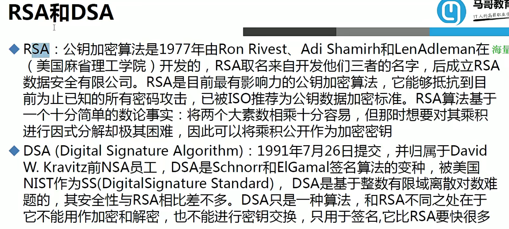

# 1 1.安全防护


## 1.1 1.对称加密算法


## 1.2 2.非对称加密算法




> 非对称算法虽然安全性高，但是效率低下，比如：
>
> DES：1G 加密1m 解密8m
>
> RSA：1G 加密1m 解密64H


```bash
# 非对称算法实例
gpg --gen-key # 按照提示生成密钥

# 查看公钥
gpg --list-keys
# 查看私钥
gpg --list-secret-keys
# 删除私钥
gpg --delete-secret-keys wangge
# 删除公钥
gpg --delete-key wangge

# 将密钥导出
gpg -a --export -o /data/magedu.pubkey

# 将公钥导出到别的主机
scp /data/magedu.pubkey root@192.168.19.137:/data/

# 导入公钥
gpg --import /data/magedu.pubkey 

# 使用magedu公钥加密文件1
gpg -e -r magedu 1

# 使用magedu私钥解密
gpg -o 1 -d /data/1.gpg 
```


## 1.3 3.单向散列(哈希)


> 综合使用


## 1.4 4.密钥交换


# 2 2.证书


## 2.1 1.OpenSSL


```bash
在 OpenSSL 中，-salt 选项用于对加密的数据添加一个随机生成的盐（salt）。盐是一个随机字符串，与待加密的数据一起参与加密运算，增加密码学的强度防止相同的明文密码产生相同的密文。

使用 -salt 选项，可以确保每次加密都会生成不同的密文，即使明文密码相同，因为每个加密操作都会使用独特的盐。
```


> `umask` 是一个 Unix/Linux 命令，用于设置文件创建的默认权限掩码（文件权限屏蔽值）。权限掩码决定了新创建文件的权限。具体来说，`umask` 命令用于从当前权限掩码中减去指定的权限位，来设置新创建文件的权限。
>
> 一般的用法是：`umask [新权限掩码]`
>
> 其中，`新权限掩码` 是八进制数字，用于指定需要从默认权限中删除的权限位。
>
> 默认情况下，新创建的文件权限是由 666 减去当前 umask 值所得。


## 2.2 2.建立私有CA


## 2.3 3.实验：建立一个私有CA，为用户颁发证书

### 2.3.1 1.建立CA

```bash
# 生成私钥
[root@test CA]# (umask 077;openssl genrsa -out private/cakey.pem 4096)

# 给自己签署证书
[root@test CA]# openssl req -new -x509 -key /etc/pki/CA/private/cakey.pem -out /etc/pki/CA/cacert.pem -days 3650 <<EOF
> CN
> beijing
> beijing
> magedu
> devops
> ca.magedu.com
> admin@magedu.com
> EOF

# 查看证书
[root@test CA]# openssl x509 -in cacert.pem -noout -text

# 
touch /etc/pki/CA/index.txt

# 
echo 0F > /etc/pki/CA/serial 
```


### 2.3.2 2.申请证书

```bash
# 
[root@cloud app]# openssl req -new -key app.key -out app.csr

# 发送到CA
scp app.csr root@192.168.19.136:/data

```


### 2.3.3 3.颁发证书

```bash
#
openssl ca -in /data/app.csr -out /etc/pki/CA/certs/app.crt -days 100
```


> 如果想要不一致，请修改/etc/pki/tls/openssl.cnf文件中的策略
>
> 默认相同的请求文件是无法生成多个证书的，如果想生成多个证书，修改/etc/pki/CA/index.txt.attr中为no


# 3 3.SSH


> 如果想在第一次连接其他主机时不询问yes or no，去客户端配置文件把StrictHostKeyChecking的值改为no

> 如果一个目标主机仅支持一个主机访问，那么如果其他主机想要访问该主机，就需要先进入支持访问的主机

```bash
# 例如：6主机想访问5主机,中间途经三台机器
ssh -t 192.168.37.7 ssh -t 192.168.37.101 ssh 192.168.37.5
```


```bash
[root@test ~]# ssh-keygen -t rsa
[root@test ~]# ssh-copy-id 192.168.19.137
```


## 3.1 1.ssh基于key的expect自动化脚本

```bash
#!/bin/bash
PASS=root
ssh-keygen -t rsa -P "" -f /root/.ssh/id_rsa &> /dev/null && echo "ssh key is created"
while read IP;do
expect << EOF
set timeout 200
spawn ssh-copy-id -i /root/.ssh/id_rsa.pub root@$IP
expect {
"yes/no" { send "yes\n";exp_continue }
"password" { send "$PASS\n" }
}
expect eof
EOF
echo $IP is ready
done < hosts.txt
```


## 3.2 2.SSH端口转发


## 3.3 3.SSH安全配置


> 1. `Port`：定义服务器监听的端口号，默认为 22。
> 2. `ListenAddress`：指定服务器监听的 IP 地址。默认情况下，服务器会监听全部可用的地址。
> 3. `PermitRootLogin`：指定是否允许 root 用户通过 SSH 登录
> 4. `PasswordAuthentication`：指定是否允许使用密码进行身份验证，默认为 yes。建议将其设置为 no，并使用 SSH 密钥进行身份验证，以提高安全性。
> 5. `AllowUsers`、`AllowGroups` 和 `DenyUsers`、`DenyGroups`：用于限制哪些用户或组可以通过 SSH 连接到服务器。可使用通配符来指定多个用户或组。
> 6. `PubkeyAuthentication`：指定是否允许使用公钥进行身份验证，默认为 yes。建议设置为 yes，并配置正确的用户公钥。
> 7. `Protocol`：指定 SSH 协议的版本，默认为 2。一般情况下，应使用最新版本的协议。
> 8. `LogLevel`：指定日志的详细程度，默认为 INFO。可以调整为 DEBUG 以获取更详细的日志信息。
> 9. `MaxAuthTries`：指定允许尝试身份验证的最大次数，默认为 6。可以根据需要进行调整，以增加安全性。
> 10. `PermitEmptyPasswords`：指定是否允许空密码进行身份验证，默认为 no。建议将其设置为 no，以增加安全性。
> 11. `TCPKeepAlive`：指定是否启用 TCP keepalive，默认为 yes。通常情况下建议保持默认设置。
> 12. `UseDNS`：是否把ip地址转换为域名，建议改成no
> 13. `GSSAPIAuthentication`：启用或禁用基于 GSSAPI（Generic Security Services Application Programming Interface）的身份验证，建议改成no
> 14. `LoginGraceTime`：输密码时的等待时间
> 15. `StrictModes`：检查.ssh文件的权限
> 16. `MaxSession`：限制通过 SSH 连接到服务器的并行会话数量。，默认为10
> 17. `ClientAliveInterval`：定义在服务器和客户端之间的连接断开之前发送的保持活动消息的时间间隔
> 18. `ClientAliveCountMax`：定义客户端没有响应服务器发送的保持活动消息的次数的最大值
> 19. `MaxStartups`：限制并发连接到服务器的数量。默认值为10:30:100。意思是超过30并发数就拒绝百分之30的连接，超过100就拒绝百分百
> 20. `GatewayPorts`：控制 SSH 端口转发的目标。默认情况下，`GatewayPorts` 的值被设置为 `no`，这意味着 SSH 端口转发只会绑定到本地接口上（即 `localhost` 或 `127.0.0.1`）。这样，只有本地的用户可以访问被转发的端口。


```bash
lastb显示最近失败的登录尝试记录。该命令读取并解析 /var/log/btmp 文件，该文件记录了系统上失败的登录尝试。
-w：以宽格式显示结果。
-i：显示登录失败尝试的 IP 地址。
-s <起始时间>：按指定的起始时间过滤结果。
-t <结束时间>：按指定的结束时间过滤结果。
-f <日志文件>：指定要读取的日志文件。
\$ lastb -s "2022-07-15 00:00" -t "2022-07-16 23:59"
```


# 4 4.sudo


