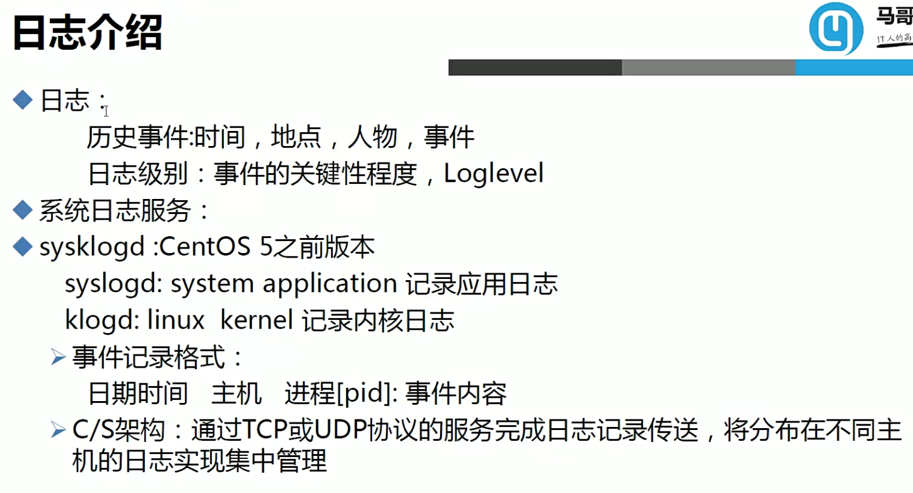
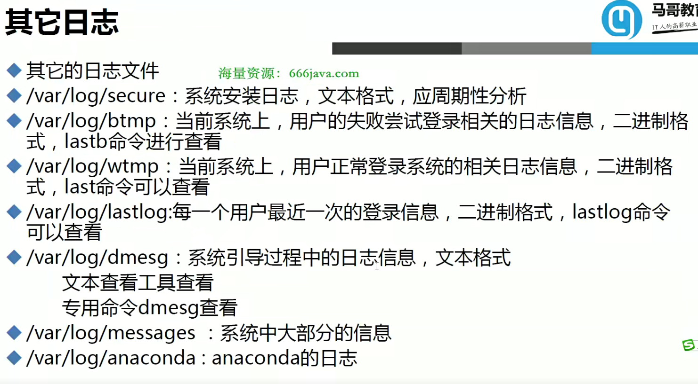
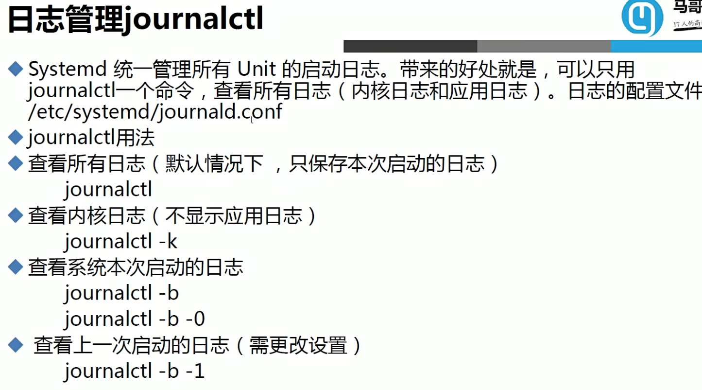
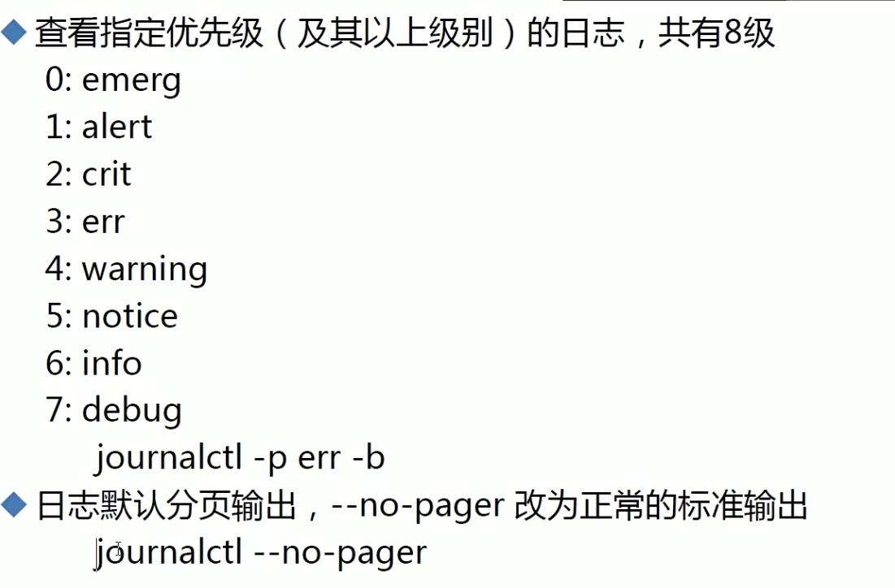
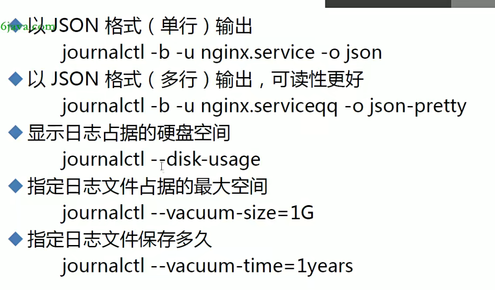

# Linux日志管理

## 1.日志




```bash
# 如果想要开启日志远程功能，需要开启以下两个配置，且在target中，一个@表示UDP协议，两个表示TCp协议

# Provides UDP syslog reception
#$ModLoad imudp
#$UDPServerRun 514

# Provides TCP syslog reception
#$ModLoad imtcp
#$InputTCPServerRun 514
```



### 1.journalctl








### 2.将日志存到数据库中


## 2.loganalyer
