# Linux网络基础

## 1 1.网络

网络是指将多个计算机和设备连接在一起，以便它们可以相互通信、共享资源和信息的系统。它是由通信链路、设备（例如计算机、交换机、路由器等）和协议组成的。

## 2 2.OSI模型的七层模型

1. 物理层(physical)
   * 二进制传输
   * 为启动、维护以及关闭物理链路定义了电气规范、机器规范、过程规范和功能规范
2. 数据链路层(data link)
   * 访问介质
   * 定义如何格式化数据以便进行传输以及如何控制对网络的访问
   * 支持错误检测
3. 网络层(network)
   * 数据传输
   * 路由数据包
   * 选择传递数据的最佳路径
   * 支持逻辑寻址和路径选择
4. 传输层(transport)
   * 端连接
   * 传输问题
   * 确保数据传输的可靠性
   * 建立、维护和终止虚拟电路
   * 通过错误检测和恢复
   * 信息流控制来保障可靠性
5. 会话层(session)
   * 主机间通信
   * 建立、管理和终止在应用程序之间的会话
6. 表示层(presention)
   * 数据表示
   * 确保接收系统可以读出该数据
   * 格式化数据
   * 构建数据
   * 协商用于应用层的数据传输语法
   * 提供加密
7. 应用层(application)
   * 网络进程访问应用层
   * 为应用程序进程(例如：电子邮件、文件传输和终端仿真)提供网络服务
   * 提供用户身份验证

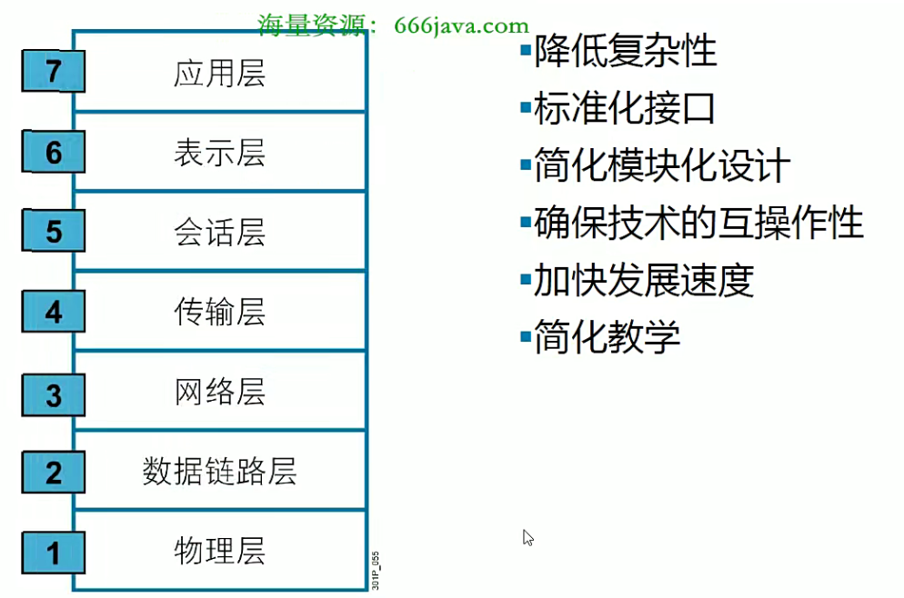

> PDU

## 3 3.三种通讯模式

单播（Unicast）是一种通信方式，用于将数据从一个发送方发送到一个特定的接收方。在单播通信中，数据通过指定接收方的唯一标识（如IP地址）进行传输，只有目标设备可以接收到这些数据。单播是最常见的通信方式，例如发送电子邮件或浏览网页时，数据被直接发送到特定的目标设备。

广播（Broadcast）是一种通信方式，用于将数据从一个发送方发送到网络中的所有设备。发送方将数据发送到一个特殊的广播地址（如IPv4中的255.255.255.255或IPv6中的ff02::1），然后所有在该网络上的设备都能接收到这些数据。广播常用于网络中的一些特定场景，如发送网络中的探测请求或广播警报消息。

组播（Multicast）是一种通信方式，用于将数据从一个发送方发送到一组特定的接收方。与广播不同，组播需要先确认接收方属于特定的组。发送方将数据发送到一个特殊的组播地址，只有加入该组的设备才能接收到这些数据。组播通信常用于流媒体、视频会议以及跨网络的分布式应用等场景，可以实现高效的多对多通信。

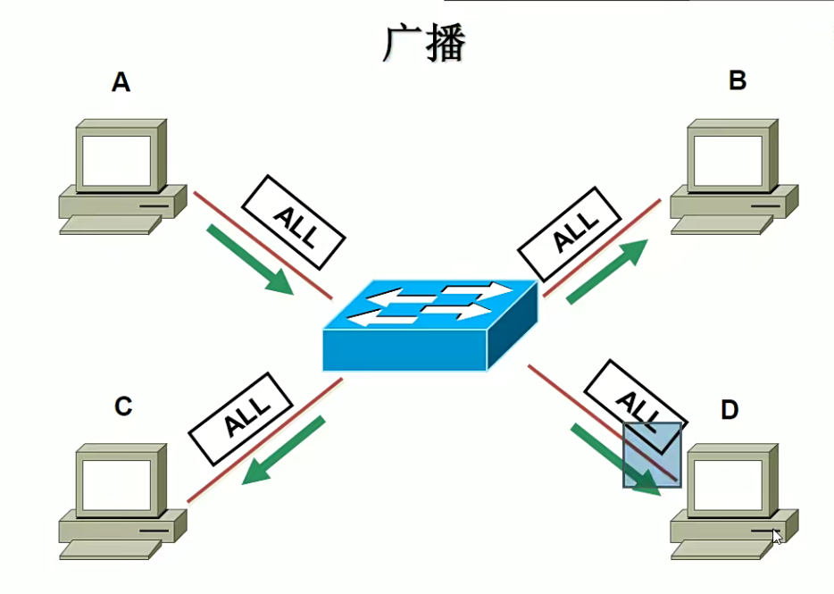

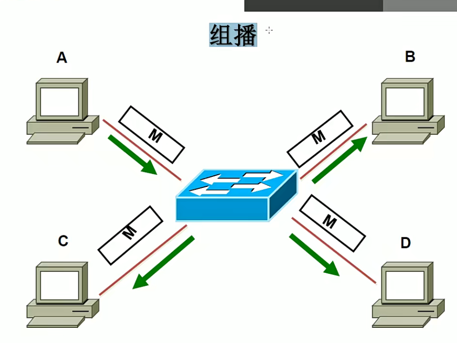

单工（Simplex）是一种通信模式，指的是在通信的两个节点之间，只有一个方向是通信的，数据只能单向传输。其中一个节点作为发送方，另一个节点作为接收方。例如，广播电台的广播传输就是单工通信，听众只能接收广播内容，无法向电台发送信息。

半双工（Half-Duplex）是一种通信模式，指的是在通信的两个节点之间，数据可以双向传输，但每次只能有一个节点发送数据，另一个节点只能接收数据。换句话说，通信的两个节点不能同时发送和接收数据。对于半双工通信，通信双方需要在发送和接收之间切换。例如，对讲机就是一种半双工通信，一方按下对讲机按钮后才能发送信息，而接收方需要等待发送方完成后才能发送自己的信息。

全双工（Full-Duplex）是一种通信模式，指的是在通信的两个节点之间，数据可以双向同时传输，即通信的两个节点可以同时发送和接收数据，无需切换。全双工通信允许双方同时进行双向通信，提供了更高的传输效率和更低的延迟。例如，普通的电话通信就是一种全双工通信，双方可以同时说话和听对方说话。

## 4 4.网络基础各种网络设备

### 4.1 1.局域网

* 局域网(Local Area Network)
  * 局域网（Local Area Network，LAN）是指在相对较小的地理范围内建立的一个用于连接计算机和其他网络设备的网络。它通常在一个办公室、学校、家庭或建筑物内部分布，用于内部通信和资源共享。

### 4.2 2.网络线缆

**广播的MAC地址全是1**

### 4.3 3.Hub集线器

### 4.4 4.分层架构

## 5 5.TCP/IP协议栈

### 5.1 1.TCP协议

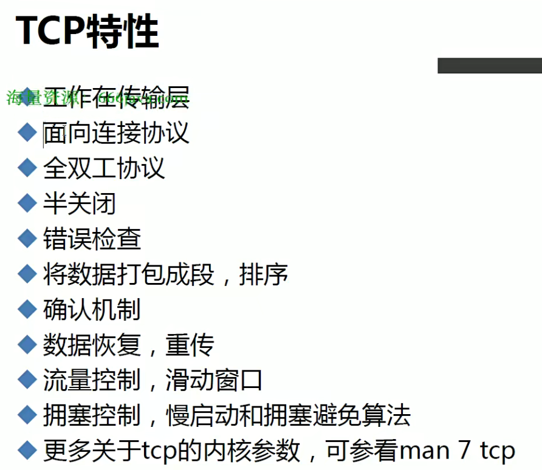

> 常用的服务所用的端口可以在`cat /etc/services` 查看

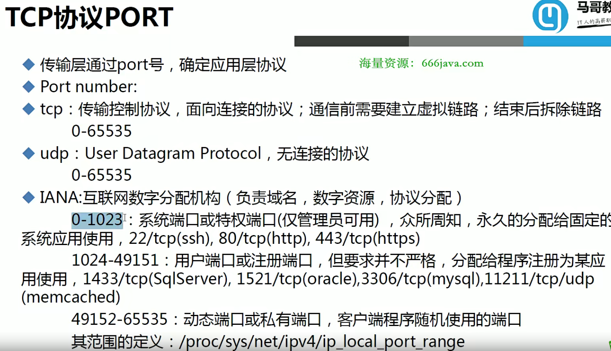

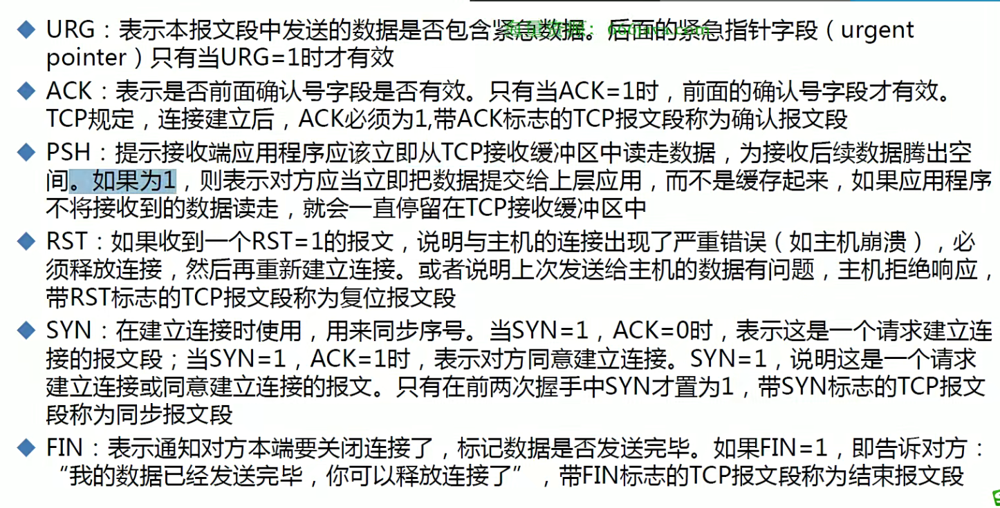

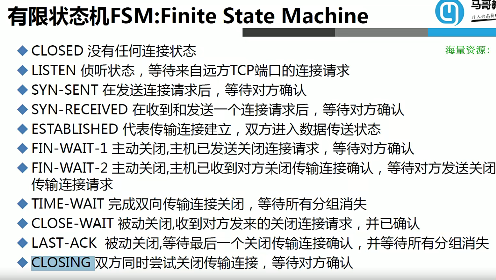

### 5.2 2.UDP协议

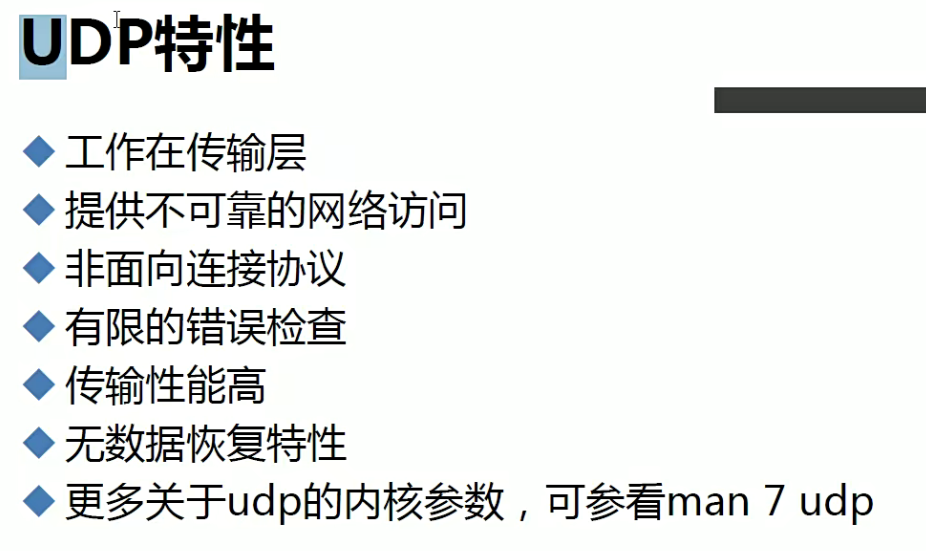

## 6 6.网络层

### 6.1 1.IP协议

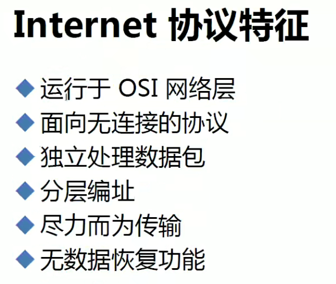

## 7 7.网络IP地址规划

> 0.0.0.0表示未知地址
>
> 127开头的表示回环地址
>
> 主机ID不能全是0也不能全是1
>
> 比如10.0.0.0表示10网络
>
> 10.255.255.255表示10广播
>
> A类：前8位网络ID，后24位是主机ID，第一位是0
>
> B类：前16位网络ID，后16位是主机ID，前两位是10
>
> C类：前24位网络ID，后8位是主机ID，前三位是110
>
> D类：多播
>
> 无类：网络ID任意位，主机ID任意位，使用子网掩码(netmask)标识网络ID
>
> CIDR表示法：无类域间路由(IP/网络ID位数)
>
> 网络ID=IP 与 netmask
>
> 判断主机是否在同一个网段：网络ID是否相同，使用自己的IP与network，再用对方的IP与自己的network，结果比较

划分子网：将一个大网(主机多)分隔成多个小网段(主机少)

子网数：2^网络ID向主机ID借的位数

合并子网：将多个子网合并成一个大网，也称为超网，主机ID向网络ID借位

## 8 8.网络配置管理

### 8.1 1.ip命令

### 8.2 2.ss命令

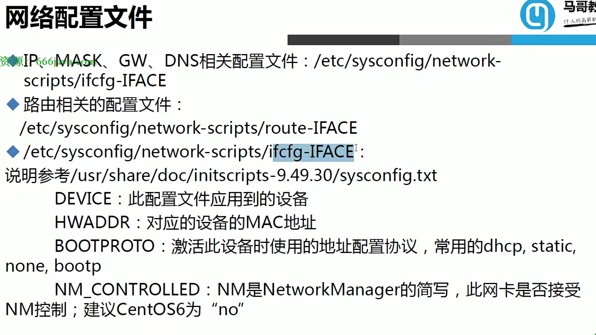

### 8.3 3.多网卡绑定

### 8.4 4.CentOS7网络管理

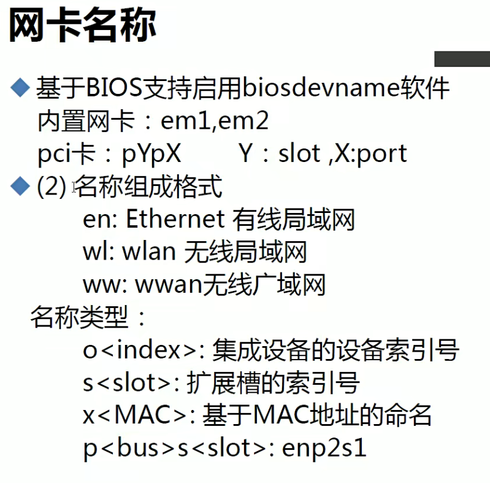

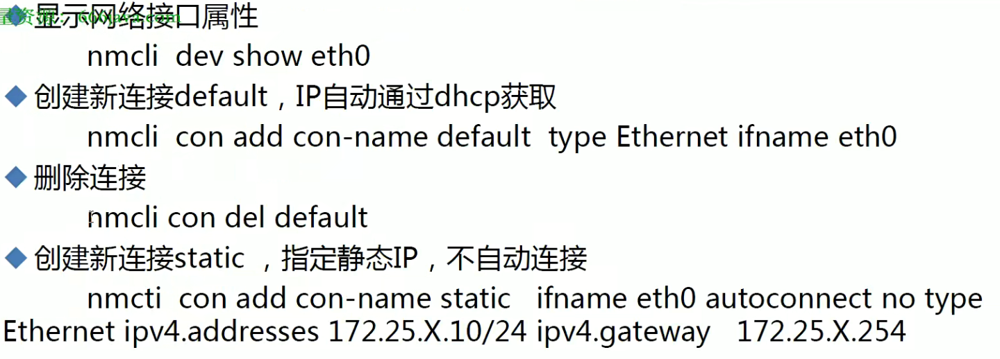

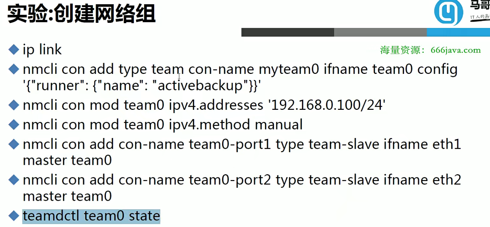

## 9 9.网桥

