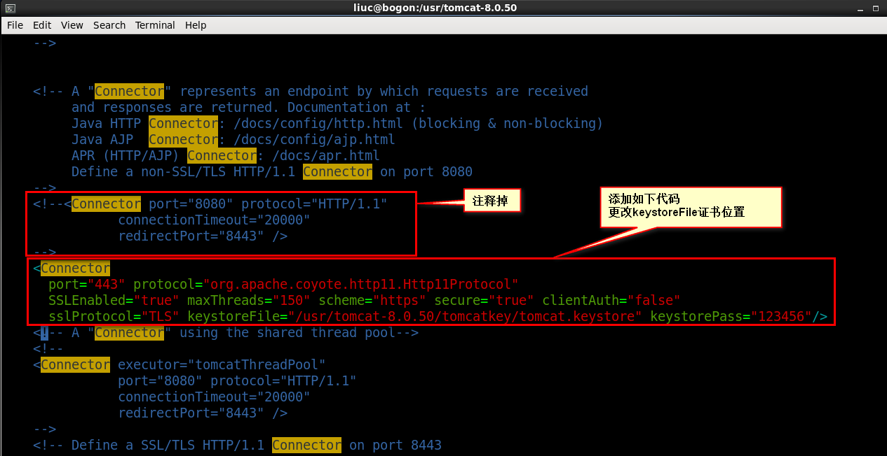

# Tomcat

## 修改网页目录

如果您想将网页目录设置为其他位置，您可以进行以下操作：

1. 创建您自己的应用程序文件夹，例如`yourapp`。
2. 将您的网页文件和其他资源文件放置在`yourapp`文件夹中。
3. 在server.xml文件中，找到`<Host>`元素，添加一个`<Context>`元素，并在`<Context>`元素中设置docBase属性和path属性。参考下面的示例：

xml

复制

```xml
<Host name="localhost" appBase="webapps">
  ...
  <Context docBase="/path/to/yourapp" path="/yourapp" />
  ...
</Host>
```

请将`/path/to/yourapp`替换为您实际的应用程序文件夹路径，将`/yourapp`替换为您希望访问该应用程序的URL路径。

1. 保存server.xml文件，并重新启动Tomcat服务器。

现在，您的应用程序的网页目录就已经设置为您指定的路径了。您可以通过浏览器访问Tomcat服务器上的URL路径来查看您的网页内容。例如，`http://localhost:8080/yourapp`。

## Tomcat指定JDK配置

如果系统默认的JDK版本是JDK 1.8.x，那么可以省略此步骤\
如果系统中需要部署多Tomcat，例如：Tomcat 7+JDK 7,Tomcat 8 + JDK 8共存那么则需要进行以下配置：

> 本机默认Java版本可以通过命令 java -version 查看

* 修改catalina.sh文件

```bash
#修改catalina.sh
vi /usr/tomcat/tomcat8/bin/catalina.sh

#增加如下配置：

export JAVA_HOME=/usr/java/jdk1.8.0_151
```

* 修改setclasspath.sh文件

```bash
#修改setclasspath.sh
vi /usr/tomcat/tomcat8/bin/setclasspath.sh

#增加如下配置：

export JAVA_HOME=/usr/java/jdk1.8.0_151
```

其中/usr/java/jdk1.8.0\_151，是因为ken.io测试的服务器JDK8在这个目录\
，实际部署时替换成所在服务器jdk目录即可

## Tomcat端口修改与防火墙配置

* 修改端口

非必要操作，如果需要部署多Tomcat，则需要修改端口

```bash
#修改server.xml
vi /usr/tomcat/tomcat8/conf/server.xml
```

找到如下行，Tomcat默认端口为8080，按照自己需求修改即可

```xml
<Connector port="8080" protocol="HTTP/1.1"
               connectionTimeout="20000"
               redirectPort="8443" />
```

## 将Tomcat配置为系统服务

```bash
#创建Tomcat8服务文件
vi /usr/lib/systemd/system/tomcat8.service

#tomcat8.service文件内容：

[Unit]
Description=Tomcat8
After=syslog.target network.target remote-fs.target nss-lookup.target

[Service]
Type=forking

ExecStart=/usr/tomcat/tomcat8/bin/startup.sh
ExecReload=/usr/tomcat/tomcat8/bin/startup.sh
ExecStop=/usr/tomcat/tomcat8/bin/shutdown.sh

[Install]
WantedBy=multi-user.target
```

## 修改HTTPS


