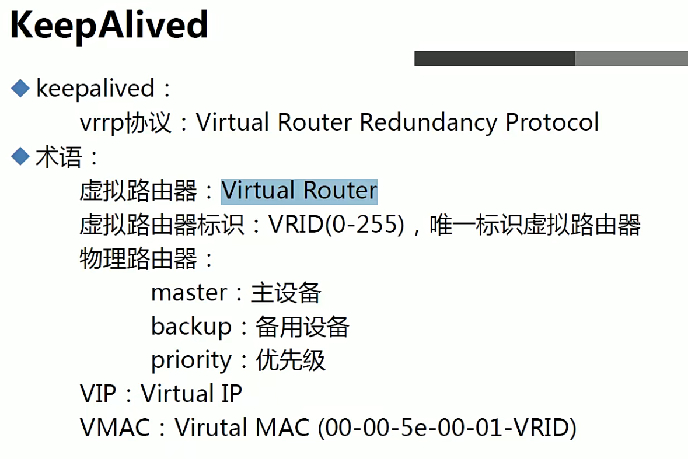
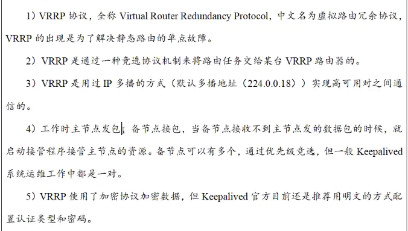

# 1.Keepalived介绍

Keepalived是一个基于VRRP协议来实现的LVS服务高可用方案，可以利用其来解决单点故障。Keepalived是集群管理中保证集群高可用的一个服务软件，其功能类似于heartbeat，用来防止**单点故障**。

**VRRP**是Virtual Router Redundancy Protocol(**虚拟路由冗余协议**)的缩写，VRRP出现的目的就是为了解决静态路由单点故障问题的，它能保证当个别节点宕机时，整个网络可以不间断的运行

高可用使用原则：**能用负载均衡就不用高可用**，因为高可用会浪费一台机器




- keepalived：
  - ip，辅助ip
  - 配置文件：/etc/keepalived/keepalived.conf
  - 没有数据流动的高可用对之间
  - 如果有数据流动，自行解决

- keepalived服务的三个重要功能
  1. 管理LVS负载均衡
  2. 对LVS节点做健康检查(基于端口和URL)
  3. VRRP高可用功能(failover)


- VRRP协议



- keepalived服务工作原理


# 2.Keepalived使用

- 安装Keepalived：yum install -y keepalived


## 1.Keepalived配置文件

配置文件用！进行注释

- 全局定义(Global definitions)部分
  - 这部分主要用来设置keepalived的故障通知机制和Router ID标识。

```bash
! Configuration File for keepalived

global_defs {
   router_id LVS_DEVEL  # 路由器标识
   script_user $script_user # 脚本执行用户
}
```

- VRRP实例定义区块(VRRP instance)部分
  - 这部分主要用来定义具体服务的实例配置，包括Keepalived主备状态、接口、优先级、认证方式和IP信息等

```bash
vrrp_instance VI_1 { # 指定VRRP实例名称
    state MASTER     # 指定状态
    interface eth0	 # 指定用于VRRp的网络接口
    virtual_router_id 51  # 指定虚拟路由ID
    priority 100     # 指定优先级，越大越高。主要比备大，建议大50
    advert_int 1     # 指定广告间隔以s为单位
    authentication {    # 指定身份验证和密码
        auth_type PASS
        auth_pass 1111
    }
    virtual_ipaddress {  # 指定此实例的虚拟ip地址
        192.168.200.16
        192.168.200.17
        192.168.200.18
    }
    nopreempt|preempt # 工作模式，nopreempt表示工作在非抢占模式，默认是抢占模式 preempt,nopreempt只能用在backup上，设置了非抢占后，如果主节点没有故障，都不会切换，服务失败也不行
    preempt_delay 300 # 如果是抢占默认则可以设置等多久再抢占，默认5分钟
}

# 一个配置文件可以存在多个实例，且主有的实例，备也要有
# 状态只能有MASTER和BACKUP
# 主备的虚拟路由ID必须一致且在一个配置文件中唯一
# 权限认证有PAA和AH两种，官方推荐PASS。验证密码为明文方式，最好长度不超过8个字符，建议使用4位，主备要使用相同的密码才能通信
# 虚拟ip可以配置多个，且最好指定子网掩码和网络接口。否则，默认为32位掩码
# 192.168.200.16 dev eth0 label eth0:3
```

要为Keepalived配置日志，可以按照以下步骤进行操作：

1. 打开Keepalived的配置文件，通常位于`/etc/keepalived/keepalived.conf`。

2. 在配置文件中找到名为`global_defs`的部分。

3. 在`global_defs`部分中添加以下行来配置日志：

   ```plaintext
   global_defs {
       log_file /var/log/keepalived.log  # 指定日志文件路径和名称
       log_stdout off  # 禁止将日志输出到标准输出流
       log_syslog on   # 将日志输出到syslog
       debug_netlink off  # 禁止输出Netlink调试信息
       debug_mcast off    # 禁止输出多播调试信息
   }
   ```
   
   可以根据需求调整日志文件路径和名称。
   
4. 保存并关闭配置文件。

5. 重新启动Keepalived服务，以使配置生效。可以使用以下命令：

   ```plaintext
   sudo systemctl restart keepalived
   ```

配置完成后，Keepalived将开始将其操作和状态信息记录到指定的日志文件中。你可以使用`tail`命令来监视日志文件的更新，例如：

```plaintext
tail -f /var/log/keepalived.log
```

根据具体需要，您还可以根据日志文件的大小或时间进行轮转，以避免日志文件过大。这可以通过设置日志轮转规则来实现，具体方式取决于您使用的日志管理工具（如logrotate）。

请注意，配置日志功能可以帮助您跟踪和调试Keepalived的运行情况，因此建议您及时检查和分析日志文件以获取有价值的信息。


## 2.双主配置

要配置双主（双活）模式的Keepalived，请按照以下步骤进行操作：

1. 安装Keepalived：在两台服务器上安装Keepalived软件包。可以使用适合您Linux发行版的包管理工具来进行安装，例如使用以下命令：

   plaintext

   复制

   ```plaintext
   sudo apt-get install keepalived   # Debian/Ubuntu
   sudo yum install keepalived       # CentOS/RHEL
   ```

2. 配置Keepalived：在两台服务器上编辑Keepalived的配置文件`/etc/keepalived/keepalived.conf`。以下是一个简单示例的配置文件来配置双主模式：

   ```bash
   global_defs {
      router_id LVS_DEVEL
   }
   
   vrrp_instance VI_1 {
       state MASTER
       interface eth0
       virtual_router_id 51
       priority 101
       advert_int 1
       authentication {
           auth_type PASS
           auth_pass 1111
       }
       virtual_ipaddress {
           192.168.1.3/24 dev eth0 label eth0:1
           192.168.1.4/24 dev eth0 label eth0:2
       }
   }
   
   vrrp_instance VI_2 {
       state MASTER
       interface eth0
       virtual_router_id 52
       priority 101
       advert_int 1
       authentication {
           auth_type PASS
           auth_pass 1111
       }
       virtual_ipaddress {
           192.168.1.5/24 dev eth0 label eth0:3
           192.168.1.6/24 dev eth0 label eth0:4
       }
   }
   ```
   
   请根据实际情况修改配置文件。确保将`your_password`替换为认证密码，并根据需要定义自定义脚本路径。
   
3. 启动Keepalived：在两台服务器上启动Keepalived服务，并确保在系统重新启动后自动启动。运行以下命令：

   ```plaintext
   sudo systemctl start keepalived
   sudo systemctl enable keepalived

配置完成后，Keepalived会在两台服务器之间使用VRRP协议维护一个虚拟IP地址（192.168.1.100）。如果一台服务器发生故障，另一台服务器将接管虚拟IP地址并继续提供服务。

请确保在双主模式下，在两台服务器之间共享的资源（如数据库）是可访问和同步的，并且任何与双主模式相关的应用程序配置和同步也得到正确设置和管理。

使用Keepalived实现双主配置具有以下好处：

1. 高可用性：双主配置使得两个主机都能够提供服务，从而提高了系统的可用性。如果其中一个主机发生故障，Keepalived可以快速地切换到另一个主机上，确保服务的连续性。
2. 负载均衡：通过配置虚拟IP地址，双主配置可以实现负载均衡。当多个客户端请求访问虚拟IP时，Keepalived会将请求分发到当前处于活动状态的主机上，从而实现请求的均衡分配。
3. 故障切换：如果活动主机发生故障，Keepalived能够自动将服务切换到备份主机上，无需手动干预。这种切换是无缝的，对于客户端而言几乎是无感知的。
4. 快速恢复：当故障发生并且切换到备份主机时，Keepalived提供了快速恢复的功能。一旦原始主机恢复正常，Keepalived可以将服务迁回原始主机，这样可以保持正常的业务流程。

总之，Keepalived的双主配置能够提供高可用性、负载均衡和快速恢复等优势，可以帮助确保系统稳定运行和持续可用性。


## 3.Keepalived高可用服务器对裂脑问题

- 什么是裂脑？

由于某些原因，导致两台高可用服务器对在指定时间内，无法检测到对方的心跳信息，各自取得资源及服务的所有权。而此时的两台高可用服务器对都还活着并在正常运行，这样就会导致同一个IP或服务在两端同时存在而发送冲突，最严重的是两台主机占用同一个VIP地址，当用户写入数据时可能会分别写入到两端，这可能会导致服务器两端的数据不一致或造成数据丢失，这种情况就会被称为裂脑

- 导致裂脑发生的原因
  - 高可用服务器对之间心跳线链路孤战，导致无法正常通信
    - 心跳线坏了
    - 网卡及相关驱动坏了，IP配置及冲突问题(网卡直连)
    - 心跳线间连接的设备故障(网卡及交换机)
    - 仲裁的机器除问题(采用仲裁方案)
  - 高可用服务器对上开启了iptables防火墙阻挡了心跳信息传输
  - 高可用服务器对上心跳网卡地址等信息配置不正确，导致发送心跳失败
  - 其他服务配置不当等原因，如心跳方式不同，心跳广播冲突，软件BUG等

> 如果keepalived配置里同一VRRP实例如果virtual_router_id参数两端配置不一致，也会导致裂脑问题发生
>


## 4.解决高可用服务知识针对物理服务器问题

keepalived高可用服务知识针对物理服务器，但是当服务器不宕机，nginx负载服务宕机。默认VIP是不漂移的。

可以使用Keepalived的配置文件参数触发写好的检测服务脚本

- 先写监测服务脚本


- 编写配置文件

  ```bash
  global_defs {
     router_id 192.168.19.131
     script_user $script_user
  }
  
  vrrp_script chk_nginx {  # 配置执行脚本
      script "/etc/keepalived/check_port.sh 7443"
      interval 2
      weight -20
  }
  # 如果脚本执行结果为0，并且weight配置的值大于0，则优先级相应的增加
  # 如果脚本执行结果非0，并且weight配置的值小于0，则优先级相应的减少
  
  vrrp_instance VI_1 {
      state MASTER
      interface ens33
      virtual_router_id 251
      priority 100
      nopreempt
       # 监控本机上的哪个网卡，网卡一旦故障则需要把VIP转移出去
      track_interface {
          eth0
          ens33
      }
      authentication {
          auth_type PASS
          auth_pass 11111111
      }
      track_script {  # 调用脚本
           chk_nginx
      }
      virtual_ipaddress {
          192.168.19.10
      }
      unicast_src_ip 192.168.131.135  # 本地IP地址
      unicast_peer {
          192.168.131.134  # 组内其他ip地址
          192.168.131.136  # 组内其他ip地址
      }  # 指定是因为服务器网络环境中，路由交换层禁用了ARP的广播限制
  }
  
  


