# 文件共享服务

## 1.文件共享

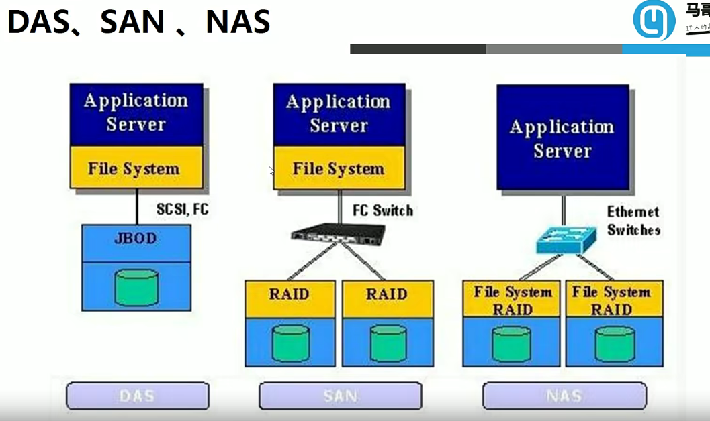


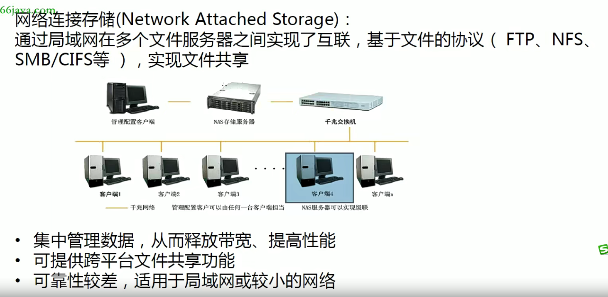


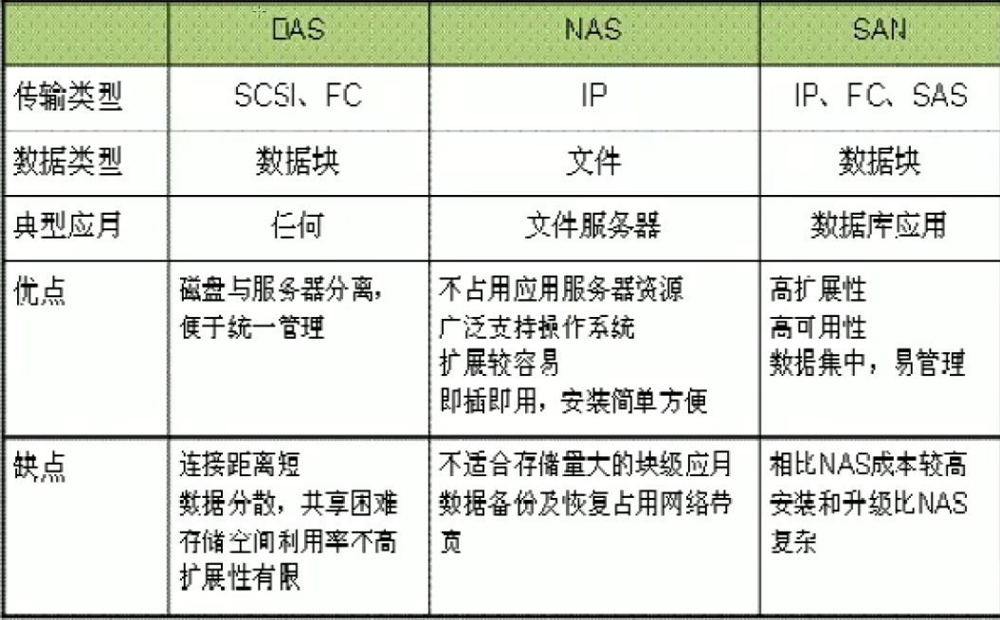

## 2.FTP


## 3.NFS

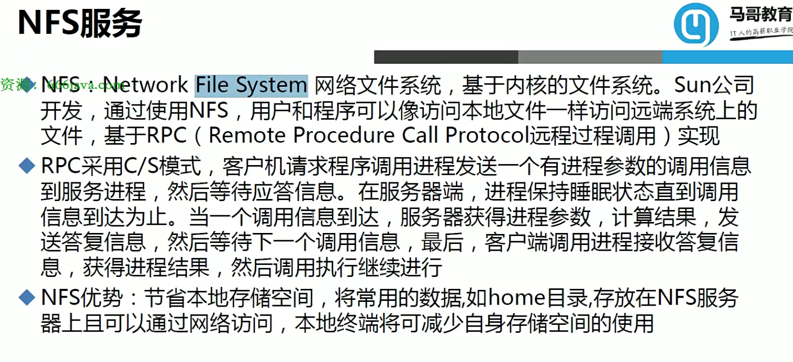


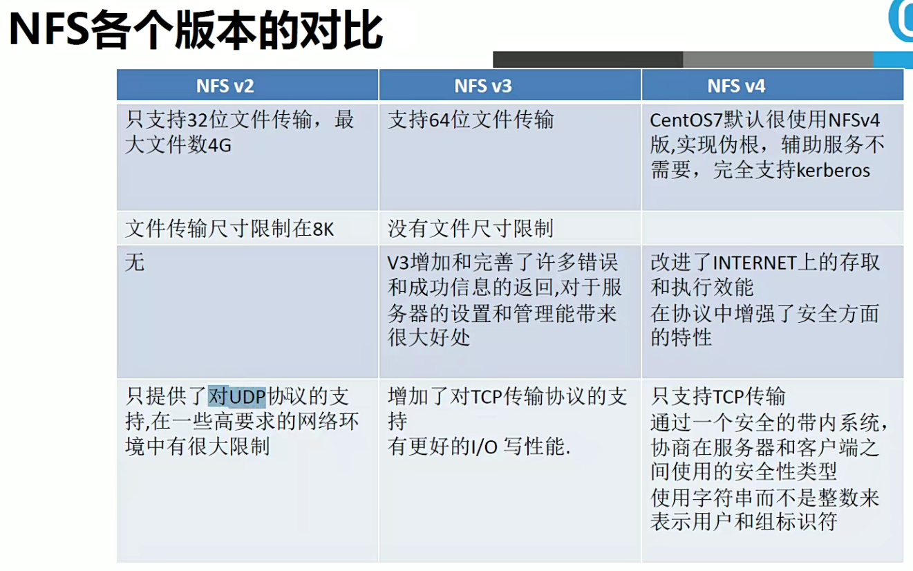


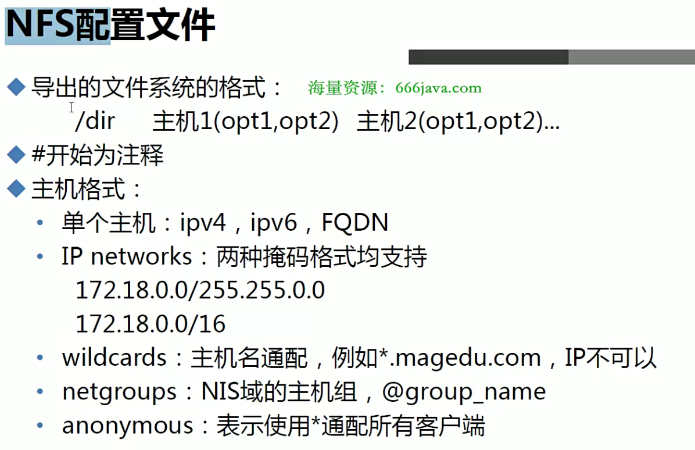

```bash
# 写完配置文件后不会立即生效
exportfs -r  # 生效配置
exportfs -au # 停止所有服务
exportsfs -v # 查看共享服务
```


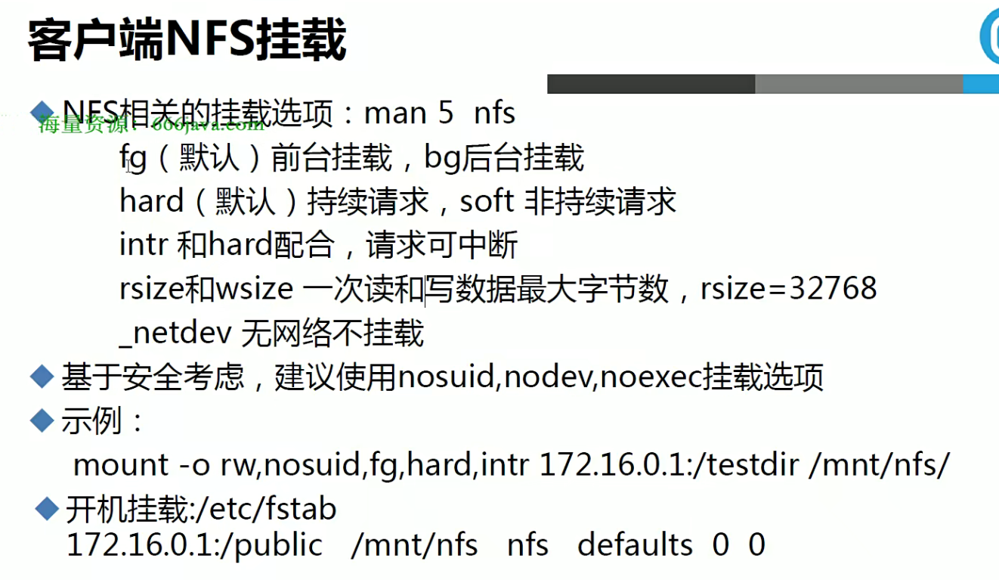

```bash
# 在客户端查看共享目录
showmount -e IP
```


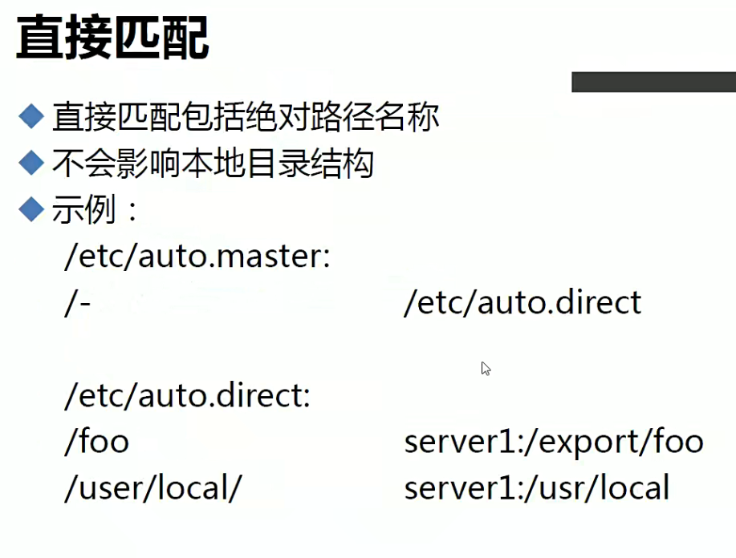

> 当你知道NFS服务器的IP后，如果想临时访问，可以直接访问`/net/IP`，就可以直接临时访问NFS共享文件

## 4.inotify

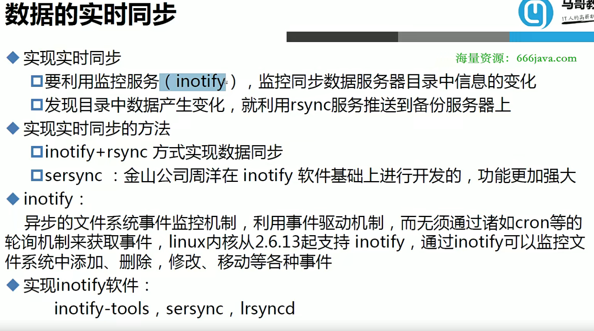


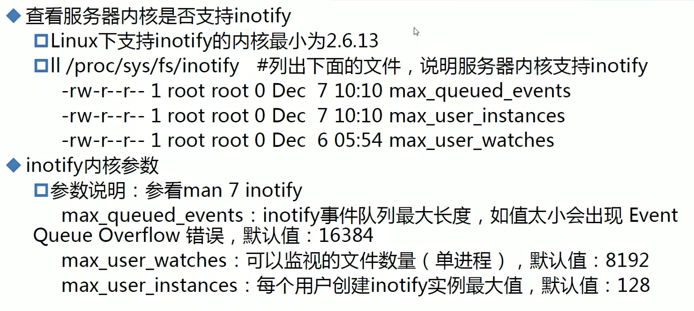

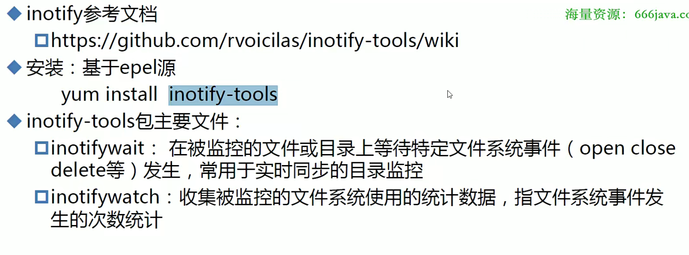


## 5.rsync


## 5.inotify+rsync

```bash
##!/bin/bash
SRC='/data'
DEST='rsyncuer@192.168.19.136::backup'
inotifywait -mrq --timefmt '%Y-%m-%d %H:%M' --format '$T %w %f' -e create,delete,moved_to,close_write,attrib ${SRC} | while read DATE TIME DIR FILE;do
        FILEPATH=${DIR}${FILE}
        rsync -az --delete --password-file=/etc/rsync.pass $SRC $DEST && echo "At ${TIME} on ${DATE},file $FILEPATH was backuped up via rsync" >> /var/log/changelist.log
done
```
