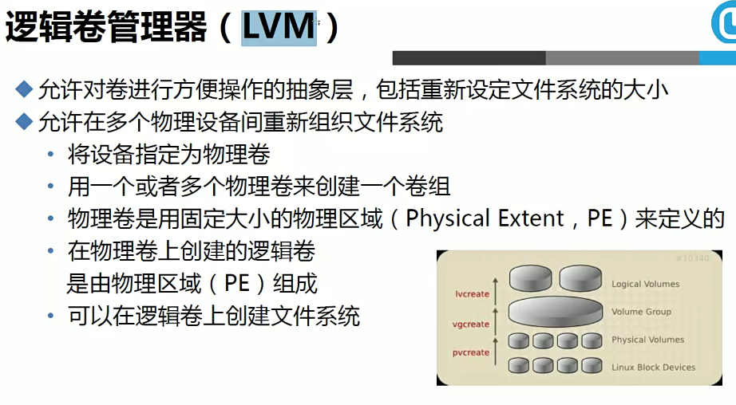

# 1.磁盘分区、文件、文件系统

一般来说，一块物理磁盘只有一个分区。但一个磁盘分区只能安装一个操作系统，所以人们使用**分区编辑器**在磁盘上划分几个逻辑部分。每个逻辑部分称为一个分区

每个磁盘分区都有很多的数据，**文件**把这些数据分隔为一个个独立的个体，管理这些文件的就是文件系统。每个磁盘分区只能有一个文件系统，每个文件系统独立管理本分区的文件

文件系统是操作系统用于明确磁盘或分区上的文件和数据结构；即在磁盘上组织文件的方法。Linux支持很多种类型的文件系统，而每种文件系统都有属于自己的结构，而Linux为统一访问这些不同的文件系统提供了一个通用的接口，即**VFS**（Virtual Filesystem Switch）称为虚拟文件系统或虚拟文件系统转换，是一个内核软件层，在具体的文件系统之上抽象的一层，用来处理与Posix文件系统相关的所有调用，表现为能够给各种文件系统提供一个通用的接口，使上层的应用程序能够使用通用的接口访问不同文件系统，同时也为不同文件系统的通信提供了媒介

文件包括**元数据**(metadata)和**数据**(data)。元数据包含文件类型、文件名、权限、链接数、属主和属组的ID、时间戳、所占据的磁盘块等信息。数据包含了文件的实际内容。


# 2.元数据、inode、硬链接、软链接、目录

文件的元数据保存在文件系统中的**inode(在FAT系统中时FAT表)**和**目录**中。inode和目录是单独保存的，在磁盘的**特定位置**。

每个inode节点的大小，一般是**128字节**或**256字节**。inode节点的总数，在格式化时就给定，一般是每1KB或每2KB就设置一个inode。假定在一块1GB的硬盘中，每个inode节点的大小为128字节，每1KB就设置一个inode，那么inode table的大小就会达到128MB，占整块硬盘的12.8%。一旦inode用完就无法创建文件

每个inode都有一个号码，操作系统用inode号码来识别不同的文件。

一般情况下，文件名和inode号码是”**一一对应**”关系，每个inode号码对应一个文件名。但是，Unix/Linux系统允许，**多个文件名指向同一个inode号码**。

这意味着，可以用不同的文件名访问同样的内容；对文件内容进行修改，会影响到所有文件名；但是，删除一个文件名，不影响另一个文件名的访问。这种情况就被称为”**硬链接**”（hard link）。

**硬链接是通过索引节点进行的链接。在Linux中，多个文件指向同一个索引节点是允许的，像这样的链接就是硬链接。硬链接只能在同一文件系统中的文件之间进行链接，不能对目录进行创建。如果删除硬链接对应的源文件，则硬链接文件仍然存在，而且保存了原有的内容，这样可以起到防止因为误操作而错误删除文件的作用。由于硬链接是有着相同 inode 号仅文件名不同的文件，因此，删除一个硬链接文件并不影响其他有相同 inode 号的文件。**

除了硬链接以外，还有一种特殊情况。

文件A和文件B的inode号码虽然不一样，但是文件A的内容是文件B的路径。读取文件A时，系统会自动将访问者导向文件B。因此，无论打开哪一个文件，最终读取的都是文件B。这时，文件A就称为文件B的”**软链接**”（soft link）或者“**符号链接**”（symbolic link）。

这意味着，文件A**依赖于**文件B而存在，如果删除了文件B，打开文件A就会报错：”No such file or directory”。这是软链接与硬链接最大的不同：文件A指向文件B的文件名，而不是文件B的inode号码，文件B的inode”链接数”不会因此发生变化。

**软链接（也叫符号链接）与硬链接不同，文件用户数据块中存放的内容是另一文件的路径名的指向。软链接就是一个普通文件，只是数据块内容有点特殊。软链接可对文件或目录创建。**

**软链接主要应用于以下两个方面：一是方便管理，例如可以把一个复杂路径下的文件链接到一个简单路径下方便用户访问；另一方面就是解决文件系统磁盘空间不足的情况。例如某个文件文件系统空间已经用完了，但是现在必须在该文件系统下创建一个新的目录并存储大量的文件，那么可以把另一个剩余空间较多的文件系统中的目录链接到该文件系统中，这样就可以很好的解决空间不足问题。删除软链接并不影响被指向的文件，但若被指向的原文件被删除，则相关软连接就变成了死链接。**

Unix/Linux系统中，**目录**（directory）也是一种文件。打开目录，实际上就是打开目录文件。

目录文件的结构非常简单，就是**一系列目录项（dirent）的列表**。每个目录项，由两部分组成：**所包含文件的文件名，以及该文件名对应的inode号码**。

目录和inode是两个不同的概念，但它们在文件系统中都起到重要作用。**目录**用来存储文件名和文件属性信息，而**inode**则用来记录磁盘上文件的存储位置信息及其他元数据。两者结合起来，可以让操作系统快速定位和访问文件。

例如， 当我们访问一个文件时，先进入目录，目录中有相应的目录项，目录项中有对应的文件名和 inode 号码，通过里面的指针指向相应的数据块，这样就访问到文件的内容了。


# 3.Block、Superblock

在计算机存储中，**块**（block）是文件存取的**最小单位**。硬盘的最小存储单位叫做**扇区**（Sector），每个扇区存储512字节。操作系统读取硬盘的时候，不会一个个扇区地读取，这样效率太低，而是一次性连续读取多个扇区，即一次性读取一个块（block）。这种由多个扇区组成的块，最常见的大小是4KB，即连续八个sector组成一个block。

块的大小是**固定的**，但是是**可变的**，也就是你在格式化分区的时候可以指定一个固定大小的块，但这一般是不必要的，因为大多数文件系统都有一个默认的数据块大小。

数据块的大小会影响文件系统的性能。如果数据块的大小较小，那么存储大文件时需要更多的数据块，这会增加磁盘寻道次数和文件系统管理开销，降低文件系统的性能。但是，如果数据块的大小较大，那么存储小文件时会浪费磁盘空间，降低存储效率。

因此，选择合适的数据块大小是很重要的。通常情况下，文件系统会选择一个折中的数据块大小，以平衡性能和存储效率。例如，EXT4文件系统默认使用4KB的数据块大小。

在磁盘上，一个文件的数据块可能是连续的，也可能是不连续的。如果文件是一次性写入磁盘且磁盘上有足够的连续空间，那么文件的数据块可能是连续的。但是，如果文件是分多次写入磁盘或磁盘上没有足够的连续空间，那么文件的数据块可能是不连续的。

当文件的数据块不连续时，称为文件碎片。文件碎片会降低文件系统的性能，因为读取文件时需要多次寻道。大多数文件系统都提供了磁盘碎片整理工具来整理文件碎片，将文件的数据块重新排列成连续的。但大多现代文件系统都设计了有效的空间策略来减少文件碎片的产生，所以一般不需要磁盘碎片整理工具

**Superblock** 是文件系统中的一个重要数据结构，它包含了文件系统的元数据，用于描述文件系统的属性。例如，在 Linux 系统中，superblock 存储了文件系统的类型、大小、状态、inode 和 block 的数量等信息。它通常位于文件系统的开头，例如在 ext 文件系统中，superblock 位于分区开头往后 1024 字节处。

Superblock 是文件系统正常运行的关键，因为它包含了文件系统的基本信息。如果 superblock 损坏，文件系统可能无法挂载。为了防止这种情况发生，许多文件系统（如 ext 文件系统）会在磁盘上存储多个 superblock 的备份。如果主 superblock 损坏，可以使用备份 superblock 来恢复文件系统。


# 4.磁盘存储过程

文件系统在格式化的时候会创建两种位图：**块位图**和**inode位图**。只用0和1来标识是否使用

当你在Linux文件系统中**创建一个新文件**时，系统会在inode位图中查找一个未使用的inode，并将其分配给新文件。同时，系统也会在块位图中查找一个或多个未使用的数据块，并将它们分配给新文件用于存储数据。在这个过程中，系统会更新inode位图和块位图，以记录inode和数据块的使用情况。

当你**删除一个文件**时，在inode位图和块位图中的相应位置上置0，以表示这些inode和数据块已经可用，并删除对应的目录项。

使用块位图和inode位图可以帮助文件系统**快速地查找**可用的数据块和inode。这样，当你创建新文件或需要为现有文件分配更多的存储空间时，系统可以快速地找到可用的数据块和inode，从而提高文件系统的**性能**。

此外，这两个位图还可以帮助文件系统检测磁盘错误。例如，如果一个数据块在块位图中被标记为已使用，但实际上并没有被任何文件使用，那么这可能表明磁盘上存在错误。文件系统可以使用这些信息来检测和修复磁盘错误。

如果你对一个inode创建了多个硬链接，那么你删除一个硬链接就会使文件元数据中的链接数减一，只有链接数为0才会删除对应的文件


# 5.Linux支持的文件系统

- Linux传统文件系统：ext2、ext3、ext4、reiserfs、xfs、jfs
- 光盘文件系统：iso9660
- 集群文件系统：GFS2、OCFS2
- 网络文件系统：CFS、CIFS


> ext2、ext3区别

ext2：不支持日志

ext3：支持日志

对于Linux来说，如果在存储文件时突然断电，再重启时修复的时间会很长，需要遍历所有文件。所以就引入了日志，存入数据时先把文件元数据存入日志中，当文件数据全部存入时再把元数据迁入到inode中，如果此时断电重启，修复时只需要修复日志中存在的文件即可。但是日志的应用增加了系统开销，对于大量写入的系统会极大减低系统性能，所有对于不需要保证数据完整性的大量写入的系统来说，不选择日志可能更好一点

# 6.格式化分区


在 Linux 系统中，磁盘设备文件通常位于 `/dev` 目录下。不同类型的磁盘设备有不同的命名规则：

- IDE 磁盘：IDE 磁盘设备文件名以 `hd` 开头，后面跟一个字母来表示磁盘编号。例如，第一个 IDE 磁盘的设备文件名为 `/dev/hda`，第二个 IDE 磁盘的设备文件名为 `/dev/hdb`。
- SCSI/SATA/USB 磁盘：SCSI、SATA 和 USB 磁盘设备文件名以 `sd` 开头，后面跟一个字母来表示磁盘编号。例如，第一个 SCSI/SATA/USB 磁盘的设备文件名为 `/dev/sda`，第二个 SCSI/SATA/USB 磁盘的设备文件名为 `/dev/sdb`。

磁盘分区也有相应的设备文件。分区设备文件的命名规则与磁盘设备文件类似，只是在磁盘设备文件名的基础上加上了分区编号。例如，第一个 SCSI/SATA/USB 磁盘的第一个分区的设备文件名为 `/dev/sda1`，第二个分区的设备文件名为 `/dev/sda2`。


## 6.1.磁盘分区

- 为什么分区？
  - 优化I/O性能
  - 实现磁盘空间配额限制
  - 提高修复速度
  - 隔离系统和程序
  - 安装多个OS
  - 采用不同文件系统

- 分区有两种方式：MBR/GPT
- MBR：Master Boot Record，1982年，使用32位表示扇区数，分区不超过2T


- GPT分区：GUID(Globals Unique Identifiers)partition table支持128个分区，使用64位，支持8Z(512byte/block)和64Z(4096Byte/block)

  

  

  

- 创建分区使用：
  - fdisk：MBR
  - gdisk：GPT
  - parted：高级分区操作，**所有操作都是实时生效的**，小心使用


### 1.MBR分区

- 查看磁盘分区表：fdisk命令

>  fdisk [选项] <磁盘>    更改分区表
>  fdisk [选项] -l <磁盘> 列出分区表
>  fdisk -s <分区>        给出分区大小(块数)
>
> 选项：
>  -b <大小>             扇区大小(512、1024、2048或4096)
>  -c[=<模式>]           兼容模式：“dos”或“nondos”(默认)
>  -h                    打印此帮助文本
>  -u[=<单位>]           显示单位：“cylinders”(柱面)或“sectors”(扇区，默认)
>  -v                    打印程序版本
>  -C <数字>             指定柱面数
>  -H <数字>             指定磁头数
>  -S <数字>             指定每个磁道的扇区数

- fdisk更改分区表的常用命令


- 重读分区表信息：partprobe <磁盘>
- 查看是否已经识别分区：cat /proc/partitions 


### 2.GPT分区

使用上跟fdisk类似


## 6.2.创建文件系统


- 对指定的设备创建文件系统
  - mkfs -t fs_type /dev/device

- mkfs 已经成为 mke2fs 的包装器，mkfs 命令调用 mke2fs 命令并将您指定的选项传递给它

  - mke2fs

    - -t：指定创建的文件系统类型

    - **-L** label：创建文件系统时指定卷标

    - **-j**：创建带有日志功能的ext3/ext4文件系统

      ```bash
      mke2fs -j /dev/sdb1
      ```

    - **-b** BLK_SIZE  [1024 2048 4096]：指定块大小，默认4096

      ```bash
      mke2fs -b 2048 /dev/sdb1
      ```

    - -v：显示详细信息

    - -r：指定文件系统修订级别。默认为1

    - -O：指定启用的文件系统功能，可以指定多个功能，以逗号分隔

    - -N：指定文件系统中inode的数量

    - -m：指定位超级用户保留的空间百分比，默认为5%

      ```bash
      mke2fs -m 10 /dev/sdb1
      ```

    - -l：从指定文件中读取坏块列表

      ```bash
      mke2fs -l badblocks.txt /dev/sdb1
      ```

    - -i：指定每个inode所占用字节数。默认值取决于块大小,不能小于磁盘块大小

      ```bash
      mke2fs -i 8192 /dev/sdb1
      ```

- 查看或修改设备label
  - e2label  /dev/device [LABEL]

- 查看块设备属性
  - blkid [/dev/device]
- tune2fs [option] DEVICE：调整ext文件系统参数
  - -l：查看设备超级块的内容
  - -j：向文件系统添加 ext3 日志
  - -m：设置文件系统的百分比
  - -c：设置最大挂载次数到达多少后检查
  - -i [d|m|y]：设置最大时间后检查
  - -o：设定文件系统默认挂载选项
- 查看每个块的信息
  - dumpe2fs DEVICE
  - -h=tune2fs -l


## 6.3.挂载

- 挂载

  - 查看所有分区、挂载点、文件系统类型、参数：mount=car /etc/mtab

  - 挂载：mount [option] DEVICE MOUNT_POINT

    - -t：指定文件系统类型
    - -L：将指定LABEL的分区挂载
    - -a：将/etc/fstab中定义的所有文件系统挂上
    - -n：一般而言，`mount` 在挂载后会在 `/etc/mtab` 中写入一笔数据。但在系统中没有可写入文件系统存在的情况下可以用这个选项取消这个动作
    - -o：指定参数，多个参数用逗号隔开

    > -o async：打开非同步模式，所有的档案读写动作都会用非同步模式执行。
    > -o sync：在同步模式下执行。
    > -o atime、-o noatime：当 atime 打开时，系统会在每次读取档案时更新档案的『上一次调用时间』。当我们使用 flash 档案系统时可能会选项把这个选项关闭以减少写入的次数。
    > -o auto、-o noauto：打开/关闭自动挂上模式。
    > -o defaults:使用预设的选项 rw, suid, dev, exec, auto, nouser, and async.
    > -o dev、-o nodev-o exec、-o noexec允许执行档被执行。
    > -o suid、-o nosuid：
    > 允许执行档在 root 权限下执行。
    > -o user、-o nouser：使用者可以执行 mount/umount 的动作。
    > -o remount：将一个已经挂下的档案系统重新用不同的方式挂上。例如原先是唯读的系统，现在用可读写的模式重新挂上。可以只指定DEVICE/MOUNT_POINT
    > -o ro=-r：用唯读模式挂上。
    > -o rw=-w：用可读写模式挂上。
    > -o loop=：使用 loop 模式用来将一个档案当成硬盘分割挂上系统。

- 卸载挂载

  - umount DEVICE/MOUNT_POINT

- 显示谁在访问文件
  - fuser -v DEVICE/MOUNT_POINT/FILE
- 杀死正在访问文件的进程
  - fuser -km FILE
- 查看所有设备挂载情况
  - lsblk
  - -f：输出文件系统信息


> 自动挂载

在 Linux 系统中，可以使用 `/etc/fstab` 文件来配置自动挂载。`/etc/fstab` 文件包含了文件系统的挂载信息，每行描述一个文件系统。当系统启动时，`mount -a` 命令会被执行，它会读取 `/etc/fstab` 文件中的信息，并挂载所有指定的文件系统。

例如，如果想在系统启动时自动挂载 `/dev/sda1` 分区到 `/mnt/data` 目录，可以在 `/etc/fstab` 文件中添加以下行：

```
/dev/sda1 /mnt/data ext4 defaults 0 0
```

其中第一列指定了设备名，第二列指定了挂载点，第三列指定了文件系统类型，第四列指定了挂载选项，第五和第六列用于 `dump` 和 `fsck` 命令。

你可以根据需要编辑 `/etc/fstab` 文件来添加、删除或修改文件系统的挂载信息。请注意，在编辑 `/etc/fstab` 文件之前，你应该先备份它，以防止意外情况发生。

可以在挂载的时候使用LABEL，例如：

```bash
LABEL=dev /mnt/data ext4 defaults 0 0
```

在 `/etc/fstab` 文件中，**第五列**和**第六列**分别用于 `dump` 和 `fsck` 命令。

- 第五列（`dump`）：这一列指定了是否应该对文件系统进行备份。如果这一列的值为 `0`，则 `dump` 命令将不会备份该文件系统。如果这一列的值为非零值，则 `dump` 命令将根据该值的大小来确定备份的顺序。通常情况下，这一列的值都设置为 `0`，因为大多数 Linux 系统都不使用 `dump` 命令来进行备份。相反，它们使用其他备份工具，如 `tar`、`rsync` 或 `cpio` 等。。
- 第六列（`fsck`）：这一列指定了文件系统检查的顺序。当系统启动时，`fsck` 命令会按照这一列的值的顺序来检查文件系统。根文件系统应该设置为 `1`，其他文件系统应该设置为 `2`。如果这一列的值为 `0`，则 `fsck` 命令将不会检查该文件系统。

例如，如果您想在系统启动时自动挂载 `/dev/sda1` 分区到 `/mnt/data` 目录，并且希望在系统启动时检查该分区，您可以在 `/etc/fstab` 文件中添加以下行：

```
/dev/sda1 /mnt/data ext4 defaults 0 2
```

如果挂载的是swap分区，那么则不需要指定挂载点，例如：

```bash
/dev/sda1 swap swap defaults 0 2
```


## 6.4.df与du

> df

用于显示文件系统磁盘空间使用情况，默认以K为单位

格式：df [option] [device]

`df` 命令有许多选项，可以用来修改命令的输出。一些常用的选项包括：

- `-h` 或 `--human-readable`：以人类可读的格式显示磁盘空间信息。
- `-a` 或 `--all`：包括所有伪文件系统、重复文件系统和不可访问文件系统。
- `-i` 或 `--inodes`：显示每个已挂载文件系统上的 inode 使用情况。
- `-T`：输出每个文件系统类型
- `--total`：省略对可用空间不重要的条目，并显示总计。

- `-P`：以 POSIX 标准的格式输出磁盘空间信息。这种格式的输出包括文件系统名称、可用空间、已用空间、可用空间百分比和挂载点。


> du

估计文件空间使用情况

`du` 命令有许多选项，可以用来修改命令的输出。一些常用的选项包括：

- `-h` 或 `--human-readable`：以人类可读的格式显示文件空间信息。
- `-a` 或 `--all`：显示所有文件和目录的大小。
- `-c` 或 `--total`：显示所有文件和目录的总计。
- `-s` 或 `--summarize`：仅显示每个参数的总计。
- `--max-depth=1`：子目录深度


# 7.swap

**交换空间**（swap space）是一种用于**扩展物理内存**的技术。

交换空间可以被操作系统用作虚拟内存，以扩展物理内存。当物理内存不足以满足当前运行的程序的需求时，操作系统会将一些不活跃的内存页面交换到磁盘上的交换空间中，以释放物理内存。这样，程序就可以继续运行，而不会因为内存不足而崩溃。

然而，由于磁盘访问速度比物理内存慢得多，所以当操作系统频繁使用交换空间时，系统性能可能会受到影响。因此，交换空间不应被视为正常内存的替代品，而应被视为一种在物理内存不足时临时使用的补救措施。

虚拟内存必须是独立的文件系统

1. 创建分区时，分区ID必须是82，swap类型

2. 创建swap交换分区：mkswap DEVICE
   - -L：使用卷标
3. 启用swap：swapon DEVICE
   - -a ：使 /etc/fstab 中, 所有 标记了 'sw' 的 交换设备 生效.
   - -s：查看swap设备
4. 关闭swap：swapoff同上
5. 查看系统内存，默认以KB为单位显示：free
   1. `-b`：以字节为单位显示内存使用情况
   2. `-k`：以千字节为单位显示内存使用情况
   3. `-m`：以兆字节为单位显示内存使用情况
   4. `-g`：以吉字节为单位显示内存使用情况
   5. `-h`：以人类可读的格式显示内存使用情况
   6. `-t`：显示内存总计行
   7. `-s delay`：持续显示内存使用情况，每隔 `delay` 秒刷新一次


## 7.1.dd命令

dd命令是一个复制命令，但与cp不同的是，cp命令是以文件为单位进行复制的，而dd命令是直接复制二进制代码

它可以从指定的输入文件（或标准输入）读取数据，对数据进行可选的转换，然后将数据写入指定的输出文件（或标准输出）。

`dd` 命令有许多选项，可以用来指定输入文件、输出文件、块大小、转换选项等。例如，如果您想从 `/dev/sda` 设备复制 4MB 的数据到 `output.img` 文件中，您可以使用以下命令：

```
dd if=/dev/sda of=output.img bs=4M count=1
```

其中 `if` 选项指定了输入文件，`of` 选项指定了输出文件，`bs` 选项指定了块大小，`count` 选项指定了要复制的块数。

`dd` 命令有许多常用选项，以下是一些常用的选项及其解释：

- `if=FILE`：从 `FILE` 读取输入而不是标准输入
- `of=FILE`：将输出写入 `FILE` 而不是标准输出
- `bs=BYTES`：每次读取和写入 `BYTES` 字节
- `count=N`：仅复制 `N` 个输入块
- `skip=N`：跳过输入文件中的前 `N` 个块
- `seek=N`：跳过输出文件中的前 `N` 个块
- `status=LEVEL`：指定显示的信息级别，可以是 `none`、`noxfer` 或 `progress`


# 8.raid

**RAID**（Redun dant Array of Independent Disks）即**独立磁盘冗余阵列**，是一种数据存储虚拟化技术，它将多个物理磁盘驱动器组合成一个或多个逻辑单元，以实现数据冗余、性能提升或两者兼备的目的。RAID技术可以提高数据的可靠性和性能，但是不同的RAID级别有不同的目标，不是所有的RAID级别都旨在提供冗余。

RAID技术有多种级别，包括RAID 0、RAID 1、RAID 4、RAID 5、RAID 6和RAID 10和RAID 50等。每种级别都有其优点和缺点，可以根据实际需求选择合适的级别 

RAID分为硬件级别和软件级别，硬件级别要在BIOS界面设置

- raid 0

  - **将数据条带化**，最少需要两块硬盘（每块硬盘的容量一样，实际生产环境中建议使用同品牌同型号同批次同容量的硬盘组成RAID 0），即将所有组成RAID 0的硬盘的可用容量组合在一起，形成计算机上的一个逻辑卷，**将数据均分到所有硬盘上**。优点是提高读写速度，对硬盘的总容量没有损失，处理大文件很快；缺点是一旦阵列中某块硬盘损坏了，所有数据将不可恢复。
  - 用来存储临时文件

  

- raid 1

  - **镜像存储**，至少需要两块硬盘组成，两块硬盘互为备份，存储的内容完全相同。优点是读取性能翻倍，提供数据冗余；缺点是磁盘的利用率低，成本高。

  

- raid 4

  - 至少需要三块硬盘组成，用两块实现raid 0，剩下一块存储前两块数据的校验码，如果任意硬盘数据丢失，则可根据校验码重新计算出数据内容；如果校验码丢失，则根据两块数据重新计算校验码。但是全部校验码都存在一个磁盘上，所有该磁盘会成为性能瓶颈

- raid 5

  - 将检验码均匀放在所有盘

  

- RAID 6

  

- RAID 10

  - 也称为 RAID 1+0，是将多个 RAID 0 条带化阵列镜像而成的阵列。它结合了 RAID 0 的高性能和 RAID 1 的数据冗余。需要至少四个磁盘才能实现 RAID 10 2

    

## 1.raid软件实现

- 内核模块(muti disk,md)，软件 驱动(mdadm)
- 设备文件：/dev/md#

- mdadm
  - mdadm [mode] <raiddevice> [options] <component-devices>
  - mode
    - Assemble（组装）：此模式用于在系统启动时自动扫描驱动器并重建所有阵列。
    - Create（创建）：此模式用于创建新的 RAID 阵列。
    - Manage（管理）：此模式用于管理现有的 RAID 阵列，例如添加或删除设备，标记设备故障等。
    - Monitor（监控）：此模式用于监控 RAID 阵列的状态并在出现问题时发出警报。
    - Grow（增长）：此模式用于调整现有 RAID 阵列的大小或更改其级别。
  - options
    - `-A`：相当于 `--assemble`，用于组装现有的 RAID 阵列。
    - `-C`：相当于 `--create`，用于创建新的 RAID 阵列。
    - `-D`：相当于 `--detail`，用于显示 RAID 阵列的详细信息。
    - `-E`：相当于 `--examine`，用于检查单个设备以获取有关 RAID 阵列的信息。
    - `-a`：相当于 `--add`，用于向现有的 RAID 阵列添加新设备。
    - `-r`：相当于 `--remove`，用于从现有的 RAID 阵列中删除设备。
    - `-f`：相当于 `--fail`，用于将设备标记为故障。
    - `-G`：相当于 `--grow`，用于调整现有 RAID 阵列的大小或更改其级别。
    - `-F` :用于在监控模式下运行 `mdadm`。它会监视指定的 RAID 阵列，并在出现问题时发出警报。


## 2.创建一个raid

```bash
sudo mdadm -C --verbose /dev/md0 -a yes --level=1 --raid-devices=2 /dev/sdb /dev/sdc


# -l,--level=
# 设置RAID级别，与create一起使用时， linear, raid0, 0,
stripe, raid1, 1, mirror, raid4, 4, raid5, 5, raid6, 6, raid10, 10, multipath,
mp, faulty, container. 

# -c,--chunk=
# 指定块大小为千字节。创建array时默认为512KB。
  为确保与早期版本的兼容性，在构建
  没有持久元数据的数组为64KB。这只对RAID0，
  RAID4、RAID5、RAID6、RAID10有意义。

  RAID4、RAID5、RAID6和RAID10要求块大小为2的幂。在
  在任何情况下，它都必须是4KB的倍数。

  “K”、“M”、“G”或“T”的后缀可以表示千字节，
  分别是兆字节、千兆字节或太字节。
  
# -a,--auto{=yes,md,mdp,part,p} 
# 如果对应的设备文件不存在可以自动创建


# -n,--raid-devices
# 指定组成raid的设备数量

# -x：指定空闲盘的个数


# 查看raid的状态
cat /proc/mdstat

# 查看一个或多个raid设备的详细信息
mdadm -D /dev/md1

# 停止raid并释放全部资源
mdadm -S /dev/md1

# 在每次存储数据时，都要计算chunk与block的关系
# 可以在创建文件系统时指定，提高性能
mke2fs -j -b 4096 -E stride=16 /dev/md1
```


## 3.管理raid

使用`--add`,`--remove`,`--fail`管理raid

```bash
# 要将 /dev/sde1 磁盘添加到 /dev/md0 RAID 阵列中，可以运行：
mdadm --add /dev/md0 /dev/sde1

# 要从 /dev/md0 RAID 阵列中删除 /dev/sde1 磁盘，可以运行：
mdadm --remove /dev/md0 /dev/sde1

# 要将 /dev/sde1 磁盘标记为故障，可以运行：
mdadm --fail /dev/md0 /dev/sde1
```


## 4.监控raid

```bash
# 可以使用 mdadm 命令的 --monitor 选项来监控 RAID 阵列。此选项允许 mdadm 在后台运行并监控指定的 RAID 阵列。当检测到故障或其他事件时，mdadm 将发送电子邮件通知管理员。

# 例如，要在后台监控 /dev/md0 RAID 阵列并在检测到故障时发送电子邮件通知，可以运行以下命令：

mdadm --monitor --mail=admin@example.com /dev/md0
```


## 5.raid配置文件

```bash
# 重新装配raid，但是这种方式需要手动指定之前装配的设备
mdadm -A /dev/md1 /dev/sda{7,8}

# 可以在设备还存在的时候，将设备信息保存到配置文件中
mdadm -D --scan >> /etc/mdadm.conf
# 这样就可以自动扫描，不用手动指定了
mdadm -A /dev/md1 --scan
```


# 9.LVM逻辑卷

dm是**Device Mapper**的缩写，Device Mapper 是 Linux 2.6 内核中提供的一种从逻辑设备到物理设备的映射框架机制，在该机制下，用户可以很方便的根据自己的需要制定实现存储资源的管理策略。**LVM**(Logical Volume Manager)就是基于这种机制实现的




- PV：physical volume
  - pvcreate：创建物理卷
  - pvdisplay(pvs)：显示物理卷的信息
  - pvscan：扫描系统中的物理卷
  - pvmove：将物理卷上的数据移动到其他物理卷上
  - pvremove：删除物理卷
  - pvresize：调整物理卷的大小

- VG：Volume Group
  - vgcreate：创建卷组
  - vgdisplay(vgs)：显示卷组的信息
  - vgextend：扩展现有的卷组
  - vgreduce：缩小现有的卷组
  - vgremove：删除卷组
- LV：Logical Volume
  - lvcreate：创建逻辑卷
  - lvdisplay：显示逻辑卷的信息
  - lvextend：扩展现有的逻辑卷
  - lvresize：调整逻辑卷的大小
  - lvreduce：缩小现有的逻辑卷
  - lvremove：删除逻辑卷

- 创建一个10G大小的卷组

```bash
pvcreate /dev/sda10 /dev/sda11

vgcreate -s 8m myvg /dev/sda10 /dev/sda11
# -s指定PE大小

lvcreate -L 500M -n mydata myvg 
# -L指定卷大小
# -n指定卷名
# -l指定逻辑盘区(PE)的个数
# -p指定权限
# -m指定创建镜像卷

# 创建完以后就可以创建文件系统和挂载了
```

- 缩减卷组

```bash
pvmove /dev/sda11 # 移动sda11的数据

vgreduce myvg /devs/da11 # 移除pv
# --removemissing移除没用的pv
# -t测试

pvremove /dev/sda11 # 删除pv
```

- 增加逻辑卷

```bash
lvextend -l 1G /dev/myvg/mydata /dev/sda10
# -l指定增加到多少PE([+]增加多少),还能指顶百分比 -l +100%free
# -L指定大小
# -r：自动调整文件系统大小以匹配逻辑卷大小。
# 可以指定增加的PE是属于那个PV.lvextend -L 20G /dev/vg01/lv01 /dev/sdb1

resize2fs /dev/myvg/mydata
# 调整文件系统边界
# xfs:xfs_growfs
```

- 缩减

```bash
# 卸载文件系统

# 检测文件系统
e2fsck -f /dev/myvg/mydata
# -p修复文件系统

# 缩减文件系统
resize2fs /dev/myvg/mydata 200M

# 缩减LV
lvreduce -L -200M /dev/myvg/mydata
```


## 1.逻辑卷快照


- 创建逻辑卷快照

  ```bash
  lvcreate -n mysql_snapshot -s -L 1G  /dev/vg0/mysql
  # -s 指定创建快照
  # -p r 指定只读权限只能ext系统
  # /dev/vg0/mysql指定是谁的快照
  ```

- 恢复快照状态

  ```bash
  lvconvert --merge /dev/vg0/mysql_snapshot
  # 恢复之前两个逻辑卷都要取消挂载
  # 恢复之后快照就会自动删除
  ```

  


## 2. acl+文件系统

- lsattr：显示文件扩展属性

- getfacl：获取文件或目录的访问控制列表

- setfacl：设置文件或目录的访问控制列表

  - setfacl [options] id:oprand FILENAME
    - -m:设置权限
    - -d：删除默认权限
    - -R：递归设置权限
    - setfacl -x 权限 文件名：删除权限
    - setfacl -b 文件名：删除全部权限
    - setfacl -m d:权限 目录名：给目录设置可继承的权限

  - mask权限：限制ACL中的最大权限(默认是rwx)

    ```bash
    setfacl -m m:rx /project
    ```

  - suid权限：仅适用于**二进制可执行文件**，所具有的功能是，只要用户对设有 SUID 的文件有执行权限，那么当用户执行此文件时，会以文件所有者的身份去执行此文件，一旦文件执行结束，身份的切换也随之消失。设定成功后，**x权限会变成s**。**权限4**

  - sgid权限：SGID 和 SUID 的不同之处就在于，SUID 赋予用户的是文件所有者的权限，而 SGID 赋予用户的是**文件所属组**的权限，就这么简单。**权限2**

  ```bash
  chmod +s file
  ```

  - sbit权限：仅对**目录**有效，一旦目录设定了 SBIT 权限，则用户在此目录下创建的文件或目录，就只有自己和 root 才有权利修改或删除该文件。**权限1**

  ```bash
  chmod +t dir
  
  drwxr-xr-t  2 root root         6 5月  26 20:15 stest
  ```

  - Linux权限用四位数字表示，第一位就代表特殊权限


