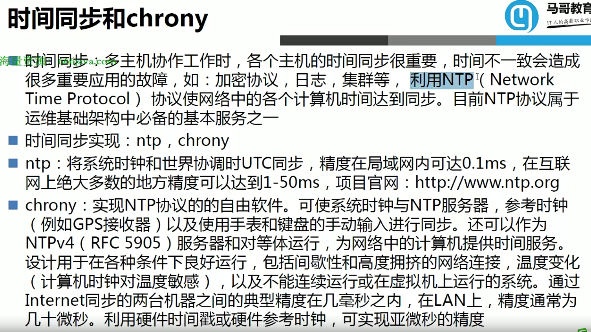
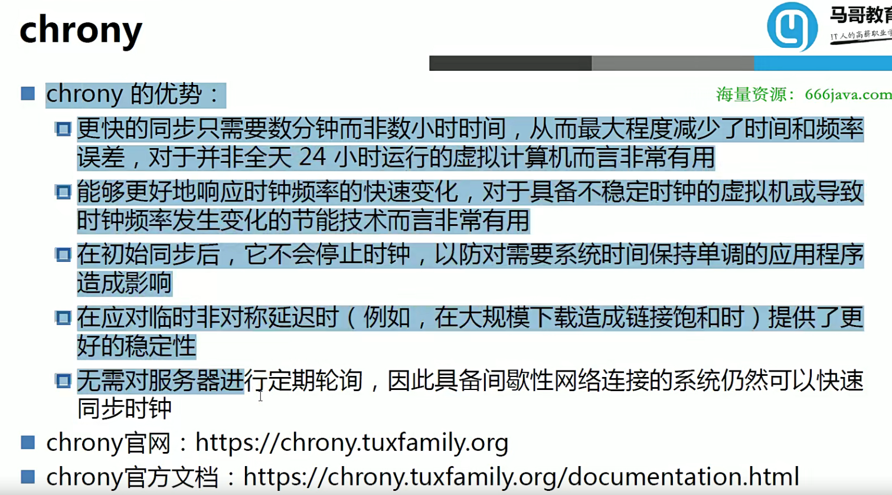
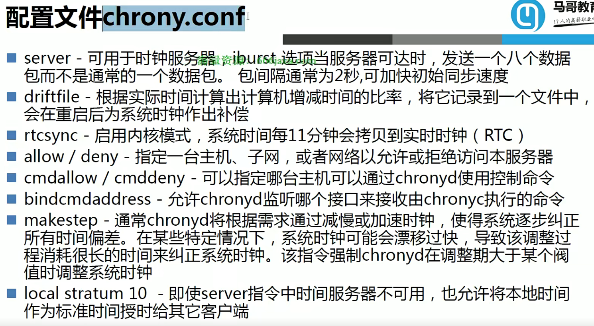
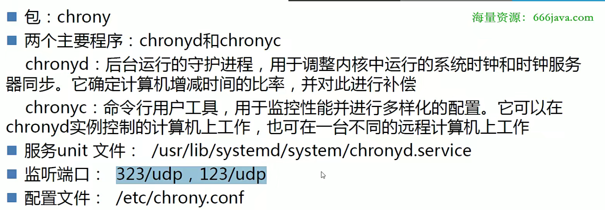
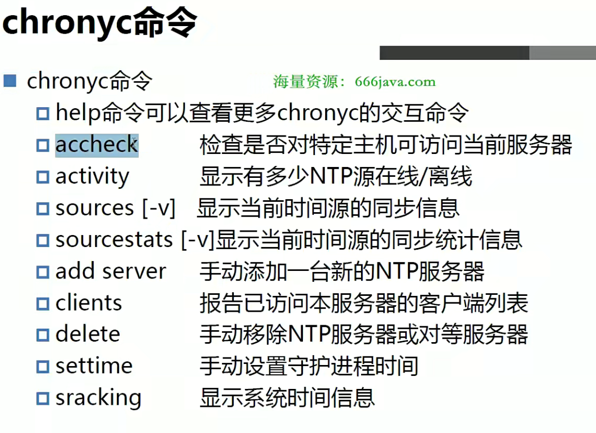
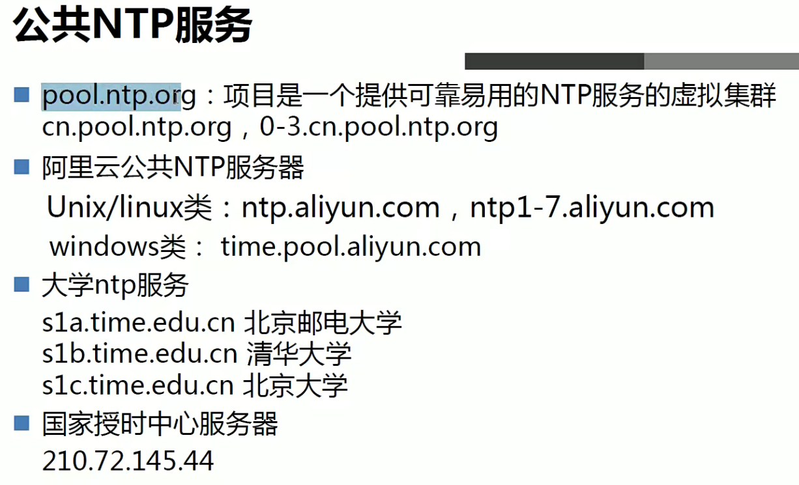

# 1.时间同步

# 2.NTP

- ntp配置文件位置：/etc/ntp.conf 
- 监听端口为123

- 当客户端时修改：server 0.centos.pool.ntp.org iburst

- 当时间服务器时注释掉：restrict default nomodify notrap nopeer noquery

- 查看同步情况：ntpq -p

# 3.Chrony

- 监听端口323，也能监听在123
- chrony配置文件：/etc/chrony.conf 

- 允许别人访问：修改allow配置项
- 当时间源断开以后，自己作为时间源：`local stratum 10`设置本地时钟的层级,0-15
- 查看同步情况：chronyc sources -v

