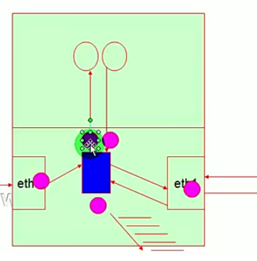

# 防火墙

## 防火墙

防火墙是指工作在网络或主机的边缘，对进出的数据包工具定义的规则进行检查，并作出相应处理的一套组件

* **检查规则**：匹配条件和处理办法
* **匹配条件**：
  * 帧首部、IP首部、TCP首部、应用层首部
  * IP：源IP、目标IP
  *   TCP：源端口、目标端口、TCP标志位(URG，ACK，SYN，RST，PSH，FIN)

      * `URG`：紧急标志。用于指示数据包中包含紧急数据。
      * `ACK`：确认标志。用于确认接收到的数据包。
      * `SYN`：同步标志。用于建立 TCP 连接。
      * `RST`：重置标志。用于终止 TCP 连接或拒绝连接请求。
      * `PSH`：推送标志。用于指示接收方应立即处理数据包中的数据。
      * `FIN`：结束标志。用于终止 TCP 连接。

      > 在建立 TCP 连接时，通常使用三次握手过程。在这个过程中，客户端和服务器之间会交换三个数据包，每个数据包都带有特定的 TCP 标志：
      >
      > 1. 客户端发送一个带有 `SYN` 标志的数据包到服务器，请求建立连接。
      > 2. 服务器回复一个带有 `SYN` 和 `ACK` 标志的数据包，表示接受连接请求。
      > 3. 客户端发送一个带有 `ACK` 标志的数据包到服务器，确认连接建立。
      >
      > 在终止 TCP 连接时，通常使用四次挥手过程。在这个过程中，客户端和服务器之间会交换四个数据包，每个数据包都带有特定的 TCP 标志：
      >
      > 1. 客户端发送一个带有 `FIN` 标志的数据包到服务器，请求终止连接。
      > 2. 服务器回复一个带有 `ACK` 标志的数据包，确认收到终止请求。
      > 3. 服务器发送一个带有 `FIN` 标志的数据包到客户端，表示同意终止连接。
      > 4. 客户端发送一个带有 `ACK` 标志的数据包到服务器，确认连接终止。
      >
      > 请注意，这只是建立和终止 TCP 连接的典型过程。实际情况可能会因网络条件、操作系统实现等因素而有所不同。
  * TCP有限状态机：CLOSED，LISTEN，SYN\_SENT，SYN\_RECV，ESTABLTSHED，FIN\_WAIT1，CLOSE\_WAIT，FIN\_WAIT2 ，LAST\_ACK，TIME \_WAIT(2MSL，2\*120s)，CLOSED
* **防火墙类型**：
  * 包过滤型防火墙是最基本的防火墙类型，它根据预先设定的规则来过滤IP/TCP层数据包。这种防火墙的优点是简单易用，缺点是无法检测数据包的状态，容易受到欺骗攻击。例如，攻击者可以通过伪造数据包的源地址来绕过这种防火墙。
  * 状态检测型防火墙则可以根据数据包的状态来进行过滤，例如可以根据TCP连接状态来过滤数据包。这种防火墙的优点是可以有效地防止一些攻击，例如SYN Flood攻击和Ping of Death攻击等。缺点是需要占用更多的系统资源。
  * 应用层网关型防火墙则可以对特定的应用程序进行过滤，对特定的应用层协议做检查，例如可以对HTTP协议进行过滤。这种防火墙的优点是可以更加精细地控制网络流量，缺点是需要更高的配置要求和更多的系统资源。

除此之外还可以以软硬件对防火墙进行分类。软件防火墙是在操作系统**内核**中实现的，例如iptables、nftables、UFW、Firewalld等。硬件防火墙是一种独立的设备，通常由专业的硬件厂商生产，例如思科、华为等。



**Netfilter**是Linux 2.4.x引入的一个子系统，它作为一个通用的、抽象的**框架**，提供一整套的hook函数的管理机制，使得诸如 数据包过滤 、网络地址转换 (NAT)和基于协议类型的连接跟踪成为了可能。

Netfilter的架构就是在整个网络流程的若干位置放置了一些**检测点**（HOOK），而在每个检测点上登记了一些处理函数。当数据包到达某个检测点时，就会调用相应的处理函数来处理数据包。

Netfilter 的**钩子点**(规则链)包括：PREROUTING、INPUT、FORWARD、OUTPUT 和 POSTROUTING。这些钩子点分别对应了数据包在 Linux 系统中的不同处理阶段，具体如下：

* **PREROUTING**：数据包进入路由表之前的处理阶段。
* **INPUT**：数据包到达本地系统之后的处理阶段。
* **FORWARD**：数据包转发到其他系统之前的处理阶段。
* **OUTPUT**：数据包从本地系统出去之前的处理阶段。
* **POSTROUTING**：数据包离开系统之前的处理阶段。

规则链可以包含多条检查规则，从上到下依次执行。所以对于检查规则的编写会极大的影响防火墙的性能

Netfilter是Linux内核提供的框架，可以进行多种网络相关的自定义操作。

* **防火墙的功能**
  * Filter：防火墙可以根据预定义的规则对数据包进行过滤，只允许符合规则的数据包通过。
  * NAT：防火墙可以对数据包进行地址转换，将私有 IP 地址转换为公共 IP 地址，或者将公共 IP 地址转换为私有 IP 地址。
  * Mangle：对数据包进行修改。mangle 表可以对数据包的 TTL（生存时间）、TOS（服务类型）、MARK（标记）等进行修改。mangle 表中的链包括 PREROUTING、INPUT、FORWARD、OUTPUT 和 POSTROUTING。其中 PREROUTING 和 OUTPUT 链可以对数据包进行修改，而 INPUT、FORWARD 和 POSTROUTING 链只能对数据包进行查看。
  * Raw：对数据包进行处理。raw 表中的链包括 PREROUTING 和 OUTPUT。PREROUTING 链用于在路由之前处理数据包，而 OUTPUT 链用于在路由之后处理数据包。raw 表可以用于处理 ICMP 数据包、连接跟踪等。

规则链会把不同功能的规则进行区分隔离，避免不同功能的规则相互影响


iptables 中可以**自定义链**，自定义链可以用于对数据包进行处理。自定义链可以在 filter 表、nat 表和 mangle 表中创建。自定义链可以在规则链中被引用，从而对数据包进行处理。

## iptables

* iptable命令的格式
  *   iptables \[-t TABLE] COMMAND CHAIN \[CRETERIA] -j ACTION

      ```bash
      iptables [ -t <表名>] <命令> <链名>  <参数1> <选项1>  <参数n> <选项n>
      ```
  * -t
    * raw
    * mangle
    * nat
    * filter（默认）
  * COMMAND：对链，或者对链中的规则进行管理操作
    * 链中规则
      * -A：添加规则
      * -I n：插入规则
      * -R n|CRETERIA：替换规则
      * -D n|CRETERIA：删除规则
    * 链
      * -N：新建一条链
      * -X：删除一个自定义的空链
      * -E：重命名一条自定义链
      * -F：清空指定链，不指定则清除所有链
      * -P：设定链的默认策略
      * -Z：置零(每条规则都有两个计数器，一个是被本规则匹配到的个数，一个是被本规则匹配到的所有数据包的大小之和)
    * 查看
      * -L：查看指定链规则
        * -v：设置显示信息的详细程度(最多三个v)
        * \--line-numbers：显示规则的行号
        * -x：显示计数器的精确值
        * -n：显示数字地址
    * chain：链名
      * INPUT
      * OUTPUT
      * PREROUTING
      * POSTROUTING
      * FORWARD
  * CRETERIA：匹配条件
    * 通用匹配：
      * -s：指定源地址
      * -d：指定目标地址
        * ip
        * NETWORK/MASK
        * hostname
        * ! ip
      * -p {icmp|tcp|udp}：指定协议
      * -i IN\_INTERFACE：数据包流入接口
      * -o OUT\_INTERFACE：数据包流出接口
    * 扩展匹配：
      * 隐式扩展
        * -p tcp
          * \--sport PORT\[-PORT2]
          * \--dport PORT\[-PORT2]
          * \--tcp-flags SYN,ACK SYN(--syn)：表明检查的SYN与ACK标志里SYN标志位必须为1，ACK标志位必须为0。检查的位写在前用逗号隔开，必须为1的位写在后面，用逗号隔开
        * -p udp
          * \--sport PORT\[-PORT2]
          * \--dport PORT\[-PORT2]
        * -p icmp
          * \--icmp-type
            * 类型0：回显应答（ping应答）
            * 类型3：目的地不可达
            * 类型4：源端抑制
            * 类型5：重定向
            * 类型8：回显请求（ping请求）
            * 类型11：超时
      * 显式扩展：netfilter扩展模块引入的扩展，用于扩展匹配条件，通常需要额外专用选项来定义
        * -m 扩展名
          * -m state：用于实现连接的状态检测
            * \--state：允许写多个，用逗号隔开
              * NEW：发出一个新的请求
              * ESTABLISHED：建立连接
              * RELATED：当一个新连接与已经建立的连接相关联时，数据包的状态就是 RELATED。通常用于FTP协议。当你使用 FTP 协议时，客户端会首先与服务器建立一个控制连接，然后再建立一个数据连接来传输文件。这个数据连接与控制连接相关联，因此它的状态就是 RELATED。
              * INVALID：非法连接
          * -m muitiport：用于指定多个端口
            * \--source-ports
            * \--destination-ports
            * \--ports
          * -m limit：采用令牌桶过滤器限制数据包速率
            * \--limit：限制特定包传入速度
            * \--limit-burst：限制特定包瞬间传入的峰值
          * -m connlimit：限制每个IP地址的最大连接数
            * \--connlimit-above：连接数大于时匹配
          * -m iprange：指定匹配的ip范围
            * \--src-range：ip-ip
            * \--dst-range：ip-ip
          * -m string：根据指定的模式和策略来匹配给定的字符串
            * \--algo bm|kmp：指定策略
            * \--string：给定字符串
            * \--hex-string：十六进制的字符串
          * -m recent：限制一段时间内的连接数
            * \--name 设定列表名称，即设置跟踪[数据库](https://cloud.tencent.com/solution/database?from=20065\&from_column=20065)的文件名. 默认DEFAULT;
            * \--rsource 源地址，此为默认。 只进行数据库中信息的匹配，并不会对已存在的数据做任何变更操作;
            * \--rdest 目的地址;
            * \--seconds 指定时间内. 当事件发生时，只会匹配数据库中前"几秒"内的记录，--seconds必须与--rcheck或--update参数共用;
            * \--hitcount 命中次数. hits匹配重复发生次数，必须与--rcheck或--update参数共用;
            * \--set 将地址添加进列表，并更新信息，包含地址加入的时间戳。 即将符合条件的来源数据添加到数据库中，但如果来源端数据已经存在，则更新数据库中的记录信息;
            * \--rcheck 检查地址是否在列表，以第一个匹配开始计算时间;
            * \--update 和rcheck类似，以最后一个匹配计算时间。 如果来源端的数据已存在，则将其更新；若不存在，则不做任何处理;
            * \--remove 在列表里删除相应地址，后跟列表名称及地址。如果来源端数据已存在，则将其删除，若不存在，则不做任何处理;
          * -m time ：根据时间来匹配
            * \--timestart：指定开始时间
            * \--timestop：指定结束时间
            * \--weekdays Wed,Thu：指定日期
      * -j：指定当数据包与规则匹配时所采取的动作。可以指定动作以及跳转到自定义链中进行处理
        * ACCEPT：接受数据包
        * DROP：丢弃数据包
        * REJECT：拒绝数据包并发送错误消息
        * RETURN：停止当前链的处理并返回到调用链或者上一级链。
        *   REDIRECT：重定向

            ```bash
            iptables -t nat -A PREROUTING -p tcp --dport 80 -j REDIRECT --to-ports 8080
            ```
        *   DNAT：改写数据包包目的地 IP 为某特定 IP 或 IP 范围，可以指定 port 对应的范围改写数据包包目的地 IP 为某特定 IP 或 IP 范围，可以指定 port 对应的范围

            ```bash
            iptables -t nat -A PREROUTING -p tcp -d 15.45.23.67 --dport 80 -j DNAT --to-destination 192.168.10.1-192.168.10.10:80-100
            ```
        *   SNAT：改写封包来源 IP 为某特定 IP 或 IP 范围，可以指定 port 对应的范围改写封包来源 IP 为某特定 IP 或 IP 范围，可以指定 port 对应的范围

            ```bash
            iptables -t nat -A POSTROUTING -p tcp-o eth0 -j SNAT --to-source 192.168.10.15-192.168.10.160:2100-3200
            ```
        * MASQUERADE：地址伪装。跟SNAT类似，但是自动选择一个合适地址作为转换后的源地址
        *   LOG：记录数据包信息到内核日志

            * \--log-level：指定日志级别
            * \--log-prefix：记录的信息前添加前缀

            ```bash
            iptables -I INPUT -p tcp --dport 22 -m state --state NEW -j LOG --log-prefix "New connection on port 22: "
            ```

iptables服务的配置文件在`/etc/sysconfig/iptables-config`

由于iptables并不存在内核中，所以需要把自己编写的规则保存起来，可以使用`iptables-save`命令将当前的iptables规则保存到文件中。例如，要将规则保存到`/etc/sysconfig/iptables`文件中，可以使用以下命令：

```bash
sudo iptables-save > /etc/sysconfig/iptables
```

在某些发行版（如CentOS）中，您还可以安装`iptables-services`包，并使用`service iptables save`命令来保存规则。服务的保存路径在`/etc/sysconfig/iptables`

`iptables-save`命令本身并没有默认的保存位置，它只是将当前的iptables规则输出到标准输出。您可以将输出重定向到任何您想要保存规则的文件中。但是，在某些发行版（如CentOS）中，`/etc/sysconfig/iptables`是一个常用的位置来保存iptables规则

而当你想把保存的规则从文件中恢复的话，可以使用以下命令：

```bash
iptables-restore < /etc/sysconfig/iptables
```
