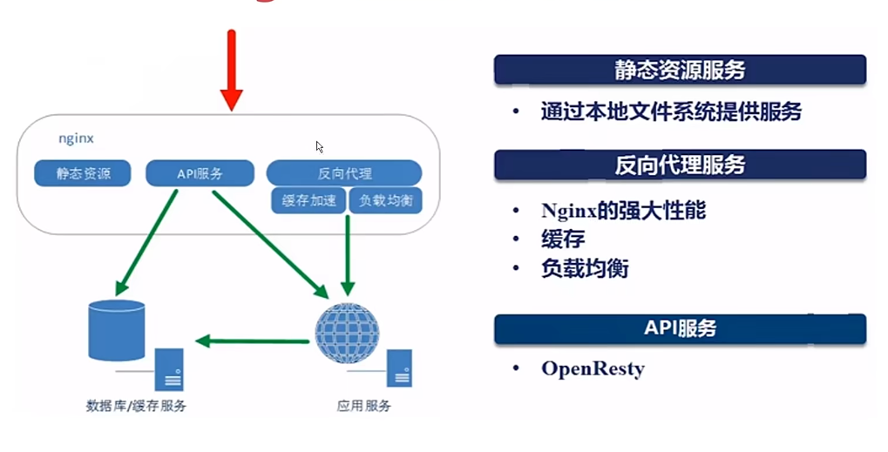
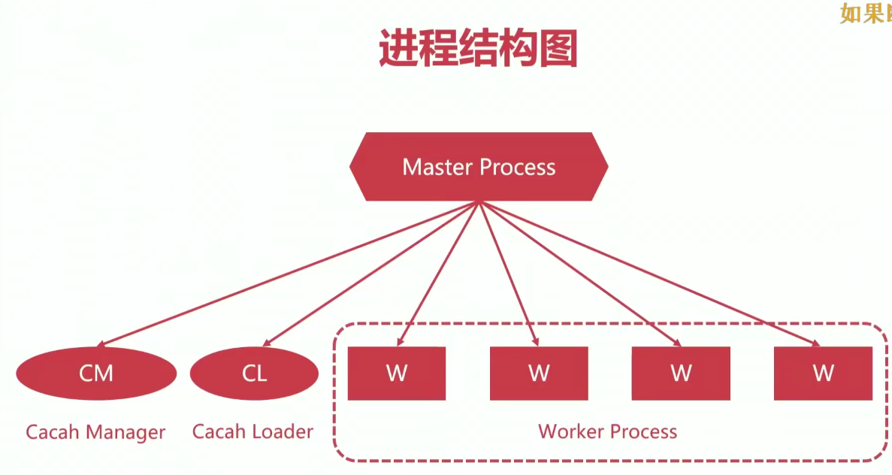
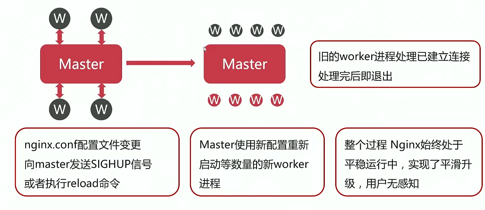
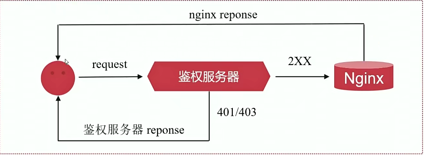
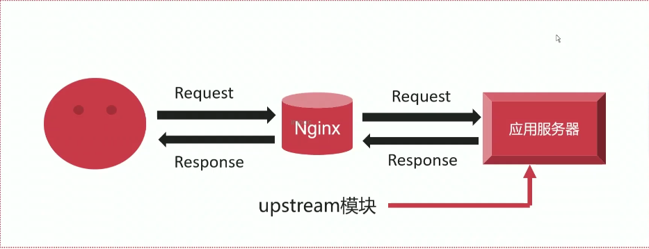
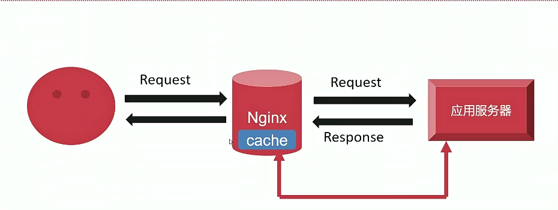
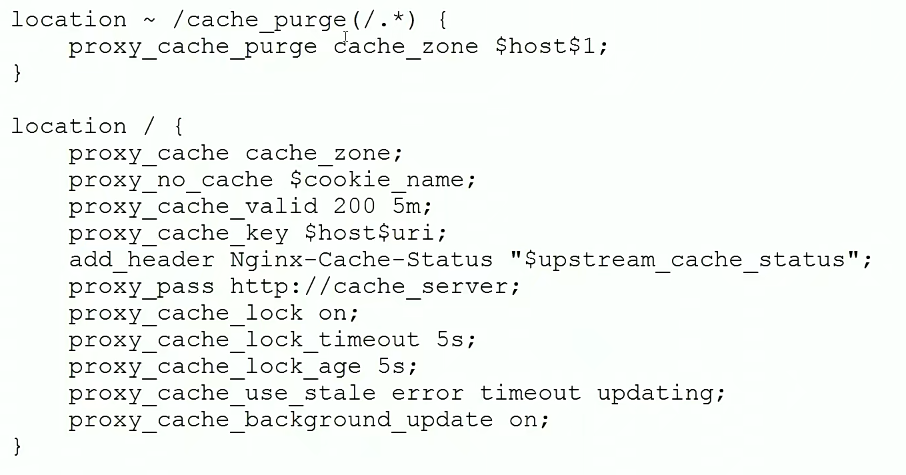
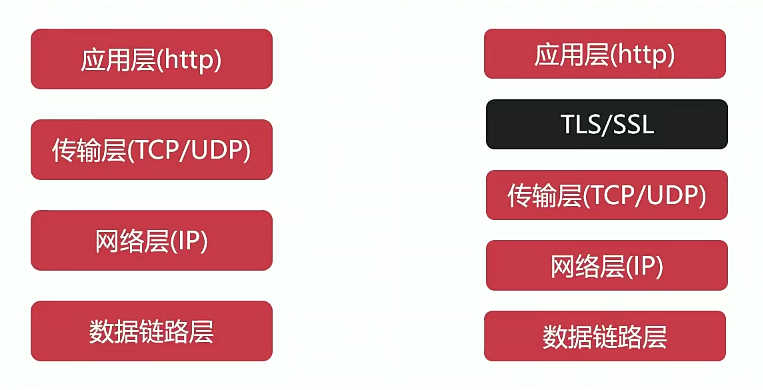
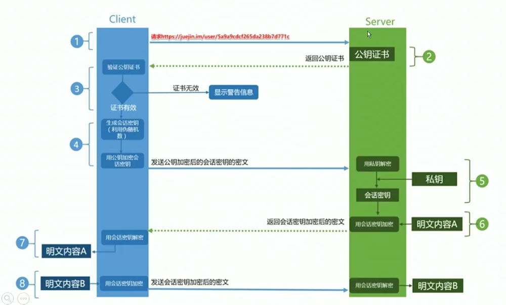
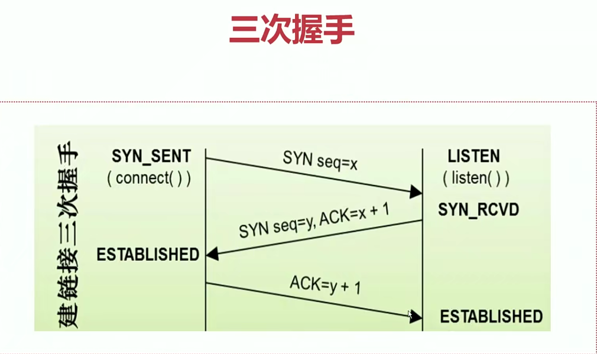

# Nginx-all

## 1.路线


## 2.概述

Nginx338931是一个高性能的HTTP和反向代理web服务器，同时也提供了IMAP/POP3/SMTP服务。Nginx是由伊戈尔·赛索耶夫为俄罗斯访问量第二的Rambler.ru站点（俄文: PaM6nep)开发的，第一个公开版本0.1.0发布于2004年10月4日。

其将源代码以**类BSD许可证**的形式发布，因它的稳定性、丰富的功能集、示例配置文件和低系统资源的消耗而闻名。2011年6月1日，nginx 1.0.4发布。

Nginx是一款**轻量级的Web 服务器/反向代理服务器及电子邮件（IMAP/POP3）代理服务器**，在BSD-like协议下发行。其特点是**占有内存少，并发能力强**。事实上nginx的并发能力确实在同类型的网页服务器中表现较好，中国大陆使用nainx网站用户有:百度、京东、新浪、网易、腾讯、淘宝等。

.png>)

.png>)

> nginx作用场景

* 高性能的静态WEB服务器
* 反向代理服务
* API服务

> Http请求的全流程剖析


.png>)

.png>)

> Nginx处理请求的过程



> 优势优点

* 高并发、高性能
* 扩展性好
* 异步非阻塞的事件驱动模型
* 高可靠性

> 常用版本

1. Nginx开源版
2. Nginx plus商业版
3. Openresty
4. Tengine

### 2.1.I/O

.png>)

.png>)

#### 2.1.1.阻塞IO模型

.png>)

.png>)

.png>)

.png>)

#### 2.1.2.非阻塞模型

.png>)

#### 2.1.3.IO多路复用模型

.png>)

.png>)

#### 2.1.4.信号驱动IO模型

.png>)

.png>)

#### 2.1.5.异步IO模型

.png>)

### 2.2.IO模型

.png>)

.png>)

.png>)

.png>)

.png>)

.png>)

.png>)

.png>)

.png>)

.png>)

## 3.下载nginx

> rpm安装Nginx

1. [下载nginx源码包](http://nginx.org/en/download.html)
2. 使用tar -zxvf +包名：解压源码包
3. 下载nginx相关依赖：yum -y install gcc zlib zlib-devel pcre-devel openssl openssl-devel
4. 进入解压后的目录，进行nginx初始化配置：./configure --with-http\_ssl\_module
5. make
6.  make install

    > \--prefix=PATH：指定 nginx 的安装目录（默认/usr/local/nginx）\
    > \--conf-path=PATH：指定 nginx.conf 配置文件路径\
    > \--user=NAME：nginx 工作进程的用户\
    > \--with-pcre：开启 PCRE 正则表达式的支持\
    > \--with-http\_ssl\_module：启动 SSL 的支持\
    > \--with-http\_stub\_status\_module：用于监控 Nginx 的状态\
    > \--with-http-realip\_module：允许改变客户端请求头中客户端 IP 地址\
    > \--with-file-aio：启用 File AIO\
    > \--add-module=PATH：添加第三方外部模块

> yum安装nginx

1. yum -y install epel-release：安装epel源
2. yum list|grep nginx：查看可yum的包
3. yum install nginx：下载nginx
4.  rpm -ql nginx：列出所有的nginx文件

    > /etc/nginx/nginx.conf：nginx配置文件
    >
    > /var/log/nginx/access.log：访问记录日志\
    > /var/log/nginx/error.log：错误日志

* systemctl start nginx：启动nginx服务

> 这时候在浏览器里输入ip地址就可以访问了，注意关闭防火墙

## 4.Nginx进程结构



> 常用Linux信号量管理机制

| 信号量         | 作用                                                             |
| ----------- | -------------------------------------------------------------- |
| SIGCHLD -17 | 终止子进程后发送信息给父进程                                                 |
| SIGTERM -15 | 允许进程完成工作后终止，相当于kill                                            |
| SIGKILL -9  | 强制退出                                                           |
| SIGHUP -1   | 重新读取配置文件                                                       |
| SIGUSR1 -10 | 用户自定义信号量，重读日志,在日志按月/日分割时有用                                     |
| SIGUSR2 -12 | 用户自定义信号量，平滑的升级时有用                                              |
| SIGWINCH    | Gracefully shutdown the worker processes 优雅关闭旧的进程(配合USR2来进行升级) |

### 4.1.配置文件重载的原理真相

> reload重载配置文件的流程

1. 向master进程发送HUP信号(reload命令)
2. master进程检查配置语法是否正确
3. master进程打开监听端口
4. master进程使用新的配置文件启动新的worker子进程
5. master进程向老的worker子进程发送QUIT信号
6. 旧的worker进程关闭监听句柄，处理完当前连接后关闭进程



### 4.2.Nginx的热部署

> 热升级的流程

1. 将旧的nginx文件替换成新的nginx文件
2. 向master进程发送USR2信号
3. master进程修改pid文件，加后缀.oldbin
4. master进程用新的nginx文件启动新master进程
5. 向旧的master进程发送WINCH信号，旧的worker子进程退出
6. 确认上线功能无误后，向旧master进程发送QUIT信号
7. 回滚情形：向旧master发送HUP，向新的master发送QUIT


### 4.3.Nginx的模块化管理机制

> 模块结构图


> 模块体系结构


### 4.4.nginx编译安装的配置参数

| 参数               | 含义                   |
| ---------------- | -------------------- |
| --prefix         | 指定安装的目录              |
| --user           | 运行nginx的worker子进程的属主 |
| --group          | 运行nginx的worker子进程的属组 |
| --pid-path       | 存放进程运行pid文件的路径       |
| --conf-path      | 配置文件nginx.conf的存放路径  |
| --error-log-path | 错误日志access.log的存放路径  |
| --http-log-path  | 访问日志access.log的存放路径  |
| --with-pcre      | pcre库的存放路径，正则表达式会用到  |
| --with-zlib      | zlib库的存放路径，gzip模块会用到 |

> 内置参数默认原则
>
> 1. 显示加上，默认不内置
>    * \--with
> 2. 显示去掉，默认内置
>    * \--without

### 4.5.Nginx配置文件结构

> 配置文件结构


nginx的配置文件是nginx.conf，这个配置文件一共由三部分组成，分别为全局块、events块和http块¹²³。下面是各个块的内容简介：

* 全局块：位于配置文件的最前面，影响nginx服务器的整体运行。主要设置一些影响nginx服务器整体运行的配置指令，例如worker进程的数量、日志文件的位置、pid文件的位置等。
* events块：位于全局块之后，主要影响nginx服务器与用户的网络连接。主要设置一些有关网络连接方面的配置指令，例如每个worker进程支持的最大连接数、是否开启多路复用等。
* http块：位于events块之后，是配置最频繁的部分。主要设置一些影响http协议相关功能和性能的配置指令，例如是否开启gzip压缩、是否开启缓存、是否开启反向代理和负载均衡等。在http块中，又可以包含多个server块和upstream块。
  * server块：表示一个虚拟主机或者一个网站。可以在一个http块中定义多个server块，每个server块都有自己独立的域名、端口号、根目录等属性。在server块中，又可以包含多个location块。
  * location 块：表示一个URL匹配规则或者一个目录路径。可以在一个server 块中定义多个location 块，每个location 块都有自己独立的匹配规则、访问权限、缓存策略等属性。
  * upstream 块：表示一个后端服务器组或者一个负载均衡器。可以在一个http 块中定义多个upstream 块，每个upstream 块都有自己独立的名称、负载算法、后端服务器列表等属性。

```bash

user  nobody;  # 设置属主
group nobody;  # 设置属组 
worker_processes  auto; # 设置子进程为自动

#error_log  logs/error.log;
#error_log  logs/error.log  notice;
#error_log  logs/error.log  info;

#pid        logs/nginx.pid;

########### main  #################

events {
    worker_connections  1024;  # 每个worker子进程可以处理的并发数
}

########### events  #################

http {
    include       mime.types;
    default_type  application/octet-stream;

    #access_log  logs/access.log  main;

    sendfile        on;
    #tcp_nopush     on;

    #keepalive_timeout  0;
    keepalive_timeout  65;  # 连接超时时间

    #gzip  on;

    server {
        listen       80;  # 监听端口
        server_name  localhost;  # 域名

        #charset koi8-r;

        #access_log  logs/host.access.log  main;

        location / {
            root   html;
            index  index.html index.htm;
        }

        #error_page  404              /404.html;

        # redirect server error pages to the static page /50x.html
        #
        error_page   500 502 503 504  /50x.html;
        location = /50x.html {
            root   html;
        }
########### http  #################

 
```

.png>)

### 4.6.虚拟主机的分类

* 基于多IP的虚拟主机
* 基于多端口的虚拟主机
* 基于域名的虚拟主机

> 基于多IP的虚拟主机

1. 为虚拟机添加多张网卡
2. 配置nginx配置文件的监听端口为不同ip地址
3. 修改相对于监听端口的响应页面

> 基于多端口的虚拟主机

1. 配置nginx配置文件的监听端口
2. 修改相对于监听端口的响应页面

> 基于域名的虚拟主机

1. 配置nginx配置文件的服务域名
2. 修改相对于域名的响应页面

> 当响应页面中有中文时，需要设置charset utf-8，设置编码格式
>
> 当reload执行后，如果请求页面的数据没有更改，页面请求会读取缓存中的数据，所以要使用crtl F5强制刷新

#### 4.6.1.关于页面缓存问题

当浏览器访问的服务器没有设置缓存时，浏览器先200 OK from memory cache，如果浏览器缓存中没有该文件，那么浏览器会200 OK from disk cache 从磁盘中找改文件，如果还找不到，浏览器会从服务端请求该文件下载使用。

1. **Last-Modified/If-Modified-Since**
   * 当浏览器第一次请求一个url时，服务器端的返回状态码为200，同时HTTP响应头会有一个**Last-Modified**标记着文件在服务器端最后被修改的时间。
   * 浏览器第二次请求上次请求过的url时，浏览器会在HTTP请求头添加一个**If-Modified-Since**的标记，用来询问服务器该时间之后文件是否被修改过。如果没有被修改过，响应页面会直接从浏览器缓存中拿
2. **Etag/If-None-Match**
   * 当浏览器请求一个url时，HTTP响应头会有一个Etag，存放着服务器端生成的一个序列值。
3. Etag和Last-Modified特点:
   1. 它们都属于协商缓存，对内容的有效性进行验证。
   2. Etag的值通常为文件内容的哈希值；而Last-Modified为最后修改的时间。
   3. Last-Modified只能精确到秒，秒之内的内容更新Etag才能检测。
   4. 文件有时会定时重新生成相同内容，Last-Modified不能很好辨别，某些服务器甚至不能精确的得到文件的最后修改时间。
   5. Etag每次服务端生成都需要进行读写操作，而Last-Modified只需要读取操作，Etag的消耗是更大的。
   6. Etag更像是Last-Modified的一种补充、完善。

## 5.Nginx基础应用

### 5.1.配置文件main段核心参数用法

* 配置影响nginx全局的指令。一般有运行nginx服务器的用户组，nginx进程pid存放路径，日志存放路径，配置文件引入，允许生成worker process数等。
* user _username_ \[GROUP]
  * 指定运行nginx和worker子进程的属主和属组(可以不指定)
*   pid _DIR_

    * 指定运行nginx的master主进程的pid文件存放路径

    ```bash
    pid opt/nginx/logs/nginx.pid;
    ```
* worker\_rlimit\_nofile _number_
  * 指定worker子进程可以打开的最大文件句柄数
* worker\_rlimit\_core _size_：指定worker子进程异常终止后的core文件，用于记录分析问题
*   working\_directory _dir_：用于指定core文件写入位置

    ```
    worker_rlimit_core 50M;
    working_directory /opt/nginx/tem;
    ```
* worker\_processes _number_|_auto_
  * 指定nginx启动的worker子进程数量
*   worker\_cpu\_affinity _cpumask1_ _cpumask2_....

    * 将每个worker子进程与我们的cpu物理核心绑定

    ```bash
    worker_cpu_affinity  0001 0010 0100 1000
    # 4个物理核心，4个worker子进程
    # 将每个worker子进程与特定cpu物理核心绑定，优势在于：避免同一个worker子进程在不同的CPU核心上切换，缓存失效，减低性能；其并不能真正的避免进程切换
    ```
*   worker\_priority _number_

    * 指定worker子进程的nice值，以调整运行nginx的优先级，通常设定为负值，以优先调用nginx

    ```bash
    worker_priority -10;  #设置进程优先级为110
    # Linux默认进程的优先级是120，值越小越优先；nice设定范围为-20~+19
    ```
*   worker\_shutdown\_timeout _time_

    * 指定worker子进程优雅退出时的超时时间

    ```
    worker_shutdown_timeout 5s;
    ```
*   timer\_resolution _time_

    * worker子进程内部使用的计时器精度，调整时间间隔越大，系统调用越少，用户态和内核态切换越少，有利于性能提升，反之，系统调用越多，性能下降

    ```
    timer_resolution 100ms;
    ```

    
* daemon on|off
  * 设定nginx的运行方式，前台还是后台，前台用户调式，后台用于生产
* lock\_file
  * 负载均衡互斥锁文件存放路径
  * 推荐logs/nginx.lock

### 5.2.events核心参数

* 配置影响nginx服务器或与用户的网络连接。有每个进程的最大连接数，选取哪种事件驱动模型处理连接请求，是否允许同时接受多个网路连接，开启多个网络连接序列化等。
* use select|poll|kqueue|epoll|/dev/poll|eventport
  * nginx使用何种时间驱动模型
  * 推荐不指定，让nginx自己选择
* worker\_connections _number_
  * worker子进程能够处理的最大并发连接数
  * 推荐配置：65535/worker\_processes|65535
* accept\_mutex _on|off_
  * 是否打开负载均衡互斥锁
  * 推荐打开
* accept\_mutex\_delay _time_
  * 新链接分配给worker子进程的超时时间
  * 推荐200ms
* muti\_accept _on/off_
  * worker子进程可以一次性接收多个的新链接个数
  * 推荐打开

### 5.3.http核心参数

* 可以嵌套多个server，配置代理，缓存，日志定义等绝大多数功能和第三方模块的配置。如文件引入，mime-type定义，日志自定义，是否使用sendfile传输文件，连接超时时间，单连接请求数等。

#### 5.3.1.server\_name

* server块：配置虚拟主机的相关参数，一个http中可以有多个server。

> 指令用法

语法：server\_name _name1_ \*name2 _name3_......;

```bash
- 作用：设置虚拟服务器的名称
# 示例
server_name www.nginx.com;
server_name *.nginx.org;
server_name www.nginx.org *.nginx.org;
server_name ~^www\.imooc/.*$ #使用正则需要在前面加~符号
```

> 指令用法优先级

1.  多域名如何匹配

    

#### 5.3.2.root与alias用法区别

> root

语法：root _path_；

上下文：http server location if

> alias

语法：alias _path_

上下文：location

> 共同点与区别

* 相同点：URL到磁盘文件的映射
* 区别：root会将定义路径与URL叠加；alias则只取定义路径

> 注意事项

* 使用alias时，末尾一定要加/
* alias只能位于location块中

#### 5.3.3.location

* 配置请求的路由，以及各种页面的处理情况。

> 基础用法

* 语法：\[=|\~|\~\*|^\~] uri {...}
* 作用：根据请求URI设置配置
* 上下文：server location

| 匹配规则   | 含义          | 示例                               |
| ------ | ----------- | -------------------------------- |
| =      | 精确匹配        | location = /images/{...}         |
| \~     | 正则匹配，区分大小写  | location \~\ .(jpg\|gif)${...}   |
| \~\*   | 正则匹配，不区分大小写 | location \~\*\ .(jpg\|gif)${...} |
| ^\~    | 匹配到即停止搜索    | location ^\~/images/{...}        |
| 不带任何符号 |             | location / {...}                 |

.png>)

.png>)

> location规则的匹配顺序


> 深入理解location中URL结尾的反斜线

* location参数中不带index参数
* 不带/
  * 例如/text
  * 先将text当做文件夹处理，默认找index.html文件。如果文件夹里面没有东西，则在root参数目录里找text文件。如果都没有则返回404
* 带/
  * 例如/text/
  * 先将text当做文件夹处理，如果文件夹里面没有东西，直接返回404

#### 5.3.4.stub\_status模块

> 用法

* 指令：stub\_status;
* 上下文：server location
* 默认是不带这个模块的，要在编译时带上
* 若要加装模块，只要重新配置编译安装就行

> 状态项

| 状态项                | 含义           |
| ------------------ | ------------ |
| Active Connections | 活跃的连接数量      |
| accepts            | 接受的客户端连接总数量  |
| handled            | 处理的客户端连接总数量  |
| requests           | 客户端总的请求数量    |
| Reading            | 读取客户端的连接数    |
| Writing            | 响应数据到客户端的连接数 |
| Waiting            | 空闲客户端请求连接数量  |

#### 5.3.5.压缩和第三方模块

.png>)

.png>)

.png>)

.png>)

## 6.HTTP核心模块-Nginx应用进阶

> connection和request

* connection是连接，即常说的tcp连接，三次握手，状态机
* request是请求，例如http请求
* request是必须建立在connection之上


.png>)

.png>)

### 6.1.对连接数做限制的limit\_conn模块

* 用于限制客户端并发连接数
* 默认编译进nginx，通过--without-http\_limit\_conn\_module禁用
* 使用共享内存，对所有worker子进程生效

> 常用指令

*   limit\_conn\_zone

    ```bash
    - 作用：定义共享内存
    - 语法：limit_conn_zone key zone=name:size
    - key:限制客户端唯一标识
    - name：任意名字
    - size：共享内存大小
    - 上下文：http
    - limit_conn_zone $binary_remote_addr name=addr:10m
    ```
*   limit\_conn\_status

    ```bash
    - 作用：定义限制行为发生时，返回给用户的状态
    - 语法：limit_conn_status code
    - 默认值：limit_conn_status 503
    - 上下文：http、server、location
    ```
*   limit\_conn\_log\_level

    ```bash
    - 作用：定义限制行为发生时的日志等级
    - 语法：limit_conn_log_level info|notice|warn|error
    - 默认值：limit_conn_log_level error
    - 上下文：http、server、location
    ```
*   limit\_conn

    ```bash
    - 作用：设置给定键值的共享存储区和最大允许的连接数。超过此限制时，服务器将返回回复请求中的错误。
    - 语法：limit_conn zone number
    - 上下文：http、server、location
    ```

### 6.2.对request处理速率做限制的limit\_req模块

* 用于限制客户端处理请求的平均速率
* 默认编译进nginx，通过--without-http\_limit\_req\_module禁用
* 使用共享内存，对所有worker子进程生效
* 限流算法：leaky\_bucket


> 常用指令

*   limit\_req\_zone

    ```bash
    - 作用：设置共享内存区域的参数，该共享内存区域将保留各种键的状态。特别是，状态存储当前数量的过多请求。键可以包含文本、变量及其组合。不考虑具有空键值的请求。
    - 语法：limit_req key zone=name:size rate=rate;
    - 上下文：http, server, location
    - 示例：limit_req_zone $binary_remote_addr zone=one:10m rate=2r/m(请求/每分)
    - 解释：在这里，状态保存在 10 MB 的区域“one”中，该区域的平均请求处理速率不能超过每秒 2 个请求。
    ```
*   limit\_req\_status

    ```
    - 作用：设置为响应被拒绝的请求而返回的状态代码
    - 语法：limit_req_status code;	
    - 默认：limit_req_status 503;
    - 上下文：http, server, location
    ```
*   limit\_req\_log\_level

    ```bash
    - 作用：为服务器因超过速率而拒绝处理请求或延迟请求处理的情况设置所需的日志记录级别。延迟的记录级别比拒绝低一分;例如，如果指定了“limit_req_log_level notice”，则会使用info级别记录延迟。

    - 语法：limit_req_log_level info | notice | warn | error;	
    - 默认：limit_req_log_level error;
    - 上下文：http, server, location
    ```
*   limit\_req

    ```bash
    - 作用： 共享内存区域和请求的最大突发大小。如果请求速率超过为区域配置的速率，则其处理将延迟，以便以定义的速率处理请求。过多的请求会延迟，直到其数量超过最大突发大小，在这种情况下，请求将终止并显示错误。默认情况下，最大突发大小等于零
    - 语法：limit_req zone=name [burst=number] [nodelay | delay=number];
    - 上下文：	http, server, location
    - 示例：limit_req zone=one burst=5 nodelay;# 可以处理5个突发请求，并且无延迟
    ```

### 6.3.限制特定IP或网段访问的access模块

* 默认编译进nginx

> 常用指令

*   allow

    ```bash
    - 作用：允许访问指定的网络或地址。
    - 语法：allow address|CIDR|UNIX|all
    - 默认值：无
    - 上下文：http/server/location/limit_except
    - 示例：allow 192.168.0.10;
    ```
*   deny

    ```
    - 作用：拒绝访问指定的网络或地址。
    - 语法：deny address|CIDR|UNIX|all
    - 默认值：无
    - 上下文：http/server/location/limit_except
    - 示例：allow 192.168.0.0/24;
    ```
*   示例

    ```bash
    location / {
        deny  192.168.1.1;
        allow 192.168.1.0/24;
        allow 10.1.1.0/16;
        allow 2001:0db8::/32;
        deny  all;
    }
    # 限制所有网段访问，除了allow允许的网段
    ```

### 6.4.限制特定用户访问的auth\_basic模块

* 基于HTTP Basic Authentication协议进行用户名密码认证
* 默认编译进nginx
* 该模块允许通过使用`HTTP 基本身份验证协议`验证用户名和密码来限制对资源的访问。

> 常用指令

*   auth\_basic

    ```bash
    - 作用：用户限制提示信息/关闭用户限制
    - 语法：auth_basic string|off
    - 默认值：auth_basic off
    - 上下文：http、server、location/limit_except
    ```
*   auth\_basic\_user\_file

    ```bash
    - 作用：配置秘钥文件
    - 语法：auth_basic_user_file file
    - 默认值：-
    - 上下文：http、server、location/limit_except
    ```
*   生成密码文件工具

    > * 可执行程序：htpasswd
    > * 所属软件包：httpd-tools
    > * 安装：yum install -y httpd-tools
    > * 生成新的密码文件：htpasswd -bc encrypt\_pass jack 123456
    > * 添加新用户密码：htpasswd -b encrypt\_pass mike 123456
* 默认秘钥文件在conf目录下，如果想放在其他路径需要写绝对路径

### 6.5.auth\_request模块

* 不是默认编译的，需要`--with-http_auth_request_module`
* 基于子请求收到的HTTP响应码做访问控制



> 常用指令

*   auth\_request

    ```bash
    - 作用：根据子请求的结果启用授权，并设置子请求将发送到的URI
    - 语法：auth_request uri|off
    - 默认值：auth_request off
    - 上下文：http、server、location
    ```
*   auth\_request\_set

    ```bash
    - 作用：在授权请求完成后将请求变量设置为给定值。该值可能包含来自授权请求的变量
    - 语法：auth_request_set $variable value
    - 默认值：-
    - 上下文：http、server、location
    ```
*   示例

    ```bash
    location /private/ {
        auth_request /auth;
        ...
    }

    location = /auth {
        proxy_pass ...  # 设置鉴权服务器
        proxy_pass_request_body off;
        proxy_set_header Content-Length "";
        proxy_set_header X-Original-URI $request_uri;
    }
    ```

### 6.6.rewrite模块

.png>)

.png>)

.png>)

> return指令

* 停止处理请求，直接返回响应码或重定向到其他URL
*   执行return指令后，location中后续指令将不会被执行

    ```bash
    - Syntax:	return code [text]; #主要用于2xx，用于测试
    		    return code URL;    #用于重定向
    			return URL;         #必须以http或https开头,默认状态码为302
    - Default:	—
    - Context:	server, location, if

    location /{
    	.....
    	return 404;
    	.....
    }
    ```

| HTTP状态码 |       |
| ------- | ----- |
| 1xx     | 消息类   |
| 2xx     | 成功    |
| 3xx     | 重定向   |
| 4xx     | 客户端错误 |
| 5xx     | 服务器错误 |

> 重定向状态码

* `HTTP 1.0`：
  * 301：永久重定向
  * 302：临时重定向，禁止被缓存
* HTTP 1.1：
  * 303：临时重定向，禁止缓存，允许改变方法
  * 307：临时重定向，禁止缓存，不允许改变方法
  * 308：永久重定向，不允许改变方法

> rewrite指令

*   根据指定正则表达式匹配规则，重写URL

    ```bash
    - Syntax:	rewrite regex replacement [flag];
    - Default:	—
    - Context:	server, location, if
    - example：rewrite /images/(.*\.jpg)$ /pic/$1; # 将所有images下jgp结尾的文件重写到/pic/$1.jpg目录下

    - flag：
    	last：重写后的URL发起新请求，再次进入server段，重试location中的匹配
    	brack：直接使用重写后的URL，不再匹配其他location中的语句
    	redirect：返回302临时重定向
    	permanent：返回301永久重定向
    ```

> rewrite指令加了flag参数则不执行rewrite指令后面的参数直接跳转，如不加则顺序执行完后跳转

> if指令

```bash
- Syntax:	if (condition) { ... }
- Default:	—
- Context:	server, location
- example：
			if ($http_user_agent ~ Chrome){
				rewrite /(.*) /browser/$1 break;
			} # 根据http_user_agent匹配进行重写URL

```

| condition |                               |
| --------- | ----------------------------- |
| $variable | 进位变量时，值为空或以0开头字符串都会被当做false处理 |
| =或！=      | 相等或不相等                        |
| \~或\~     | 正则匹配或非正则                      |
| \~\*      | 正则匹配，不区分大小写                   |
| -f或！-f    | 检查文件存在或不存在                    |
| -d或！-d    | 检查目录存在或不存在                    |
| -e或！-e    | 检查文件、目录、符号链接等存在或不存在           |
| -x或！-x    | 检查文件夹可执行或不可执行                 |

### 6.7.autoindex模块

* 用户请求以/结尾时，列出目录结构
*   autoindex

    ```bash
    - function：启用或禁用目录列表输出
    - Syntax:	autoindex on | off;
    - Default:	
    - autoindex off;
    - Context:	http, server, location

    ```
*   autoindex\_exact\_size

    ```
    - function：对于 HTML 格式，指定是应在目录列表中输出确切的文件大小，还是舍入为千字节、兆字节和千兆字节。
    - Syntax:	autoindex_exact_size on | off;
    - Default:	autoindex_exact_size on;
    - Context:	http, server, location
    ```
*   autoindex\_format

    ```
    - function：设置目录列表的格式。
    			使用 JSONP 格式时，回调函数的名称使用回调请求参数进行设置。如果参数缺失或值为空，则使用 JSON 格式。
    			可以使用ngx_http_xslt_module模块转换 XML 输出。

    - Syntax:	autoindex_format html | xml | json | jsonp;
    - Default:	autoindex_format html;
    - Context:	http, server, location
    ```
*   autoindex\_localtime

    ```
    - function：对于 HTML 格式，指定目录列表中的时间应以本地时区还是 UTC 输出。
    - Syntax:	autoindex_localtime on | off;
    - Default:	autoindex_localtime off;
    - Context:	http, server, location
    ```

### 6.8.Nginx变量分类


1. TCP连接变量
2. HTTP请求变量
3. Nginx处理HTTP请求产生的变量
4. Nginx返回响应变量
5. Nginx内部变量

#### 6.8.1.TCP连接变量

| 变量名                   | 含义                                   |
| --------------------- | ------------------------------------ |
| remote\_addr          | 客户端IP地址                              |
| remote\_port          | 客户端端口                                |
| server\_addr          | 服务端IP地址                              |
| server\_port          | 服务端端口                                |
| server\_protocol      | 服务端协议                                |
| binary\_remote\_addr  | 二进制格式的客户端IP地址，四个字节                   |
| connection            | TCP连接的序号，递增                          |
| connection\_request   | TCP连接当前的请求数量                         |
| proxy\_protocol\_addr | 若使用了proxy\_protocol协议，则返回协议中地址，否则返回空 |
| proxy\_protocol\_port | 若使用了proxy\_protocol协议，则返回协议中端口，否则为空  |

#### 6.8.2.HTTP请求过程相关变量

| 变量名                     | 含义                                 |
| ----------------------- | ---------------------------------- |
| uri                     | 请求的URL，不包含参数                       |
| request\_uri            | 请求的URl，包含参数                        |
| scheme                  | 协议名，http或https                     |
| request\_method         | 请求方法                               |
| request\_length         | 全部请求的长度，包括请求行、请求头、请求体              |
| args                    | 全部参数字符串                            |
| arg\_参数名                | 特定参数值                              |
| is\_args                | URL中有参数，则返回？；否则返回空                 |
| query\_string           | 与args相同                            |
| remote\_user            | 由HTTP Basic Authentication协议传入的用户名 |
| _**特殊变量**_              |                                    |
| host                    | 先看请求行，再看请求头，最后找server\_name        |
| http\_user\_agent       | 用户浏览器                              |
| http\_referer           | 从那些链接过来的请求                         |
| http\_via               | 经过一层代理服务器，添加对应代理服务器的信息             |
| http\_x\_forwarded\_for | 获取用户真实IP                           |
| http\_cookie            | 用户cookie                           |

#### 6.8.3.处理HTTP请求变量

| 变量名                 | 含义                         |
| ------------------- | -------------------------- |
| request\_time       | 处理请求已耗费的时间                 |
| request\_completion | 请求处理完成返回OK，否则返回空           |
| server\_name        | 匹配上请求的server\_name值        |
| https               | 若开启https则返回on，否则返回空        |
| request\_filename   | 磁盘文件系统待访问文件的完整路径           |
| document\_root      | 由URI和root/alias规则生成的文件夹路径  |
| realpath\_root      | 将document\_root中的软链接换成真实路径 |
| limit\_rate         | 返回响应时的速度上限值                |

## 7.反向代理

### 7.1.反向代理基础原理

* 反向代理服务器介于用户和真实服务器之间，提供请求和响应的中转服务
* 对于用户而言，访问反向代理服务器就是访问真实服务器
* 反向代理可以有效减低服务器的负载消耗，提升效率


> 反向代理优势

* 隐藏真实服务器
* 便于横向扩充后端动态服务
* 静态分离，提升系统健壮性

### 7.2.动静分离

动静分离是指在web服务器架构中，将静态页面与动态页面或者静态内容接口和动态内容接口分开不同系统访问的架构设计方法，进而提升整个服务访问性能和可维护性


### 7.3.使用nginx作为反向代理时支持的协议


### 7.4.用于定义上游服务的upstream模块

* 默认被编译进nginx
*   用于定义上游服务的相关信息

    

.png>)

.png>)

.png>)

.png>)

> 常用指令

*   upstream

    ```bash
    - 含义：段名，以{开始，}结束，中间定义上游服务URL
    - 语法：upstream name{.....}
    - 默认值：无
    - 上下文：http
    ```
*   server

    ```bash
    - 含义：定义上游服务地址
    - 语法：server address [parameters]
    - 默认值：无
    - 上下文：upstream
    - parameters
    	- weight=number ：权重值，默认为1
    	- max_conns=number ：上游服务器的最大并发连接数
    	- fil_timeout=time ：服务器不可用的判定时间
    	- max_fails=number ：服务器不可用的检查次数
    	- backup ： 备份服务器，仅当其他服务器都不可用时
    	- down ：标记服务器长期不可用，离线维护
    ```
*   zone

    ```bash
    - 含义：定义共享内存，用于跨worker子进程
    ```
*   keepalive

    ```bash
    - 含义：对上游服务启用长连接，限制每个worker子进程与上游服务器空闲长连接的最大数量
    - 语法：keepalive connections
    - 默认值：无
    - 上下文：upstream
    - 示例：keepalive 16
    ```
*   keepalive\_requests

    ```bash
    - 含义：一个长连接最多请求个数
    - 语法：keepalive_requests number
    - 默认值：keepalive_requests 100
    - 上下文：upstream

    ```
*   keepalive\_timeout

    ```bash
    - 含义：空闲情形下，一个长连接的超时时长
    - 语法：keepalive_timeout time
    - 上下文：upstream
    ```
*   queue

    ```bash
    - 含义：所有上游服务器不可用时，请求会被放到队列中等待
    - 语法：queue number [timeout=time]
    - 默认值：无
    - 上下文：upstream
    - 示例：queue 100 timeout=30s
    - 开源版nginx不可用，在商业版可用
    ```
* hash

```
- 含义：哈希负载均衡算法
```

*   ip\_hash

    ```
    - 含义：依据ip进行哈希计算的负载均衡算法
    ```
*   least\_conn

    ```
    - 含义：最少连接数负载均衡算法
    ```
*   least\_time

    ```
    - 含义：最短响应时间负载均衡算法
    ```
*   random

    ```
    - 含义：随机负载均衡算法
    ```

### 7.5.proxy\_pass指令

* 由http\_proxy模块提供
* 默认被编译进nginx

```bash
- 设置代理服务器的协议和地址以及应映射位置的可选URI。作为协议，可以指定“ HTTP”或“ HTTP”。该地址可以指定为域名或IP地址，以及可选端口
- 语法：proxy_pass URL
- 默认值：无
- 上下文：location、if、limit_except
- 示例：proxy_pass http://127.0.0.1:8080
- 示例：proxy_pass http://127.0.0.1:8080/proxy
- URL参数原则
	- URI必须以http或https开头
	- URI中可以携带变量
	- URI中是否带URL，会直接影响发往上游请求的URL
```

> proxy\_pass用法常见误区

1. proxy\_pass http://localhost:8080
   * 结尾不带/意味着nginx不会修改用户URL，而是直接传给上游的应用服务器
2. proxy\_pass http://localhost:8080/
   * 带/意味着nginx会修改用户URL，修改方法：将location后的URL从用户URL中删除

```bash
如果proxy_pass后的URL带/，表示根目录，nginx不会把location中匹配的路径部分代理走，而是直接将原uri去除location匹配表达式后的内容拼接在proxy_pass中的URL之后。例如：
location /api/ {
    proxy_pass http://127.0.0.1:8000/;
}
复制
请求地址：http://localhost/api/test

转发地址：http://127.0.0.1:8000/test

如果proxy_pass后的URL不带/，则会把匹配的路径部分也给代理走，即直接将原uri拼接在proxy_pass中的URL之后。例如：
location /api/ {
    proxy_pass http://127.0.0.1:8000;
}
复制
请求地址：http://localhost/api/test

转发地址：http://127.0.0.1:8000/api/test
```

### 7.6.Nginx接受用户请求包体的处理方式

> 相关指令

*   proxy\_request\_buffering

    ```bash
    - 语法：proxy_request_buffering on|off
    - 默认值：proxy_request_buffering on
    - 上下文：http、server、location
    - 设置缓冲区，会接受全部包体再发送
    	- 适用于吞吐量要求高，上游服务并发处理能力低 
    - 关闭缓冲区，会一边接受包体一边发送
    	- 适用于更及时的响应，减少nginx磁盘IO
    ```
*   client\_max\_body\_size

    ```bash
    - 作用：设置可以处理请求体的大小
    - 语法：client_max_body_size size
    - 默认值：client_max_body_size 1M
    - http、server、location
    ```
*   client\_body\_buffer\_size

    ```bash
    - 语法：client_body_buffer_size size
    - 默认值：client_body_buffer_size 8k|16k
    - 上下文：http、server、location
    ```
*   client\_body\_in\_single\_buffer、

    ```bash
    - 作用：打开会使请求会尽可能的连续存储在缓存上
    - 语法：client_body_in_single_buffer on|pff
    - 默认值：client_body_in_single_buffer off
    - 上下文：http、server、location
    ```
*   client\_body\_temp\_path

    ```bash
    - 作用：如果请求体大小超过缓冲区大小，会存放到该指令指定的目录下
    - 语法：client_body_temp_path path [level1] [level2] [level3]
    - 默认值：client_body_temp_path client_body_temp
    - 上下文：http、server、location
    ```
*   client\_body\_in\_file\_only

    ```bash
    - 作用：如果打开会不管请求体大小是否大于缓冲区都会直接存放到磁盘中，clean会在请求结束后清理磁盘上的内容
    - 语法：client_body_in_file_only on|clean|off
    - 默认值：client_body_in_file_only off
    - 上下文：http、server、location
    ```
*   client\_body\_timeout

    ```bash
    - 作用：设置没有发送请求体的最大时间
    - 语法：client_body_timeout time
    - 默认值：client_body_timeout 60s
    - 上下文：http、server、location
    ```

### 7.7.代理场景下Nginx如何更改发往上游的请求

> 修改指令

*   proxy\_method

    ```bash
    - 修改请求行中的请求方法
    - 语法：proxy_method method
    - 默认值：无
    - 上下文：http、server、location
    ```
*   proxy\_http\_version

    ```bash
    - 修改请求行的协议，长连接在1.1中支持
    - 语法：proxy_http_version 1.0|1.1
    - 默认值：proxy_http_version 1.0
    - 上下文：http、server、location
    ```
*   proxy\_set\_header

    ```bash
    - 修改请求头
    - 语法：proxy_set_header field value
    - 默认值：proxy_set_header $proxy_host;
    		 proxy_set_header Connection close
    - 上下文：http、server、location

    $proxy_add_x_forwarded_for 将报文经过的设备IP全部add进报文
    报文标准:x_forwarded_for:client,proxy,proxy
    ```
*   proxy\_pass\_request\_header

    ```bash
    - 是否转发http请求头部信息
    - 语法：proxy_pass_request_header on|off
    - 默认值：proxy_pass_request_header on
    - 上下文：http、server、location
    ```
*   proxy\_set\_body

    ```bash
    - 修改请求体
    - 语法：peoxy_set_body value
    - 默认值：无
    - 上下文：http、server、location
    ```
*   proxy\_pass\_request\_body

    ```bash
    - 是否转发请求体信息
    - 语法：proxy_pass_request_body on|off
    - 默认值：proxy_pass_request_body on
    - 上下文：http、server、location
    ```

### 7.8.Nginx与上游服务器建立连接细节

> 常用指令

*   proxy\_connect\_timeout

    ```bash
    - 设置最长连接时间，超过未连接就会报超时
    - 语法：proxy_connect_timeout time
    - 默认值：proxy_connect_timeout 60s
    - - 上下文：http、server、location
    ```
*   proxy\_socket\_keepalive

    ```bash
    - 复用TCP的长连接
    - 语法：proxy_socket_keepalive on|off
    - 默认值：proxy_socket_keepalive off
    - 上下文：http、server、location
    ```
*   proxy\_send\_timeout

    ```bash
    - 在连接时最长未发送内容的时间
    - 语法：proxy_send_timeout time
    - 默认值：proxy_send_timeout 60s
    - 上下文：http、server、location
    ```
*   proxy\_ignore\_client\_bort

    ```bash
    - 是否忽略客户端的主动放弃连接的指令
    - 语法：proxy_ignore_client_bort on|off
    - 默认值：proxy_ignore_client_bort off
    - 上下文：http、server、location
    ```

### 7.9.四层反向代理

.png>)

.png>)

.png>)

## 8.负载均衡

> 概念

* 将请求代理到多台服务器去执行，就称之为负载均衡
* 这里的多台服务器通常承担一样的功能任务


### 8.1.负载均衡算法

> 哈希算法

* 哈希算法时将任意长度的二进制值映射为较短的固定长度的二进制值，这个小的二进制值我们称之为哈希值
* 散落明文到哈希值的映射是不可逆的


> 哈希指令

*   hash

    ```bash
    - 指定要进行hash运算的key
    - 语法：hash key [consistent]
    - 默认值：无
    - 上下文：upstream
    ```

> ip\_hash算法

*   ip\_hash

    ```bash
    - 指定使用ip进行hash运算
    - 语法：ip_hash
    - 默认值：无
    - 上下文：upstream
    ```

> 最少连接数算法

* 前几种算法都没有考虑过服务器的负载能力
* 最少连接算法：从上游服务器，挑选一台当前已建立连接数最少的分配请求
* 极端情形下退化为rr(轮询)算法

> 最少连接数算法

*   least\_conn

    ```bash
    - 默认编译进nginx
    - 语法：least_conn
    - 默认值：无
    - 上下文：upstream
    ```
*   zone

    ```bash
    - 语法：zone name [size]
    - 默认值：无
    - 上下文：upstream
    ```

### 8.2.nginx针对上游服务器返回异常时的容错机制

*   proxy\_next\_upstream

    ```
    - 指定在哪种情况下应将请求传递给下一个服务器
    - 语法：proxy_next_upstream proxy_next_upstream error | timeout | invalid_header | http_500 | http_502 | http_503 | http_504 | http_403 | http_404 | http_429 | non_idempotent | off...
    -默认值：proxy_next_upstream error timeout
    - 上下文：http, server, location
    ```

    | 可选参数            | 含义                               |
    | --------------- | -------------------------------- |
    | error           | 向上游服务器传输请求或读取响应头发生错误             |
    | timeout         | 向上游服务器传输请求或读取响应头发生超时             |
    | invalid\_header | 上游服务器返回无效的响应                     |
    | http\_500       | HTTP响应状态码为500                    |
    | http\_502       | HTTP响应状态码为502                    |
    | http\_503       | HTTP响应状态码为503                    |
    | non\_idempotent | 非幂等请求(HTTP请求方法)失败时是否需要转发下一台上游服务器 |
    | off             | 禁用请求失败转发功能                       |
*   proxy\_next\_upstream\_timeout

    ```bash
    - 限制可以将请求传递给下一个服务器的时间。 0值关闭此限制
    - 语法：proxy_next_upstream_timeout time
    - 默认值：proxy_next_upstream_timeout 0
    - 上下文：http, server, location
    ```
* proxy\_next\_upstream\_triesnumber

```bash
- 限制将请求传递到下一个服务器的可能尝试的数量。 0值关闭此限制
- 语法：proxy_next_upstream_tries number
- 默认值：proxy_next_upstream_tries 0
- 上下文：http, server, location
```

*   proxy\_intercept\_error

    ```
    - 确定应将代码大于或等于300的代码响应传递给客户端，还是将其拦截并将其重定向到NGINX，以使用error_page指令处理
    - 语法：proxy_intercept_errors on | off
    - 默认值：proxy_intercept_errors off
    - 上下文：http, server, location
    ```

### 8.3.fastcgi

.png>)

.png>)

.png>)

.png>)

.png>)

## 9.缓存及HTTPS

### 9.0.文件缓存

.png>)

.png>)

### 9.1.缓存基础



* 客户端缓存
  * 优势：直接在本地获取内容，没有网络消耗，响应最快
  * 缺点：仅对单一用户生效
* 服务端缓存
  * 优势：对所有用户生效；有效降低上游应用服务器压力
  * 缺点：用户仍然有网络消耗

> 相关指令

*   proxy\_cache

    ```
    - Function：定义用于缓存的共享内存区域。同一区域可以在多个地方使用。参数值可以包含变量 
    - Syntax:	proxy_cache zone | off;
    - Default:	proxy_cache off;
    - Context:	http, server, location

    ```
*   proxy\_cache\_path

    ```
    - Function：设置缓存的路径和其他参数
    - Syntax:	proxy_cache_path path [levels=levels] [use_temp_path=on|off] 				keys_zone=name:size [inactive=time] [max_size=size] 						[min_free=size] [manager_files=number] [manager_sleep=time] 				[manager_threshold=time] [loader_files=number] [loader_sleep=time] 			   [loader_threshold=time] [purger=on|off] [purger_files=number] 				[purger_sleep=time] [purger_threshold=time];
    - Default:	—
    - Context:	http
    - Example：proxy_cache_path /data/nginx/cache levels=1:2 keys_zone=one:10m;
    # 1m字节的区域大约可以存储8000个秘钥
    ```

    | 参数                 | 含义                                    |
    | ------------------ | ------------------------------------- |
    | **path**           | 缓存文件的存放路径                             |
    | levels             | path的目录层级                             |
    | use\_temp\_path    | off直接使用path路径；on使用proxy\_temp\_path路径 |
    | **keys\_zone**     | name时共享内存名称；size是共享内存大小               |
    | inactive           | 在指定时间内没有被访问缓存会被清理；默认10分钟              |
    | max\_size          | 设定最大的缓存文件大小，超过将由CM清理                  |
    | manager\_files     | CM清理一次缓存文件最大清理文件数；默认100               |
    | manager\_sleep     | CM清理一次后进程休眠时间；默认200ms                 |
    | manager\_threshold | CM清理一次最长耗时；默认50ms                     |
    | loader\_files      | CL载入文件到共享内存，每批最多文件数；默认100             |
    | loader\_sleep      | Cl加载缓存文件到内存后，进程休眠时间；默认200ms           |
    | loader\_threshold  | CL每次载入文件到共享内存的最大耗时；默认50ms             |
*   proxy\_cache\_key

    ```
    - Function：定义缓存的键
    - Syntax:	proxy_cache_key string;
    - Default:	proxy_cache_key $scheme$proxy_host$request_uri;
    - Context:	http, server, location
    ```
*   proxy\_cache\_valid

    ```
    - Function：设置不同响应代码的缓存时间。
    - Syntax:	proxy_cache_valid [code ...] time;
    - Default:	—
    - Context:	http, server, location
    - Example： proxy_cache_valid 200 302 10m;
    			proxy_cache_valid 404      1m;
    			proxy_cache_valid 60m; # 只对200/301/302缓存
    ```
* upstream\_cache\_status变量：上游缓存状态
  * MISS：未命中缓存
  * HIT：命中缓存
  * EXPIRED：缓存过期
  * STALE：命中了陈旧缓存
  * REVALIDDATED：Nginx验证陈旧缓存依旧有效
  * UPDATING：内存陈旧，正在更新
  * BYPASS：响应从原始服务器获取

> 缓存示例

```bash
    proxy_cache_path /usr/local/nginx/cache_temp levels=2:2 keys_zone=cache_zone:30m max_size=32g inactive=60m use_temp_path=off;
    # 定义缓存路径，levels可以定义3个层级，每个层级命名长度为1-2，这里设置了两个层级
    
    upstream cache_server{
	server 192.168.19.135:1010;
	server 192.168.19.135:1011;
    }

    server {
        listen       80;
        server_name  localhost;

	location / {
		proxy_cache cache_zone;
		proxy_cache_valid 200 5m;
		add_header Nginx-cache-Status "$upstream_cache_status";
		proxy_pass http://cache_server;
	}
  
    }
    
[root@localhost nginx]# tree cache_temp/
cache_temp/
└── 76
    └── d1
        └── 608ccf55afd7b17fc84b73d835ecd176

# 在应用服务器server中使用add_header X-Accel_expires 5;可以告诉nginx缓存过期时间，优先级大于在nginx中设置的过期时间，单位为秒,0为不缓存
# 如果标头不包含“X-Accel-Expires”字段，则可以在标头字段“Expires”或“Cache-Control”中设置缓存参数
# 如果标头包含“Set-Cookie”字段，则不会缓存此类响应。

```

### 9.2.配置Nginx不缓存特定内容

*   proxy\_no\_cache

    ```bash
    - Function：定义响应不会保存到缓存的条件，如果字符串参数的至少一个值不为空且不等于“0”，则不会保存响应
    - Syntax:	proxy_no_cache string ...;
    - Default:	—
    - Context:	http, server, location
    - Example：proxy_no_cache $cookie_nocache $arg_nocache$arg_comment;
    		   proxy_no_cache $http_pragma    $http_authorization;
    ```
* proxy\_cache\_bypass指令与上面一致
* 示例

```bash
if ( $request_uri ~ \.(txt|text)$ ){
		set $cookie_name "no cache"; # 匹配到以txt或text结尾的文件时设置一个cookie_name参数
}
location / {
	proxy_no_cache $cookie_name; # 若响应的文件有cookie_name参数则不响应
}
```

### 9.3.缓存失效减低上游压力机制---合并源请求

*   proxy\_cache\_lock

    ```bash
    - Function：启用后，一次只允许一个请求通过将请求传递给代理服务器来填充根据 proxy_cache_key 指令标识的新缓存元素。同一缓存元素的其他请求将等待响应出现在缓存中，或者等待此元素释放的缓存锁，直到 proxy_cache_lock_timeout 指令设置的时间。
    - Syntax:	proxy_cache_lock on | off;
    - Default:	proxy_cache_lock off;
    - Context:	http, server, location

    ```
*   proxy\_cache\_lock\_timeout

    ```bash
    - Function：设置proxy_cache_lock超时。当时间到期时，请求将传递到代理服务器，但是，不会缓存响应。
    - Syntax:	proxy_cache_lock_timeout time;
    - Default:	proxy_cache_lock_timeout 5s;
    - Context:	http, server, location
    ```
*   proxy\_cache\_lock\_age

    ```
    - Function：如果传递给代理服务器以填充新缓存元素的最后一个请求在指定时间内未完成，则可能会再向代理服务器传递一个请求。
    - Syntax:	proxy_cache_lock_age time;
    - Default:	proxy_cache_lock_age 5s;
    - Context:	http, server, location

    ```

### 9.3.缓存失效减低上游压力机制---启用陈旧缓存

*   proxy\_cache\_use\_stale

    ```bash
    - Function：确定在哪些情况下，在与代理服务器通信期间可以使用过时的缓存响应。
    - Syntax:	proxy_cache_use_stale error | timeout | invalid_header | updating | http_500 | http_502 | http_503 | http_504 | http_403 | http_404 | http_429 | off ...;
    - Default:	proxy_cache_use_stale off;
    - Context:	http, server, location
    ```

    
*   proxy\_cache\_background\_update

    ```bash
    - Function：允许启动后台子请求以更新过期的缓存项，同时将过时的缓存响应返回到客户端。请注意，在更新时必须允许使用过时的缓存响应。
    - Syntax:	proxy_cache_background_update on | off;
    - Default:	proxy_cache_background_update off;
    - Context:	http, server, location
    ```

### 9.4.第三方清除模块ngx\_cache\_purge

* 功能：根据接收的HTTP请求立即清除缓存
* 使用-add-module指令添加到nginx中
*   proxy\_cache\_purge

    ```bash
    - Syntax:	proxy_cache_purge zone_name key;
    - Default:	-
    - Context:	http, server, location
    ```

    

### 9.5.https

> http协议存在的问题

* 数据使用明文传输，可能被黑客窃取
* 报文的完整性无法验证，可能被黑客篡改
* 无法验证通信双方的身份，可能被黑客伪装

> https

* 所谓https，其实只是身披TLS/SSL协议外壳的http
* https并非一个应用层协议



> https如何解决信息被窃听问题---加密

* 加密算法
  * 对称加密，常见算法：DES、AES、3DES
  * 非对称加密，常见算法：RSA、DSA、ECC

> 对称加密算法

* 客户端服务器端使用同一把秘钥


* 优势：
  * 解密效率高
* 劣势
  * 秘钥无法实现安全传输
  * 秘钥的数目难于管理
  * 无法提供信息完整性校验

> 非对称加密算法


* 优势：
  * 服务器仅维持一个私钥即可
* 劣势：
  * 公钥时公开的
  * 非对称加密算法加解密过程中会耗费一定时间
  * 公钥并不包含服务器信息，存在中间人攻击的可能性

> https加密原理

* https混合使用`对称加密`和`非对称加密`
* 在连接建立阶段使用非对称加密算法
* 内容传输阶段使用对称加密算法



> https如何解决报文被篡改问题---数字签名


* 认证身份会以CA证书认证

.png>)

.png>)

## 10.深入Nginx架构

> 服务可用三要素

1. IP地址
2. 监听端口(软件程序启动)
3. 数据文件

### 10.1.虚拟路由冗余协议VRRP原理

> 核心概括


* 虚拟网关：有一个Master网关和多个Backup组成
* Master网关：实际承载报文转发的结点，主节点
* Backup网关：主节点故障后转移结点，备用节点
* 虚拟IP地址：虚拟网关对外提供服务的IP地址
* Ip地址拥有者：真实提供服务的节点，通常为主节点
* 虚拟MAC地址：回应ARP请求时使用的虚拟MAC地址
* 优先级：设备的优先级，优先级高的为Master
* 非抢占式：Master在重新恢复后，不重新启用
* 抢占式：Master在重新恢复后，重新启用

### 10.2.KeepAlived软件架构


* 服务器服务的故障转移
* 通常用于对负载均衡器做高可用

| 高可用LVS   | 高可用其他服务       |
| -------- | ------------- |
| 虚拟IP的转移  | 虚拟IP的转移       |
| 生成ipvs规则 | 编写脚本实现服务启动/停止 |
| RS健康状态检测 |               |

> 核心组件

* vrrp stack：vrrp协议的实现
* ipvs wrapper：为集群内的结点生成ipvs规则
* checkers：对集群内所有的RS做健康状态检测
* 控制组件：配置文件解析和加载

### 10.3.使用KeepAlved配置实现虚IP在多服务器节点漂移

> 实验规划

* 实验开始之前先关闭selinux与防火墙
* 节点1
  * 192.168.19.135 CentOS7 Master
* 节点2
  * 192.168.19.136 CentOS7 Master
* VIP
  * 192.168.1.50
* 两节点都安装软件：yum install -y keepalived、
* 查看软件有哪些目录：rpm -ql keepalived
* 常用目录
  * 主配置文件：/etc/keepalived/keepalived.conf
  * 属性文件：/etc/sysconfig/keepalived
*   配置日志

    ```bash
    # 在属性文件中
    KEEPALIVED_OPTIONS="-D -d -S 0"

    # 修改rsyslog.conf文件
    local1-.*   /var/log/keepalived/keepalived.log

    # 重启rsyslog服务和keepalived服务
    ```

> 配置信息

```bash
#  全局配置信息
global_defs {
   # 通知邮箱
   notification_email {
     acassen@firewall.loc
     failover@firewall.loc
     sysadmin@firewall.loc
   }
   notification_email_from Alexandre.Cassen@firewall.loc  # 虚拟机的邮箱
   smtp_server 192.168.19.135  # 服务器IP
   smtp_connect_timeout 30    # 
   router_id LVS_DEVEL
   #vrrp_skip_check_adv_addr
   #vrrp_strict      # 严格vrrp限制，一般关闭
   #vrrp_garp_interval 0
   #vrrp_gna_interval 0
}


# vrrp实例
vrrp_instance Nginx1 {
    state MASTER     # 实例状态信息
    interface ens33   # 绑定的网卡
    virtual_router_id 51 # 标识虚拟路由IP
    priority 100     # 优先级，越大优先级越高
    nopreempt        # 设置非抢占模式，默认为抢占模式。非抢占模式只能配置在备份节点中
    advert_int 1     
    authentication {   
        auth_type PASS   # 认证方式
        auth_pass 1111   # 认证密码
    }
    virtual_ipaddress {  #虚拟IP地址
        192.168.1.50
    }
}
```

* 配置启动keepalived后，主节点网卡会多出一个虚拟IP，备份节点则不会；只有在主节点宕机后才回出现

### 10.4.KeepAlived+Nginx可高用原理

```bash
# 主要思路就是编写一个脚本检测nginx存活状态
# 让keepalived与nginx同时存活
#!/bin/bash

ps -ef |grep nginx |grep -V grep &> /dev/null

if [ %? -ne 0 ];then
	killall keepalived
```

## 11.Nginx性能优化

### 11.1.提升Nginx利用CPU效率

> 优化Nginx使用CPU遵循原则

* 尽可能占用全部的CPU资源
* 尽可能占用更大的CPU时间片、减少进程间切换
* 优化策略一
  * 指定worker子进程个数
  * worker\_processes auto;
* 优化策略二
  * 将worker子进程与每个CPU绑定
  * worker\_cpu\_affinity 01 10 01 10；
* 优化策略三
  * 提高worker子进程的进程优先级
  * worker\_priority -20；
* 优化策略四
  * 延迟处理新连接
  * listen 80 deferred；

### 11.2.TCP建立连接优化




> 相关TCP内核参数

* net.ipv4.tcp\_syn\_retries = 6
  * 表示应用程序进行connect()系统调用时，在对方不返回SYN + ACK的情况下(也就是超时的情况下)，第一次发送之后，内核最多重试几次发送SYN包;并且决定了等待时间.
  * 默认为6，也就是127s
  * 优化时把次数调小
* net.ipv4.tcp\_synack\_retries = 5
  * 当服务器接收到客户端发送的[SYNC](https://so.csdn.net/so/search?q=SYNC\&spm=1001.2101.3001.7020)连接请求报文后，回应SYNC+ACK报文，并等待客户端的ACK确认，如果超时会进行重传，重传次数由下列参数设置，默认为5
*   net.ipv4.tcp\_syncookies = 0

    
* net.core.netdev\_max\_backlog
  * 网卡上的没有发送到SYN队列的请求
  * 临时文件：/proc/sys/net/core/netdev\_max\_backlog
* net.ipv4.tcp\_max\_syn\_backlog
  * 指定所能接受SYN同步包的最大客户端数量，即半连接上限，默认值是128
  * 临时文件：/proc/sys/net/ipv4/tcp\_max\_syn\_backlog
* net.core.somaxconn
  * 系统级ACCEPT队列长度。指的是服务端所能accept即处理数据的最大客户端数量，即完成连接上限，默认值是128
  * 临时文件：/proc/sys/net/core/somaxconn

> 若想永久更改，可以在/etc/sysctl.conf中添加对应参数，并执行sysctl -p

> TCP的Fast Open功能

* TCP Fast Open(TFO)是用来加速连续TCP连接的数据交互的TCP协议扩展
* 由Google于2011年的论文提出
* net.ipv4.tcp\_fastopen = 0


### 11.3.高并发优化

.png>)

.png>)
