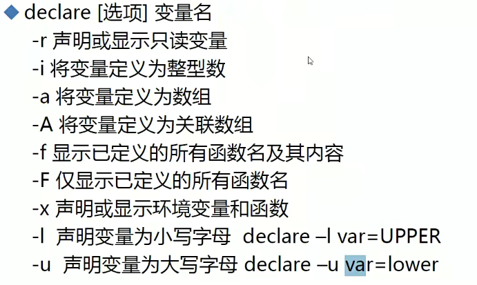
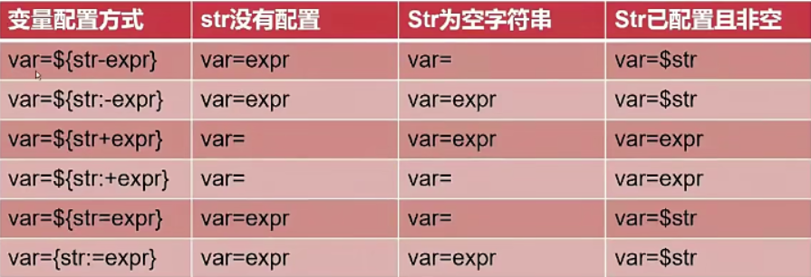
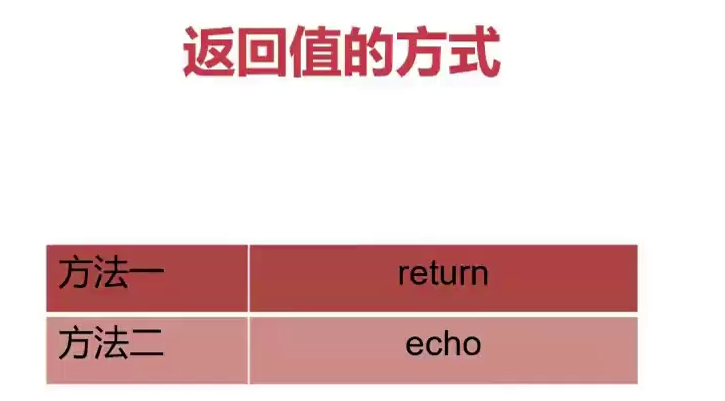
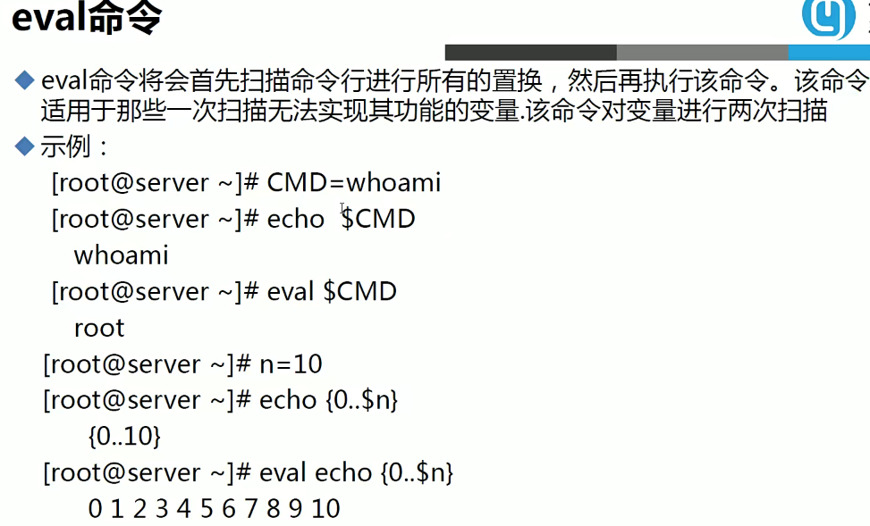
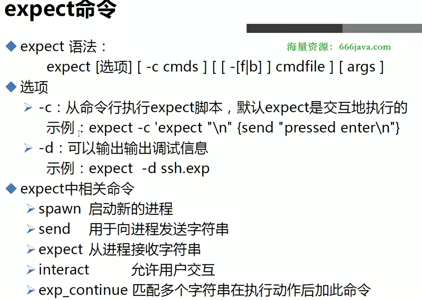
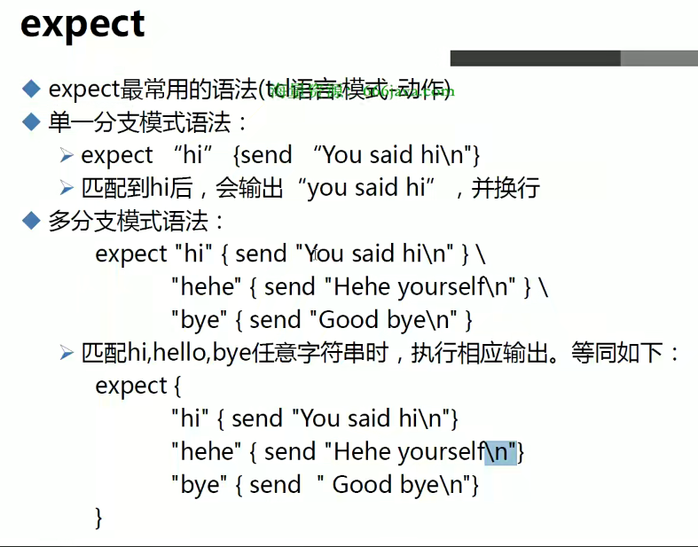
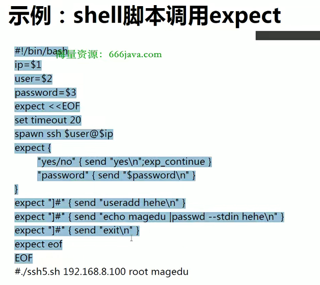
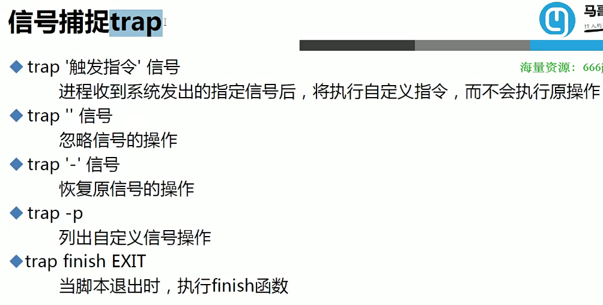
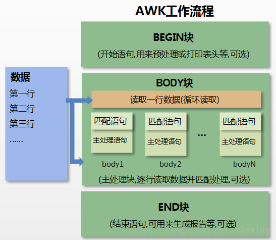
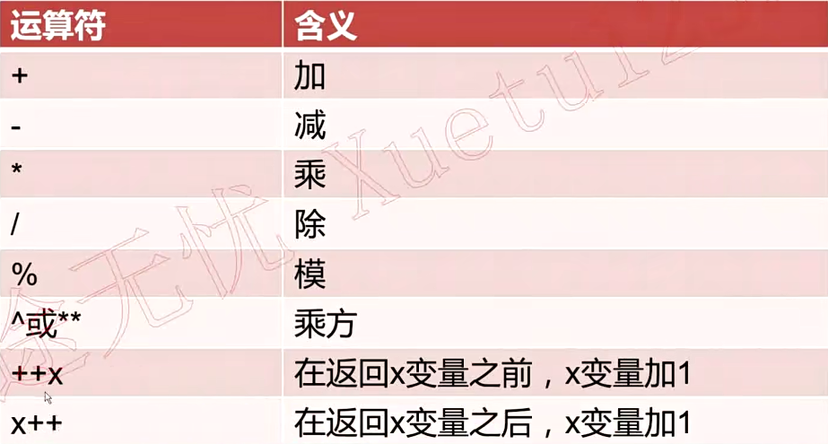

# 1 1.shell脚本概述

什么事Shell脚本？有人说shell脚本就是命令的堆叠，其实也不算错，但是严格来说的话，shell脚本其实是**特定的格式+特定的语法+命令**组成的，并不单单是命令的堆叠。

- 脚本的基本格式

```bash
#!/bin/bash
echo 'Hello world'
# 脚本文件一般以.sh结尾
```

- 运行脚本

```bash
# shell脚本一般有两种执行方法
# 1.赋予脚本可执行权限执行，这种方法必须写上脚本头(shebang),用来告诉系统用那种shell执行脚本
# ./是告诉系统在当前目录下找脚本，如果脚本路径存在于环境变量的话就可以不带./
./hello.sh

# 直接使用sh或bash解释器执行
sh hello.sh
```

- shell脚本特性
  - 命令补全和文件路径补全
  - 命令历史记忆功能history，由/etc/profile中的HISTORY定义可以存储多少历史命令
  - 别名功能alias、unalias
  - 快捷键
  - 前后台作业控制bg,fg,jobs,screen
    - screen -ls
    - screen -r id
    - screen -S name
  - 输入输出重定向
  - 管道| tee
  - 命令排序&& || 
  - shell通配符
    - \*匹配任意多个字符
    - ？匹配任意一个字符
    - []匹配括号中任意一个字符
    - ()在子shell中执行（umask 077;touch file）
    - {}集合 touch file{1..9..2}，seq
    - \转义符
  - echo输出颜色，printf格式化输出

```bash
echo -e "\033[31m 红色字 \033[0m"
printf  format-string  [arguments...]
```

## 1.1 1.Shell配置文件应用顺序

- 登录式Shell
  - /etc/profile->/etc/profile.d/\*.sh->\~/.bash_profile->\~.bashrc->/etc/bashrc
- 非登录式Shell
  - \~.bashrc->/etc/bashrc->/etc/profile.d/\*.sh

**Shell 的配置文件用于设置用户的环境变量、别名、函数等。修改了配置文件后，可用`source 文件`使配置文件生效**

# 2 2.运算符

## 2.1 1.算术运算符

下表列出了常用的算术运算符，假定变量 a 为 10，变量 b 为 20：

| 运算符 | 说明                                          | 举例                          |
| :----- | :-------------------------------------------- | :---------------------------- |
| +      | 加法                                          | `expr $a + $b` 结果为 30。    |
| -      | 减法                                          | `expr $a - $b` 结果为 -10。   |
| *      | 乘法                                          | `expr $a \* $b` 结果为  200。 |
| /      | 除法                                          | `expr $b / $a` 结果为 2。     |
| %      | 取余                                          | `expr $b % $a` 结果为 0。     |
| =      | 赋值                                          | a=$b 把变量 b 的值赋给 a。    |
| ==     | 相等。用于比较两个数字，相同则返回 true。     | [ $a == $b ] 返回 false。     |
| !=     | 不相等。用于比较两个数字，不相同则返回 true。 | [ $a != $b ] 返回 true。      |

**注意：**条件表达式要放在方括号之间，并且要有空格，例如: **[$a==$b]** 是错误的，必须写成 **[ $a == $b ]**。

## 2.2 2.关系运算符

关系运算符只支持数字，不支持字符串，除非字符串的值是数字。

下表列出了常用的关系运算符，假定变量 a 为 10，变量 b 为 20：

| 运算符 | 说明                                                  | 举例                       |
| :----- | :---------------------------------------------------- | :------------------------- |
| -eq    | 检测两个数是否相等，相等返回 true。                   | [ $a -eq $b ] 返回 false。 |
| -ne    | 检测两个数是否不相等，不相等返回 true。               | [ $a -ne $b ] 返回 true。  |
| -gt    | 检测左边的数是否大于右边的，如果是，则返回 true。     | [ $a -gt $b ] 返回 false。 |
| -lt    | 检测左边的数是否小于右边的，如果是，则返回 true。     | [ $a -lt $b ] 返回 true。  |
| -ge    | 检测左边的数是否大于等于右边的，如果是，则返回 true。 | [ $a -ge $b ] 返回 false。 |
| -le    | 检测左边的数是否小于等于右边的，如果是，则返回 true。 | [ $a -le $b ] 返回 true。  |

如果使用 **((...))** 作为判断语句，大于和小于可以直接使用 **>** 和 **<**

## 2.3 3.布尔运算符

下表列出了常用的布尔运算符，假定变量 a 为 10，变量 b 为 20：

| 运算符 | 说明                                                | 举例                                     |
| :----- | :-------------------------------------------------- | :--------------------------------------- |
| !      | 非运算，表达式为 true 则返回 false，否则返回 true。 | [ ! false ] 返回 true。                  |
| -o     | 或运算，有一个表达式为 true 则返回 true。           | [ $a -lt 20 -o $b -gt 100 ] 返回 true。  |
| -a     | 与运算，两个表达式都为 true 才返回 true。           | [ $a -lt 20 -a $b -gt 100 ] 返回 false。 |

`[[ ... ]]` 结构中，使用 `-a` 和 `-o` 来表示逻辑与（AND）和逻辑或（OR）已经被废弃

## 2.4 4.逻辑运算符

以下介绍 Shell 的逻辑运算符，假定变量 a 为 10，变量 b 为 20:

| 运算符 | 说明       | 举例                                       |
| :----- | :--------- | :----------------------------------------- |
| &&     | 逻辑的 AND | [[ $a -lt 100 && $b -gt 100 ]] 返回 false  |
| \|\|   | 逻辑的 OR  | [[ $a -lt 100 \|\| $b -gt 100 ]] 返回 true |

**使用||，如果前一个条件执行成功，则后一个条件不会执行**

## 2.5 5.字符串运算符

下表列出了常用的字符串运算符，假定变量 a 为 "abc"，变量 b 为 "efg"：

| 运算符 | 说明                                         | 举例                                                         |
| :----- | :------------------------------------------- | :----------------------------------------------------------- |
| =      | 检测两个字符串是否相等，相等返回 true。      | [ $a = $b ] 返回 false。                                     |
| =~     | 匹配正则                                     | if [[ $name =~ [Yy] ]];then echo "YES"; else echo "NO";fi<br>匹配Y或y |
| !=     | 检测两个字符串是否不相等，不相等返回 true。  | [ $a != $b ] 返回 true。                                     |
| -z     | 检测字符串长度是否为0，为0返回 true。        | [ -z $a ] 返回 false。                                       |
| -n     | 检测字符串长度是否不为 0，不为 0 返回 true。 | [ -n "$a" ] 返回 true。                                      |
| $      | 检测字符串是否不为空，不为空返回 true。      | [ $a ] 返回 true。                                           |

**注意在if中如果用引号包裹正则，会识别为字符，所以不能用引号。且[]不能使用=~**

## 2.6 6.文件测试运算符

文件测试运算符用于检测 Unix 文件的各种属性。

属性检测描述如下：

| 操作符  | 说明                                                         | 举例                      |
| :------ | :----------------------------------------------------------- | :------------------------ |
| -b file | 检测文件是否是块设备文件，如果是，则返回 true。              | [ -b $file ] 返回 false。 |
| -c file | 检测文件是否是字符设备文件，如果是，则返回 true。            | [ -c $file ] 返回 false。 |
| -d file | 检测文件是否是目录，如果是，则返回 true。                    | [ -d $file ] 返回 false。 |
| -f file | 检测文件是否是普通文件（既不是目录，也不是设备文件），如果是，则返回 true。 | [ -f $file ] 返回 true。  |
| -g file | 检测文件是否设置了 SGID 位，如果是，则返回 true。            | [ -g $file ] 返回 false。 |
| -k file | 检测文件是否设置了粘着位(Sticky Bit)，如果是，则返回 true。  | [ -k $file ] 返回 false。 |
| -p file | 检测文件是否是有名管道，如果是，则返回 true。                | [ -p $file ] 返回 false。 |
| -u file | 检测文件是否设置了 SUID 位，如果是，则返回 true。            | [ -u $file ] 返回 false。 |
| -r file | 检测文件是否可读，如果是，则返回 true。                      | [ -r $file ] 返回 true。  |
| -w file | 检测文件是否可写，如果是，则返回 true。                      | [ -w $file ] 返回 true。  |
| -x file | 检测文件是否可执行，如果是，则返回 true。                    | [ -x $file ] 返回 true。  |
| -s file | 检测文件是否为空（文件大小是否大于0），不为空返回 true。     | [ -s $file ] 返回 true。  |
| -e file | 检测文件（包括目录）是否存在，如果是，则返回 true。          | [ -e $file ] 返回 true。  |

其他检查符：

- **-S**: 判断某文件是否 socket。
- **-L**: 检测文件是否存在并且是一个符号链接。


# 3 3.shell变量

变量其实就是用一个固定的字符串去表示不固定的值

## 3.1 1.自定义变量

在shell中，自定义变量的格式为：

```bash
var=value
```

**命名只能使用英文字母，数字和下划线，首个字符不能以数字开头。**

定义了变量之后，就要引用变量，在shell中引用变量为

```bash
$var 或 ${var}
```

可能有人要问了，这两种方式有什么区别？{}有什么用？在shell中{}是用来界定变量的边界的，如：

```bash
[root@localhost ~]# ii=1
[root@localhost ~]# echo $ii
1
[root@localhost ~]# echo $ii1

[root@localhost ~]# echo ${ii}1
11
```

如果要查看变量可以使用`echo $var`，也可以使用`set`查看系统所有变量，包括自定义变量和环境变量，如果要取消就是`unset`。

```bash
[root@localhost ~]# set|grep ii
ii=1
[root@localhost ~]# unset ii
[root@localhost ~]# echo $ii

```

在Shell中可以直接使用`declare`和`typeset`命令来声明变量和设置变量属性，且这两个命令是等价的。



## 3.2 2.系统环境变量

在shell中，定义环境变量为：

```bash
export var=value
```

这种定义方式为在当前shell中定义，如果想在整个系统中使用，那么就把`export var=value`写入到`/etc/profile`或`/etc/profile.d/xx.sh`，并`source filename`。

如果要查看变量可以使用`echo $var`，也可以使用`env`查看系统所有变量，取消变量可以使用`unset`。

```bash
[root@localhost ~]# export ii=1
[root@localhost ~]# env|grep ii
ii=1
```

## 3.3 3.位置参数变量

当在执行脚本的时候后面跟上参数，在shell脚本中就可以用类似`$1`的方式引用，如

```bash
# 执行脚本
sh test.sh 1 2 3

# 引用位置参数,从1开始计数
# 注意第十个参数开始要写成${10}界定变量
echo $1 $2 $3
> 1 2 3
```

除了位置参数外，还可以在shell脚本中使用`read`来引用外部传入的变量，如：

```bash
#!/bin/bash
read -p "test" IP
echo $IP
# 在外部执行脚本时，会让用户输入一个值作为IP变量的值
```


## 3.4 4.预定义变量

在shell脚本中，除了可以直接引用环境变量外，还可以直接引用一些预定义好的变量

| 变量 | 说明                                              |
| ---- | ------------------------------------------------- |
| $0   | 脚本名，怎么执行的就怎么输出                      |
| $*   | 所有的参数，以"$1 $2 … $n"的形式输出所有参数。    |
| $@   | 所有的参数，以"$1" "$2" … "$n" 的形式输出所有参数 |
| $#   | 参数的个数                                        |
| $$   | 当前进程的PID                                     |
| $!   | 上一个进程的PID                                   |
| $?   | 上一个命令执行情况，执行成功为0                   |

## 3.5 5.变量赋值方式

1. 显式赋值：**var=value**

   ```bash
   # 这两个符号会把命令先执行再赋值给变量
   today=`date +%F`
   today=$(date +%F)
   ```

2. 输入赋值：

   ```bash
   read -n 3 -t 5 -p "提示信息" var1 var2
   # -n:定义输入文本的长度
   # -t:定义输入时间
   # -p:输入提示信息
   ```


**注意：''单引号是强引用，会把引号内容原样输出；""双引号是弱引用，会解析内部变量**

## 3.6 6.变量运算

1. 整数运算：expr

   ```bash
   $ expr 1 + 1
   2
   ```

2. 整数运算：$(()) / %[]

   ```bash
   $ echo $((1+1))
   $ echo $[2**2] # 幂运算
   ```

3. 整数运算：let

   ```bash
   $ let sum=1+1
   $ echo $sum
   2
   $ let sum++ # let sum+=1
   $ echo $sum
   3
   
   $ let a=i++ # 先赋值再运算
   $ echo $a
   1
   $ let b=++i # 先运算再赋值
   $ echo $b
   3
   ```

4. 小数运算：bc

   ```bash
   $ echo "2^4"|bc  # bc中指数表示方式其它方式不一样
   $ echo "sqrt(100)" | bc
   10
   $ echo 'scale=3;5/3'|bc
   1.666  # 使用scale定义精确度,也可以使用-l参数使用默认数学库
   $ echo 'ibase=16;obase=2;15F'|bc
   101011111 # ibase指定源进制;obase指定目标进制
   
   # bc计算器还能比较两个数的大小，可以用来对比两浮点数大小，1为真，0为假
   [root@192 ~]# echo "1.5>3.5"|bc
   0
   [root@192 ~]# echo "1.5<3.5"|bc
   1
   # 支持以下运算符
   >: 大于
   <: 小于
   >=: 大于等于
   <=: 小于等于
   ==: 等于
   !=: 不等于
   ```

**除了第一种整数运算方式，其余两种方式在引用变量时都不需要$符号**


## 3.7 7.变量内容替换

| 语法                         | 说明                                                       |
| ---------------------------- | ---------------------------------------------------------- |
| ${变量名#匹配规则}           | 从变量**开头**进行规则匹配，将符合**最短**的数据删除       |
| ${变量名##匹配规则}          | 从变量**开头**进行规则匹配，将符合**最长**的数据删除       |
| ${变量名%匹配规则}           | 从变量**尾部**进行规则匹配，将符合**最短**的数据删除       |
| ${变量名%%匹配规则}          | 从变量**尾部**进行规则匹配，将符合**最长**的数据删除       |
| ${变量名/旧字符串/新字符串}  | 变量内容符合旧字符串，则**第一个**旧字符串会被新字符串取代 |
| ${变量名//旧字符串/新字符串} | 变量内容符合旧字符串，则**全部的**旧字符串会被新字符串取代 |

> 变量测试



## 3.8 8.字符串处理

> 计算字符串长度

|        | 语法                  | 说明                         |
| ------ | --------------------- | ---------------------------- |
| 方法一 | ${#string}            |                              |
| 方法二 | expr length "$string" | string有空格，则必须加双引号 |

> 获取字符在字符串中的索引位置

| 语法 | expr index $string $substring |
| ---- | ----------------------------- |

```bash
expr index "$a"  ov  # 将substring拆成一个个字符去查找，最先找到的直接输出 
```

> 算子串长度

| 语法 | expr match $string substr |
| ---- | ------------------------- |

```bash
expr match $string substr # substr必须从头开始匹配，不然匹配不了
```

> 抽取子串


> 如果使用expr方式，则索引从1开始

## 3.9 9.间接变量引用

```bash
# 间接变量：使用一个变量存储另一个变量的名
[root@cloud trap]# c=b
[root@cloud trap]# b=3
[root@cloud trap]# echo ${!c}
3
```


# 4 4.条件测试

**if语句格式**

```bash
# if...else
if condition
then
    command1 
    command2
    ...
    commandN
else
    command
fi

# if...else-if else
if condition1
then
    command1
elif condition2 
then 
    command2
else
    commandN
fi
```

一般来说，Shell中一般有三种condition格式

1. test 条件表达式

```bash
# Shell中test命令用于检查某个条件是否成立，可以对数值、字符和文件进行测试
test -d /var/lib/mysql || mkdir /var/lib/mysql
```

2. [ 条件表达式 ] : [[]]是[]的扩展

3. (( 条件表达式 ))

**(())在数值判断的时候可以直接使用>,<，但是不能使用-lt之类的算术运算符;[]与之相反，[[]]是[]的扩展，支持使用=~正则匹配，而其他condition格式不支持。且[[]]支持逻辑运算符，其他格式均只能使用布尔运算符**


## 4.1 1.判断磁盘使用率

```bash
#!/bin/bash
dfusage=`df -h |awk '{print $5}'|tail -n +2`
for i in $dfusage;do
     if test `echo ${i%*\%}` -lt 80;then
        echo $i
     fi
done
```

## 4.2 2.判断内存使用率

```bash
#!/bin/bash
# 返回两个数，用小括号代表为一个数组
Memlist=(`free |sed -n '2p'|awk '{print $2,$3}'`)
# bc计算时小于1不会显示0，如0.25，会显示.25
Usage=$(printf "%.2f" `echo "scale=3;${Memlist[1]}/${Memlist[0]}"|bc`)
# shell不能直接进行小数对比，所以用bc命令比较
if [ $(echo "$Usage < 0.3"|bc) -eq 1 ];then
   echo "$Usage"
fi
```

# 5 5.流程控制

## 5.1 case语句

- 语法

  ```bash
  case $var in
  pattern1)
  command
  ;;
  pattern2)
  command
  ;;
  esac
  ```

- 根据输入选择流程

  ```bash
  #!/bin/bash
  read -p "请输入你的系统：" SYS
  case $SYS in
  CentOS)
  echo $SYS
  ;;
  redhat)
  echo $SYS
  ;;
  *)
  echo "USAGE:CentOS|redhat"
  esac
  ```

# 6 6.循环语句

- for...in

  ```bash
  [root@localhost project]# for i in {1..10};do
  > echo $i
  > done
  1
  2
  3
  4
  5
  6
  7
  8
  9
  10
  ```

- for

  ```bash
  [root@localhost project]# for((i=0;i<10;i++));do
  > echo $i
  > done
  0
  1
  2
  3
  4
  5
  6
  7
  8
  9
  ```

- while

  ```bash
  int=1
  while(( $int<=5 ))
  do
      echo $int
      let "int++"
  done
  ```

- break：中止循环

- continue：中止本层循环

# 7 7.数组

- 普通数组：`a=(1 2 3)`/`declare -a a=(1 2 3)`

  ```bash
  # 针对每个索引进行赋值,shell不会对空索引进行填值，如：a[3]=1，那么前面的0/1/2索引的值为空
  arr[0]=a
  arr[1]=b
  arr[2]=c
  
  # 赋予多个值
  a=(1 2 3)
  
  # 读取文件作为数组值
  a=(`cat /etc/passwd`)
  ```

- 关联数组：`declare -A var`

  ```bash
  # 一个个复制
  a[a]=1
  a[b]=2
  
  # 多个复制
  a=([a]=1 [b]=2)
  ```

- 查看数组的全部索引：`echo ${!var[@]}`

- 查看定义的全部数组/关联数组：`declare -a`、`declare -A`
- 统计数组元素个数：`echo ${#var[@]}`
- 查看数组元素的长度：`echo ${#var[0]}`
- 查看数组的全部值：`echo ${var[@]}`
- 查看数组的某个值：`echo ${var[0]}`
- 数组切片：跟字符串一样

## 7.1 1.读取文件并赋值给数组

```bash
#!/bin/bash
#declare -A host_array
while read line
do
        # 下标自增1
        host_array[++i]="$line"
done < /etc/hosts
echo "数组的值为：${host_array[@]}"
echo "数组的下标为：${!host_array[@]}"
```


# 8 8.函数

> 函数介绍

- Linux Shell中的函数和大多数编程语言中的函数一样
- 将相似的任务或代码封装到函数中，供其他地方调用

> 函数定义


> 函数调用

- 直接使用函数名调用，可以想象为Shell中的一条命令
- 函数内部可以直接使用参数$1、$2.....$n
- 调用函数：function_name $1 $2

```bash
# 把一个检查nginx进程是否存在的功能封装成一个函数
#!/bin/bash

function check
{
        this_pid=$$ # 获得执行这个脚本的进程号，函数中也可以使用预定义变量
        ps -ef | grep nginx | grep -v grep | grep -v $this_pid # 把自己进程号也排除，避免脚本名带有nginx导致结果出错
        echo $?
}
check
```


## 8.1 1.函数返回值



> 使用retuen

- 使用return返回值，只能返回1-255的整数
- 函数使用return返回值，通常只是用来供其他地方调用获取状态，因此通常近返回0或1
- 可以被$?获取

> 使用echo

- 可以返回任何字符串结果
- 通常用于返回数据，一个字符串

> exit

- exit是用来给脚本返回值的，一旦使用的exit，不管在哪里使用，立即退出脚本
- 返回值可以用`$?`获取


## 8.2 2.局部变量和全局变量

> 全局变量

- 不做特殊声明，Shell中变量都是全局变量
  - 若在函数内部定义，没调用函数之前，此变量不存在
  - 调用之后，此变量会变成全局变量

- Tips：大型脚本程序中函数中慎用全局变量

> 局部变量

- 定义变量时，使用local关键字
- 函数内外若存在同名变量，则函数内部变量覆盖外部变量


## 8.3 3.函数库

> 为什么要定义函数库

- 经常使用的重复代码封装成函数文件
- 一般不直接执行，而是由其他脚本调用

```bash
# 创建base_function文件
function add
{
        echo `expr $1 + $2`
}
       

# 然后在脚本文件中引用
. 绝对路径/文件名  # .或source都行，但是都要求绝对路径。在命令行中可以使用相对路径
add 1 2
```

- 库文件名的后缀是任意的，但一般使用.lib
- 库文件通常没有可执行选项
- 库文件无需和脚本在同一目录，只需在脚本中引用时指定
- 第一行一般使用#!/bin/echo,输出警告信息，避免用户执行


# 9 9.eval命令




# 10 10.expect命令

expect是由Don Libes基于Tcl语言开发的，主要应用于自动化交互式操作的场景，借助expect处理交互的命令，可以将交互过程如：ssh登录，ftp登录等写在一个脚本上，使之自动化完成。尤其适用于需要对多态服务器执行相同操作的环境中，可以大大提高系统管理人员的工作效率








# 11 11.trap命令：信号捕捉



```bash
#!/bin/bash
trap 'echo press ctrl+c' int
trap -p
for((i=0;i<=10;i++));do
        echo $i
        sleep 10
done

[root@cloud trap]# sh trap.sh 
trap -- 'echo press ctrl+c' INT
0
1
2
3
4
5
6
press ctrl+c
7
8
9
^Cpress ctrl+c
10
```


# 12 12.mktemp命令：创建临时文件

`mktemp` 命令用于创建临时文件或目录，提供了一种安全的方法来生成唯一的文件名或目录名，避免了命名冲突的可能性。在创建临时文件或目录时，`mktemp` 会自动生成一个唯一的文件名或目录名，并返回该路径。

- 基本语法：

```bash
mktemp [OPTION]... [TEMPLATE]
```

- `OPTION`: 可选参数，用于指定 `mktemp` 命令的行为。
- `TEMPLATE`: 可选参数，用于指定生成的文件名或目录名的模板。

- 常用选项：

| 选项                 | 说明                                                         |
| -------------------- | ------------------------------------------------------------ |
| -d                   | 创建一个临时目录                                             |
| -u                   | 生成一个唯一的文件名或目录名，但并不创建实际的文件或目录     |
| **`--tmpdir[=DIR]`** | 指定临时文件或目录的父目录。如果未提供，则使用环境变量 `TMPDIR`，如果 `TMPDIR` 不存在，则使用 `/tmp` |
| -t                   | 用于指定 `mktemp` 创建临时文件时使用的文件名模板（template）。`XXXXXX` 是一个占位符，`mktemp` 会将其替换为一个唯一的字符串，以确保生成的文件名是唯一的。 |

**注意：生成的临时文件并不会自动删除，需要手动使用rm命令删除，如果你想在脚本退出的时候删除临时文件，可以使用`trap 'rm -f $tmpfile' EXIT`**


# 13 13.正则表达式

# 14 14.grep命令

Linux grep (global regular expression) 命令用于查找文件里符合条件的字符串或正则表达式。

grep的工作方式是这样的，它在一个或多个文件中搜索字符串模板。如果模板包括空格，则必须被引用，模板后的所有字符串被看作文件名。搜索的结果被送到屏幕，不影响原文件内容。

- 命令格式

```bash
grep [options] pattern [files]
```

- 常用选项

| 选项 | 说明                          |
| ---- | ----------------------------- |
| -i   | 忽略大小写                    |
| -v   | 反向查找                      |
| -o   | 只输出匹配的值                |
| -E   | 使用扩展正则，也可以使用egrep |
| -r   | 遍历目录查找                  |
| -n   | 显示匹配的行号                |
| -e   | 指定模式(默认)                |

> egrep与grep -E等价
>
> 基本正则和扩展正则的区别主要在于一些元字符的使用。基本正则中，有些元字符（? [+ {} | ()）需要加 \ 转义才能表示特殊含义，而扩展正则中，这些元字符不需要转义就能表示特殊含义，反而要加 \ 才能表示字面值。例如，在基本正则中，a\+b 表示匹配一个或多个 a 后面跟一个 b ，而在扩展正则中，a+b 表示同样的意思。除此之外，基本正则和扩展正则的语法大致相同。
>
> 一般来说，扩展正则比基本正则更简洁和易读，也更接近于其他编程语言中的正则表达式。如果您的工具支持扩展正则，那么建议您优先使用扩展正则。但是，有些情况下，基本正则可能更方便或兼容性更好。例如，如果您需要匹配一些字面上包含 ? + {} | () 的字符串，那么在基本正则中不需要转义就可以直接匹配，而在扩展正则中需要加 \ 转义。另外，有些工具或系统可能只支持基本正则而不支持扩展正则，这时候就只能用基本正则了。

```bash
# 搜索文件中以root或mail开头的行
grep -Ee '^root|^mail' /etc/passwd
```


# 15 15.sed命令

sed(Stream Editor)是一种在线的、非交互式的流编辑器，它一次处理一行内容。处理时，把当前处理的行存储在临时缓冲区中，称为模式空间

接着用sed命令处理缓冲区中的内容，处理一行完成后，把缓冲区的这一行内容送往屏幕。文件内容不会改变，除非使用重定向存储输出。

sed主要用来自动编辑一个或多个文件；简化对文件的反复操作；编写转换程序等。

- 命令格式

```bash
sed [options] 'command' file[file....]
```

sed和grep不一样，不管是否找到指定模式，退出状态都是0.只有语法错误时，sed的退出状态才是非0.

- 常用选项

| 选项 | 说明             |
| ---- | ---------------- |
| -r   | 使用ERE          |
| -e   | 允许使用多项编辑 |
| -n   | 取消默认输出     |
| -i   | 直接修改对应文件 |
| -f   | 指定脚本文件     |

- 常用命令动作

| 动作 | 说明                                                     | 案例                                                         | 注解                                       |
| ---- | -------------------------------------------------------- | ------------------------------------------------------------ | ------------------------------------------ |
| a    | 在当前行后添加一行或多行                                 | sed '1,3a 45\n6' passwd<br>#在1-3行后面都加上两行，内容分别是45和6 | 如果\n直接跟在a的后面的话要\\\n对\进行转义 |
| c    | 用新文本替换当前行的文本                                 | sed  '/^4/c 5' passwd<br>#把4开头的行内容换成5<br>sed  '2c 5' passwd<br>#把第二行的内容换成5 |                                            |
| d    | 删除行                                                   | sed '/^4/d' passwd <br># 把4开头的行删除                     |                                            |
| i    | 在当前行之前插入文本                                     |                                                              | 跟a用法一样                                |
| p    | 打印匹配到的内容的行                                     | sed -n '/^4/p' passwd <br>#匹配到4开头的行打印               | 一般与-n选项搭配使用，只输出匹配的内容     |
| n    | 读入下一行输入行，从下一条命令处理                       | sed   '1{n;d}' passwd <br>#把第一行的下一行删除              |                                            |
| N    | 取这一行和下一行一起处理。两行内容以换行符连接           | sed 'N;s#\n#=#g' a<br>#把匹配的这一行和下一行内容一起处理，并把换行符替换为= |                                            |
| !    | 对所选行之外的所有行应用命令                             | sed -n '/^4/!p' passwd<br>#输出除了以4开头的行               |                                            |
| s    | 替换标志，替换每行出现的第一个                           | sed 's/root/4/' test <br>#将行内第一个root改成4<br>sed 's/^root/&4/' test <br>#将以root行开头的行的第一个root字符后面加一个4<br>sed 's/root/4/2' test<br>#只替换第二个 | s动作必须有/结尾                           |
| g    | 在行内进行全局匹配                                       | sed 's/root/4/g' test<br>sed 's/root/4/2g' test<br>#替换第二个到最后一个 | 搭配s使用，全局替换                        |
| i    | 忽略大小写                                               | sed 's/root/4/gi' test                                       | 搭配s使用，忽略大小写                      |
| r    | 从文件中读入                                             | sed -ni '1r t' passwd                                        |                                            |
| w    | 将内容写入文件                                           | sed -n '1w new' passwd <br>#将passwd第一行写到new文件中      |                                            |
| h    | 把模式空间里的内容覆盖到暂存缓冲区                       |                                                              |                                            |
| H    | 把模式空间里的内容追加到暂存缓冲区                       |                                                              |                                            |
| g    | 取出暂存缓冲区的内容，将其复制到模式空间，覆盖原有内容   |                                                              |                                            |
| G    | 取出暂存缓冲区的内容，将其复制到模式空间，追加到原有内容 |                                                              |                                            |

**sed命令一般有行匹配和模式匹配,//使用模式匹配；在sed中使用,分隔多种匹配模式，以;分隔命令模式`sed -n '/^root/,+1p' test`,将以root开始的行和下一行输出。**

**sed中使用{}来为命令分组**

```bash
# 在第一行后面插入4，再输出第一行
[root@localhost project]# sed -n '1{a 4'$'\n;p}' 1.txt 
 1  1 1 1
4
```


# 16 16.awk

awk是一种编程语言，用于在Linux/Unix下对文本和数据进行处理。数据可以来自标准输入、一个或多个文件，或其他命令的输出。它支持用户自定义函数和动态正则表达式等先进功能，是一个强大的文本处理工具。

awk的处理文本和数据的方式是这样的，逐行扫描文件，从第一行到最后一行，寻找匹配的特点模式的行，并在这些行上进行想要的操作。如果没有指定处理动作，则把匹配的行显示到标准输出；如果没有指定模式，则所有被操作的行都被处理

- 语法格式 

```bash
awk [options] 'commands' filenames
```

- 常用选项

| 选项 | 说明                                   | 例子                                                         |
| ---- | -------------------------------------- | ------------------------------------------------------------ |
| -F   | 定义输入字段分隔符，默认是空格或制表符 | 跟BEGIN{FS=":"}方式一样                                      |
| -v   | 传入变量                               | awk -vb=$a 'BEGIN{print b}'<br>awk 'BEGIN{b='"$a"';print b}' |
| -f   | 指定脚本文件                           |                                                              |

```bash
# 原文件
Sat May 19 13:40:02 CST 2015 is 1322135465
Sat May 19 14:50:02 CST 2015 is 132465
Sat May 19 13:10:02 CST 2015 is 13225465
Sat May 19 4:55:02 CST 2015 is 15465
Sat May 19 1:40:02 CST 2015 is 1135465
Sat May 19 3:40:02 CST 2015 is 1322135
Sat May 19 23:40:02 CST 2015 is 132213546

# 在awk中使用外部shell命令且使用awk变量
awk -F"is" '{print "echo $(date +%F -d\""$1"\")",$2}' t.txt |bash
# 在awk中使用外部变量
awk '{print '"$a"'}' t.txt 
```


- 内部变量

| 内部变量 | 说明                       | 案例                                                |
| -------- | -------------------------- | --------------------------------------------------- |
| $0       | 当前行内容                 |                                                     |
| NR       | 处理行号；控制输出的总行数 | awk 'NR<=3{print $1}' a<br>打印前三行               |
| FNR      | 把文件行号分别输出         | awk '{print NR,$0}' a a<br>把两个文件的行号分开记录 |
| NF       | 行内域总数                 |                                                     |
| FS       | 行内段分隔符               |                                                     |
| OFS      | 输出段分隔符               |                                                     |
| RS       | 指定行分隔符               |                                                     |
| ORS      | 指定输出行分隔符           |                                                     |
| FILENAME | 当前输入的文件名字         |                                                     |


- commands

```bash
#BEGIN{}    {}     END{}
#行处理前    行处理   行处理后
# a文件一共有10行
[root@localhost project]# awk 'BEGIN{print "开始"} {print "ok"} END{print "end"}' a
开始
ok
ok
ok
ok
ok
ok
ok
ok
ok
ok
end
```

```bash
# 行内分隔符为:，匹配以1开头的行输出匹配的第一个域
# -F跟BEGIN{FS=":"}等价
[root@localhost project]# awk -F: '/^1/{print $1}' a
1
10
```

## 16.1 1.工作原理

AWK的工作流程可以分为三个部分：

- BEGIN块：在读取输入文件之前执行的代码段，只执行一次，一般用于初始化变量或输出表头等
- 主体块：对于每一个输入的行都会执行一次主体块的代码，可以指定匹配模式或条件，也可以省略，默认匹配所有行
- END块：在读取输入文件之后执行的代码段，只执行一次，一般用于输出最终结果或清理工作



1. 通过关键字BEGIN执行BEGIN块内容
2. 完成BEGIN块的执行，开始执行BODY块
3. 读取有`\n`换行符分隔的记录
4. 将记录按指定的域分隔符划分域，填充域`$0`表示所有域(即一行内容)，`$1`表示第一个域，以此类推
5. 依次执行各BODY块，pattern部分匹配该行内容成功后，才回执行awk-commands的内容
6. 循环读取并执行各行直到文件结束，完成body块执行
7. 开始END块执行，END块可以输出最终结果

> AWK是逐行读取输入文件的，每一行被称为一条记录，记录的编号由NR变量保存。AWK会将每一条记录按照指定的分隔符划分为若干个字段，字段的编号由NF变量保存。默认的分隔符是空格或制表符，但是你可以使用-F选项或FS变量来指定其他的分隔符

- 命令：awk -F: '{print $1,$3}' /etc/passwd

1. awk使用一行作为输入，并将这一行赋给内部变量$0，每一行也可称为一个记录，以换行符结束
2. awk进行字段分解，每个字段存储在已编号的变量中，从$1开始，最多达100个字段
3. awk使用内部变量FS来确定字段分隔符，初始为空格
4. awk打印字段，使用设置的方法print函数打印
5. awk在打印的字段间加上空格，因为$1,$3之间有个逗号。逗号比较特殊，它会被映射为OFS(输出字段分隔符)内部变量，默认为空格
6. awk输出之后，将从文件中获取另一行，重复处理操作，直到处理完成。

## 16.2 2.awk格式化输出printf

> printf的格式化说明符


> 使用print默认换行符为分隔符；使用printf不使用任何分隔符，需自己指定
>
> `awk 'BEGIN{FS=":"}{printf "%s\n",$1}' /etc/passwd`
>
> PS:最好用`''`包裹命令，如果用`""`会把命令中的变量当做是shell变量而不是awk变量
>
> 且命令中有特殊含义的值最好用`""`包裹，否则会被当成字符串如`FS=":"`


## 16.3 3.匹配模式

- //：模式匹配

```bash
# 匹配以root开头的行
awk '/^root/{print $0}' /etc/passwd
# 匹配不以root开头的行
awk '!/^root/{print $0}' /etc/passwd
```

- ~：正则匹配

```bash
# 匹配第一个域以root开头的行
awk -F: '$1 ~ /^root/{print $0}' /etc/passwd
# 匹配第一个域不以root开头的行
awk -F: '$1 ！~ /^root/{print $0}' /etc/passwd
```

**模式匹配与正则匹配的区别在于：模式匹配整行，正则可以匹配具体字符**

awk也可以直接使用关系运算符判断

```bash
awk -F: '$1=="root"' /etc/passwd
```

- 运算



```bash
awk -F: '{if($3*10>50000){print $0} else{print $3}}' /etc/passwd
```

- 逻辑

```bash
# 逻辑与
awk '$0 ~ /^1/ && $0 > 9 {print $0} ' a
# 逻辑或
awk '$0 ~ /^1/ || $0 >= 9 {print $0} ' a
# 非
awk '!($0 ~ /^1/ || $0 >= 9) {print $0} ' a
```

## 16.4 3.条件判断

```bash
awk -F: '{if($3<50){print $0} else{print $3}}' /etc/passwd
awk '{if($0>5) {print 1} else if($0>3){print 2} else{print 3}} ' a
awk 'BEGIN{RS=":"} {print RS!=":"?"ok":"1"}' 1.txt 
```

## 16.5 4.循环

```bash
for(i=0;i<=50;i++){print i}
for(i in username){print username[i]}
while(i<=10){sum+=i;i++};print sum}
```

## 16.6 5.数组

awk数组是一种关联数组，也就是说，数组的索引可以是数字或字符串，不需要提前声明数组的大小。也不需要按照顺序赋值

- 语法格式：array_name[index]=value
- 删除：delete array_name[index]；不指定索引则删除整个数组
- 乱序遍历：for(var in array_name){action};var是array_name的索引
- awk数组的长度的语法格式是：length(array_name)，其中array_name是数组的名称。这个函数可以返回数组的元素个数，也可以返回字符串的字符个数。
- awk数组的排序的语法格式是：asort(array_name)或asorti(array_name)，其中array_name是数组的名称。这两个函数可以对数组进行排序，asort是按照数组的元素值排序，asorti是按照数组的索引排序。排序后，原数组的顺序会被改变，如果不想改变原数组，可以使用另一个数组来接收排序的结果。

```bash
BEGIN {
    a["a"] = 100
    a["b"] = 110
    a["c"] = 10
    # 按照数组的值排序
    n = asort(a, b) # 将数组a按照值排序，返回排序后的数组b，n是数组的长度
    for (i = 1; i <= n; i++) {
        print i, b[i]
    }
    # 按照数组的索引排序
    n = asorti(a, c) # 将数组a按照索引排序，返回排序后的数组c，n是数组的长度
    for (i = 1; i <= n; i++) {
        print i, c[i], a[c[i]]
    }
}

####输出
1 10
2 100
3 110
1 a 100
2 b 110
3 c 10
```

- 统计/etc/passwd中各种类型shell数量

  ```bash
  awk -F: '{shell[$7]++} END{for(i in shell){print i,shell[i]}}' /etc/passwd
  ```

- 统计15-19点的pv

  ```bash
  awk '$4>="[25/Jan/2018:15:00:00" && $4<="[25/Jan/2018:19:00:00"{print $4}' log.nginx|wc -l
  ```


