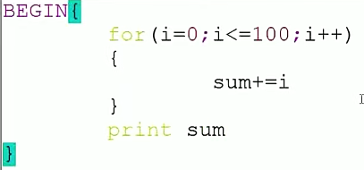

# 1.变量的高级用法

## 1.1.变量替换和测试

> 变量替换

| 语法                         | 说明                                                       |
| ---------------------------- | ---------------------------------------------------------- |
| ${变量名#匹配规则}           | 从变量**开头**进行规则匹配，将符合**最短**的数据删除       |
| ${变量名##匹配规则}          | 从变量**开头**进行规则匹配，将符合**最长**的数据删除       |
| ${变量名%匹配规则}           | 从变量**尾部**进行规则匹配，将符合**最短**的数据删除       |
| ${变量名%%匹配规则}          | 从变量**尾部**进行规则匹配，将符合**最长**的数据删除       |
| ${变量名/旧字符串/新字符串}  | 变量内容符合旧字符串，则**第一个**旧字符串会被新字符串取代 |
| ${变量名//旧字符串/新字符串} | 变量内容符合旧字符串，则**全部的**旧字符串会被新字符串取代 |

> 变量测试


## 1.2.字符串处理

> 计算字符串长度

|        | 语法                  | 说明                         |
| ------ | --------------------- | ---------------------------- |
| 方法一 | ${#string}            |                              |
| 方法二 | expr length "$string" | string有空格，则必须加双引号 |

> 获取字符在字符串中的索引位置

| 语法 | expr index $string $substring |
| ---- | ----------------------------- |

```bash
expr index "$a"  ov  # 将substring拆成一个个字符去查找，最先找到的直接输出 
```

> 算子串长度

| 语法 | expr match $string substr |
| ---- | ------------------------- |

```bash
expr match $string substr # substr必须从头开始匹配，不然匹配不了
```

> 抽取子串


> 如果使用expr方式，则索引从1开始


## 1.3.字符串处理练习

```bash
#!/bin/bash

echo "请选择："
echo "（1）、打印string长度"
echo "（2）、删除字符串中所有的Hadoop"
echo "（3）、替换第一个Hadoop为Mapreduce"
echo "（4）、替换全部Hadoop为Mapreduce"
read  -p "请选择：" num  # 获取用户输入
str="Bigdata process framework is Hadoop,Hadoop is an open source project"

if (($num==1))
then
        expr length "$str"
elif (($num==2))
then
        echo "${str//Hadoop/}"
elif (($num==3))
then
        echo "${str/Hadoop/Mapreduce}"
else
        echo "${str//Hadoop/Mapreduce}"
fi


```


## 1.4.命令替换

|        | 语法格式    |
| ------ | ----------- |
| 方法一 | \`command\` |
| 方法二 | $(command)  |

> 这两种方式都是等价的，推荐使用$();缺点是极少数UNIX可能不支持，但是``都是支持的。$(())主要用来进行整数运算，引用变量前可以加$,也可以不加


## 1.5.有类型变量

> declare和typeset命令

- declare命令和typeset命令是等价的
- 都是用来定义变量类型的


- 定义数组
  - declare -a 数组名
  - array=(1 2 3)

- 输出数组内容：
  - echo ${array[@]}：输出全部内容
  - ${array[1]}：输出下标为1的内容

- 获取数组长度：
  - ${#array[@]}：数组元素个数
  - ${#array[1]}：数组下标为1的元素长度

- 给数组下标赋值：
  - array[0]="lili"：给数组下标为0的位置赋值
  - 如果下标数大于数组长度，则会在数组尾部赋值

- 删除元素：
  - unset array[2]：清除元素
  - unset array：清除数组
  - **就算删除了数组中的元素，但是数组中的元素的下标还是没删除之前的**

- 分片访问：
  - ${array[@]:1:4}：显示数组下标1-3的元素

- 数组的遍历

  ```bash
  for i in ${arr[@]}
  do
  	echo $i
  done
  ```


- -A：定义关联数组

  ```bash
  declare -A site # declare -A site=(["google"]="www.google.com" ["runoob"]="www.runoob.com" ["taobao"]="www.taobao.com")
  site["google"]="www.google.com"
  site["runoob"]="www.runoob.com"
  site["taobao"]="www.taobao.com"
  
  echo ${site["runoob"]}
  ```

  


## 1.6.整数运算

|        | 语法                      |
| ------ | ------------------------- |
| 方法一 | expr $num1 operator $num2 |
| 方法二 | $(($num1 operator $num2)) |


> 当进行数值比较时，推荐使用expr，进行数值运算的时候用$(())。都只能进行整数运算
>


## 1.7.浮点数运算

> bc命令

- bc时bash内建的运算器，支持浮点数运算
- 内建变量scale可以设置，默认为0


> bc是交互性运算器，若想直接在脚本中使用，则`echo "12+23" | bc`通过管道符传输


## 1.8.运算符

### 1.8.1.算术运算符

下表列出了常用的算术运算符，假定变量 a 为 10，变量 b 为 20：

| 运算符 | 说明                                          | 举例                          |
| :----- | :-------------------------------------------- | :---------------------------- |
| +      | 加法                                          | `expr $a + $b` 结果为 30。    |
| -      | 减法                                          | `expr $a - $b` 结果为 -10。   |
| *      | 乘法                                          | `expr $a \* $b` 结果为  200。 |
| /      | 除法                                          | `expr $b / $a` 结果为 2。     |
| %      | 取余                                          | `expr $b % $a` 结果为 0。     |
| =      | 赋值                                          | a=$b 把变量 b 的值赋给 a。    |
| ==     | 相等。用于比较两个数字，相同则返回 true。     | [ $a == $b ] 返回 false。     |
| !=     | 不相等。用于比较两个数字，不相同则返回 true。 | [ $a != $b ] 返回 true。      |

**注意：**条件表达式要放在方括号之间，并且要有空格，例如: **[$a==$b]** 是错误的，必须写成 **[ $a == $b ]**。


### 1.8.2.关系运算符

关系运算符只支持数字，不支持字符串，除非字符串的值是数字。

下表列出了常用的关系运算符，假定变量 a 为 10，变量 b 为 20：

| 运算符 | 说明                                                  | 举例                       |
| :----- | :---------------------------------------------------- | :------------------------- |
| -eq    | 检测两个数是否相等，相等返回 true。                   | [ $a -eq $b ] 返回 false。 |
| -ne    | 检测两个数是否不相等，不相等返回 true。               | [ $a -ne $b ] 返回 true。  |
| -gt    | 检测左边的数是否大于右边的，如果是，则返回 true。     | [ $a -gt $b ] 返回 false。 |
| -lt    | 检测左边的数是否小于右边的，如果是，则返回 true。     | [ $a -lt $b ] 返回 true。  |
| -ge    | 检测左边的数是否大于等于右边的，如果是，则返回 true。 | [ $a -ge $b ] 返回 false。 |
| -le    | 检测左边的数是否小于等于右边的，如果是，则返回 true。 | [ $a -le $b ] 返回 true。  |


### 1.8.3.布尔运算符

下表列出了常用的布尔运算符，假定变量 a 为 10，变量 b 为 20：

| 运算符 | 说明                                                | 举例                                     |
| :----- | :-------------------------------------------------- | :--------------------------------------- |
| !      | 非运算，表达式为 true 则返回 false，否则返回 true。 | [ ! false ] 返回 true。                  |
| -o     | 或运算，有一个表达式为 true 则返回 true。           | [ $a -lt 20 -o $b -gt 100 ] 返回 true。  |
| -a     | 与运算，两个表达式都为 true 才返回 true。           | [ $a -lt 20 -a $b -gt 100 ] 返回 false。 |


### 1.8.4.逻辑运算符

以下介绍 Shell 的逻辑运算符，假定变量 a 为 10，变量 b 为 20:

| 运算符 | 说明       | 举例                                       |
| :----- | :--------- | :----------------------------------------- |
| &&     | 逻辑的 AND | [[ $a -lt 100 && $b -gt 100 ]] 返回 false  |
| \|\|   | 逻辑的 OR  | [[ $a -lt 100 \|\| $b -gt 100 ]] 返回 true |

**使用||，如果前一个条件执行成功，则后一个条件不会执行**


### 1.8.5.字符串运算符

下表列出了常用的字符串运算符，假定变量 a 为 "abc"，变量 b 为 "efg"：

| 运算符 | 说明                                         | 举例                     |
| :----- | :------------------------------------------- | :----------------------- |
| =      | 检测两个字符串是否相等，相等返回 true。      | [ $a = $b ] 返回 false。 |
| !=     | 检测两个字符串是否不相等，不相等返回 true。  | [ $a != $b ] 返回 true。 |
| -z     | 检测字符串长度是否为0，为0返回 true。        | [ -z $a ] 返回 false。   |
| -n     | 检测字符串长度是否不为 0，不为 0 返回 true。 | [ -n "$a" ] 返回 true。  |
| $      | 检测字符串是否不为空，不为空返回 true。      | [ $a ] 返回 true。       |


### 1.8.6.文件测试运算符

文件测试运算符用于检测 Unix 文件的各种属性。

属性检测描述如下：

| 操作符  | 说明                                                         | 举例                      |
| :------ | :----------------------------------------------------------- | :------------------------ |
| -b file | 检测文件是否是块设备文件，如果是，则返回 true。              | [ -b $file ] 返回 false。 |
| -c file | 检测文件是否是字符设备文件，如果是，则返回 true。            | [ -c $file ] 返回 false。 |
| -d file | 检测文件是否是目录，如果是，则返回 true。                    | [ -d $file ] 返回 false。 |
| -f file | 检测文件是否是普通文件（既不是目录，也不是设备文件），如果是，则返回 true。 | [ -f $file ] 返回 true。  |
| -g file | 检测文件是否设置了 SGID 位，如果是，则返回 true。            | [ -g $file ] 返回 false。 |
| -k file | 检测文件是否设置了粘着位(Sticky Bit)，如果是，则返回 true。  | [ -k $file ] 返回 false。 |
| -p file | 检测文件是否是有名管道，如果是，则返回 true。                | [ -p $file ] 返回 false。 |
| -u file | 检测文件是否设置了 SUID 位，如果是，则返回 true。            | [ -u $file ] 返回 false。 |
| -r file | 检测文件是否可读，如果是，则返回 true。                      | [ -r $file ] 返回 true。  |
| -w file | 检测文件是否可写，如果是，则返回 true。                      | [ -w $file ] 返回 true。  |
| -x file | 检测文件是否可执行，如果是，则返回 true。                    | [ -x $file ] 返回 true。  |
| -s file | 检测文件是否为空（文件大小是否大于0），不为空返回 true。     | [ -s $file ] 返回 true。  |
| -e file | 检测文件（包括目录）是否存在，如果是，则返回 true。          | [ -e $file ] 返回 true。  |

其他检查符：

- **-S**: 判断某文件是否 socket。
- **-L**: 检测文件是否存在并且是一个符号链接。


## 1.9.eval命令


## 1.10.间接变量引用

```bash
# 间接变量：使用一个变量存储另一个变量的名
[root@cloud trap]# c=b
[root@cloud trap]# b=3
[root@cloud trap]# echo ${!c}
3
```


## 1.11.install命令

`install` 命令用于将文件从一个位置安装到另一个位置，也可以用于创建目标文件和目录以及设置它们的权限。


- `OPTION` 是可选参数，可以用于设置安装过程的不同选项。
- `SOURCE` 是指定要安装的一个或多个源文件，可以是文件或目录。
- `-T` 标志表示源参数是单个文件，目标参数是目录，否则将视为错误。
- `DEST` 是指定要安装文件的目的地路径。
- `DIRECTORY` 是指定要创建的目录路径。
- `-t` 标志用于仅指定目标目录而不指定目标文件。

一些常用的 `install` 命令选项包括：

- `-m`：设置安装后的文件或目录的权限模式。
- `-o`：设置安装后的文件或目录的所有者。
- `-g`：设置安装后的文件或目录的组。
- `-D`：如果不存在该目录，则尝试创建目标目录。
- `-v`：显示安装的详细信息。


## 1.12.expect命令

expect是由Don Libes基于Tcl语言开发的，主要应用于自动化交互式操作的场景，借助expect处理交互的命令，可以将交互过程如：ssh登录，ftp登录等写在一个脚本上，使之自动化完成。尤其适用于需要对多态服务器执行相同操作的环境中，可以大大提高系统管理人员的工作效率


# 2.函数的高级用法

## 2.1.函数定义和使用

> 函数介绍

- Linux Shell中的函数和大多数编程语言中的函数一样
- 将相似的任务或代码封装到函数中，供其他地方调用


> 函数定义


> 如何调用函数

- 直接使用函数名调用，可以想象为Shell中的一条命令
- 函数内部可以直接使用参数$1、$2.....$n
- 调用函数：function_name $1 $2

```bash
# 把一个检查nginx进程是否存在的功能封装成一个函数
#!/bin/bash

function check
{
        this_pid=$$ # 获得执行这个脚本的进程号
        ps -ef | grep nginx | grep -v grep | grep -v $this_pid # 把自己进程号也排除，避免脚本名带有nginx导致结果出错
        echo $?
}
check
```


## 2.2.传递参数

| 参数处理 | 说明                                                         |
| :------- | :----------------------------------------------------------- |
| $#       | 传递到脚本的参数个数                                         |
| $*       | 以一个单字符串显示所有向脚本传递的参数。 如"$*"用「"」括起来的情况、以"$1 $2 … $n"的形式输出所有参数。 |
| $$       | 脚本运行的当前进程ID号                                       |
| $!       | 后台运行的最后一个进程的ID号                                 |
| $@       | 与$*相同，但是使用时加引号，并在引号中返回每个参数。 如"$@"用「"」括起来的情况、以"$1" "$2" … "$n" 的形式输出所有参数。 |
| $-       | 显示Shell使用的当前选项，与[set命令](https://www.runoob.com/linux/linux-comm-set.html)功能相同。 |
| $?       | 显示最后命令的退出状态。0表示没有错误，其他任何值表明有错误。 |


## 2.3.函数返回值


> 使用return

- 使用return返回值，只能返回1-255的整数
- 函数使用return返回值，通常只是用来供其他地方调用获取状态，因此通常近返回0或1
- 可以被$?获取

> 使用echo

- 可以返回任何字符串结果
- 通常用于返回数据，一个字符串


## 2.4.局部变量和全局变量

> 全局变量

- 不做特殊声明，Shell中变量都是全局变量
  - 若在函数内部定义，没调用函数之前，此变量不存在
  - 调用之后，此变量会变成全局变量

- Tips：大型脚本程序中函数中慎用全局变量

> 局部变量

- 定义变量时，使用local关键字
- 函数内外若存在同名变量，则函数内部变量覆盖外部变量


## 2.5.函数库

> 为什么要定义函数库

- 经常使用的重复代码封装成函数文件
- 一般不直接执行，而是由其他脚本调用

```bash
# 创建base_function文件
function add
{
        echo `expr $1 + $2`
}
       

# 然后在脚本文件中引用
. 绝对路径/文件名  # .或source都行，但是都要求绝对路径。在命令行中可以使用相对路径
add 1 2
```

- 库文件名的后缀是任意的，但一般使用.lib
- 库文件通常没有可执行选项
- 库文件无需和脚本在同一目录，只需在脚本中引用时指定
- 第一行一般使用#!/bin/echo,输出警告信息，避免用户执行


## 2.6.信号捕捉


```bash
#!/bin/bash
trap 'echo press ctrl+c' int
trap -p
for((i=0;i<=10;i++));do
        echo $i
        sleep 10
done

[root@cloud trap]# sh trap.sh 
trap -- 'echo press ctrl+c' INT
0
1
2
3
4
5
6
press ctrl+c
7
8
9
^Cpress ctrl+c
10
```


## 2.7.创建临时文件


# 3.Shell编程中常用工具

## 3.1.文件查找find命令

| 语法格式 | find [路径] [选项] [操作] |
| -------- | ------------------------- |

| 选项           | 含义                       |
| -------------- | -------------------------- |
| -name          | 根据文件名查找             |
| -perm          | 根据文件权限查找(数字)     |
| -prune         | 该选项可以排除某些查找目录 |
| -user          | 根据文件属主查找           |
| -group         | 根据文件属组查找           |
| -mtime -n \|+n | 根据文件更改时间查找       |


## 3.2.find/locate/whereis/which总结

> locate命令

- 文件查找命令，所属包mlocate
- 不同于find命令是在整块磁盘中搜索，locate命令在数据库文件中查找
- find是默认全部匹配，locate则是默认部分匹配
- 使用updatedb命令更新数据库
  - 更新的是/var/lib/mlocate/mlocate.db
  - 配置文件是/etc/updatedb.cof
  - 该命令在后台cron计划任务中定期执行

> whereis


> which


> 总结


# 4.grep

- 第一种形式：grep [option] [pattern] [file1,file2...]
- 第二种形式：command|grep [option] [pattern]


> egrep与grep -E等价
>
> 基本正则和扩展正则的区别主要在于一些元字符的使用。基本正则中，有些元字符（? [+ {} | ()）需要加 \ 转义才能表示特殊含义，而扩展正则中，这些元字符不需要转义就能表示特殊含义，反而要加 \ 才能表示字面值。例如，在基本正则中，a\+b 表示匹配一个或多个 a 后面跟一个 b ，而在扩展正则中，a+b 表示同样的意思。除此之外，基本正则和扩展正则的语法大致相同。
>
> 一般来说，扩展正则比基本正则更简洁和易读，也更接近于其他编程语言中的正则表达式。如果您的工具支持扩展正则，那么建议您优先使用扩展正则。但是，有些情况下，基本正则可能更方便或兼容性更好。例如，如果您需要匹配一些字面上包含 ? + {} | () 的字符串，那么在基本正则中不需要转义就可以直接匹配，而在扩展正则中需要加 \ 转义。另外，有些工具或系统可能只支持基本正则而不支持扩展正则，这时候就只能用基本正则了。


# 5.sed

## 5.1.sed的工作模式

sed(Stream Editor)，流编辑器，对标准输出或文件逐行进行处理

> 语法格式

- 第一种：stdout|sed [option] "pattern command"
- 第二种：sed [option] "pattern command" file

> sed从输入流中读取一行文本，存储在一个内部缓冲区中，称为模式空间。
>
> 然后，sed根据预设的编辑指令对模式空间中的文本进行处理。编辑指令由一个或多个地址、命令字母和选项组成。地址用来选择要处理的行，命令字母用来指定要执行的操作，选项用来调整操作的细节。
>
> 处理完成后，sed把模式空间中的文本输出到屏幕或文件中，并清空模式空间，准备读取下一行文本。这个过程不断重复，直到输入流中的所有文本都被处理完毕


## 5.2.sed的选项


```bash
sed -n -e '/python/p' -e '/PYTHON/p' sed.txt # 匹配多个模式
sed -n "/python\|PYTHON/p" sed.txt # 等价
# 不加n参数的话，p模式就会把原文和匹配之后的值一起输出
```


## 5.3.sed中的pattern


## 5.4.sed中的编辑命令


> **Warring：2g是替换从第二个到最后的所有字符**
>
> ​					**2是只替换第二个**

- =：显示匹配模式的行号

- &和\1：反向引用，直接引用前面匹配的值

  ```bash
  sed “s/ha..p/&s/” # 把ha开头p结尾且中间只有两个字符的字符串后面加个s，如haddp->haddps
  sed “s/\(ha..p\)/\1s/” #使用\1必须把前面的匹配模式用括号括起来，括号里的就是反向引用的
  ```


## 5.5.利用sed查询特定内容

```bash
# 获取一个配置文件的全部配置项和配置数量
#!/bin/bash

FILE_NAME=/root/shell_b/my.cnf

# 获取全部配置项
function get_all_segments
{
        echo `sed -n "/\[*\]/p" $FILE_NAME |sed "s/\[\|\]//g"`
}

function count_items_in_segment
{
        items=`sed -n "/\[$1\]/,/\[.*\]/p" $FILE_NAME | grep -v "^#" | grep -v ^$ | grep -v "\[.*\]"` # 去掉注释和空行 
        index=0
        for item in $items
        do
                index=$((index + 1))
        done
}

for i in `get_all_segments`
do
        count_items_in_segment $i
        echo $i $index
done

```


## 5.6.利用sed删除文件内容

```bash
sed -i "/^#/d;/^$/d" nginx.conf # 删除注释和空行
```


# 6.awk

## 6.1.awk工作模式介绍

- awk是一个文本处理工具，通常用于处理数据并生成结果报告

> awk工作模式

AWK的工作流程可以分为三个部分：

- BEGIN块：在读取输入文件之前执行的代码段，只执行一次，一般用于初始化变量或输出表头等
- 主体块：对于每一个输入的行都会执行一次主体块的代码，可以指定匹配模式或条件，也可以省略，默认匹配所有行
- END块：在读取输入文件之后执行的代码段，只执行一次，一般用于输出最终结果或清理工作

**命令结构：**

```bash
awk 'BEGIN{ commands } pattern{ commands } END{ commands }' file_name
standard output | awk 'BEGIN{ commands } pattern{ commands } END{ commands }'
```


1. 通过关键字BEGIN执行BEGIN块内容
2. 完成BEGIN块的执行，开始执行BODY块
3. 读取有`\n`换行符分隔的记录
4. 将记录按指定的域分隔符划分域，填充域`$0`表示所有域(即一行内容)，`$1`表示第一个域，以此类推
5. 依次执行各BODY块，pattern部分匹配该行内容成功后，才回执行awk-commands的内容
6. 循环读取并执行各行直到文件结束，完成body块执行
7. 开始END块执行，END块可以输出最终结果

> AWK是逐行读取输入文件的，每一行被称为一条记录，记录的编号由NR变量保存。AWK会将每一条记录按照指定的分隔符划分为若干个字段，字段的编号由NF变量保存。默认的分隔符是空格或制表符，但是你可以使用-F选项或FS变量来指定其他的分隔符，例如：
>
> awk -F: ‘{print $1}’ /etc/passwd
>
> 这样，AWK会以冒号为分隔符，打印出每一条记录的第一个字段，也就是用户名。你也可以使用正则表达式或多个字符作为分隔符，例如：
>
> awk -F ‘[ ,]’ ‘{print $1}’ input.txt
>
> 这样，AWK会以空格或逗号为分隔符，打印出每一条记录的第一个字段。


## 6.2.awk的内置变量


## 6.3.awk格式化输出值printf

> printf的格式说明符


> 使用print默认换行符为分隔符；使用printf不使用任何分隔符，需自己指定
>
> `awk 'BEGIN{FS=":"}{printf "%s\n",$1}' /etc/passwd`
>
> PS:最好用`''`包裹命令，如果用`""`会把命令中的变量当做是shell变量而不是awk变量
>
> 且命令中有特殊含义的值最好用`""`包裹，否则会被当成字符串如`FS=":"`


> 实例


## 6.4.akw模式匹配的两种用法

- 第一种模式匹配：RegExp(正则表达式匹配)
- 第二种模式匹配：关系运算匹配
  - ~：匹配正则表达式
  - ！~：不匹配正则表达式


> 实例

1. 匹配passwd文件中含有root的所有行

   ```bash
   awk '/root/{print $0}' passwd
   ```

2. 匹配所有以yarn开头的行

   ```
   awk '/^yarn/{print $0}' passwd
   ```
   
   ```bash
   # 使用(模式)模式，匹配第一个字段包含字母a并且第二个字段小于20的记录
   awk '($1 ~ /a/ && $2 < 20) {print $0}' data.txt
   # 输出结果为：
   apple 10
   
   # 使用模式1,模式2模式，匹配从第一个字段包含字母a开始，到第二个字段等于30结束的所有记录
   awk '/a/, $2 == 30 {print $0}' data.txt
   ```


## 6.5.awk中表达式的用法


> 实例

1. 使用awk计算/etc/serbices中的空白行数量

   ```
   awk '/^$/{sum++}END{printf "空白行总数为：%d\n",index }' /etc/services
   ```


## 6.6.awk动作中的条件及循环语句


> 分别用三种循环写1加到100

 

 

 


## 6.7.awk中的字符串函数


- split返回的列表的值从下标1开始
- 字符串函数的参数和返回值都是字符串类型，如果需要数值类型，要用+0转换
- 字符串函数不会改变原始字符串的值，除非用赋值语句
- 字符串函数可以嵌套使用，如substr(gsub(/a/,“b”,$0),1,3)
- 字符串函数可以和正则表达式配合使用，如gsub(/a/,“b”,$0)


## 6.8.常用选项


> 在awk脚本中以换行符分隔
>
> 在awk中不能直接使用外部定义的shell变量，需要用-v选项传递

```bash
[root@localhost ~]# a='123c 123'
[root@localhost ~]# awk -v a="$a" 'BEGIN{print $a}' # 如果变量是个有空格的字符串，那么变量需要用双引号括起来
```


## 6.9.awk中数组的用法

- awk数组是一种关联数组，也就是说，数组的索引可以是数字或字符串，不需要提前声明数组的大小。也不需要按照顺序赋值
- 语法格式：array_name[index]=value
- 删除：delete array_name[index]；不指定索引则删除整个数组
- 乱序遍历：for(var in array_name){action};var是array_name的索引
- awk数组的长度的语法格式是：length(array_name)，其中array_name是数组的名称。这个函数可以返回数组的元素个数，也可以返回字符串的字符个数。
- awk数组的排序的语法格式是：asort(array_name)或asorti(array_name)，其中array_name是数组的名称。这两个函数可以对数组进行排序，asort是按照数组的元素值排序，asorti是按照数组的索引排序。排序后，原数组的顺序会被改变，如果不想改变原数组，可以使用另一个数组来接收排序的结果。

```bash
BEGIN {
    a["a"] = 100
    a["b"] = 110
    a["c"] = 10
    # 按照数组的值排序
    n = asort(a, b) # 将数组a按照值排序，返回排序后的数组b，n是数组的长度
    for (i = 1; i <= n; i++) {
        print i, b[i]
    }
    # 按照数组的索引排序
    n = asorti(a, c) # 将数组a按照索引排序，返回排序后的数组c，n是数组的长度
    for (i = 1; i <= n; i++) {
        print i, c[i], a[c[i]]
    }
}

####输出
1 10
2 100
3 110
1 a 100
2 b 110
3 c 10
```

```bash
# 数字二维数组
# 有一个文件内容为
1 2 3
4 5 6
7 8 9

# 用awk当做一个二维数组处理
awk 'BEGIN {FS=" "} # 设置字段分隔符为一个空格
{ 
  # 读取每一行，把每个字段存入一个二维数组
  for (i=1; i<=NF; i++) {
    array[NR,i] = $i
  }
}
END {
  # 遍历每一行，计算每一行的和
  for (j=1; j<=NR; j++) {
    sum = 0
    for (k=1; k<=NF; k++) {
      sum += array[j,k]
    }
    # 输出每一行的和
    print "The sum of row " j " is " sum
  }
}' data.txt

# 输出结果
The sum of row 1 is 6
The sum of row 2 is 15
The sum of row 3 is 24
```


# #grep、sed、awk区别

- grep是一个文本搜索工具，它可以快速地在文件中查找符合指定正则表达式的行，并打印出来。它适合用于简单的文本匹配和过滤。
  - grep的优点是简单易用，速度快，支持多种正则表达式，可以用于多个文件的搜索。
  - grep的缺点是只能对文本进行查找，不能进行修改和转换，功能相对单一。
  - grep的注意事项是要注意正则表达式的写法和匹配范围，以及选项的使用，比如-i表示忽略大小写，-v表示反向匹配，-w表示匹配整个单词等。
- sed是一个流编辑器，它可以在流中对文本进行修改和转换，比如替换、删除、插入等。它适合用于对文本进行一些简单的编辑操作。
  - sed的优点是功能强大，可以对文本进行多种编辑命令，支持使用脚本文件，可以直接修改文件。
  - sed的缺点是语法比较复杂，不易掌握，对文本的处理以行为单位，不能进行更细粒度的处理。
  - sed的注意事项是要注意地址定界和编辑命令的写法，以及选项的使用，比如-n表示不输出模式空间内容，-e表示多点编辑，-i表示直接编辑文件等。
- awk是一个脚本语言，它可以对文本进行复杂的格式化和处理，比如分割、统计、计算等。它适合用于对文本进行一些高级的分析和处理。
  - awk的优点是功能最强大，可以对文本进行多种格式化和处理，支持使用变量、数组、函数等，可以对文本进行更细粒度的处理，以字段为单位。
  - awk的缺点是语法最复杂，学习成本高，速度慢，有多个版本，不完全兼容。
  - awk的注意事项是要注意模式和动作的写法，以及选项的使用，比如-F表示指定分隔符，-v表示定义变量，-f表示指定脚本文件等。


# 7.shell脚本操作数据库


# 8.大型脚本工具开发

> 功能概述

- 实现一个脚本工具，该脚本提供类似supervisor功能，可以对进程进行管理
- 一键查看所有进程运行状态
- 单个或批量启动进程，单个或批量停止进程
- 提供进程分组功能，可以按组查看运行状态，可以按组启动或停止该组内所有进程


> 程序主流程设计

- 执行脚本有三种情况
  1. 无参数：列出配置文件中所有进程的运行信息
  2. -g group：列出GroupName组内的所有进程
  3. process_name1：列出指定进程的信息

> process.cfg

```
[GROUP_LIST]
WEB
DB

[WEB]
nginx

[DB]
mysql
```

> 脚本文件

```bash
#!/bin/bash

# Func:Get Process Status In process.cfg

# Define Variables
HOME_DIR="/root/shell_b/script"
FILE_NAME=process.cfg

# 获得所有的组
function get_all_group
{
	G_LIST=$(sed -n '/\[GROUP_LIST\]/,/\[.*\]/p' $HOME_DIR/$FILE_NAME | grep -v ^$|grep -v "\[*\]")
	echo "$G_LIST"
}

# 获得所有的进程
function get_all_process
{
	for g in `get_all_group`
	do
		p_list=$(sed -n "/\[$g\]/,/\[.*\]/p" $HOME_DIR/$FILE_NAME | grep -v ^$|grep -v "\[*\]")
		echo "$p_list"
	done
}

# 根据进程名拿进程ID
function get_process_pid_by_name
{
	if [ $# -ne 1 ];then
		return 1
	else
		pids=`ps -ef | grep $1 | grep -v grep | grep -v $$ |awk '{print $2}'` 
		echo "$pids"
	fi
}

# 根据pid拿进程信息
function get_process_info_by_pid
{	
	if [ `ps -ef | awk -v pid=$1 '$2==pid{print }' | wc -l` -eq 1 ];then	
		pro_staus="RUNNING"
	else
		pro_staus="STOPED"
	fi
	pro_cpu=`ps aux | awk -v pid=$1 '$2==pid{print $3}'`
	pro_mem=`ps aux | awk -v pid=$1 '$2==pid{print $4}'`
	pro_start_time=`ps -p $1 -o lstart | grep -v STARTED`
}

# 判断组是否在文件中
function is_group_in_config
{
	for gn in `get_all_group`;do
		if [ "$gn" == "$1" ];then
			return 
		fi
	done
	echo "GroupName $1 is not in process.cfg"
	return 1
}

# 拿组内所有进程
function get_all_precess_by_group
{
	is_group_in_config $1
	if [ $? -eq 0  ];then
		p_list=$(sed -n "/\[$1\]/,/\[.*\]/p" $HOME_DIR/$FILE_NAME | grep -v ^$|grep -v "\[*\]")
		echo $p_list
	else
		echo "Process $1 is not in process.cfg"
	fi 	
}

# 根据进程名拿组
function get_group_by_process_name
{
	for gn in `get_all_group`;do
		for pn in `get_all_precess_by_group $gn`;do
			if [ $pn == $1 ];then
				echo "$gn"
			fi
		done
	done
}

# 格式化输出信息
function format_print
{
	ps -ef | grep $1 |grep -v grep |grep -v $$ &> /dev/null
	if [ $? -eq 0 ];then
		pids=`get_process_pid_by_name $1`
		for pid in $pids;do
			get_process_info_by_pid $pid
			awk -v p_name=$1 \
			-v g_name=$2 \
			-v p_status=$pro_staus \
			-v p_pid=$pid\
			-v p_cpu=$pro_cpu \
			-v p_mem=$pro_mem \
			-v p_start_time="$pro_start_time" \
			'BEGIN{printf "%-10s%-10s%-10s%-5s%-5s%-5s%-15s\n",p_name,g_name,p_status,p_pid,p_cpu,p_mem,p_start_time}'
		done
	else
		awk -v p_name=$1 \
                    -v g_name=$2 \
                        'BEGIN{printf "%-10s%-10s%-10s%-5s%-5s%-5s%-15s\n",p_name,g_name,"NULL","NULL","NULL","NULL","NULL"}'

	fi
}


# 判断进程是否在文件内
function is_process_in_config
{
	for pn in `get_all_process`;do
		if [ $pn == $1 ];then
			return 
		fi
	done
	echo "Process $1 not in process.cfg"
	return 1
}

awk 'BEGIN{printf "%-10s%-10s%-10s%-5s%-5s%-5s%-15s\n","pname","gname","status","pid","cpu","mem","start_time"}'

# 构建程序流程
if [ $# -gt 0  ];then
	if [ "$1" == "-g" ];then
		shift
		for gn in $@;do
			is_group_in_config $gn || continue
			for pn in `get_all_precess_by_group $gn`;do
				is_process_in_config $pn && format_print $pn $gn
			done
		done
	else
		for pn in $@;do
			gn=`get_group_by_process_name $pn`
			is_process_in_config $pn && format_print $pn $gn
		done
	fi
	echo
else
	for pn in `get_all_process`;do
		gn=`get_group_by_process_name $pn`
     	        is_process_in_config $pn && format_print $pn $gn

	done
fi

# 判断文件是否存在
if [ ! -e $HOME_DIR/$FILE_NAME ];then
        echo "$FILE_NAME is not exit..Please Check.."
	exit 1
fi
```

> 脚本执行情况

```bash
[root@localhost script]# sh app_status.sh
pname     gname     status    pid  cpu  mem  start_time     
nginx     WEB       RUNNING   1064 0.0  0.0  Wed Mar 15 14:32:47 2023
nginx     WEB       RUNNING   1065 0.0  2.7  Wed Mar 15 14:32:47 2023
nginx     WEB       RUNNING   1066 0.0  0.1  Wed Mar 15 14:32:47 2023
mysql     DB        RUNNING   1092 0.0  0.1  Wed Mar 15 14:32:48 2023
mysql     DB        RUNNING   1552 0.0  19.0 Wed Mar 15 14:32:52 2023


[root@localhost script]# sh app_status.sh nginx
pname     gname     status    pid  cpu  mem  start_time     
nginx     WEB       RUNNING   1064 0.0  0.0  Wed Mar 15 14:32:47 2023
nginx     WEB       RUNNING   1065 0.0  2.7  Wed Mar 15 14:32:47 2023
nginx     WEB       RUNNING   1066 0.0  0.1  Wed Mar 15 14:32:47 2023
nginx     WEB       STOPED    13401   


[root@localhost script]# sh app_status.sh -g WEB
pname     gname     status    pid  cpu  mem  start_time     
nginx     WEB       RUNNING   1064 0.0  0.0  Wed Mar 15 14:32:47 2023
nginx     WEB       RUNNING   1065 0.0  2.7  Wed Mar 15 14:32:47 2023
nginx     WEB       RUNNING   1066 0.0  0.1  Wed Mar 15 14:32:47 2023
```


# shell脚本调式方法

Shell本身提供一些调试方法选项：

- -n，读一遍脚本中的命令但不执行，用于检查脚本中的语法错误。
- -v，一边执行脚本，一边将执行过的脚本命令打印到标准输出。
- -x，提供跟踪执行信息，将执行的每一条命令和结果依次打印出来。

使用这些选项有三种方法(注意:避免几种调试选项混用)

- 1.在命令行提供参数：`sh -x script.sh` 或者 `bash -n script.sh`
- 2.脚本开头提供参数：`#!/bin/sh -x` 或者 `#!/bin/bash -x`
- 3.在脚本中用set命令启用或者禁用参数，其中`set -x`表示启用，`set +x`表示禁用


