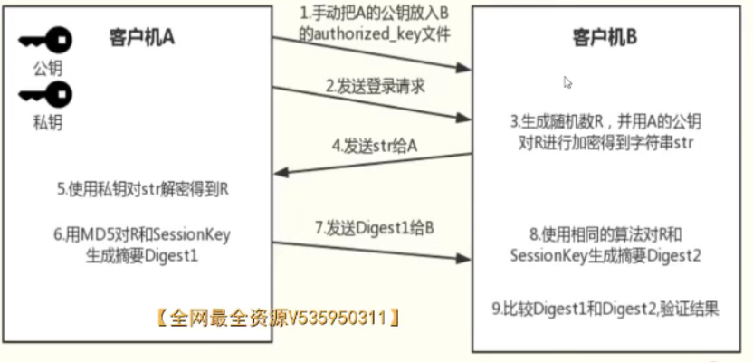
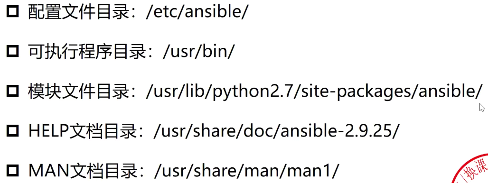
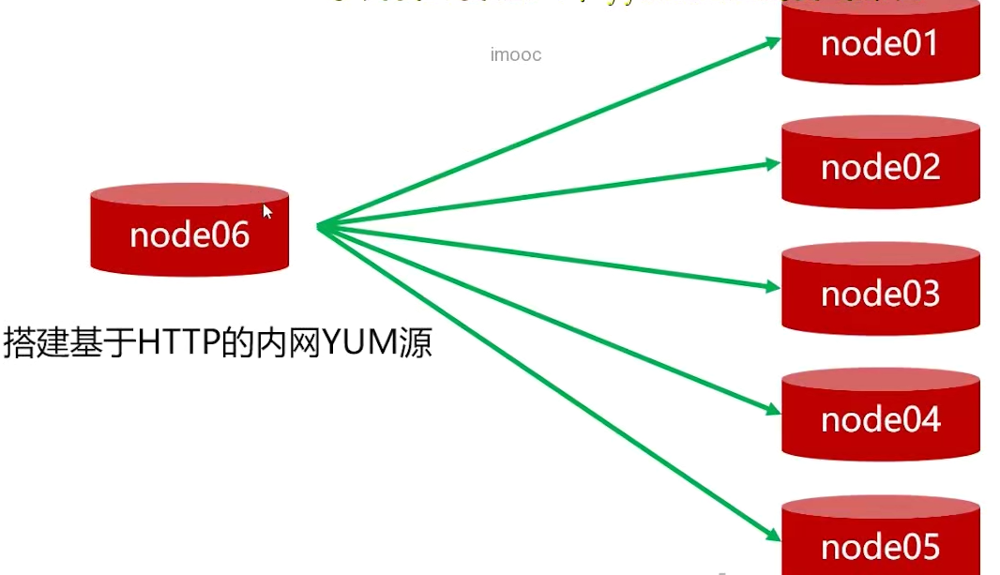

# shell高级编程

## 1.SSH协议管理多主机基础

> 基本概念

* SSH是(Secure Shell)的缩写，安全外壳协议
* 专为远程登录会话和其他网络服务提供安全性的协议
* 先对数据包加密再传输，确保安全性


> SSH工作过程

1. SSH版本协商
2. 密钥和算法协商
3. 认证阶段
4. 会话请求阶段
5. 交互会话阶段

> SSH协议管理主机的两种用法

*   SSH非免密登录执行-基于口令的验证

    
* SSH免密登录-基于密钥的验证



### 1.1.SSH非免密环境

* 命令行登录：ssh root@172.16.100.50(输入密码后登录成功)
*   使用脚本

    ```bash
    yum install -y  sshpass # 安装sshpass
    sshpass -predhat ssh -o StrictHostKeyChecking=no root@155.144.77.206 "df -h" # 把密码作为参数并执行指令

    # 脚本
    #!/bin/bash

    host_list='172.16.100.50 172.16.100.60'
    user_name=root
    user_pass=redhat

    for host in $host_list;do
            sshpass -p$user_pass ssh -o StrictHostKeyChecking=no $user_name@$host  "$1"
    done
    ```

### 1.2.SSH免密环境

```bash
ssh-keygen -t rsa # 以rsa算法生成密钥，保存在.ssh文件夹下
ssh-copy-id root@node02 # 把秘钥进行分发，保存在authorized_keys文件，把权限设置为600
ssh node02 # 分发之后就可以直接免密登录了
```

### 1.3.非免密和免密使用场景及优劣势

> 非免密

* 集群环境初始化，免密环境初始化

> 免密

* 安全策略要求较高，root密码定期更换
* 自动化运维工具必备，例如ansible
* 分布式、大规模集群环境高效运维必备

> 非免密和免密结合

1. 利用SSH非免密创建免密环境
2. 借助免密环境，利用其他自动化运维工具完成应用安装部署

### 1.4.生产环境集群初始化

> 实现功能

* 在所有主机上创建用户、设置密码
* 针对创建的用户初始化免密环境

> 实现步骤

1. 管理主机本地创建用户、设置密码
2. 管理主机创建的用户生产密钥对
3. 利用SSH非免密在所有主机创建用户
4. 利用SSH非免密将管理主机公钥内容写入所有主机authorized\_key文件

```bash
#!/bin/bash

if [ $# -lt 2 ];then
	echo "Usage: sh $0 user_name user_pass"
	exit 1
fi

ROOT_PASS="redhat"
USER_NAME=$1
USER_PASS=$2
HOST_LIST="172.16.100.40 172.16.100.50 172.16.100.60"

# 管理主机本地创建用户、设置密码
useradd $USER_NAME
echo $USER_PASS | passwd --stdin $USER_NAME

# 管理主机生成秘钥对
su - $USER_NAME -c "echo "" | ssh-keygen -t rsa"
PUB_KEY="`cat /home/$USER_NAME/.ssh/id_rsa.pub`"


# 在所有主机创建用户
# 利用非免密初始化免密
for host in $HOST_LIST;do
	sshpass -p$ROOT_PASS ssh -o StrictHostKeyChecking=no root@$host "useradd $USER_NAME"
	sshpass -p$ROOT_PASS ssh -o StrictHostKeyChecking=no root@$host "echo $USER_PASS | passwd --stdin $USER_NAME"
	sshpass -p$ROOT_PASS ssh -o StrictHostKeyChecking=no root@$host "mkdir /home/$USER_NAME/.ssh -pv"
	sshpass -p$ROOT_PASS ssh -o StrictHostKeyChecking=no root@$host "echo $PUB_KEY> /home/$USER_NAME/.ssh/authorized_keys"
	sshpass -p$ROOT_PASS ssh -o StrictHostKeyChecking=no root@$host "chmod 600 /home/$USER_NAME/.ssh/authorized_keys"
	sshpass -p$ROOT_PASS ssh -o StrictHostKeyChecking=no root@$host "chown -R $USER_NAME:$USERNAME /home/$USER_NAME/.ssh"
done

```

### 1.5.SSH跨主机返回值处理

> 指令返回


* $?:判断指令执行情况，为0成功，其他失败

> 脚本返回


* 在执行有可能出错的命令之前，要先做判断

## 2.利用SSH实现分布式应用的一键安装部署

> 安装部署实现步骤拆解

1. 拷贝安装包到远端主机
2. 创建安装目录并解压安装包
3. 格式化磁盘挂载数据目录
4. 修改服务配置文件
5. 启动服务并验证集群运行状态

```bash
#/bin/bash

# 命令报错退出脚本
set -e

HOST_LIST="172.16.100.40 172.16.100.50 172.16.100.60"
LOCAL_DIR="/opt/tmp"
PACKAGE_DIR="/opt/package"
APP_DIR="/opt/source"
JDK_NAME="jdk-8u212-linux-x64.tar.gz"
CMD_NUM=0
ZK_NAME="apache-zookeeper-3.7.0-bin.tar.gz"
SCALA_NAME="scala-2.12.11.tgz"
KAFKA_NAME="kafka_2.12-2.6.1.tgz"

# 使用exec指令定义日志
if [ -e ./deployment_kafka.log ];then
	rm -rf ./deployment_kafka.log
fi
exec 1>>./deploy_kafka.log 2>&1

# 封装多主机执行指令
function remote_execute
{
	for host in $HOST_LIST;do
		CMD_NUM=`expr $CMD_NUM + 1`
        echo "+++++++++++++++++++++++++Execute Command < $@  > ON Host: $host++++++++++++++++++++++++"
        ssh -o StrictHostKeyChecking=no root@$host $@
		if [ $? -eq 0 ];then
			echo "Congratulation Command < $@ > execute success"
		else
			echo "Sorry Command < $@ > execute failed"
		fi
	done
}

# 多主机传输文件函数封装
function remotr_transfer
{
    SRC_FILE=$1
    DST_DIR=$2
    if [ $# -lt 2];then
       echo "USAGE: $0 <file|dir> <des_dir> "
       exit 1
    fi
    
    # 判断第一个参数是否存在
    if [ ! -e $SRC_FILE ];then
        echo "ERROR - $SRC_FILE is not exist,Please check..."
        exit 1
    fi

    # 判断第二个参数是否存在
    for host in $HOST_LIST;do
        echo "++++++++++++++Transfer File To Host: $host++++++++++++++++++"
        CMD_NUM=$(($CMD_NUM+1))
        scp -o StrictHostKeyChecking=no $SRC_FILE  root@$host:"if [ ! -e $DST_DIR ];then mkdir -p $DST_DIR;else echo $DST_DIR"
        scp -o StrictHostKeyChecking=no $SRC_FILE  root@$host:$DST_DIR/
        if [ $? -eq 0 ];then
            echo "Remote Host: $host - $CMD_NUM -INFO - scp $SRC_FILE To dir $DST_DIR Success"
        else
            echo "Remote Host: $host - $CMD_NUM -INFO - scp $SRC_FILE To dir $DST_DIR Failed"
        fi
    done
    
}

remote_execute "df -h"
# 关闭firewall和selinux
remote_execute "systemctl stop firewalld"
remote_execute "systemctl disable firewalld"
remote_execute "setenforce 0"
remote_execute "sed -i 's/SELINUX=enforcing/SELINUX=disabled/g' /etc/sysconfig/selinux"


# 安装配置JDK
remotr_transfer $LOCAL_DIR/$JDK_NAME $PACKAGE_DIR
remote_execute "if [ ! -d $APP_DIR ];then mkdir -p $APP_DIR;fi"
remote_execute "tar -zxvf $PACKAGE_DIR/$JDK_NAME -C $APP_DIR"

cat > $LOCAL_DIR/java.sh << EOF
export JAVA_HOME=$APP_DIR/jdk1.8.0_212
export PATH=\$PATH:\$JAVA_HOME/bin:\$JAVA_HOME/jre/bin
export SJAVA_HOME PATH
EOF

remotr_transfer $LOCAL_DIR/java.sh /etc/profile.d/
remote_execute "source /etc/profile.d/java.sh"
remote_execute "java -version"


# 安装配置zookeeper，并启动服务
remotr_transfer $LOCAL_DIR/$ZK_NAME $PACKAGE_DIR
remote_execute "tar -zxvf $PACKAGE_DIR/$ZK_ANEM -C $APP_DIR -C $APP_DIR"
remote_execute "if [ ! -e $APP_DIR/zookeeper ];then rm -rf $APP_DIR/zookeeper;fi"
remote_execute "ln -sv $APP_DIR/apache-zookeeper-3.7.0-bin $APP_DIR/zookeeper"

remote_execute "cp $APP_DIR/zookeeper/conf/zoo_sample.cfg $APP_DIR/zookeeper/conf/zoo.cfg"

cat > $LOCAL_DIR/zoo_tmp.conf << EOF
server.1=172.16.100.40:2888:3888
server.2=172.16.100.50:2888:3888
server.3=172.16.100.60:2888:3888
EOF

remotr_transfer $LOCAL_DIR/zoo_tmp.conf /tmp
remote_execute "cat /tmp/zoo_tmp.conf >> $APP_DIR/zookeeper/conf/zoo.cfg"

remote_execute "if [ -e /data/zk ];then rm -rf /data/zk;fi"
remote_execute "mkdir /data/zk -p"
remote_execute "sed -i 's/dataDir=\/tmp\/zookeeper/dataDir=\/data\/zk/g' $APP_DIR/zookeeper/conf/zoo.cfg"

remote_execute 'if [ `hostname` == "node01" ];then echo 1 > /data/zk/myid;fi'
remote_execute 'if [ `hostname` == "node02" ];then echo 2 > /data/zk/myid;fi'
remote_execute 'if [ `hostname` == "node03" ];then echo 3 > /data/zk/myid;fi'

remote_execute 'jps | grep QuorumPeerMain | grep -v grep | awk '{print $1}' > /tmp/zk.pid'
remote_execute 'if [ -s /tmp/zk.pid ];then kill -9 `cat /tmp/zk.pid`;fi'
remote_execute "$APP_DIR/zookeeper/bin/zkServer.sh start"

# 安装配置scala环境
remotr_transfer $LOCAL_DIR/$SCALA_NAME $PACKAGE_DIR
remote_execute "tar -zxvf $PACKAGE_DIR/$SCALA_NAME -C $APP_DIR"

cat > $LOCAL_DIR/scala.sh << EOF
export SCALA_HOME=$APP_DIR/scala-2.12.11
export PATH=\$PATH:\$SCALA_HOME/bin
export SSCALA_HOME PATH
EOF

remotr_transfer $LOCAL_DIR/scala.sh /etc/profile.d/
remote_execute "source /etc/profile.d/scala.sh"
remote_execute "scala -version"

# 安装配置kafka，并启动服务
remotr_transfer $LOCAL_DIR/$KAFKA_NAME $PACKAGE_DIR
remote_execute "tar -zxvf $PACKAGE_DIR/$KAFKA_NAME -C $APP_DIR"

remote_execute "if [ -e $APP_DIR/kafka ];then rm -rf $APP_DIR/kafka;fi"
remote_execute "ln -sv $APP_DIR/$KAFKA_NAME $APP_DIR/kafka"
remote_execute "if [ -e /data/kafka/log ];then rm -rf /data/kafka/log;fi"
remote_execute "mkdir -p /data/kafka/log"

remote_execute "sed -i '/zookeeper.connect=localhost:2181/d' $APP_DIR/kafka/config/server.properties"
remote_execute "sed -i '\$azookeeper.connect=172.16.100.40:2181 172.16.100.50:2181 172.16.100.60:2181' $APP_DIR/kafka/config/server.properties"

remote_execute 'if [ `hostname` =="node01" ];then sed -i 's/broker.id=0/broker.id=100/g' $APP_DIR/kafka/config/server.properties;fi'
remote_execute 'if [ `hostname` =="node02" ];then sed -i 's/broker.id=0/broker.id=200/g' $APP_DIR/kafka/config/server.properties;fi'
remote_execute 'if [ `hostname` =="node03" ];then sed -i 's/broker.id=0/broker.id=300/g' $APP_DIR/kafka/config/server.properties;fi'

remote_execute 'if [ `hostname` =="node01" ];then sed -i '$alisteners=PLAINTEXT://172.16.100.40:9092' $APP_DIR/kafka/config/server.properties;fi'
remote_execute 'if [ `hostname` =="node02" ];then sed -i '$alisteners=PLAINTEXT://172.16.100.50:9092' $APP_DIR/kafka/config/server.properties;fi'
remote_execute 'if [ `hostname` =="node03" ];then sed -i '$alisteners=PLAINTEXT://172.16.100.60:9092' $APP_DIR/kafka/config/server.properties;fi'

remote_execute "sed -i 's/log.dirs=\/tmp\/kafka0logs/log.dirs=\/data\/kafka\/log/g' $APP_DIR/kafka/config/server.properties"

remote_execute "jps | grep Kafka | grep -v grep | awk '{print \$1}' > /tmp/kafka.pid"
remote_execute "if [ -s /tmp/kafka.pid ];then kill -9 \`cat /tmp/kafka.pid\`;fi"

remote_execute "$APP_DIR/kafka/bin/kafka-server-start.sh $APP_DIR/kafka/config/server.properties"

sleep 30

remote_execute 'if [ `hostname` == "node01" ];then $APP_DIR/kafka/bin/kafka-topics.sh --zookeeper localhost --create --topic test --partitions 5 --replication-factor 2;fi'

sleep 5
remote_execute 'if [ `hostname` == "node01" ];then $APP_DIR/kafka/bin/kafka-topics.sh --zookeeper localhost --topic test --describe;fi'


```

## 3.集群多主机一键启停服务脚本

> 服务一键启停实现步骤

1. Kafka服务批量启动函数封装
2. Kafka服务批量停止函数封装
3. Kafka服务状态批量检测函数封装
4. Kafka服务一键启停脚本主函数体实现
5. 进一步抽象脚本，改进为通用的一键启动其他服务的脚本

```bash
#!/bin/bash


HOST_LIST="172.16.100.40 172.16.100.50 172.16.100.60"
STATUS_CMD="jps | grep -w Kafka"
START_CMD="/opt/source/kafka/bin/kafka-server-start.sh -daemon /opt/source/kafka/config/server.properties"
STOP_CMD="/opt/source/kafka/bin/kafka-server-stop.sh"
SERVICE_NAME="kafka broker"

function service_start
{
    for host in $HOST_LIST;do
        echo "-------NOW begin To Start Kafka In Host : $host-----------------"
        service_status $host
        if [ $? -eq 0 ];then
            echo "Kafka broker in $host is already RUNNING"
        else
            echo "Now $SERVICE_NAME is STOPPED,Start it...."
            ssh -o StrictHostKeyChecking=no $host $START_CMD &> /dev/null
            index=0
            while [ $index -lt 5 ];do
                service_status $host
                if [ $? -ne 0 ];then
                    index=`expr $index + 1`
                    echo "$index Times:Kafka broker in $host is start failed..Please wait.."
                    echo "After 3 seconds will check kafka status agein.."
                    sleep 3
                    continue
                else
                    echo "OK...Kafka broker in $host is RUNNING.."
                    break
                fi
            done
            if [ $index -eq 5 ];then
                echo "Sorry...Kafka broker Start Failed..Please login $host to check"
            fi
        fi
    done
}


function service_stop
{
    for host in $HOST_LIST;do
        echo "-------NOW begin To Stop Kafka In Host : $host-----------------"
        service_status $host
        if [ $? -ne 0 ];then
            echo "Kafka broker in $host is already STOPPED"
        else
            echo "Now kafka broker is RUNNING,Start it...."
            ssh -o StrictHostKeyChecking=no $host $STOP_CMD &> /dev/null
            index=0
            while [ $index -lt 5 ];do
                service_status $host
                if [ $? -eq 0 ];then
                    index=`expr $index + 1`
                    echo "$index Times:Kafka broker in $host is stopping..Please wait.."
                    echo "After 3 seconds will check kafka status agein.."
                    sleep 3
                    continue
                else
                    echo "OK...Kafka broker in $host is STOPPED now.."
                    break
                fi
            done
            if [ $index -eq 5 ];then
                echo "Sorry...Kafka broker Stop Failed..Please login $host to check"
            fi
        fi
    done
}


function service_status
{
   status_idx=0
   result=0
   while [ $status_idx -lt 5 ];do
        ssh -o StrictHostKeyChecking=no $1 $STATUS_CMD &> /dev/null
        if [ $? -eq 0 ];then
            result=`expr $status_idx + 1 `
        fi
        status_idx=`expr $status_idx + 1 `
   done
   if [ $result -eq 3 ];then
       return
   fi
   return 99
}

function usage
{
cat << EOF
Usage 1: sh $0 start   #Start Kafka Process Define IN Host_LIST
Usage 2: sh $0 stop    #Stop Kafka Process Define IN Host_LIST
Usage 3: sh $0 status  #GET Kafka Status Define IN Host_LIST
EOF
}

case $1 in 
    start)
        service_start
        ;;
    stop)
        service_stop
        ;;
    status)
        for host in $HOST_LIST;do
               echo "--------------------NOE Begin To Detect Kafka Status In Host: $host------------------"
               service_status $host
               if [ $? -eq 0 ];then
                   echo "Kafka broker in $host is RUNNING"
               else
                   echo "Kafka broker in $host is STOPPED"
               fi
        done
        ;;
    *)
        usage
        ;;
esac

```

## 4.ansible核心用法

> 使用ansible管理多主机


> ansible简介

ansible是流行的自动化运维工具之一，基于python开发，集合了众多运维工具(chef、puppet)的优点

实现了**批量系统配置、批量程序部署、批量命令执行**功能

ansible被定义为配置管理工具，应具备以下功能：

* 确保所依赖的安装包已经安装
* 配置文件包含正确的内容已经正确的权限
* 相关服务已正确运行

Ansible是一个开源的自动化工具，可以用来管理云计算、配置管理和应用部署等多种场景。Ansible的特点是简单、易用、安全和灵活。Ansible不需要在目标主机上安装任何代理，只需要在一个控制节点上安装Ansible，然后通过SSH或者WinRM等协议来连接和控制目标主机。Ansible使用YAML语言来编写自动化任务，称为playbook，可以方便地描述复杂的逻辑和流程。Ansible还提供了大量的模块和插件，可以支持各种平台和服务，比如Azure。

> absible特性

* 无agent概念，不需要在被管理主机上安装客户端agent
* 无server概念，使用时直接执行指令即可
* 基于模块工作、扩展更灵活
* 无code概念，使用YAML定义playbook


> 安装ansible

### 4.1.ansible配置账号密码


```bash
# 直接在/etc/ansible/hosts添加，如果配置了免密登录，可以不加后面参数
[WEB]
172.16.100.40 ansible_ssh_user=root ansible_ssh_pass=root

# 保存后直接执行命令，查看是否连接成功
ansible all -m ping 
```

### 4.2.ansible执行流程


ansible读取配置文件是有顺序的

1. 先读取当前目录ansible.cfg
2. 没有再读取家目录.ansible.cfg
3. 最后读取/etc/ansible/ansible.cfg

### 4.3.ansible目录结构及配置文件



### 4.4.ansible命令参数

| 参数           | 含义             |
| ------------ | -------------- |
| -i           | 指定使用的主机清单文件    |
| -m           | 指定模块           |
| -a           | 指定模块使用参数       |
| -v           | 打印详细日志         |
| -f           | 指定fork开启同步进程个数 |
| -u           | ssh连接的用户名      |
| -k           | 提示输入ssh登录密码    |
| --list-hosts | 列出执行的主机清单      |

*   命令格式：

    ```bash
    ansible 主机 -m 模块 -a 参数
    ```

### 4.5.ansible核心模块

> command

* ansible默认模块
* 主要用于在远程主机执行Linux命令
* 缺陷：不支持变量、重定向、管道等

| 参数      | 含义             |
| ------- | -------------- |
| chdir   | 执行指令前，先切换目录    |
| creates | 文件存在时，不执行后续指令  |
| removes | 文件不存在时，不执行后续指令 |

```bash
ansible all -m command -a 'chdir /tmp ll'
```

> shell

* 主要用于在远程主机执行Linux命令
* 支持变量、重定向、管道等
* 缺陷：shell注入风险、非幂等性

| 参数      | 含义             |
| ------- | -------------- |
| chdir   | 执行指令前，先切换目录    |
| creates | 文件存在时，不执行后续指令  |
| removes | 文件不存在时，不执行后续指令 |

> copy

* 主要用于在拷贝文件到不同主机上

| 参数      | 含义                                                                       |
| ------- | ------------------------------------------------------------------------ |
| src     | 本地需拷贝的文件或目录                                                              |
| dest    | 远程主机目标目录                                                                 |
| content | 不指定src时，可以使用从tent参数填充文件内容；src和content必选其一                                |
| force   | 拷贝文件和远程主机内容不一致时，是否强制覆盖；默认yes                                             |
| backup  | 目标路径存在同名文件且与ansible主机中的文件内容不同时是否对远程主机的文件进行备份，当设置为yes时，会先备份远程主机中的文件，在进行拷贝 |
| owner   | 指定文件拷贝到远程主机后的属主，但是远程主机上必须有对应的用户，否则报错                                     |
| group   | 指定文件拷贝到远程主机后的属组，但是远程主机上必须有相应的组，否则会报错                                     |
| mode    | 指定文件拷贝到远程主机后的权限                                                          |

> 如果直接拷贝整个文件夹的话，速度会很慢

* 可以使用Synchronize模块
* 需要所有主机都安装了rsync服务

| 参数           | 含义             |
| ------------ | -------------- |
| src          | 本地需拷贝的文件或目录    |
| dest         | 远程主机目标目录或文件    |
| exclude      | 用于定义排除单个文件夹和文件 |
| exclude-from | 用于定义排除多个文件夹和文件 |
| owner        | 同              |
| group        | 同              |
| perms        | 保留文件的权限        |

> file

* 主要用于完成文件基本操作
* 创建文件或目录、删除文件或目录、修改文件权限

| 参数      | 含义                                                    |
| ------- | ----------------------------------------------------- |
| path    | 操作对象，可以是目录或文件                                         |
| state   | 文件状态。值可以为{directory\|touch\|file\|absent\|link\|hard} |
| owner   | 指定文件属主                                                |
| group   | 指定文件属组                                                |
| mode    | 指定文件权限                                                |
| recurse | 递归操作目录                                                |
| src     | 指定链接源                                                 |

> lineinfile

* 确保文件中存在特定行，或者使用反向正则表达式替换现有行

| 参数           | 含义                                     |
| ------------ | -------------------------------------- |
| path         | 指定要操作的文件                               |
| line         | 行内容信息                                  |
| regexp       | 正则表达式匹配                                |
| state        | 文件行状态，只可以为{absent\|present},默认为present |
| insertbefore | 插入指定行之前                                |
| insertafter  | 插入指定行之后                                |
| backup       | 是否备份原文件                                |
| backrefs     | 是否开启后向引用                               |

```bash
# 添加行内容到文件中
ansible all -m lineinfile -a 'path=/tmp/hosts line="192.168.10.80 node80"'

# 删除文件特定行
ansible all -m lineinfile -a 'path=/tmp/hosts regexp="172.16.100.100" state=absent'

# 有匹配行替换，无则加载文件末尾
# 有多个匹配会只替换最后一个匹配的行
ansible all -m lineinfile -a 'path=/tmp/selinux regexp="^SELINUX=" line="SELINUX=disabled"' 

# 有匹配行替换，无则不做处理
ansible all -m lineinfile -a 'path=/tmp/selinux regexp="^SELINUX=" line="SELINUX=disabled" backrefa=yes'

# 修改文件特定行内容
ansible all -m lineinfile -a 'path=/tmp/my.cnf regexp="^datadir=" line="datadir=/data/mysql"'
```

> yum和service

* yum
*   基于yum源完成软件包安装、卸载、更新

    | 参数                  | 含义                                               |
    | ------------------- | ------------------------------------------------ |
    | name                | 软件包名                                             |
    | state               | 目标状态：present\|installed\|latest\|absent\|removed |
    | disable\_gpg\_check | 禁用对rpm包的公钥验证，默认no                                |
    | enablerepo          | 使用指定yum源安装                                       |
    | disablerepo         | 安装时不使用特定yum源                                     |

> service

*   服务的管理：启动、停止、重启、开机自启

    | 参数      | 含义                                         |
    | ------- | ------------------------------------------ |
    | name    | 服务名                                        |
    | state   | 目标状态：started\|stopped\|restarted\|reloaded |
    | enabled | 开启自启设置：yes\|no                             |

## 5.分布式应用安装部署前常见环境检查

> 配置文件

```
[hosts]
172.16.100.150 node15
172.16.100.160 node16
172.16.100.170 node17

[os_version]
7.6.1810

[cpu_cores]
32

[time_sync_diff]
3

[root_password]
redhat

[nginx]
node15
node16

[php]
node17

[mysql]
node15

```

> 检查代码

```bash
#!/bin/bash

if [ ! -e ./config.ini ];then
    echo "config.ini is not exists..please check.."
    exit 1
fi

HOSTS_IP=$(sed -n '/\[hosts\]/,/\[.*\]/p' config.ini | grep -v ^$ | grep -v "\[.*\]" | grep -v "^#" | awk '{print $1}')
ROOT_PASS=$(sed -n '/\[root_password\]/,/\[.*\]/p' config.ini | grep -v ^$ | grep -v "\[.*\]" | grep -v "^#")
OS_VERSION=$(sed -n '/\[os_version\]/,/\[.*\]/p' config.ini | grep -v ^$ | grep -v "\[.*\]" | grep -v "^#")
CPU_CORES=$(sed -n '/\[cpu_cores\]/,/\[.*\]/p' config.ini | grep -v ^$ | grep -v "\[.*\]" | grep -v "^#")
TIME_VALUE=$(sed -n '/\[time_sync_diff\]/,/\[.*\]/p' config.ini | grep -v ^$ | grep -v "\[.*\]" | grep -v "^#")

function verify_password
{
    if [ $# -lt 2 ];then
        echo "Usage: verify_password IP root_password"
        exit 1
    fi
    sshpass -p$2 ssh -o StrictHostKeyChecking=no root@$1 "df -h"
    if [ $? -ne 0 ];then
        echo "尝试通过SSH登录主机 $1 失败，请检查后重试脚本"
        return 255
    else
        return 0
    fi
}

function check_host_online
{
    echo "+++++++++++++++1、检查集群主机连通性++++++++++++++"
    for host in $HOSTS_IP;do
        ping -w 3 $host &> /dev/null
        if [ $? -eq 0 ];then
            echo "监测主机 $host 连通性通过"
        else
            echo "监测主机 $host 连通性失败，无法连通"
            ping_failed_hosts="$ping_failed_hosts $host"
        fi
    done

    if [[ "$ping_failed_hosts" == ""  ]];then
        echo "1.使用ping对集群主机连通性检查，全部通过！！！"
    else
        echo "1.使用ping对主机连通性检查。以下主机无法连通：$ping_failed_hosts"
        exit 1
    fi
}

function check_os_version
{
    echo "+++++++++++2、检查系统版本++++++++++++++++++++"
    for host in $HOSTS_IP;do
        verify_password $host $ROOT_PASS
        if [ $? -eq 0 ];then
            sshpass -p$ROOT_PASS ssh -o StrictHostKeyChecking=no root@$host "grep $OS_VERSION /etc/redhat-release" &> /dev/null
            if [ $? -ne 0 ];then
                echo "检查主机操作系统版本与目标($OS_VERSION)不一致，未通过"
                os_failed_hosts="$os_failed_hosts $host"
            else
                echo "检查主机操作系统版本与目标($OS_VERSION)一致，检查通过"
            fi
         else
                os_failed_hosts="$os_failed_hosts $host"
        fi
     done

     if [[ $os_failed_hosts == "" ]];then
         echo "2、检查主机操作系统版本与目标($OS_VERSION)一致性，全部通过"
     else
         echo "2、检查主机操作系统版本与目标($OS_VERSION)一致性，不通过。未通过主机为 $os_failed_hosts"
     fi
}

function check_cpu_cores
{
    echo "+++++++++++++++++++3、检查系统cpu个数++++++++++++++++"
    for host in $HOSTS_IP;do
        verify_password $host $ROOT_PASS
        if [ $? -eq 0 ];then
            DST_CPU_CORES=$(sshpass -p$ROOT_PASS ssh -o StrictHostKeyChecking=no root@$host "grep "^processor" /proc/cpuinfo |sort|uniq|wc -l")
            if [ $DST_CPU_CORES -lt $CPU_CORES ];then
                echo "检查主机CPU_CORES与目标($CPU_CORES)未通过"
                cpu_failed_hosts="$cpu_failed_hosts $host"
            else
                echo "检查主机CPU_CORES($CPU_CORES)，检查通过"
            fi
        else
            cpu_failed_hosts="$cpu_failed_hosts $host"
        fi
     done

     if [[ $cpu_failed_hosts == "" ]];then
         echo "3、检查主机CPU_CORES($CPU_CORES))全部通过"
     else
         echo "3、检查主机CPU_CORES不通过。未通过主机为 $cpu__failed_hosts"
     fi
}

function check_timesync
{
    echo "++++++++++++++++++4、检查集群主机时间++++++++++++++++++"
    for host in $HOSTS_IP;do
        LOCAL_TIME=`date "+%Y%m%d%H%M%S"`
        verify_password $host $ ROOT_PASS
        if [ $? -eq 0 ];then
            DST_HOST_TIME=$(sshpass -p$ROOT_PASS ssh 0o StrictHostKeyChecking=no root@$host 'date "+%Y%m%d%H%M%S"')
            TIME_DIFF=`expr $LOCAL_TIME - $DST_HOST_TIME`|sed 's/[^0-9]//g'
            if [ $TIME_DIFF -lt $TIME_VALUE ];then
                echo "检查主机 $host 时间同步通过"
            else
                echo "检查主机 $host 时间同步不通过。时间误差在$TIME_DIFF 秒"
                time_failed_hosts="$time_failed_hosts $host"
        
            fi
        else
            time_failed_hosts="$time_failed_hosts $host"
            echo no
        fi
    done

    if [[ $time_failed_hosts == "" ]];then
        echo ""4、检查集群主机时间是否同步，全部通过！！""
    else
        echo "4、检查集群主机时间是否同步，未通过，时间不同步的主机包括：$time_failed_hosts"
    fi
}
check_host_online
check_os_version
check_cpu_cores
check_timesync

```

## 6.ansible多主机部署

> 完整实例

1. 内网搭建基于HTTP的YUM源
2. 批量磁盘格式化挂载实现
3. 脚本中ansible的多常见详细用法
4. 基于纯净的CentOS从0-1实现一个完整实例

### 6.1.内网搭建YUM源



* 准备rpm包

```bash
# 只会下载相关依赖及软件的rpm包到指定目录，而不会安装
yum install nginx --downloadonly --downloaddir /root/shell_c/cloud/
```

* 安装createrepo指令，指定yum源路径

```bash
# 用于创建软件仓库和生成元数据。它可以对指定目录下的rpm文件进行索引，方便远程yum命令安装更新
yum install createrepo -y

# 指定yum源路径
createrepo /root/shell_c/cloud/
```

* 搭建YUM源

```bash
# 安装httpd
yum install -y httpd

# HTTP开放
cd /var/www/html
ln -s rpms /root/shell_c/cloud/

# 搭建YUM源
# 清空/etcyum.repo.d目录下所有文件
# 编写repo文件
[HTTP_YUM]  # 源标识
name=HTTP   # 源名称
baseurl=http://localhost/rpms/ # 源地址
gpgcheck=0  # 关闭yum源的签名检查
enabled=1   # 开启yum源

$ 源标识                                            源名称                                         状态
HTTP_YUM                                            HTTP                                           1


# 构建缓存
yum makecache

# 查看源信息
yum repolist
```

> 脚本实现yum源搭建

```bash
$ config.ini

#!/bin/bash

if [ ! -e ./config.ini ];then
    echo "Config.ini is not exists..please check.."
    exit 1
fi
MANAGE_HOST_IP=`sed -n '/\[hosts\]/,/\[.*\]/p' config.ini | awk '$3=="true"{print $1}'
RPM_PKGS_DIR="/opt/"
RPM_PKGS_NAME="rpms.tar.gz"
if [ ! -e ./$RPM_PKGS_NAME ];then
    echo "Packages $RPM_PKGS_NAME is not found in current dir..Please check"
    exit 1
fi

if [ ! -e $RPM_PKGS_DIR ];then
    mkdir -p $RPM_PKGS_DIR
fi

tar -zxvf ./$RPM_PKGS_NAME -C $RPM_PKGS_DIR

# 备份CentOS系统
cd /etc/yum.repos.d/ 
mkdir backup
mv *.repo ./backup

# 创建本地的local.repo文件，并将baseurl指向/opt/rpms 
cat << EOF > /etc/yum.repos.d/local.repo
[Local]  
name=Local  
baseurl=file:///opt/rpms/ 
gpgcheck=0  
enabled=1
EOF
yum repolist | grep ^Local &> /dev/null
if [ $? -eq 0 ];then
    echo "Construct Local YUM Successed.."
else
    echo "SOrry,Construct Local YUM Failed..Please check.."
    exit
fi

setenforce 0
# 创建基于HTTP服务的YUM源
yum install httpd -y

sed -i '/^Listen /d' /etc/httpd/conf/httpd.conf 
sed -i '$aListen 9090' /etc/httpd/conf/httpd.conf 
sleep 3
systemctl  restart httpd

ss -tnl | grep :9090 &> /dev/null
if [ $? -eq 0 ];then
    echo "Web Server Start Success...."
else
    echo "Sorry,Web Server Start Failed..Please check.."\
    exit 1
fi

ln -sv /opt/rpm /var/www/html/rpms

cat << EOF > /etc/yum.repos.d/http.repo 
[HTTP]
name=HTTP
baseurl=http://$MANAGE_HOST_IP:9090/rpms/
gpgcheck=0
enabled=1
EOF


yum repolist | grep ^HTTP &> /dev/null
if [ $? -eq 0 ];then
    echo "Construct HTTP YUM Successed.."
else
    echo "SOrry,Construct HTTP YUM Failed..Please check.."
    exit
fi

```

### 6.2.ansible安装基础软件

```
# 实现免密
echo "y\n" | ssh-keygen -t rsa -q -N "" -f ~/.ssh/id_rsa 
for host in $HOSTS;do
    sshpass -predhat ssh-copy-id -o StrictHostKeyChecking=no root@$host &> /dev/null 
    ssh -o StrictHostKeyChecking=no root@$host 'df -h' &> /dev/null 
    if [ $? -eq 0 ];then
        echo "Use Nopass Login Success"
    else
        echo "Sorry,Use Nopass Login Failed..Please check.."
        exit 1
    fi
done
                                                 
```
