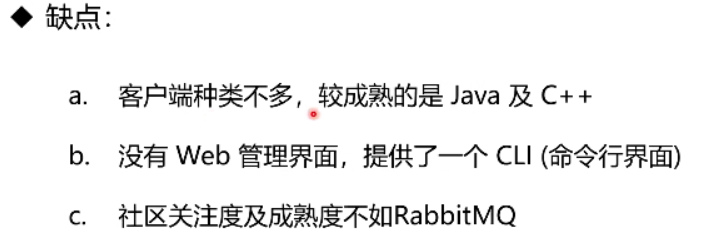
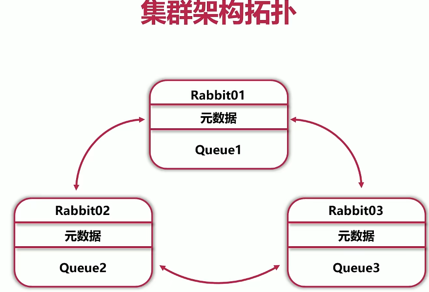
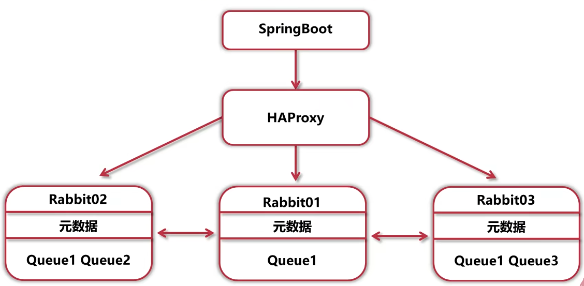
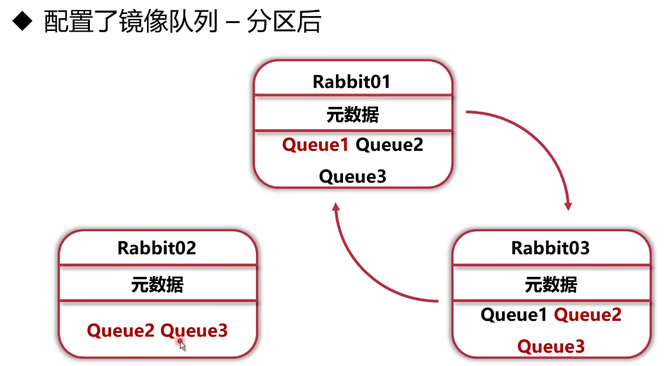

# 1.介绍中间件

> 什么是中间件(Middleware)

是提供软件和软件之间连接的软件，以便于软件各部之间的沟通，比如：微信相当于`消息中间件`


> 使用消息中间件的优势

- 业务调用链短，用户等待时间短
- 部分组件故障不会瘫痪整个业务
- 业务高峰期有缓冲
- 业务高峰期时不会常数大量的异步线程


> 使用消息中间件的作用

- **异步处理**
- **系统解耦**

- 流量削峰和流控
- 消息广播
- 消息收集
- 最终一致性


> RabbitMQ

**RabbitMQ**是一个开源的消息代理和队列服务器，用来通过普通协议在完全不同的应用之间共享数据，RabbitMQ是使用Erlang语言来编写的，并且RabbitMQ是基于**AMQP**协议的


# 2.主流消息中间件技术

> ACTIVEMQ


> RabbitMQ


> Apache RocketMQ





> kafka


> 总结


# 3.RabbitMQ高性能原因


> Erlang特点


> 总结


# 4.AMQP协议

> 介绍

- AMQP协议（高级消息队列协议）作为RabbitMQ的规范，规定了RabbitMQ对外接口
- 是具有现代特征的二进制协议。是一个提供统一消息服务的应用层标准高级消息队列协议，是应用层协议的一个开放标准，为面向消息的中间件设计

 


 


> Exchange

- 在AMQP协议或者是RabbitMQ实现中，最核心的组件是Exchange

- Exchange承担RabbitMQ的核心功能---路由转发
- Exchange有多个种类，配置多变，需要详细讲解


# 5.Exchange的作用

- Exchange时AMQP协议和RabbitMQ的核心组件

- Exchange的功能是根据**绑定关系**和**路由键**为消息提供路由，将消息转发至相应的队列
- Exchange有4种类型：**Direct、Topic、Fanout**、Headers，以前三种为主


> Direct Exchange

- Message中Routing Key如果和BInding Key一致，direct Exchange则将message发送到对应的queue中


> Fanout Exchange

- 每个发送到Fanout Exchange的message都会分发到所有绑定的queue上去


> Topit Exchange

- 根据Routing key及通配规则，Topic Exchange将消息分发到目标Queue

  - 全匹配：与DIrect类似
  - Binging Key中的#：匹配任意个数的word
  - Binding Key中的*：匹配任意1个word

  

> [RabbitMQ Simulator (tryrabbitmq.com)](http://tryrabbitmq.com/)可以在线实验Exchange规则


> 总结


# 6.RabbitMQ快速安装


> Windows安装


> Linux安装

- docker拉取镜像


- 手动安装
  - 安装epel：yum install -y epel-release
  - 下载erlang：yum install -y erlang
  - 下载socat：yum install -y socat
  - 获取rpm包：wget https://github.com/rabbitmq/rabbitmq-server/releases/download/rabbitmq_v3_6_15/rabbitmq-server-3.6.15-1.el6.noarch.rpm
  - 获取秘钥：rpm -import https://www.rabbitmq.com/rabbitmq-release-signing-key.asc
  - 安装RabbitMQ：rpm -ivh rabbitmq-server-3.6.15-1.el6.noarch.rpm
  - 开启网页管理工具：rabbitmq-plugins enable rabbitmq_management


# 7.网页端管理工具


# 8.命令行工具上手


> 状态查看

- 查看状态：rabbitmqctl status
- 查看绑定：rabbitmqctl list_bindings
- 查看channel：rabbitmqctl list_channels
- 查看connection：rabbitmqctl list_connections
- 查看消费者：rabbitmqctl list_consumers
- 查看交换机：rabbitmqctl list_exchanges


# 9.RabbitMQ消息交换的关键

> AMQP

- AMQP协议直接定义了RabbitMQ的内部结构和外部行为
- 使用RabbitMQ本质上是在使用AMQP协议
- AMQP协议被多种消息中间件使用


> 消息流转的流程

- 发送者不能直接将消息发送给最终队列，必须发送给交换机
- 消息根据路由规则，消息由交换机转发给队列
- 消费者从队列将消息取走


> 合理的交换机和队列设置

- 交换机数量不能过多，一般来说同一个业务，或者同一类业务使用同一个交换机
- 合理设置队列数量，一般来说一个微服务监听一个队列，或者一个微服务的一个业务监听一个队列
- 合理配置交换机类型，使用Topic模式时仔细设置绑定键


> 尽量使用自动化配置

- 将创建交换机/队列的操作固化在应用代码中，免去复杂的运维操作，高效且不易出错
- 一般来说，交换机由双方同时声明，队列由接收方声明且配置绑定关系
- 交换机/队列的参数一定要由双方开发团队确认，否则重复声明时，若参数不一致，会导致声明失败


# 10.具体实例分析

## 10.1.需求分析与架构设计

> 需求分析


> 架构设计


> 什么是微服务架构


> - REST（Representational State Transfer）是一种软件架构风格，它定义了一组原则和约束，用于设计和实现基于HTTP协议的Web服务。
> - REST风格的接口（RESTful API）是指遵循REST原则和约束的Web服务接口，它可以让不同的应用或设备之间通过HTTP协议进行数据交换。
> - REST风格的接口主要有以下特点：
>   - 基于资源（Resource），每个资源都有一个唯一的标识符（URI），可以通过GET、POST、PUT、DELETE等HTTP方法对资源进行操作。
>   - 无状态（Stateless），每个请求都包含了足够的信息，服务器不需要保存客户端的状态或上下文。
>   - 统一接口（Uniform Interface），客户端和服务器之间遵循统一的规范，如使用JSON或XML作为数据格式，使用HTTP状态码表示操作结果等。
>   - 分层系统（Layered System），客户端只能看到当前层次的服务器，而不需要知道整个系统的结构或细节。


## 10.2.数据库设计与项目搭建


# 11.保证消息可靠性

> 发送方


> 消费方


> RabbitMQ


## 11.1.发送端确认机制


> 什么是发送端确认机制

- 消息发送后，若中间件收到消息，会给发送端一个应答
- 生产者接收应答，用来确认这条消息是否正常发送到中间件

> 三种确认机制

- 单条同步确认

  

- 多条同步确认

  

- 异步确认机制

  


## 11.2.消息返回机制


## 11.3.消费端确认


## 11.4.消费端限流机制


## 11.5.消息过期机制


## 11.6.死信队列


 


# 12.RabbitMQ集群

> 扩展规模

- 一般的基础结构中单机扩容(Scale-Up)很难实现
- 需要扩容时尽量使用扩展数量实现(Scale-Out)
- RabbitMQ集群可以方便的通过Scale-Out扩展规模

> 数据冗余

- 对于单节点RabbitMQ，如果节点宕机，内存数据丢失
- 对于单节点RabbitMQ，如果节点损坏，磁盘丢失
- RabbitMQ集群可以通过镜像队列，将数据冗余至多个节点

> 高可用

- 如果单节点RabbitMQ宕机，服务不可用
- RabbitMQ集群可以通过负载均衡，将请求转移至可用节点


## 12.1.RabbitMQ集群搭建

- 多个RabbitMQ单节点，经过配置组成RabbitMQ集群
- 集群节点之间共享元数据，不共享队列数据(默认)
- RabbitMQ节点数据互相转发，客户端通过单一节点可以访问所有数据

 

> 集群搭建步骤


- 查看：cat /var/lib/rabbitmq/.erlang.cookie
  - 要求全部集群节点的erlang.cookie全部一样

- 加入集群：rabbitmqctl join_cluster 主机名


## 12.2.RabbitMQ镜像队列


- 多个RabbitMQ单节点，经过配置组成RabbitMQ集群
- 集群节点之间共享元数据，切共享特定队列数据
- RabbitMQ节点数据互相转发，客户端通过单一节点可以访问所有数据


> 集群镜像队列设置


## 12.3.RabbitMQ实现高可用

> 客户端负载均衡


> 服务端负载均衡



> 什么是HAProxy

- HAProxy是一款提供高可用、负载均衡以及基于TCP和HTTP应用的代理软件
- HAProxy适用于那些负载较大的web站点
- HAProxy可以支持数以万计的并发连接

> HAProxy配置方法

- 安装HAProxy：yum install -y haproxy

- 配置HAProxy，使用四层代理模式

  - 配置文件目录：/etc/haproxy/haproxy.cfg

    ```bash
    global  # 全局配置
    	log 127.0.0.1 local0 info # 默认日志输出配置
    	maxconn 4096 # 设置最大连接数
    	daemon       # 设置守护模式
    defaults # 设置默认值
    	logglobal # 应用全局配置
    	mode tcp # 配置模式
    	option tcplog # 记录tcplog
    	option dontlognull # 不记录健康检查日志
     	retires 3 # 失败检查次数
    	maxconn 2000 # 配置最大连接数
    	timeout connect 5s # 配置连接超时时间
    	timeout client 120s # 配置客户端超时时间
    	timeout server 120s # 配置服务端超时时间
    
    listen rabbitmq_cluster # 配置一个转发
    	bind :5672
    	mode tcp
    	balance roundrobin # 设置轮训方式
    	server mq01 mq01:5672 chech inter 5000 rise 2 fall 3 weight 1 # 配置后端转发目的地和多少ms检查一次连接、检查几次是好的才认为是好的及检查几次是坏的才是坏的及权重
    	server mq02 mq02:5672 chech inter 5000 rise 2 fall 3 weight 1
    	server mq03 mq03:5672 chech inter 5000 rise 2 fall 3 weight 1
    
    listen monitor   # 开放端口运行网页健康检查
    	bind :8100
    	mode http
    	option httplog
    	stats enable
    	stats uri /rabbitmq
    	stats refresh 5s
    	
    ```

- 放开haproxy权限：setsebool -P haproxy_connect_any=1


## 12.4.HAProxy+Keepalived高可用


> Keepalived简介

- 高性能的服务器高可用或热备解决方案
- 主要来防止服务器单点故障的发生问题
-  VRRP协议为实现基础，用VRRP协议来实现高可用

- 安装：yum install -y keepalived

- 配置：/etc/keepalived/keepalived.cfg

  ```bash
  global_defs {
      notification_email {      #邮箱服务器，一般公司内也不设置
      acassen@firewall.loc
      failover@firewall.loc
      sysadmin@firewall.loc
      }
      
      notification_email_from Alexandre.Cassen@firewall.loc
      smtp_server 192.168.200.1
      smtp_connect_timeout 30
      router_id LVS_DEVEL          #标识这台机器ID，默认情况下是主机名，可以配置成主机名
      vrrp_skip_check_adv_addr     #所有报文都检查比较消耗性能，此配置为如果收到的报文和上一个报文是同一个路由器则跳过检查报文中的源地址
      vrrp_strict                  #严格遵守VRRP协议,不允许状况:1,没有VIP地址,2.配置了单播邻居,3.在VRRP版本2中有IPv6地址
      vrrp_garp_interval 0         #ARP报文发送延迟
      vrrp_gna_interval 0          #消息发送延迟
      #vrrp_mcast_group4 224.0.0.18 #指定组播IP地址，默认值：224.0.0.18 范围：224.0.0.0到239.255.255.255
      #vrrp_iptables                #避免生成iptables input链 规则，sip any 拒绝 dip any
  }
  
  vrrp_script chk_haproxy {
  	script "/etc/keepalived/haproxy_check.sh" # 执行脚本位置
  	interval 2 # 检测时间间隔
  	weight -20 # 如果条件成立则权重减20
  }
  
  vrrp_instance VI_1 {      #虚拟路由器名称，在一个keepalived可以启多个虚拟路由器，每个虚拟路由器的名字都不一样
      state MASTER          #当前节点在此虚拟路由器上的初始状态，状态为MASTER或者BACKUP，一般都是配置backup，该值无法决定身份，最终还是通过比较priority
      interface eth0        #绑定为当前虚拟路由器使用的物理接口，如：ens32,eth0,bond0,br0
      virtual_router_id 51  #每个虚拟路由器惟一标识，范围：0-255，同一组虚拟路由器的vrid必须一致
      priority 100          #当前物理节点在此虚拟路由器的优先级，范围：1-254，每个keepalived主机节点此值不同
      advert_int 1          #vrrp通告的时间间隔，默认1s
   
      authentication {      #认证机制 
          auth_type PASS    #AH（不推荐）或PASS
          auth_pass 1111    #预共享密钥，仅前8位有效，同一个虚拟路由器的多个keepalived节点必须一样
      }
   
      virtual_ipaddress {                      #虚拟IP
          10.0.0.100                           #指定VIP，不指定网卡，默认为eth0,注意：不指定/prefix,默认为/32
          10.0.0.101/24 dev eth1               #指定VIP的网卡
          10.0.0.102/24 dev eth2 label eth2:1  #指定VIP的网卡label
      }
      track_script {  # 健康检测脚本
      	chk_haproxy # 脚本名称
      }
   
  }
  
  #第一台keepalived服务器
  vrrp_instance router1 {
      state MASTER
      interface eth0
      virtual_router_id 55
      priority 100
      advert_int 1
   
      authentication {
          auth_type PASS
          auth_pass 12345678
      }
   
      virtual_ipaddress {
          10.0.0.100/24 dev eth0 label eth0:0
          10.0.0.101/24 dev eth0 label eth0:1
      }
   
  }
   
  vrrp_instance router2 {
      state BACKUP
      interface eth0
      virtual_router_id 60
      priority 80
      advert_int 1
   
      authentication {
          auth_type PASS
          auth_pass 12345678
      }
   
      virtual_ipaddress {
          10.0.0.102/24 dev eth0 label eth0:2
          10.0.0.103/24 dev eth0 label eth0:3
      }
   
  }
  ```

  ```bash
  # 执行脚本
  #!/bin/bash
  COUNT=`ps -C haproxy --no-header|wc -l`
  if [ $COUNT -eq 0];then
  	systemctl start haproxy
  	sleep 2
  	if [ `ps -C haproxy --no-header|wc -l` -eq 0 ];then
  	 systemctl stop keepalived
  	fi
  fi
  ```


## 12.5.RabbitMQ集群间通信原理


> RabbitMQ集群间通信方法

- Federation(联邦)
- **Shovel**(铲子)

> Federation

- 通过AMQP协议，使用一个内部交换机，让原本发送到一个集群的消息转发到另一个集群
- 消息可以从交换机转发至交换机，也可以由队列转发至队列
- 消息可以单向转发，也可以双向转发

> Federation


> Federation设置方法


> Shovel

- Shovel可以持续的从一个broker拉去消息转发至另一个broker
- Shovel的使用较为灵活，可以配置从队列至交换机，从队列至队列，从交换机至交换机


## 12.6.总结

- 体系结构升级的根本原因是需求

- 不要盲目升级更高级的架构，更高级的架构意味着对运维有更高的要求

- 多思考架构拓扑，形成更好的架构思维

  


# 13.RabbitMQ集群高可用


> 什么是真正的高可用

- 在传统以物理机/虚拟机为基础的架构中，服务宕机往往需要人工处理
- 随着容器技术的发展，容器编排框架可以很好的解决高可用问题
- k8s已经成为容器编排的事实标准，能够承载RabbitMQ集群

> 网络分区故障

- 在实际生产中，网络分区是非常常见的故障原因
- 网络分区的排查和处理难度较大，需要专门研究

> RabbitMQ状态监控

- 在生产环境中，需要实时关注RabbitMQ集群状态
- RabbitMQ状态包括流量、内存占用、CPU占用等


## 13.1.使用DockerCompose部署高可用集群

> 什么是docker

- Docker是新一代虚拟化技术
- 与虚拟机相比，Docker具有轻量化、高性能的优势


> 什么是compose 

- Compose是用于定义和运行多容器Docker应用程序的工具
- 通过Compose，可以使用YAML文件来配置应用程序需要的所有服务
- 使用一个目录，就可以从YAML文件配置中创建并启动所有服务

```yaml
# 同一台机器使用compose搭建集群
version:"2.0" # 使用版本
services:     # 启动那几个容器
	rabbit1：
		image：rabbitmq:3-management # 使用镜像
		hostname：rabbit1 # 实例名
		ports：# 端口映射(-表示数组)
			- 5672:5672
			- 15672:15672
		environment：# 环境变量
			- RABBITMQ_DEFAULT_USER=guest
			- RABBITMQ_DEFAULT_PASS=guest
			- RABBITMQ_ERLANG_COOKIE='uiouio'#自定义Erlang_cookie
	rabbit2：
		image：rabbitmq:3-management # 使用镜像
		hostname：rabbit2 # 实例名
		ports：# 端口映射(-表示数组)
			- 5673:5672
		environment：# 环境变量
			- RABBITMQ_ERLANG_COOKIE='uiouio'#自定义Erlang_cookie
		links：# 使用docker网络连接rabbit1
			- rabbit1
			

```

```bash
docker-compose up -d # 根据docker-compose.yml开始生成
docker exec -it root_rabbitmq2_1 bash # 启动root_rabbitmq2_1容器的bash环境
rabbitmqctl stop_app # 停止应用
rabbitmqctl join_cluster  rabbit@rabbit1
```


## 13.2.使用Kubernetes部署高可用集群

> 什么是Kubernetes

- Kubernetes可以自动化调度、运维Docker容器
- Kubernetes已经成为微服务基础架构的"事实标准"


- Pod：K8S中的最小业务单元，内含一个或多个容器
- StatefulSet:定义一组有状态Pod，K8S将自动维护
- Ddeployment：定义一组无状态Pod，K8S将自动维护
- Service：一组Pod的抽象访问方式，相当于负载均衡器

```yaml
kind: Service
# 相当于负载均衡层
apiVersion: v1
# 元数据
metadata:
# 命名空间
  namespace: test-rabbitmq
  name: rabbitmq
  labels:
    app: rabbitmq
    type: LoadBalancer  
spec:
  type: NodePort
  ports:
   - name: http
     protocol: TCP
     port: 15672
     targetPort: 15672
     nodePort: 31672
   - name: amqp
     protocol: TCP
     port: 5672
     targetPort: 5672
     nodePort: 30672
  selector:
    app: rabbitmq
---
apiVersion: v1
# 用于注入配置文件
kind: ConfigMap
metadata:
  name: rabbitmq-config
  namespace: test-rabbitmq
data:
  enabled_plugins: |
      [rabbitmq_management,rabbitmq_peer_discovery_k8s].
  rabbitmq.conf: |
      cluster_formation.peer_discovery_backend  = rabbit_peer_discovery_k8s
      cluster_formation.k8s.host = kubernetes.default.svc.cluster.local
      cluster_formation.k8s.address_type = ip
      cluster_formation.node_cleanup.interval = 30
      cluster_formation.node_cleanup.only_log_warning = true
      cluster_partition_handling = autoheal
      loopback_users.guest = false
   
---
apiVersion: apps/v1beta1
kind: StatefulSet
metadata:
  name: rabbitmq
  namespace: test-rabbitmq
spec:
  serviceName: rabbitmq
  replicas: 3
  template:
    metadata:
      labels:
        app: rabbitmq
    spec:
      serviceAccountName: rabbitmq
      terminationGracePeriodSeconds: 10
      containers:        
      - name: rabbitmq
        image: rabbitmq:3-management
        volumeMounts:
          - name: config-volume
            mountPath: /etc/rabbitmq
        ports:
          - name: http
            protocol: TCP
            containerPort: 15672
          - name: amqp
            protocol: TCP
            containerPort: 5672
        livenessProbe:
          exec:
            command: ["rabbitmqctl", "status"]
          initialDelaySeconds: 60
          periodSeconds: 60
          timeoutSeconds: 10
        readinessProbe:
          exec:
            command: ["rabbitmqctl", "status"]
          initialDelaySeconds: 20
          periodSeconds: 60
          timeoutSeconds: 10
        imagePullPolicy: Always
        env:
          - name: MY_POD_IP
            valueFrom:
              fieldRef:
                fieldPath: status.podIP
          - name: RABBITMQ_USE_LONGNAME
            value: "true"
          - name: RABBITMQ_NODENAME
            value: "rabbit@$(MY_POD_IP)"
          - name: K8S_SERVICE_NAME
            value: "rabbitmq"
          - name: RABBITMQ_ERLANG_COOKIE
            value: "imoocrabbit" 
      volumes:
        - name: config-volume
          configMap:
            name: rabbitmq-config
            items:
            - key: rabbitmq.conf
              path: rabbitmq.conf
            - key: enabled_plugins
              path: enabled_plugins
```

```yaml
kubectl create -f rabbitmq.yaml # 使配置生效
```


## 13.3.分析集群网络分区的意义与风险

> 什么是网络分区

- 网络分区指的是集群分裂为了两个网络"孤岛"

> RabbitMQ集群网络模型

- RabbitMQ集群采用单向环状网络模型


> RabbitMQ集群网络分区的意义

- 如果出现Rabbit01和Rabbit03网络不可连接，此时可以人为造成网络分区，保存部分集群正常运行


> 网络分区的影响

- 未配置镜像队列，发送消息的目标队列与节点一致
- 未配置镜像队列，发送消息的目标队列与节点不一致
- 未配置镜像队列，接收消息的目标队列与节点一致
- 未配置镜像队列，接收消息的目标队列与节点不一致





> 总结

- 网络分区指的是系统网络被分割为了不互通的两部分
- 相对于网络部分故障，彻底的分区有时是有意义的
- 不同的系统运行状态下，网络分区的影响不尽相同


## 13.4.网络分区的解决办法

> 如何制造网络分区

- iptables封禁/解封IP地址或者端口号
- 关闭/开启网卡
- 挂起/恢复操作系统

> 如何发现网络分区

- 使用rabbitmqctl cluster_status命令
- 使用管控台查看
- 使用HTTP API：http：//localhost:15672/api/nodes

> 网络分区处理办法

- 手动处理

  1. 挂起客户端进程：可以减少不必要的消息丢失，如果进程数过多，可跳过
  2. 删除镜像队列的配置：如果没有删除镜像队列配置，恢复过程中可能会出现队列"漂移"现象
  3. 挑选信任分区：挑选的指标有：是否有disk节点/分区节点数/分区队列数/分区客户端连接数
  4. 关闭非信任区的节点：采用rabbitmqctl stop_app命令，只关闭RabbitMQ应用，不会关闭ErLang虚拟机
  5. 启动非信任区的节点：rabbitmqctl start_app
  6. 检查网络分区是否恢复，恢复则直接天界镜像队列配置，若没有则重启信任分区节点
  7. 恢复生产者和消费者的进程：若步骤1并未挂起客户端进程，也应该检查客户端见了，必要时重启客户端

- 自动处理

  - RabbitMQ中有3中网络分区自动处理模式：
    - pause-minority/pause-if-all-down/autoheal
  - 默认是ignore模式，不自动处理
  - 如要开启，配置rabbitmq.config中的cluster_paritition_handing参数

  - pause-minority
    - 发生网络分区时，接地那自动检测自己是否处于少数派，若是则关闭自己
    - 若出现了节点数相同的两个分区，可能会导致两个分区全部关闭
  - pause-if-all-down
    - 每个节点预先配置一个节点列表，当失去和列表中所有接地那的通信时，关闭自己
    - 此方法考验配置的合理性，配置不合理可能会导致集群节点全部宕机
  - autoheal
    - 发送网络分区时，每个节点使用特定算法自动决定一个"获胜分区"，然后重启不在分区的其他节点
    - 当节点中有关闭状态时，autoheal不起作用


## 13.5.RabbitMQ状态监控

> RabbitMQ状态监控方式

- 通过客户端判断节点是否健康
- 通过HTTP Rest API监控集群状态
- 通过监控中间件监控RabbitMQ

> 客户端

- 使用客户端创建connection与channel
- 若能成功，则节点健康，若失败则节点挂机或与节点的网络连接异常

> HTTP Rest API

- 使用api/nodes/接口获得节点信息
- 使用api/exchanges/{vhost}/{name}/接口获得Exchange状态，不加后面两个参数则获取全部状态信息
- 使用api/queues/{vhost}/{name}接口获得queue状态信息

> 监控中间件

- 常见的监控中间件有Zabbix、Prometheus等
- Zabbix、Prometheus的底层原理是调用HTTP Rest API，再将数据处理、存储、展示


> 不足

- 发送消息时无法自动重试
  - 若消息发送失败，没有重试处理机制
  - 若RabbitMQ集群短暂宕机，消息丢失，业务异常
- 无法得知接收方处理情况
  - 发送无法得知消息是否被处理
  - 若消息丢失，业务异常
- 无法自动处理并标记死信
  - 死信消息依赖人工处理，需要自动处理并标记
  - 消息状态的标记依赖数据库或缓存，对消息状态进行存储


## 13.6.总结

- 运维是一项不断演进的技术，需要对技术原理有深入了解
- 容器浪潮是不可阻挡的，要掌握容器和容器平台知识
- RabbitMQ集群宕机多数是因为资源不足和网络故障。排查故障应首先从这两方面开始


# 14.基于RabbitMQ的分布式框架

> 什么是事务

- 事务指的是一系列业务操作，只能同时成功或同时失败
- 传统事务有4个特性：原子性、一致性、隔离性、持久性

> 微服务化带来的挑战

- 在传统单体应用中，事务在本地即可完成
- 随着后端架构的微服务化，事务无法在本地完成
- 所以需要将事务"分布式化"


## 14.1.分布式框架设计


> 分布式事务框架设计

- 根据上述分析，我们的分布式事务框架应该包含以下部分：
- 发送失败重试
- 消费失败重试
- 死信告警


## 14.2.消息发送重试

- 发送消息前消息持久化
- 发送成功时删除消息
- 定时巡检未发送成功消息、重试发送


## 14.3.消息消费失败重试

- 收到消息时先进行持久化
- 消息处理成功，消费端确认(ACK)，删除消息
- 消息处理失败，延时，不确认消息(NACK),记录次数
- 再次处理消息


## 14.4.死信消息告警

- 声明死信队列、交换机、绑定
- 普通队列加入死信设置
- 监听到死信，持久化、告警


