# 1.Docker介绍

> 容器技术的介绍

容器container是指的一种技术，而Docker是一个容器技术的实现

容器是一种快速的打包技术，具有**标准化、轻量级、易移植**的特点。Linux Container容器技术的诞生就解决了IT世界里"集装箱运输"的问题。Linux Container(LXC)它是一种内核轻量级的操作系统层虚拟化技术。Linux Container主要由**Namespace**和**Cgroup**两大技术来保证实现

- Namespace命名空间主要用于资源的隔离

  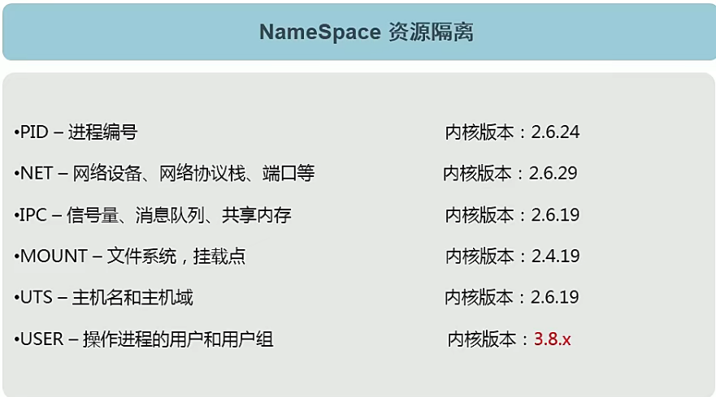

- Cgroup就复制资源管理控制作用，比如进程组使用CPU/MEM的限制，进程组的优先级控制，进程组的挂起和恢复等待

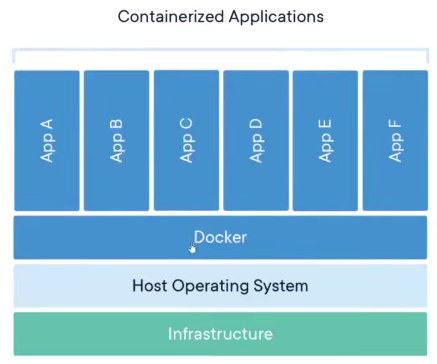


> Docker简介

- Docker基于容器技术的**轻量级**虚拟化解决方案
- Docker是**容器引擎**，把Linux的**cgroup**、**namespace**等容器底层技术进行封装抽象为用户提供了创建和管理容器的便捷界面(包括命令行和API)
- Docker是一个开源项目，诞生于2013年初，基于Google公司推出的**Go**语言实现
- 相比于其他早起的容器技术，Docker引入了一整套容器管理的生态系统，包括分层的镜像模型，容器注册库，友好的Rest API
- 容器是**进程级**的


> 容器的标准化

在2015年，由GOOGLE、Docker、红帽等厂商联合发起了OCI(Open Container Initiative)组织，致力于容器技术的标准化，包括了：

- 容器运行时标准(runtime spec)
  - 简单来说就是规定了容器的基本操作规范，比如如何下载镜像、创建容器、启动容器等
- 容器镜像标准(image spec)
  - 主要定义镜像的基本格式


容器是“速度的”：

- 容器会加速你的软件开发
- 容器会加速你的程序编译和构建
- 容器会加速你的测试
- 容器会加速你的部署
- 容器会加速你的更新
- 容器会加速你的故障恢复


# 2.Docker安装

[Docker官方](https://docs.docker.com/)

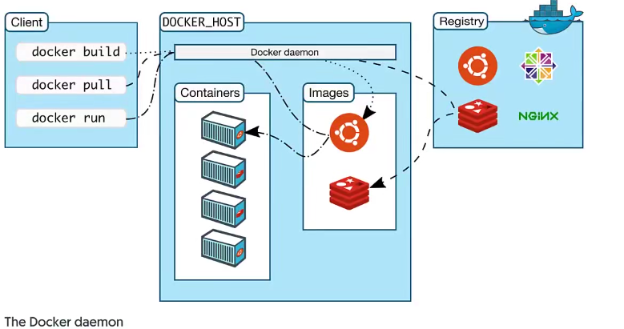

- Linux安装docker

  ```bash
  sudo yum install -y yum-utils
  sudo yum-config-manager --add-repo https://download.docker.com/linux/centos/docker-ce.repo
  sudo yum install docker-ce docker-ce-cli containerd.io
  ```
  


> Docker配置

```json
# /etc/docker/daemon.json
{
        "data-root": "/data/docker", # 工作目录
        "storage-driver": "overlay2",  # 存储驱动
        "insecure-registries": [ "registry.access.redhat.com" , "quay.io"], # 指定允许使用的不安全的镜像仓库
        "registry-mirrors":["https://q2gr04ke.mirror.aliyuncs.com"], # 指定镜像仓库的镜像地址。
        "bip":"10.19.136.1/24", # 默认网桥
        "exec-opts":[ "native.cgroupdriver=systemd" ], # 指定执行选项
        "live-restore":true # 允许容器在 Docker 守护进程结束时继续运行
		"dns" : [
    		"114.114.114.114",
    		"8.8.8.8"
  			] # 配置全部容器的DNS
}
```


# 3.Docker入门

## 3.1.Docker基本命令

- 查看docker版本：

  ```bash
  docker version
  ```

- 查看docker信息

  ```bash
  docker info
  ```

- 查看docker帮助

  ```bash
  docker --help
  ```


## 3.2.镜像和容器

> image镜像

- Docker image是一个`read-only`文件
- 这个文件包含文件系统、源码、库文件、依赖、工具等一些运行application所需要的文件
- 可以理解成一个模板
- docker image具有分层的概念
- 可以自己制作也可以从registry拉取(比如docker hub)

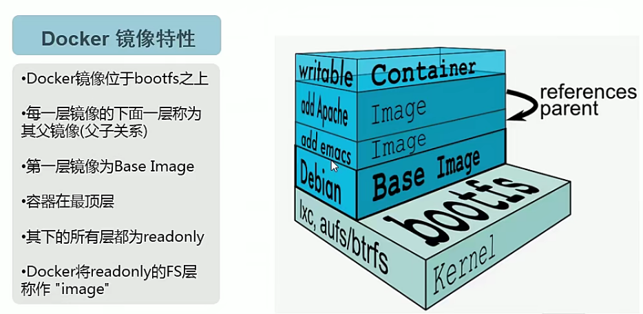


> container容器

- 一个运行中的docker image
- 实质是复制image并在image最上层加上一层`read-write`的层(称之为`container layer`，容器层)
- 基于同一个image可以创建多个container

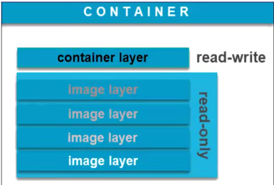


> 容器的生命周期

- 检查本地是否存在镜像，如果不存在即从远端仓库检索
- 利用镜像启动容器
- 分配一个文件系统，并在只读的镜像层外挂载一层可读写层
- 从宿主机配置的网桥接口中桥接一个虚拟接口到容器
- 从地址池配置一个ip地址给容器
- 执行用户指定的指令
- 执行完毕后容器终止


## 3.3.容器命令

- 指定镜像运行容器

  ```bash
  docker container run [options] IMAGE COMMAND
  # 如果本地没有nginx镜像，会从docker hub进行拉取
  # -d参数以守护进程的方式执行
  # --rm参数容器退出就删除
  # -it参数以交互形式方式运行
  # -v参数挂载文件，容器外目录：容器内目录
  # -p参数指定端口映射，主机端口：容器端口
  # -P参数用于将容器内的所有暴露端口映射到主机上的随机端口，映射EXPOSE中的端口
  # -e参数向容器内传递环境，环境变量key=环境变量value
  # --name表示定义容器的唯一名称
  ```

- 查看正在运行的容器

  ```bash
  docker container ls/ps
  # -a参数可以查看创建过的全部容器
  # -q参数可以列出ID
  
  # 查看详细信息
  docker inspect [OPTIONS] NAME|ID [NAME|ID...]
  # -f 指定返回信息的格式
  docker inspect -f '{{.ID}}' fc 
  ```

- 停止容器运行

  ```bash
  docker container stop name/ID
  # id可以只写前几位
  ```

- 删除容器

  ```bash
  docker container rm name/ID
  # id可以只写前几位
  
  docker system prune -f
  # 清除所有停止的容器
  ```

- 给正在运行的容器运行一个命令

  ```bash
  # docker exec [OPTIONS] CONTAINER COMMAND [ARG...]
  docker exec -it mycontainer /bin/bash
  ```

- 从容器创建镜像

  ```bash
  # docker commit [OPTIONS] CONTAINER [REPOSITORY[:TAG]]
  docker commit mycontainer myimage:latest
  # -p在提交更改之前暂停容器
  # -m指定提交的说明信息
  # -a指定作者
  ```

- 导出容器到本地文件

  ```bash
  docker export ID > file_name
  ```

- 把容器文件导入为镜像

  ```bash
  docker import -m "New image imported from tarball" my_ubuntu_v3.tar runoob/ubuntu:v4 
  # -m用于提交时的说明文件，可以在history中查看
  # 用户既可以使用 docker load 来导入镜像存储文件到本地镜像库，也可以使用 docker import 来导入一个容器快照到本地镜像库。这两者的区别在于容器快照文件将丢弃所有的历史记录和元数据信息（即仅保存容器当时的快照状态），而镜像存储文件将保存完整记录，体积也要大。此外，从容器快照文件导入时可以重新指定标签等元数据信息。
  # 此外，也可以通过指定 URL 或者某个目录来导入，例如
   docker import http://example.com/exampleimage.tgz example/imagerepo
  ```

- 查看容器日志

  ```bash
  # docker logs [OPTIONS] CONTAINER
  docker logs mycontainer
  # -f：跟踪实时日志。
  # --since：显示自指定时间以来的日志。
  # --tail：仅显示最后指定行数的日志。
  # -t：在每条日志消息前面显示时间戳。
  ```

- 把容器里的文件/目录复制出来

  ```bash
  # docker cp [OPTIONS] CONTAINER:SRC_PATH DEST_PATH|- 或 docker cp [OPTIONS] SRC_PATH|- CONTAINER:DEST_PATH
  docker cp /tmp/foo.txt mycontainer:/tmp
  docker cp mycontainer:/tmp/bar.txt /tmp
  ```

- 容器连接

  ```bash
  # 自建网络
  docker network name
  # -d指定网络类型
  
  # 连接上网络
  docker run -it --net net_name --name contain_name image_name bash
  # 连接上同一网络的容器可以通过容器名互连
  # 容器内置了DNS，连上同一网络的容器可以互相解析
  
  # 也可以使用--link来连接容器
  # --link name:alias，其中 name 是要链接的容器的名称，alias 是这个连接的别名。
   docker run -d -P --name web --link db:db training/webapp python app.py
  ```
  
  > 在Docker中，`--link`参数和Docker网络都可以用来实现容器之间的连接。这两种方法都有其优点和局限性。
  >
  > `--link`参数是一种简单的方法，可以快速建立容器之间的连接。但是，它只能在同一主机上的容器之间建立连接，并且已经被标记为过时。
  >
  > Docker网络提供了更多的灵活性和功能。它允许您定义自己的网络，并将容器连接到该网络。这样，您就可以在同一网络上的容器之间建立连接，甚至可以跨越多个主机。Docker网络也支持多种驱动程序，可以满足不同的需求。
  >
  > 总之，如果您只需要在同一主机上快速建立容器之间的连接，那么使用`--link`参数可能是一个简单的选择。但是，如果您需要更多的灵活性和功能，那么使用Docker网络可能是一个更好的选择。


## 3.4.容器的两种模式

> attached模式

指的是docker容器运行在前台，并把日志打印在前台


> detached模式

指的是docker容器运行在后台，在运行容器时通过`-d`参数进入，推荐使用detached模式

```bash
docker container run -d -p80:80 nginx
```


> 怎么在detached模式下进行容器操作

- 查看打印日志

  ```bash
  docker container logs name/ID
  # -f参数可以动态监控log
  ```

- 进入交互模式

  ```bash
  # 在运行时进入交互模式。-it参数进入交互模式
  docker container run -it imagename command
  
  # 运行后进入交互模式
  docker container exec -it name/ID command
  ```


## 3.5.容器和虚拟机

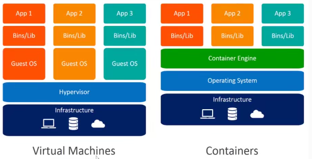

- 虚拟机包含虚拟硬件、内核（操作系统）和用户空间，每个虚拟机都是一个完整的系统
- 容器只包含应用程序和其依赖库，共享主机操作系统的内核，每个容器都是一个隔离的进程

- 容器和虚拟机的主要区别在于：
  - 容器以应用程序为单位，共享主机操作系统的内核，而虚拟机以操作系统为单位，需要模拟硬件资源。
  - 容器更轻量级、快速、节省资源，而虚拟机更重量级、慢速、占用资源。
  - 容器需要与主机操作系统兼容，而虚拟机可以运行不同的操作系统.

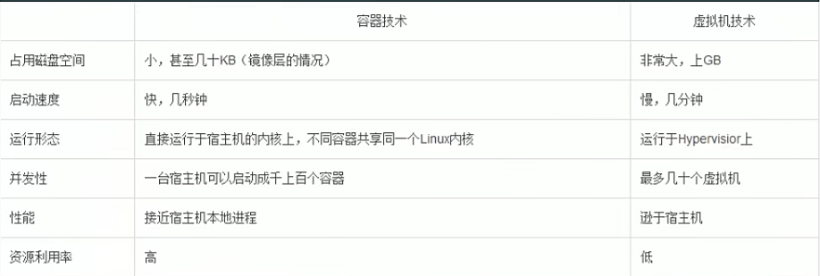

**容器不是Mini虚拟机**

- 容器其实是进程Containers are just processes
- 容器中的进程被限制了对CPU内存等资源的访问
- 当进程停止后，容器就退出了

```bash
# 显示开启的进程
docker container top name/ID
```


## 3.6.docker container run背后发生了什么

```bash
docker container -d --publish 80:80 --name webhost nginx
```

1. 在本地查找是否有nginx这个image，如果没有发现
2. 去远程的image registry查找nginx镜像(默认的registry是Docker Hub)
3. 下载最新版本的nginx镜像(默认nginx:later)
4. 基于nginx镜像来创建一个新的容器，并且准备运行
5. docker engine分配给这个容器一个虚拟地址
6. 在宿主机上打开80端口并把容器的80端口转发到宿主机上(默认为80)
7. 启动容器，运至指定的命令(默认为一个shell脚本去启动nginx)


# 4.镜像image

> 镜像的获取

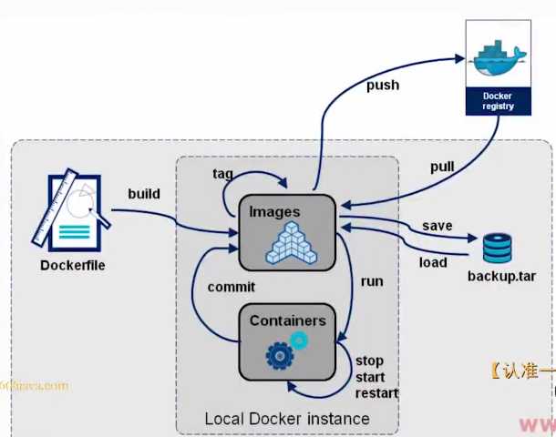

- 从registry获取(online)
  - public
  - private
- 从Dockerfile构建(online)
- 文件导入(offline)


## 4.1.基本命令

- 拉取镜像

```bash
docker image pull nginx

# 拉取指定版本镜像
docker image pull nginx:1.20.0
# 可以去dockerhub或quay查看镜像
```

- 推送镜像到远程仓库

```bash
# 需要登录，且镜像名由要求
docker image push image_name/ID
```

- 给镜像添加一个新标签

```bash
docker image tag SOURCE_IMAGE[:TAG] TARGET_IMAGE[:TAG]
```

- 查看镜像

```bash
docker images
```

- 查看镜像详细信息

```bash
docker image inspect name/ID
```

- 删除镜像

```bash
# 如果当前镜像有容器在使用，则无法删除
docker rmi name/ID

# 删除没有使用的镜像 
docker image prune -a
```

- 查看镜像分历史记录

```
docker image history name/ID
```

- 查找镜像

```bash
docker search image_name
```


## 4.2.文件导入

- 把镜像导出成文件

```bash
docker image save nginx:1.20.0 -o nginx.tar
# 把nginx:1.20.0镜像导出为nginx.image文件
```

- 把文件导入为镜像

```bash
docker image load -i .\nginx.tar
```


## 4.3.Dockerfile

> 什么是Dockerfile

- Dockerfile（Docker 文件）是一个用来构建 Docker image（Docker 影像）的文本文件，包含了用户可以在命令行上调用的所有指令和说明
- Dockerfile（Docker 文件）遵循一种特定的格式和指令集，你可以在 Dockerfile reference（Docker 文件参考）中找到
- Docker image（Docker 影像）由只读层组成，每一层代表了一个 Dockerfile（Docker 文件）指令。这些层是堆叠的，每一层都是相对于前一层的变化

例如现在有一个python程序：

```python
$ hello.py
print("hello docker")
```

如果想要运行起来，我们需要：

```bash
# 先准备python环境
apt-get update && DEBIAN_FRONTEND=noninteractive apt-get install --no-install-recommends -y python3.9 python3-pip python3.0-dev

# 再运行程序
python3 hello.py
```

如果把上面的程序写成一个Dockerfile

```bash
FROM Ubuntu:21.04
RUN apt-get update && DEBIAN_FRONTEND=noninteractive apt-get install --no-install-recommends -y python3.9 python3-pip python3.0-dev 
add hello.py /  # 把文件添加到镜像的/目录
CMD ["python3","/hello.py"]  # 容器执行命令
```

写完Dockerfile后再进行镜像的构建

```bash
docker image build -t hello .
# -t参数为设置tag
# -f指定Dockerfile的名字和路径
# .为构建上下文的路径
# 创建后可以使用tag命令创建一个镜像的新tag
docker image tag hello xiaoxiao
```

镜像构建成功后，你可以分享到dockerhub

```bash
# 先登录到dockerhub
docker login
# 输入用户名和密码后成功登录
# 然后就可以进行分享
docker image push 镜像名:tag
# 镜像名必须以"dockerhub用户名/"开头
# docker logout 退出登录
```


## 4.4.commit与scratch

 如果你只使用老镜像来构建容器，那么你在容器中的所有操作都会消失，那么如果我们想保存我们在容器里的所有操作，那么你就需要把现在的容器变成一个镜像

```bash
docker container commit containername/ID imagename:tag
```

scratch是一个空镜像，我们可以在写Dockerfile时使用，用来构建一个很小的镜像

docker镜像scratch是Docker的保留空镜像，它在构建基础镜像（如debian和busybox）或超小镜像的场景中很有用。使用scratch“镜像”表示你希望Dockerfile中的下一个命令是你的镜像中的第一个文件系统层。虽然scratch出现在Docker Hub上，但你不能拉取、运行或给任何镜像打上scratch标签。相反，你可以在你的Dockerfile中引用它。


# 5.Dockerfile

Dockerfile是一组用于创建自定义镜像的指令，每一行代表一个命令。
常用的Dockerfile指令有：

- FROM：定义要下载和启动的基础镜像，必须是Dockerfile的第一个命令。
- MAINTAINER：定义创建这个Dockerfile的作者或者联系人，是一种文档化的方式。
- RUN：执行一个命令并将结果提交为新的镜像层。

- ADD：复制文件或目录到容器的文件系统，可以是本地路径或URL，如果是压缩文件会自动解压。

- COPY：复制文件或目录到容器的文件系统，只能是本地路径，不会自动解压。

- ENV：定义环境变量，可以在后续的指令中使用。
- ENTRYPOINT：定义容器启动时要执行的命令或脚本。
- CMD：定义容器启动时要执行的默认命令或参数，可以被docker run命令覆盖。
- EXPOSE：声明容器要暴露的端口号

## 5.1.Dockerfile基础

> 基本原则

- 官方镜像优于非官方镜像，如果没有官方镜像，则尽量选择Dockerfile开源的
- 固定版本tag而不是每次都使用latest
- 尽量选择体积小的镜像


> 规则

- 格式：
  - #为**注释**
  - 尽管指令时大小写不敏感的，但是，建议指令用**大写**，内容用**小写**
- Docker是按顺序执行Dockerfile里的指令集合的
- 每一个Dockerfile的第一个非注释指令，必须是"FROM"指令，用于为镜像文件构建中指定基准镜像，后续的执行运行于此基准镜像所提供的运行环境中
  - 实践中，基准镜像可以是任何可用镜像文件，默认情况下，docker build会在docker主机(本地)上查找指定的镜像文件，当其在本地不存在时，则会从Docker registry(远端)上拉去所需镜像文件


## 5.2.通过RUN执行命令

Dockerfile 中的RUN命令是用来在当前的镜像上执行任何命令，并且通过**提交结果创建一个新的层**，建议把多条命令写在一个RUN里面。RUN命令有两种形式：Shell形式和可执行形式。RUN命令通常用来安装应用程序和所需的包

两种形式的区别是：

Shell形式：RUN <command>，这种形式会在一个shell中运行命令，shell的默认值是/bin/sh -c在Linux上或者cmd /S /C在Windows上12。Shell形式可以使用\ (反斜杠)来把一个RUN命令分成多行。
可执行形式：RUN [“executable”, “param1”, “param2”]，这种形式会直接运行可执行文件，不需要经过shell。可执行形式可以避免shell字符串的混乱，也可以在没有指定shell可执行文件的基础镜像上运行命令。
例如：

- Shell形式：RUN echo “Hello World”
- 可执行形式：RUN [“echo”, “Hello World”]

```bash
RUN apt-get update && apt-get install -y curl
```


## 5.3.文件复制和目录操作

> 复制普通文件

`COPY`和`ADD`都可以把local的一个文件复制到镜像里，如果目标目录不存在，则会自动创建

```dockerfile
FROM python:3.6
COPY hello.py /app/hello.py
```

> 复制压缩文件

`ADD`比COPY高级的一点的地方是，如果复制的是一个压缩文件时，ADD会帮助我们自动去解压缩文件。如果源路径是一个URL，ADD会下载并复制该URL的内容到目标路径(不建议使用)

```dockerfile
FROM python:3.6
ADD hello.tar.gz /app/
```

> 如何选择

因此在两个命令选择时，可以遵循，所有文件复制均使用`COPY`指令，仅在需要自动解压缩的场合使用`ADD`

使用ADD和COPY的注意事项有：

- 源路径必须是相对于构建上下文的相对路径。
- 目标路径必须是绝对路径或者以WORKDIR为基础的相对路径。
- 如果目标路径不存在，会自动创建。
- 如果目标路径以/结尾，会被当作一个目录

> WORKDIR命令

WORKDIR是用来设置容器中的工作目录的指令。它相当于在容器中执行cd命令，影响后续的指令，比如RUN，CMD，ENTRYPOINT等。

使用WORKDIR的注意事项有：

- WORKDIR可以在Dockerfile中出现多次，每次都会改变后续指令的工作目录。
- WORKDIR可以是绝对路径或者相对路径，如果是相对路径，会以前一个WORKDIR为基础。
- 如果WORKDIR指定的目录不存在，会自动创建。
- WORKDIR可以和ENV指令结合使用，比如WORKDIR $HOME/app

WORKDIR的示例有：

创建一个名为nodejsapp的目录，并将其设为工作目录：

```dockerfile
WORKDIR /nodejsapp
```

使用相对路径创建多个子目录，并将最后一个设为工作目录：

```dockerfile
WORKDIR /a
WORKDIR b
WORKDIR c
RUN pwd # 输出 /a/b/c
```

使用ENV指令设置的环境变量作为工作目录：

```dockerfile
ENV DIRPATH /app
WORKDIR $DIRPATH
RUN pwd # 输出 /app
```


## 5.4.构建参数和环境变量

`ARG`和`ENV`是经常容易被混淆的两个Dockerfile的语法，都可以用来设置一个变量。但实际上两者有很多的不同

ENV和ARG都是用来设置变量的指令，但是有以下区别：

- ENV是用来设置环境变量的，它们会在构建和运行时生效，可以被容器中的应用程序访问。
- ARG是用来设置构建参数的，它们只在构建时生效，可以被Dockerfile中的其他指令访问。
- ENV可以在RUN指令中使用，也可以在CMD或ENTRYPOINT指令中使用。ARG只能在RUN指令中使用
- ARG可以在构建时通过–build-arg参数覆盖，但是ENV不能在运行时通过-e参数覆盖。

- ARG必须在FROM之前或之后定义，而ENV可以在任何地方定义。
- ENV总是覆盖同名的ARG。如果ENV和ARG都没有设置默认值，那么ARG的值为空字符串。

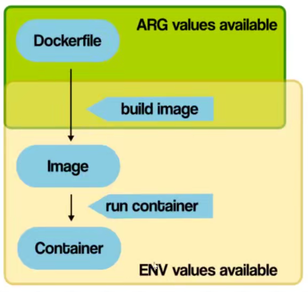

使用ENV和ARG的注意事项有：

- ENV和ARG都可以使用两种格式，一种是<key> <value>，一种是<key>=<value>。
- ENV和ARG都可以引用之前定义的变量，比如ENV PATH /usr/local/bin:$PATH或ARG VERSION=latest。
- ENV和ARG都应该避免使用敏感信息，比如密码或密钥，因为它们可能会泄露到镜像或日志中。
- 可以指定多个环境变量，使用空格隔开

ENV和ARG的优缺点以及使用场景有：

- ENV的优点是可以在容器运行时动态修改环境变量，适合那些需要根据不同环境配置不同参数的应用。ENV的缺点是可能会暴露敏感信息，比如密码或密钥，因为它们会被保存在镜像层中。
- ARG的优点是可以在构建镜像时传递参数，适合那些需要根据不同需求定制不同版本的镜像的场景。ARG的缺点是不能在容器运行时修改参数，而且也可能会暴露敏感信息，因为它们会被保存在构建缓存中。


## 5.5.CMD容器启动命令

CMD可以用来设置容器启动时默认会执行的命令

- 容器启动时默认执行的命令
- 如果docker container run启动容器时指定了其他命令，则CMD会被忽略
- 如果定义了多个CMD，只有最后一个会被执行

- 最好使用exec形式而不是shell形式，以便于接收信号和优雅的退出


## 5.6.ENTRYPOINT

- `CMD`设置的命令，可以在docker container run时传入其他命令，覆盖掉`CMD`的命令，但是`ENTRYPOINT`所设置的命令时一定会被执行的
- `CMD`和`ENTRYPOINT`可以联合使用，`ENTRYPOINT`设置执行的命令，`CMD`传递参数

- 一旦设置了ENTRYPOINT，那么docker container run后面指定的命令都会变成参数传给ENTRYPOINT


> 两者的区别

Dockerfile CMD和ENTRYPOINT命令的详细介绍以及优缺点、注意事项和使用场景如下：

- CMD命令用于指定容器启动时运行的默认命令，可以被docker run命令的参数覆盖。

- ENTRYPOINT命令用于指定容器启动时运行的固定命令，不会被docker run命令的参数覆盖，但可以被–entrypoint选项覆盖。

- CMD和ENTRYPOINT命令可以结合使用，这样CMD指定的值会作为ENTRYPOINT指定的命令的参数。不管书写顺序是怎样的都会这样。`ENTRYPOINT ["CMD"]`

- CMD命令的优点是可以让镜像更灵活，可以根据不同的需求运行不同的命令。

- ENTRYPOINT命令的优点是可以让镜像更专业，可以定义一个特定的可执行程序。

- CMD命令的缺点是如果没有指定ENTRYPOINT，那么CMD指定的命令可能会被意外地替换，导致容器行为不符合预期。

- ENTRYPOINT命令的缺点是如果指定了错误或不合适的命令，那么容器可能无法正常启动或运行。

- CMD和ENTRYPOINT命令的注意事项是只能在Dockerfile中有一个CMD指令和一个ENTRYPOINT指令，如果有多个，只有最后一个会生效。另外，CMD和ENTRYPOINT命令应该遵循Dockerfile的最佳实践，比如使用exec形式而不是shell形式，以便接收信号和优雅地退出。

- CMD和ENTRYPOINT命令的使用场景是当镜像需要提供一个默认或固定的可执行程序或参数，但又允许用户根据需要修改或覆盖时。例如，ubuntu镜像使用CMD [“bash”]来提供一个默认的shell，但用户可以通过docker run ubuntu:20.04 ls -l来运行其他命令。另一个例子是echo镜像使用ENTRYPOINT [“echo”, “Hello”]和CMD [“world”]来提供一个固定的echo命令和一个默认的参数world，但用户可以通过docker run echo:latest Docker来覆盖默认的参数。

- 如果在参数中要使用变量的话

  ```dockerfile
  FROM centos7
  ENV NAME=docker
  CMD ["echo","Hello $NAME"]
  # 这是错误的
  
  # 必须改成下面这样的
  FROM centos7
  ENV NAME=docker
  CMD ["sh","-c","echo Hello $NAME"]
  ```


## 5.7.VOLUME持久化命令

Dockerfile中的VOLUME命令用于指定容器中的挂载点，该挂载点将映射到主机上的位置，该位置在容器创建时指定或从/var/lib/docker/volumes中创建的目录中自动选择。

使用VOLUME命令时，需要注意以下几点：

- VOLUME命令只支持Docker管理的卷。

- 使用docker run -v覆盖Dockerfile。
- VOLUME指定的挂载点不存在会自动创建

- 在Dockerfile中，VOLUME命令只能声明匿名卷，不能指定宿主机上的目录。如果需要将容器的目录挂载到宿主机上，可以使用docker run命令的-v参数。例如，要将容器的/data目录挂载到宿主机的/data目录上，可以使用以下命令：`docker run -v /data:/data image_name`。这将把容器的/data目录挂载到宿主机的/data目录上。如果需要指定访问权限，可以使用以下命令：`docker run -v /data:/data:ro image_name`。这将把容器的/data目录挂载到宿主机的/data目录上，并将其设置为只读 。

- VOLUME可以指定多个挂载点，且都能挂载到一个主机目录

  ```bash
  docker run -v /my/host/dir:/container/mount1 -v /my/host/dir:/container/mount2 myimage。
  # 这将把 /container/mount1 和 /container/mount2 挂载到主机目录 /my/host/dir
  ```


以下是一些使用 VOLUME 命令的最佳实践：

- 在 Dockerfile 中使用 VOLUME 命令时，应该在 Dockerfile 的末尾添加它，以便在运行容器时可以覆盖它。

- 不要在 Dockerfile 中使用 VOLUME 命令来创建新的目录，因为这可能会导致意外的行为。

- 不要在 Dockerfile 中使用 VOLUME 命令来指定文件，因为这可能会导致意外的行为。

- 不要在 Dockerfile 中使用 VOLUME 命令来指定主机目录，因为这可能会导致意外的行为。


使用VOLUME实例

- `VOLUME /var/lib/mysql`：将 `/var/lib/mysql` 目录挂载到容器中。
- `VOLUME ["/var/lib/mysql", "/var/log/mysql"]`：将 `/var/lib/mysql` 和 `/var/log/mysql` 目录挂载到容器中。


## 5.7.练习-构建python Flask镜像


## 5.8.Dockerfile技巧

> 合理使用缓存

Dockerfile 缓存是指 Docker 在构建镜像时，利用已有的层来加速构建过程。每个 Dockerfile 中的命令都会创建一个新的层，包含命令执行前后的文件系统变化。Docker 会检查缓存中是否有可复用的层，如果有，就不会重新创建。

要优化 Dockerfile 缓存，可以按照以下建议：

- 按照逻辑顺序排列命令，把不经常变化的命令放在前面，把经常变化的命令放在后面。
- 尽量减少每个层的大小，合并多个相关的命令，避免不必要的文件或包。
- 使用 .dockerignore 文件来排除不需要的文件或目录。
- 使用 COPY 而不是 ADD 命令，除非需要自动解压缩或从远程 URL 获取文件。
- 使用COPY命令时最好不要一次性复制全部文件，而是只复制每一步所需要的文件
- 使用多阶段构建（multi-stage builds）来减少最终镜像的大小。


> dockerignore

在使用Dockerfile构建镜像时

```bash
docker image build -t name .
# 如果使用.本文件夹来作为build context的话，它会把本文件夹的所有文件发送到Docker daemon
# 如果有不使用且很大的文件的话，就会拖慢我们构建镜像的速度
```

所以我们需要使用dockerignore来帮助我们忽略某些文件

.dockerignore 文件是一个用来指定哪些文件或目录不应该被发送到 docker daemon 的文件。它可以帮助你减少构建上下文的大小，加快构建速度，避免不必要的文件被复制到镜像中。

要使用 .dockerignore 文件，你需要在你的构建目录中创建一个名为 .dockerignore 的文件，并在其中写入你想要忽略的模式。模式的语法类似于 .gitignore 文件，你可以使用通配符、否定符、注释等。

- 在 .dockerignore 文件中，使用匹配模式来指定哪些文件和目录不应该被复制到构建上下文中。匹配模式的格式类似于 .gitignore 文件的格式，每行一个模式，相对于 .dockerignore 文件的路径。
- 如果需要忽略整个目录，可以在目录名后面加上一个斜杠 (/)。

```dockerfile
# 忽略所有的 markdown 文件，除了 README.md
*.md
!README.md

# 忽略 .git 和 .cache 目录
.git
.cache

# 忽略 ignore-this 目录
ignore-this/
```


> 多阶段构建

如果我们现在有一个c文件要运行，我们可以编写一个Dockerfile构建镜像

```dockerfile
FROM gcc:9.4
COPY hello.c /src/hello.c
WORKDIR /src
RUN gcc --static -o hello hello.c
ENTRYPOINT ["/src/hello"]
CMD []
```

构建完成后你会发现这个镜像有1.4G大小，这是因为gcc镜像太大，如果我们只想运行一个c程序，gcc编译过后就没用了，那我们可以使用多阶段构建来减少最终镜像的大小

```dockerfile
FROM gcc:9.4 AS builder
COPY hello.c /src/hello.c
WORKDIR /src
RUN gcc --static -o hello hello.c

FROM alpine:3.13.5
COPY --from=builder /src/hello /src/hello
ENTRYPOINT ["/src/hello"]
CMD []
```

这样最终构建出来的镜像就只有几MB大小了

多阶段构建是一种使用多个FROM语句的Dockerfile技术。每个FROM指令可以使用不同的基础镜像，并且每个指令开始一个新的构建阶段。你可以选择性地从一个阶段复制文件到另一个阶段，从而在最终镜像中去除你不需要的内容。多阶段构建可以帮助你创建更小和更高效的容器，因为最终镜像可以不包含任何构建工具。你也不需要使用外部脚本来协调构建过程，而是可以使用docker-compose up –build来构建和启动应用镜像

The response is derived from web search results.

多阶段构建的优点有：

- 可以让你用一个Dockerfile来创建复杂的构建流程，而不需要使用多个Dockerfile和手动编写的shell脚本。
- 可以让你优化Dockerfile的大小和可读性，同时保持它们的易于维护。
- 可以让你自动化那些需要一定程度编译的应用程序的创建过程，也可以创建针对不同操作系统版本或其他依赖的版本。

多阶段构建的缺点有：

- 可能会增加构建时间，因为每个阶段都需要拉取基础镜像和安装依赖。
- 可能会导致镜像层的重复，如果不同的阶段使用相同的文件或命令。
- 可能会遇到一些兼容性或安全性问题，如果最终镜像和构建镜像使用不同的基础镜像或操作系统。

要避免多阶段构建的缺点，你可以尝试以下一些方法：

- 尽量减少每个阶段的层数，避免使用不必要的RUN，COPY和ADD指令。
- 尽量使用轻量级的基础镜像，比如alpine。
- 尽量在每个阶段后清理不需要的文件和依赖。
- 尽量保持最终镜像和构建镜像的基础镜像或操作系统的一致性


> 尽量使用非root用户

在创建镜像时，如果我们都使用root用户，那么会导致系统安全性下降，使用非root用户可以限制容器内的权限，从而减少容器被攻击的风险，也能避免容器内部以外以root命令运行命令，从而更改主机上的文件

```dockerfile
FROM python:3.9

RUN pip install flash && \
	groupadd -r flash && useradd -r -g flask && \
	mkdir /src && \
	chown -R flask:flask /src

# USER命令用于指定Docker容器中运行的用户身份
USER flask

COPY app.py /src/app.py

WORKDIR /src
ENV FLASH=app.py

# EXPOSE命令用于声明Docker容器将要监听哪些端口。这个命令只是一个声明，在运行时并不会因为这个声明应用就会开启这个端口的服务
# EXPOSE命令的作用：
# 声明容器运行时监听的端口。
# 为容器使用者提供端口信息，方便使用者在运行容器时指定端口映射。
# 在Dockerfile中使用EXPOSE命令可以提高容器的可移植性，因为它可以让其他人更容易地了解容器的使用方式。
EXPOSE 5000

CMD ["flask","run","-h","0.0.0.0"]
```


# 6.Docker存储

默认情况下，在运行中的容器里创建的文件被保存在一个可写的容器层：

- 如果容器被删除了，则数据也没有了
- 这个可写的容器适合特定的容器绑定的，也就是这些数据无法方便的和其他容器共享

Docker数据持久化是Docker数据持久化的意思。它是一种将Docker容器中的数据存储在主机或内存中的方法，使得数据即使容器被停止或删除也能够存活。Docker数据持久化有三种主要方法：Data Volume、Bind Mount和tmpfs 。

- Data Volume：存储在主机文件系统中的特定区域，由Docker管理（/var/lib/docker/volumes/ on Linux）。非Docker进程不应该修改这些数据。Data Volume是Docker中持久化数据的最佳方式。

- Bind Mount：由用户指定存储的数据具体mount在系统什么位置，存储在主机文件系统中的任意位置。非Docker进程可以修改这些数据。
- Tmpfs挂载（在Linux上）：存储在内存中（不在磁盘上）。它们可以被容器用来在容器的生命周期中存储非持久化的状态或敏感信息。

 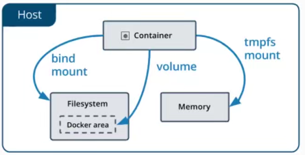


## 6.1.Data Volume

- 查看所有创建的Volume

  ```bash
  docker volume ls
  
  [root@localhost ~]# docker volume ls
  DRIVER    VOLUME NAME
  local     1a095f96248a11484e14228239652e66bd8dc9539156c00ca9918978d5bf7276
  
  ```

- 查看创建的Volume的详细信息

  ```bash
  docker volume inspect volume_name
  
  [
      {
          "CreatedAt": "2023-03-02T16:37:27+08:00",
          "Driver": "local",
          "Labels": null,
          "Mountpoint": "/var/lib/docker/volumes/1a095f96248a11484e14228239652e66bd8dc9539156c00ca9918978d5bf7276/_data",
          "Name": "1a095f96248a11484e14228239652e66bd8dc9539156c00ca9918978d5bf7276",
          "Options": null,
          "Scope": "local"
      }
  ]
  
  # docker ps -a --filter volume=VOLUME_NAME:查看数据卷挂载的容器
  docker ps -a --filter volume=myvolume
  ```
  
- 删除数据卷

  ```bash
  # 删除容器时删除数据卷
  docker rm -v container_name/ID
  # 删除未使用的数据卷
  docker volume prune
  ```

  


## 6.2.Bind VOLUME

- 创建并使用数据卷

  ```bash
  mkdir -p /root/volume
  docker run -d -v /root/volume centos7 # Data Volume方式
  docker run -d -v /root/volume:/volume centos7
  docker run -d -v /root/volume:/volume:ro centos7
  ```

使用docker run命令创建容器，指定-v标记创建一个数据卷并挂载到容器里。可以挂载多个数据卷，也可以设置卷的只读属性，还可以不知道服务器的映射目录，由系统自动指定目录。通过`docker inspect`查看容器映射路径

- 共享数据卷

  ```bash
  docker run -d --volumes-from Sname/ID image_name/ID 
  docker run -it --volumes-from e80  centos:v1 bash
  ```

- 备份

  首先使用 `--volumes-from` 标记来创建一个加载 dbdata 容器卷的容器，并从本地主机挂载当前到容器的 /backup 目录。命令如下：

  ```bash
  $ sudo docker run --volumes-from dbdata -v $(pwd):/backup ubuntu tar cvf /backup/backup.tar /dbdata
  ```

  容器启动后，使用了 `tar` 命令来将 dbdata 卷备份为本地的 `/backup/backup.tar`。

- 恢复

  如果要恢复数据到一个容器，首先创建一个带有数据卷的容器 dbdata2。

  ```bash
  $ sudo docker run -v /dbdata --name dbdata2 ubuntu /bin/bash
  ```

  然后创建另一个容器，挂载 dbdata2 的容器，并使用 `untar` 解压备份文件到挂载的容器卷中。

  ```bash
  $ sudo docker run --volumes-from dbdata2 -v $(pwd):/backup busybox tar xvf
  /backup/backup.tar
  ```

# 7.Docker网络模型

## NAT(默认)

- 为每一个容器分期Network Namespace、设置ip等，并将主机上的Docker容器连接到虚拟网桥docker0上

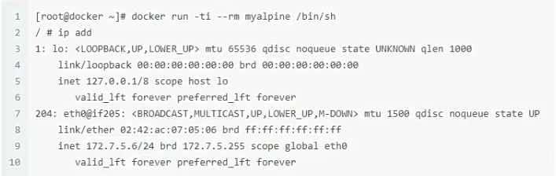


## None

- 拥有自己的Network Namespace，但是并不为Docker容器进行任何网络配置

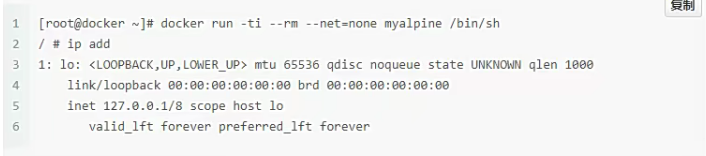

## Host

- 让容器和已经存在的容器共享一个Network Namespace。容器不会虚拟自己的网卡、配置自己的IP等，而是使用宿主机的IP和端口进行通信

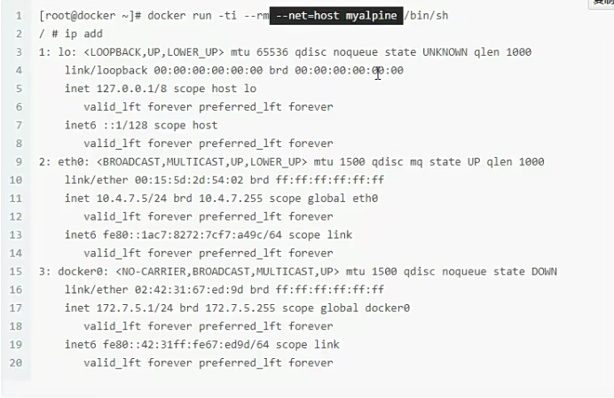

## 联合网络

- 指定新创建的容器和以及存在的容器共享一个Network Namespace，而不是与宿主机共享。新创建的容器不会创建自己的网卡，而是使用宿主机的IP和端口进行通信

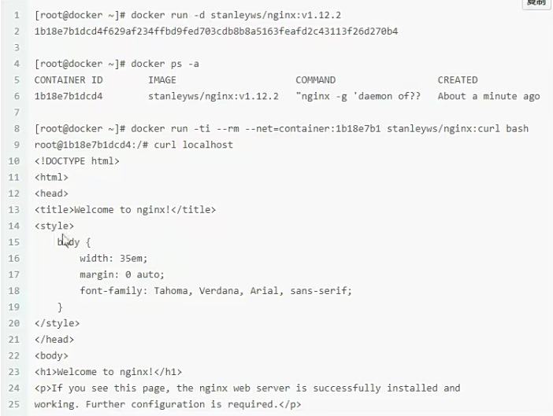


# 8.Docker Compose

Docker Compose 是 Docker 官方编排（Orchestration）项目之一，负责快速在集群中部署分布式应用。

Docker Compose是定义和运行多容器Docker应用程序的工具。使用Compose，可以使用YAML文件来配置应用程序的服务。并使用一个命令就可以创建并从配置中启动所有的服务

Dockerfile 可以让用户管理一个单独的应用容器；而 Compose 则允许用户在一个模板（YAML 格式）中定义一组相关联的应用容器（被称为一个 `project`，即项目），例如一个 Web 服务容器再加上后端的数据库服务容器等。

Compose适用于所有环境：生产、暂存、开发、测试、作为 以及 CI 工作流。它还具有用于管理应用程序整个生命周期的命令：

- 启动、停止和重新生成服务
- 查看正在运行的服务的状态
- 流式传输正在运行的服务的日志输出
- 在服务上运行一次性命令

Compose 使其有效的主要功能是：

- 在单个主机上具有多个隔离环境
- 在创建容器时保留卷数据
- 仅重新创建已更改的容器
- 支持变量和在环境之间移动合成


## 8.1.下载Compose

```bash
curl -L "https://github.com/docker/compose/releases/download/v2.2.2/docker-compose-$(uname -s)-$(uname -m)" -o /usr/local/bin/docker-compose
chmod +x /usr/local/bin/docker-compose
```


## 8.2.使用

> Compose术语

- 服务(Service)：一个应用容器，实际上可以运行多个相同镜像的实例
- 项目(Project)：由一组关联的应用容器组成的一个完整业务单元

一个项目可以由多个服务（容器）关联而成，Compose 面向项目进行管理。


准备测试目录

```bash
$ mkdir composetest
$ cd composetest
```

在测试目录中创建一个名为 app.py 的文件，并复制粘贴以下内容：

```python
composetest/app.py 文件代码
import time

import redis
from flask import Flask

app = Flask(__name__)
cache = redis.Redis(host='redis', port=6379)


def get_hit_count():
    retries = 5
    while True:
        try:
            return cache.incr('hits')
        except redis.exceptions.ConnectionError as exc:
            if retries == 0:
                raise exc
            retries -= 1
            time.sleep(0.5)

@app.route('/')
def hello():
    count = get_hit_count()
    return 'Hello World! I have been seen {} times.\n'.format(count)
```

在 composetest 目录中创建另一个名为 **requirements.txt** 的文件，内容如下：

```bash
flask
redis
```

在 composetest 目录中，创建一个名为 **Dockerfile** 的文件，内容如下：

```dockerfile
FROM python:3.7-alpine
WORKDIR /code
ENV FLASK_APP app.py
ENV FLASK_RUN_HOST 0.0.0.0
RUN apk add --no-cache gcc musl-dev linux-headers
COPY requirements.txt requirements.txt
RUN pip install -r requirements.txt
COPY . .
CMD ["flask", "run"]
```

在测试目录中创建一个名为 docker-compose.yml 的文件，然后粘贴以下内容：

```yaml
version: '3'
services:
  web:
    build: .
    ports:
   		- "5000:5000"
  redis:
    image: "redis:alpine"
```

该 Compose 文件定义了两个服务：web 和 redis。

- **web**：该 web 服务使用从 Dockerfile 当前目录中构建的镜像。然后，它将容器和主机绑定到暴露的端口 5000。此示例服务使用 Flask Web 服务器的默认端口 5000 。
- **redis**：该 redis 服务使用 Docker Hub 的公共 Redis 映像。

在测试目录中，执行以下命令来启动应用程序：

```bash
docker-compose up
```

如果你想在后台执行该服务可以加上 **-d** 参数：

```bash
docker-compose up -d
# -f可以指定docker-compose.yml文件路径
```


## 8.3.配置指令

Compose基本格式：docker-compose [options] [COMMAND] [ARGS...]

- 选项

  - `--verbose` 输出更多调试信息。
  - `--version` 打印版本并退出。
  - `-f, --file FILE` 使用特定的 compose 模板文件，默认为 `docker-compose.yml`。
  - `-p, --project-name NAME` 指定项目名称，默认使用目录名称。

- 命令

  - `build`：构建服务的镜像。

  - `up`：创建并启动服务。

  - `down`：停止并删除服务及其相关资源。

  - `ps`：列出服务的容器。

  - `logs`：查看服务的日志。

  - `exec`：在运行的容器中执行命令。

  - `run`：在指定的服务上运行一次性命令。

  - `stop`：停止服务。

  - `start`：启动服务。

## 8.4.yaml指令

### version

指定本 yml 依从的 compose 哪个版本制定的。

### build

指定为构建镜像上下文路径：

例如 webapp 服务，指定为从上下文路径 ./dir/Dockerfile 所构建的镜像：

```
version: "3.7"
services:
  webapp:
    build: ./dir
```

或者，作为具有在上下文指定的路径的对象，以及可选的 Dockerfile 和 args：

```
version: "3.7"
services:
  webapp:
    build:
      context: ./dir
      dockerfile: Dockerfile-alternate
      args:
        buildno: 1
      labels:
        - "com.example.description=Accounting webapp"
        - "com.example.department=Finance"
        - "com.example.label-with-empty-value"
      target: prod
```

- context：上下文路径。
- dockerfile：指定构建镜像的 Dockerfile 文件名。
- args：添加构建参数，这是只能在构建过程中访问的环境变量。
- labels：设置构建镜像的标签。
- target：多层构建，可以指定构建哪一层。

### command

覆盖容器启动的默认命令。

```
command: ["bundle", "exec", "thin", "-p", "3000"]
```

### container_name

指定自定义容器名称，而不是生成的默认名称。

```
container_name: my-web-container
```

### depends_on

设置依赖关系。

- docker-compose up ：以依赖性顺序启动服务。在以下示例中，先启动 db 和 redis ，才会启动 web。
- docker-compose up SERVICE ：自动包含 SERVICE 的依赖项。在以下示例中，docker-compose up web 还将创建并启动 db 和 redis。
- docker-compose stop ：按依赖关系顺序停止服务。在以下示例中，web 在 db 和 redis 之前停止。

```
version: "3.7"
services:
  web:
    build: .
    depends_on:
      - db
      - redis
  redis:
    image: redis
  db:
    image: postgres
```

注意：web 服务不会等待 redis db 完全启动 之后才启动。

### dns

自定义 DNS 服务器，可以是单个值或列表的多个值。

```
dns: 8.8.8.8

dns:
  - 8.8.8.8
  - 9.9.9.9
```

### dns_search

自定义 DNS 搜索域。可以是单个值或列表。

```
dns_search: example.com

dns_search:
  - dc1.example.com
  - dc2.example.com
```

### entrypoint

覆盖容器默认的 entrypoint。

```
entrypoint: /code/entrypoint.sh
```

也可以是以下格式：

```
entrypoint:
    - php
    - -d
    - zend_extension=/usr/local/lib/php/extensions/no-debug-non-zts-20100525/xdebug.so
    - -d
    - memory_limit=-1
    - vendor/bin/phpunit
```

### env_file

从文件添加环境变量。可以是单个值或列表的多个值。

```
env_file: .env
```

也可以是列表格式：

```
env_file:
  - ./common.env
  - ./apps/web.env
  - /opt/secrets.env
```

### environment

添加环境变量。您可以使用数组或字典、任何布尔值，布尔值需要用引号引起来，以确保 YML 解析器不会将其转换为 True 或 False。

```
environment:
  RACK_ENV: development
  SHOW: 'true'
```

### expose

暴露端口，但不映射到宿主机，只被连接的服务访问。

仅可以指定内部端口为参数：

```
expose:
 - "3000"
 - "8000"
```

### extra_hosts

添加主机名映射。类似 docker client --add-host。

```
extra_hosts:
 - "somehost:162.242.195.82"
 - "otherhost:50.31.209.229"
```

以上会在此服务的内部容器中 /etc/hosts 创建一个具有 ip 地址和主机名的映射关系：

```
162.242.195.82  somehost
50.31.209.229   otherhost
```

### healthcheck

用于检测 docker 服务是否健康运行。

```
healthcheck:
  test: ["CMD", "curl", "-f", "http://localhost"] # 设置检测程序
  interval: 1m30s # 设置检测间隔
  timeout: 10s # 设置检测超时时间
  retries: 3 # 设置重试次数
  start_period: 40s # 启动后，多少秒开始启动检测程序
```

### image

指定容器运行的镜像。以下格式都可以：

```
image: redis
image: ubuntu:14.04
image: tutum/influxdb
image: example-registry.com:4000/postgresql
image: a4bc65fd # 镜像id
```

### links

链接到其它服务中的容器。使用服务名称（同时作为别名）或服务名称：服务别名 `（SERVICE:ALIAS）` 格式都可以。

```sh
links:
 - db
 - db:database
 - redis
```

使用的别名将会自动在服务容器中的 `/etc/hosts` 里创建。例如：

```sh
172.17.2.186  db
172.17.2.186  database
172.17.2.187  redis
```

相应的环境变量也将被创建。

### logging

服务的日志记录配置。

driver：指定服务容器的日志记录驱动程序，默认值为json-file。有以下三个选项

```
driver: "json-file"
driver: "syslog"
driver: "none"
```

仅在 json-file 驱动程序下，可以使用以下参数，限制日志得数量和大小。

```
logging:
  driver: json-file
  options:
    max-size: "200k" # 单个文件大小为200k
    max-file: "10" # 最多10个文件
```

当达到文件限制上限，会自动删除旧得文件。

syslog 驱动程序下，可以使用 syslog-address 指定日志接收地址。

```
logging:
  driver: syslog
  options:
    syslog-address: "tcp://192.168.0.42:123"
```

### network_mode

设置网络模式。

```
network_mode: "bridge"
network_mode: "host"
network_mode: "none"
network_mode: "service:[service name]"
network_mode: "container:[container name/id]"
```

networks

配置容器连接的网络，引用顶级 networks 下的条目 。

```
services:
  some-service:
    networks:
      some-network:
        aliases:
         - alias1
      other-network:
        aliases:
         - alias2
networks:
  some-network:
    # Use a custom driver
    driver: custom-driver-1
  other-network:
    # Use a custom driver which takes special options
    driver: custom-driver-2
```

**aliases** ：同一网络上的其他容器可以使用服务名称或此别名来连接到对应容器的服务。

### restart

- no：是默认的重启策略，在任何情况下都不会重启容器。
- always：容器总是重新启动。
- on-failure：在容器非正常退出时（退出状态非0），才会重启容器。
- unless-stopped：在容器退出时总是重启容器，但是不考虑在Docker守护进程启动时就已经停止了的容器

```
restart: "no"
restart: always
restart: on-failure
restart: unless-stopped
```

注：swarm 集群模式，请改用 restart_policy。

### secrets

存储敏感数据，例如密码：

```
version: "3.1"
services:

mysql:
  image: mysql
  environment:
    MYSQL_ROOT_PASSWORD_FILE: /run/secrets/my_secret
  secrets:
    - my_secret

secrets:
  my_secret:
    file: ./my_secret.txt
```

### sysctls

设置容器中的内核参数，可以使用数组或字典格式。

```
sysctls:
  net.core.somaxconn: 1024
  net.ipv4.tcp_syncookies: 0

sysctls:
  - net.core.somaxconn=1024
  - net.ipv4.tcp_syncookies=0
```

### tmpfs

在容器内安装一个临时文件系统。可以是单个值或列表的多个值。

```
tmpfs: /run

tmpfs:
  - /run
  - /tmp
```

### volumes

将主机的数据卷或着文件挂载到容器里。

```
version: "3.7"
services:
  db:
    image: postgres:latest
    volumes:
      - "/localhost/postgres.sock:/var/run/postgres/postgres.sock"
      - "/localhost/data:/var/lib/postgresql/data"
```

### volumes_from

从另一个服务或容器挂载它的所有卷。

```sh
volumes_from:
 - service_name
 - container_name
```


# 9.私有仓库harbor

Harbor 是一个用于存储和分发 Docker 镜像的企业级 Registry 服务器，它是 Docker Registry 的更高级封装。

你可以使用 Harbor 来部署私有仓库。Harbor 允许用户用命令行工具对容器镜像及其他 Artifact 进行推送和拉取，并提供了图形管理界面帮助用户查看和管理这些 Artifact。

- 下载harbor并解压

```bash
wget https://github.com/goharbor/harbor/releases/download/v2.8.1/harbor-offline-installer-v2.8.1.tgz

tar -zxvf harbor-offline-installer-v2.8.1.tgz 
```

- 进入harbor目录并编写配置文件

```bash
# 复制一份配置文件
cp harbor.yml.tmpl harbor.yml

# hostname: 目标主机的主机名。它应该是目标计算机的 IP 地址或完全限定的域名（FQDN），例如：172.16.1.30 或 reg.yourdomain.com。不要使用 localhost 或 127.0.0.1 作为主机名。
# data_volume: Harbor 数据的存储位置
# harbor_admin_password: 管理员的初始密码。此密码仅在 Harbor 首次启动时生效。请注意，默认用户 名/密码为 admin / Harbor12345
# database: 与本地数据库相关的配置。
# password: 默认数据库密码为 root123，应该改为一个安全的生产环境密码。

# 可选参数
# http:port: 你的 http 的端口号。
# https: 启用 https 协议。如果启用了秘钥，则必须设置为 https。
# port: https 的端口号。
# certificate: SSL 证书的路径，仅在协议设置为 https 时应用。
# private_key: SSL 密钥的路径，仅在协议设置为 https 时应用。


# 启动harbor
./install.sh
```

- 登录

```bash
# 浏览器输入reg.yourdomain.com
# 账户/密码：admin/Harbor12345
```


# 总结

> 使用Docker容器化封装应用程序的好处

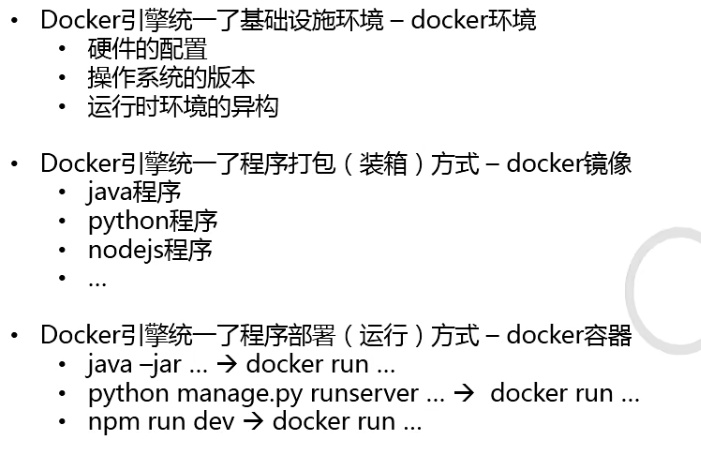


> Docker的缺点


> 基于DOcker容器引擎的开源容器编排工具

- docker compose、docker swarm
- Mesosphere+Marathpn
- Kubernetes(K8S)
