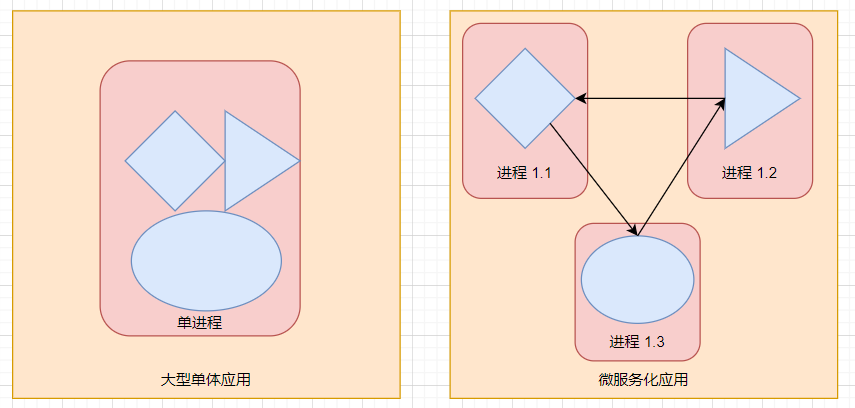
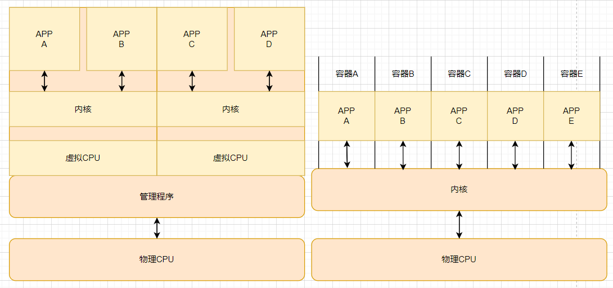

近几年来，大型单体应用逐渐被微服务所替代，微服务彼此之间解耦，所以可以被独立开发、部署、升级、伸缩。这使得我们可以对每一个微服务实现快速迭代，但随着部署组件的增多和数据中心的增长，配置、管理并保持系统的正常运行变得越来越困难。我们需要能帮助我们对应用自动调度、配置、监管和故障处理的自动化措施。这就是Kubernetes所发挥的作用，Kubernetes能帮助我们部署应用并帮助我们监管整个系统，而我们只需要监控Kubernetes即可。

Kubernetes抽象了数据中心的硬件基础设施，使得对外暴露的只是一个巨大的资源池。在部署和运行组件的时，Kubernetes会为每个组件都选择一个合适的服务器，且保证每个组件之间都能彼此通信。

## 1.1.Kubernetes系统的需求

通过近几年应用程序开发部署的变化，我们可以更好的理解Kubernetes和容器技术带来的好处。

### 1.1.1.从单体应用到微服务

单体应用由很多组件组成，这些组件紧密的耦合在一起，由于它们在同一个操作系统进程中运行，所以在开发、部署、管理的时候必须以同一个实体进行进行。对单体应用来说，即使是某个组件中一个小的修改，都需要重新部署整个应用。当系统负载日益增加的时候，就需要不断为系统增加资源，所以成本会越来越高。

**将应用拆解为多个微服务**

单体应用对系统的超大负荷迫使将复杂的大型单体应用拆分成小的可独立部署的微服务组件，每个微服务以独立的进程运行，并通过简单且定义良好的接口与其他微服务通信。因为每个微服务都是独立的进程，且提供相对静态的API，所以只要API接口不变或兼容，那么改动一个微服务，对其他微服务之间的通信并没有什么影响。

**微服务的扩容**

微服务的扩容只针对单个服务，把能进行扩容的组件进行水平扩展，不能进行扩容的组件进行垂直扩展。

**部署微服务**

当微服务的数量变多时，部署的组合数变多且组件间依赖的组合数也在增加，部署会变得更加困难。运维需要配置每一个微服务使得作为一个单一系统能正常工作，且在报错时会由于跨越了多个进程和机器导致调试代码和定位问题变得困难，但可以使用分布式定位系统解决，如zipkin。

分布式定位系统是一种用于在分布式计算环境中对资源进行精确定位和管理的系统。它通常用于大规模的分布式系统或云计算环境中，帮助管理者有效地定位和管理系统中的各种资源，如计算节点、存储设备、网络设备等。

**环境需求的差异**

当在一个服务器上部署多个微服务时，由于每个组件所需要的依赖库都不一样，所以可能会发生依赖冲突。

### 1.1.2.一致的环境

多主机上部署多个组件时的最大问题就是程序运行环境的差异性，这个差异性不仅存在于开发环境与生产环境之间，甚至还存在于机器与机器之间，特别是生产机器的环境会随着时间的推移而变化。所以最理想的做法就是让应用在开发和生产阶段可以运行在一样的环境下。

### 1.1.3.无运维

开发和运维的关注点不一样，开发更关注于开发新的功能，而运维更加关注基础设施的变动会怎样影响应用程序。理想的情况下，部署应用程序的人就是开发者本身，Kubernetes能够实现这个想法。Kubernetes通过对实际硬件做抽象，然后将自身暴露成一个平台，用于部署和运行应用程序。它允许开发者自己配置和部署应用程序，不需要系统管理员的帮助，让系统管理员不需要关注实际运行在平台上的应用程序。

## 1.2.介绍容器技术

当需要运行很多组件，但这些组件可能需要存在冲突的依赖库版本，我们可以把冲突的组件放在不同的虚拟机上，但当组件的数量变得更多时，会浪费许多硬件资源，且不同的虚拟机都需要单独配置和管理，所以还会浪费需要人力资源。

### 1.2.1.使用容器技术隔离组件

事实上可以使用容器技术把同一台机器上的不同组件进行隔离，容器技术采用namespace和cgroups对不同应用进程进行隔离和限制，当不同的组件进程互相"看不见"的时候，带来的依赖冲突自然也就不存在了。

Linux命名空间(namespase)是使每个进程只看见它自己的系统视图(文件、进程、网络接口、主机名等)。Linux控制组(cgroups)限制进程能使用的资源量(CPU、内存、网络带宽等)。

**使用Linux命名空间隔离进程**

默认情况下，每个LInux系统只有一个命名空间。所有的系统资源属于这一个命名空间。但是用户能创建额外的命名空间，还能在这个新建的命名空间内组织资源，对于一个进程，可以在其中一个命名空间运行它，进程将只能看到同一个命名空间下的资源。

命令空间有以下类型：

- Mount
- Process ID
- Network
- Inter-process communicaion(IPC)
- UTS
- user ID

每个命名空间用来隔离一组特定的资源，例如，UTS命名空间决定了运行在命名空间里的进程能看见那些主机名和域名，通过把不同进程分配到不同的UTS命名空间里面，能使它们看见不同的本地主机名。这些进程就好像运行在不同的机器上。

**限制进程的可用资源**

cgroups是一个LInux内核功能，被用来限制一个进程或者一组进程的资源使用。一个进程的资源使用量不能超过被分配的量。就跟进程使用的资源不可能超过物理资源一样。

### 1.2.2.虚拟机VS容器

和虚拟机相比，容器更加轻量级，它允许在相同硬件上运行更多数量的组件，主要的原因是虚拟机需要运行自己的一组系统进程，这就产生了除组件进程外的计算资源消耗。而容器仅仅是运行在宿主机上被隔离的单个进程，仅消耗应用容器消耗的资源，不会有其他进程的开销。

每个VM不仅运行操作系统的完整副本，还运行操作系统需要运行的所有硬件的虚拟副本。虚拟机会使用管理程序将物理硬件资源分成较小部分的虚拟硬件资源，从而被每个虚拟机里的操作系统使用。运行在虚拟机里的应用程序会执行虚拟机操作系统的系统调用，然后虚拟机内核会通过管理程序在物理机上的CPU运行x86指令。

而容器会运行宿主机上的一个系统调用，不需要对资源做虚拟化。但虚拟机的好处在于完全隔离的环境，容器调用同一个内核，可能会有安全隐患。

| 虚拟机             | 容器             |
| ------------------ | ---------------- |
| 重量级             | 轻量级           |
| 每个VM独立操作系统 | 共享主机操作系统 |
| 硬件级虚拟化       | os虚拟化         |
| 完全隔离           | 进程级隔离       |

### 1.2.3.Docker容器平台

尽管容器技术已经出现很久了，但却是随着Docker容器平台的诞生才变得广为人知。Docker是第一个能使容器能在不同机器之间移植的系统。不仅简化了打包应用的流程，也简化了打包应用的库和依赖，甚至整个操作系统的文件都能被打包成一个简单的可移植的包，这个包可以被运行在任何运行Docker的机器上。

Docker可以把应用程序封装在镜像里面，与虚拟机镜像相比，容器镜像是由多层镜像构成，不用的应用程序可以共享使用相同的镜像，以此来减少镜像所需要的实际存储空间大小。

Docker是一个大包、分发和运行应用程序的平台。能够将应用程序和应用程序所依赖的整个环境打包在一起。Docker有三个重要的概念：

- 镜像：Docker镜像包含了打包的应用程序机器所依赖的环境。包含了引用程序可用的文件系统和其他元数据。
- 镜像仓库：用于存放Docker镜像的地方。可以把本地镜像上传到仓库，也可以把别人上传的镜像拉取到本地。
- 容器：Docker容器通常是一个LInux容器，基于Docker镜像被创建。一个运行中的容器是一个运行在Docker主机上的进程，但它和主机以及运行在主机上的其他进程都是隔离的。这个进程的资源也是受限的，只能访问分配给它的资源。
- 

