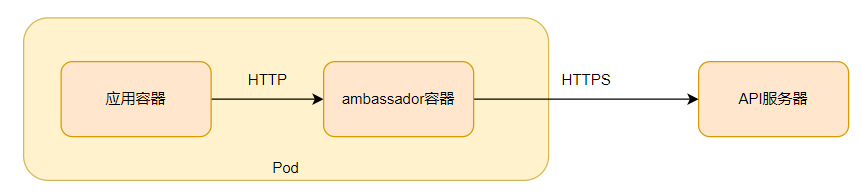
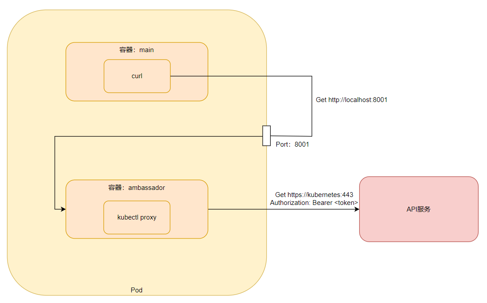

> 本章内容包括：
> - 通过Downward API传递信息到容器
> - 探索Kubernetes REST API
> - 把授权和服务器验证交给kubectl proxy
> - 从容器内部访问API服务器
> - 理解ambassador容器模式
> - 使用Kubernetes客户端库

应用往往需要获取运行环境的一些信息，包括应用自身以及集群中其他组件的信息。之前我们已经了解了Kubernetes如何通过环境变量以及DNS进行服务发现，但其他信息如何处理呢？在后面我们将了解特定的pod和容器元数据如何被传递到容器，了解在容器中运行的应用如何便捷的与Kubernetes API服务器进行交互，从而获取在集群中部署资源的信息。
# 1 通过Downward API传递元数据

在之前的章节中，了解到了如何通过ConfigMap和Secret卷向应用传递配置数据。这对于pod调度、运行前预设的数据是可行的。但对于不能预先知道的数据，比如pod的IP、主机名或者是pod自身的名称呢？此外，对于那些已经在别处定义的数据，比如pod的标签和注解呢？不想再多个地方重复保留重复的数据。

对于上述的问题，可以通过使用Kubernetes Downward API解决。Downward API允许我们通过环境变量或文件(在downwardAPI卷中)传递pod的元数据。这种方式主要是将在pod的定义和状态中取得的数据座位环境变量和文件的值。
## 1.1 可用的元数据

Downward API可以给在pod中运行的进程暴露pod的元数据。目前可以传输以下数据：
- pod的名称
- pod的IP
- pod所在的命名空间
- pod运行节点的名称
- pod运行所归属的服务账户的名称
- 每个容器请求的CPU和内存的使用量
- 每个容器可以使用的CPU和内容的限制
- pod的标签
- pod的注解
上面提到的大部分数据既可以通过环境变量也可以通过DownwardAPI卷传递给容器，但是标签和注解只可以通过卷暴露。部分数据可以通过其他方式(可以直接从操作系统获取)获取，但是DownwardAPI提供了一种更加便捷的方式。
## 1.2 通过环境变量暴露元数据

```yaml
apiVersion: v1
kind: Pod
metadata:
  name: downward
spec:
  containers:
  - name: main
    image: busybox
    command: ["sleep", "9999999"]
    resources:
      requests:
        cpu: 15m
        memory: 100Ki
      limits:
        cpu: 100m
        memory: 4Mi
    env:
    - name: POD_NAME
      valueFrom:
        fieldRef:
          fieldPath: metadata.name   # 应用pod manifest中的元数据名称字段
    - name: POD_NAMESPACE
      valueFrom:
        fieldRef:
          fieldPath: metadata.namespace
    - name: POD_IP
      valueFrom:
        fieldRef:
          fieldPath: status.podIP
    - name: NODE_NAME
      valueFrom:
        fieldRef:
          fieldPath: spec.nodeName
    - name: SERVICE_ACCOUNT
      valueFrom:
        fieldRef:
          fieldPath: spec.serviceAccountName
    - name: CONTAINER_CPU_REQUEST_MILLICORES
      valueFrom:
        resourceFieldRef:   # 容器请求的CPU和内存使用量使用resourceFieldRef
          resource: requests.cpu
          divisor: 1m       # 对于资源相关资源。定义一个基数单位从而生成每一部分的值
    - name: CONTAINER_MEMORY_LIMIT_KIBIBYTES
      valueFrom:
        resourceFieldRef:
          resource: limits.memory
          divisor: 1Ki
```
当我们进程在运行时，它可以获取所有我们在pod的定义文件中设定的环境变量。对于暴露资源请求和使用限制的环境变量，我们会设定一个基数单位。实际的资源请求值和限制值除以这个基数单位，所得的结果通过环境变量暴露出去。在前面的例子中，我们设定CPU请求的基数为1m(1millicore,也就是千分之一核CPU)，当我们设置的资源请求为15m时，环境变量CONTAINER_CPU_REQUEST_MILLICORES的值就是15。

对于CPU资源请求量和使用限制可以被设定为1，也就意味着整颗CPU的计算能力，也可以设置为1m，即千分之一核的计算能力。对于内存的资源请求和使用限制可以设定为1(字节)，也可以是1k(kilobute)或1Ki(kibibute)，同样可以可以设置为1M(megavyte)或者1Mi(mebibyte)。
> 在 Kubernetes (k8s) 中，资源量的单位通常以 `Ki` 和 `k` 结尾，这两个单位代表了不同的数量级。
> - `Ki` 代表 Kibibyte，是基于 2 的幂次方的单位。1 Ki = 2^10 = 1024 bytes。
> - `k` 代表 Kilobyte，是基于 10 的幂次方的单位。1 k = 10^3 = 1000 bytes。
## 1.3 通过DownwardAPI卷来传递元数据

如果更倾向于使用文件的方式来暴露元数据，可以定义一个downwardAPI卷并挂载到容器中。由于不能通过环境变量暴露，所以必须使用downwardAPI卷来暴露pod标签或注解。

跟环境变量一样，需要显示的指定元数据字段来暴露给进程。
```yaml
apiVersion: v1
kind: Pod
metadata:
  name: downward
  labels:
    foo: bar
  annotations:
    key1: value1
    key2: |
      multi
      line
      value
spec:
  containers:
  - name: main
    image: busybox
    command: ["sleep", "9999999"]
    resources:
      requests:
        cpu: 15m
        memory: 100Ki
      limits:
        cpu: 100m
        memory: 4Mi
    volumeMounts:
    - name: downward
      mountPath: /etc/downward  # 在这个目录挂载
  volumes:
  - name: downward
    downwardAPI:
      items:
      - path: "podName"   # pod名称将被写入podName文件中
        fieldRef:
          fieldPath: metadata.name
      - path: "podNamespace"
        fieldRef:
          fieldPath: metadata.namespace
      - path: "labels"
        fieldRef:
          fieldPath: metadata.labels
      - path: "annotations"
        fieldRef:
          fieldPath: metadata.annotations
      - path: "containerCpuRequestMilliCores"
        resourceFieldRef:
          containerName: main
          resource: requests.cpu
          divisor: 1m
      - path: "containerMemoryLimitBytes"
        resourceFieldRef:
          containerName: main
          resource: limits.memory
          divisor: 1
```
现在定义了一个叫做downward的卷，并且挂载到/etc/downward目录挂载到容器中。卷包含的文件通过卷定义中的downwardAPI.items属性来定义。挂载的文件内容会以key=value的形式保存在单独的行中，如对应多个值，则写在同一行，并且以换行符\n连接。
> 跟ConfigMap和Secret一样，downwardAPI也可以定义defaultMode属性来改变文件的访问权限。

**修改标签和注解**

可以在pod运行时修改标签和注解。当标签和注解被修改后，Kubernetes会更新存有相关信息的文件，从而使pod可以获取最新的数据，这也解释了为什么不能通过环境变量的方式暴露标签和注解，在环境变量的方式下，一旦标签和注解被修改，新的值将无法暴露。

**在卷的定义中引用容器级的元数据**

当暴露容器级的元数据时，如容器可使用的资源限制或资源请求，必须指定引用资源字段对应的容器名称.
```yaml
sepc:
  volumes:
  - name: downward
    downwardAPI:
      items:
      - path: "containcpu"
        resourceFieldRef:
          containerName: main
          resource: requests:cpu
          divisor: 1m
```
这样做的原因是我们对于卷的定义是基于pod级别的，而不是容器级的。当引用卷定义某一个容器的资源字段时，需要明确说明引用的容器名称，这个规则对于包含单容器的pod同样使用。

通过downwardAPI的方式获取的元数据是相当有限的，如果要获取更多的元数据，需要使用直接访问KubernetesAPI服务器的方式。
# 2 与Kubernetes API服务器交互

在上面的介绍可以知道，downwardAPI提供了一种简单的方式，将pod和容器的元数据传递给它们内部运行的进程。但这种方式只可以暴露一个pod自身的元数据，且只能暴露一部分元数据。在进程需要知道其他pod的信息，甚至是集群中其他资源的信息时，downwardAPI将无能为力。

## 2.1 探究REST API

可以直接运行`kubectl cluster-info`命令来得到服务器的URL
```
[root@master ~]# kubectl cluster-info
Kubernetes master is running at https://192.168.19.141:6443
KubeDNS is running at https://192.168.19.141:6443/api/v1/namespaces/kube-system/services/kube-dns:dns/proxy
```
由于服务器使用https协议并且需要授权，所以与服务器交互并不是一件容易的事情，但我们可以使用`kubectl proxy`命令通过代理与服务器交互，而不是自行处理验证过程。

**通过kubectl proxy访问API服务器**

`kubectl proxy`命令启动了一个代理服务来接收来自你本机的HTTP连接并转发至API服务器，同时处理身份认证，所以不需要每次请求都上传认证凭证。它也可以确保我们直接与真实的API服务器交互，而不是一个中间人(每次验证服务器证书的方式)。直接在服务器上运行`kubectl proxy`命令即可，不需要传递任何其他参数，因为kubectl已经知晓所需的所有参数(服务器URL，认证凭证等)。一旦启动，代理服务就将在本地8001端口接收连接请求
```
[root@master ~]# curl localhost:8001
{
  "paths": [
    "/api",
    "/api/v1",
    "/apis",
    ...
```
这里我们发送请求给代理，代理接着发送给API服务器，然后代理将返回从服务器的所有信息。

**通过kubectl proxy研究Kubernetes API**

当我们访问本地8001端口时，API服务器返回了一组路径清单。这些路径对应了我们创建pod、service这些资源时定义的API组和版本信息。
> 没有被列入API组的初始资源类型现在一般被认为归属于核心的API组。如/api/v1。

**研究批量API组的REST endpoint**

```bash
[root@master ~]# curl localhost:8001/apis/batch
{
  "kind": "APIGroup",
  "apiVersion": "v1",
  "name": "batch",
  "versions": [    # 批量API组包含两个版本
    {
      "groupVersion": "batch/v1",
      "version": "v1"
    },
    {
      "groupVersion": "batch/v1beta1",
      "version": "v1beta1"
    }
  ],
  "preferredVersion": {     # 不推荐使用
    "groupVersion": "batch/v1",
    "version": "v1"
  }
```
这个响应信息展示了可用版本、客户端推荐使用版本在内的批量API组信息，让我们接着看路径下的内容
```bash
[root@master ~]# curl localhost:8001/apis/batch/v1
{
  "kind": "APIResourceList",
  "apiVersion": "v1",
  "groupVersion": "batch/v1",   # API组中的API资源清单
  "resources": [   # 包含了这个组中所有的资源类型
    {
      "name": "jobs",
      "singularName": "",
      "namespaced": true,    # 被指定命名空间的Job资源
      "kind": "Job",
      "verbs": [       # 资源对应可以使用的动词
        "create",
        "delete",
        "deletecollection",
        "get",
        "list",
        "patch",
        "update",
        "watch"
      ],
      "categories": [
        "all"
      ],
      "storageVersionHash": "mudhfqk/qZY="
    },
    {
      "name": "jobs/status",
      "singularName": "",
      "namespaced": true,
      "kind": "Job",
      "verbs": [
        "get",
        "patch",
        "update"
      ]
    }
  ]
}
```
API服务返回了在batch/V1目录下API组中的资源类型以及REST endpoint清单。除了资源的名称和相关的类型，API服务器也包含了一些其他信息，比如资源是否被指定了命名空间、名称简写、资源对应可以使用的动词列表等。

返回列表描述了在API服务器中暴露的REST资源，"name":"jobs"行信息告诉我们API包含了/apis/batch/v1jobs的endpoint，"verbs"数组告诉我们可以通过endpoint恢复、修改以及删除job资源。

**列举集群中所有的Job实例**

```bash
[root@master ~]# curl localhost:8001/apis/batch/v1/jobs
```
更多API使用方法可以在官网进行查看[Kubernetes API | Kubernetes](https://kubernetes.io/zh-cn/docs/reference/kubernetes-api/)
## 2.2 从pod内部与API服务器进行交互

在上面我们已经知道如何在本机通过kubectl与API服务器进行交互了，但pod可没有kubectl命令可以使用，可以想要从pod内部与API服务器进行交互，需要关注以下三件事情：
- 确定API服务器的位置
- 确保是与API服务器进行交互
- 通过服务器的认证

当我们创建好容器并`kubectl exec -it podname bash`进入容器后，就可以尝试与API服务器进行交互了。

**获取API服务器位置**

还记得集群中默认的这个svc嘛，这个svc就记录了API服务器的位置，我们可以使用FQDN方式访问，也可以查看环境变量。
```bash
[root@master ~]# kubectl get svc
NAME                 TYPE           CLUSTER-IP      EXTERNAL-IP   PORT(S)        AGE
kubernetes           ClusterIP      10.96.0.1       <none>        443/TCP        21d
```

**验证服务器身份**

还记得集群中有一个默认的Secret嘛，这个Secret包括了与API服务器交互的的证书
```bash
[root@master ~]# kubectl get secret
NAME                  TYPE                                  DATA   AGE
default-token-lch48   kubernetes.io/service-account-token   3      21d

curl --cacere /var/run/secrets/kubernetes.io.serviceaccount/ca.crt https:kubernetes
```
可以把证书放在环境变量`CURL_CA_BUNDLE`中，这可以就可以不明确指定证书路径了。但这样还不能成功与APi服务器进行交互，因为我们还没有进行授权。在这个默认Secret中也包括了授权文件token。
```bash
Token=$(cat /var/run/secrets/kubernetes.io.serviceaccount/tiken)
curl -H "Authorization: Bearer $TOKEN" https:kubernetes
```
这样就能成功访问到API服务器了 
> 如果我们正在使用一个带有RABC机制的Kubernetes集群，服务账户可能不会被授权访问API服务器。

pod与Kubernetes交互流程：
- 应用应该验证API服务器的正式是否为证书机构所签发
- 应用应该将它在token文件中持有的凭证通过Authorization标头来获取API服务器的授权
- 当对Pod所在命名空间的API对象进行CRUD操作时，应该使用namespace文件来传递命名空间信息到API服务器。
## 2.3 通过ambassador容器简化与API服务器的交互

使用HTTPS、证书和授权凭证，对于开发者来说都有点复杂。所以可以在pod中使用`kubectl proxy`命令简化这一过程。

**ambassador容器模式**

想象一下，如果一个应用需要查询API服务器。除了之前讲过的直接与API服务器交互，可以在主容器运行的同时，启动一个ambassador容器，并且在其中运行`kubectl proxy`命令，通过它来实现与API服务器的交互。

在这种模式下，运行在主容器的应用不是直接与API服务器进行交互，而是通过HTTP协议，与ambassador连接，并且由ambassador通过HTTPS协议来连接API服务器，对应用透明的来处理安全问题，这种方式同样使用了默认凭证Secret卷中的文件。


因为在同一个pod中的所有连接共享同样的回送网络接口，所以我们的应用可以使用本地的端口来访问代理。
```yaml
apiVersion: v1
kind: Pod
metadata:
  name: curl-with-ambassador
spec:
  containers:
  - name: main
    image: tutum/curl
    command: ["sleep", "9999999"]
  - name: ambassador
    image: luksa/kubectl-proxy:1.6.2

# 这里使用的kubectl-proxy是使用了以下脚本
#!/bin/sh

API_SERVER="https://$KUBERNETES_SERVICE_HOST:$KUBERNETES_SERVICE_PORT"
CA_CRT="/var/run/secrets/kubernetes.io/serviceaccount/ca.crt"
TOKEN="$(cat /var/run/secrets/kubernetes.io/serviceaccount/token)"

/kubectl proxy --server="$API_SERVER" --certificate-authority="$CA_CRT" --token="$TOKEN" --accept-paths='^.*' --port=8001


```
通过以上的方式，在pod中开启一个ambassador容器，这样就能像之前在主机中curl方式一样了，默认端口也是8001。

# 3 客户端库与API服务器交互

除了以上几种方式，还可以使用Kubernetes API客户端与API服务器进行交互，可以在官方文档查看具体信息：[客户端库 | Kubernetes](https://kubernetes.io/zh-cn/docs/reference/using-api/client-libraries/)

如果你使用的开发语言没有可用的客户端库，可以使用swagger API框架生成客户端库和文档。Kubernetes API服务器在/swaggerapi下暴露Swagger API定义，在/swagger.json下暴露OpenAPI定义，可以在[swagger](http://swagger.io)查看详细信息。

swagger不仅是描述API的工具，如果暴露了swagger API定义，还能提供一个用于查看REST API 的web UI。可以使用`--enable-swagger-ui=true`选项运行API服务器对其进行激活。