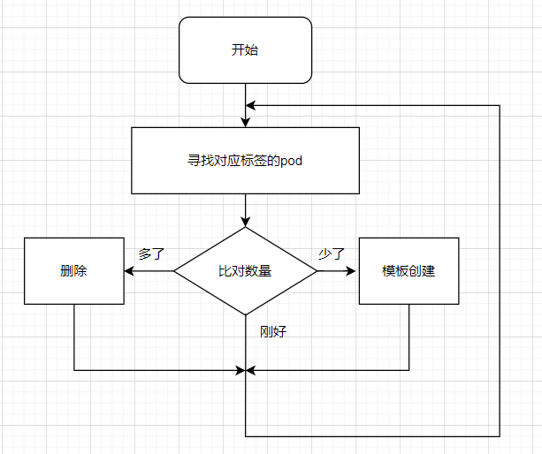

> 本章内容包括：
> - 保持pod的健康
> - 运行同一个pod的多个实例
> - 在节点异常之后自动重新调度pod
> - 水平缩放pod
> - 在集群节点上运行系统级的pod
> - 运行批量任务
> - 调度任务定时执行或在未来执行一次

在上一节中，学会了如何创建、监控和管理pod，但在实际应用中，我们希望部署能自动保持运行，并且保持健康，无需手动干预任何东西，而要做到以上几点，我们需要创建`ReplicationController` 或`Deployment`这类资源，由他们来创建并管理实际的pod。
# 1 保持pod健康

在Kubernetes中，只要将pod调度到某个节点上，该节点上的kubelet就会运行pod的容器，从此只要该pod存在，就会保持运行。如果容器的主进程崩溃，那么kubelet将重启容器。如果pod中运行的应用程序有一个隔一段时间就会导致该程序崩溃的bug，Kubernetes会自动重启应用程序，所以即使该应用程序本身没有做任何特殊的事情，在Kubernetes中运行也会自动获得自我修复的能力。

Kubernetes会保证把崩溃的pod自动重启，pod的状态直接由pod中运行的主容器决定，主容器状态又由容器内运行的应用程序决定，所以应用程序是否能在无法响应的时候被Kubernetes重启，最主要的就是Kubernetes能准确判断应用程序的状态。

即使进程没有崩溃，有时应用程序也会停止正常工作。例如，具有内存泄漏的java应用程序抛出`OOM`，但JVM进程会一直运行，导致容器无法正常在应用程序无响应时退出。所以为确保这种应用程序能正常退出，必须从外部检查应用程序的运行状况，而不是依赖于应用的内部监测。
## 1.1 存活探针

Kubernetes可以通过存活探针(liveness probe)检查容器是否还在运行。可以为pod中的每个容器单独指定存活探针。Kubernetes会定期执行探针，如果探测失败，则重新启动容器。

Kubernetes有以下三种探测容器的机制：
- HTTP GET探针对容器的IP地址(指定的端口和路径)执行HTTP GET请求。如果探针收到响应并且响应的状态码不代表错误，则认为容器状态是正常的。如果容器返回错误响应码或根本没有响应，则认为容器状态异常，容器将被重新启动。
- TCP套接字探针尝试与容器指定端口建立TCP连接。如果连接成功建立，则代表容器状态正常，否则重启容器。
- Exec探针在容器内执行命令，并检查命令的退出状态码。如果状态码为0，标识容器正常，否则重启。

### 1.1.1 HTTP存活探针

来试着为一个Web应用添加一个存活探针来检查Web服务器是否能提供请求。
```kubernetes
apiVeersion: v1
kind: Pod
metadata:
	name: kubia-liveness
spec:
	containers:
	- image: luksa/kubia-unhealthy
	  name: kubia
	  livenessProbe:
		httpGet:   # HttpGet存活探针
		    path: /  # 请求路径
		    port: 8080  # 端口
		initialDelaySeconds: 3 # 等待初始化时间
		periodSeconds: 5  # 间隔时间
		failureThreshold：3 # 连续失败的次数，默认3
		timeoutSeconds：1 # 探针执行超时的时间，默认1秒
```
该pod的描述文件定义了一个httpGet存活探针，该探针告诉Kubernetes定期5秒在指定路径上执行http Get请求，以确定容器是否健康，该请求在容器运行3秒后开始执行。

### 1.1.2 使用存活探针

创建该pod后，可以使用`kubectl get pod`查看信息
```bash
[root@master k]# kubectl get po
NAME                             READY   STATUS    RESTARTS   AGE
kubia-liveness                   1/1     Running   1          31m
```
RESTARTS列显示已被重启了一次。

重启容器其实会创建一个新的pod，而不是在原来pod中重启容器。所以如果想查看重启之前的容器日志，可以使用`kubectl logs kubia-liveness --previous` 查看。

还可以使用`kubectl describe po/kubia-liveness`查看详细信息。
```bash
[root@master k]# kubectl describe po/kubia-livess
Last State: Terminated
	Reason: Error
	Exit COde: 137
.....
Restart Count: 1  # 重启一次
Liveness:     http-get http://:8080/ delay=3s timeout=1s period=5s #success=1 #failure=3  # 存活探针信息
```
可以看到之前的容器由于错误而终止，退出代码为137，这个代码有特殊含义，表示该进程由外部信号终止。数字137是128+x，x就是终止进程的信号编号。这里表示该进程由信号9终止，也就是`SGKILL`。

### 1.1.3 如何有效的创建探针

在生产环境中运行的pod，一定要定义一个存活探针。没有定义探针，kubernetes将无法确认你的应用是否健康，只要进程还在继续执行，那么kubernetes会认为容器是健康的。

**存活探针应该检查什么**

简单的存活探针仅仅只检查服务器是否响应，但即使是这样，也能让kubernetes快速的确认应用是否健康。为了更好的进行存活检查，可以将探针监测配置指定的URL路径(如/health)，并让应用从内部对内部运行的重要组件进行状态检查，以确保它们都没有终止或停止响应。

在设置`/health`路径时，不要设置身份认证，否则探针会一直探测失败，让容器无限重启。

确保内部检查仅仅只检查应内部原因而导致的问题，确保不要有任何外部因素。如后端数据库提供服务异常不应该视为应用异常，因为重启应用容器不会解决任何文艺，且在后端数据库恢复正常之前，容器会无限重启，导致浪费资源。

**保持探针轻量**

存活探针不应消耗太多的资源，并且运行的时间不会太长。默认情况下，探针的执行频率较高，必须在一秒之内执行完毕。一个过重的探针会大大拖慢容器的运行。且探针的CPU时间也会计入容器的CPU时间配额，所以一个过重的探针会减少主程序进程可用的CPU时间。

如果在容器中运行Java程序，请确保使用Http GET探针，而不是需要把启动全新的JVM获取存活信息的EXEC探针。JVM启动过程会占用大量计算资源。

**无需在探针中实现重试循环**

探针的失败阈值是可以通过`failureThreshold`进行配置的，并且在容器重启之前探针必须重试多次。但即使阈值设置为1，kubernetes为确认一次探针的失败，往往会重试多次，所以不需要在探针中自己实现重试循环。

**小结**

kubernetes会在容器崩溃或者探针失败的时候把容器重启，这项任务是由承载pod节点上的`kubelet`组件负责的，主控节点上的`kubernetes control plane`组件不会参与这个过程。

但如果节点本身崩溃，那么`kubernetes control plane`就必须为所有随节点停止运行的pod创建替代品。它不会直接对pod执行这个操作，这些pod只被kubelet管理，但随着节点停止运行，kubelet也会停止工作。要做到pod在另一个节点上运行，需要使用`ReplicationController`或者其他控制器来实现。

# 2 ReplicationController

`ReplicationController`是一种kubernetes资源，可确保它的pod始终保持运行状态。如果pod由于任何原因在kubernetes集群中消失，那么ReplicationController会注意到缺少了pod并创建替代pod。

`ReplicationController`主要用在创建和管理一个`replicas`副本。这就是它名字的由来。
## 2.1 作用过程

`ReplicationController`会持续监控正在运行的pod列表，并保证相应"类型"的pod数目与期望相符。如果运行的pod太少，它将根据模板创建pod；如果运行的pod太多，那么它将删除多余的pod；一般来说，会影响pod运行数量的原因有以下几点：
- 手动创建或删除pod；
- 更改现有pod的"类型"；
- 减少ReplicationController的副本数。

前面用了好几次“类型“这种说法，其实这种说法是不存在的。ReplicationController不是根据pod类型来操作的，而是根据pod是否匹配某个标签选择器。

**控制协调过程**

ReplicationController的工作是保证pod的数量始终与标签选择器的数量相匹配。如果不匹配，ReplicationController则采取适当的操作来协调pod的数量。如下图所示：

上图所示，ReplicationController作用主要靠三个部分：
- label selector(标签选择器)，用于确定ReplicationController作用域中有哪些pod；
- replica count(副本个数)，指定应运行的pod数量；
- pod template(pod模板)，用于指定创建新的pod副本。
这三样都可以随时被修改，但只有修改`replica count`会影响现有pod。

**修改影响**

如果修改了`label selector`，会影响`ReplicationController`对pod的监控列表，会放弃对现有pod的监控，转而去创建具有新标签选择器的pod。

如果修改了`pod template`，不会对现有pod造成影响，只会影响后续创建的新pod。

**使用RS的好处**

`ReplicationController`是kubernetes中一个简单的概念，但却提供了很多强大的功能：
- 保证pod的持续运行，方法是创建新的pod副本；
- 集群节点发生故障时，为故障节点上RS监控的节点创建代替副本；
- 很容易使用RS实现pod的水平伸缩。

## 2.2 创建ReplicationController

下面我们通过一个yaml文件来创建一个`ReplicationController`
```yaml
apiVersion: v1
kind: ReplicationController   # 资源类型
metadata:
  name: kubia
spec:
  replicas: 3               # 副本数   
  selector:
    app: kubia              # 监控具有相应标签的pod
  template:                 # 创建pod的模板
    metadata:
      labels:
        
    spec:
      containers:
      - name: kubia
        image: luksa/kubia
        ports:
        - containerPort: 8080
```
模板中pod的标签必须和标签选择器匹配，否则`ReplicationController`会无休止的创建新的pod，因为创建新的pod不会使pod的数量接近期望的副本数。为了防止这种情况，API服务会校验`ReplicationController`中的定义，不会接收错误的配置。

也可以不知道标签选择器，这时kubernetes会从模板中自动提取它，这样会使pod更加简洁。
## 2.3 使用ReplicationController

由于事先kubernetes集群中没有pod有`app: kubia`的标签，所以RC会自动创建pod
```bash
[root@master ~]# kubectl  get po
NAME          READY   STATUS    RESTARTS   AGE
kubia-6d6n4   0/1     Pending   0          24s
kubia-cf96x   0/1     Pending   0          24s
kubia-rjm9r   0/1     Pending   0          24s
```

也可以查看RC的状态
```bash
[root@master ~]# kubectl get rc
NAME    DESIRED   CURRENT   READY   AGE
kubia   3         3         0       6s
```

或者查看RC的详细状态
```bash
[root@master ~]# kubectl describe rc/kubia
Name:         kubia
Namespace:    default
Selector:     app=kubia
Labels:       app=kubia
Annotations:  kubectl.kubernetes.io/last-applied-configuration:
                {"apiVersion":"v1","kind":"ReplicationController","metadata":{"annotations":{},"name":"kubia","namespace":"default"},"spec":{"replicas":3,...
Replicas:     3 current / 3 desired # pod实际数量和期望数量
Pods Status:  0 Running / 3 Waiting / 0 Succeeded / 0 Failed # pod状态 
Pod Template:                      # pod模板
  Labels:  app=kubia
  Containers:
   kubia:
    Image:        luksa/kubia
    Port:         8080/TCP
    Host Port:    0/TCP
    Environment:  <none>
    Mounts:       <none>
  Volumes:        <none>
```

**控制器怎么创建新的pod**

控制器会创建一个新的pod来应对被删除的pod。从技术上来说，它并没有对删除本身做出反应，而是针对由此产生的状态--pod数量不足。

虽然RC会立即收到删除pod的通知(APi服务器允许客户端监听资源和资源列表的更改)。但这不是它创建代替pod的原因，该通知会触发控制器检查实际的pod数量并采取适当的措施。

在kubernetes中，可以在pod属性中的`metadata.ownerReferences`字段查看该pod被哪个RC监听
```bash
[root@master ~]# kubectl  get po -oyaml
- apiVersion: v1
  kind: Pod
  metadata:
    creationTimestamp: "2024-07-09T12:01:41Z"
    generateName: kubia-
    labels:
      app: kubia
    name: kubia-rjm9r
    namespace: default
    ownerReferences:
    - apiVersion: v1
      blockOwnerDeletion: true
      controller: true
      kind: ReplicationController
      name: kubia   # 被名为kubia的RC监听
      uid: 210c5fd5-2d78-4093-a8fe-2dbdef534e4b

```

**更改已托管pod的标签**

当你修改了被RC监听的pod标签后，RC将不再监听这个pod
```bash
# --show-labels:显式所有的标签
# -L：过滤标签列
[root@master ~]# kubectl get po  --show-labels 
NAME          READY   STATUS    RESTARTS   AGE   LABELS
kubia-6d6n4   0/1     Pending   0          25m   app=kubia
kubia-cf96x   0/1     Pending   0          25m   app=kubia
kubia-rjm9r   0/1     Pending   0          25m   app=kubia
```

可以修改一个pod的标签试试
```bash
# --overwrite:更新现有标签
[root@master ~]# kubectl label po/kubia-6d6n4 app=tt   --overwrite
pod/kubia-6d6n4 labeled
[root@master ~]# kubectl get po --show-labels
NAME          READY   STATUS    RESTARTS   AGE   LABELS
kubia-6d6n4   0/1     Pending   0          29m   app=tt   # 多了一个pod
kubia-cf96x   0/1     Pending   0          29m   app=kubia
kubia-gjpj4   0/1     Pending   0          29s   app=kubia
kubia-rjm9r   0/1     Pending   0          29m   app=kubia
```

## 2.4 修改pod模板

修改pod模板只会影响RC新创建的pod，而不会影响已经存在的pod。
```bash
[root@master ~]# kubectl edit rc kubia
replicationcontroller/kubia edited
```

使用`edit`命令修改现有RC，就像之前编写配置文件一样，但不同的是不需要手动执行`kubectl apply`命令了，当你保存退出时就会生效。
>可以使用`KUBE_EDITOR`环境变量来告诉kubectl使用你期望的文本编辑器，将下面命令放入~/.bashrc或等效文件中：
>`export KUBE_EDITOR="/usr/bin/vim"`
>也可以通过编辑`EDITOR`环境变量来进行配置。


**扩缩容**

有两种命令可以很容易让RC管理的pod进行扩缩容
```bash
kubectl edit rc kubia # 将spec.replicas字段修改即可

kubectl scale rc kubia --replicas=3 
```
在kubernetes中使用的是声明式的：“我想要运行x个实例”。不用告诉kubernetes怎么去做，只需要告诉它你期望的状态即可。

## 2.5 删除一个ReplicationController

当使用`kubectl delete rc`删除一个RC时，它管理的pod也会随之删除，但pod并不是RC的一部分，所以也可以在删除RC的时候，保留它管理的pod
```bash
# --cascade=false:不删除这个资源管理的其他资源，默认为true
[root@master ~]# kubectl delete rc kubia --cascade=false
replicationcontroller "kubia" deleted
[root@master ~]# kubectl get po
NAME          READY   STATUS    RESTARTS   AGE
kubia-6d6n4   0/1     Pending   0          45m
kubia-cf96x   0/1     Pending   0          45m
kubia-rjm9r   0/1     Pending   0          45m
```
# 3 ReplicaSet

最初，kubernetes中只有RC一个用于复制和异常时重新调度的组件，但后来又引入了RS，它是新一代增强版的RC，将完全取代RC，也就是说在kubernetes中，几乎只会使用RS，但RS原理几乎和RC一致，所以我们就先从RC入手了。在kubernetes中，几乎不会直接创建RC或RC，而是由更高级的控制器deployment所创建，后面会学到。
## 3.1 ReplicaSet与ReplicationController

RS的行为和RC完全相同，但RS支持更丰富的标签选择器。RC只允许包含某个标签的匹配pod；而RS还允许匹配缺少某个标签的pod，或包含特定标签名的pod，不管值是什么。也就是RC只支持等式选择器，而RS还支持集合选择器
## 3.2 RelicaSet使用

接下来我们创建一个RS，创建RS跟RC的形式差不多
```yaml
apiVersion: apps/v1beta2 # apps API组的vibeta2版本
kind: ReplicaSet
metadata:
  name: kubia
spec:
  replicas: 3
  selector:
    matchLabels:    # 使用简单的等式选择器
      app: kubia
  template:
    metadata:
      labels:
        app: kubia   
    spec:
      containers:
      - name: kubia
        image: luksa/kubia
```
ReplicaSet不是V1 API的一部分，所以要在创建资源时指定正确的apiVersion。
>关于API版本的属性，包含两部分：
>- API组(这里是apps)
>- 实际的API版本(v1beta2)
>当创建的资源位于kubernetes位于所谓的核心API组中，就不需要再创建资源时指定资源组，如之前的V1

查看RS的方式跟RC一致，就连展示出来的信息都是一样的。
## 3.3 集合标签选择器

RS跟RC相比，更强力的地方就在于标签选择器。
```yaml
selector:
	matchExpression:
	- key: app # 必须包含app标签
	  operator: In
	  values:
		- kubia  # 值必须是kubia
```
`matchExpression`包含四个有效的运算符：
- In：Label的值必须与其中一个指定的values匹配；
- NotIn：Label必须与任何指定的values不匹配；
- Exists：pod包含一个指定名称的标签，此时不应该指定values值；
- DoesNotExist：pod不得包含指定名称的标签。
如果指定多个标签选择器，则必须所有标签选择器都能匹配上才能使RS管理pod。
# 4 DaemonSet

RC和RS都是在kubernetes集群中运行部署特定数量的pod。但有某些情况下，你会想在kubernetes集群的所有节点上都只运行一个pod，包括pod执行系统级别的和基础结构相关的操作，例如，希望在每个节点上运行日志收集器和资源控制器。另一个典型例子就是kube-proxy进程，它需要运行在所有节点上才能使服务工作。

想要在所有节点上都只运行一个pod的话，需要创建一个`DaemonSet`对象。DaemonSet保证在每一个节点上都只创建一个pod，当一个节点被删除后，DaemonSet不会创建这个pod的代替对象，只有在一个新节点加入到集群中时，DaemonSet才会在新节点上创建一个新的pod。DaemonSet的工作是确保一个pod在任何符合节点选择器的节点上正常工作。

**即使是在被设置了不可调度的节点上，DaemonSet都能绕过调度器，将pod部署在该节点上，因为DaemonSet的目的是运行系统服务，而即使是在不可调度的节点上，系统服务也是需要运行的。**
## 4.1 创建DaemonSet

```yaml
apiVersion: apps/v1
kind: DaemonSet
metadata:
  name: ssd-monitor
spec:
  selector:
    matchLabels:
      app: ssd-monitor
  template:
    metadata:
      labels:
        app: ssd-monitor
    spec:
      nodeSelector:    # 节点选择器
        disk: ssd
      containers:
      - name: main
        image: luksa/ssd-monitor
```
在使用以上配置文件创建出DaemonSet之后，你可以会发现并没有创建pod出来，这是因为还没有节点被打上`disk: ssd`的标签。
```bash
[root@master ~]# kubectl get ds
NAME          DESIRED   CURRENT   READY   UP-TO-DATE   AVAILABLE   NODE SELECTOR   AGE
ssd-monitor   0         0         0       0            0           disk=ssd        72s
[root@master ~]# kubectl label node/node1 disk=ssd
node/node1 labeled
```

在创建DaemonSet的时候，如果没有指定节点选择器的话，DaemonSet会默认在所有节点上创建pod。如果想从某个节点上删除掉DaemonSet创建的pod，也可以通过删除掉节点的标签来实现
```bash
[root@master ~]# kubectl label node/node1 disk-
node/node1 labeled
```
# 5 Job

除了在节点上持续运行的pod，我们有时也会想让一个pod在执行完任务后就退出。RC/RS/DS会持续运行任务，永远达不到完成态，这些pod会在退出后再重新启动，但在一个可完成的任务中不应该再重新启动。

kubernetes中的job对象可以完成这种类型的任务，它允许运行一种pod，该pod在内存进程成功结束时，不重启容器，一旦该任务被完成，pod就被认为处于完成状态。

Job只有在任务完成后才不会重启pod，如果出现节点异常或任务异常退出的情况，那么Job对pod的处理方式会和上面的控制器一致。
## 5.1 创建Job

```yaml
apiVersion: batch/v1
kind: Job
metadata:
  name: time-limited-batch-job
spec:
  activeDeadlineSeconds: 30 # 最大运行时间
  backoffLimit: 2 # 失败后的最大重试次数，默认为6
  ttlSecondsAfterFinished: 5 # 执行完成后多久删除
  completions: 5   # 在一个pod运行完成后会继续创建pod，直到5个pod执行完成，默认1
  parallelism: 2   # 最多运行2个pod，默认1
  template:
    metadata:
      labels:
        app: batch-job
    spec:
      restartPolicy: OnFailure  # 重启策略
      containers:
      - name: main
        image: luksa/batch-job
```
- 重启策略分为三种：
	- Always：总是重启，Job不能使用。
	- OnFailure：在错误退出时重启。
	- Never：从不重启。

Job创建的pod在执行完成后并不会立即退出，这是为了你能够查询到该pod的日志。
# 6 CronJob
Job在创建时会立即执行，但许多任务需要再特定的时间或者在指定的时间间隔内重复运行。在kubernetes中可以通过创建CronJob对象来实现。
## 6.1 创建一个CronJob

```yaml
apiVersion: batch/v1beta1
kind: CronJob
metadata:
  name: batch-job-every-fifteen-minutes
spec:
  schedule: "0,15,30,45 * * * *" # cron格式
  startingDeadlineSeconds: 15 # 必须在指定时间15s后执行
  concurrencyPolicy: Allow # 允许并发job
  successfulJobsHistoryLimit: 3 # 成功完成的 Job 实例的历史记录保留的数量。默认值为 `3`。
  failedJobsHistoryLimit: 1 # 失败的 Job 实例的历史记录保留的数量。默认值为 `1`。
  timeZone: America/New_York # 不指定则使用集群所在时区
  jobTemplate:
    spec:
      template:
        metadata:
          labels:
            app: periodic-batch-job
        spec:
          restartPolicy: OnFailure
          containers:
          - name: main
            image: luksa/batch-job

```
- 并发控制：
	- Allow：允许并发运行多个 Job 实例。默认。
	- Forbid：禁止并发运行，如果上一个 Job 还未完成，则不启动新的 Job。
	- replace：替换当前正在运行的 Job 实例。

**CronJob会创建Job资源，然后Job创建pod。**