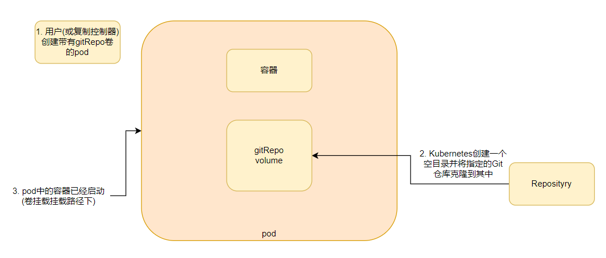
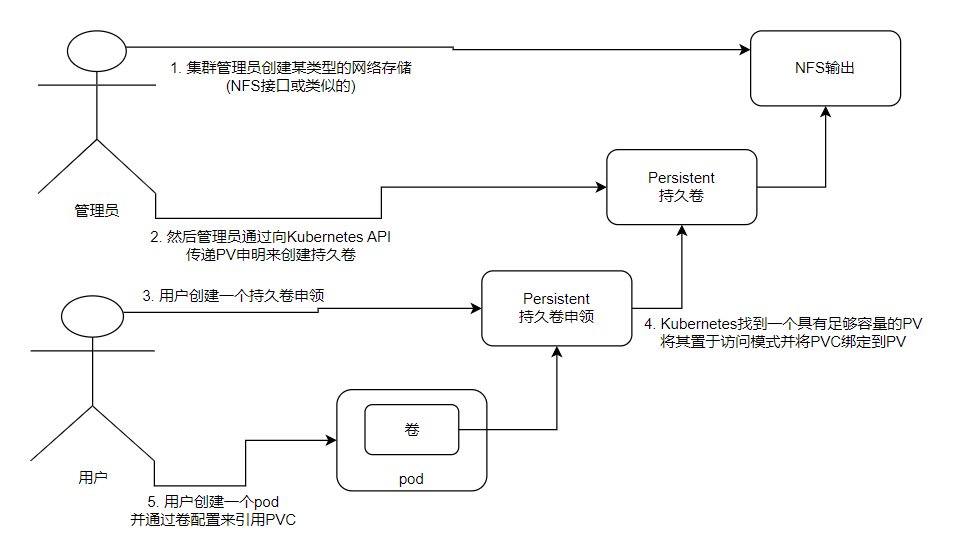

>本章内容包括：
>- 创建多容器pod
>- 创建一个可在容器间共享磁盘存储的卷
>- 在pod中使用git仓库
>- 将持久性存储挂载到pod
>- 使用预先配置的持久性存储
>- 动态调配持久存储

在前面说过，pod类似逻辑主机，在逻辑主机中运行的进程共享如CPU、RAM、网络接口等资源，但磁盘是不共享的，pod中的每个容器都有自己独立的文件系统，因为文件系统来自容器镜像。

每个容器都是通过在构建镜像时加入的详细配置文件来启动的。将次与pod中容器重新启动的现象结合起来，很容易就意识到新容器并不会识别前一个容器写入文件系统内的任何内容，即使新启动的容器运行在同一个pod中。

Kubernetes通过定义存储卷来满足想要在重启容器中继续使用存储数据的目录这种需求，它们不像pod这样的顶级资源，而是被定位为pod的一部分，并和pod共享相同的生命周期，这意味着在pod启动时创建卷，在删除pod时销毁卷。因此，在容器重新启动期间，卷的内容将保持不变，在重新启动容器之后，新容器可以识别前一个容器写入卷的所有文件。此外，卷还能被同一个pod中的多个容器共同使用。

# 介绍卷

Kubernetes的卷是pod的一个组成部分，因此卷在pod的规范中定义。它们不是独立的Kubernetes资源，也不能单独创建或删除。pod中所有容器都可以使用卷，但必须先将它挂载在每个需要访问它的容器中。在每个容器中都可以在文件系统的任意位置挂载卷。

## 使用卷

假设现在有三个容器的pod，一个容器运行了一个web服务，第二个容器运行了一个代理来创建 HTML文件，第三个容器处理web日志。因为容器之间的磁盘是不共享的，所以第一个容器读取不到第二个容器创建的HTML文件，第三个容器也处理不了第一个容器产生的web日志。

我们可以把两个卷挂载到三个容器中合适的位置，这样三个容器的文件共享，各自的功能也能顺序的发挥作用，由于这两个卷最初都是空的，所以可以使用一张叫`emptyDIr`的卷，Kubernetes还支持其他类型的卷，这些卷要么是从外部源初始化卷时填充的，要么是在卷内挂载现有目录。这个填充或装入卷的过程是在pod内的容器启动之前执行的。
## 卷的类型

当卷被绑定到pod的lifecycle中，只有在pod存在时才会存在，但取决于卷的类型，即使在pod和卷消失之后，卷的文件也能保持原样，并可以挂在到新的卷中。有多种卷类型可供选择。其中一些是通用的，而另一些则相对于当前常用的存储技术有较大差别。
- emptyDir：用于存储临时数据的简单空目录
- hostPath：用于将目录从工作节点的文件系统挂载到pod中
- gitRepo：通过检测出Git仓库的内容来初始化的卷，已在1.11版本中被启用
- nfs：挂载到pod中的NFS共享卷
- gcePersistentDisk、awsElasticBlockStore、AzureDisk：用于挂载云服务商提供的特定存储类型
- cinder、cephfs、iscsi、flocker、glusterfs、quobyte、rbd、flexVolume、vsphere-Volume、photonPersistenDisk、scaleIO：用于挂载其他类型的网络存储
- config、secret、downwardAPI：用于将Kubernetes部分资源和集群信息公开给pod的特殊类型的卷
- persistentVolumeClaim：一种使用预置或者动态配置的持久存储类型
单个卷可以使用不用类型的卷，每个pod都可以装载或不装载卷。
# 通过卷在容器之间共享数据
## emptyDir卷

最简单的卷类型是emptyDir卷，顾名思义，该卷从一个空目录开始，运行在pod内的应用程序可以写入它需要的任何文件。因为卷的生命周期与pod的生命周期相关联，所以当删除pod时，卷的内容就会丢失。

一个emptyDir卷对于在同一个pod中运行的容器之间共享文件特别有用，但也可以被单个容器用于将数据临时写到磁盘，例如在大型数据集上执行排序操作时，没有那么多内存可供使用。数据也可以写入容器的文件系统本身，但容器的文件甚至可能是不可写的，所以写到挂载的卷是一个合适的选择。
```yaml
apiVersion: v1
kind: Pod
metadata:
  name: fortune
spec:
  containers:
  - image: luksa/fortune
    name: html-generator
    volumeMounts:    # 名为html的卷挂载到容器/var/htdocs中
    - name: html
      mountPath: /var/htdocs
  - image: nginx:alpine
    name: web-server
    volumeMounts:
    - name: html
      mountPath: /usr/share/nginx/html
      readOnly: true
    ports:
    - containerPort: 80
      protocol: TCP
  volumes:    # 定义一个叫html的emptyDir类型的卷
  - name: html
    emptyDir: {}
```
此manifest在一个pod中定义了两个容器，当这两个容器分别向/var/htdocs和/usr/share/nginx/html目录写文件时，都是写入卷中，而不是写入容器的顶层。

**指定EmptyDir介质**

作为卷来使用的emptyDir，是在承载pod工作节点的实际磁盘上创建的，因此其性能取决于节点的磁盘类型。我们可以通过设置参数来设置使用内容作为承载介质。
```yaml
  volumes:   
  - name: html
    emptyDir: 
      medium: Memory # 使用内存，不设置默认使用磁盘
      sizeLimit: "1Gi" # 限制大小，可以用Ei、Pi、Ti、Gi、Mi、Ki等单位
```
emptyDir卷是最简单的卷类型，但是其他类型的卷都是在它的基础上构建的，在创建空目录后，它们会用数据填充它。`emptyDir` 卷的数据在 Pod 存在期间是持久的，但当 Pod 被删除时，数据也会被删除。如果 Pod 在同一节点上重启，数据仍然存在；如果 Pod 被重新调度到其他节点，数据将丢失。

## gitRepo卷

gitRepo卷本质上也是一个emptyDir卷，它通过克隆Git仓库并在pod启动时(在创建容器之前)检出特定版本来填充数据，如下图所示：

> 注意：在创建gitRepo之后，它并不能和对应的repo保持同步。当向git仓库推送新的提交时，卷中的文件不会被更新。但如果pod被删除后由控制器重新拉起来之后，卷中的数据将包含最新提交。

接下来我们创建一个gitRepo类型的卷并挂在到pod上
```yaml
apiVersion: v1
kind: Pod
metadata:
  name: gitrepo-volume-pod
spec:
  containers:
  - image: nginx:alpine
    name: web-server
    volumeMounts:
    - name: html
      mountPath: /usr/share/nginx/html
      readOnly: true
    ports:
    - containerPort: 80
      protocol: TCP
  volumes:
  - name: html
    gitRepo:
      repository: https://github.com/luksa/kubia-website-example.git
      revision: master  # 指出要克隆的Git 分支、标签或提交哈希，默认为master
      directory: .  # 克隆的容器目录路径，默认为.
```
## hostPath卷

大多数的pod都应该忽略它们的主机节点，因此它们不该访问节点文件系统上的任何文件。但是某些系统级别的pod(DaemonSet管理)需要读取节点的文件或使用节点文件系统来访问节点设备。

hostPath卷指向节点文件系统上的特定文件或目录。在同一个节点上运行并在其hostPath卷中使用相同路径的pod可以看到相同的文件。hostPath是一种持久性存储，因为前面介绍的emptyDir卷的内容都会在pod被删除时被删除。

如果考虑使用hostPath作为存储数据库数据的目录，请慎重考虑，因为hostPath卷存储的数据与节点高度绑定，这会使pod对预定规划的节点很敏感。
```yaml
---
# 此清单将主机上的 /data/foo 挂载为 hostpath-example-linux Pod 中运行的单个容器内的 /foo
#
# 容器中的挂载是只读的
apiVersion: v1
kind: Pod
metadata:
  name: hostpath-example-linux
spec:
  os: { name: linux }
  nodeSelector:
    kubernetes.io/os: linux
  containers:
  - name: example-container
    image: registry.k8s.io/test-webserver
    volumeMounts:
    - mountPath: /foo
      name: example-volume
      readOnly: true
  volumes:
  - name: example-volume
    # 挂载 /data/foo，但仅当该目录已经存在时
    hostPath:
      path: /data/foo # 主机上的目录位置
      type: Directory # 此字段可选
```

## 持久化存储

如果集群是运行在自有的一组服务器上，那么就有大量其他可移植的选项用于在卷内挂载外部存储。例如挂载一个NFS共享，只需指定NFS服务器和共享路径即可
```
apiVersion: v1
kind: Pod
metadata:
  name: mongodb-nfs
spec:
  volumes:
  - name: mongodb-data
    nfs:   # 指定服务器地址和共享路径
      server: 1.2.3.4
      path: /some/path
  containers:
  - image: mongo
    name: mongodb
    volumeMounts:
    - name: mongodb-data
      mountPath: /data/db
    ports:
    - containerPort: 27017
      protocol: TCP
```
在pod中通过卷来隐藏真实的底层基础设施，这正是Kubernetes存在的意义。但是将这种涉及基础设施类型的信息塞到一个pod设置中，意味着pod设置与特定的Kubernetes集群有很大的耦合度。这就不能在另一个pod中使用相同的配置了。所以使用这样的卷并不是在pod中附加持久化存储的最佳实践。

# 从底层存储技术解耦pod

到目前为止介绍的所有持久卷类型都要求pod的开发人员了解集群中可用的真实网络存储的基础结构。例如，要创建支持NFS协议的卷，开发人员必须知道NFS节点所在的实际服务器，这违背了Kubernetes的基本理念，这个理念指在向应用程序及其开发人员隐藏真实的基础设施，使他们不必担心基础设施的具体状态，并使应用程序可在大量云服务商和数据企业之间进行功能迁移。

当开发人员需要一定数量的持久化存储来进行应用时，可以向Kubernetes请求，就像在创建pod时可以请求CPU、内存和其他资源一样。系统管理员可以对集群进行配置让其可以为应用程序提供所需的服务。
## 持久卷和持久卷申领

Kubernetes集群中为了使应用能够正常请求存储资源，同时避免处理基础设施细节，引入了两个新的资源，分别是持久卷和持久卷申领。

在pod中使用PersistentVolume(持久卷，简称PV)要比使用常规的pod卷复杂一些。

研发人员无需向他们的pod中添加特定类型的卷，而是由集群管理员设置底层存储，然后通过Kubernetes API服务器创建持久卷并注册。在创建持久卷时，管理员可以指定其大小和所支持的访问模式。

当集群用户需要在其pod中使用持久化存储时，他们首先要创建持久卷申领(PersistentVolumeClaim，简称PVC)清单，指定所需要的最低容量要求和访问模式，然后用户将持久卷申领清单提交给Kubernetes API服务器，Kubernetes将找到可匹配的持久卷并将其绑定到持久卷申领。

持久卷申领可以当做pod中的一个卷来使用，其他用户不能使用相同的持久卷，除非先通过删除持久卷申领绑定来释放。

## 创建持久卷

```yaml
apiVersion: v1
kind: PersistentVolume
metadata:
  name: mongodb-pv
spec:
  capacity:  # 定义PV的大小
    storage: 1Gi
  accessModes:   # 访问模式
    - ReadWriteOnce # 单个客户端挂载为读写模式
    - ReadOnlyMany  # 多个客户端挂载为只读模式
  persistentVolumeReclaimPolicy: Retain  # 当申领被释放后，PV将保留
  hostPath:       # PV使用的后端存储类型
    path: /tmp/mongodb  

```
在这里我们创建了一个1G大小后端使用`hostPath`类型的PV。在创建持久卷时，管理员需要告诉Kubernetes其对应的容量需求，以及它是否可以由单个节点或多个节点同时读取或写入，还需要告诉Kubernetes如何处理PV(当持久卷申领绑定被删除时)。最后还要指定持久卷实际使用的存储类型、位置和其他属性。
```bash
# 这里可以看到已经绑定好了default/mongodb-pvc，且状态已经是Bound
# 这里笔者是pv、pvc都创建好后查看的
[root@master ~]# kubectl get pv
NAME         CAPACITY   ACCESS MODES   RECLAIM POLICY   STATUS   CLAIM                 STORAGECLASS   REASON   AGE
mongodb-pv   1Gi        RWO,ROX        Retain           Bound    default/mongodb-pvc                           9s
```
> **注意：持久卷不属于任何命名空间，它跟节点一样时集群层面的资源。**

## 创建持久卷申领

假设现在需要部署一个需要持久化存储的pod，将要用到之前创建的持久卷，但是不能直接在pod中使用，需要创建一个持久卷申领。
```yaml
apiVersion: v1
kind: PersistentVolumeClaim
metadata:
  name: mongodb-pvc # 绑定到pod时会使用
spec:
  resources:   
    requests:    # 申请1G的存储空间
      storage: 1Gi
  accessModes:
  - ReadWriteOnce  # 允许单个客户端读写
  storageClassName: "" 
```
当创建好申领后，Kubernetes就会找到适合的持久卷并将其绑定到申领，持久卷的容量必须足够大以满足申领的需求，并且卷的访问模式必须包含申领中指定的访问模式。
```bash
[root@master ~]# kubectl get pvc
NAME          STATUS   VOLUME       CAPACITY   ACCESS MODES   STORAGECLASS   AGE
mongodb-pvc   Bound    mongodb-pv   1Gi        RWO,ROX                       109s
```
RWO/ROX/RWX涉及可以同时使用卷的工作节点的数量而并非pod的数量。
## 使用持久卷申领

持久卷现在已经可以使用了，除非先释放掉卷，否则没有人可以申领相同的卷。要在pod中使用持久卷，需要在pod的卷中引用持久卷申领名称
```yaml
apiVersion: v1
kind: Pod
metadata:
  name: mongodb 
spec:
  containers:
  - image: mongo
    name: mongodb
    volumeMounts:
    - name: mongodb-data
      mountPath: /data/db
    ports:
    - containerPort: 27017
      protocol: TCP
  volumes:
  - name: mongodb-data
    persistentVolumeClaim:  
      claimName: mongodb-pvc   # 指定持久卷申领的名称
```
## 回收持久卷

当我们把pod和相关的PVC删除会怎么样呢？能重新创建PVC绑定到PV嘛？答案是不能。
```
[root@master ~]# kubectl get pv
NAME         CAPACITY   ACCESS MODES   RECLAIM POLICY   STATUS     CLAIM                 STORAGECLASS   REASON   AGE
mongodb-pv   1Gi        RWO,ROX        Retain           Released   default/mongodb-pvc                           9m27s
```
可以看到此时PV的状态已经变成了Released，不能够被新的PVC绑定。这是因为我们之前创建PV时指定了`persistentVolumeReclaimPolicy: Retain`，这个参数设置为`Retain`，PV将在PVC删除之后不清除数据，但也变成不可绑定的状态，此状态被称为**手动回收持久卷**，因为只有手动删除PV之后才能重新绑定PVC。

也可以将PV这个参数设置为`Recycle`或`Delete`。第一种删除卷的内容并使卷可用于再次申领，通过这种方式，PV可以被不同的持久卷申领和pod反复使用。`Delet`会删除底层存储。这两种被称为**自动回收持久卷**。
>**注意：可以在现有的持久卷上修改回收策略。**
