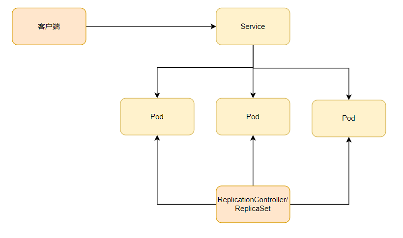

> 本章内容包括：
> - 使用新版本替换pod
> - 升级已有pod
> - 使用deployment资源升级pod
> - 执行滚动升级
> - 出错时自动停止滚动升级pod
> - 控制滚动升级比例
> - 回滚pod到上个版本

根据前面介绍的章节已经知道如何将应用程序打包进容器，将它们分组到pod中，并为它们提供临时存储或持久化存储，将密钥或配置文件注入并可以使pod之间相互通信。除此之外，还需要升级应用程序。这一章讲述如何升级在Kubernetes集群中运行的应用程序，以及Kubernetes如何帮助实现真正的零停机升级过程。升级操作可以通过ReplicationController或ReplicaSet实现，但Kubernetes提供了另一种基于ReplicaSet的资源deployment，并**支持声明式的更新应用程序**。
# 更新运行在pod内的应用程序

有一组pod实例为其他pod或外部客户端提供服务，，这些pod是由ReplicationCrontroller或ReplicaSet创建和管理的，客户端通过service访问pod，这就是Kubernetes中一个典型应用程序的运行方式。

假设pod一开始使用v1版本的镜像运行第一个版本的应用。然后开发了一个新版本的应用打包成镜像，并将其推送到镜像仓库，标记为v2，接下来想用这个新版本替换所有的pod。由于pod在创建之后，不允许直接修改镜像，只能通过删除原有pod并使用新的镜像创建新的pod替换。

有以下两个方法可以更新所有pod：
- 直接删除所有现有的pod，然后创建新的pod；
- 也可以创建新的pod，并等待它们成功运行之后，再删除旧的pod。也可以先创建所有新的pod，然后一次性删除所有旧的pod，或者按顺序创建新的pod，然后再逐渐删除旧的pod。
这两种方法各有优缺点。第一种方法将会导致应用程序在一定的时间内不可用。第二种方法，你的应用程序需要支持两个版本同时对外提供服务。如果应用程序使用数据库存储数据，那么新版本不应该对原有的数据格式或者数据本身进行修改，从而导致之前的版本运行异常。
## 删除旧版本pod，使用新版本pod替换

之前介绍ReplicationController的时候，我们已经知道如果修改RC中的容器模板的话，RC会使用新模板创建新的容器。

如果你有一个RC来管理一组v1版本的pod，可以直接修改pod模板中容器镜像为v2，然后删除旧的pod实例。RC会检测到当前没有pod匹配它的标签选择器，便会创建新的实例。如果你能接受从删除旧的pod到启动新的pod之间短暂的服务不可用，那这将是更新一组pod的最简单的方式。

## 创建新版本再删除老版本

如果短暂的服务不可用完全不能接受，并且你的应用程序支持多个版本同时对外提供服务，那么可以先创建新的pod再删除原有pod。这会需要更多的硬件资源。

**从旧版本切换到新版本**

pod通常使用service来暴露。在运行新版本之前，service只能将流量切给旧版本的pod。一旦新版本的pod被创建且正常运行之后，就可以修改服务的标签选择器将流量切换到新版本中，在切换之后，如果能确定新版本能文档运行了，就可以删除旧的RC了。
> 可以使用kubectl set selector命令来修改service的pod选择器。

**执行滚动升级操作**

还可以执行滚动升级操作来逐步代替原有的pod，而不是同时创建所有新的pod并一并删除所有旧的pod。可以使用以下命令执行滚动更新。
```bash
kubectl rolling-update kubia-v1 kubia-v2 --image=luksa/kubia:v2
```
使用kubia v2版本应用来替换运行着kubia-v1的RC，将新的副本控制器命名为kubia-v，并使用luksa/kubia:v2镜像。运行这个命令后，新的控制器会被立即创建，当初始期望的副本数被设置为0.
> 注意应用程序更新后镜像使用的tag，不建议在更新应用程序后使用相同的tag来推送镜像，如果使用的tag名为lastest还是可行的，如果使用的是像v1这样的tag可能会导致新的控制器不会拉取新的镜像。
> 因为在容器的定义中使用lastest标记的镜像，会导致imagePullPolicy策略默认是Always；如果使用的是其他形式的标记，默认会是IfNotPresent。
> 如果有使用相同标志推送镜像的习惯，建议明文指定imagePullPolicy策略。

**了解滚动升级前kubectl所执行的操作**

kubectl通过复制kubia-v1的RC并在pod模板中改变镜像版本，还有修改标签选择器，加了一个deployment的标签选择器。为了让RC管理，pod必须具备这个标签。

新旧两个RC都包含一个相同的标签选择器，这是否会意味着，新的pod也会被第一个RC管理呢？其实在滚动升级的过程中，第一个RC的标签选择器也会被添加一个deployment的标签选择器。对应RC控制的pod也会被对应的修改标签。

**通过伸缩两个RC将旧pod换成新pod**

设置完上面这些之后，kubectl开始替换pod。
- 首先将心的Controller扩展为1，新的RC因此创建一个新的pod；
- 然后kubectl将旧的RC缩小1
- 重复执行以上过程，直达v1 pod被伸缩到0，此时kubectl删除原始RC完成升级过程。
## rolling-update方式已经过时

为什么rolling-update方式已经不推荐使用了？
- 这个过程会修改创建的对象，直接修改pod和RC的标签不符合之前创建的预期；
- 最重要的是kubectl只是执行滚动升级过程中所有这些步骤的客户端；
- 滚动升级由客户端完成，而不是Kubernetes master。
> kubectl rolling-update kubia-v1 kubia-v2 --image=lusa/kubia:v1 --v 6
> 这个--v 6 提高日志级别使得能展示更多的通信细节信息。

但是为什么由客户端执行升级过程，而不是服务端执行是不好的呢？在上述的例子当中，升级过程看起来很顺利，但如果在滚动升级的中间kubectl断开了网络连接，那么pod和RC最终会处于中间状态。而且Kubernetes中pod的部署方式和伸缩方式都是通过不断收敛来达到期望的系统状态的，直接使用期待副本数来伸缩pod而不是通过手动的删除或增加一个pod，是更加符合Kubernetes的工作方式的。正是这一点推动了deployment资源的引入。
# Deployment声明式的升级应用

Deployment是一种更高阶资源，用于部署应用程序并以声明的方式升级应用，而不是通过RC或RS进行部署，这两都被认为是更底层的概念。

当创建一个Deployment时，RS资源也会随之创建。在使用Deployment时，实际pod是由RS来创建和管理的，而不是直接由Deployment创建和管理。

为什么要在RC和RS之上在引入另一个对象呢？在上面所举的例子当中，滚动升级时，需要引入另一个RC，并协调两个RC，使它们根据彼此不断调整，而不会造成干扰。所以需要另一个资源来协调，Deployment资源就是用来负责处理这个问题的。(不是Deployment本身，而是在Kubernetes控制层上运行的控制器进程)

使用Deployment可以更容易的更新应用程序，因为可以直接定义单个Deployment资源所需达到的状态，并让Kubernetes处理中间状态。

## 创建一个Deployment

创建RS和Deployment并没有任何区别。Deployment也是由标签选择器、期望副本数和pod模板组成的。但Deployment有一个新的字段用来指定部署策略，定义在修改Deployment时应该如何执行更新。
```yaml
apiVersion: apps/v1
kind: Deployment
metadata:
  name: nginx-deployment
  labels:
    app: nginx
spec:
  replicas: 3
  selector:
    matchLabels:
      app: nginx
  template:
    metadata:
      labels:
        app: nginx
    spec:
      containers:
      - name: nginx
        image: nginx:1.14.2
        ports:
        - containerPort: 80
```
在创建deployment之前，请确保删除由上面例子创建的RC，可以在删除资源时加上`--all`这将删除所有资源
```bash
# 使用--record选项，这个选项会记录历史版本
[root@master ~]# kubectl apply -f deploy-v1.yaml --record
deployment.apps/nginx-deployment created
```
在创建完成后，可以使用get或describe命令来查看deployment的详细信息，但还有另外一个命令，专门用来查看部署状态
```bash
[root@master ~]# kubectl rollout status deploy nginx-deployment
Waiting for deployment "nginx-deployment" rollout to finish: 0 of 3 updated replicas are available...
```

**了解deployment如何创建RS以及pod**

如果在deployment创建好pod之后查看pod状态，你会发现，pod的名字中有一串数字，这是什么呢？这个数字实际上是deployment中pod模板的哈希值。在deployment创建的RS名称中也有。deployment会创建多个ReplicaSet，用来对应和管理一个版本的pod模板。

## 升级deployment

使用RC部署应用时，必须通过运行`kubectl rolling-update`显式告诉Kubernetes来执行更新，甚至必须指定名称来替换旧资源，整个滚动升级过程必须打开终端让kubectl完成升级。

deployment来升级应用程序的话，只需要修改deployment资源中定义的pod模板，Kubernetes会自动将实际的系统状态收敛为资源中定义的状态。

**deployment升级策略**

实际上，如何达到新的系统状态的过程是由deployment的升级策略决定的，默认策略是执行滚动更新(RollingUpdate)。另一种策略为Recreate，它会一次性删除所有旧版本的pod，然后创建新的pod，整个行为类似于修改RC的pod模板，然后创建新的pod。

Recreate会删除所有的旧版本，然后启动新版本pod，这种策略会导致短时间内服务不可用。
RollingUpdate会逐渐删除旧的pod，然后启动新的pod，使应用程序在整个升级过程中都处于可用状态，并确保其处理请求的能力没有因为升级而有所影响。这就是deployment默认使用的升级策略。升级过程收纳pod数量可以在期望副本数一定区间内浮动，并且其上限和下限是可以配置的。

在学习过程中，如果想减慢滚动升级的速度，可以使用`minReadySeconds`属性来实现，这个属性用来定义Pod在被认为是就绪之前需要等待的最短时间（秒），默认是0。
```bash
[root@master ~]# kubectl patch deploy nginx-deployment -p '{"spec":{"minReadySeconds":10}}'
deployment.apps/nginx-deployment patched
```
> **注意：只有修改pod模板部分才会触发滚动更新。**

要触发滚动更新，可以修改容器镜像
```bash
kubectl set image deployment kubia nodejs=luksa/kubia:v2
```

**修改deployment或其他资源的方式**

目前已经介绍了好几种修改资源属性的方法了，在这里详细总结一下。

| 方法                | 作用                                                                                                                                             |
| ----------------- | ---------------------------------------------------------------------------------------------------------------------------------------------- |
| kubectl edit      | 使用默认编辑器打开资源配置。修改保存并退出编辑器，资源对象会被更新。<br>例子：kubectl edit deploy kubia                                                                             |
| kubectl patch     | 修改单个资源属性<br>例子：kubectl patch deployment kubia -p '{"spec":{"template":{"spec":{"containers":\[{"name":"nodejs","image":"luka/kubia:v2"}\]}}}}' |
| kubectl apply     | 通过一个完整的YAML/JSON文件，应用其中新的值来修改对象。如果YAML/JSON中指定的对象不存在，则会被创建。该文件需要包含资源的完整定义<br>例子：kubectl apply -f kubia-deployment.yaml                         |
| kubectl replace   | 将原有对象替换为YAML/JSON文件中定义的新对象。与apply命令相反，运行这个命令前要求对象必须存在，否则会打印错误。<br>例子：kubectl replace -f kubia.yaml                                             |
| kubectl set image | 修改镜像。<br>例子：kubectl set image deployment kubia nodejs=luksa/kubia:v2                                                                           |

**Deployment的优点**

通过更改Deployment资源中的pod模板，应用程序已经被升级为一个更新的版本，只需要修改一个字段就可以了。

这个更新过程是由运行在Kubernetes上的一个控制器处理和完成的，而不再是运行kubectl rolling-update命令，这个命令由kubectl客户端执行更新，让Kubernetes的控制器接管使得整个升级过程变得更加简单可靠。
> **注意：如果Deployment中的pod模板引用了一个ConfigMap，那么更改ConfigMap资源本身将不会触发更新操作。如果需要修改应用程序的配置并想触发更新的话，可以通过创建一个新的ConfigMap并修改pod模板引用新的。**

Deployment背后工作原理和rolling-update命令相似，创建一个新的ReplicaSet会被创建然后慢慢扩容，同时之前版本的ReplicaSet会慢啊慢缩容到0；但旧的ReplicaSet仍然会被保留，用作版本回滚。
## 回滚Deployment

如果你发现你升级的这个版本会有问题，需要快速回滚到上个版本的话，可以执行
```bash
kubectl rollout undo deploy kubia
```
Deployment会被回滚到上一个版本。
> undo命令也可以在滚动升级过程中运行，并直接停止滚动升级。在升级过程中已创建的pod会被删除并被老版本的pod替代。

**显示Deployment的滚动升级历史**

回滚之所以很快速，是因为Deployment始终保持着升级的版本记录。历史版本号会被保存在ReplicaSet中。滚动升级成功后，老版本的ReplicaSet也不会被删除，这也使得回滚操作可以回滚到任何一个历史版本，而不仅仅是上一个版本。
```bash
# 查看回滚历史
[root@master ~]# kubectl rollout history deploy nginx-deployment
deployment.apps/nginx-deployment 
REVISION  CHANGE-CAUSE
1         kubectl apply --filename=deploy-v1.yaml --record=true
```
还记得之前创建Deployment时的`--record`参数嘛，如果不加这个参数`CHANGE-CAUSE`这一栏的信息就会为空，这会使得用户很难辨别每次版本做了哪些修改。

**回滚到特定版本**

在前面介绍了`rollout undo`如果不加任何参数，会自动回滚到上一个版本，但也可以指定回滚到哪个版本
```bash
[root@master ~]# kubectl rollout undo deploy nginx-deployment --to-revision=1
```
这会回滚到你指定的版本号。Deployment在更新后不会删除老版本的ReplicaSet，这些ReplicaSet通过特定的版本号连接成了这个Deployment的版本链，所以不是非必须的情况，不要手动删除ReplicaSet。这样做会导致丢失Deployment历史版本记录而导致无法回滚。

但太多的ReplicaSet会导致ReplicaSet列表过于混乱，可以指定Deployment的`revisionHistoryLimit`属性来限制历史版本数量。默认值是10，只保留两个版本，更早之前的版本会被全部删除。
## 控制版本升级速率

当执行`kubectl rollout status`命令来观察升级到新版本的过程时，会看到一个pod新创建，当它运行时，一个旧的pod会被删除，循环往复。创建新的pod和删除旧pod的方式可以通过配置滚动更新策略里的两个属性设置。

**maxSurge和maxUnavailable**

在Deployment的滚动升级期间，有两个属性会决定一次替换多少个pod。
```yamml
spec:
  strategy: # 更新策略
    rollingUpdate:
      maxSurge: 1
      maxUnavailable: 0
    type: RollingUpdate # 滚动更新
```

| 属性             | 含义                                                                                                                                                           |
| -------------- | ------------------------------------------------------------------------------------------------------------------------------------------------------------ |
| maxSurge       | 决定了Deployment配置中期望的副本数之外，最多允许超过的pod实例数量。默认值25%，所以pod实例最多比期望值多25%。如果期望副本数是4，那么同时运行的pod最多只能是5。百分数转换时会向上取整，且可以指定绝对值。                                            |
| maxunavailable | 决定了在滚动升级期间，相对于期望副本数能够允许有多少个pod处于不可用状态。默认值是25%，所以可用的pod实例数量不能低于期望副本数的75%。百分数转换成绝对值时这个数字也会向下取整。如果期望副本数是4，并且百分比是25%，那么只有一个pod处于不可用状态。与maxSurge一样，可以指定绝对值而不是百分比。 |
**注意：这两个属性都只是针对期望副本数而言的。**
## 暂停滚动升级

如果在更新完成后再来检查更新的版本是否有问题，可能会导致大部分用户都察觉到应用出问题了，可以在更新时，把更新暂停，只更新部分pod来验证更新是否有问题。
```bash
kubectl rollout pause deploy kubia
```
一个新的pod更新后立马暂停更新来检查更新是否有问题，相当于运行了一个金丝雀版本。金丝雀发布是一种能将应用程序的出错版本和其影响到的用户的风险化为最小的基数。与其直接向每个用户发布新版本，不如用新版本替换一个或一小部分pod。通过这种方式升级初期只有少数用户会访问到新版本。验证新版本是否正常工作之后，可以将剩余的pod继续升级或者回滚到上一个版本。

**恢复滚动升级**

在检查新版本没有问题之后，就可以恢复滚动升级了。
```bash
kubectl rollout resume deploy kubia
```

暂停滚动升级还能用来组织滚动升级，这样能让运维多次修改Deployment，直达修改完成再手动进行滚动升级。
## 阻止出错版本的滚动升级

还记得在上面使用的`minReadySeconds`属性嘛，这个属性的作用主要是避免部署出错的版本，而不是单纯拖慢部署的速度。

**minReadySeconds用处**

minReadySeconds属性指定新创建的pod至少要成功运行多久之后，才能将其视为可用。在pod可用之前，滚动升级的过程不会继续。如果在minReadySeconds属性时间之内，就绪探针报错，则新版本的滚动升级将被组止。

使用这个属性可以让Kubernetes在pod就绪之后继续等待10s，然后继续滚动升级，来减慢滚动升级的过程。通常情况下可以把minReadySeconds的值设置的高一点，以确保pod在它们真正开始接受实际流量之后可以保持就绪状态。
```yaml
apiVersion: apps/v1beta1
kind: Deployment
metadata:
  name: kubia
spec:
  replicas: 3
  minReadySeconds: 10  # 就绪后继续等待10s
  strategy:
    rollingUpdate:
      maxSurge: 1
      maxUnavailable: 0
    type: RollingUpdate
  template:
    metadata:
      name: kubia
      labels:
        app: kubia
    spec:
      containers:
      - image: luksa/kubia:v3
        name: nodejs
        readinessProbe:    # 增加就绪探针
          periodSeconds: 1   # 每隔1s执行一次
          httpGet:
            path: /
            port: 8080
```
再次修改会报错的版本v3(可以自己设置会报错的版本进行实验)，不过这次增加了就绪探针和minReadySeconds属性。使用上面的yaml声明文件更新v3版本。

这个版本在第5秒的时候就会报错，所以pod被标记为不可用并从endpoint列表中移除，但因为我这里maxUnavailable属性设置的是0，所以不会再删除旧的pod了，又因为maxSurge设置的是1，所以也不会创建新的pod了，滚动更新被中断。

**为滚动升级配置deadline**

默认情况下，如果10分钟之内不能完成滚动升级的话，将被视为失败。如果运行`kubectl describe deploy`命令，将会显示一条`ProgressDeadlineExceeded`记录。

判定Deployment滚动升级失败的超时时间，可以通过设定Deployment spec中的progressDeadlineSeconds来指定，默认是600s。

取消出错版本的滚动升级就只能通过rollout undo命令进行回滚了。
```bash
kubectl rollout undo deploy kubia
```
> **注意：回滚和更新一样都遵循 Deployment 中指定的更新策略。**