# 第十七章：kubernetes应用扩展

> 本章内容包括：
>
> * 在kubernetes上添加自定义对象
> * 为自定义对象添加控制器
> * 添加自定义API服务器
> * 使用Kubernetes服务目录完成自助服务配置

## 1 定义自定义API对象

随着Kubernetes⽣态系统的持续发展，越来越多⾼层次的对象将会不断涌现。⽐起⽬前使⽤的对象，新对象将更加专业化。有了它们，开发者将不再需要逐⼀进⾏Deployment、Service、ConfigMap等步骤，⽽是创建并管理⼀些⽤于表述整个应⽤程序或者软件服务的对象。我们能使⽤⾃定义控件观察⾼阶对象，并在这些⾼阶对象的基础上创建底层对象。例如，你想在Kubernetes集群中运⾏⼀个messaging代理，只需要创建⼀个队列资源实例，⽽⾃定义队列控件将⾃动完成所需的 Secret、Deployment和Service。⽬前，Kubernetes已经提供了类似的⾃定义资源添加⽅式。

### 1.1 CustomResourceDefinitions介绍

开发者只需向Kubernetes API服务器提交CRD对象，即可定义新的资源类型。成功提交CRD之后，我们就能够通过API服务器提交JSON清单或YAML清单的⽅式创建⾃定义资源，以及其他Kubernetes资源实例。

> **注意 在Kubernetes 1.7之前的版本中，需要通过ThirdPartyResource对象的⽅式定义⾃定义资源。ThirdPartyResource与CRD⼗分相似，但在Kubernetes 1.8中被CRD取代。**

开发者可以通过创建CRD来创建新的对象类型。但是，如果创建的对象⽆法在集群中解决实际问题，那么它就是⼀个⽆效特性。通常，CRD与所有Kubernetes核⼼资源都有⼀个关联控制器（⼀个基于⾃定义对象有效实现⽬标的组件）​。因此，只有在部署了控制器之后，开发者才能真正知道CRD所具有的功能远不⽌添加⾃定义对象实例⽽已。接下来的内容将详细介绍这⼀点。

**CRD范例介绍**

如果你想让⾃⼰的Kubernetes集群⽤户不必处理pod、服务以及其他Kubernetes资源，甚⾄只需要确认⽹站域名以及⽹站中的⽂件（HTML、CSS、PNG，等等）就能以最简单的⽅式运⾏静态⽹站。这时候，你需要⼀个Git存储库当作这些⽂件的来源。当⽤户创建⽹站资源实例时，你希望Kubernetes创建⼀个新的web服务器pod，并通过服务将它公开。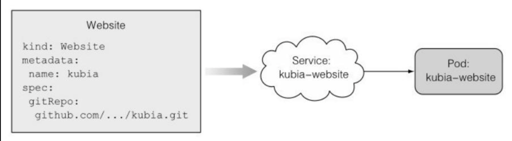

**创建一个CRD对象**

想要使Kubernetes接收你的⾃定义⽹站资源实例，需要按照以下代码清单所⽰的格式向API服务器提交CRD。

```yaml
apiVersion: apiextensions.k8s.io/v1beta1
kind: CustomResourceDefinition
metadata:
  name: websites.extensions.example.com
spec:
  scope: Namespaced
  group: extensions.example.com
  version: v1
  names:
    kind: Website
    singular: website
    plural: websites
```

将以上描述符发布到Kubernetes之后，你便能够创建任意数量的⾃定义⽹站资源实例。然后就可以跟普通资源一样创建资源了。

如果CRD的名称长到让你惊讶的话，为了避免冲突，不妨暂且称它为Website。为了区分它们，可以采取添加CRD名称后缀（通常情况下，后缀即创建该CRD的机构名称）的⽅式。幸好，⼀个长的资源名字并不意味着你⼀定要⽤kind:websites.extensions.example.com这种⽅式来创建Website资源。可以⽤CRD中指定的names.kind属性，即kind:Website。extensions.example.com的部分是资源的API 组。

如你所见，在创建Deployment对象时，你需要将apiVersion设置为apps/v1beta1⽽不是v1。其中，​“/”前的部分为API组（属于该API组的Deployment）,“/”后的部分为API组的版本名（如果是Deployment的话，则为v1beta1）​。在创建⾃定义⽹站资源的实例时，apiVersion属性需要设置为extensions.example.com/v1。

通常情况下，像这样创建⾃定义对象，并不仅仅是为了解决实际问题。因为某些⾃定义对象仅⽤于存储数据，⽽不是使⽤更通⽤的机制（例如ConfigMap）​。在pod内运⾏的应⽤程序可以查询这些对象的 API服务器并读取存储在其中的全部内容。

但是在本例中，希望启动⼀个web服务器为Website对象中的Git仓库中的内容提供服务，接下来我们将看看如何做到这⼀点。

### 1.2 使用自定义控制器自动定制资源

为了让你的⽹站对象运⾏⼀个通过服务暴露的web服务器pod，你就需要构建和部署⼀个⽹站控制器。它能查看API服务器创建⽹站对象的过程，然后为每⼀个对象创建服务和Web服务器pod。

控制器将创建Deployment资源，⽽不是直接创建⾮托管pod，这样就能确保pod既能被管理，还能在遇到节点故障时继续正常⼯作。\
这里不讨论代码的具体实现。

**了解网站控制器的功能**

启动后，控制器⽴即开始通过以下URL请求查看⽹站对象：http://localhost:8001/apis/extensions.example.com/v1/websites?watch=true。

通过识别主机名和端口，我们看到控制器不直接连接到API服务器，⽽是连接到kubectl proxy进程。该进程在同⼀个pod中的sidecar容器中运⾏，并充当API服务器的ambassador​。代理将请求转发给API服务器，并同时处理TLS加密和认证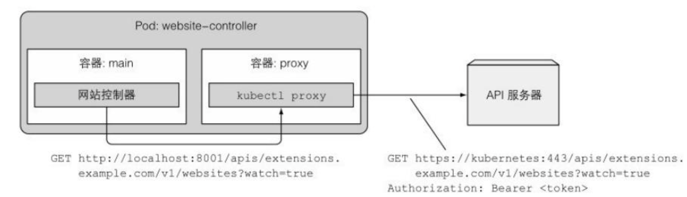

通过此HTTP GET请求打开的连接，API服务器将针对任何⽹站对象的每个更改发送监听事件（watchevent）​。

每次创建新的⽹站对象时，API服务器都会发送ADDED监听事件。当控制器收到这样的事件时，就会在该监听事件所包含的⽹站对象中提取⽹站名称和Git存储库的URL，然后将它们的JSON清单发布到 API服务器，来创建Deployment和Service对象。

> 注意 由于这个控制器查看API对象的⽅式⽆法确保它不会错过任何⼀个监听事件，因此并没有被正确实施。当我们通过API服务器查看对象时，还要定期重新列出所有对象，以防监听事件被错过。

### 1.3 验证自定义对象

可能你已经发现，你还没有在⽹站CRD中指定任何类型的验证模式。这会导致你的⽤户可以在⽹站对象的YAML中包含他们想要的任何字段。由于API服务器并不会验证YAML的内容（apiVersion、kind和 metadata等常⽤字段除外）​，⽤户创建的Website对象就有可能是⽆效对象​。

既然如此，我们是否可以向控制器添加验证并防⽌⽆效的对象被 API服务器接收？事情并没有这么简单。因为API服务器⾸先需要存储对象，然后向客户端（kubectl）返回成功响应，最后才会通知所有监听器（包括你的控制器）​。在监听事件中，所有控制器都可以在收到对象时验证这个对象。如果对象⽆效，则将报错信息写⼊Website对象（通过对API服务器的新请求更新对象）​。但是，你的⽤户并不会收到⾃动错误通知，⽽是只能通过查询⽹站对象的API服务器来获取错误消息，否则他们⽆法知道对象是否有效。

显然，你希望的是API服务器在验证对象时⽴即拒绝⽆效对象。在Kubernetes 1.8版本中，⾃定义对象的验证作为alpha特性被引⼊。如果想 要 让 API服 务 器 验 证 ⾃ 定 义 对 象 ， 需 要 在 API 服 务器 中 启 ⽤CustomResourceValidation特性，并在CRD中指定⼀个JSON schema。

### 1.4 为自定义对象提供自定义API服务器

如果你想更好地⽀持在Kubernetes中添加⾃定义对象，最好的⽅式是使⽤你⾃⼰的API服务器，并让它直接与客户端进⾏交互。

**API服务器聚合**

在Kubernetes 1.7版本中，通过API服务器聚合，可以将⾃定义API服务器与主Kubernetes API服务器进⾏集成。从诞⽣以来，Kubernetes API服务器 ⼀直是单⼀的单⽚组件。直到Kubernetes 1.7版本，我们才可以在同⼀个location暴露多个聚合的API服务器。从此，客户端可以被连接到聚合API，并直接将请求转发给相应的API服务器。这样⼀来，客户端甚⾄⽆法察觉幕后有多个API服务器正在处理不同的对象。因此，即使是Kubernetes API核⼼服务器最终也可能会被拆分成多个较⼩的 API服务器。通过聚合后，这些被拆分的API服务器会作为单独服务器被暴露。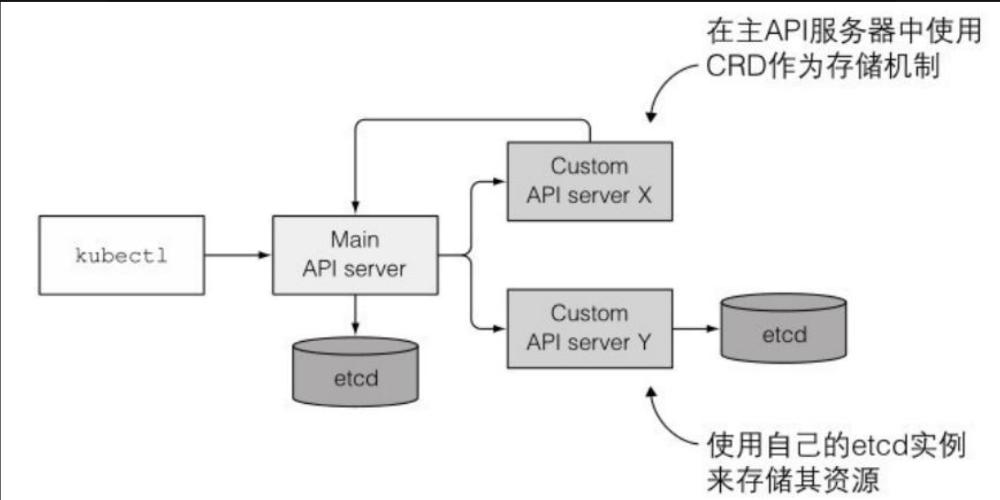

对你来说，可以创建⼀个专门负责处理你的⽹站对象的API服务器，并使它参照Kubernetes API核⼼服务器验证对象的⽅式来验证你的⽹站。这样你就不必再创建CRD来表⽰这些对象，就可以直接将⽹站对象类型实现到你的⾃定义API服务器中。

通常来说，每个API服务器会负责存储它们⾃⼰的资源。如上图所⽰，它可以运⾏⾃⼰的etcd实例（或整个etcd集群）​，也可以通过创建CRD实例将其资源存储在核⼼API服务器的etcd存储中。在这种情况下，就需要先创建⼀个CRD对象，然后才能创建CRD实例，正如在⽰例中所做的那样。

如果你想要将⾃定义API服务器添加到集群中，可以将其部署为⼀个pod并通过Service暴露。下⼀步，为了将它集成到主API服务器中，需要部署⼀个描述APIService资源的YAML列表，如下⾯的代码清单所⽰。

```yaml
apiVersion: apiregistration.k8s.io/v1beta1
kind: APIService
metadata:
  name: v1alphal.extensions.example.com
sepc:
  group: extensions.example.com   # 此API服务器负责的API组
  version: vlalphal       # 支持的API版本
  priority: 150
  service:               # 定制API暴露的服务
    name: wesite-api
    namespace: default   
```

在创建以上代码列表中的APIService 资源后，被发送到主API服务器的包含extensions.example.comAPI组任何资源的客户端请求，会和v1alpha1版本号⼀起被转发到通过website-api Service公开的⾃定义API服务器pod。

**创建自定义客户端**

虽然你可以使⽤常规的kubectl客户端从YAML⽂件创建⾃定义资源，但为了更简便地部署⾃定义对象，除了提供⾃定义API服务器，还可以构建⾃定义CLI⼯具。构建⾃定义CLI⼯具之后，你就可以添加⽤于操作这些对象的专⽤命令，类似于kubectl允许通过resource-specific命令（如kubectlcreate secret或kubectl create deployment）创建Secret、Deployment和其他资源。

## 2 使用kubernetes服务目录扩展kubernetes

⽬前，对于使⽤服务的pod（这⾥的服务与Service资源⽆关。例如，数据库服务包含了⽤户能够在其应⽤中使⽤数据库所需的所有内容）​，有⼈需要部署提供服务的pod、⼀个Service资源，可能还需要⼀个可以让客户端pod⽤来同服务器进⾏⾝份认证的密钥。通常是与部署客户端pod相同的⼀个⽤户，或者如果⼀个团队专门部署这些类型的通⽤服务。那么⽤户需要提交⼀个票据，并等待团队提供服务。这意味着⽤户需要为服务的所有组件创建⽂件，知道如何正确配置，并⼿动部署，或者等待其他团队来完成。

但是，Kubernetes显然应该是⼀个易于使⽤的⾃助服务系统。理想情况下，如果⽤户的应⽤需要特定的服务（例如，需要后端数据库的 web应⽤程序）​，那么他只需要对Kubernetes说：​“嘿，我需要⼀个 PostgreSQL数据库。请告诉我在哪⾥，以及如何连接到它。​” 想要快速实现这⼀功能，你就需要使⽤Kubernetes服务⽬录。

### 2.1 服务目录介绍

顾名思义，服务⽬录就是列出所有服务的⽬录。⽤户可以浏览⽬录并⾃⾏设置⽬录中列出的服务实例，却⽆须处理服务运⾏所需的 Pod、Service、ConfigMap和其他资源。这听起来与⾃定义⽹站资源很相似。

服务⽬录并不会为每种服务类型的API服务器添加⾃定义资源，⽽是将以下四种通⽤API资源引⼊其中：

* ⼀个ClusterServiceBroker，描述⼀个可以提供服务的（外部）系统
* ⼀个ClusterServiceClass，描述⼀个可供应的服务类型
* ⼀个ServiceInstance，已配置服务的⼀个实例
* ⼀个ServiceBinding，表⽰⼀组客户端（pod）和ServiceInstance之间的绑定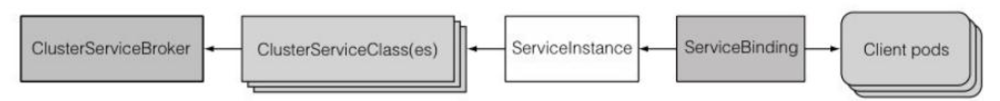\
  简 ⽽ ⾔ 之 ， 集 群 管 理 员 为 会 每 个 服 务 代理 创 建 ⼀ 个ClusterServiceBroker资源，⽽这些服务代理需要在集群中提供它们的服务。接着，Kubernetes从服务代理获取它可以提供的服务列表，并为它们中的每个服务创建⼀个ClusterServiceClass资源。当⽤户调配服务时 ，⾸ 先 需 要 创 建 ⼀ 个 ServiceInstance 资 源 ，然 后 创 建 ⼀ 个ServiceBinding以将该ServiceInstance绑定到它们的pod。下⼀步，这些pod会被注⼊⼀个Secret，该Secret包含连接到配置的ServiceInstance所需的凭证和其他数据。

### 2.2 服务目录API服务器与控制器管理器介绍

与核⼼Kubernetes类似的是，服务⽬录也是由三个组件组成的分布式系统：

* 服务目录API服务器
* 作为存储的etcd
* 运行所有控制器的控制器管理器

之前所介绍的四个与服务⽬录相关的资源是通过将YAML /JSON清单发布到API服务器来创建的。随后，API服务器会将它们存储到⾃⼰的etcd实例中，或者使⽤主API服务器中的CRD作为替代存储机制（在这种情况下不需要额外的etcd实例）​。

使⽤这些资源的控制器正在控制器管理器中运⾏。显然，它们与服务⽬录API服务器交互的⽅式，与其他核⼼Kubernetes控制器与核⼼ API服务器交互的⽅式相同。这些控制器本⾝不提供所请求的服务，⽽是将其留给外部服务代理，再由代理通过在服务⽬录API中创建ServiceBroker资源进⾏注册。

### 2.3 service代理和openServiceBroker API

集群管理员可以在服务⽬录中注册⼀个或多个外部ServiceBroker。同时，每个代理都必须实施OpenServiceBrokerAPI。

**OpenServiceBroker API介绍**

通过OpenServiceBroker API，服务⽬录可以通过API与broker进⾏通信。这个简单的REST API，能够提供以下功能：

* 使⽤GET/v2/catalog检索服务列表
* 配置服务实例（PUT/v2/service\_instances/:id）
* 更新服务实例（PATCH/v2/service\_instances/:id）
* 绑 定 服 务 实 例（PUT/v2/service\_instances/:id/service\_bindings/:binding\_id）
* 解 除 绑 定 实 例（DELETE/v2/service\_instances/:id/service\_bindings/:binding\_id）
* 取消服务实例配置（DELETE/v2/service\_instances/:id）

**在服务目录中注册代理**

集群管理员可以通过向服务⽬录API发布ServiceBroker资源清单来注册代理

```yaml
apiVersion: servicecatalog.k8s.io/v1alpha1
kind: Broker
metadata:
  name: database-broker
spec:
  url: http://database-osbapi.myorganization.org
```

代码清单描述了⼀个可以提供不同类型数据库的虚构代理。在管 理 员 创 建ClusterServiceBroker 资 源 后 ， ServiceCatalog Controller Manager中的控制器就会连接到资源中指定的URL，并且检索此代理可以提供的服务列表。

在检索服务列表后，就会为每个服务创建⼀个ClusterServiceClass资 源 。 每 个ClusterServiceClass 资 源 都 描 述 了 ⼀ 种 可 供 应 的 服 务（​“PostgreSQL数据库”就是ClusterServiceClass的⼀个典型例⼦）​。每个ClusterServiceClass都有⼀个或多个与之关联的服务⽅案。⽤户可以根据他们需要的服务级别选择不同的⽅案（例如，仅提供有限数据库和机械硬盘的“免费”⽅案，或是提供⽆线数据库和SSD存储的“⾼端”⽅案）​。

**罗列集群中的可用服务**

通过使⽤kubectl get serviceclasses,Kubernetes集群⽤户可以按照以下代码清单中的⽅法检索集群中所有可供应服务列表。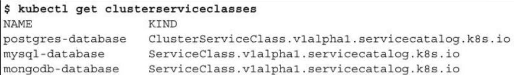这 个 代 码 清 单 显 ⽰ 了 虚 拟 数 据 库 代 理 可以 提 供 的 服 务ClusterServiceClasses。通过将ClusterServiceClass与StorageClass进⾏⽐较，就会发现两者之间的区别，StorageClass允许你选择想要容器中使⽤的存储类型，⽽ClusterServiceClasses允许选择服务类型。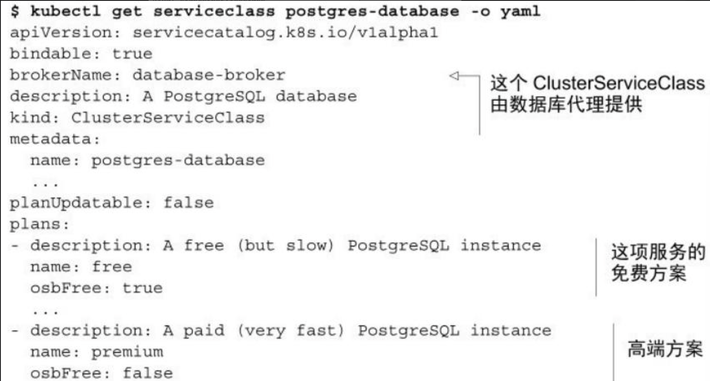

### 2.4 提供服务与使用服务

假设你正在部署的pod需要使⽤数据库。在此之前，你已经查看了全 部 可 ⽤ 的ClusterServiceClass 列 表 ， 并 选 择 使 ⽤ postgres-databaseClusterServiceClass free⽅案。

**提供服务实例**

要想预分配数据库，需要做的是创建⼀个ServiceInstance资源，如下⾯的代码清单所⽰。

```yaml
apiVersion: servicecatalog.k8s.io/v1alpha1
kind: Instance
metadata:
  name: my-postgres-db    # 实例名
spec:
  serviceClassName: postgres-database   # 需要的serviceclassf'an
  planName: free
  parameters:
    init-db-args: --data-checksums    # 传递给代理的其他参数

```

创建了⼀个名为my-postgres-db（这会是你部署的资源的名字）的ServiceInstance，并且指定ClusterServiceClass、选定⽅案。还需要指定⼀个明确的broker和ClusterServiceClass需要的参数。假设你已经看过 broker的⽂档了解了可能需要的参数。

⼀旦你创建了这个资源，服务⽬录就要求ClusterServiceClass所属的代理来调配服务，它将传递你选择的ClusterServiceClass、计划名称以及指定的所有参数。

接下来，由于采取何种⽅法处理这些信息完全由代理决定，你可能会看到你的数据库代理会启动⼀个新的PostgreSQL数据库的实例，这个实例可能不在同⼀个Kubernetes集群中，甚⾄根本不在Kubernetes中，⽽是在⼀个虚拟机上运⾏数据库。对此，服务⽬录和⽤户请求服务都不会察觉。

可以通过检查你创建的my-postgres-dbServiceInstance的status来检查是否已经成功提供服务，如以下代码清单所⽰。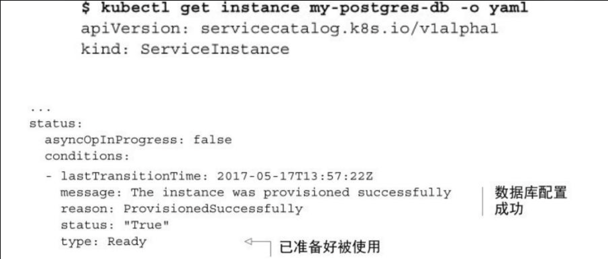\
可以看到数据库实例已经在运⾏了，但如果你想在 pod中使⽤这个实例，就需要将其绑定。

**绑定服务实例**

想要在pod中使⽤配置的ServiceInstance，可以按照以下代码列表创建 ServiceBindingresource。

```yaml
apiVersion: servicecatalog.k8s.io/v1alpha1
kind: Binding
metadata:
  name: my-postgres-db-binding
spec:
  instanceRef:
    name: my-postgres-db  # 引用之前创建的实例
  secretName: postgres-secret # 希望获得存储在此secrt中的服务凭证
```

代 码 显 ⽰ 你 正 在 定 义 ⼀ 个 名 为 my-postgres-db-binding 的ServiceBinding资源，其中引⽤了之前创建的my-postgres-db服务实例，同时你也命名了⼀个Secret。在这个名为postgres-secret的Secret中，你希望服务⽬录放⼊所有访问服务实例必需的凭证。但是要在哪⾥将ServiceInstance绑定到pod上呢？实际上，并不需要绑定。

在你将ServiceBinding资源从先前的列表提交到服务⽬录API服务器时，控制器会再次联系数据库代理，并为之前配置的ServiceInstance创建⼀个绑定。作为响应，这时候代理会返回以连接到数据库所需的凭证和其他数据。随后，服务⽬录会使⽤在ServiceBinding资源中指定的名称创建⼀个新的Secret，并将所有数据存储在Secret中。

**在pod中使用新创建的secret**

服务⽬录系统创建的Secret可以装载到pod中，这样Secret就可以读取其中的内容并使⽤它们连接到配置好的服务实例（⽰例中的⼀个 PostgreSQL数据库）​。这个Secret可能和以下代码清单中的⼗分相似。\
由于可以⾃⼰选择Secret的名称，因此可以在设置或绑定服务之前部署pod。如果没有这样⼀个Secret,pod就不会启动.

### 2.5 解除绑定与取消配置

⼀旦你不再需要服务绑定，可以按照删除其他资源的⽅式将其删除。这时候，服务⽬录控制器将删除密钥并通知代理解除绑定，⽽服务实例（PostgreSQL数据库）仍会运⾏。因此，你可以创建⼀个新的服务绑定。

但是，如果你不再需要数据库实例，就应该⼀并删除服务实例资源。

删除ServiceInstance资源后，服务⽬录就会在服务代理上执⾏取消配置的操作。同样，尽管取消配置带来的后果是由代理决定的，但你应该让代理关闭调配服务实例时创建的PostgreSQL数据库实例。

### 2.6 服务目录用来干嘛

如你所知，服务提供者可以通过在任何Kubernetes集群中注册代理，在该集群中暴露服务，这就是服务⽬录的最⼤作⽤。

总⽽⾔之，服务代理让你能够在Kubernetes中轻松配置和暴露服务。这⼀优点使得Kubernetes成为你部署应⽤程序的最佳平台之⼀。

## 3 在多个集群使用kubectl

如果你需要在多个Kubernetes集群之间切换，或者如果你想在默认命名空间之外的命名空间下⼯作，但是不想在每次运⾏kubectl时指定--namespace选项，请执⾏以下操作。

### 3.1 配置kubeconfig文件的路径

kubectl使⽤的配置通常存储在～/.kube/config ⽂件中。如果存储在其他位置，环境变量KUBECONFIG需要指向配置⽂件的位置。

**注意 可以通过在KUBECONFIG环境变量中指定多个配置⽂件（使⽤冒号分隔它们）来让kubectl⼀次性加载全部配置。**

### 3.2 了解kubeconfig文件中的内容

下⾯的代码清单中展⽰了⼀个配置⽂件的⽰例。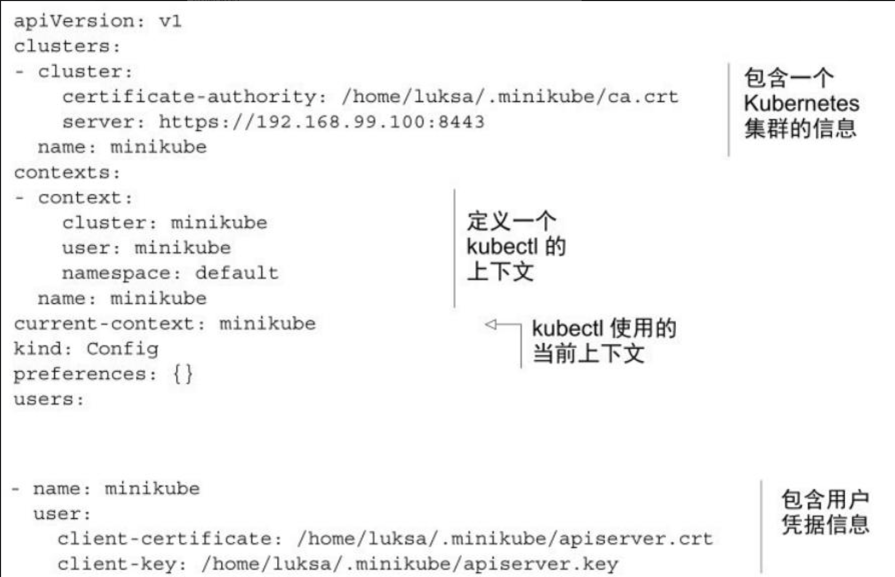kubeconfig⽂件由以下四部分组成：

* 集群列表
* 用户列表
* 上下文列表
* 当前上下文\
  每个集群、用户和上下文都有一个名称用于区分。

**集群**

集群条⽬代表Kubernetes集群，并包含API服务器的URL、证书颁发机构（CA）⽂件，以及可能与通过API服务器进⾏通信相关的⼀些其他配置选项。CA证书可以存储在单独的⽂件中并在kubeconfig⽂件中引⽤，也可以直接将其包含在certificate-authority-data字段中。

**用户**

每个⽤户定义了在与API服务器交谈时使⽤的凭据。这可以是⽤户名和密码、⾝份验证令牌或客户端密钥和证书。证书和密钥可以包含在kubeconfig ⽂ 件 中 （ 通 过 client-certificate-data 和 client-key-data 属性）​，或者存储在单独的⽂件中并在配置⽂件中引⽤。

**上下文**

上下⽂将kubectl执⾏命令时应使⽤的集群、⽤户以及默认命名空间关联在⼀起。多个上下⽂可以指向同⼀个⽤户或集群。

**当前上下文**

虽然可以在kubeconfig⽂件中定义多个上下⽂，但在同⼀时间，只有其中⼀个是当前上下⽂。稍后会介绍当前上下⽂是如何被改变的。

### 3.3 查询、添加和修改kube配置条目

既可以⼿动编辑该⽂件以添加、修改和删除集群、⽤户和上下⽂等信息，也可以通过kubectl config命令进⾏这些操作。

**添加或修改一个集群**

使⽤ kubectl config set-cluster 命令添加⼀个集群：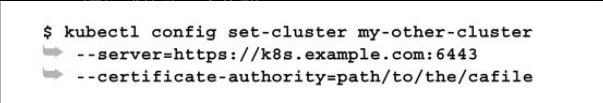\
这会添加⼀个API服务器地址位于https://k8s.expample.com:6443，名为my-other-cluster的集群。如果指定的集群名称已存在，则set-cluster命令将会覆盖该同名集群的配置选项。

**添加或修改用户凭据**

添加和修改⽤户与添加或修改集群类似。使⽤以下命令为API服务器添加⼀个使⽤⽤户名和密码认证的⽤户：

若要使⽤基于token的认证⽅式，可使⽤如下命令：\
上述两个⽰例都以名称foo存储⽤户凭据。如果你使⽤相同凭据来针对不同集群进⾏⾝份验证，则可以只定义⼀个⽤户并将其⽤于两个集群。

**将集群和用户凭据联系到一起**

上下⽂中定义了哪个⽤户使⽤哪个集群，同时也可以定义kubectl应该使⽤的命名空间，这样就不需要使⽤--namespace或-n选项⼿动指定命名空间。

以下命令⽤于创建新的上下⽂，并将集群与你创建的⽤户联系在⼀起：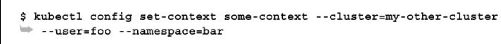\
这会创建⼀个名为some-context的上下⽂，该上下⽂使⽤my-othercluster集群和foo⽤户凭据。此上下⽂中的默认命名空间设置为 bar。

也可以使⽤同样的命令来更改当前上下⽂的命名空间。例如，可以像这样获取当前上下⽂的名称：\
然后使⽤如下命令修改命名空间：\
与每次运⾏kubectl时必须包含--namespace选项相⽐，这种⽅式更⽅便便捷。

> **提⽰ 若要⽅便地在命名空间之间切换，请先定义⼀个别名：alias kcd=ʹkubectl config set-context $（ kubectl config currentcontext ） --namespaceʹ。然后就可以使⽤ kcd some-namespace 命令在命名空间之间切换。**

### 3.4 在不同集群、用户和上下文中使用kubectl

运⾏kubectl命令时，会使⽤kubeconfig当前上下⽂中定义的集群、⽤户和命名空间，同时也可以使⽤以下命令⾏选项覆盖它们：

* \--user 指定⼀个kubeconfig⽂件中不同的⽤户。
* \--username 和--password 分别指定不同的⽤户名和密码（该⽤户名和密码不需要在配置⽂件中预先定义）​。如果使⽤其他类型的认证，可以使⽤--client-key 、--client-certificate 或--token。
* \--cluster 指定⼀个不同的集群（该集群必须在配置⽂件中预先定义）​。
* \--server 指定⼀个不同服务器的URL（配置⽂件中不存在的）​。
* \--namespace 指定⼀个不同的命名空间。

### 3.5 切换上下文

可以使⽤set-context命令创建附加上下⽂，然后在上下⽂之间切换，⽽不是像前⾯的⽰例中那样修改当前上下⽂。当处理多个集群时（使⽤set-cluster为它们创建集群条⽬）​，这⾮常⽅便。⼀旦你设置了多个上下⽂，在它们之间切换就很简单了：\
这样就将当前上下⽂切换到了my-other-context。

### 3.6 列出上下文和集群

要列出你的kubeconfig⽂件中定义的所有上下⽂，请运⾏以下命令：\
正如你所看到的，这⾥使⽤了三种不同的上下⽂。rpi-cluster和rpi-foo上下⽂使⽤相同的集群和凭据，但默认使⽤不同的命名空间。

也可以只列出上下文名称，不列出具体凭据信息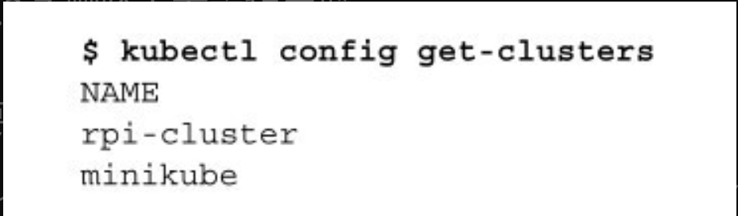

### 3.7 删除上下文和集群

要清理上下⽂或集群的列表，可以⼿动删除kubeconfig⽂件中的条⽬，也可以使⽤以下两个命令：\
或：
