> 本章内容包括：
> - 为容器申请CPU、内存以及其他计算资源
> - 配置CPU、内存的硬限制
> - 理解pod的QoS机制
> - 为命名空间中每个pod配置默认、最大、最小资源限制
> - 为命名空间配置可用资源总数

到目前为止，我们在创建pod的时候还没有给它们指定可以使用的CPU和内存资源的最大值。不过在本章，我们会了解到，为⼀个pod配置资源的预期使⽤量和最⼤使⽤量是pod定义中的重要组成部分。通过设置这两组参数，可以确保pod公平地使⽤Kubernetes集群资源，同时也影响着整个集群pod的调度⽅式。
# 为pod中的容器申请资源

我们创建⼀个pod时，可以指定容器对CPU和内存的资源请求量（即requests）​，以及资源限制量（即limits）​。它们并不在pod⾥定义，⽽是针对每个容器单独指定。pod对资源的请求量和限制量是它所包含的所有容器的请求量和限制量之和。
## 创建包含资源requests的pod

让我们看⼀个⽰例pod的定义，它只有⼀个容器，我们为其指定了 CPU和内存的资源请求量，如下代码清单所⽰。
```yaml
apiVersion: v1
kind: Pod
metadata:
  name: requests-pod
spec:
  containers:
  - image: busybox
    command: ["dd", "if=/dev/zero", "of=/dev/null"]
    name: main
    resources:    
      requests:   # 指定资源请求量
        cpu: 200m   # cpu申请200毫核(即一个CPU核心的1/5)
        memory: 10Mi # 申请10Mi内存
```
当我们不指定CPU requests时，表⽰我们并不关⼼系统为容器内的进程分配了多少CPU时间。在最坏情况下进程可能根本分不到CPU时间（当其他进程对CPU需求量很⼤时会发⽣）​。这对⼀些时间不敏感、低优先级的batch jobs没有问题，但对于处理⽤户请求的容器这样配置显然不太合适。
> **如果只指定资源请求量的话，是不会限制资源的使用的。只是指定了容器所需要的最低资源。**
## 资源requests如何影响调度

通过设置资源requests我们指定了pod对资源需求的最⼩值。调度器在将pod调度到节点的过程中会⽤到该信息。每个节点可分配给pod的 CPU和内存数量都是⼀定的。调度器在调度时只考虑那些未分配资源量满⾜pod需求量的节点。如果节点的未分配资源量⼩于pod需求量，这时节点没有能⼒提供pod对资源需求的最⼩量，因此Kubernetes不会将该pod调度到这个节点。

调度器如何判断⼀个pod是否适合调度到某个节点这⾥⽐较重要⽽且会令⼈觉得意外的是，调度器在调度时并不关注各类资源在当前时刻的实际使⽤量，⽽只关⼼节点上部署的所有pod的资源申请量之和。尽管现有pods的资源实际使⽤量可能⼩于它的申请量，但如果使⽤基于实际资源消耗量的调度算法将打破系统为这些已部署成功的pods提供⾜够资源的保证。
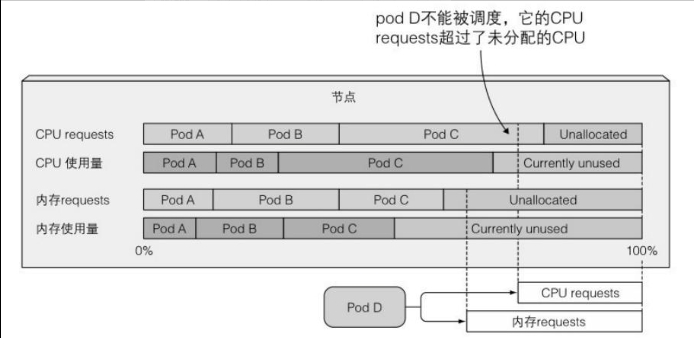在前面我们说过调度器会首先对节点列表进行过滤，排除哪些不满足需求的节点，然后根据预先配置的优先级函数对其余节点进行排序，其中就有两个基于资源请求量的优先级排序函数：
- LeastRequestedPriority：优先将pod调度到请求量少的节点
- MostRequestedPriority：优先将pod调度到请求量多的节点
调度器只能配置⼀种优先级函数。你可能在想为什么有⼈会使⽤MostRequestedPriority 函数。毕竟如果你有⼀组节点，通常会使其负载平均分布，但是在随时可以增加或删除节点的云基础设施上运⾏时并⾮如此。配置调度器使⽤MostRequestedPriority 函数，可以在为每个pod提供⾜量CPU/内存资源的同时，确保Kubernetes使⽤尽可能少的节点。通过使pod紧凑地编排，⼀些节点可以保持空闲并可随时从集群中移除。由于通常会按照单个节点付费，这样便可以节省⼀笔开销。

**查看节点资源的总量**

因为调度器需要知道每个节点拥有多少CPU和 内存资源，Kubelet会向API服务器报告相关数据，并通过节点资源对外提供访问，可以使⽤ kubectl describe 命令进⾏查看，如以下代码清单所⽰。
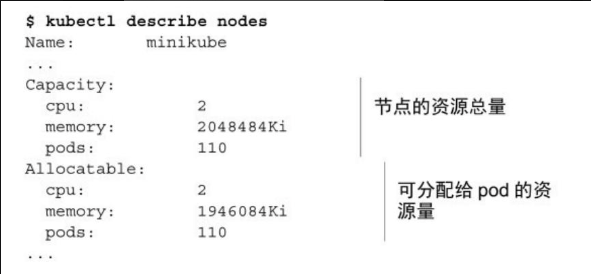
命令的输出展⽰了节点可⽤资源相关的两组数量：节点资源总量和可分配资源量。资源总量代表节点所有的资源总和，包括那些可能对pod不可⽤的资源。有些资源会为Kubernetes或者系统组件预留。调度器的决策仅仅基于可分配资源量。

上面这个输出了可以分配的资源，但实际上已经使用的资源也可以通过`describe nodes`命令查看。
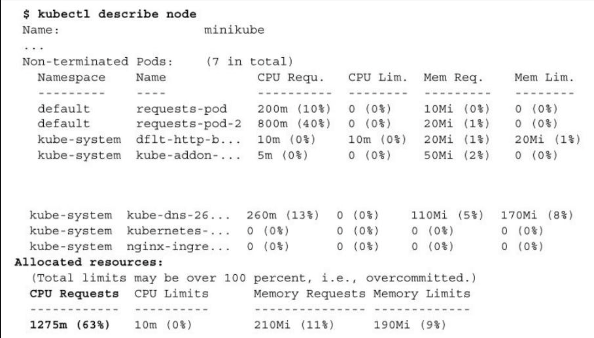
上面这个输出左下角显示了该节点已经申请了1275m的cpu资源，如果这时候我们在这个节点创建一个申请1核CPU资源的pod，这个pod将一直处于pending状态。
## CPU requests如何影响CPU时间分配

现在有两个pod运⾏在集群中（我们暂且不理会那些系统pod，因为它们⼤部分时间都是空闲的）​。⼀个请求了 200 毫核，另⼀个是前者的 5 倍。在本章开始，我们说到Kubernetes会将requests资源和limits资源区别对待。我们还没有定义任何limits，因此每个pod分别可以消耗多少CPU并没有做任何限制。那么假设每个pod内的进程都尽情消耗 CPU时间，每个pod最终能分到多少CPU时间呢？

CPU requests不仅仅在调度时起作⽤，它还决定着剩余（未使⽤）的CPU时间如何在pod之间分配。因为第⼀个 pod请求了200 毫核，另⼀个请求了 1000 毫核，所以未使⽤的CPU将按照 1:5 的⽐例来划分给这两个pod。如果两个pod都全⼒使⽤CPU，第⼀个pod将获得 16.7%的CPU时间，另⼀个将获得 83.3%的CPU时间。
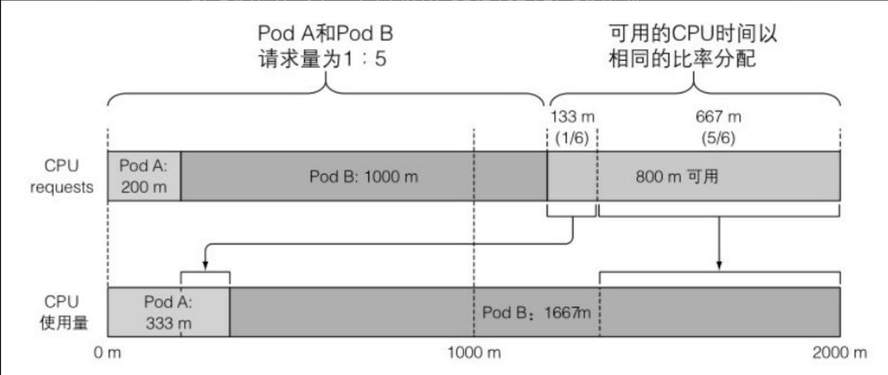另⼀⽅⾯，如果⼀个容器能够跑满CPU，⽽另⼀个容器在该时段处于空闲状态，那么前者将可以使⽤整个CPU时间（当然会减掉第⼆个容器消耗的少量时间）​。毕竟当没有其他⼈使⽤时提⾼整个CPU的利⽤率也是有意义的，对吧？当然，第⼆个容器需要CPU时间的时候就会获取到，同时第⼀个容器会被限制回来。
## 定义和申请自定义资源

Kubernetes允许⽤户为节点添加属于⾃⼰的⾃定义资源，同时⽀持在pod资源requests⾥申请这种资源。

⾸先，需要通过将⾃定义资源加⼊节点API对象的capacity属性让Kubernetes知道它的存在。这可以通过执⾏HTTP的PATCH请求来完成 。 资 源 名 称可 以 是 不 以 kubernetes.io 域 名 开 头 的 任 意值 ， 例 如example.org/myresource，数量必须是整数（例如不能设为100m，因为 0.1不是整数；但是可以设置为1000m、2000m，或者简单地设为1和 2）​。这个值将⾃动从capacity字段复制到allocatable字段。

然后，创建pod时，只要简单地在容器spec的resources.requests 字段下，调度器就可以确保这个pod只能部署到满⾜⾃定义资源申请量的节点，同时每个已部署的pod会减少节点的这类可分配资源数量。详细可以参考[为 Pod 和容器管理资源](https://kubernetes.io/zh-cn/docs/concepts/configuration/manage-resources-containers/#extended-resources)
# 限制容器的可用资源

设置pod的容器资源申请量保证了每个容器能够获得它所需要资源的最⼩量。现在我们再看看硬币的另⼀⾯ —— 容器可以消耗资源的最⼤量。
## 设置容器可使用资源量的硬限制

我们之前看到当其他进程处于空闲状态时容器可以被允许使⽤所有CPU资源。但是你可能想防⽌⼀些容器使⽤超过指定数量的CPU，⽽且经常会希望限制容器的可消耗内存数量。

CPU是⼀种可压缩资源，意味着我们可以在不对容器内运⾏的进程产⽣不利影响的同时，对其使⽤量进⾏限制。⽽内存明显不同 ——是⼀种不可压缩资源。⼀旦系统为进程分配了⼀块内存，这块内存在进程主动释放之前将⽆法被回收。这就是我们为什么需要限制容器的最⼤内存分配量的根本原因。

如果不对内存进⾏限制，⼯作节点上的容器（或者pod）可能会吃掉所有可⽤内存，会对该节点上所有其他pod和任何新调度上来的 pod（记住新调度的pod是基于内存的申请量⽽不是实际使⽤量的）造成影响。单个故障pod或恶意pod⼏乎可以导致整个节点不可⽤。

**创建一个带资源limits的pod**

为了防⽌这种情况发⽣，Kubernetes允许⽤户为每个容器指定资源 limits（与设置资源requests⼏乎相同）。
```yaml
apiVersion: v1
kind: Pod
metadata:
  name: requests-pod
spec:
  containers:
  - image: busybox
    command: ["dd", "if=/dev/zero", "of=/dev/null"]
    name: main
    resources:
	  limits:             #  为容器指定资源limits
        cpu: 1
        memory: 20Mi

```

这个pod的容器包含了CPU和内存资源limits配置。容器内的进程不允许消耗超过 1 核CPU和 20MB内存。
> **注意：因为没有指定资源requests，它将被设置为与资源limits相同的值。**

**可超卖的limits**

与资源requests不同的是，资源limits不受节点可分配资源量的约束。所有limits的总和允许超过节点资源总量的 100%​。换句话说，资源limits可以超卖。如果节点资源使⽤量超过100%，⼀些容器将被杀掉，这是⼀个很重要的结果。
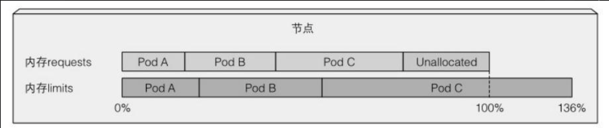
单个容器尝试使用比limits资源更多的资源时也有可能会被杀掉。
## 超过limits

当容器内运⾏的进程尝试使⽤⽐限额更多的资源时会发⽣什么呢？

我们已经了解了CPU是可压缩资源，当进程等待IO操作时消耗所有的CPU时间是⾮常常见的。因此当为⼀个容器设置CPU限额时，该进程只会分不到⽐限额更多的CPU⽽已。

⽽内存却有所不同。当进程尝试申请分配⽐限额更多的内存时会被杀掉（我们会说这个容器被OOMKilled了，OOM是Out Of Memory的缩写）​。如果pod的重启策略为Always 或OnFailure，进程将会⽴即重启，因此⽤户可能根本察觉不到它被杀掉。但是如果它继续超限并被杀死，Kubernetes会再次尝试重启，并开始增加下次重启的间隔时间。

这种情况下⽤户会看到pod处于CrashLoopBackOff状态：
CrashLoopBackOff 状态表⽰Kubelet还没有放弃，它意味着在每次崩溃之后，Kubelet就会增加下次重启之前的间隔时间。第⼀次崩溃之后，Kubelet⽴即重启容器，如果容器再次崩溃，Kubelet会等待 10 秒钟后再重启。随着不断崩溃，延迟时间也会按照 20、40、80、160 秒以⼏何倍数增长，最终收敛在 300 秒。⼀旦间隔时间达到300 秒，Kubelet将以 5 分钟为间隔时间对容器进⾏⽆限重启，直到容器正常运⾏或被删除。

要定位容器crash的原因，可以通过查看pod⽇志以及 kubectl describe pod 命令：
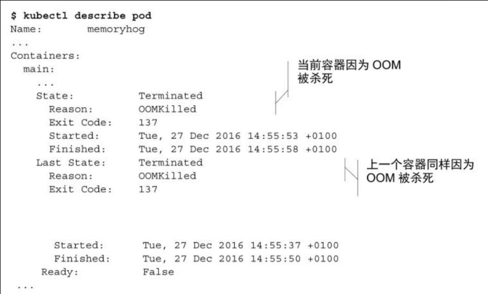因此，如果你不希望容器被杀掉，重要的⼀点就是不要将内存 limits设置得很低。⽽容器有时即使没有超限也依然会被OOMKilled。
## 容器中的应用如何看待limits

当我们运行一个pod，并限制容器中的CPU限额是1核，内存限额是20MiB。但在我们对其使用top命令时，你却会发现top命令展示出来的并不是我们限制的。
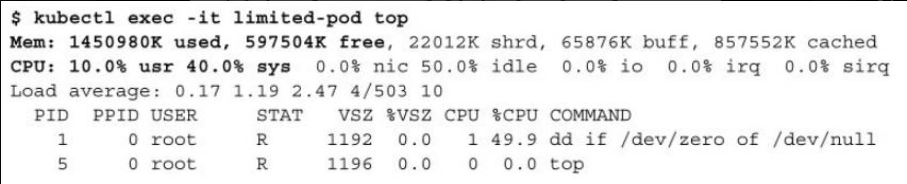
查看used和free内存量，这些数值远超出我们为容器设置的 20 MiB限额。同样地，我们设置了CPU限额为1 核，即使我们使⽤的 dd 命令通常会消耗所有可⽤的CPU资源，但主进程似乎只⽤到了50%。所以究竟发⽣了什么呢？

在容器内看到的始终是节点的内存，⽽不是容器本⾝的内存。

即使你为容器设置了最⼤可⽤内存的限额，top 命令显⽰的是运⾏该容器的节点的内存数量，⽽容器⽆法感知到此限制。

这对任何通过查看系统剩余可⽤内存数量，并⽤这些信息来决定⾃⼰该使⽤多少内存的应⽤来说具有⾮常不利的影响。

容器内同样可以看到节点所有的CPU核与内存完全⼀样，⽆论有没有配置CPU limits，容器内也会看到节点所有的CPU。将CPU限额配置为1，并不会神奇地只为容器暴露⼀个核。CPUlimits做的只是限制容器使⽤的CPU时间。

因此如果⼀个拥有 1 核CPU限额的容器运⾏在 64核CPU上，只能获得 1/64的全部CPU时间。⽽且即使限额设置为1 核，容器进程也不会只运⾏在⼀ 个核上，不同时刻，代码还是会在多个核上执⾏。

⼀些程序通过查询系统CPU核数来决定启动⼯作线程的数量。同样在开发环境的笔记本电脑上运⾏良好，但是部署在拥有更多数量 CPU的节点上，程序将快速启动⼤量线程，所有线程都会争夺（可能极其）有限的CPU时间。同时每个线程通常都需要额外的内存资源，导致应⽤的内存⽤量急剧增加。

不要依赖应⽤程序从系统获取的CPU数量，你可能需要使⽤ Downward API将CPU限额传递⾄容器并使⽤这个值。也可以通过cgroup系统直接获取配置的CPU限制，请查看下⾯的⽂件：
- /sys/fs/cgroup/cpu/cpu.cfs_quota_us
- /sys/fs/cgroup/cpu/cpu.cfs_period_us
# 了解pod QoS等级

前⾯已经提到资源limits可以超卖，换句话说，⼀个节点不⼀定能提供所有pod所指定的资源limits之和那么多的资源量。

假设有两个pod,pod A使⽤了节点内存的90%,pod B突然需要⽐之前更多的内存，这时节点⽆法提供⾜量内存，哪个容器将被杀掉呢？

应该是pod B吗？因为节点⽆法满⾜它的内存请求。或者应该是pod A吗？这样释放的内存就可以提供给pod B了。

显然，这要分情况讨论。Kubernetes⽆法⾃⼰做出正确决策，因此就需要⼀种⽅式，我们通过这种⽅式可以指定哪种pod在该场景中优先级更⾼。Kubernetes将pod划分为3种**服务质量（Quality of Service，QoS）** 等级：
- BestEffort（优先级最低）
- Burstable
- Guaranteed（优先级最⾼）
## 定义pod的QoS等级

QoS等级来源于pod所包含的容器的资源requests和limits的配置。下⾯介绍分配QoS等级的⽅法。

**为pod分配BestEffort等级**

最低优先级的QoS等级是BestEffort。会分配给那些没有（为任何容器）设置任何requests和limits的pod。前⾯章节创建的pod都是这个等级。在这个等级运⾏的容器没有任何资源保证。在最坏情况下，它们分不到任何CPU时间，同时在需要为其他pod释放内存时，这些容器会第⼀批被杀死。不过因为BestEffort pod没有配置内存limits，当有充⾜的可⽤内存时，这些容器可以使⽤任意多的内存。

**为pod分配Guaranteed等级**

与Burstable相对的是Guaranteed等级，会分配给那些所有资源 request和limits相等的pod。对于⼀个Guaranteed级别的pod，有以下⼏个条件：
- CPU和内存都要设置requests和limits
- 每个容器都需要设置资源量
- 它们必须相等（每个容器的每种资源的requests和limits必须相等）因为如果容器的资源requests没有显式设置，默认与limits相同，所以只设置所有资源（pod内每个容器的每种资源）的限制量就可以使 pod的QoS等级为Guaranteed。这些pod的容器可以使⽤它所申请的等额资源，但是⽆法消耗更多的资源（因为它们的limits和requests相等）​。

**为pod分配Burstable等级**

Burstable QoS等级介于BestEffort和Guaranteed之间。其他所有的 pod都属于这个等级。包括容器的requests和limits不相同的单容器pod，⾄少有⼀个容器只定义了requests但没有定义limits的pod，以及⼀个容器的requests和limits相等，但是另⼀个容器不指定requests或limits的 pod。Burstable pod可以获得它们所申请的等额资源，并可以使⽤额外的资源（不超过limits）​。

**requests和limits之间的关系如何定义QoS等级**

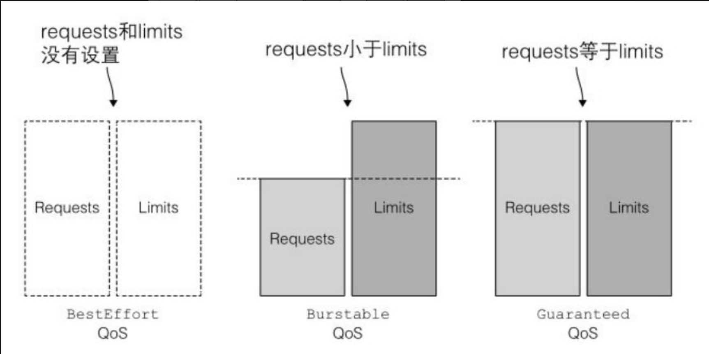考虑⼀个pod应该属于哪个QoS等级⾜以令⼈脑袋快速运转，因为它涉及多个容器、多种资源，以及requests和limits之间所有可能的关系。如果⼀开始从容器级别考虑QoS（尽管它并不是容器的属性，⽽是 pod的属性）​，然后从容器QoS推导出pod QoS，这样可能更容易理解。

**明白容器的QoS等级**

下图显示了基于资源requests和limits如何为单个容器定义QoS等级。对于单容器pod，容器的QoS等级也适⽤于pod。
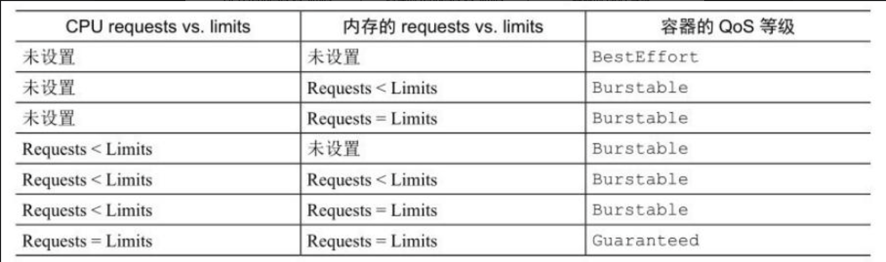

**多容器pod的QoS等级**

对于多容器pod，如果所有的容器的QoS等级相同，那么这个等级就是pod的QoS等级。如果⾄少有⼀个容器的QoS等级与其他不同，⽆论这个容器是什么等级，这个pod的QoS等级都是Burstable等级。表 14.2 展⽰了pod 的 QoS等级与其中两个容器的QoS等级之间的对应关系。多容器pod可以对此进⾏简单扩展。
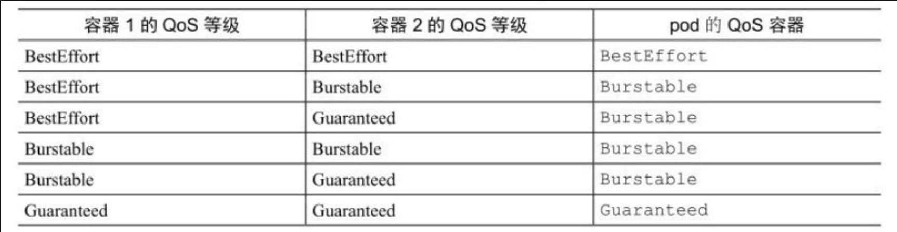> **注意 运⾏ kubectl describe pod 以及通过pod的YAML/JSON描述的status.qosClass 字段都可以查看pod的QoS等级。**
## 内存不足时哪个进程会被杀死

在⼀个超卖的系统，QoS等级决定着哪个容器第⼀个被杀掉，这样释放出的资源可以提供给⾼优先级的pod使⽤。BestEffort等级的pod⾸先被杀掉，其次是Burstable pod，最后是Guaranteedpod。Guaranteed pod只有在系统进程需要内存时才会被杀掉。

**了解QoS等级的优先顺序**

假设两个单容器的pod，第⼀个属于BestEffort QoS等级，第⼆个属于Burstable等级。当节点的全部内存已经⽤完，还有进程尝试申请更多的内存时，系统必须杀死其中⼀个进程（甚⾄包括尝试申请额外内存的进程）以兑现内存分配请求。这种情况下，BestEffort等级运⾏的进程会在Burstable等级的进程之前被系统杀掉。
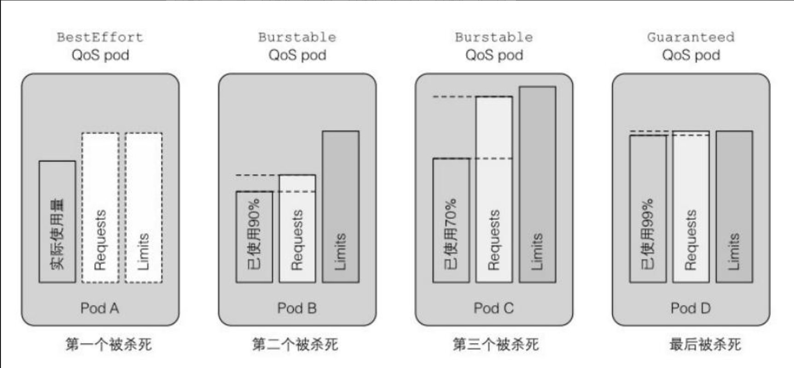显然，BestEffort pod的进程会在Guaranteedpod的进程之前被杀掉。同样地，Burstable pod的进程也先于Guaranteed pod的进程被杀掉。但如果只有两个Burstable pod会发⽣什么呢？很明显需要选择⼀个优先于另⼀个的进程。

**如何处理相同QoS等级的容器**

每个运⾏中的进程都有⼀个称为OutOfMemory （OOM）分数的值。系统通过⽐较所有运⾏进程的OOM分数来选择要杀掉的进程。当需要释放内存时，分数最⾼的进程将被杀死。

OOM分数由两个参数计算得出：进程已消耗内存占可⽤内存的百分⽐，与⼀个基于pod QoS等级和容器内存申请量固定的OOM分数调节因⼦。对于两个属于Burstable等级的单容器的pod，系统会杀掉内存实际使⽤量占内存申请量⽐例更⾼的pod。这就是为什么上面图中B会在C之前被杀掉，因为B占用了申请资源的90%。

这说明我们不仅要注意requets和limits之间的关系，还要留⼼ requests和预期实际消耗内存之间的关系。
# 为命名空间中的pod设置默认的requests和limits

我们已经了解到如何为单个容器设置资源requests和limits。如果我们不做限制，这个容器将处于其他所有设置了requests和limits的容器的控制之下。换句话说，为每个容器设置requests和limits是⼀个很好的实践。
## LimitRange资源介绍

⽤户可以通过创建⼀个LimitRange资源来避免必须配置每个容器。LimitRange资源不仅允许⽤户（为每个命名空间）指定能给容器配置的每种资源的最⼩和最⼤限额，还⽀持在没有显式指定资源requests时为容器设置默认值。
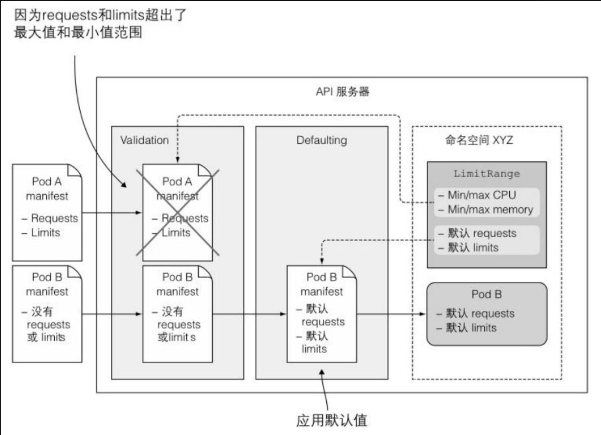
API服务器接收到带有pod描述信息的POST请求时，LimitRange插件对pod spec进⾏校验。如果校验失败，将直接拒绝。因此，LimitRange对象的⼀个⼴泛应⽤场景就是阻⽌⽤户创建⼤于单个节点资源量的pod。如果没有LimitRange,API服务器将欣然接收pod创建请求，但永远⽆法调度成功。

LimitRange资源中的limits应⽤于同⼀个命名空间中每个独⽴的 pod、容器，或者其他类型的对象。它并不会限制这个命名空间中所有 pod可⽤资源的总量，总量是通过ResourceQuota对象指定的。
## LimitRange对象的创建

```yaml
apiVersion: v1
kind: LimitRange
metadata:
  name: example
spec:
  limits:
  - type: Pod       # 指定整个pod的资源limits和requests
    min:            # pod中所有容器的CPU和内存的请求值之和的最小值
      cpu: 50m
      memory: 5Mi
    max:
      cpu: 1
      memory: 1Gi
  - type: Container     
    defaultRequest:      # 容器没有指定CPU或内存请求量时设置的默认值
      cpu: 100m
      memory: 10Mi
    default:             # 没指定limits时设置的默认值
      cpu: 200m        
      memory: 100Mi
    min:
      cpu: 50m
      memory: 5Mi
    max:
      cpu: 1
      memory: 1Gi
    maxLimitRequestRatio:    # 每种资源requests语limits的最大比值
      cpu: 4
      memory: 10
  - type: PersistentVolumeClaim   # 还能指定请求PVC存储容量的最小值和最大值
    min:
      storage: 1Gi
    max:
      storage: 10Gi
```
正如在上⾯例⼦中看到的，整个pod资源限制的最⼩值和最⼤值是可以配置的。它应⽤于pod内所有容器的requests和limits之和。在更低⼀层的容器级别，⽤户不仅可以设置最⼩值和最⼤值，还可以为没有显式指定的容器设置资源requests（defaultRequest）和 limits（default）的默认值。

这个例⼦只使⽤⼀个LimitRange对象，其中包含了对所有资源的限制，⽽如果你希望按照类型进⾏组织，也可以将其分割为多个对象（例如⼀个⽤于pod限制，⼀个⽤于容器限制，⼀个⽤于PVC限制）​。多个LimitRange对象的限制会在校验pod或PVC合法性时进⾏合并。

由于LimitRange对象中配置的校验（和默认值）信息在API 服务器接收到新的pod或PVC创建请求时执⾏，如果之后修改了限制，已经存在的pod和PVC将不会再次进⾏校验，新的限制只会应⽤于之后创建的 pod和PVC。

但需要记住的是，LimitRange中配置的limits只能应⽤于单独的pod或容器。⽤户仍然可以创建⼤量的pod吃掉集群所有可⽤资源。

LimitRange并不能防⽌这个问题，⽽相反，我们将在下⽂了解的ResourceQuota对象可以做到这点。
# 限制命名空间中的可用资源总量

正如我们看到的，LimitRange只应⽤于单独的pod，⽽我们同时也需要⼀种⼿段可以限制命名空间中的可⽤资源总量。这通过创建⼀个ResourceQuota对象来实现。
## ResourceQuota资源介绍

ResourceQuota的准入控制插件会检查将要创建的pod是否会引起总资源量超出ResourceQuota。如果那样，创建请求会被拒绝。因为资源配额在pod创建时进⾏检查，所以ResourceQuota对象仅仅作⽤于在其后创建的pod—— 并不影响已经存在的pod。

资源配额限制了⼀个命名空间中pod和PVC存储最多可以使⽤的资源总量。同时也可以限制⽤户允许在该命名空间中创建pod、PVC，以及其他API对象的数量，因为到⽬前为⽌我们处理最多的资源是CPU和内存，下⾯就来看看如何为这两种资源指定配额。
```yaml
apiVersion: v1
kind: ResourceQuota
metadata:
  name: cpu-and-mem
spec:
  hard:
    requests.cpu: 400m
    requests.memory: 200Mi
    limits.cpu: 600m
    limits.memory: 500Mi
```
这个ResourceQuota设置了命名空间中所有pod最多可申请的CPU数量为400 毫核，limits最⼤总量为600 毫核。对于内存，设置所有 requests最⼤总量为200MiB,limits为500MiB。

与LimitRange⼀样，ResourceQuota对象应⽤于它所创建的那个命名空间，但不同的是，后者可以限制所有pod资源requests和limits的总量，⽽不是每个单独的pod或者容器.
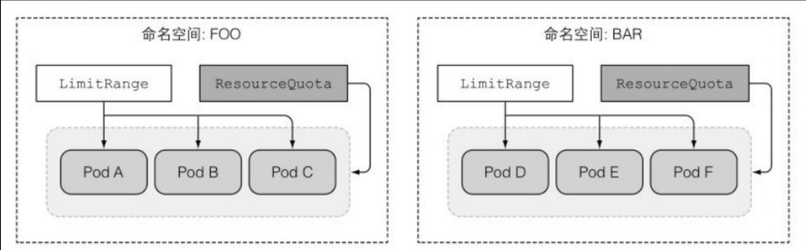

**查看配额和配额使用情况**

将ResourceQuota对象提交⾄API 服务器之后，可以执⾏kubectl describe命令查看当前配额已经使⽤了多少。
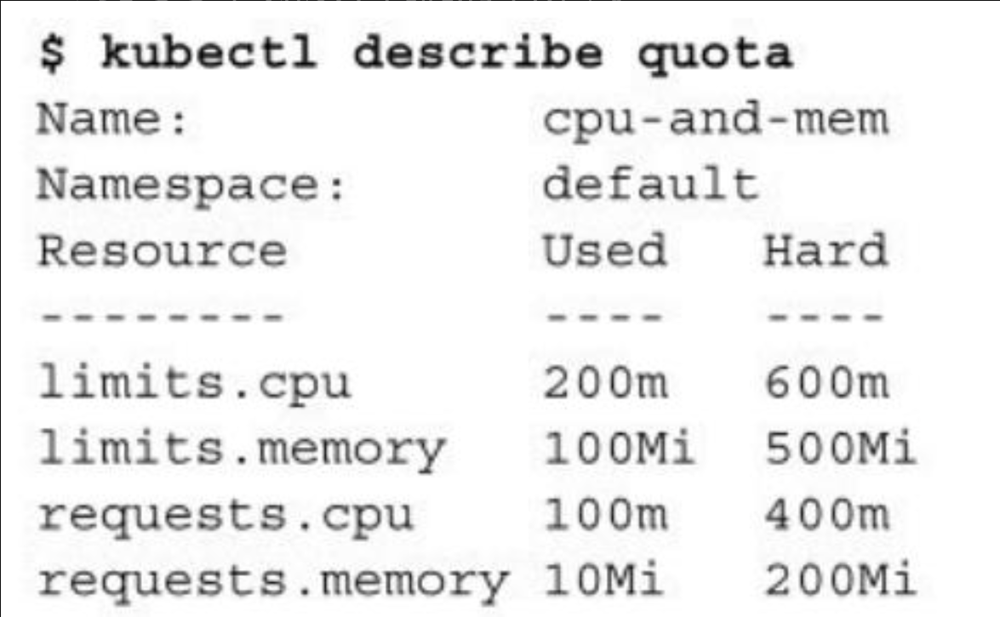

**在创建ResourceQuota同时创建LimitRange**

需要注意的⼀点是，创建ResourceQuota时往往还需要随之创建⼀个LimitRange对象。在上⼀节我们已经配置了LimitRange，但是假设我们没有配置，kubia-manual pod将⽆法成功创建，因为它没有指定任何资源requests和limits。我们看⼀下这种情况会发⽣什么：
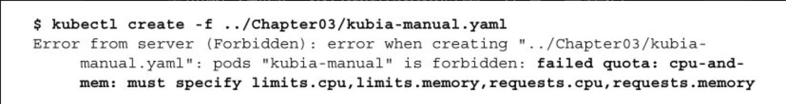
因此，当特定资源（CPU或内存）配置了ResourceQuota时，在pod中必须为这些资源（分别）指定requests或limits，否则API服务器不会接收该pod的创建请求。
## 为持久化存储指定配额

ResourceQuota对象同样可以限制某个命名空间中最多可以声明的持久化存储总量。
```yaml
apiVersion: v1
kind: ResourceQuota
metadata:
  name: storage
spec:
  hard:
    requests.storage: 500Gi      # 声明存储总量
    ssd.storageclass.storage.k8s.io/requests.storage: 300Gi  # storageclass ssd的可申请的存储量
    standard.storageclass.storage.k8s.io/requests.storage: 1Ti
```
在这个例⼦中，Namespace中所有可申请的PVC总量被限制为500GiB（通过配额对象中的requests.storage）​。PVC 可以 申 请 ⼀ 个 特 定 StorageClass 、 动 态 提 供的PV（PersistentVolume）​。这就是为什么Kubernetes同样允许单独为每个StorageClass提供定义存储配额的原因。上⾯的⽰例限制了可声明的SSD存储（以ssd命名的StorageClass）的总量为300GiB。低性能的HDD存储（StorageClassstandrad）限制为1TiB。
## 限制可创建对象的个数

资 源 配 额 同 样 可 以 限 制 单 个 命 名 空 间 中的 pod 、ReplicationController、Service以及其他对象的个数。集群管理员可以根据⽐如付费计划限制⽤户能够创建的对象个数，同时也可以⽤来限制公⽹IP或者Service可使⽤的节点端⼜个数。
```yaml
apiVersion: v1
kind: ResourceQuota
metadata:
  name: objects
spec:
  hard:
    pods: 10
    replicationcontrollers: 5
    secrets: 10
    configmaps: 10
    persistentvolumeclaims: 5
    services: 5
    services.loadbalancers: 1
    services.nodeports: 2
    ssd.storageclass.storage.k8s.io/persistentvolumeclaims: 2
```
上⾯的例⼦允许⽤户在⼀个命名空间中最多创建10个pod，⽆论是⼿动创建还是通过ReplicationController、ReplicaSet、DaemonSet或者 Job创建的。同时限制了ReplicationController最⼤个数为5,Service最⼤个数为5，其中LoadBalancer类型最多 1个，NotPort类型最多 2个。与通过指定每个StorageClass来限制存储资源的申请总量类似，PVC的个数同样可以按照StorageClass来限制。
## 为特定的pod状态或者QoS等级指定配额

⽬前为⽌我们创建的Quota应⽤于所有的pod，不管pod的当前状态和QoS等级如何。但是Quota可以被⼀组quota scopes限制。⽬前配额作⽤ 范 围共 有 4 种 ： BestEffort 、 NotBestEffort 、Termination 和NotTerminating。

BestEffort和NotBestEffort范围决定配额是否应⽤于BestEffort QoS等级或者其他两种等级（Burstable和Guaranteed）的pod。

其他两个范围（Terminating和NotTerminating）的名称或许有些误导作⽤，实际上并不应⽤于处在（或不处在）停⽌过程中的pod。你可以为每个pod指定被标记为Failed，然后真正停⽌之前还可以运⾏多长时间。这是通过在pod spec中配置activeDeadlineSeconds 来实现的。该属性定义了⼀个pod从开始尝试停⽌的时间到其被标记为Failed然后真正停⽌之前，允许其在节点上继续运⾏ 的 秒 数 。 Terminating 配 额 作 ⽤ 范 围 应⽤ 于 这 些 配 置 了activeDeadlineSeconds 的pod，⽽NotTerminating应⽤于那些没有指定该配置的pod。

创建ResourceQuota时，可以为其指定作⽤范围。⽬标pod必须与配额中配置的所有范围相匹配。另外，配额的范围也决定着配额可以限制的内容。BestEffort范围只允许限制pod个数，⽽其他 3 种范围除了 pod个数，还可以限制CPU/内存的requests和limits。

```yaml
apiVersion: v1
kind: ResourceQuota
metadata:
  name: besteffort-notterminating-pods
spec:
  scopes:
  - BestEffort
  - NotTerminating
  hard:
    pods: 4
```
这个配额允许最多创建 4个 属于BestEffort QoS等级，并没有设置 active deadline的pod。如果配额针对的是NotBestEffort pod，我们便可以指定requests.cpu,requests.memory,limits.cpu 和limits.memory。
# 监控pod的资源使用率

设置合适的资源requests和limits对充分利⽤Kubernetes集群资源来说⼗分重要。如果requests设置得太⾼，集群节点利⽤率就会⽐较低，这样就⽩⽩浪费了⾦钱。如果设置得太低，应⽤就会处于CPU饥饿状态，甚⾄很容易被OOMKiller杀死。所以如何才能找到requests和limits的最佳配置呢？

可以通过对容器在期望负载下的资源实际使⽤率进⾏监控来找到这个最佳配置。当然⼀旦应⽤暴露于公⽹，都应该保持监控并且在需要时对其资源的requests和limits进⾏调节。
## 收集、获取实际资源使用情况


