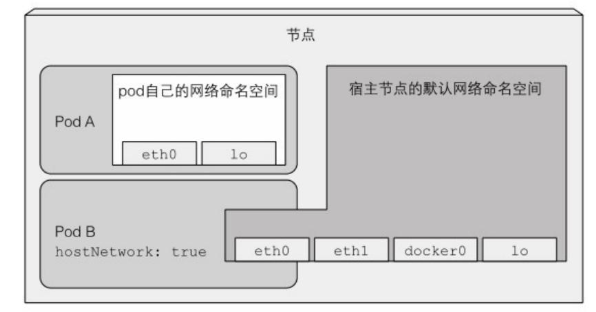
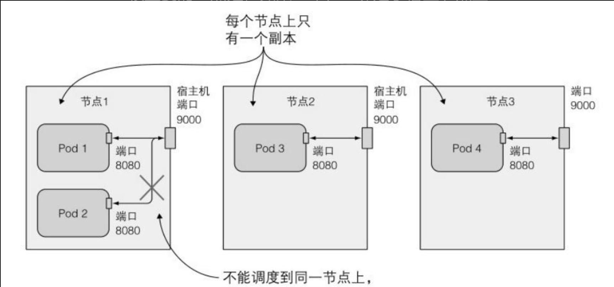
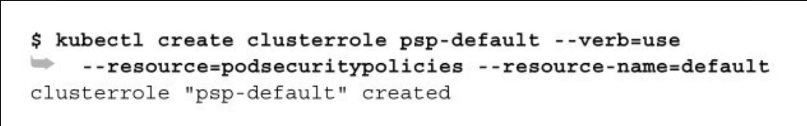
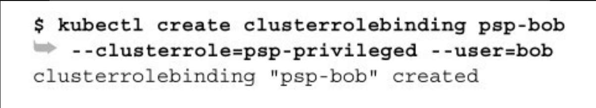
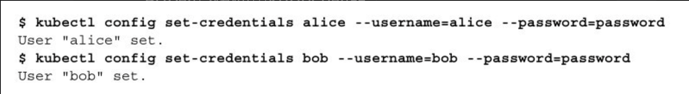

# 第十二章：保障集群内节点和⽹络安全

> 本章内容包括：
>
> * 在pod中使用宿主机节点的默认Linux命名空间
> * 以不同用户身份运行容器
> * 运行特权容器
> * 添加或禁用容器内核功能
> * 定义限制pod行为的安全策略
> * 保障pod的网络安全

谈到了如何保障API服务器的安全。如果攻击者获得了访问API服务器的权限，他们可以通过在容器镜像中打包⾃⼰的代码并在pod中运⾏来做任何事。但是这样做真的能够造成损害吗？容器不是与同⼀宿主节点上的其他容器隔离开来的吗？并不⼀定。本章将会介绍如何允许pod访问所在宿主节点的资源。

## 1 在pod中使用宿主节点的Linux命名空间

pod中的容器通常在分开的Linux命名空间中运⾏。这些命名空间将容器中的进程与其他容器中，或者宿主机默认命名空间中的进程隔离开来。

例如，每⼀个pod有⾃⼰的IP和端口空间，这是因为它拥有⾃⼰的⽹络命名空间。类似地，每⼀个pod拥有⾃⼰的进程树，因为它有⾃⼰的PID命名空间。同样地，pod拥有⾃⼰的IPC命名空间，仅允许同⼀ pod内的进程通过进程间通信（InterProcess Communicat​ion，简称IPC）机制进⾏交流。

### 1.1 在pod中使用宿主节点的网络命名空间

部分pod（特别是系统pod）需要在宿主节点的默认命名空间中运⾏，以允许它们看到和操作节点级别的资源和设备。例如，某个pod可能需要使⽤宿主节点上的⽹络适配器，⽽不是⾃⼰的虚拟⽹络设备。

可以通过将pod spec中的hostNetwork设置为true实现。

某种情况下，pod可以使⽤宿主节点的⽹络接口，⽽不是拥有⾃⼰独⽴的⽹络。这意味着这个pod没有⾃⼰的IP地址；如果这个pod中的某⼀进程绑定了某个端口，那么该进程将被绑定到宿主节点的端口上。

可以尝试运行这样一个pod

```yaml
apiVersion: v1
kind: Pod
metadata:
  name: pod-with-host-network
spec:
  hostNetwork: true   # 使用宿主节点的网络命名空间
  containers:
  - name: main
    image: alpine
    command: ["/bin/sleep", "999999"]

```

运行这样一个pod之后，可以进入到pod查看一下网卡是否和宿主机上的网卡一致。

Kubernetes控制平⾯组件通过pod部署时，这些pod都会使⽤hostNetwork选项，让它们的⾏为与不在pod中运⾏时相同。

### 1.2 绑定宿主节点上的端口而又不使用宿主节点的网络命名空间

一个与此有关的功能可以让pod在拥有⾃⼰的⽹络命名空间的同时 ， 将 端口绑 定 到 宿 主 节 点的端口上 。 这 可 以 通 过 配 置 pod 的spec.containers.ports字段中某个容器某⼀端⼜的hostPort属性来实现。

不要混淆使⽤hostPort的pod和通过NodePort服务暴露的pod。它们是不同的。

⼀个使⽤hostPort的pod，到达宿主节点的端口的连接会被直接转发到pod的对应端口上；然⽽在NodePort服务中，到达宿主节点的端口的连接将被转发到随机选取的pod上（这个 pod可能在其他节点上）​。另外⼀个区别是，对于使⽤hostPort的pod，仅有运⾏了这类pod的节点会绑定对应的端口；⽽NodePort类型的服务会在所有的节点上绑定端⼜，即使这个节点上没有运⾏对应的pod。

重要的⼀点是，如果⼀个pod绑定了宿主节点上的⼀个特定端口，每个宿主节点只能调度⼀个这样的pod实例，因为两个进程不能绑定宿主机上的同⼀个端口。调度器在调度pod时会考虑这⼀点，所以它不会把两个这样的pod调度到同⼀个节点。如果要在3个节点上部署4个这样的pod副本，只有3个副本能够成功部署（剩余1个pod保持Pending状态）​。

hostport可以这样使用

```yaml
apiVersion: v1
kind: Pod
metadata:
  name: kubia-hostport
spec:
  containers:
  - image: luksa/kubia
    name: kubia
    ports:
    - containerPort: 8080
      hostPort: 9000   # 将节点上的9000端口绑定到8080端口
      protocol: TCP

```

创建这个pod之后，可以通过它所在节点的9000端口访问这个 pod。有多个宿主节点时，并不能通过其他宿主节点的同⼀端⼜访问该 pod。

hostPort功能最初是⽤于暴露通过DeamonSet部署在每个节点上的系统服务的。最初，这个功能也⽤于保证⼀个pod的两个副本不被调度到同⼀节点上，但是现在有更好的⽅法来实现这⼀需求。

### 1.3 使用宿主节点的PID与IPC命名空间

pod spec中的hostPID和hostIPC选项与hostNetwork相似。当它们被设置为true时，pod中的容器会使⽤宿主节点的PID和IPC命名空间，分别允许它们看到宿主机上的全部进程，或通过IPC机制与它们通信。以下代码清单是⼀个使⽤hostPID和hostIPC的pod的例⼦。

```yaml
apiVersion: v1
kind: Pod
metadata:
  name: pod-with-host-pid-and-ipc
spec:
  hostPID: true
  hostIPC: true
  containers:
  - name: main
    image: alpine
    command: ["/bin/sleep", "999999"]

```

pod通常只能看到自己内部的进程，但在这个pod容器中列出进程，可以看到宿主机上的所有进程，而不仅仅是容器内的进程。

将hostIPC设置为true,pod中的进程就可以通过进程间通信机制与宿主机上的其他所有进程进⾏通信。

## 2 配置节点的安全上下文

除了让pod使⽤宿主节点的Linux命名空间，还可以在pod或其所属容器的描述中通过securi​ty-Context选项配置其他与安全性相关的特性。

这个选项可以运⽤于整个pod，或者每个pod中单独的容器。

**了解安全上下文中可以配置的内容**

配置安全上下文可以允许做很多事情：

* 指定容器中运行进程的用户。
* 阻止容器使用root用户运行(容器的默认运行用户通常在容器镜像中指定，所以可能需要阻止容器以root用户运行)。
* 使用特权模式运行容器，使其对宿主节点的内核具有完全的访问权限。
* 与上相反，通过添加或禁⽤内核功能，配置细粒度的内核访问权限。
* 设置SELinux（Securi​ty Enhaced Linux，安全增强型Linux）选项，加强对容器的限制。
* 阻⽌进程写⼊容器的根⽂件系统。

**运行pod而不配置安全上下文**

可以运行一个没有任何安全上下文配置的pod，然后进入该pod使用`id`命令查看用户，一般来说会打印`uid=0(root) gid=0(root) groups=0(root)`。

注意 容器运⾏时使⽤的⽤户在镜像中指定。在Dockerfile中，这是通过使⽤USER命令实现的。如果该命令被省略，容器将使⽤root⽤户运⾏。

### 2.1 使用指定用户运行容器

为了使⽤⼀个与镜像中不同的⽤户ID来运⾏pod，需要设置该pod的securi​tyContext.runAsUser选项。可以通过以下代码清单来运⾏⼀个使⽤guest⽤户运⾏的容器，该⽤户在alpine镜像中的⽤户ID为405。

```yaml
apiVersion: v1
kind: Pod
metadata:
  name: pod-as-user-guest
spec:
  containers:
  - name: main
    image: alpine
    command: ["/bin/sleep", "999999"]
    securityContext:
      runAsUser: 405  # 指明用户ID
```

创建好pod之后，再进入pod使用`id`命令就不再显示root用户了。容器的安全上下文中指定 `runAsUser` 的用户 ID (UID) 是指容器内进程将以该 UID 运行。这个 UID 是在容器内的用户 ID，而不是宿主机上的用户 ID。容器内的用户和组信息通常由容器镜像中的 `/etc/passwd` 和 `/etc/group` 文件定义。

### 2.2 阻止容器以root用户运行

如果你不关⼼容器是哪个⽤户运⾏的，只是希望阻⽌以root⽤户运⾏呢？

假设有⼀个已经部署好的pod，它使⽤⼀个在Dockerfile中使⽤ USER daemon命令制作的镜像，使其在daemon⽤户下运⾏。如果攻击者获取了访问镜像仓库的权限，并上传了⼀个标签完全相同，在root⽤户下运⾏的镜像，会发⽣什么？当Kubernetes的调度器运⾏该pod的新实例时，kubelet会下载攻击者的镜像，并运⾏该镜像中的任何代码。

虽然容器与宿主节点基本上是隔离的，使⽤root⽤户运⾏容器中的进程仍然是⼀种不好的实践。例如，当宿主节点上的⼀个⽬录被挂载到容器中时，如果这个容器中的进程使⽤了root⽤户运⾏，它就拥有该⽬录的完整访问权限；如果⽤⾮root⽤户运⾏，则没有完整权限。

为了防⽌以上的攻击场景发⽣，可以进⾏配置，使得pod中的容器以⾮root⽤户运⾏，如以下的代码清单所⽰。

```yaml
apiVersion: v1
kind: Pod
metadata:
  name: pod-run-as-non-root
spec:
  containers:
  - name: main
    image: alpine
    command: ["/bin/sleep", "999999"]
    securityContext:
      runAsNonRoot: true  # 只允许以非root用户允许
```

部署这个pod之后，它会被成功调度，但是不允许运⾏。

### 2.3 使用特权模式运行pod

有时pod需要做它们宿主机节点上能够做的任何事。例如操作被保护的系统设备，或使⽤其他在通常容器中不能使⽤的内核功能。

这种pod的⼀个样例就是kube-proxy pod，该pod需要像第11章中描述的那样，修改宿主机的iptables规则来让Kubernetes中的服务规则⽣效。当按照附录B，使⽤kubeadm部署集群时，你会看到每个节点上都运⾏了kube-proxy pod，并且可以查看YAML描述⽂件中所有使⽤到的特殊特性。

```yaml
apiVersion: v1
kind: Pod
metadata:
  name: pod-privileged
spec:
  containers:
  - name: main
    image: alpine
    command: ["/bin/sleep", "999999"]
    securityContext:
      privileged: true    # 这个容器将再特权模式下运行
```

运行过后，可以通过查看/dev目录包含系统中所有设备对应的设备⽂件。这些⽂件不是磁盘上的常规⽂件，⽽是⽤于与设备通信的特殊⽂件。非特权容器不能列出完整的/dev设备列表。

### 2.4 为容器单独添加内核功能

相⽐于让容器运⾏在特权模式下以给予其⽆限的权限，⼀个更加安全的做法是只给予它使⽤真正需要的内核功能的权限。Kubernetes允许为特定的容器添加内核功能，或禁⽤部分内核功能，以允许对容器进⾏更加精细的权限控制，限制攻击者潜在侵⼊的影响。

例如，⼀个容器通常不允许修改系统时间（硬件时钟的时间）​。但可以，使用set​t​imeofday(2)系统调用修改了时间，整个宿主机的时间都会被随之修改，这一般不能这样操作，且Linux 5.6之后支持时间命名空间。

如果需要允许容器修改系统时间，可以在容器的capbi​l​i​t​ies⾥add⼀项名为CAP\_SYS\_TIME的功能，如以下代码清单所⽰。

```yaml
apiVersion: v1
kind: Pod
metadata:
  name: pod-add-settime-capability
spec:
  containers:
  - name: main
    image: alpine
    command: ["/bin/sleep", "999999"]
    securityContext:
      capabilities:   # 在安全上下文中添加或禁用内核功能
        add:          # drop是禁用
        - SYS_TIME   
```

注意 Linux内核功能的名称通常以CAP\_开头。但在pod spec中指定内核功能时，必须省略CAP\_前缀。这样就能直接在pod中使用`date`命令修改时间了。

> 警告 ⾃⾏尝试时，请注意这样可能导致节点不可⽤。在Minikube中，尽管系统时间成功被⽹络时间协议（Network Time Protocol,NTP）重置，仍然不得不重启节点以调度新的pod。

### 2.5 阻止对容器根文件系统的写入

因为安全原因，你可能需要阻⽌容器中的进程对容器的根⽂件系统进⾏写⼊，仅允许它们写⼊挂载的存储卷。

假如你在运⾏⼀个有隐藏漏洞，可以允许攻击者写⼊⽂件系统的 PHP应⽤。这些PHP⽂件在构建时放⼊容器的镜像中，并且在容器的根⽂件系统中提供服务。由于漏洞的存在，攻击者可以修改这些⽂件，在其中注⼊恶意代码。

这⼀类攻击可以通过阻⽌容器写⼊⾃⼰的根⽂件系统（应⽤的可执⾏代码的通常储存位置）来防⽌。可以如以下代码清单所⽰，将容器的securi​tyContext.readOnlyRootFi​lesystem设置为true来实现。

```yaml
apiVersion: v1
kind: Pod
metadata:
  name: pod-with-readonly-filesystem
spec:
  containers:
  - name: main
    image: alpine
    command: ["/bin/sleep", "999999"]
    securityContext:
      readOnlyRootFilesystem: true  # 容器的根文件系统不允许写入
    volumeMounts:
    - name: my-volume
      mountPath: /volume
      readOnly: false
  volumes:
  - name: my-volume
    emptyDir: {}
```

这个pod中的容器虽然以root⽤户运⾏，拥有/⽬录的写权限，但在该⽬录下写⼊⼀个⽂件会失败。如果容器的根⽂件系统是只读的，你很可能需要为应⽤会写⼊的每⼀个⽬录（如⽇志、磁盘缓存等）挂载存储卷。

以上的例⼦都是对单独的容器设置安全上下⽂。这些选项中的⼀部分也可以从pod级别设定（通过pod.spec.securi​tyContext属性）​。它们会作为pod中每⼀个容器的默认安全上下⽂，但是会被容器级别的安全上下⽂覆盖。下⾯将会介绍pod级别安全上下⽂独有的内容。

### 2.6 容器使用不同用户运行时共享存储卷

前面已经介绍了如何使⽤存储卷在pod的不同容器中共享数据。可以顺利地在⼀个容器中写⼊数据，在另⼀个容器中读出这些数据。

但这只是因为两个容器都以root⽤户运⾏，对存储卷中的所有⽂件拥有全部权限。现在假设使⽤前⾯介绍的runAsUser选项。你可能需要在⼀个pod中⽤两个不同的⽤户运⾏两个容器（可能是两个第三⽅的容器，都以它们⾃⼰的特定⽤户运⾏进程）​。如果这样的两个容器通过存储卷共享⽂件，它们不⼀定能够读取或写⼊另⼀个容器的⽂件。

因此，Kubernetes允许为pod中所有容器指定supplemental 组，以允许它们⽆论以哪个⽤户ID运⾏都可以共享⽂件。这可以通过以下两个属性设置：

* fsGroup
* supplementalGroups

```yaml
apiVersion: v1
kind: Pod
metadata:
  name: pod-with-shared-volume-fsgroup
spec:
  securityContext:     # 这两个属性时pod级别的安全上下文
    fsGroup: 555   # 指定了挂载的卷的文件系统组 ID。
    supplementalGroups: [555, 666, 777] # 指定补充组 ID 为 `666` 和 `777`。这意味着容器内的进程除了主组外，还将属于这些补充组。
  containers:
  - name: first
    image: alpine
    command: ["/bin/sleep", "999999"]
    securityContext:
      runAsUser: 1111    # 使用2222用户
    volumeMounts:
    - name: shared-volume
      mountPath: /volume
      readOnly: false
  - name: second
    image: alpine
    command: ["/bin/sleep", "999999"]
    securityContext:
      runAsUser: 2222    # 使用2222用户
    volumeMounts:
    - name: shared-volume
      mountPath: /volume
      readOnly: false
  volumes:
  - name: shared-volume
    emptyDir: {}

```

创建这个pod之后，进⼊第⼀个容器查看它的⽤户ID和组ID：id命令显⽰，这个pod运⾏在ID为1111的⽤户下，它的⽤户组为 0（root）​，但⽤户组555、666、777也关联到了该⽤户下。

在pod的定义中，将fsGroup设置成了555，因此，存储卷属于⽤户组ID为555的⽤户组。

该容器在这个存储卷所在⽬录中创建的⽂件，所属的⽤户ID为 1111（即该容器运⾏时使⽤的⽤户ID）​，所属的⽤户组ID为555。

## 3 限制pod使用安全相关的特性

以上章节中的例⼦已经介绍了如何在部署pod时在任⼀宿主节点上做任何想做的事。⽐如，部署⼀个特权模式的pod。很明显，需要有⼀种机制阻⽌⽤户使⽤其中的部分功能。集群管理⼈员可以通过创建PodSecuri​tyPol​icy资源来限制对以上提到的安全相关的特性的使⽤。

### 3.1 PodSecurityPolicy资源介绍

PodSecuri​tyPol​icy是⼀种集群级别（⽆命名空间）的资源，它定义了⽤户能否在pod中使⽤各种安全相关的特性。维护PodSecuri​tyPol​icy资源中配置策略的⼯作由集成在API服务器中的PodSecuri​tyPol​icy准⼊控制插件完成​。

> 需查看是否开启了PodSecurityPolicy准入插件。--enable-admission-plugins=PodSecurityPolicy

当有⼈向API服务器发送pod资源时，PodSecuri​tyPol​icy准⼊控制插件会将这个pod与已经配置的PodSecuri​tyPol​icy进⾏校验。如果这个pod符合集群中已有安全策略，它会被接收并存⼊etcd；否则它会⽴即被拒绝。这个插件也会根据安全策略中配置的默认值对pod进⾏修改。

⼀个PodSecuri​tyPol​icy资源可以定义以下事项：

* 是否允许pod使⽤宿主节点的PID、IPC、⽹络命名空间
* pod允许绑定的宿主节点端口
* 容器运⾏时允许使⽤的⽤户ID
* 是否允许拥有特权模式容器的pod
* 允许添加哪些内核功能，默认添加哪些内核功能，总是禁⽤哪些内核功能
* 允许容器使⽤哪些SELinux选项
* 容器是否允许使⽤可写的根⽂件系统
* 允许pod使⽤哪些类型的存储卷

以下代码清单展⽰了⼀个PodSecuri​tyPol​icy的样例。它阻⽌了pod使⽤宿主节点的PID、IPC、⽹络命名空间，运⾏特权模式的容器，以及绑定⼤多数宿主节点的端口（除11 000～11 000和13 000～14 000范围内的端口）​。它没有限制容器运⾏时使⽤的⽤户、⽤户组和SELinux选项。

```yaml
apiVersion: extensions/v1beta1
kind: PodSecurityPolicy
metadata:
  name: default
spec:
  hostIPC: false
  hostPID: false
  hostNetwork: false  # 不允许使用容器节点的IPC、PID、network命名空间
  hostPorts:        # 容器绑定端口范围
  - min: 10000
    max: 11000
  - min: 13000
    max: 14000
  privileged: false   # 不能运行特权模式
  readOnlyRootFilesystem: true
  runAsUser:     # 容器使用任意用户和用户组运行
    rule: RunAsAny
  fsGroup:
    rule: RunAsAny
  supplementalGroups:
    rule: RunAsAny
  seLinux:   # 不限制selinux选项
    rule: RunAsAny
  volumes:   # 可使用所有类型存储卷
  - '*'
```

### 3.2 了解runAsUser、fsGroup和supplementalGroup策略

前⾯的例⼦中的策略没有对容器运⾏时可以使⽤的⽤户和⽤户组施加任何限制，因为它们在runAsUser、fsGroup、supplementalGroups等字段中使⽤了runAsAny规则。如果需要限制容器可以使⽤的⽤户和⽤户组ID，可以将规则改为MustRunAs，并指定允许使⽤的ID范围。

来看以下的例⼦。为了只允许容器以⽤户ID 2的⾝份运⾏并限制默认的⽂件系统组和增补组ID在2-10或20-30的范围（包含临界值）内，需要在PodSecuri​tyPol​icy资源中加⼊如以下代码清单所⽰⽚段。

```yaml
apiVersion: extensions/v1beta1
kind: PodSecurityPolicy
metadata:
  name: default
spec:
  hostIPC: false
  hostPID: false
  hostNetwork: false
  hostPorts:
  - min: 10000
    max: 11000
  - min: 13000
    max: 14000
  privileged: false
  readOnlyRootFilesystem: true
  runAsUser:
    rule: MustRunAs   # 指定特定范围用户id
    ranges:
    - min: 2
      max: 2
  fsGroup:
    rule: MustRunAs
    ranges:
    - min: 2
      max: 10
    - min: 20
      max: 30
  supplementalGroups:
    rule: MustRunAs
    ranges:
    - min: 2
      max: 10
    - min: 20
      max: 30
  seLinux:
    rule: RunAsAny
  volumes:
  - '*'
```

**注意 修改策略对已经存在的pod⽆效，因为PodSecuri​tyPol​icy资源仅在创建和升级pod时起作⽤。**

当在容器镜像中定义了一个范围之外的用户时，使用这个容器镜像创建pod，PodScurityPolicy会将硬编码覆盖到镜像中的⽤户ID。

runAsUser字段中还可以使⽤另⼀种规则：mustRunAsNonRoot。正如其名，它将阻⽌⽤户部署以root⽤户运⾏的容器。在此种情况下，spec容器中必须指定runAsUser字段，并且不能为0（0为root⽤户的 ID）​，或者容器的镜像本⾝指定了⽤⼀个⾮0的⽤户ID运⾏。这种做法的好处已经在之前介绍过。

### 3.3 配置允许、默认添加、禁止使用的内核功能

以下三个字段会影响容器可以使⽤的内核功能：

* al​lowedCapabi​l​i​t​ies
* defaul​tAddCapabi​l​i​t​ies
* requiredDropCapabi​l​i​t​ies

```yaml
apiVersion: extensions/v1beta1
kind: PodSecurityPolicy
metadata:
  name: default
spec:
  allowedCapabilities:   # 允许容器添加
  - SYS_TIME
  defaultAddCapabilities:  # 每个容器自动添加
  - CHOWN
  requiredDropCapabilities:  # 要求禁用的功能
  - SYS_ADMIN
  - SYS_MODULE
  hostIPC: false
  hostPID: false
  hostNetwork: false
  hostPorts:
  - min: 10000
    max: 11000
  - min: 13000
    max: 14000
  privileged: false
  readOnlyRootFilesystem: true
  runAsUser:
    rule: RunAsAny
  fsGroup:
    rule: RunAsAny
  supplementalGroups:
    rule: RunAsAny
  seLinux:
    rule: RunAsAny
  volumes:
  - '*'
```

allowedCapabilities中可以添加哪些内核功能。之前的⼀个例⼦中，容器内添加了SYS\_TIME内核功能。如果启⽤了PodSecuri​tyPol​icy访 问 控 制 插 件 ， pod 中 不能 添 加 以 上 内 核 功 能 ， 除⾮在PodSecuri​tyPol​icy中指明允许添加。

defaul​tAddCapabi​l​i​t​ies字段中列出的所有内核功能将被添加到每个已部署的pod的每个容器中。如果⽤户不希望某个容器拥有这些功能，必须在容器的spec中显式地禁⽤它们。

requiredDropCapabilities在这个字 段 中 列 出 的 内 核 功 能 会 在所 有 容 器 中 被 禁 ⽤（ PodSecuri​tyPol​icy 访 问控 制 插 件 会 在 所 有 容 器 的securi​tyContext.capabi​l​i​t​ies.drop字段中加⼊这些功能）​。

### 3.4 限制pod可使用的存储卷类型

podSecuri​tyPol​icy资源可以做到的是定义⽤户可以在pod中使⽤哪些类型的存储卷。在最低限度上，⼀个PodSecuri​tyPol​icy需要允许 pod使⽤ 以下 类型的 存储卷： emptyDir、 configMap、secret、downwardAPI、persistentVolumeClaim。

```
apiVersion: extensions/v1beta1
kind: PodSecurityPolicy
metadata:
  name: default
spec:
  runAsUser:
    rule: RunAsAny
  fsGroup:
    rule: RunAsAny
  supplementalGroups:
    rule: RunAsAny
  seLinux:
    rule: RunAsAny
  volumes:
  - emptyDir
  - configMap
  - secret
  - downwardAPI
  - persistentVolumeClaim
```

如果有多个PodSecuri​tyPol​icy资源，pod可以使⽤PodSecuri​tyPol​icy中允许使⽤的任何⼀个存储卷类型（实际⽣效的是所有volume列表的并集）​。

### 3.5 对不同用户与组分配不同的PodSecurityPolicy

我们已经提到，PodSecuri​tyPol​icy是集群级别的资源，这意味着它不能存储和应⽤在某⼀特定的命名空间上。这是否意味着它总是会应⽤在所有的命名空间上呢？不是的，因为这样会使得它们相当难以应⽤。毕竟，系统pod经常需要允许做⼀些常规pod不应当做的事情。

对不同⽤户分配不同PodSecuri​tyPol​icy是通过前⼀章中描述的RBAC机制实现的。这个⽅法是，创建你需要的PodSecuri​tyPol​icy资源，然后创建ClusterRole资源并通过名称将它们指向不同的策略，以此使 PodSecuri​tyPol​icy 资 源 中 的 策 略对 不 同 的 ⽤ 户 或 组 ⽣ 效 。 通 过ClusterRoleBinding资源将特定的⽤户或组绑定到ClusterRole上，当PodSecuri​tyPol​icy访问控制插件需要决定是否接纳⼀个pod时，它只会考虑创建pod的⽤户可以访问到的PodSecuri​tyPol​icy中的策略。注意 你使⽤的动词是use，⽽⾮get、l​ist、watch或类似的动词。

绑定到相关角色

创建相关用户

## 4 隔离pod网络

是否可以进⾏配置pod间通信取决于集群中使⽤的容器⽹络插件。如果⽹络插件⽀持，可以通过NetworkPol​icy资源配置⽹络隔离。

⼀个NetworkPol​icy会应⽤在匹配它的标签选择器的pod上，指明这些允许访问这些pod的源地址，或这些pod可以访问的⽬标地址。这些分别由⼊向（ingress）和出向（egress）规则指定。这两种规则都可以匹配由标签选择器选出的pod，或者⼀个namespace中的所有pod，或者通过⽆类别域间路由（Classless Inter-Domain Rout​ing,CIDR）指定的IP地址段。

### 4.1 在一个命名空间中启用网络隔离

在默认情况下，某⼀命名空间中的pod可以被任意来源访问。⾸先，需要改变这个设定。需要创建⼀个defaul​t-deny NetworkPol​icy，它会阻⽌任何客户端访问中的pod。这个NetworkPol​icy的定义如以下代码清单所⽰。

```yaml
apiVersion: networking.k8s.io/v1
kind: NetworkPolicy
metadata:
  name: default-deny
spec:
  podSelector:     # 空的pod选择器会匹配命名空间中的所有pod
```

在任何⼀个特定的命名空间中创建该NetworkPol​icy之后，任何客户端都不能访问该命名空间中的pod。

> **注意 集群中的CNI插件或其他⽹络⽅案需要⽀持NetworkPol​icy，否则NetworkPol​icy将不会影响pod之间的可达性。**

### 4.2 允许同⼀命名空间中的部分pod访问⼀个服务端pod

为了允许同⼀命名空间中的客户端pod访问该命名空间的pod，需要指明哪些pod可以访问。接下来，我们通过例⼦来探究如何做到这些。

假设在foo namespace中有⼀个pod运⾏PostgreSQL数据库，以及⼀个使⽤该数据库的⽹页服务器pod，其他pod也在这个命名空间中运⾏，然⽽你不允许它们连接数据库。为了保障⽹络安全，需要在数据库pod所在的命名空间中创建⼀个如以下代码清单所⽰的NetworkPol​icy资源。

```yaml
apiVersion: networking.k8s.io/v1
kind: NetworkPolicy
metadata:
  name: postgres-netpolicy
spec:
  podSelector:
    matchLabels:
      app: database   # 确保对具有该标签的pod的访问安全性
  ingress:
  - from:    # 只允许来自具有该标签的pod访问
    - podSelector:
        matchLabels:
          app: webserver
    ports:
    - port: 5432   # 允许访问这个端口
```

例⼦中的NetworkPol​icy允许具有app=webserver标签的pod访问具有app=database的pod的访问，并且仅限访问5432端口。客户端pod通常通过Service⽽⾮直接访问pod来访问服务端pod，但这对结果没有改变。NetworkPol​icy在通过Service访问时仍然会被执行。

### 4.3 在不同的kubernetes命名空间之间进行网络隔离

```yaml
apiVersion: networking.k8s.io/v1
kind: NetworkPolicy
metadata:
  name: shoppingcart-netpolicy
spec:
  podSelector:
    matchLabels:
      app: shopping-cart 
  ingress:
  - from:
    - namespaceSelector:   # 只允许该命名空间下的pod访问
        matchLabels:
          tenant: manning
    ports:
    - port: 80
```


### 4.4 使用CIDR隔离网络

除了通过在pod 选择器或命名空间选择器定义哪些pod可以访问NetworkPol​icy资源中指定的⽬标pod，还可以通过CIDR表⽰法指定⼀个IP段。例如，为了允许IP在192.168.1.1到192.168.1.255范围内的客户端访问之前提到的shoppingcart的pod，可以在⼊向规则中加⼊如以下代码清单所⽰的代码。

```yaml
apiVersion: networking.k8s.io/v1
kind: NetworkPolicy
metadata:
  name: ipblock-netpolicy
spec:
  podSelector:
    matchLabels:
      app: shopping-cart
  ingress:
  - from:
    - ipBlock:
        cidr: 192.168.1.0/24
```

在之前的所有例⼦中，已经通过⼊向规则限制了进⼊pod的访问流量。然⽽，也可以通过出向规则限制pod的对外访问流量。以下代码清单展⽰了⼀个例⼦。

```yaml
apiVersion: networking.k8s.io/v1
kind: NetworkPolicy
metadata:
  name: egress-net-policy
spec:
  podSelector:
    matchLabels:
      app: webserver
  egress:
  - to:
    - podSelector:
        matchLabels:
          app: database
    ports:
    - port: 5432
```

以上的NetworkPol​icy仅允许具有标签app=webserver的pod访问具有标签app=database的pod，除此之外不能访问任何地址（不论是其他 pod，还是任何其他的IP，⽆论在集群内部还是外部）​。
