> 本章内容包括：
> - 使用节点污点和pod容忍度组织pod调度到特定节点
> - 将节点亲和性规则作为节点选择器的一种替代
> - 使用节点亲和性进行多个pod的共同调度
> - 使用节点非亲和性来分离多个pod

Kubernetes允许你去影响pod被调度到哪个节点。起初，只能通过在pod规范⾥指定节点选择器来实现，后⾯其他的机制逐渐加⼊来扩容这项功能。
# 1 使用污点和容忍度阻止节点调度到特定节点

⾸先要介绍的⾼级调度的两个特性是节点污点，以及pod对于污点的容忍度，这些特性被⽤于限制哪些pod可以被调度到某⼀个节点。只有当⼀个pod容忍某个节点的污点，这个pod才能被调度到该节点。

这与使⽤节点选择器和节点亲和性有些许不同，本章后⾯部分会介绍到。节点选择器和节点亲和性规则，是通过明确的在pod中添加的信息，来决定⼀个pod可以或者不可以被调度到哪些节点上。⽽污点则是在不修改已有pod信息的前提下，通过在节点上添加污点信息，来拒绝pod在某些节点上的部署。
## 1.1 介绍污点和容忍度

默认情况下，一个集群的主节点需要设置污点，这样才能保证控制平面pod才能部署到主节点上。

**显示节点的污点信息**

可以通过kubectl describe node查看节点的污点信息，如以下代码清单所⽰。
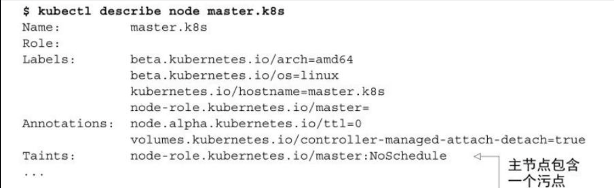
主节点包含⼀个污点，污点包含了⼀个key、value，以及⼀个 effect，表现为<key\>=<value\>:<effect\>。上⾯显⽰的主节点的污点信息，包含⼀个为noderole.kubernetes.io/master的key，⼀个空的value，以及值为NoSchedule的effect。

这个污点将阻⽌pod调度到这个节点上⾯，除⾮有pod能容忍这个污点，⽽通常容忍这个污点的pod都是系统级别pod。
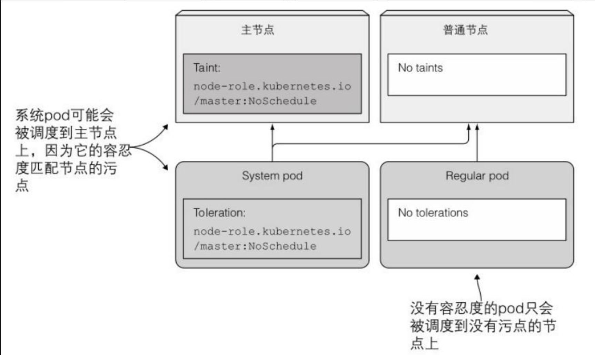

**显示pod的污点容忍度**

在⼀个通过kubeadm初始化的集群中，kube-proxy集群组件以pod的形式运⾏在每个节点上，其中也包括主节点。因为以pod形式运⾏的主节点组件同时也需要访问Kubernetes服务。为了确保kube-proxy pod也能够运⾏在主节点上，该pod需要添加相应的污点容忍度。
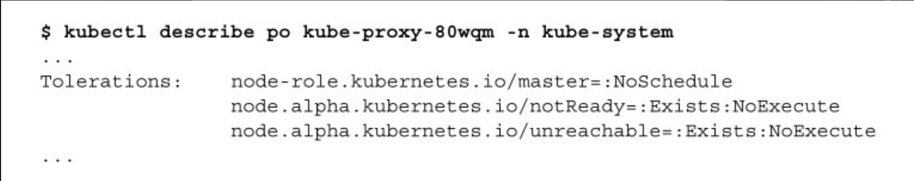
> **注意 尽管在pod的污点容忍度中显⽰了等号，但是在节点的污点信息中却没有。当污点或者污点容忍度中的value为null时，kubectl故意将污点和污点容忍度进⾏不同形式的显⽰。**

**了解污点的效果**

另外两个在kube-proxy pod上的污点定义了当节点状态是没有ready或者是unreachable时，该pod允许运⾏在该节点多长时间（时间⽤秒来表⽰，这⾥没有显⽰，但是在pod YAML中可以看到）​。这两个污点容忍度使⽤的效果是NoExecute⽽不是NoSchedule。

每⼀个污点都可以关联⼀个效果，效果包含了以下三种：
- NoSchedule表⽰如果pod没有容忍这些污点，pod则不能被调度到包含这些污点的节点上。
- PreferNoSchedule是NoSchedule的⼀个宽松的版本，表⽰尽量阻⽌ pod被调度到这个节点上，但是如果没有其他节点可以调度，pod依然会被调度到这个节点上。
- NoExecute不同于NoSchedule以及PreferNoSchedule，后两者只在调度期间起作⽤，⽽NoExecute也会影响正在节点上运⾏着的pod。如果在⼀个节点上添加了NoExecute污点，那些在该节点上运⾏着的pod，如果没有容忍这个NoExecute污点，将会从这个节点去除。
	- 如果 节点上运行的Pod 不能容忍这类污点，会马上被驱逐。
	- 如果 Pod 能够容忍这类污点，但是在容忍度定义中没有指定 `tolerationSeconds`， 则 Pod 还会一直在这个节点上运行。
	- 如果 Pod 能够容忍这类污点，而且指定了 `tolerationSeconds`， 则 Pod 还能在这个节点上继续运行这个指定的时间长度。 这段时间过去后，节点生命周期控制器从节点驱除这些 Pod。
## 1.2 在节点上添加自定义污点

假设你有⼀个单独的Kubernetes集群，上⾯同时有⽣产环境和⾮⽣产环境的流量。其中最重要的⼀点是，⾮⽣产环境的pod不能运⾏在⽣产环境的节点上。可以通过在⽣产环境的节点上添加污点来满⾜这个要求，可以使⽤kubectl taint命令来添加污点：
```bash
kubectl taint node node1 node-type=production:NoSchedule
```
## 1.3 在pod上添加污点容忍度

为了将⽣产环境pod部署到⽣成环境节点上，pod需要能容忍那些你添加在节点上的污点。你的⽣产环境pod的清单⾥⾯需要增加以下的YAML代码⽚段。
```yaml
apiVersion: extensions/v1beta1
kind: Deployment
metadata:
  name: prod
spec:
  replicas: 5
  template:
    metadata:
      labels:
        app: prod
    spec:
      containers:
      - args:
        - sleep
        - "99999"
        image: busybox
        name: main
      tolerations:
      - key: node-type
        operator: Equal        # 支持Equal或Exists
        value: production
        effect: NoSchedule
	  - key: "key1"
	    operator: "Exists"
	    effect: "NoSchedule"
```
添加了对应的污点容忍度后，这个deployment生成的pod就能调度到生产环境了。

`operator` 的默认值是 `Equal`。

一个容忍度和一个污点相匹配是指它们有一样的键名和效果：
- Equal：指键名，键值，效果完全相等。
- Exists：此时容忍度不能指定value，指键名和效果存在。
> **说明：**
> 存在两种特殊情况：
> - 如果一个容忍度的 `key` 为空且 `operator` 为 `Exists`， 表示这个容忍度与任意的 key、value 和 effect 都匹配，即这个容忍度能容忍任何污点。
> - 如果 `effect` 为空，则可以与所有键名 `key1` 的效果相匹配。

## 1.4 了解污点和污点容忍度的使用场景

节点可以拥有多个污点信息，⽽pod也可以有多个污点容忍度。正如你所见，污点可以只有⼀个key和⼀个效果，⽽不必设置value。污点容忍度可以通过设置Equal操作符Equal操作符来指定匹配的value（默认情况下的操作符）​，或者也可以通过设置Exists操作符来匹配污点的 key。

**在调度时使用污点和容忍度**

污点可以⽤来组织新pod的调度（使⽤NoSchedule效果）​，或者定义⾮优先调度的节点（使⽤PreferNoSchedule效果）​，甚⾄是将已有的 pod从当前节点剔除。

可以⽤任何你觉得合适的⽅式去设置污点和容忍度。例如，可以将⼀个集群分成多个部分，只允许开发团队将pod调度到他们特定的节点上。当你的部分节点提供了某种特殊硬件，并且只有部分pod需要使⽤到这些硬件的时候，也可以通过设置污点和容忍度的⽅式来实现。

你可以给一个节点添加多个污点，也可以给一个 Pod 添加多个容忍度设置。 Kubernetes 处理多个污点和容忍度的过程就像一个过滤器：从一个节点的所有污点开始遍历， 过滤掉那些 Pod 中存在与之相匹配的容忍度的污点。余下未被过滤的污点的 effect 值决定了 Pod 是否会被分配到该节点。需要注意以下情况：
- 如果未被忽略的污点中存在至少一个 effect 值为 `NoSchedule` 的污点， 则 Kubernetes 不会将 Pod 调度到该节点。
- 如果未被忽略的污点中不存在 effect 值为 `NoSchedule` 的污点， 但是存在至少一个 effect 值为 `PreferNoSchedule` 的污点， 则 Kubernetes 会**尝试**不将 Pod 调度到该节点。
- 如果未被忽略的污点中存在至少一个 effect 值为 `NoExecute` 的污点， 则 Kubernetes 不会将 Pod 调度到该节点（如果 Pod 还未在节点上运行）， 并且会将 Pod 从该节点驱逐（如果 Pod 已经在节点上运行）。

**配置节点失效之后的pod重新调度最长时间**

你也可以配置⼀个容忍度，⽤于当某个pod运⾏所在的节点变成 unready或者unreachable状态时，Kubernetes可以等待该pod被调度到其他节点的最长等待时间。如果查看其中⼀个pod的容忍度信息，你将看到两条容忍度信息，如以下代码清单所⽰。
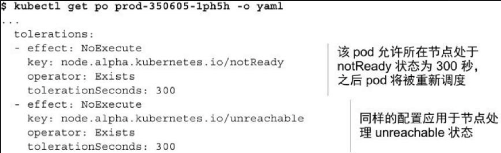
这两个容忍度表⽰，该pod将容忍所在节点处于notReady或者 unreachable状态维持300秒。当Kubernetes控制器检测到有节点处于notReady或者unreachable状态时，将会等待300秒，如果状态持续的话，之后将把该pod重新调度到其他节点上。

当没有定义这两个容忍度时，他们会⾃动添加到pod上。如果你觉得对于你的pod来说，5 分钟太长的话，可以在pod描述中显式地将这两个容忍度设置得更短⼀些。
> 1.13后基于污点的pod驱逐策略默认启用

当某种条件为真时，节点控制器会自动给节点添加一个污点。当前内置的污点包括：
- `node.kubernetes.io/not-ready`：节点未准备好。这相当于节点状况 `Ready` 的值为 "`False`"。
- `node.kubernetes.io/unreachable`：节点控制器访问不到节点. 这相当于节点状况 `Ready` 的值为 "`Unknown`"。
- `node.kubernetes.io/memory-pressure`：节点存在内存压力。
- `node.kubernetes.io/disk-pressure`：节点存在磁盘压力。
- `node.kubernetes.io/pid-pressure`：节点的 PID 压力。
- `node.kubernetes.io/network-unavailable`：节点网络不可用。
- `node.kubernetes.io/unschedulable`：节点不可调度。
- `node.cloudprovider.kubernetes.io/uninitialized`：如果 kubelet 启动时指定了一个“外部”云平台驱动， 它将给当前节点添加一个污点将其标志为不可用。在 cloud-controller-manager 的一个控制器初始化这个节点后，kubelet 将删除这个污点。
在节点被排空时，节点控制器或者 kubelet 会添加带有 `NoExecute` 效果的相关污点。 此效果被默认添加到 `node.kubernetes.io/not-ready` 和 `node.kubernetes.io/unreachable` 污点中。 如果异常状态恢复正常，kubelet 或节点控制器能够移除相关的污点。

DaemonSet 中的 Pod 被创建时， 针对以下污点自动添加的 `NoExecute` 的容忍度将不会指定 `tolerationSeconds`：

- `node.kubernetes.io/unreachable`
- `node.kubernetes.io/not-ready`

且会自动对以下污点增加容忍度，以防 DaemonSet 崩溃：
- `node.kubernetes.io/memory-pressure`
- `node.kubernetes.io/disk-pressure`
- `node.kubernetes.io/pid-pressure`（1.14 或更高版本）
- `node.kubernetes.io/unschedulable`（1.10 或更高版本）
- `node.kubernetes.io/not-ready`
- `node.kubernetes.io/network-unavailable`（**只适合主机网络配置**）

# 2 使用节点亲和性将pod调度到特定节点上

正如你⽬前所学到的，污点可以⽤来让pod远离特定的⼏点。现在，你将学习⼀种更新的机制，叫作节点亲和性（node affinity）​，这种机制允许你通知Kubernetes将pod只调度到某个⼏点⼦集上⾯。

**对比节点亲和性和节点选择器**

在早期版本的Kubernetes中，初始的节点亲和性机制，就是pod描述中的nodeSelector字段。节点必须包含所有pod对应字段中的指定 label，才能成为pod调度的⽬标节点。

节点选择器实现简单，但是它不能满⾜你的所有需求。正因为如此，⼀种更强⼤的机制被引⼊。节点选择器最终会被弃⽤，所以现在了解新的节点亲和性机制就变得重要起来。

与节点选择器类似，每个pod可以定义⾃⼰的节点亲和性规则。这些规则可以允许你指定硬性限制或者偏好。如果指定⼀种偏好的话，你将告知Kubernetes对于某个特定的pod，它更倾向于调度到某些节点上，之后Kubernetes将尽量把这个pod调度到这些节点上⾯。如果没法实现的话，pod将被调度到其他某个节点上。

**检查默认的节点标签**

节点亲和性根据节点的标签来进⾏选择，这点跟节点选择器是⼀致的。
```bash
kubectl get no/nodename --show-labels
```
# 3 指定强制性节点亲和性规则

```yaml
apiVersion: v1
kind: Pod
metadata:
  name: kubia-gpu
spec:
  nodeSelector:
    gpu: "true"
  containers:
  - image: luksa/kubia
    name: kubia
```
nodeSelector字段表⽰，pod只能被部署在包含了gpu=true标签的节点上。如果你将节点选择器替换为节点亲和性规则，pod定义将会如以下代码清单所⽰。
```yaml
apiVersion: v1
kind: Pod
metadata:
  name: kubia-gpu
spec:
  affinity:
    nodeAffinity:
      requiredDuringSchedulingIgnoredDuringExecution:
        nodeSelectorTerms:
        - matchExpressions:
          - key: gpu
            operator: In
            values:
            - "true"
  containers:
  - image: luksa/kubia
    name: kubia
```
requiredDuringScheduling...表明了该字段下定义的规则，为了让 pod能调度到该节点上，明确指出了该节点必须包含的标签。

...IgnoredDuringExecution表明了该字段下定义的规则，不会影响已经在节点上运⾏着的pod。

⽬前，当你知道当前的亲和性规则只会影响正在被调度的pod，并且不会导致已经在运⾏的pod被剔除时，情况可能会更简单⼀些。这就是为什么⽬前的规则都是以IgnoredDuringExecution结尾的。最终，Kubernetes也会⽀持RequiredDuringExecution，表⽰如果去除掉节点上的某个标签，那些需要节点包含该标签的pod将会被剔除。正如笔者所说，Kubernetes⽬前还不⽀持特性。所以，我们可以暂时不去关⼼这个长字段的第⼆部分。
> **Pod 间亲和性和反亲和性都需要相当的计算量，因此会在大规模集群中显著降低调度速度。 我们不建议在包含数百个节点的集群中使用这类设置。**


**了解节点选择器条件**

记住上⼀节所解释的内容，我们将更容易理解nodeSelectorTerms和matchExpressions字段，这两个字段定义了节点的标签必须满⾜哪⼀种表达式，才能满⾜pod调度的条件。样例中的单个表达式⽐较容易理解，节点必须包含⼀个叫作gpu的标签，并且这个标签的值必须是 true。
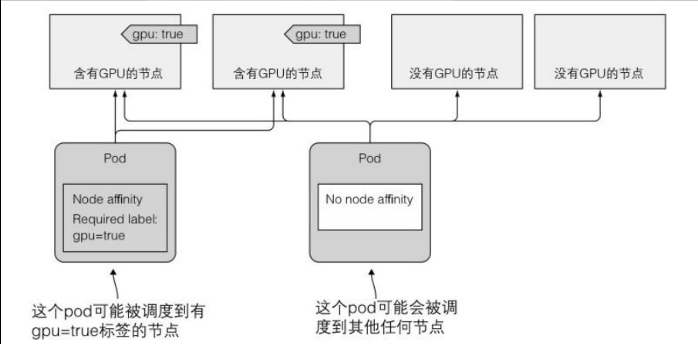
## 3.1 调度pod时优先考虑某些节点

最近介绍的节点亲和性的最⼤好处就是，当调度某⼀个pod时，指定 调 度 器 可 以 优 先 考 虑 哪 些节 点 ， 这 个 功 能 是 通 过preferredDuringSchedulingIgnoredDuringExecution字段来实现的。

想象⼀下你拥有⼀个跨越多个国家的多个数据中⼼，每⼀个数据中⼼代表了⼀个单独的可⽤性区域。在每个区域中，你有⼀些特定的机器，只提供给你⾃⼰或者你的合作公司使⽤。现在，你想要部署⼀些pod，希望将pod优先部署在区域zone1，并且是为你公司部署预留的机器上。如果你的机器没有⾜够的空间⽤于这些pod，或者出于其他⼀些重要的原因不希望这些pod调度到上⾯，那么就会调度到其他区域的其他机器上⾯，这种情况你也是可以接受的。节点亲和性就可以实现这样的功能。

**给节点加上标签**

⾸先，节点必须加上合适的标签。每个节点需要包含两个标签，⼀个⽤于表⽰所在的这个节点所归属的可⽤性区域，另⼀个⽤于表⽰这是⼀个独占的节点还是⼀个共享的节点。
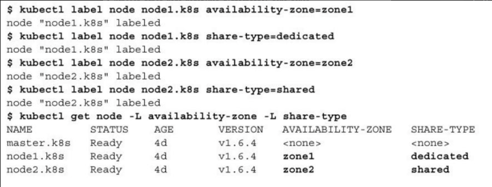

当这些节点的标签设置好，现在可以创建⼀个Deployment，其中优 先 选 择 zone1 中 的dedicated 节 点 。 下 ⾯ 的 代 码 清 单 显 ⽰ 了这 个 Deployment的描述。
```yaml
apiVersion: extensions/v1beta1
kind: Deployment
metadata:
  name: pref
spec:
  replicas: 5
  template:
    metadata:
      labels:
        app: pref
    spec:
      affinity:
        nodeAffinity:
          preferredDuringSchedulingIgnoredDuringExecution:
          - weight: 80
            preference:
              matchExpressions:
              - key: availability-zone
                operator: In
                values:
                - zone1
          - weight: 20
            preference:
              matchExpressions:
              - key: share-type
                operator: In
                values:
                - dedicated
      containers:
      - args:
        - sleep
        - "99999"
        image: busybox
        name: main
```
你定义了⼀个节点亲和性优先级 ， ⽽ 不 是 强 制 要 求 。 你 想要 pod 被 调 度 到 包 含 标 签 availability-zone=zone1以及share-type=dedicated的节点上。第⼀个优先级规则是相对重要的，因此将其weight设置为80，⽽第⼆个优先级规则就不那么重要（weight设置为20）​。

**了解节点优先级是如何工作的**

如 果 你 的 集 群 包 含 多 个 节 点 ， 当 调 度 上⾯ 的 代 码 清 单 中 的 Deployment pod时，节点将会分成4个组。那些包含availability-zone以及share-type标签，并且匹配pod亲和性的节点，将排在最前⾯。然后，由于pod的节点亲和性规则配置的权重，接下来是zone1的shared节点，然后是其他区域的dedicated节点，优先级最低的是剩下的其他节点。
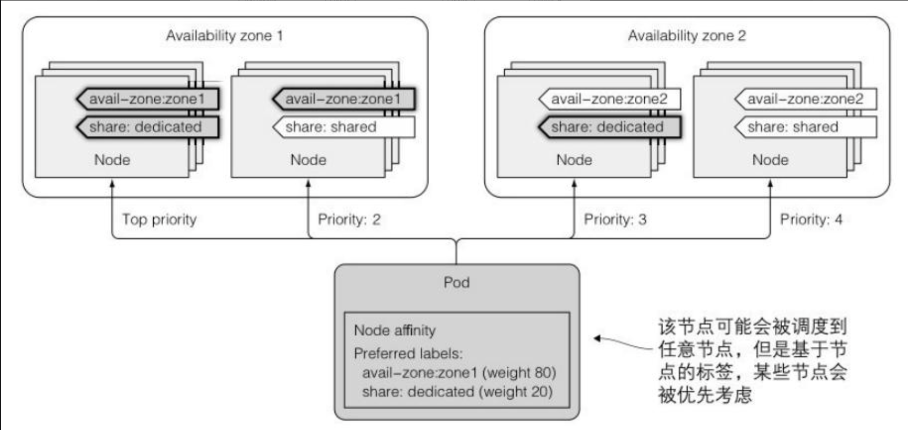

当在一个只有两个节点的集群中调度pod，即使其中一个节点的优先级很高，但仍然有可能把一个pod调度到优先级底的node上。原因是除了节点亲和性的优先级函数，调度器还是使⽤其他的优先级函数来决定节点被调度到哪。其中之⼀就是SelectorSpreadPriority函数，这个函数确保了属于同⼀个ReplicaSet或者Service的pod，将分散部署在不同节点上，以避免单个节点失效导致这个服务也宕机。这就是有 1个pod被调度到node2的最⼤可能。

如果你没有设置任何节点亲和性优先级，pod将会被均匀地分配在两个节点上⾯。
# 4 使用pod亲和性与非亲和性对pod进行协同部署

你已经了解了节点亲和性规则是如何影响pod被调度到哪个节点。

但是，这些规则只影响了pod和节点之间的亲和性。然⽽，有些时候你也希望能有能⼒指定pod⾃⾝之间的亲和性。

举例来说，想象⼀下你有⼀个前端pod和⼀个后端pod，将这些节点部署得⽐较靠近，可以降低延时，提⾼应⽤的性能。可以使⽤节点亲和性规则来确保这两个pod被调度到同⼀个节点、同⼀个机架、同⼀个数据中⼼。但是，之后还需要指定调度到具体哪个节点、哪个机架或者哪个数据中⼼。因此，这不是⼀个最佳的解决⽅案。更好的做法应该是，让Kubernetes将你的pod部署在任何它觉得合适的地⽅，同时确保2个pod是靠近的。这种功能可以通过pod亲和性来实现。
## 4.1 使用pod间亲和性将多个pod部署在同一个节点上

你将部署1个后端pod和5个包含pod亲和性配置的前端pod实例，使得这些前端实例将被部署在后端pod所在的同⼀个节点上。

先部署后端pod
```bash
kubectl run backend -l app=backend --image=busybos -- sleep 99999
```
该部署并没有什么特别的，唯⼀需要注意的是通过-l选项添加的app=backend标签，这个标签将在前端pod的podAffinity配置中使⽤到。

**在pod中指定pod亲和性**

```yaml
apiVersion: extensions/v1beta1
kind: Deployment
metadata:
  name: frontend
spec:
  replicas: 5
  template:
    metadata:
      labels:
        app: frontend
    spec:
      affinity:
        podAffinity:
          requiredDuringSchedulingIgnoredDuringExecution: # 定义一个强制性要求
          - topologyKey: kubernetes.io/hostname 
            labelSelector:
              matchLabels:
                app: backend    # 必须被调度到匹配pod选择器的节点上
      containers:
      - name: main
        image: busybox
        args:
        - sleep
        - "99999"


```
代码清单显⽰了，该部署将创建包含强制性要求的pod，其中要求 pod将被调度到和其他包含app=backend标签的pod所在的相同节点上(通过topologyKey字段指定)。
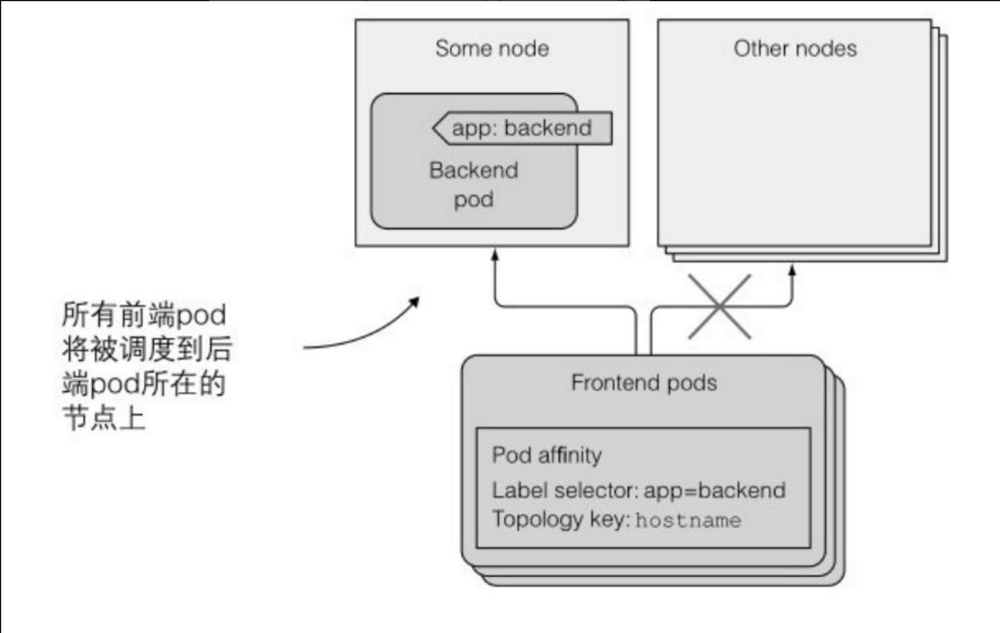

**了解调度器如何使用pod亲和性规则**

有趣的是，如果现在你删除了后端pod，调度器会将该pod调度到node2，即便后端pod本⾝没有定义任何pod亲和性规则（只有前端pod设置了规则）​。这种情况很合理，因为假设后端pod被误删除⽽被调度到其他节点上，前端pod的亲和性规则就被打破了。

如果增加调度器的⽇志级别检查它的⽇志的话，可以确定调度器是会考虑其他pod的亲和性规则的。下⾯的代码清单显⽰了相关的⽇志。
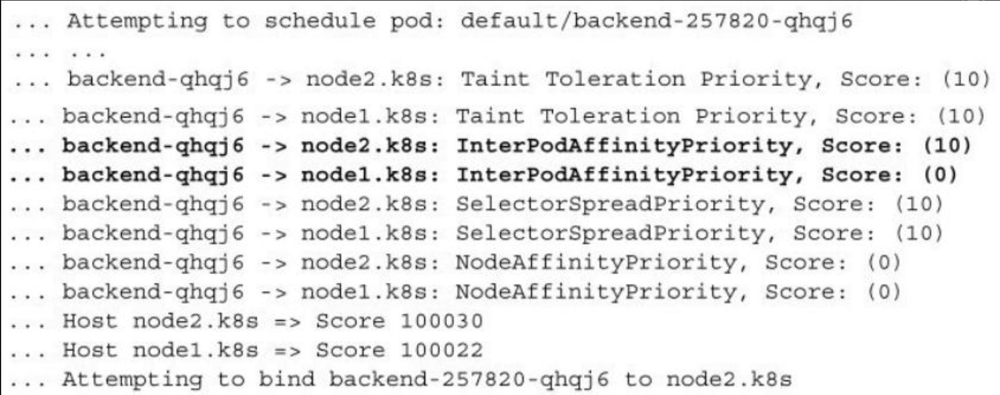如果你关注加粗的两⾏⽇志，你会发现当调度后端pod时，由于 pod间亲和性，node2获得了⽐node1更⾼的分数。

**将pod调度到一个区域**

topologyKey的⼯作⽅式很简单。如果你愿意，可以任意设置⾃定义的键，例如rack，为了让 pod能部署到同⼀个机柜。唯⼀的前置条件就是，在你的节点上加上 rack标签。

举例来说，你有20个节点，每10个节点在同⼀个机柜中，你将前 10个节点加上标签rack=rack1，另外10个加上标签rack=rack2。接着，当定义pod的podAffinity时，将toplogyKey设置为rack。

当调度器决定pod调度到哪⾥时，它⾸先检查pod的podAffinity配置，找出那些符合标签选择器的pod，接着查询这些pod运⾏在哪些节点上。特别的是，它会寻找标签能匹配podAffinity配置中topologyKey的节点。接着，它会优先选择所有的标签匹配pod的值的节点。当标签选择器匹配了运⾏在Node 12的后端pod，那个节点rack标签的值等于rack2。所以，当调度1个前端pod时，调度器只会在包含标签rack=rack2的节点中进⾏选择。
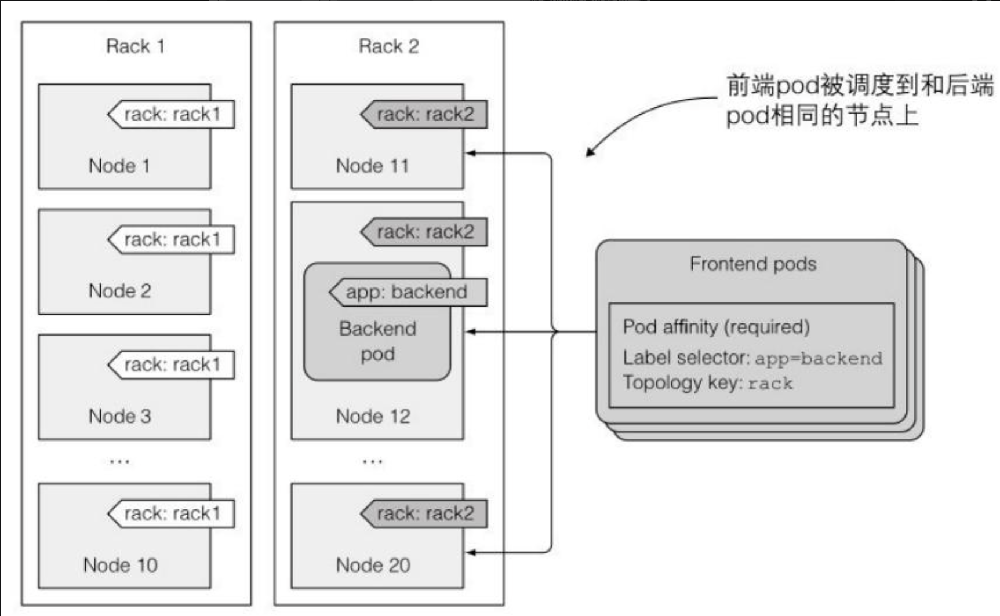
> **注意 在调度时，默认情况下，标签选择器只有匹配同⼀命名空间中的pod。但是，可以通过在labelSelector同⼀级添加namespaces字段，实现从其他的命名空间选择pod的功能。**

原则上，`topologyKey` 可以是任何合法的标签键。出于性能和安全原因，`topologyKey` 有一些限制：

- 对于 Pod 亲和性而言，在 `requiredDuringSchedulingIgnoredDuringExecution` 和 `preferredDuringSchedulingIgnoredDuringExecution` 中，`topologyKey` 不允许为空。
- 对于 `requiredDuringSchedulingIgnoredDuringExecution` 要求的 Pod 反亲和性， 准入控制器 `LimitPodHardAntiAffinityTopology` 要求 `topologyKey` 只能是 `kubernetes.io/hostname`。如果你希望使用其他定制拓扑逻辑， 你可以更改准入控制器或者禁用之。

## 4.2 表达pod亲和性优先级取代强制性要求

在前面，你了解了nodeAffinity可以表⽰⼀种强制性要求，表⽰pod只能被调度到符合节点亲和性规则的节点上。它也可以表⽰⼀种节点优先级，⽤于告知调度器将pod调度到某些节点上，同时也满⾜当这些节点出于各种原因⽆法满⾜pod要求时，将pod调度到其他节点上。

这种特性同样适⽤于podAffinity，你可以告诉调度器，优先将前端 pod调度到和后端pod相同的节点上，但是如果不满⾜需求，调度到其他 节 点 上 也是 可 以 的 。 ⼀ 个 使 ⽤ 了preferredDuringSchedulingIgnoredDuringExecutionpod 亲 和 性 规 则 的 Deployment的样例如以下代码清单所⽰。
```yaml
apiVersion: extensions/v1beta1
kind: Deployment
metadata:
  name: frontend
spec:
  replicas: 5
  template:
    metadata:
      labels:
        app: frontend
    spec:
      affinity:
        podAffinity:
          preferredDuringSchedulingIgnoredDuringExecution:
          - weight: 80
            podAffinityTerm:
              topologyKey: kubernetes.io/hostname
              labelSelector:
                matchLabels:
                  app: backend
      containers:
      - name: main
        image: busybox
        args:
        - sleep
        - "99999"
```
跟nodeAffinity优先级规则⼀样，需要为⼀个规则设置⼀个权重。同时也需要设置topologyKey和labelSelector，正如podAffinity规则中的强制性要求⼀样。
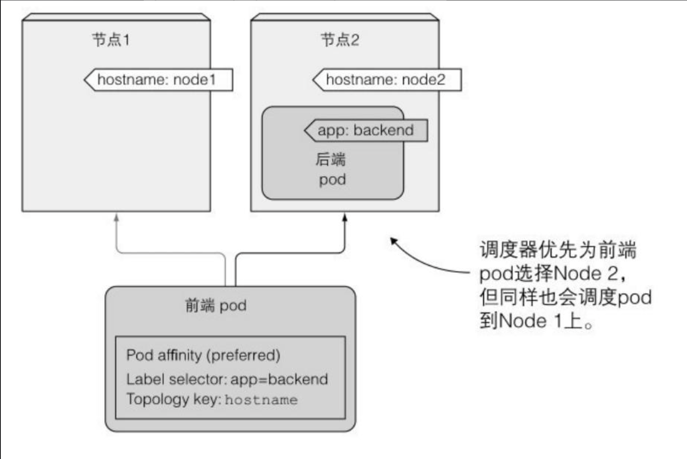
## 4.3 利用反亲和性分开调度pod

你现在已经知道了如何告诉调度器对pod进⾏协同部署，但有时候你的需求却恰恰相反，你可能希望pod远离彼此。这种特性叫作pod⾮亲和性。它和pod亲和性的表⽰⽅式⼀样，只不过是将podAffinity字段换 成 podAntiAffinity ， 这 将 导致 调 度 器 永 远 不 会 选 择 那 些 有 包 含podAntiAffinity匹配标签的pod所在的节点。
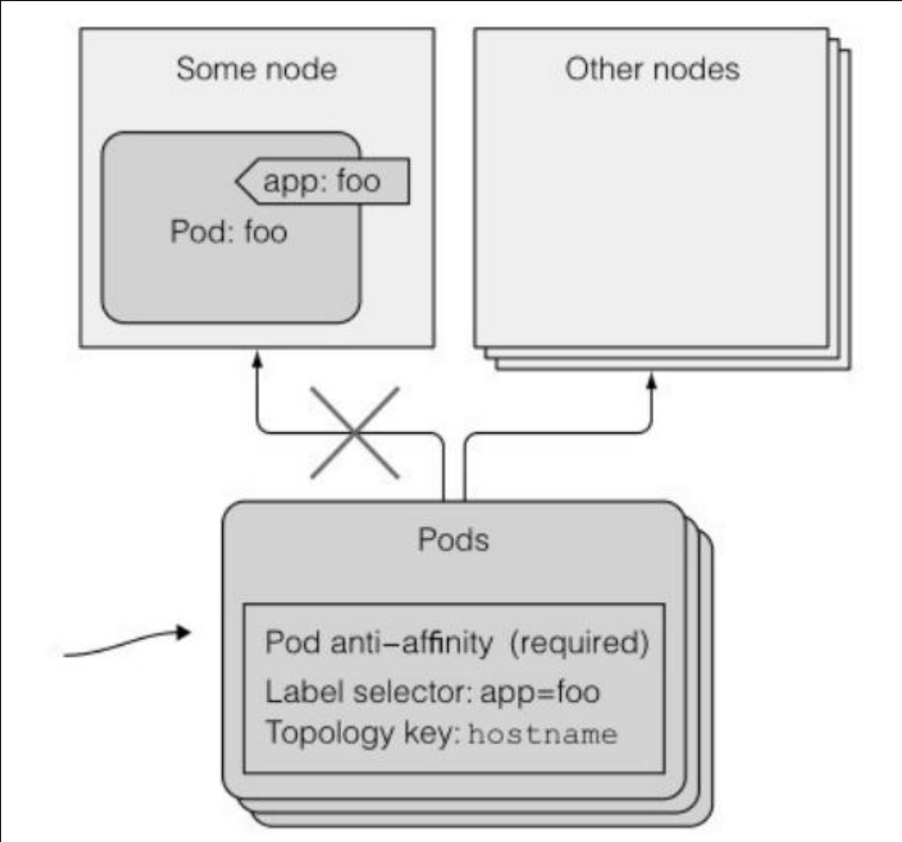
⼀个为什么需要使⽤pod⾮亲和性的例⼦，就是当两个集合的 pod，如果运⾏在同⼀个节点上会影响彼此的性能。在这种情况下，你需要告知调度器永远不要将这些pod部署在同⼀个节点上。另⼀个例⼦是强制让调度器将同⼀组的pod分在在不同的可⽤性区域或者地域，这样让整个区域或地域失效之后，不会使得整个服务完全不可⽤。
> **Pod 反亲和性需要节点上存在一致性的标签。换言之， 集群中每个节点都必须拥有与 `topologyKey` 匹配的标签。 如果某些或者所有节点上不存在所指定的 `topologyKey` 标签，调度行为可能与预期的不同。**

**使用非亲和关系分散部署pod**

```yaml
apiVersion: extensions/v1beta1
kind: Deployment
metadata:
  name: frontend
spec:
  replicas: 5
  template:
    metadata:
      labels:
        app: frontend  
    spec:
      affinity:
        podAntiAffinity:
          requiredDuringSchedulingIgnoredDuringExecution:
          - topologyKey: kubernetes.io/hostname
            labelSelector:
              matchLabels:       # 也可以使用matchExpression
                app: frontend    # 不能调度到一个具有app: frontend 标签的pod节点上
      containers:
      - name: main
        image: busybox
        args:
        - sleep
        - "99999"
```
与使⽤pod亲和性⼀样，topologyKey字段决定了pod不能被调度的范围。可以使⽤这个字段决定pod不能被调度到同⼀个机柜、可⽤性区域、地域，或者任何你创建的⾃定义节点标签标⽰的范围。
# 5 命名空间选择

除了 `labelSelector` 和 `topologyKey`，你也可以指定 `labelSelector` 要匹配的名字空间列表，方法是在 `labelSelector` 和 `topologyKey` 所在层同一层次上设置 `namespaces`。 如果 `namespaces` 被忽略或者为空，则默认为 Pod 亲和性/反亲和性的定义所在的名字空间。
## 5.1 命名空间选择符

在1.24版本之上，用户也可以使用 `namespaceSelector` 选择匹配的名字空间，`namespaceSelector` 是对名字空间集合进行标签查询的机制。 亲和性条件会应用到 `namespaceSelector` 所选择的名字空间和 `namespaces` 字段中所列举的名字空间之上。 注意，空的 `namespaceSelector`（`{}`）会匹配所有名字空间，而 null 或者空的 `namespaces` 列表以及 null 值 `namespaceSelector` 意味着“当前 Pod 的名字空间”。
# 6 操作符

下面是你可以在上述 `nodeAffinity` 和 `podAffinity` 的 `operator` 字段中可以使用的所有逻辑运算符。

| 操作符            | 行为              |
| -------------- | --------------- |
| `In`           | 标签值存在于提供的字符串集中  |
| `NotIn`        | 标签值不包含在提供的字符串集中 |
| `Exists`       | 对象上存在具有此键的标签    |
| `DoesNotExist` | 对象上不存在具有此键的标签   |