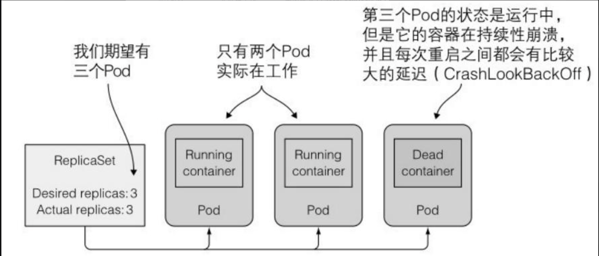
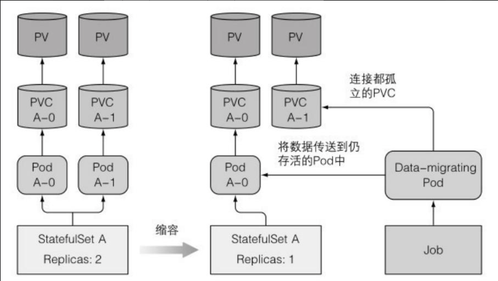
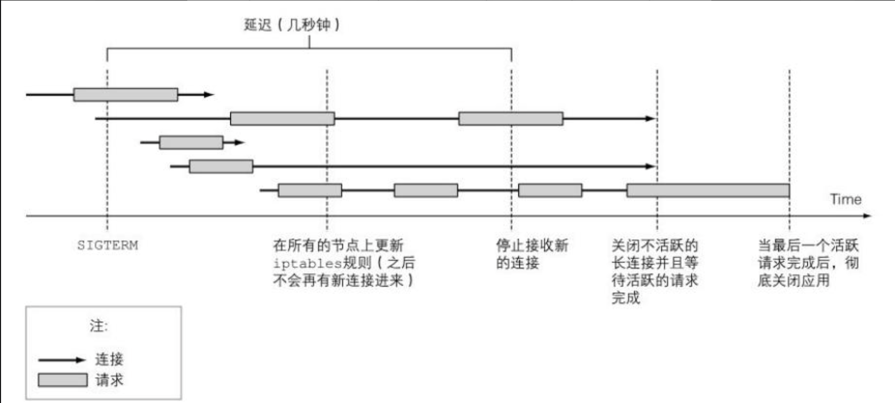
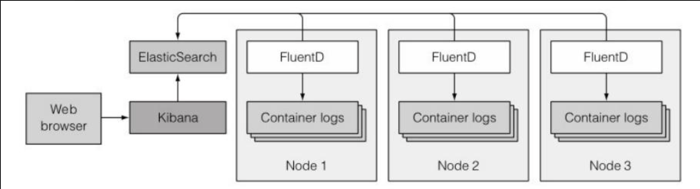

# 第十六章：开发应用的最佳实践

> 本章内容包括：
>
> * 了解在一个典型应用中会出现哪些kubernetes的资源
> * 添加pod启动后和停止前的生命周期钩子
> * 在不断开客户端连接的情况下妥善的停止应用
> * 在kubernetes中如何方便管理应用
> * 在pod中使用init容器
> * 使用minikube在本地进行应用开发

## 1 集中一切资源

我们⾸先看看⼀个实际应⽤程序的各个组成部分。这也会让你有机会看看你是否记得迄今为⽌所学到的⼀切，并且能够从全局来审视它们。下图显⽰了⼀个典型应⽤中所使⽤的各个Kubernetes组件。\
⼀ 个 典 型 的 应 ⽤ manifest 包 含 了 ⼀ 个 或 者多 个 Deployment 和StatefulSet对象。这些对象中包含了⼀个或者多个容器的pod模板，每个容器都有⼀个存活探针，并且为容器提供的服务（如果有的话）提供就绪探针。提供服务的pod是通过⼀个或者多个服务来暴露⾃⼰的。

当需要从集群外访问这些服务的时候，要么将这些服务配置为LoadBalancer或者NodePort类型的服务，要么通过Ingress资源来开放服务。

pod模板（从中创建pod的配置⽂件）通常会引⽤两种类型的私密凭据（Secret）​。⼀种是从私有镜像仓库拉取镜像时使⽤的；另⼀种是 pod中运⾏的进程直接使⽤的。私密凭据本⾝通常不是应⽤manifest的⼀部分，因为它们不是由应⽤开发者来配置，⽽是由运维团队来配置的。私密凭据通常会被分配给ServiceAccount，然后ServiceAccount会被分配给每个单独的pod。

⼀个应⽤还包含⼀个或者多个ConfigMap对象，可以⽤它们来初始化环境变量，或者在pod中以configMap卷来挂载。有⼀些pod会使⽤额外的卷，例如emptyDir或gitRepo卷，⽽需要持久化存储的pod则需要persistentVolumeClaim卷。PersistentVolumeClaim也是⼀个应⽤manifest的⼀部分，⽽被PersistentVolumeClaim所引⽤的StorageClass则是由系统管理员事先创建的。

在某些情况下，⼀个应⽤还需要使⽤任务（Jobs）和定时任务（CronJobs）​。守护进程集（DaemonSet）通常不是应⽤部署的⼀部分，但是通常由系统管理员创建，以在全部或者部分节点上运⾏系统服务。⽔平pod扩容器（HorizontalpodAutoscaler）可以由开发者包含在应⽤manifest中或者后续由运维团队添加到系统中。集群管理员还会创建LimitRange和ResourceQuota对象，以控制每个pod和所有的pod（作为⼀个整体）的计算资源使⽤情况。

在应⽤部署后，各种Kubernetes控制器会⾃动创建其他的对象。其中包括端点控制器（Endpointcontroller）创建的服务端点（Endpoint）对象，部署控制器（Deployment controller）创建的 ReplicaSet对象，以及由ReplicaSet（或者Job、CronJob、StatefulSet、DaemonSet）创建的实际的pod对象。

资源通常通过⼀个或者多个标签来组织。这不仅仅适⽤于pod，同时也适⽤于其他的资源。除了标签，⼤多数的资源还包含⼀个描述资源的注解，列出负责该资源的⼈员或者团队的联系信息，或者为管理者和其他的⼯具提供额外的元数据。

pod是所有⼀切资源的中⼼，毫⽆疑问是Kubernetes中最重要的资源。毕竟，你的每个应⽤都运⾏在pod中。为了确保你知道如何开发能充分利⽤应⽤所在环境资源的应⽤，我们最后再从应⽤的⾓度来仔细看⼀下pod。

### 1.1 了解pod的生命周期

可以将pod⽐作只运⾏单个应⽤的虚拟机。尽管在 pod中运⾏的应⽤和虚拟机中运⾏的应⽤没什么不同，但是还是存在显著的差异。其中⼀个例⼦就是pod中运⾏的应⽤随时可能会被杀死，因为Kubernetes需要将这个pod调度到另外⼀个节点，或者是请求缩容。

### 1.2 应用必须料到会被杀死或者重新调度

在Kubernetes之外，运⾏在虚拟机中的应⽤很少会被从⼀台机器迁移到另外⼀台。当⼀个操作者迁移应⽤的时候，他们可以重新配置应⽤并且⼿动检查应⽤是否在新的位置正常运⾏。借助于Kubernetes，应⽤可以更加频繁地进⾏⾃动迁移⽽⽆须⼈⼯介⼊，也就是说没有⼈会再对应⽤进⾏配置并且确保它们在迁移之后能够正常运⾏。这就意味着应⽤开发者必须允许他们的应⽤可以被相对频繁地迁移。

**预料到本地IP和主机名会发生变化**

当⼀个pod被杀死并且在其他地⽅运⾏之后（技术上来讲是⼀个新的pod替换了旧的pod，旧pod没有被迁移）​，它不仅拥有了⼀个新的IP地址还有了⼀个新的名称和主机名。⼤部分⽆状态的应⽤都可以处理这种场景同时不会有不利的影响，但是有状态服务通常不能。我们已经了解到有状态应⽤可以通过⼀个StatefulSet来运⾏，StatefulSet会保证在将应⽤调度到新的节点并启动之后，它可以看到和之前⼀样的主机名和持久化状态。当然pod的IP还是会发⽣变化，应⽤必须能够应对这种变化。因此应⽤开发者在⼀个集群应⽤中不应该依赖成员的IP地址来构建彼此的关系，另外如果使⽤主机名来构建关系，必须使⽤StatefulSet。

**预料到写入磁盘的数据会消失**

还有⼀件事情需要记住的是，在应⽤往磁盘写⼊数据的情况下，当应⽤在新的pod中启动后这些数据可能会丢失，除⾮你将持久化的存储挂载到应⽤的数据写⼊路径。在pod被重新调度的时候，数据丢失是⼀定的，但是即使在没有调度的情况下，写⼊磁盘的⽂件仍然会丢失。甚⾄是在单个pod的⽣命周期过程中，pod中的应⽤写⼊磁盘的⽂件也会丢失。我们通过⼀个例⼦来解释⼀下这个问题。

假设有个应⽤，它的启动过程是⽐较耗时的⽽且需要很多的计算操作。为了能够让这个应⽤在后续的启动中更快，开发者⼀般会把启动过程中的⼀些计算结果缓存到磁盘上（例如启动时扫描所有的⽤作注解的Java类然后把结果写⼊到索引⽂件）​。由于在Kubernetes中应⽤默认运⾏在容器中，这些⽂件会被写⼊到容器的⽂件系统中。如果这个时候容器重启了，这些⽂件都会丢失，因为新的容器启动的时候会使⽤⼀个全新的可写⼊层

不要忘了，单个容器可能因为各种原因被重启，例如进程崩溃了，例如存活探针返回失败了，或者是因为节点内存逐步耗尽，进程被OOMKiller杀死了。当上述情况发⽣的时候，pod还是⼀样，但是容器却是全新的了。Kubelet不会⼀个容器运⾏多次，⽽是会重新创建⼀个容器。

**使用存储卷来跨容器持久化数据**

当pod的容器重启后，本例中的应⽤仍然需要执⾏有⼤量计算过程的启动程序。这个或许不是你所期望的。为了保证这种情况下数据不丢失，你需要⾄少使⽤⼀个pod级别的卷。因为卷的存在和销毁与pod⽣命周期是⼀致的，所以新的容器将可以重⽤之前容器写到卷上的数据。

有时候使⽤存储卷来跨容器存储数据是个好办法，但是也不总是如此。万⼀由于数据损坏⽽导致新创建的进程再次崩溃呢？这会导致⼀个持续性的循环崩溃（pod会提⽰CrashLoopBackOff状态）​。如果不使⽤存储卷的话，新的容器会从零开始启动，并且很可能不会崩溃。

使⽤存储卷来跨容器存储数据是把双刃剑。你需要仔细思考是否使⽤它们。

### 1.3 重新调度死亡的或者部分死亡的pod

如果⼀个pod的容器⼀直处于崩溃状态，Kubelet将会⼀直不停地重启它们。每次重启的时间间隔将会以指数级增加，直到达到5分钟。在这个5分钟的时间间隔中，pod基本上是死亡了，因为它们的容器进程没有运⾏。公平来讲，如果是个多容器的pod，其中的⼀些容器可能是正常运⾏的，所以这个pod只是部分死亡了。但是如果pod中仅包含⼀个容器，那么这个pod是完全死亡的⽽且已经毫⽆⽤处了，因为⾥⾯已经没有进程在运⾏了。

你或许会奇怪，为什么这些pod不会被⾃动移除或者重新调度，尽管它们是ReplicaSet或者相似控制器的⼀部分。如果你创建了⼀个期望副本数是3的ReplicaSet，当那些pod中的⼀个容器开始崩溃，Kubernetes将不会删除或者替换这个pod。结果就是这个ReplicaSet只剩下了两个正确运⾏的副本，⽽不是你期望的三个。

你或许期望能够删除这个pod然后重新启动⼀个可以在其他节点上成功运⾏的pod。毕竟这个容器可能是因为⼀个节点相关的问题⽽导致的崩溃，这个问题在其他的节点上不会出现。很遗憾，并不是这样的。ReplicaSet本⾝并不关⼼pod是否处于死亡状态，它只关⼼pod的数量是否匹配期望的副本数量，在这种情况下，副本数量确实是匹配的。

### 1.4 以固定顺序启动pod

pod中运⾏的应⽤和⼿动运⾏的应⽤之间的另外⼀个不同就是运维⼈员在⼿动部署应⽤的时候知道应⽤之间的依赖关系，这样他们就可以按照顺序来启动应⽤。

**了解pod是如何启动的**

当你使⽤Kubernetes来运⾏多个pod的应⽤的时候，Kubernetes没有内置的⽅法来先运⾏某些pod然后等这些pod运⾏成功后再运⾏其他 pod。当然你也可以先发布第⼀个应⽤的配置，然后等待pod启动完毕再发布第⼆个应⽤的配置。但是你的整个系统通常都是定义在⼀个单独的YAML或者JSON⽂件中，这些⽂件包含了多个pod、服务或者其他对象的定义。

Kubernetes API服务器确实是按照YAML/JSON⽂件中定义的对象的顺序来进⾏处理的，但是仅仅意味着它们在被写⼊到etcd的时候是有顺序的。⽆法确保pod会按照那个顺序启动。

但是你可以阻⽌⼀个主容器的启动，直到它的预置条件被满⾜。这个是通过在pod中包含⼀个叫作init的容器来实现的。

**init容器介绍**

除了常规的容器，pod还可以包括init容器。如容器名所⽰，它们可以⽤来初始化pod，这通常意味着向容器的存储卷中写⼊数据，然后将这个存储卷挂载到主容器中。

⼀个pod可以拥有任意数量的init容器。init容器是顺序执⾏的，并且仅当最后⼀个init容器执⾏完毕才会去启动主容器。换句话说，init容器也可以⽤来延迟pod的主容器的启动——例如，直到满⾜某⼀个条件的时候。init容器可以⼀直等待直到主容器所依赖的服务启动完成并可以提供服务。当这个服务启动并且可以提供服务之后，init容器就执⾏结束了，然后主容器就可以启动了。这样主容器就不会发⽣在所依赖服务准备好之前使⽤它的情况了。

下⾯让我们来看⼀个pod使⽤init容器来延迟主容器启动的例⼦。

```yaml
apiVersion: v1
kind: Pod
metadata:
  name: fortune-client
spec:
  initContainers:
  - name: init
    image: busybox
    command:
    - sh
    - -c
    - 'while true; do echo "Waiting for fortune service to come up..."; wget http://fortune -q -T 1 -O /dev/null >/dev/null 2>/dev/null && break; sleep 1; done; echo "Service is up! Starting main container."'
  containers:
  - image: busybox
    name: main
    command:
    - sh
    - -c
    - 'echo "Main container started. Reading fortune very 10 seconds."; while true; do echo "-------------"; wget -q -O - http://fortune; sleep 10; done'
```

当你部署这个pod的时候，只有pod的init容器会启动起来。并且pod会进入init状态，直到init容器执行完毕。

**处理pod内部以来的最佳实践**

你已经了解如何通过init容器来延迟pod主容器的启动，直到预置的条件被满⾜（例如，为了确保pod所依赖的服务已经准备好）​，但是更佳的情况是构建⼀个不需要它所依赖的服务都准备好后才能启动的应⽤。毕竟，这些服务在后⾯也有可能下线，但是这个时候应⽤已经在运⾏中了。

应⽤需要⾃⾝能够应对它所依赖的服务没有准备好的情况。另外不要忘了Readiness探针。如果⼀个应⽤在其中⼀个依赖缺失的情况下⽆法⼯作，那么它需要通过它的Readiness探针来通知这个情况，这样Kubernetes也会知道这个应⽤没有准备好。需要这样做的原因不仅仅是因为这个就绪探针收到的信号会阻⽌应⽤成为⼀个服务端点，另外还因为Deployment控制器在滚动升级的时候会使⽤应⽤的就绪探针，因此可以避免错误版本的出现。

### 1.5 增加生命周期钩子

我们已经讨论了如果使⽤init容器来介⼊pod的启动过程，另外pod还允许你定义两种类型的⽣命周期钩⼦：

* 启动后（Post-start）钩⼦
* 停⽌前（Pre-stop）钩⼦\
  这些⽣命周期的钩⼦是基于每个容器来指定的，和init容器不同的是，init容器是应⽤到整个pod。这些钩⼦，如它们的名字所⽰，是在容器启动后和停⽌前执⾏的。

⽣命周期钩⼦与存活探针和就绪探针相似的是它们都可以：

* 在容器内部执⾏⼀个命令
* 向⼀个URL发送HTTP GET请求

**使用启动后容器生命周期钩子**

启动后钩⼦是在容器的主进程启动之后⽴即执⾏的。可以⽤它在应⽤启动时做⼀些额外的⼯作。当然，如果你是容器中运⾏的应⽤的开发者，可以在应⽤的代码中加⼊这些操作。但是，如果你在运⾏⼀个其他⼈开发的应⽤，⼤部分情况下并不想（或者⽆法）修改它的源代码。启动后钩⼦可以让你在不改动应⽤的情况下，运⾏⼀些额外的命令。这些命令可能包括向外部监听器发送应⽤已启动的信号，或者是初始化应⽤以使得应⽤能够顺利运⾏。

这个钩⼦和主进程是并⾏执⾏的。钩⼦的名称或许有误导性，因为它并不是等到主进程完全启动后（如果这个进程有⼀个初始化的过程，Kubelet显然不会等待这个过程完成，因为它并不知道什么时候会完成）才执⾏的。

即使钩⼦是以异步⽅式运⾏的，它确实通过两种⽅式来影响容器。在钩⼦执⾏完毕之前，容器会⼀直停留在Waiting状态，其原因是ContainerCreating。因此，pod的状态会是Pending⽽不是Running。如果钩⼦运⾏失败或者返回了⾮零的状态码，主容器会被杀死。

```yaml
apiVersion: v1
kind: Pod
metadata:
  name: pod-with-poststart-hook
spec:
  containers:
  - image: luksa/kubia
    name: kubia
    lifecycle:
      postStart:
        exec:
          command: 
          - sh
          - -c
          - "echo 'hook will fail with exit code 15'; sleep 5 ; exit 15"
```

在这个例⼦中，命令echo、sleep和exit是在容器创建时和容器的主进程⼀起执⾏的。典型情况下，我们并不会像这样来执⾏命令，⽽是通过存储在容器镜像中的shell脚本或者⼆进制可执⾏⽂件来运⾏。

遗憾的是，如果钩⼦程序启动的进程将⽇志输出到标准输出终端，你将⽆法在任何地⽅看到它们。这样就会导致调试⽣命周期钩⼦程序⾮常痛苦。如果钩⼦程序失败了，你仅仅会在pod的事件中看到⼀个FailedPostStartHook的告警信息（可以通过命令kubectl describe pod来查看）​。稍等⼀会⼉，你就可以看到更多关于钩⼦为什么失败的信息，如下⾯的代码清单所⽰。

**使用停止前容器生命周期钩子**

停⽌前钩⼦是在容器被终⽌之前⽴即执⾏的。当⼀个容器需要终⽌运⾏的时候，Kubelet在配置了停⽌前钩⼦的时候就会执⾏这个停⽌前钩⼦，并且仅在执⾏完钩⼦程序后才会向容器进程发送SIGTERM信号（如果这个进程没有优雅地终⽌运⾏，则会被杀死）​。

停⽌前钩⼦在容器收到SIGTERM信号后没有优雅地关闭的时候，可以利⽤它来触发容器以优雅的⽅式关闭。这些钩⼦也可以在容器终⽌之前执⾏任意的操作，并且并不需要在应⽤内部实现这些操作（当你在运⾏⼀个第三⽅应⽤，并且在⽆法访问应⽤或者修改应⽤源码的情况下很有⽤）​。

在pod的manifest中配置停⽌前钩⼦和增加⼀个启动后钩⼦⽅法差不多。上⾯的例⼦演⽰了执⾏命令的启动后钩⼦，这⾥我们来看看执⾏⼀个HTTPGET请求的停⽌前钩⼦。下⾯的代码清单演⽰了如何在 pod中定义⼀个停⽌前HTTP GET的钩⼦。

```yaml
apiVersion: v1
kind: Pod
metadata:
  name: pod-with-prestop-hook
spec:
  containers:
  - image: luksa/kubia
    name: kubia
    ports:
    - containerPort: 8080
      protocol: TCP
    lifecycle:
      preStop:
        httpGet:
          port: 8080
          path: shutdown
```

这个代码清单中定义的停⽌前钩⼦在Kubelet开始终⽌容器的时候就⽴即执⾏到http://pod\_IP:8080/shutdown的HTTP GET请求。除了代码清单中所⽰的port和path，还可以设置scheme（HTTP或HTTPS）和 host，当然也可以设置发送出去的请求的httpHeaders。默认情况下，host的值是pod的IP地址。确保请求不会发送到localhost，因为localhost表⽰节点，⽽不是pod。

和启动后钩⼦不同的是，⽆论钩⼦执⾏是否成功容器都会被终⽌。⽆论是HTTP返回的错误状态码或者基于命令的钩⼦返回的⾮零退出码都不会阻⽌容器的终⽌。如果停⽌前钩⼦执⾏失败了，你会在pod的事件中看到⼀个FailedPreStopHook的告警，但是因为pod不久就会被删除了（毕竟是pod的删除动作触发的停⽌前钩⼦的执⾏）​，你或许都看不到停⽌前钩⼦执⾏失败了。

> **提⽰ 如果停⽌前钩⼦的成功执⾏对系统的⾏为很重要，请确认这个钩⼦是否成功执⾏了。**

**在应用没有收到SIGTERM信号时使用停止前钩子**

很多开发者在定义停⽌前钩⼦的时候会犯错误，他们在钩⼦中只向应⽤发送了SIGTERM信号。他们这样做是因为他们没有看到他们的应⽤接收到Kubelet发送的SIGTERM信号。应⽤没有接收到信号的原因并不是Kubernetes没有发送信号，⽽是因为在容器内部信号没有被传递给应⽤的进程。如果你的容器镜像配置是通过执⾏⼀个shell进程，然后在shell进程内部执⾏应⽤进程，那么这个信号就被这个shell进程吞没了，这样就不会传递给⼦进程。

在这种情况下，合理的做法是让shell进程传递这个信号给应⽤进程，⽽不是添加⼀个停⽌前钩⼦来发送信号给应⽤进程。可以通过在作为主进程执⾏的shell进程内处理信号并把它传递给应⽤进程的⽅式来实现。或者如果你⽆法配置容器镜像执⾏shell进程，⽽是通过直接运⾏应⽤的⼆进制⽂件，可以通过在Dockerfile中使⽤ENTRYPOINT或者 CMD 的exec ⽅ 式 来 实 现 ， 即ENTRYPOINT\[ʺ/mybinaryʺ] ⽽ 不 是ENTRYPOINT /mybinary。

在通过运⾏⼆进制⽂件mybinary的容器中，这个进程就是容器的主进程，⽽另一种方式，是先运⾏⼀个shell作为主进程，然后mybinary进程作为shell进程的⼦进程运⾏。

**了解生命周期钩子是针对容器而不是pod**

容器生命周期钩子针对的是容器，而不是pod。不应该使用停止前钩子来运行那些需要再pod终止的时候执行的操作。因为停止前钩子只会再容器被终止前调用。

### 1.6 了解pod的关闭

我们已经接触过关于pod终⽌的话题，所以这⾥我们会进⼀步探讨相关细节来看看pod关闭的时候具体发⽣了什么。这个对理解如何⼲净地关闭pod中运⾏的应⽤很重要。

pod的关闭是通过API服务器删除pod的对象来触发的。当接收到HTTP DELETE请求后，API服务器还没有删除pod对象，⽽是给pod设置⼀个deletionTimestamp值。拥有deletionTimestamp的 pod就开始停⽌了。

当Kubelet意识到需要终⽌pod的时候，它开始终⽌pod中的每个容器。Kubelet会给每个容器⼀定的时间来优雅地停⽌。这个时间叫作终⽌宽限期（Termination Grace Period）​，每个pod可以单独配置。在终⽌进程开始之后，计时器就开始计时，接着按照顺序执⾏以下事件：

1. 执⾏停⽌前钩⼦（如果配置了的话）​，然后等待它执⾏完毕
2. 向容器的主进程发送SIGTERM信号
3. 等待容器优雅地关闭或者等待终⽌宽限期超时
4. 如果容器主进程没有优雅地关闭，使⽤SIGKILL信号强制终⽌进程事件

终 ⽌ 宽 限 期 可 以 通 过 pod spec 中 的spec.terminationGracePeriodSeconds字段来设置。默认情况下，值为30，表⽰容器在被强制终⽌之前会有 30秒的时间来⾃⾏优雅地终⽌。

> **提⽰ 你应该将终⽌宽限时间设置得⾜够长，这样你的容器进程才可以在这个时间段内完成清理⼯作。**

**避免强制杀死statefulset**

StatefulSet控制器会⾮常⼩⼼地避免在同⼀时间运⾏相同pod的两个实例 （ 两 个 pod 拥 有 相 同的 序 号 、 名 称 ， 并 且 挂 载 到 相 同 的PersistentVolume）​。强制删除⼀个pod会导致控制器不会等待被删的 pod⾥⾯的容器完成关闭就创建⼀个替代的pod。换句话说，相同pod的两个实例可能在同⼀时间运⾏，这样会导致有状态的集群服务⼯作异常。只有在确认pod不会再运⾏，或者⽆法和集群中的其他成员通信（可以通过托管pod的节点⽹络连接失败并且⽆法重连来确认）的情况下再强制删除有状态的pod。

**在应用中合理的处理容器关闭操作**

应⽤应该通过启动关闭流程来响应SIGTERM信号，并且在流程结束后终⽌运⾏。除了处理SIGTERM信号，应⽤还可以通过停⽌前钩⼦来收到关闭通知。在这两种情况下，应⽤只有固定的时间来⼲净地终⽌运⾏。

但是如果你⽆法预测应⽤需要多长时间来⼲净地终⽌运⾏怎么办呢？例如，假设你的应⽤是⼀个分布式数据存储。在缩容的时候，其中⼀个pod的实例会被删除然后关闭。在这个关闭的过程中，这个pod需要将它的数据迁移到其他存活的pod上⾯以确保数据不会丢失。那么这个pod是否应该在接收到终⽌信号的时候就开始迁移数据（⽆论是通过SIGTERM信号还是停⽌前钩⼦）​？

完全不是！这种做法是不推荐的，理由⾄少有两点：

* ⼀个容器终⽌运⾏并不⼀定代表整个pod被终⽌了。
* 你⽆法保证这个关闭流程能够在进程被杀死之前执⾏完毕。

**将重要的关闭流程替换为专注于关闭流程的pod**

如何确认⼀个必须运⾏完毕的重要的关闭流程真的运⾏完毕了呢（例如，确认⼀个pod的数据成功迁移到了另外⼀个pod）​？

⼀个解决⽅案是让应⽤（在接收到终⽌信号的时候）创建⼀个新的Job资源，这个Job资源会运⾏⼀个新的pod，这个pod唯⼀的⼯作就是把被删除的pod的数据迁移到仍然存活的pod。但是如果你注意到的话，你就会了解你⽆法保证应⽤每次都能够成功创建这个Job对象。万⼀当应⽤要去创建Job的时候节点出现故障呢？

这个问题的合理的解决⽅案是⽤⼀个专门的持续运⾏中的pod来持续检查是否存在孤⽴的数据。当这个pod发现孤⽴的数据的时候，它就可以把它们迁移到仍存活的pod。当然不⼀定是⼀个持续运⾏的pod，也可以使⽤CronJob资源来周期性地运⾏这个pod。

你或许以为StatefulSet在这⾥会有⽤处，但实际上并不是这样。如你所记起的那样，给StatefulSet缩容会导致PersistentVolumeClaim处于孤⽴状态，这会导致存储在PersistentVolumeClaim中的数据搁浅。当然，在后续的扩容过程中，PersistentVolume会被附加到新的pod实例中，但是万⼀这个扩容操作永远不会发⽣（或者很久之后才会发⽣）呢？因此，当你在使⽤StatefulSet的时候或许想运⾏⼀个数据迁移的pod​。为了避免应⽤在升级过程中出现数据迁移，专门⽤于数据迁移的pod可以在数据迁移之前配置⼀个等待时间，让有状态的pod有时间启动起来。

## 2 确保所有的客户端请求都得到了妥善处理

你已经了解清楚如何⼲净地关闭pod了。现在，我们从pod的客户端⾓度来看看pod的⽣命周期（使⽤pod提供的服务的客户端）​。了解这⼀点很重要，如果你希望pod扩容或者缩容的时候客户端不会遇到问题的话。

你希望所有的客户端请求都能够得到妥善的处理。你显 然 不 希 望 pod 在 启 动 或 者 关闭 过 程 中 出 现 断 开 连 接 的 情 况 。

Kubernetes本⾝并没有避免这种事情的发⽣。你的应⽤需要遵循⼀些规则来避免遇到连接断开的情况。⾸先，我们重点看⼀下如何在pod启动的时候，确保所有的连接都被妥善处理了。

### 2.1 在pod启动时避免客户端连接断开

确保pod启动的时候每个连接都被妥善处理很容易，只要你理解了服务和服务端点是如何⼯作的。当⼀个pod启动的时候，它以服务端点的⽅式提供给所有的服务，这些服务的标签选择器和pod的标签匹配。

在前面说过，pod需要发送信号给Kubernetes通知它⾃⼰已经准备好了。pod在准备好之后，它才能变成⼀个服务端点，否则⽆法接收任何客户端的连接请求。

如果你在pod spec中没有指定就绪探针，那么pod总是被认为是准备好了的。当第⼀个kube-proxy在它的节点上⾯更新了iptables规则之后，并且第⼀个客户端pod开始连接服务的时候，这个默认被认为是准备好了的pod⼏乎会⽴即开始接收请求。如果你的应⽤这个时候还没有准备好接收连接，那么所有的客户端都会看到“连接被拒绝”⼀类的错误信息。

你需要做的是当且仅当你的应⽤准备好处理进来的请求的时候，才去让就绪探针返回成功。好的实践第⼀步是添加⼀个指向应⽤根 URL的HTTP GET请求的就绪探针。在很多情况下，这样做就⾜够了，免得你还需要在应⽤中实现⼀个特殊的readinessendpoint。

### 2.2 在pod关闭时避免客户端断开连接

现在我们来看⼀下在pod⽣命周期的另⼀端——当pod被删除，pod的容器被终⽌的时候会发⽣什么。我们已经讨论过pod的容器应该如何在它们收到SIGTERM信号的时候⼲净地关闭（或者容器的停⽌前钩⼦被执⾏的时候）​。但是这就能确保所有的客户端请求都被妥善处理了吗？

当应⽤接收到终⽌信号的时候应该如何做呢？它应该继续接收请求么？那些已经被接收但是还没有处理完毕的请求该怎么办呢？那些打开的HTTP长连接（连接上已经没有活跃的请求了）该怎么办呢？在回答这些问题之前，我们需要详细地看⼀下当pod删除的时候，集群中的⼀连串事件是如何发⽣的。

**了解pod删除时发生的一连串事件**

你需要⼀直记住的是这些组件都是运⾏在不同机器上⾯的不同的进程。它们并不是在⼀个庞⼤的单⼀进程中。让集群中的所有组件同步到⼀致的集群状态需要时间。我们通过pod删除时集群中发⽣的⼀连串事件来探究⼀下真相。

当API服务器接收到删除pod的请求之后，它⾸先修改了etcd中的状态并且把删除事件通知给观察者。其中的两个观察者就是Kubelet和端点控制器（Endpoint Controller）​。在标识为A的⼀串事件中，当Kubelet接收到pod应该被终⽌的通知的时候，它初始化了上面中讲解过的关闭动作序列（执⾏停⽌前钩⼦，发送SIGTERM信号，等待⼀段时间，然后在容器没有⾃我终⽌时强制杀死容器）​。如果应⽤⽴即停⽌接收客户端的请求以作为对SIGTERM信号的响应，那么任何尝试连接到应⽤的请求都会收到 ConnectionRefused的错误。从pod被删除到发⽣这个情况的时间相对来说特别短，因为这是API服务器和Kubelet之间的直接通信。

那么，让我们再看看另外⼀串事件中发⽣了什么——就是在pod被从iptables规则中移除之前的那 些事件（图中标识为B的序列）​。当端点控制器（在Kubernetes的控制⾯板的ControllerManager中运⾏）接收到 pod要被删除的通知时，它从所有pod所在的服务中移除了这个pod的服务端点。它通过向API服务器发送REST请求来修改Endpoint API对象。

然后API服务器会通知所有的客户端关注这个Endpoint对象。其中的⼀些观察者就是运⾏在⼯作节点上⾯的kube-proxy服务。每个kube-proxy服务都会在⾃⼰的节点上更新iptables规则，以阻⽌新的连接被转发到这些处于停⽌状态的pod上。这⾥⼀个重要的细节是，移除iptables规则对已存在的连接没有影响——已经连接到pod的客户端仍然可以通过这些连接向pod发送额外的请求。

上⾯的两串事件是并⾏发⽣的。最有可能的是，关闭pod中应⽤进程所消耗的时间⽐完成iptables规则更新所需要的时间稍微短⼀点。导致iptables规则更新的那⼀串事件相对⽐较长​，因为这些事件必须先到达Endpoint控制器，然后Endpoint控制器向API服务器发送新的请求，然后API服务器必须修改kube-proxy，最后kube-proxy再修改iptables规则。存在⼀个很⼤的可能性是SIGTERM信号会在iptables规则更新到所有的节点之前发送出去。

最终的结果是，在发送终⽌信号给pod之后，pod仍然可以接收客户端请求。如果应⽤⽴即关闭服务端套接字，停⽌接收请求的话，这会导致客户端收到“连接被拒绝”⼀类的错误（这个情形和pod启动时应⽤还⽆法⽴即接收请求，并且还没有给pod定义⼀个就绪探针时发⽣的⼀样）​。

**解决问题**

⽤Google搜索这个问题的解决⽅案看上去就是给你的pod添加⼀个就绪探针来解决问题。假设你所需要做的事情就是在pod接收到SIGTERM信号的时候就绪探针开始失败。这会导致pod从服务的端点中被移除。但是这个移除动作只会在就绪探针持续性失败⼀段时间后才会发⽣（可以在就绪探针的spec中配置）​，并且这个移除动作还是需要先到达kube-proxy然后iptables规则才会移除这个pod。

实际上，就绪探针完全不影响这个过程。端点控制器在接收到pod要被删除（当pod spec中的deletionTimestamp字段不再是null）的通知的时候就会从Endpoint中移除pod。从那个时候开始，就绪探针的结果已经⽆关紧要了。

那么这个问题的合适的解决⽅案是什么呢？如何保证所有的请求都被处理了呢？

很明显，pod必须在接收到终⽌信号之后仍然保持接收连接直到所有 的 kubeproxy 完 成 了iptables 规 则 的 更 新 。 当 然 ， 不 仅 仅 是kube-proxy，这⾥还会有Ingress控制器或者负载均衡器直接把请求转发给pod⽽不经过Service（iptables）​。这也包括使⽤客户端负载均衡的客户端。为了确保不会有客户端遇到连接断开的情况，需要等到它们通知你它们不会再转发请求给pod的时候。

这是不可能的，因为这些组件分布在不同的机器上⾯。即使你知道每⼀个组件的位置并且可以等到它们都来通知你可以关闭pod了，万⼀其中有⼀个组件未响应呢？这个时候，你需要等待这个回复多长时间？记住，在这个时间段内，你延阻了关闭的过程。

你可以做的唯⼀的合理的事情就是等待⾜够长的时间让所有的kube-proxy可以完成它们的⼯作。那么多长时间才是⾜够的呢？在⼤部分场景下，⼏秒钟应该就⾜够了，但是⽆法保证每次都是⾜够的。当 API服务器或者端点控制器过载的时候，通知到达kube-proxy的时间会更长。你⽆法完美地解决这个问题，理解这⼀点很重要，但是即使增加5秒或者10秒延迟也会极⼤提升⽤户体验。可以⽤长⼀点的延迟时间，但是别太长，因为这会导致容器⽆法正常关闭，⽽且会导致pod被删除很长⼀段时间后还显⽰在列表⾥⾯，这个会给删除pod的⽤户带来困扰。

**小结**

简要概括⼀下，妥善关闭⼀个应⽤包括如下步骤：

* 等待⼏秒钟，然后停⽌接收新的连接。
* 关闭所有没有请求过来的长连接。
* 等待所有的请求都完成。然后完全关闭应⽤。
* \
  如果不想做的这么复杂，那么至少可以在停止前钩子多等待几秒。

## 3 让应用在kubernetes中方便运行和管理

### 3.1 构建可管理的容器镜像

当你把应⽤打包进镜像的时候，可以包括应⽤的⼆进制⽂件和它的依赖库，或者可以将⼀个完整的操作系统和应⽤打包在⼀起。很多⼈都会这样做，尽管很多时候并不需要这样。

镜像⾥⾯的操作系统中的每个⽂件你都需要吗？或许并不是这样。⼤多数⽂件都不会⽤到⽽且仅仅会让你的镜像变得⽐需要的⼤。

当然，镜像的分层会让每个独⽴的层只会被下载⼀次，但是当pod第⼀次被调度到节点的时候，你也不希望等待过长的时间。

部署新的pod或者扩展它们会很快。这个要求镜像⾜够⼩⽽且不包容任何⽆⽤的东西。如果你使⽤Go语⾔来构建应⽤，你的镜像除了应⽤的可执⾏⼆进制⽂件外不需要任何东西。这样基于Go语⾔的容器镜像就会⾮常⼩，很适合Kubernetes。

但是在实践中，你就会发现这些最⼩化构建的镜像 ⾮常难以调试。当你需要运⾏⼀些⼯具，例如ping、dig、curl或者容器中其他类似的命令的时候，你就会意识到让容器再⾄少包含这些⼯具的最⼩集合有多重要。这⼀切取决于你的需求，你需要⾃⼰发现最适合⾃⼰的⽅式。

### 3.2 合理的给镜像打标签，正确的使用ImagePullpolicy

你很快就会发现在pod manifest中使⽤latest来引⽤镜像会出问题，因为你⽆法知道每个pod副本中运⾏的镜像版本。即使开始的时候所有的pod副本都运⾏相同的镜像版本，当你再以标签latest来推送⼀个新的镜 像 版 本 的 时 候 ， 如 果 pod 被重 新 调 度 了 （ 或 者 你 扩 容 了Deployment）​，新的pod就会运⾏新的镜像版本，⽽旧的pod还是运⾏旧的镜像版本。另外，使⽤latest标签会导致你⽆法回退到之前的版本（除⾮你重新推送了旧的镜像）​。

必须使⽤能够指明具体版本的标签⽽不是latest。记住如果你使⽤的是可更改的标签（总是向相同的标签推送更改）​，那么你需要在pod spec中将imagePullPolicy设置为Always。但是如果你在⽣产环境中使⽤这种⽅式，需要注意它的附加说明。如果镜像的拉取策略设置为 Always的话，容器的运⾏时在遇到新的pod需要部署的时候都会去联系镜像注册中⼼。这会拖慢pod的启动速度，因为节点需要去检查镜像是否已经被修改了。更糟糕的是，当镜像注册中⼼⽆法连接到的时候，这个策略会导致新的pod⽆法启动。

### 3.3 使用多维度而不是单维度的标签

别忘了给所有的资源都打上标签，⽽不仅仅是pod。确保你给每个资源添加了多个标签，这样就可以通过不同的维度来选择它们了。在资源数量飞速增长的时候，你（或者运维团队）会感激你⾃⼰的。

标签可以包含如下的内容

* 资源所属的应⽤（或者微服务）的名称
* 应⽤层级（前端、后端，等等）
* 运⾏环境（开发、测试、预发布、⽣产，等等）
* 版本号
* 发布类型（稳定版、⾦丝雀、蓝绿开发中的绿⾊或者蓝⾊，等等）
* 租户（如果你在每个租户中运⾏不同的pod⽽不是使⽤命名空间）分⽚（带分⽚的系统）标签管理可以让你以组⽽不是隔离的⽅式来管理资源，从⽽很容易了解资源的归属。

### 3.4 通过注解描述每个资源

可以使⽤注解来给你的资源添加额外的信息。资源⾄少应该包括⼀个描述资源的注解和⼀个描述资源负责⼈的注解。

在微服务框架中，pod应该包含⼀个注解来描述该pod依赖的其他服务的名称。这样就很容易展现pod之间的依赖关系了。其他的注解可以包括构建和版本信息，以及其他⼯具或者图形界⾯会使⽤到的元信息（图标名称等）​。

标签和注解都可以让你更加容易地管理运⾏中的应⽤，但是没有什么⽐应⽤开始崩溃⽽你对原因⼀⽆所知更糟糕的了。

### 3.5 给进程终止提供跟多的信息

没有什么⽐调查容器为什么终⽌运⾏（或者持续终⽌运⾏）更加令⼈沮丧的了，尤其是在最糟糕的时候发⽣这个情况。对运维⼈员好⼀点吧，把所有必需的调试信息都写到⽇志⽂件中。

为了让诊断过程更容易，可以使⽤Kubernetes的另⼀个特性，这个特性可以在pod状态中很容易地显⽰出容器终⽌的原因。可以让容器中的进程向容器的⽂件系统中指定⽂件写⼊⼀个终⽌消息。这个⽂件的内容会在容器终⽌后被Kubelet读取，然后显⽰在kubectl describe pod中。如果⼀个应⽤使⽤这种机制的话，操作⼈员⽆须去查看容器的⽇志就可以很快地看到应⽤为什么终⽌了。

这个进程需要写⼊终⽌消息的⽂件默认路径是/dev/termination-log ， 当 然 这 个 路 径 也 可以 在 pod spec 中 容 器 定 义 的 部 分 设 置terminationMessagePath字段来⾃定义。

可以通过运⾏⼀个容器会⽴即死亡的pod来实际看⼀下这个过程，如下⾯的代码清单所⽰。

```yaml
apiVersion: v1
kind: Pod
metadata:
  name: pod-with-termination-message
spec:
  containers:
  - image: busybox
    name: main
    command:
    - sh
    - -c
    - 'echo "I''ve had enough" > /var/termination-reason ; exit 1'
    terminationMessagePath: /var/termination-reason
```

当 运 ⾏ 这 个 pod 的 时 候 ， 你 会 很 快 看 到pod 的 状 态 变 成CrashLoopBackOff。这个时候如果你使⽤kubectl describe，你会看到容器为什么死亡了，⽽不需要去深⼊到它的⽇志中，如下⾯的代码清单所⽰。如你所见，容器进程写⼊⽂件 /var/termination-reason中的终⽌消息“Iʹve had enough” 显⽰在了容器的Last State中。注意，这个机制并不仅仅适⽤于崩溃的容器。它也可以⽤在那些运⾏⼀个可完成的任务并且成功终⽌的容器中。

这种机制对已终⽌运⾏的容器⾮常有⽤，然⽽你或许会同意类似的机制对于显⽰运⾏中的应⽤的特定状态信息（不仅仅是已终⽌的容器）也很有⽤。

### 3.6 处理应用日志

当我们讨论应⽤的⽇志记录时，我们再次强调应⽤应该将⽇志写到标准输出终端⽽不是⽂件中。这样可以很容易地通过kubectl logs命令来查看这个日志。

> **提⽰ 如果⼀个容器崩溃了，然后使⽤⼀个新的容器替代它，你就会看到新的容器的⽇志。如果希望看到之前容器的⽇志，那么在使⽤kubectl logs命令的时候，加上选项--previous。**

如果将日志写到日志文件里，可以使用`kubectl exec`命令进入到容器中去查看文件。也可以使用`kubectl cp podname:filepath path`来将pod中的文件复制出来。

**使用集中式日志记录**

在⼀个⽣产环境系统中，你希望使⽤⼀个集中式的⾯向集群的⽇志解决⽅案，所以你所有的⽇志都会被收集并且（永久地）存储在⼀个中⼼化的位置。这样你可以查看历史⽇志，分析趋势。如果没有这个系统，pod的⽇志只有在pod存在的时候才存在。当pod被删除之后，它的⽇志也会被删除。

Kubernetes本⾝并不提供任何集中式的⽇志记录，必须通过其他的组件来⽀持所有容器⽇志的集中式的存储和分析，这些组件通常在集群中以普通的pod⽅式运⾏。

你或许已经听说过由ElasticSearch、Logstash和 Kibana组成的ELK栈。⼀个稍微更改的变种是EFK栈，其中Logstash被FluentD替换了。

当使⽤EFK作为集中式⽇志记录的时候，每个Kubernetes集群节点都会运⾏⼀个FluentD的代理（通过使⽤DaemonSet作为pod来部署）​，这个代理负责从容器搜集⽇志，给⽇志打上和pod相关的信息，然后把它们发送给ElasticSearch，然后由ElasticSearch来永久地存储它们。

ElasticSearch在集群中也是作为pod部署的。这些⽇志可以通过Kibana在 Web浏览器中查看和分析，Kibana是⼀个可视化ElasticSearch数据的⼯具。它经常也是作为pod来运⾏的，并且通过⼀个服务暴露出来。EFK的三个组件如下图所⽰。

**处理多行日志输出**

FluentD代理将⽇志⽂件的每⼀⾏当作⼀个条⽬存储在ElasticSearch数据存储中。这⾥就会有⼀个问题。当⽇志输出跨越多⾏的时候，例如Java的异常堆栈，就会以不同条⽬存储在集中式的⽇志记录系统中。

为了解决这个问题，可以让应⽤⽇志输出JSON格式的内容⽽不是纯⽂本。这样的话，⼀个多⾏的⽇志输出就可以作为⼀个条⽬进⾏存储了，也可以在Kibana中以⼀个条⽬的⽅式显⽰出来。但是这种做法会让通过kubectl logs命令查看⽇志变得不太⼈性化了。

解决⽅案或许是输出到标准输出终端的⽇志仍然是⽤户可读的⽇志，但是写⼊⽇志⽂件供FluentD处理的⽇志是JSON格式。这就要求在节点级别合理地配置FluentD代理或者给每⼀个pod增加⼀个轻量级的⽇志记录容器。

## 4 开发和测试的最佳实践

### 4.1 开发过程中在kubernetes之外运行应用

当你在开发⼀个即将在⽣产环境的Kubernetes中运⾏的应⽤时，是否意味着你需要在开发的时候就在Kubernetes中运⾏它呢？并不⼀定。

如果⼀定需要在每次⼩的修改后构建应⽤，构建容器镜像，然后推送到镜像中⼼，再重新部署pod服务，那么整个开发过程会⾮常缓慢⽽痛苦。

可以⼀直在⾃⼰的本地机器上⾯开发和运⾏应⽤，和过去的⽅式⼀样。毕竟，Kubernetes上⾯运⾏的应⽤也只是集群中某个节点上⾯运⾏的⼀个普通的（隔离的）进程。如果应⽤依赖了Kubernetes环境提供的⼀些功能，可以很容易地在本地开发的机器上⾯复制这个功能。

**连接到后台服务**

在⽣产环境中，如果应⽤连接到后台服务，并且使⽤环境变量BACKEND\_SERVICE\_HOST 和BACKEND\_SERVICE\_PORT 来查找 服务的协调者，可以很容易地在本地机器上⼿动设置这些环境变量，并且把它们指向到后台服务，不管这个后台服务是在Kubernetes⾥⾯还是外⾯运⾏。如果这个服务在Kubernetes⾥⾯运⾏，总是可以把这个服务改为NodePort或者LoadBalancer类型来让这个服务对外可访问。

**连接到API服务器**

同 样 地 ， 如 果 你 的 应 ⽤ 运 ⾏ 在 Kubernetes集 群 中 时 需 要 访 问Kubernetes的API服务器，它在开发的时候可以很容易地从集群外部访问API服务器。如果应⽤使⽤ServiceAccount凭证来验证⾃⼰，那么你可以把ServiceAccount的Secret⽂件使⽤kubectl cp命令复制到你的本地机器。API服务器并不关⼼客户端的请求是来⾃集群内部还是外部。

如果应⽤使⽤ambassador container的话，就像前面所说的那样，你甚⾄都不需要那些Secret⽂件。在你本地机器上运⾏kubelet proxy，然后本地运⾏你的应⽤，这个应⽤将很容易和这个kubelet proxy通信（只要这个应⽤和ambassadorcontainer把代理绑定到同⼀个端⼜）​。

在这种情况下，需要确保本地kubectl所使⽤的⽤户账号和应⽤将在某个ServiceAccount下运⾏的这个ServiceAccount具有相同的权限。

**在开发过程中在容器内部运行应用**

如果在开发过程中，你因为各种原因不可避免地要在容器中运⾏应⽤，这⾥有个⽅法，不⽤每次都去构建⼀个容器。例如，可以总是将本地⽂件系统通 过Docker的Volume挂载到容器中。这样，当你给应⽤构建了⼀个新的⼆进制版本之后，你所需要做的事情就是重启这个容器（在⽀持热部署的情况下，甚⾄都不需要重启容器）​，不需要重新构建整个镜像。

### 4.2 在开发过程中使用minikube

如你所见，在开发过程中并不会强迫你在Kubernetes中运⾏应⽤。

但是你仍然可以这样做，来看看在Kubernetes中应⽤是如何运⾏的。

尽管minikube只运行一个工作节点，也是在Kubernetes中尝试运⾏你的应⽤（以及开发组成完整应⽤的资源manifest）的⼀个有价值的⽅法。Minikube没有提供⼀个完整的多节点Kubernetes集群的功能，但是在⼤多数的场景下，这并不影响什么。

**将本地⽂件挂载到Minikube VM然后再挂载到容器中**

如果你正在使⽤Minikube进⾏开发，并且希望在Kubernetes集群中试验应⽤的每个更改，可以使⽤minikube mount命令将本地的⽂件系统挂载到Minikube VM 中，然后通过⼀个hostPath卷挂载到容器中。

**在Minikube VM中使⽤Docker Daemon来构建镜像**

如果你正在使⽤Minikube开发应⽤，并且计划在每个更改之后都构建⼀个镜像，可以在MinikubeVM中使⽤Docker Daemon来进⾏镜像构建，⽽不是通过本地的Docker Daemon构建然后再推送到镜像中⼼，最后拉取到Minikube VM中。为了使⽤Minikube的Docker Daemon，只需要将你的DOCKER\_HOST环境变量指向它。幸运的是，这个做起来实际上⽐听上去容易多了，只需要在本地机器上运⾏下⾯的命令：

```bash
eval $(minikube docker-env)
```

这个命令会帮你设置所有需要的环境变量，然后你就可以像 Docker Daemon运⾏在你本地的时候那样构建镜像了。构建完镜像之后，不需要再去推送镜像，因为它已经存储在Minikube VM中了，这样新的pod就可以⽴即使⽤这个镜像了。如果你的pod已经在运⾏了，那么可以删除它们或者杀死容器让它们重启。

**在本地构建镜像然后直接复制到Minikube VM中**

如果你⽆法使⽤Minikube VM内部的Docker Daemon来构建镜像，这⾥仍然有⽅法来避免将镜像推送到镜像中⼼，然后使⽤运⾏在Minikube VM内部的Kubelet拉取镜像这样的流程。如果你在本地机器构建好了镜像，可以使⽤下⾯的命令将镜像直接复制到Minikube VM中：

```bash
docker save <image>| (eval $(minikube docker-env) && docker load)
```

和之前⼀样，这个镜像也可以在pod中⽴即使⽤了。这⾥注意确保 pod spec中的imagePullPolicy不要设置为Always，因为这会导致从外部镜像中⼼拉取镜像，从⽽导致你复制过去的镜像的更改丢失。

**将Minikube和kubernetes集群结合起来**

你在使⽤Minikube开发应⽤的时候⼏乎没有任何限制，甚⾄可以将Minikube集群和⼀个Kubernetes集群结合起来。有的时候在本地的Minikube集群运⾏开发中的服务，然后让它们和部署在千⾥之外的远程多节点Kubernetes集群中的其他服务进⾏通信。当完成开发⼯作之后，可以⼏乎不⽤修改什么就将本地的服务迁移到远程集群中，并且由于Kubernetes将底层基础框架的复杂性进⾏抽象和应⽤独⽴开来，所以运⾏过程也没有什么问题。

### 4.3 发布版本和自动部署资源清单

因为Kubernetes采⽤的是声明式模型，你不必判断出部署的资源的当前状态，然后向它们发送命令来将资源状态切换到你期望的那样。

你需要做的就是告诉Kubernetes你希望的状态，然后Kubernetes会采取相关的必要措施来将集群的状态切换到你期望的样⼦。

可以将资源的manifest存放到⼀个版本控制系统中，这样可以⽅便做代码审查，审计跟踪，或者任何需要的时候回退更改。在每次提交更改之后，可以使⽤kubectl apply 命令将更改反映到部署的资源中。

如果你运⾏了⼀个定时代理（或者是代理检测到新的提交的时候）来从版本控制系统（VCS）中检出资源manifest，然后调⽤apply命令应⽤更改，那么你可以简单通过向VCS提交更改来管理你运⾏中的应⽤，这样就不需要⼿动和Kubernetes API服务器进⾏通信了。幸运的是Box公司（碰巧也是托管本书⼿稿和其他材料的地⽅）的⼈开发并发布了⼀个叫作kube-applier的⼯具，恰好可以⽤来完成笔者所描述的功能。这个⼯具的源代码在https://github.com/box/kube-applier上。

你可以使⽤不同的代码分⽀来部署开发，测试，预发布和⽣产集群等环境（或者是同⼀个集群中不同的命名空间）下的资源manifest。

### 4.4 ksonnet

它是基于Jsonnet开发的⼀个库，Jsonnet是⼀个⽤来创建JSON数据结构的模板语⾔。它可以让你定义⼀些参数化的JSON⽚段，给这些⽚段起⼀个名称，然后通过名称来引⽤这些⽚段以构建⼀个完整的JSON配置⽂件，这样就不需要在多个地⽅重复编写相同的JSON代码了。这个过程很像你在编程语⾔中调⽤函数或者⽅法。

Ksonnet定义了Kubernetes中资源配置的⽚段，可以让你以很少的代码快速创建⼀个完整的Kubernets资源JSON配置⽂件。下⾯的代码清单展⽰了⼀个例⼦。

```
local k = import "../ksonnet-lib/ksonnet.beta.1/k.libsonnet";

local container = k.core.v1.container;
local deployment = k.apps.v1beta1.deployment;

local kubiaContainer =
  container.default("kubia", "luksa/kubia:v1") +
  container.helpers.namedPort("http", 8080);

deployment.default("kubia", kubiaContainer) +
deployment.mixin.spec.replicas(3)  

```

上⾯展⽰的kubia.ksonnet⽂件可以通过下⾯的命令转换为⼀个完整的JSON格式的Deployment配置⽂件：

```bash
jsonnet kubia.ksonnet
```

当你意识到可以⾃⼰定义⾼级别的⽚段，并且让你的配置保持⼀致性和可复⽤性的时候，你就会了解Ksonnet和Jsonnet的强⼤了。可以在https://github.com/ksonnet/ksonnet-lib上找到更多安装和使⽤Ksonnet和Jsonnet的信息。

### 4.5 利用持续集成和持续交付

我们之前讨论过Kubernetes资源的⾃动部署，但是或许你希望能够建⽴⼀个完整的CI/CD⼯作流来构建应⽤的⼆进制⽂件、容器镜像以及资源配置，然后部署到⼀个或者多个Kubernetes集群中。

可以在⽹上找到很多讨论这⽅⾯的资源。这⾥特别向你介绍⼀个叫作Fabric8的项⽬（http://fabric8.io）​，这是⼀个Kubernetes的集成开发平台。这个平台包括著名的⾃动化集成系统Jenkins，以及其他很多提供完整的CI/CD⼯作流的⼯具，这些⼯具⾯向DevOps风格的开发、部署，以及Kubernetes上微服务的管理。

如果你希望构建⾃⼰的解决⽅案，建议你看看⼀个讨论这个话题的 Google Cloud 平 台 的 在 线 实验 室 。 它 的 地 址 在https://github.com/GoogleCloudPlatform/continuous-deployment-on-kubernetes上。
