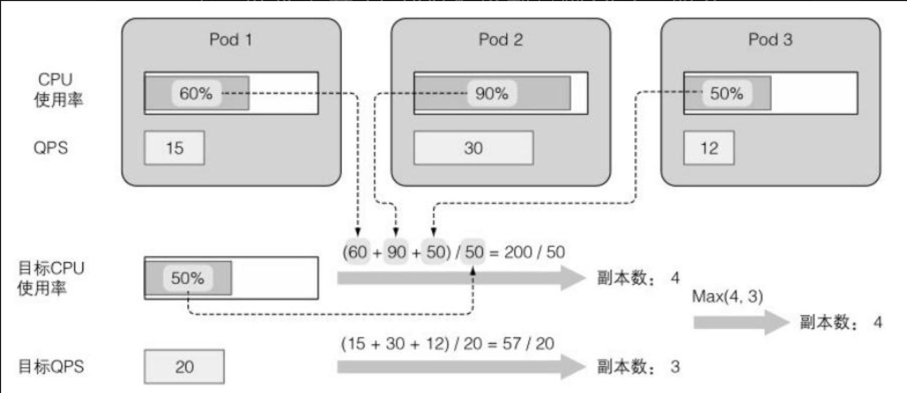
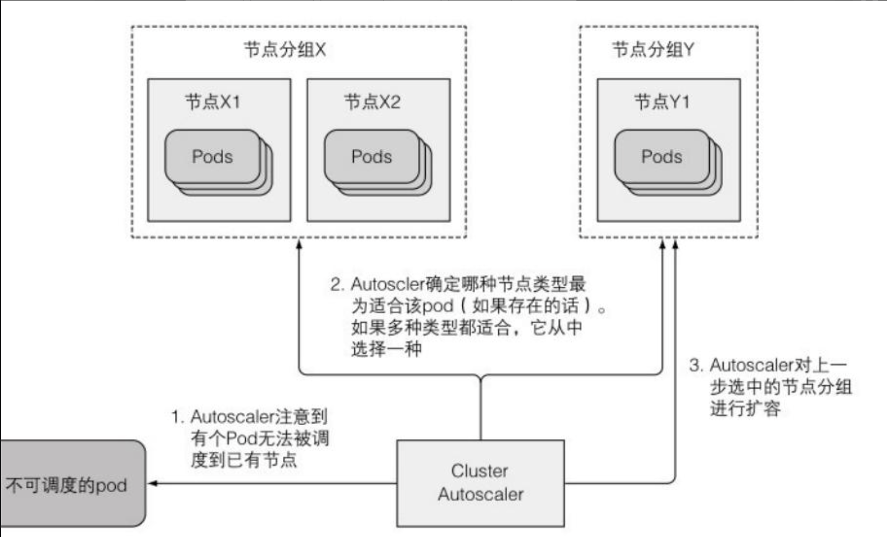
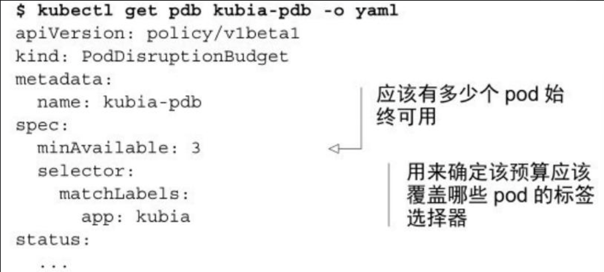
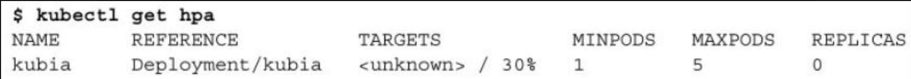

> 本章内容包括：
> - 基于CPU使用率配置pod的自动横向伸缩
> - 基于自定义度量配置pod的自动横向伸缩
> - 了解为何pod纵向伸缩暂时无法实现
> - 了解集群节点的自动横向伸缩

我们可以通过调⾼ReplicationController、ReplicaSet、Deployment等可伸缩资源的replicas 字段，来⼿动实现pod中应⽤的横向扩容。我们也可以通过增加pod容器的资源请求和限制来纵向扩容pod（尽管⽬前该操作只能在pod创建时，⽽⾮运⾏时进⾏）​。虽然如果你能预先知道负载何时会飙升，或者如果负载的变化是较长时间内逐渐发⽣的，⼿动扩容也是可以接受的，但指望靠⼈⼯⼲预来处理突发⽽不可预测的流量增长，仍然不够理想。

幸运的是，Kubernetes可以监控你的pod，并在检测到CPU使⽤率或其他度量增长时⾃动对它们扩容。如果Kubernetes运⾏在云端基础架构之上，它甚⾄能在现有节点⽆法承载更多pod之时⾃动新建更多节点。
# 1 pod的横向自动伸缩

横向pod⾃动伸缩是指由控制器管理的pod副本数量的⾃动伸缩。

它 由 Horizontal 控 制 器 执 ⾏ ， 我 们 通 过 创建 ⼀ 个HorizontalpodAutoscaler（HPA）资源来启⽤和配置Horizontal控制器。

该控制器周期性检查pod度量，计算满⾜HPA资源所配置的⽬标数值所需的副本数量，进⽽调整⽬标资源（如Deployment、ReplicaSet、ReplicationController、StatefulSet等）的replicas字段。
## 1.1 了解自动伸缩过程

自动伸缩的过程可以分为三个步骤：
- 获取被伸缩资源对象所管理的所有pod度量。
- 计算使度量数值达到(或接近)所指定目标数值所需的pod数量。
- 更新被伸缩资源的replicas字段。

**获取pod度量**

Autoscaler本⾝并不负责采集pod度量数据，⽽是从另外的来源获取。正如上⼀章提到的，pod与节点度量数据是由运⾏在每个节点的kubelet之上，名为cAdvisor的agent采集的；这些数据将由集群级的组件Heapster聚合。HPA控制器向Heapster发起REST调⽤来获取所有pod度量数据。

自动伸缩必须要获得集群pod的度量数据才能实现。

**关于Autoscaler采集度量数据方式的改变**

在Kubernetes 1.6版本之前，HPA直接从Heapster采集度量。在1.8版本中，如果⽤--horizontal-pod-autoscaler-use-rest-clients=true 参数启动ControllerManager,Autoscaler就能通过聚合版的资源度量API(metrics-server)拉取度量了。该⾏为从1.9版本开始将变为默认。

核⼼API服务器本⾝并不会向外界暴露度量数据。从1.7版本开始，Kubernetes允许注册多个API 服务器并使它们对外呈现为单个API 服务器。这允许Kubernetes通过这些底层API 服务器之⼀来对外暴露度量数据。

集群管理员负责选择集群中使⽤何种度量采集器。我们通常需要⼀层简单的转换组件将度量数据以正确的格式暴露在正确的API路径下。

**计算所需的pod数量**

⼀ 旦 Autoscaler 获 得 了 它 所 调 整 的 资 源 （Deployment 、ReplicaSet、 ReplicationController或StatefulSet）所管理pod的全部度量，它便可以利⽤这些度量计算出所需的副本数量。它需要计算出⼀个合适的副本数量，以使所有副本上度量的平均值尽量接近配置的⽬标值。该计算的输⼊是⼀组pod度量（每个pod可能有多个）​，输出则是⼀个整数（pod副本数量）​。

当Autoscaler配置为只考虑单个度量时，计算所需副本数很简单。只要将所有pod的度量求和后除以HPA资源上配置的⽬标值，再向上取整即可。实际的计算稍微复杂⼀些；Autoscaler还保证了度量数值不稳定、迅速抖动时不会导致系统抖动（thrash）​。

基于多个pod度量的⾃动伸缩（例如：CPU使⽤率和每秒查询率QPS​）的计算也并不复杂。Autoscaler单独计算每个度量的副本数，然后取最⼤值（例如：如果需要4个pod达到⽬标CPU使⽤率，以及需要3个pod来达到⽬标QPS，那么Autoscaler将扩展到4个pod）​。


**更新被伸缩资源的副本数**

⾃ 动 伸 缩 操 作 的 最 后 ⼀ 步 是 更 新 被 伸 缩资 源 对 象 （ ⽐ 如ReplicaSet）上的副本数字段，然后让ReplicaSet控制器负责启动更多 pod或者删除多余的pod。

Autoscaler控制器通过Scale⼦资源来修改被伸缩资源的 replicas 字段。这样Autoscaler不必了解它所管理资源的细节，⽽只需要通过Scale⼦资源暴露的界⾯，就可以完成它的⼯作了。

> **scale子资源是 Kubernetes API 中的一部分，专门用于管理资源的副本数量。它提供了一个统一的接口，使得不同类型的控制器（如 Deployment、ReplicaSet、StatefulSet）可以通过相同的方式进行扩展或缩减。**

这意味着只要API服务器为某个可伸缩资源暴露了Scale⼦资源，Autoscaler即可操作该资源。⽬前暴露了Scale⼦资源的资源有：DeploymentReplicaSetReplicationControllerStatefulSet⽬前也只有这些对象可以附着Autoscaler。

**了解整个自动伸缩过程**

从pod指向cAdvisor，再经过Heapster，⽽最终到达HPA的箭头代表度量数据的流向。值得注意的是，每个组件从其他组件拉取数据的动作是周期性的（即cAdvisor⽤⼀个⽆限循环从pod中采集数据；Heapster与HPA控制器亦是如此）​。这意味着度量数据的传播与相应动作的触发都需要相当⼀段时间，不是⽴即发⽣的。接下来实地观察Autoscaler⾏为时要注意这⼀点。

## 1.2 基于CPU使用率进行自动伸缩

假设你⽤⼏个pod来提供服务，如果它们的CPU使⽤率达到了100%，显然它们已经扛不住压⼒了，要么进⾏纵向扩容（scaleup）​，增加它们可⽤的CPU时间，要么进⾏横向扩 容（scale out）​，增加pod数量。

因为CPU使⽤通常是不稳定的，⽐较靠谱的做法是在CPU被压垮之前就横向扩容——可能平均负载达到或超过80%的时候就进⾏扩容。

你可能还记得，上⼀章中提到容器中的进程被保证能够使⽤该容器资源请求中所请求的CPU资源数。但在没有其他进程需要CPU时，进程就能使⽤节点上所有可⽤的CPU资源。如果有⼈说“这个pod⽤了80%的CPU”​，我们并不清楚对⽅的意思是80%的节点CPU，还是80%的guaranteed CPU（资源请求量）​，还是⽤资源限额给pod配置的硬上限的80%。

就Autoscaler⽽⾔，只有pod的保证CPU⽤量（CPU请求）才与确认 pod的CPU使⽤有关。Autoscaler对⽐pod的实际CPU使⽤与它的请求，这意味着你需要给被伸缩的pod设置CPU请求，不管是直接设置还是通过LimitRange对象间接设置，这样Autoscaler才能确定CPU使⽤率。

我们先创建一个deployment对象。
```yaml
apiVersion: extensions/v1beta1
kind: Deployment
metadata:
  name: kubia
spec:
  replicas: 3
  template:
    metadata:
      name: kubia
      labels:
        app: kubia
    spec:
      containers:
      - image: luksa/kubia:v1
        name: nodejs
        resources:
          requests:
            cpu: 100m
```

创建了Deployment之后，为了给它的pod启⽤横向⾃动伸缩，需要创 建 ⼀ 个HorizontalpodAutoscaler （ HPA ） 对 象 ， 并把 它 指 向 该 Deployment。可以给HPA准备YAML manifest，但有个办法更简单——还可以⽤ kubectl autoscale命令：
```bash
kubectl autoscale deployment kubia --cpu-percent=30 --min=1 --max=5

apiVersion: autoscaling/v2
kind: HorizontalPodAutoscaler
metadata:
  name: php-apache
spec:
  scaleTargetRef:
    apiVersion: apps/v1
    kind: Deployment
    name: kubia
  minReplicas: 1   # 不允许为0
  maxReplicas: 5
  metrics:
  - type: Resource
    resource:
      name: cpu
      target:
        type: Utilization     # 百分比，绝对值可以使用AverageValue
        averageUtilization: 50
```
这会帮你创建HPA对象，并将叫作kubia的Deployment设置为伸缩⽬标。你还设置了pod的⽬标CPU使⽤率为30%，指定了副本的最⼩和最⼤数量。Autoscaler会持续调整副本的数量以使CPU使⽤率接近30%，但它永远不会调整到少于1个或者多于5个。

cAdvisor获取CPU度量与Heapster收集这些度量都需要⼀阵⼦，之后Autoscaler才能采取⾏动。在这段时间⾥，如果⽤kubectl get显⽰HPA资源，TARGETS列就会显⽰<unknown\>：

因为在运⾏三个空⽆⼀请求的pod，它们的CPU使⽤率应该接近 0，应该预期Autoscaler将它们收缩到1个pod，因为即便只有⼀个pod,CPU使⽤率仍然会低于30%的⽬标值。

记住，Autoscaler只会在Deployment上调节预期的副本数量。接下来由Deployment控制器负责更新ReplicaSet对象上的副本数量，从⽽使ReplicaSet控制器删除多余的两个pod⽽留下⼀个。
> **另外，Autoscaler两次扩容操作之间的时间间隔也有限制。⽬前，只有当3分钟内没有任何伸缩操作时才会触发扩容，缩容操作频率更低——5分钟。**
> - **`--horizontal-pod-autoscaler-upscale-delay`**：控制扩容操作的时间间隔，默认值为 3 分钟。
> - **`--horizontal-pod-autoscaler-downscale-delay`**：控制缩容操作的时间间隔，默认值为 5 分钟。
> - **`--horizontal-pod-autoscaler-sync-period`**：控制 HPA 控制器的同步周期，默认值为 15 秒。
## 1.3 基于内存使用进行自动伸缩

基于内存的⾃动伸缩⽐基于CPU的困难很多。主要原因在于，扩容之后原有的pod需要有办法释放内存。这只能由应⽤完成，系统⽆法代劳。系统所能做的只有杀死并重启应⽤，希望它能⽐之前少占⽤⼀些内存；但如果应⽤使⽤了跟之前⼀样多的内存，Autoscaler就会扩容、扩容，再扩容，直到达到HPA资源上配置的最⼤pod数量。显然没有⼈想要这种⾏为。基于内存使⽤的⾃动伸缩在Kubernetes 1.8中得到⽀持，配置⽅法与基于CPU的⾃动伸缩完全相同。
```yaml
  metrics:
  - type: Resource
    resource:
      name: memory
      target:
        type: AverageValue
        averageValue: 500Mi
```
## 1.4 基于其他自定义度量进行自动伸缩

还有两种其他类型的度量指标，他们被认为是 **custom metrics**（自定义度量指标）： 即 Pod 度量指标和 Object 度量指标。 这些度量指标可能具有特定于集群的名称，并且需要更高级的集群监控设置。

第一种可选的度量指标类型是 **Pod 度量指标**。这些指标从某一方面描述了 Pod， 在不同 Pod 之间进行平均，并通过与一个目标值比对来确定副本的数量。 它们的工作方式与资源度量指标非常相像，只是它们**仅**支持 `target` 类型为 `AverageValue`。

pod度量指标
```yaml
type: Pods
pods:
  metric:
    name: packets-per-second
  target:
    type: AverageValue
    averageValue: 1k
```

第二种可选的度量指标类型是对象 **（Object）度量指标**。 这些度量指标用于描述在相同名字空间中的别的对象，而非 Pod。 请注意这些度量指标不一定来自某对象，它们仅用于描述这些对象。 对象度量指标支持的 `target` 类型包括 `Value` 和 `AverageValue`。 如果是 `Value` 类型，`target` 值将直接与 API 返回的度量指标比较， 而对于 `AverageValue` 类型，API 返回的度量值将按照 Pod 数量拆分， 然后再与 `target` 值比较。 下面的 YAML 文件展示了一个表示 `requests-per-second` 的度量指标。
```yaml
type: Object
object:
  metric:
    name: requests-per-second
  describedObject:
    apiVersion: networking.k8s.io/v1
    kind: Ingress
    name: main-route
  target:
    type: Value
    value: 2k
```
## 1.5 综合设置

如果你指定了多个上述类型的度量指标，HorizontalPodAutoscaler 将会依次考量各个指标。 HorizontalPodAutoscaler 将会计算每一个指标所提议的副本数量，然后最终选择一个最高值。

比如，如果你的监控系统能够提供网络流量数据，你可以通过 `kubectl edit` 命令将上述 Horizontal Pod Autoscaler 的定义更改为：
```yaml
apiVersion: autoscaling/v2
kind: HorizontalPodAutoscaler
metadata:
  name: php-apache
spec:
  scaleTargetRef:
    apiVersion: apps/v1
    kind: Deployment
    name: php-apache
  minReplicas: 1
  maxReplicas: 10
  metrics:
  - type: Resource
    resource:
      name: cpu
      target:
        type: Utilization
        averageUtilization: 50
  - type: Pods
    pods:
      metric:
        name: packets-per-second
      target:
        type: AverageValue
        averageValue: 1k
  - type: Object
    object:
      metric:
        name: requests-per-second
      describedObject:
        apiVersion: networking.k8s.io/v1
        kind: Ingress
        name: main-route
      target:
        type: Value
        value: 10k
status:
  observedGeneration: 1
  lastScaleTime: <some-time>
  currentReplicas: 1
  desiredReplicas: 1
  currentMetrics:
  - type: Resource
    resource:
      name: cpu
    current:
      averageUtilization: 0
      averageValue: 0
  - type: Object
    object:
      metric:
        name: requests-per-second
      describedObject:
        apiVersion: networking.k8s.io/v1
        kind: Ingress
        name: main-route
      current:
        value: 10k
```
这样，你的 HorizontalPodAutoscaler 将会尝试确保每个 Pod 的 CPU 利用率在 50% 以内， 每秒能够服务 1000 个数据包请求， 并确保所有在 Ingress 后的 Pod 每秒能够服务的请求总数达到 10000 个。
## 1.6 确认哪些度量适合用于自动伸缩

你要明⽩，不是所有度量都适合作为⾃动伸缩的基础。正如之前提到的，pod中容器的内存占⽤并不是⾃动伸缩的⼀个好度量。如果增加副本数不能导致被观测度量平均值的线性（或者⾄少接近线性）下降，那么autoscaler就不能正常⼯作。

⽐⽅说，如果你只有⼀个pod实例，度量数值为X，这时autoscaler扩容到了2个副本，度量数值就需要落在接近X/2的位置。每秒查询次数（QPS）就是这么⼀种⾃定义度量，对web应⽤⽽⾔即为应⽤每秒接收的请求数。增⼤副本数总会导致QPS成⽐例下降，因为同样多的请求数现在被更多数量的pod处理了。

在你决定基于应⽤⾃有的⾃定义度量来伸缩它之前，⼀定要思考 pod数量增加或减少时，它的值会如何变化。
# 2 pod的纵向自动缩容

Pod 纵向自动扩容（Vertical Pod Autoscaling，VPA）是 Kubernetes 中的一种机制，用于根据实际的资源使用情况（如 CPU 和内存）自动调整 Pod 的资源请求和限制。与 Horizontal Pod Autoscaler (HPA) 不同，HPA 是通过增加或减少 Pod 的副本数量来应对负载变化，而 VPA 是通过调整单个 Pod 的资源请求和限制来优化资源利用。

要为正在运行的 Pod 更改资源分配量，需要启用 `InPlacePodVerticalScaling` 特性门控。 并让工作负载控制器创建一个具有不同资源需求的新 Pod。

在 Kubernetes API Server 的启动参数中添加 `--feature-gates` 参数及在每个节点的 Kubelet 配置中添加 `--feature-gates` 参数：：
```bash
kube-apiserver --feature-gates=InPlacePodVerticalScaling=true
kubelet --feature-gates=InPlacePodVerticalScaling=true
```

对于原地调整 Pod 资源而言：
- 针对 CPU 和内存资源的容器的 `requests` 和 `limits` 是**可变更的**。
- Pod 状态中 `containerStatuses` 的 `allocatedResources` 字段反映了分配给 Pod 容器的资源。
- Pod 状态中 `containerStatuses` 的 `resources` 字段反映了如同容器运行时所报告的、针对正运行的容器配置的实际资源 `requests` 和 `limits`。
- Pod 状态中 `resize` 字段显示上次请求待处理的调整状态。此字段可以具有以下值：
    - `Proposed`：此值表示请求调整已被确认，并且请求已被验证和记录。
    - `InProgress`：此值表示节点已接受调整请求，并正在将其应用于 Pod 的容器。
    - `Deferred`：此值意味着在此时无法批准请求的调整，节点将继续重试。 当其他 Pod 退出并释放节点资源时，调整可能会被真正实施。
    - `Infeasible`：此值是一种信号，表示节点无法承接所请求的调整值。 如果所请求的调整超过节点可分配给 Pod 的最大资源，则可能会发生这种情况。
## 2.1 容器调整策略

调整策略允许更精细地控制 Pod 中的容器如何针对 CPU 和内存资源进行调整。 例如，容器的应用程序可以处理 CPU 资源的调整而不必重启， 但是调整内存可能需要应用程序重启，因此容器也必须重启。

为了实现这一点，容器规约允许用户指定 `resizePolicy`。 针对调整 CPU 和内存可以设置以下重启策略：

- `NotRequired`：在运行时调整容器的资源。
- `RestartContainer`：重启容器并在重启后应用新资源。

如果未指定 `resizePolicy[*].restartPolicy`，则默认为 `NotRequired`。
> **如果 Pod 的 `restartPolicy` 为 `Never`，则 Pod 中所有容器的调整重启策略必须被设置为 `NotRequired`。**

下面的示例显示了一个 Pod，其中 CPU 可以在不重启容器的情况下进行调整，但是内存调整需要重启容器。
```yaml
apiVersion: v1
kind: Pod
metadata:
  name: qos-demo-5
  namespace: qos-example
spec:
  containers:
    - name: qos-demo-ctr-5
      image: nginx
      resizePolicy:
        - resourceName: cpu
          restartPolicy: NotRequired
        - resourceName: memory
          restartPolicy: RestartContainer
      resources:
        limits:
          memory: "200Mi"
          cpu: "700m"
        requests:
          memory: "200Mi"
          cpu: "700m"
```


# 3 集群节点的横向伸缩

HPA在需要的时候会创建更多的pod实例。但万⼀所有的节点都满了，放不下更多pod了，怎么办？显然这个问题并不局限于Autoscaler创建新pod实例的场景。即便是⼿动创建pod，也可能碰到因为资源被已有pod使⽤殆尽，以⾄于没有节点能接收新pod的情况。

在这种情况下，你需要删除⼀些已有的pod，或者纵向缩容它们，抑或向集群中添加更多节点。如果你的Kubernetes集群运⾏在⾃建（on premise）基础架构上，你得添加⼀台物理机，并将其加⼊集群。但如果你的集群运⾏于云端基础架构之上，添加新的节点通常就是点击⼏下⿏标，或者向云端做API调⽤。这可以⾃动化的，对吧？Kubernetes⽀持在需要时⽴即⾃动从云服务提供者请求更多节点。该特性由Cluster Autoscaler执⾏。
## 3.1 Cluster Autoscaler介绍

Cluster Autoscaler负责在由于节点资源不⾜，⽽⽆法调度某pod到已有节点时，⾃动部署新节点。它也会在节点长时间使⽤率低下的情况下下线节点。

**从云端基础架构请求新节点**

如果在⼀个pod被创建之后，Scheduler⽆法将其调度到任何⼀个已有节点，⼀个新节点就会被创建。Cluster Autoscaler会注意此类pod，并请求云服务提供者启动⼀个新节点。但在这么做之前，它会检查新节点有没有可能容纳这个（些）pod，毕竟如果新节点本来就不可能容纳它们，就没必要启动这么⼀个节点了。

云服务提供者通常把相同规格（或者有相同特性）的节点聚合成组。因此Cluster Autoscaler不能单纯地说“给我多⼀个节点”​，它还需要指明节点类型。

Cluster Autoscaler通过检查可⽤的节点分组来确定是否有⾄少⼀种节点类型能容纳未被调度的od。如果只存在唯⼀⼀个此种节点分组，ClusterAutoscaler就可以增加节点分组的⼤⼩，让云服务提供商给分组中增加⼀个节点。但如果存在多个满⾜条件的节点分组，ClusterAutoscaler就必须挑⼀个最合适的。这⾥“最合适”的精确含义显然必须是可配置的。在最坏的情况下，它会随机挑选⼀个。

新节点启动后，其上运⾏的Kubelet会联系API服务器，创建⼀个 Node资源以注册该节点。从这⼀刻起，该节点即成为Kubernetes集群的⼀部分，可以调度pod于其上了。


当节点利⽤率不⾜时，Cluster Autoscaler也需要能够减少节点的数⽬。Cluster Autoscaler通过监控所有节点上请求的CPU与内存来实现这⼀点。如果某个节点上所有pod请求的CPU、内存都不到50%，该节点即被认定为不再需要。

这并不是决定是否要归还某⼀节点的唯⼀因素。Cluster Autoscaler也会检查是否有系统pod（仅仅）运⾏在该节点上（这并不包括每个节点上都运⾏的服务，⽐如DaemonSet所部署的服务）​。如果节点上有系统pod在运⾏，该节点就不会被归还。对⾮托管pod，以及有本地存储的pod也是如此，否则就会造成这些pod提供的服务中断。换句话说，只有当Cluster Autoscaler知道节点上运⾏的pod能够重新调度到其他节点，该节点才会被归还。

当⼀个节点被选中下线，它⾸先会被标记为不可调度，随后运⾏其上的pod将被疏散⾄其他节点。因为所有这些pod都属于ReplicaSet或者其他控制器，它们的替代pod会被创建并调度到其他剩下的节点（这就是为何正被下线的节点要先标记为不可调度的原因）​。
- **`kubectl cordon <node>`**：将节点标记为不可调度，但不对现有 Pod 做任何处理。
- **`kubectl drain <node>`**：将节点标记为不可调度，并疏散节点上的所有 Pod。
- **`kubectl uncordon <node>`**：解除节点的不可调度状态，使其重新变为可调度。
## 3.2 限制集群缩容时的服务干扰

如果⼀个节点发⽣⾮预期故障，你不可能阻⽌其上的pod变为不可⽤；但如果⼀个节点被ClusterAutoscaler或者⼈类操作员主动下线，可以⽤⼀个新特性来确保下线操作不会⼲扰到这个节点上pod所提供的服务。

⼀些服务要求⾄少保持⼀定数量的pod持续运⾏，对基于quorum的集群应⽤⽽⾔尤其如此。为此，Kubernetes可以指定下线等操作时需要保持的最少pod数量，我们通过创建⼀个podDisruptionBudget资源的⽅式来利⽤这⼀特性。

尽管这个资源的名称听起来挺复杂的，实际上它是最简单的Kubernetes资源之⼀。它只包含⼀个pod标签选择器和⼀个数字，指定最少需要维持运⾏的pod数量，从Kubernetes 1.7开始，还有最⼤可以接收的不可⽤pod数量。

也可以⽤⼀个百分⽐⽽⾮绝对数值来写minAvailable字段。⽐⽅说，可以指定60%带app=kubia标签的pod应当时刻保持运⾏。

