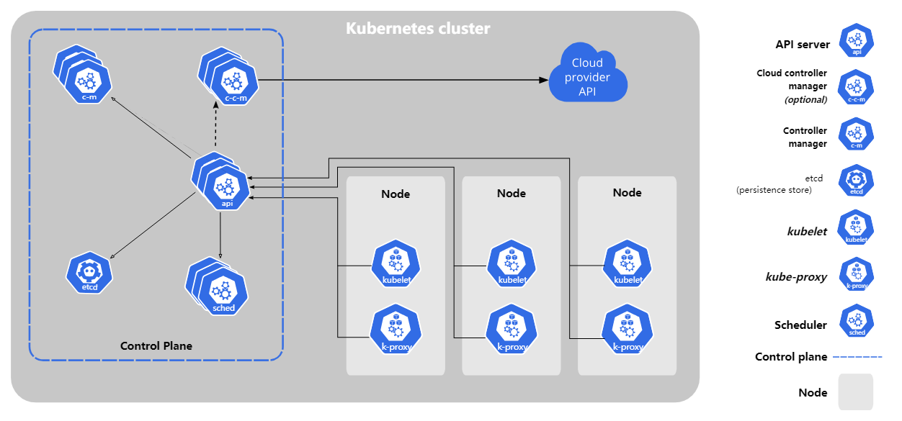
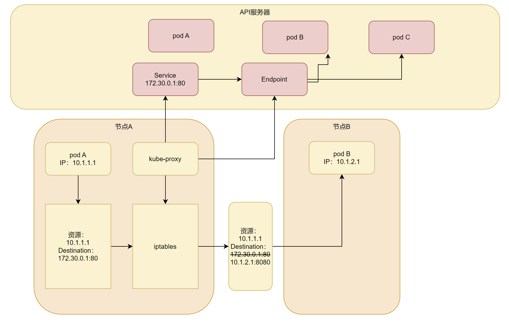
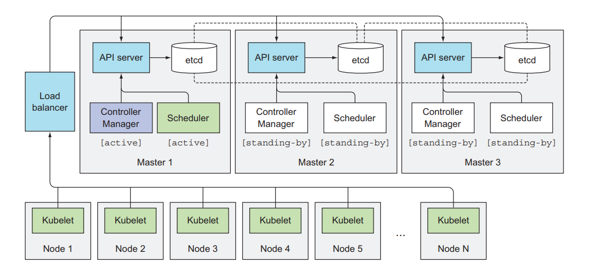

# 第十章：了解Kubernetes机制

> 本章内容包括：
>
> * Kubernetes集群包含哪些组件
> * 每个组件的作用以及它们是如何工作的
> * 运行的pod是如何创建一个部署对象的
> * 运行的pod是什么
> * pod之间的网络如何工作
> * Kubernetes服务如何工作
> * 如何保证高可用性

## 1 了解架构

Kubernetes集群分为两部分：

* Kubernetes控制平面
* 工作节点

**控制平面组件**

控制平面负责控制并使得整个集群正常运行。包含以下几个组件：

* etcd分布式持久化存储
* API服务器
* 调度器
* 控制器管理器\
  这些组件用来存储、管理集群状态，但它们不是运行应用的容器。

**工作节点组件**

运行容器的任务都依赖于每个工作节点上运行的组件

* kubelet
* kube-proxy
* 容器运行时

**附加组件**

除了控制平面(和运行在节点上的组件，还要有几个附加组件)，包含：

* Kubernetes DNS服务器
* Ingress控制器
* metrics-server(容器集群监控)
* 集群层面日志
* 容器网络接口插件

### 1.1 kubernetes组件的分布式特性

下图展示了kubernetes各个组件及它们之间的依赖关系。

若要启用kubernetes提供的所有特性，需要运行所有的这些组件。

> API服务器对外暴露了一个名为`componentstatuses`的API资源，用来显示控制平面组件的健康状态。但已经在1.19版本之上弃用。\
> $ kubectl get componentstatuses\
> Warning: v1 ComponentStatus is deprecated in v1.19+\
> NAME STATUS MESSAGE ERROR\
> etcd-0 Healthy {"health":"true"}\
> scheduler Healthy ok\
> controller-manager Healthy ok

**组件间如何通信**

kubernetes系统组件之间只能通过API服务器通信，它们之间不会直接通信。API服务器是和etcd通信的唯一组件。其他组件不会直接和etcd通信，而是通过API服务器来修改集群状态。

API服务器和其他组件的连接基本上都是由组件发起的，但是，但你使用`kubectl`获取日志、使用`kubectl attach`连接到一个运行中的容器或运行`kubectl port-forward`命令时，API服务器会向kubelet发起连接。

> `kubectl attach`命令和`kubectl exec`命令类似，区别是：前者会附属到容器中运行着的主进程上，而后者是重新运行一个进程。

**单组件运行多实例**

尽管工作节点上的组件都需要运行在同一节点上，控制平面上的组件可以被简单的分割在多台服务器上，为了保证高可用性，控制平面的每个组件可以有多个实例。etcd和API服务器的多个实例可以同时并行工作，但是调度器和控制器管理器在给定的时间内只能有一个实例起作用。

**组件是如何运行的**

控制平面的组件以及kube-proxy可以直接部署在系统上或者作为pod来运行。

kubelet是唯一一个作为常规系统组件来运行的组件，它把其他组件作为pod来运行。为了将控制平面作为pod来运行，kubelet被部署在master上。可以查看一下

```yaml
root:~$ kubectl get po -o custom-columns=POD:metadata.name,NODE:spec:nodeName --sort-by spec.nodeName -n kube-system
POD                                       NODE
ip-masq-agent-g5dtt                       <none>
kube-controller-manager                   <none>
bk-log-collector-cjrk8                    <none>
audit-prepare                             <none>
kube-apiserver                            <none>
```

上面展示了一些控制平面的组件都在主节点上作为pod运行。

> 可以使用custom-columns选择展示的列并使用`--sort-by`最资源列表进行排序。

### 1.2 kubernetes如何使用etcd

前面我们创建的所有对象---pod、ReplicaSet、服务和私密凭证等，需要以持久化的方式存储到某个地方，这样它们的manifest在API服务器重启和失败的时候才不会丢失。为此，kubernetes使用了etcd。etcd是一个响应快/分布式/一致的key-value存储。因为它是分布式的，所以可以运行多个etcd实例来获取高可用性和更好的性能。

唯一能和etcd通信的是API服务器。所有其他组件通过API服务器间接地读取、写入数据到etcd。这带来一些好处，其中之一就是增强乐观锁系统、验证系统的健壮性；并且，通过把实际存储机制从其他组件抽离，未来替换起来也更容易。值得强调的是，etcd是kubernetes存储集群状态和元数据的唯一地方。

> **关于乐观锁并发控制**
>
> * 乐观锁并发控制(有时候指乐观锁)是指一段数据包含一个数字版本，而不是锁住该段数据并阻止读写操作。每当更新数据，版本数就会增加。当更新数据时，就会检查版本值是否在客户端读取数据时间和提交时间之内被增加过。如果增加过，那么更新会被拒绝，客户端必须重新读取新数据，重新尝试更新。
> * 两个客户端尝试更新同一个数据条目，只有一个会成功。
> * 所有的kubernetes包含一个metadata.resourceVersion字段，当更新对象时，客户端需要返回该值到API服务器。如果版本值与etcd中存储的不匹配，API服务器会拒绝该更新。可以使用`kubectl get po/poname -o json`查看对应的resourceVersion值。

**资源如何存储在etcd中**

目前kubernetes通常使用etcd版本3，性能更好。etcd v2把key存储在一个层级键空间中，这使得键值对类似于文件系统的文件。etcd v3不支持目录，但是由于key格式保持不变(键可以包含斜杆)，仍然可以认为它们被组织为目录。kubernetes存储所有数据到etcd的/registry下。可以使用`kubectl get /registry --prifix=true`列出etcd中存储的键值。

API服务器将资源的完整JSON形式存储到etcd中。由于etcd v3类似于层级键空间的形式，可以想象为把资源以JSON文件形式存储到文件系统中。

> kubernetes 1.7之前的版本，密钥凭据的JSON内容也像上面一样存储(没有加密)。如果有人直接有权限访问到etcd，那么可以获取所有的密钥凭据。从1.7版本开始，密钥会被加密，这样存储起来更加安全。

**确保存储对象的一致性和可验证性**

kubernetes要求所有控制平面组件只能通过API服务器操作存储模块。使用这种方法更新集群状态总是一致的，为API服务器实现了乐观锁机制，如果有错误的话，也会更少。API服务器同时确保写入存储的数据总是有效的，只有授权的客户端才能更改数据。

**确保etcd集群一致性**

为保证高可用性，常常会运行多个etd实例。多个etcd实例需要保持一致。这种分布式系统需要对系统的实际状态达成一致。etcd使用RAFT一致性算法来保证这一点。确保在任何时间点，每个节点的状态要么是大部分节点的状态，要么是之前确认过的状态。

连接到etcd集群不同节点的客户端，得到的要么是当前的实际状态，要么是之前的状态(kubernetes中，etcd的唯一客户端是API服务器，单有可能有多个实例)。

一致性算法要求集群大部分(注定数量)节点参与才能进行到下一个状态。结果就是，如果集群分裂为两个不互联的节点组，两个组的状态可能不一致，因为要从之前状态变化到新状态，需要有过半节点参与状态变更。如果一个组包含了大部分节点，那么另一组只有少量节点成员。第一组就可以更改集群状态，后者则不可以。当两个组重新恢复连接，第二组的节点会更新为第一组的节点状态。

**etcd的一致性**

一致性通常指的是系统在处理读写操作时遵循某些规则，以确保数据的正确性和可靠性。在分布式系统中，有多种一致性模型，每种模型对一致性的定义和保证程度不同。以下是几种常见的一致性模型：

* **强一致性（Strong Consistency）**：
  * 任何读操作都能读取到最新的写操作结果。
* **线性一致性（Linearizability）**：
  * 线性一致性是强一致性的一种形式，保证所有操作按顺序执行，且每个操作看起来都是瞬时完成的。
  * etcd 使用 Raft 共识算法来实现线性一致性，确保所有写操作按顺序应用，并且读操作能够读取到最新的写操作结果。
* **最终一致性（Eventual Consistency）**：
  * 最终一致性保证在没有新的更新操作的情况下，所有副本最终会收敛到相同的状态。
  * 最终一致性通常用于弱一致性系统，如一些 NoSQL 数据库。
* **因果一致性（Causal Consistency）**：
  * 因果一致性保证因果相关的操作按顺序执行，但不保证所有操作的全局顺序。
  * 这种一致性模型在某些分布式系统中使用，但不适用于 etcd 这种需要强一致性的系统。

在etcd中使用RAFT一致性算法来实现强一致性和线性一致性。以下是 etcd 如何保证一致性的具体机制：

1. **领导者选举**：
   * 在 Raft 集群中，只有领导者节点可以处理写操作。领导者节点将写请求转换为日志条目，并将其复制到所有追随者节点。
   * 追随者节点在接收到日志条目后，将其持久化并发送确认消息给领导者。
2. **日志复制**：
   * 领导者节点将写请求转换为日志条目，并将其复制到大多数节点（包括自己）。
   * 当大多数节点确认接收到日志条目后，领导者节点将该条目标记为已提交，并将其应用到状态机中。
3. **线性一致性读**：
   * 线性一致性读操作通过领导者节点进行，确保读取到的是最新提交的数据。
   * 领导者节点在处理读请求时，会确保所有之前的写请求都已提交并应用。
   * 在某些场景下，可以通过配置和优化，将部分读操作分配给追随者节点，从而提高系统的读性能。
4. **快照和日志压缩**：
   * 为了防止日志无限增长，etcd 定期将当前状态机的状态保存为快照，并删除旧的日志条目。
   * 快照和日志压缩机制确保了数据的一致性和存储空间的高效利用。

**为什么etcd实例数量应该是奇数**

etcd通常部署奇数个实例。这是因为etcd的选举机制遵循半数原则，如有两个实例时，要求两个实例都要在线，否则不能达到超过半数的要求，etcd集群状态不能转换到新状态。

* **故障容忍度**：奇数节点的配置可以最大化系统的故障容忍度。例如：
  * 3 节点集群可以容忍 1 个节点故障。这是最常见的配置，适用于大多数中小型系统。它在可靠性和资源消耗之间提供了良好的平衡。
  * 5 节点集群可以容忍 2 个节点故障。适用于需要更高可靠性的大型系统。它可以容忍更多的节点故障，但也会消耗更多的资源。
  * 7 节点集群可以容忍 3 个节点故障。适用于超大型系统，进一步提高了可靠性和容错能力，但资源消耗和管理复杂度也会显著增加。

虽然奇数节点配置可以最大限度地减少平票的可能性，但在某些极端情况下（例如网络分区），仍可能出现平票。Raft 算法通过随机化选举超时时间来减少平票的发生概率。每个节点在选举超时后会随机等待一段时间，然后发起选举请求，这样可以避免多个节点同时发起选举请求导致平票。可以配置相关参数进一步优化：

* 选举超时：调整选举超时参数（`election-timeout`）以适应网络延迟和节点性能。默认值通常是 1000 毫秒，可以根据需要进行调整。
* 心跳间隔：调整心跳间隔参数（`heartbeat-interval`）以确保领导者节点能够及时检测到追随者节点的状态。默认值通常是 100 毫秒。

### 1.3 API服务器做了什么

kubernetes API服务器作为中心组件，其他组件或客户端都会去调用它。以RESTful API的形式提供了可查询、修改集群状态的CRUD接口。它将状态存储到etcd中。

在 Kubernetes 中，API Server 是集群的核心组件，负责处理所有的 API 请求，并与 etcd 进行交互以存储和检索集群状态。API Server 通过缓存机制来减少对 etcd 的直接访问，从而提高性能和减少延迟。然而，如果请求的数据量过大、请求过于频繁，或者某些请求绕过了缓存直接访问 etcd，可能导致性能问题和延迟增加。

API服务器除了提供一种一致的方式将对象存储到etcd中，也对这些对象做校验，这样客户端就无法存入非法的对象了(直接入邪存储的话是有可能的)。除了校验，还会处理乐观锁，这样对于并发更新的情况，对对象的修改就不会被其他客户端覆盖。

当kubectl以yaml形式的manifest创建一个资源时，API请求过程如下图所示

**通过认证插件认证客户端**

首先，API服务器需要认证发送请求的客户端。这是通过配置在API服务器上的一个或多个认证插件来实现的。API服务器会轮流调用这些插件，直到有一个能确认是谁发送了该请求。这是通过检查HTTPS请求实现的。

根据认证方式，用户信息可以从客户端证书获取。插件抽取客户端的用户名、用户ID和归属组。这些数据在下一阶段，授权的时候会用到。

**通过授权插件授权客户端**

除了认证插件，API服务器还可以配置使用一个或多个授权插件。它们的作用是决定认证的用户是否可以对请求资源执行请求操作。例如，当创建pod时，API服务器会轮询所有的授权插件，来确认该用户是否可以在请求命名空间插件pod。一旦插件确认了用户可以执行该操作，API服务器会继续下一步操作。

**通过准入控制插件验证AND/OR修改资源请求**

如果请求尝试创建、修改或者删除一个资源，请求需要经过准入控制插件的验证。同理，服务器会配置多个准入插件。这些插件会因为各种原因修改资源，可能会初始化资源定义中漏配的字段为默认值甚至重写它们。插件会修改并不在请求中的相关资源，同时也会因为某些原因拒绝一个请求。资源需要经过所有准入插件的验证。

> 如果插件只是尝试读取数据，则不会做准入控制的验证。

准入插件包括：

* AlwaysPullImages：重写pod的imagePullPolicy为Always，强制每次部署pod时拉取镜像。
* ServiceAccount：未明确定义服务账户时使用默认账户。
* NamespaceLifecycle：防止在命名空间中创建正在被删除的pod，或在不存在的命名空间中创建pod。
* ResourceQuota：保证特定命名空间中的pod只能使用该命名空间分配数量的资源，如CPU和内存。\
  更详细的准入插件信息可以在官方文档中查看[准入控制器](https://kubernetes.io/zh-cn/docs/reference/access-authn-authz/admission-controllers/)。

**验证资源以及持久化存储**

请求通过了所有的准入控制器后，API服务器会验证存储到etcd的对象，任何返回一个响应给客户端。

1. 验证对象的完整性和一致性\
   API 服务器会对对象进行一系列的验证，以确保其完整性和一致性。这包括但不限于：

* **字段验证**：检查对象的必需字段是否存在，字段值是否符合预期的格式和范围。
* **引用验证**：验证对象中引用的其他资源是否存在，例如 Pod 中引用的 ConfigMap 或 Secret。
* **策略验证**：根据集群策略（如 Pod 安全策略）验证对象是否符合安全要求。

2. 版本控制和并发处理\
   Kubernetes 使用 `resourceVersion` 字段来实现乐观并发控制。`resourceVersion` 是一个表示资源版本的字符串，每次资源更新时都会改变。API 服务器会使用 `resourceVersion` 来确保并发请求的正确性：

* **读取操作**：当客户端读取资源时，`resourceVersion` 表示资源的当前版本。
* **写入操作**：当客户端更新资源时，可以指定 `resourceVersion`，API 服务器会检查该版本是否与当前版本匹配，以防止并发更新导致的数据冲突。

3. 存储到 etcd\
   在通过所有验证后，API 服务器会将对象存储到 etcd 中。etcd 是一个分布式键值存储系统，负责持久化 Kubernetes 的所有状态数据。
4. 返回响应给客户端\
   在对象成功存储到 etcd 后，API 服务器会生成一个响应并返回给客户端。响应中通常包含以下信息：

* **对象的最新状态**：包括所有字段和最新的 `resourceVersion`。
* **HTTP 状态码**：表示操作的结果，例如 200 OK、201 Created 等。
* **元数据**：如 `metadata` 字段中的 `uid`、`creationTimestamp` 等。

### 1.4 API服务器如何通知客户端资源变更

除了前面讨论的，API服务器没有做其他额外的工作。例如，当你插件一个replicaset资源时，它不会去创建pod，同时它不会去管理服务的端点，那是控制器管理器的工作。

API服务器甚至也没有告诉这些控制器去做什么。它做的时，启动这些控制器，以及其他一些组件来监控已部署资源的变更。控制平面可以请求订阅资源被创建、修改或删除的通知。这使得组件可以在集群元数据变化时执行任何需要做的任务。

客户端通过创建到API服务器的HTTPS连接来监听变更。通过此连接，客户端会接收到监听对象的一系列变更通知。每当更新对象时，服务器把新版本对象发送至所有监听该对象的客户端。

kubectl工具作为API服务器的客户端之一，也支持监听资源。例如，当部署pod时，不需要重复执行`kubectl get po`来定期查询pod列表。可以使用`--watch`标志，每当创建、修改、删除pod时都会通知你。

### 1.5 了解调度器

前面已经学习过，我们通常不会指定pod应该运行在哪个集群节点上，这项工作交给调度器。宏观来看，调度器的操作比较简单，就是利用API服务器的监听机制等待新创建的pod，给每个新的、没有节点集的pod分配节点。

调度器不会命令选中的节点(或者节点上运行的kubelet)去运行pod。调度器做的就是通过API服务器更新pod的定义。任何API服务器再去通知kubelet(同样是使用之前介绍的监听机制)该pod已经被调度过。当目标节点上的kubelet发现给pod被调度到本节点，它就会创建并且运行pod的容器。

尽管宏观上看调度的过程确实比较简单，但实际上为pod选择最佳节点的任务并不简单。当然，最简单的调度方式是不关心节点上已经运行的pod，随机选择一个节点。另一方面，调度器可以利用高级技术，例如机器学习，来预测接下来的几分钟或几个小时哪种类型的pod将被调度，然后以最大的硬件利用率、无需重新调度已运行pod的方式来调度。kubernetes的默认调度器实现方式处于最简单和最复杂程度之间。

**默认调度算法**

选择节点可以分解为两部分：

* 过滤所有节点，找出能分配给pod的可用节点列表
* 对可用节点按优先级排序，找出最优节点。如果多个节点都有最高的优先级分数，那么则循环分配，确保平均分给pod。

**查找可用节点**

为了决定哪些节点对pod可用，调度器会给每个节点下发一组配置好的**预测函数**。这些函数检查：

* 节点是否能满足pod对硬件资源的请求。
* 节点是否耗尽资源(是否报告过内存/硬盘压力参数)。
* pod是否要求被调度到指定节点(通过名字)。
* 节点是否有和pod规格定义里的节点选择器一致的标签。
* 如果pod要求绑定指定的主机端口，那么这个节点上的这个端口是否已经被占用。
* 如果pod要求有特定类型的卷，该节点是否能为此pod加载此卷，或者说该节点上是否已经有pod在使用该卷了。
* pod能否容忍节点的污点。
* pod是否定义了节点、pod的亲缘性以及非亲缘性规则。\
  所有这些测试都必须通过，节点才有资格调度给pod。在对每个节点做这些检查后，调度器得到节点集的一个子集。任何这些节点都可以运行pod，因为它们都有足够可用的资源，也确认过满足pod定义的所有要求。

**为pod选择最佳节点**

尽管这些节点都能运行pod，其中一些可能还是优于另一些。假设有一个2节点集群，两个节点都可用，但是其中一个运行10pod，而另一个没有运行pod，明显调度器应该选择第二个节点。

在预选阶段筛选出符合要求的节点后，调度器会对这些节点进行打分，以选择最佳的节点。打分阶段的常见评分标准包括：

* **资源利用率**：优先选择资源利用率较低的节点，以实现负载均衡。
* **节点亲和性**：根据 Pod 的节点亲和性规则对节点进行打分。
* **Pod 亲和性**：根据 Pod 的亲和性规则对节点进行打分。
* **数据局部性**：优先选择与数据存储位置接近的节点，以减少数据传输延迟。
* **自定义调度策略**：用户可以通过自定义调度策略插件（Scheduler Extender）来实现特定的调度逻辑。\
  在优选阶段选择出最佳节点后，调度器会将 Pod 绑定到该节点。绑定操作会更新 Pod 的 `spec.nodeName` 字段，指示该 Pod 应该运行在哪个节点上。

**pod高级调度**

当一个pod有多个副本的时候，理想情况下，会期望副本能够分散在尽可能多的节点上，而不是全部分配到同一个节点上。该节点的宕机会导致pod支持的服务不可用。但是如果pod分散在不同的节点上，单个节点宕机并不会对服务造成什么影响。

默认情况下，归属于同一服务和replicaset的pod会分散在多个节点上。但不保证每次都是这样。不过可通过定义pod的亲缘性、非亲缘性规则强制pod分散在集群内或者集中在一起。后面会介绍。

调度器依赖于大量的因子，因此调度器既可以配置成满足特定的需要或者基础设施特性，也可以整体替换为一个定制的实现。可以抛开调度器运行一个kubernetes，那样的话就需要自己手动实现调度了。

Kubernetes 调度器支持插件机制，允许用户自定义调度逻辑。常见的调度器插件包括：

* **Filter Plugins**：用于预选阶段的过滤条件。
* **Score Plugins**：用于优选阶段的打分标准。
* **Bind Plugins**：用于绑定阶段的自定义绑定逻辑。

**使用多个调度器**

可以在集群中运行多个调度器而非单个。然后对每一个pod，可以通过在pod特性中设置`schedulerName`属性指定调度器来调度特定的pod。也可以使用自己实现的调度器。

未设置该属性的pod由默认调度器调度，因此其`schedulerName`被设置为`default-scheduler`。其他设置了该属性的pod会被默认调度器忽略掉。

### 1.6 控制器管理器

API服务器只做了存储资源到etcd和通知客户端有变更的工作。调度器则只是给pod分配节点，所以需要有活跃的组件确保系统真实状态朝API服务器定义的期望状态收敛。这个工作由控制器管理器里的控制器实现。

单个控制器、管理器进程当前组合了多个执行不同非冲突任务的控制器。这些控制器最终会被分解到不同的进程，如果需要的话，我们能够用自定义实现替换它们每一个。控制器包括：

* Replication管理器(ReplicationController资源的管理器)。
* ReplicaSet、DaemonSet以及Job控制器。
* Deployment控制器。
* StatefulSet控制器。
* Node控制器。
* Service控制器。
* Endpoints控制器。
* Namespace控制器。
* PersistentVolume控制器。
* 其他。\
  每个控制器做什么通过名字显而易见。通过上述列表，几乎可以知道创建每个资源对应的控制器是什么。资源描述了集群中应该运行什么，而控制器就是活跃的kubernetes组件，去做具体的工作部署资源。

**了解控制器做了什么以及如何做**

控制器做了许多不同的事情，但是它们都通过API服务器监听资源(部署、服务等)变更，并且不论是创建新对象还是更新、删除已有对象，都对变更执行相应操作。大多数情况下，这些操作涵盖了新建其他资源或更新监听的资源本身(例如，更新对象的status)。

总的来说，控制器执行一个"调和"循环，将实际状态调整为期望状态(在资源spec定义)，然后将新的实际状态写入资源的status部分。控制器利用监听机制来订阅变更，但是由于使用监听机制并不保证控制器不会漏掉时间，所以仍然需要定期执行重列举操作来确保不会丢失掉什么。

Kubernetes 控制器通常使用监听机制来监控资源的变化。监听机制允许控制器实时接收资源的增删改事件，从而快速响应集群状态的变化。监听机制的工作流程如下：

1. **启动监听**：控制器向 API 服务器发送一个 Watch 请求，订阅特定资源的变化。
2. **接收事件**：API 服务器将资源的增删改事件发送给控制器。
3. **处理事件**：控制器根据接收到的事件更新其内部状态，并执行相应的操作。

尽管监听机制可以实时监控资源的变化，但它并不能保证不会漏掉事件。

* **网络问题**：网络中断可能导致控制器无法接收到事件。
* **API 服务器重启**：API 服务器重启可能导致事件丢失。
* **控制器重启**：控制器自身重启可能导致事件丢失。

为了确保不会丢失任何重要的状态变化，控制器需要定期执行重列举操作。重列举操作会重新获取所有资源的当前状态，并与控制器的内部状态进行对比，以确保一致性。重列举操作的工作流程如下：

1. **定期触发**：控制器按照预定的时间间隔触发重列举操作。
2. **获取资源状态**：控制器向 API 服务器发送 List 请求，获取所有资源的当前状态。
3. **对比和更新**：控制器将获取到的资源状态与其内部状态进行对比，更新内部状态，并执行必要的操作。

控制器之间不会直接通信，它们甚至不知道其他控制器的存在。每个控制器都连接到API服务器，通过监听机制，请求订阅该控制器负责的一系列资源的变更。

这里概括的了解了控制器的运作原理，但是想深入的了解它们做了什么，建议直接看源代码。

> **源代码浏览要点**
>
> * 源代码可以在https://github.com/kubernetes/kubernetes/tree/master/pkg/controller获取
> * 每个控制器一般有一个构造器，内部会创建一个Informer，其实是个监听器，每次API对象有更新就会被调用。通常Informer会监听特定类型的资源变更事件。查看构造器可以了解控制器监听的是哪个资源。
> * 接下来可以去看worker()方法。其中定义了每次控制器需要工作的时候都会调用worker()方法。实际的函数通常保存在一个叫syncHandler或者类似的字段里。该字段也在构造器里初始化，可以在那里找到被调用函数名。

**Replication管理器**

启动ReplicationController资源的控制器叫做Replication管理器。在前面我们介绍过replicationcontroller是如何工作的，其实不是replicationcontroller做了实际的工作，而是Replication管理器。

控制器不会每次循环去轮询pod，而是通过监听机制订阅可能影响期望的复制集数量或者符合条件pod数量的变更事件。任何该类型的变化，将触发控制器重新检查期望的以及实际的复制集数量，任何做出相应的操作。

之前我们已经知道，当运行的pod实例太少时，ReplicationController会运行额外的实例，但它实际上不会去运行pod。它会创建新的pod清单，发布到API服务器，让调度器以及kubelet来做调度工作并运行pod。

Replication管理器通过API服务器操纵pod API对象来完成期工作，所有控制器都是这样工作的。

**node控制器**

node控制器管理node资源，描述了集群工作节点。其中node控制器使节点对象列表与集群中实际运行的机器列表保持同步。同步监控每个节点的健康状态，删除不可达节点的pod。

Node控制器不是唯一对Node对象做更改的组件，kubelet也可以做更改，那么显然可以由用户通过REST API调用做更改。

**service控制器**

当Service使用LoadBalancer类型时，从基础设施服务请求一个负载均衡器使得服务外部可以用。Service控制器就是用来在LoadBalancer类型服务被创建或删除时，从基础设施服务请求、释放负载均衡器的。

### 1.7 Endpoint控制器

Service不是直接连接到pod，而是包含一个端点列表，列表要么是手动的，要么是根据Service定义的pod选择器自动创建的、更新。Endpoint控制器作为活动的组件，定期根据匹配标签选择器的pod的IP、端口更新端点列表。

控制器同时监听了Service和pod。当Service被添加、修改，或者pod被添加、修改或删除时，控制器会选中匹配Service的pod选择器的pod，将其IP和端口添加到Endpoint资源中。Endpoint对象是个独立的对象，所以当需要的时候控制器会创建它。同样的，删除Service时，Endpoint对象也会被删除。

### 1.8 Namespace控制器

当删除一个Namespace资源时，该命名空间里所有资源都会被删除。这就是Namespace控制器做的事情。当收到删除Namespace对象的通知时，控制器通过API服务器删除所有归属该命名空间的资源。

### 1.9 PersistentVolume控制器

前面学习过了持久卷和持久卷申领。一旦用户创建了一个持久卷申领，kubernetes必须找到一个合适的持久卷同时将其和申领绑定。这些由持久卷控制器实现。

对于一个持久卷申领，控制器为申领查找最佳匹配项，通过选择匹配申领中的访问模式，并且申领的容量大于需求的容器的最小持久卷。实现方式时保存一份有序的持久卷列表，对于每种访问模式按照容量升序排序，返回列表的第一个卷。

**唤醒控制器**

现在总体来说知道了控制器是怎么一回事了，也大概知道了控制器是怎么进行工作的。所有这些控制器都是通过API服务器来操作API对象的。它们不会直接和kubelet通信挥着发送任何类型的指令。实际上，它们不知道kubelet的存在。控制器更新API服务器的一个资源后，kubelet和kubernetes Service proxy(也不知道控制器的存在)会做它们的工作，例如启动pod容器、加载网络存储或者就服务而言，创建跨pod的负载均衡。

### 1.10 kubelet做了什么

所有的kubernets控制平面的控制器都运行在主节点上，而kubelet以及service proxy都运行在工作节点上。

### 1.11 了解kubelet的工作内容

简单来说，kubelet就是负责所有运行在工作节点上内容的组件。它第一个任务就是在API服务器中创建一个Node资源来注册该节点。然后需要持续监控API服务器是否把该节点分配给pod，然后启动pod容器。具体实现方式是告知配置好的容器运行时(Docker\RKt)来从特定容器镜像运行容器。kubelet随后持续监控运行的容器，向API服务器报告它们的状态、事件和资源消耗。

kubelet也是运行容器存活探针的组件，当探针报错时它重启容器。当pod从API服务器删除时，kubelet终止容器，并通知服务器pod已经被终止。

可以抛开API服务器使用本地的manifest运行静态pod，不过不推荐这样做。

### 1.12 kubenetes Service Proxy作用

除了kubelet，每个工作节点还会运行kube-proxy，用于确保客户端可以通过kubernetes API连接到你定义的服务。kube-proxy确保对服务IP和端口的连接最终能到达支持服务的某个pod上。如果由多个pod支持服务，那么代理会发挥对pod的负载均衡作用。

**为什么叫代理**

kube-proxy最初实现为`userspace`代理。利用实际的服务器集成接收连接，同时代理给pod。为了拦截发往服务IP的连接，代理配置了iptables规则，重定向连接到代理服务器。

kube-proxy之所以叫这个名字是因为它确实是一个代理器，不过当前性能更好的实现方式仅仅通过iptables规则重定向数据包到一个随机选择的后端pod，而不会传递给一个实际的代理服务器。这个模式称为iptables代理模式。

### 1.13 介绍kubernetes插件

**如何部署插件**

通过提交YAML清单文件到API服务器，这些组件会成为插件并作为pod部署。有些组件是通过deployment资源或者ReplicationController资源部署的，有些是通过daemonset。

**DNS服务器是如何工作的**

集群中的所有pod默认配置使用集群内部DNS服务器。这使得pod能够轻松的通过名称查询服务，甚至是无头服务pod的IP地址。

DNS服务器pod通过kube-dns服务对外暴露，使得该pod能够像其他pod一样在集群中移动。服务的IP地址在每个集群每个容器的`/etc/resolv.conf`文件的`nameserver`中定义。kube-dns pod利用API服务器的监听机制来订阅Service和Endpoint的变动，以及DNS记录的变更，使得客户端总是能够获取到最新的DNS信息。客观的来说，在Service和Endpoint资源发送变化到DNS pod收到订阅通知时间点之间，DNS记录可能会无效。

**Ingress控制器如何工作**

和DNS插件相比，Ingress控制器的实现有点不同。但它们大部分的工作方式相同。Ingress控制器运行一个反向代理服务器(如Nginx)，根据集群中定义的Ingress、Service和Endpoint资源来配置给控制器。所以需要订阅这些资源，然后每次其中一个发生变化则更新代理服务器的配置。

尽管Ingress资源的定义指向一个Service，Ingress控制器会直接把流量转到服务的Pod而不经过服务IP。当外部客户端通过Ingress控制器连接时，会对客户端IP进行保存，这使得在某些用例中，控制器比ingress更受欢迎。

## 2 控制器如何协作

为了强化为kubernetes工作方式的理解，让我们看一下当一个pod被创建时会发生什么。因为一般都不会直接创建pod，所以创建deployment资源作为代替，如何观察启动pod的容器会发生什么。

### 2.1 事件链

准备包含deployment清单的yaml文件，通过kubectl提交到kubernetes。kubectl通过HTTPS POST请求发送清单到kubernetes API服务器。API服务器检查Deployment定义，存储到etcd，返回响应给kubectl。

**Deployment控制器生成RS**

当新创建Deployment资源时，所有通过API服务器监听机制监听Deployment列表的客户端马上会收到通知。其中有个叫Deployment控制器，当Deployment检查到一个新的Deployment对象时，会按照deployment当前定义创建ReplicaSet。

**Replicaset控制器创建pod资源**

新创建的ReplicaSet由RS控制器接收，控制器会考虑replica数量、replicaset中定义的pod选择器，如何检查是否由足够满足选择器的pod。然后控制器会基于RS的pod模板创建pod资源。

**调度器分配节点创建pod**

新创建的pod目前保存在etcd中，它们每个都缺少一个重要的东西，它们还没关联任何节点。它们的nodeName属性还未被设置。调度器会监控像这样的pod，然后选择最佳节点并将节点分配给pod，更新pod的nodeName属性。

**kubelet运行pod容器**

目前，工作节点还没有做任何事情，pod容器还没有被启动起来，pod容器的镜像还没下载。

随着pod分配给了特定的节点，节点上的kubelet终于可以开始工作了。kubelet通过API服务器监听pod变更，发现有新的pod分配到本节点后，就回去检查pod定义，然后命令Docker或者使用的容器运行时来启动pod容器。

### 2.2 观察集群事件

控制平面组件和kubelet执行动作时，都会发送事件给API服务器。发送事件时通过创建事件资源来实现的，事件资源和其他的kubernetes资源类似。每次使用`kubectl describe`来检查资源的时候，都能看到资源相关的事件，也可以直接使用`kubectl get events`获取事件。

使用`kubectl describe`检查事件比较痛苦，因为不是以合适的时间顺序显示的。当一个事件发生了多次，该事件只会被显示一次，显示首次出现事件、最后一次出现时间以及发生次数。可以使用`kubectl get events`加上监听选项`--watch`可以更直观的查看事件。默认事件只保存一个小时。

## 3 了解运行中的pod是什么

当你使用`kubectl run nginx --image=nginx`创建一个容器时，你会发现这个命令创建了两个容器。可以使用`docker ps`查看，会发现除了一个nginx容器外，还有一个pause容器。

一个是nginx容器，以及一个附加容器。从COMMAND列判断，附加容器没有做任何事情(命令是pause)。如果仔细观察，就会发现这个容器在nginx容器前不久创建。它的作用是什么呢？

被暂停的容器将一个pod所有的容器收纳到一起。还记得一个pod的所有容器是如何共享一个网络和Linux命名空间的吗？暂停的容器是一个基础容器，它的唯一目的就是保存所有的命名空间。所有pod的其他用户定义容器使用pod的该基础容器的命名空间。

实际的应用容器可能会挂掉并重启。当容器重启时，容器需要处于与之前相同的Linux命名空间内。基础容器使这成为可能，因为基础容器的生命周期与pod绑定。

## 4 跨pod网络

每个pod有自己唯一的IP地址，可以通过一个扁平的、非NAT网络和其他pod通信。kubernetes是如何做到这一点的呢？简单来说，kubernetes不负责网络管理，网络是由系统管理员或者Container Network Interface(CNI)插件建立的，而非kubernetes本身。

当pod A连接到pod B时，pod B获取到的源IP地址必须和pod A自己认为的IP一致。期间没有网络地址转换(NAT)操作。pod A发送到 pod B的包必须保持源和目的地址不变。

这很重要，保证pod内部的应用网络的简洁性，就像运行在同一网关机上一样。构建一个像样的kubernetes集群按照这些要求建立网络。

### 4.1 深入了解网络工作原理

在前面我们看到了创建pod的IP地址和网络命名空间，由基础容器来保存这些信息，然后pod容器就可以使用网络命名空间了。pod网络接口就是生成在基础设施容器的一些东西。让我们看下接口是如何被创建的，以及如何连接到其他pod的接口。

**同节点网络通信**

基础设施容器启动之前，会为容器创建一个虚拟Ethernet接口对(一个veth pair)，其中一个对的接口保留在主机的命名空间中(在节点上运行ifconfig命令可以看到虚拟网络接口)，而其他的对被转移到容器网络命名空间内，并重命名为eth0。两个虚拟接口就像管道的两端，从一端进入，再从另一端出来。

主机网络命名空间的接口会绑定到容器运行时配置使用的网络桥接上。从网桥的地址段中取IP地址赋值给容器内的eth0接口。应用的任何运行再容器内部的持续都会发送数据到eth0网络接口，数据从主机命名空间的另一个veth接口出来，然后发送给网桥。这意味着任何连接到网桥的网络接口都可以接收该数据。

如果A发送网络包到B，报文首先会经过A的veth对到网桥然后经过B的veth对。所有节点上的容器都会连接到同一个网桥，意味着它们都能够互相通信。但是要让运行在不同节点上的容器之间能够通信，这些节点的网桥需要以某种方式连接起来。

**不同节点上的pod通信**

有多种连接不同节点上的网桥的方式。可以通过overlay或underlay网络，或者常规的三层路由。

跨整个集群的pod的IP地址必须时唯一的，所以跨节点的网桥必须使用非重叠地址段，防止不同节点上的pod拿到同一个IP。也就是说不同节点上的网桥必须使用不用的IP地址段，确保没有IP地址冲突的可能性。

当两个节点的网桥连接起来时，当一个报文从一个节点上容器发送到其他节点上的容器，报文先通过veth pair，通过网桥到节点物理适配器，然后通过网线传到其他节点的物理适配器，再通过其他节点的网桥，最终经过veth pair到达目标容器。

仅当节点连接到相同网关，且之间没有任何路由器上述方案才有效，因为pod的地址是私有地址，所有路由器会丢包。当然，也可以配置路由使其在节点间能够路由报文，但是随着节点的增加，配置会变得困难，也容易出错。因此，使用SDN(软件定义网络)技术可以简化问题，SDN可以让节点忽略底层网络拓扑，无论多复杂，就像连接到同一个网关上。从pod发出的报文会被封装，通过网络发送给运行其他pod的网络，然后被解封装，以原始格式传递给pod。

### 4.2 引入容器网络接口

为了让连接容器到网络更加方便，启动一个容器网络接口。CNI允许kubernetes可配置使用任何CNI插件。这些插件包括：

* Calico
* Flannel
* Romana
* Weave Net
* 其他\
  想了解更多，可以参考[安装扩展](https://kubernetes.io/zh-cn/docs/concepts/cluster-administration/addons/)

安装一个CNI插件并不难，只需要部署一个包含DaemonSet以及其他支持资源的YAML。

## 5 服务是如何实现的

在前面学习过service，service允许长时间对外暴露一系列pod、稳定的IP地址以及端口。但在前面只是聚焦于如何使用service，并没有深究作用原理。

### 5.1 引入kube-proxy

和service相关的任何事情都是由每个节点上运行的kube-proxy进程处理。开始的时候，kube-proxy等待连接，对每个进来的连接，连接到一个pod。这称为userspace(用户空间)代理模式。后来性能更好的iptables模式取代了它。iptables代理模式是目前默认的模式。

之前了解过，service有其自己稳定的IP地址和端口。客户端通过连接该IP和端口使用服务。IP地址是虚拟的，没有被分配给任何网络接口，当数据包离开节点时也不会列为数据包的源或目的IP地址。Service的一个关键细节是，它们包含一个IP、端口对，所以服务IP本身并不代表什么，这就是为什么不能ping它们的原因。

### 5.2 kube-proxy如何使用iptables

当在API服务器中创建一个服务时，虚拟IP地址立刻就会分配给它。之后很短时间内，API服务器会通知所有运行在工作节点上的kube-proxy客户端有一个新服务已经被创建了。如何每个kube-proxy都会让该服务在自己的运行节点上可寻址。原理是建立一些iptables规则，确保每个目的地为服务的IP/端口对的数据包被解析，目的地址被修改，这样数据包就会被重定向到支持服务的一个pod。

除了监控API对Service的更改，kube-proxy也监控对Endpoint对象的更改。

## 6 运行高可用集群

在kubernetes上运行应用的一个理由就是，保证运行不被中断，或者说尽量少的人工介入基础设置导致的宕机。为了能够不中断的运行服务，不仅应用要一直运行，kubernetes控制平面组件也要不间断运行。

### 6.1 让kubernetes控制平面变得高可用

为了使kubernetes高可用，需要运行多个主节点，即运行下述组件的多个实例：

* etcd分布式数据存储
* API服务器
* 控制器管理器
* 调度器

**运行etcd集群**

因为etcd被设计为一个分布式系统，其核心特性之一就是可以运行多个etcd实例，所以它做到高可用并非难事。要做的就是将其运行在合适数量的机器上，使得它们能够互相感知。实现方式通过在每个实例的配置中包含其他实例的列表。

etcd会跨实例复制数据，所以三节点中其中一个宕机并不会影响处理读写操作。

**运行多实例API服务器**

保证API服务高可用甚至更简单，因为API服务器时无状态的，需要运行多少API服务就能运行多少，它们不需要感知对方的存在。通常，一个API服务器会和每个etcd实例搭配。这样做，etcd实例之前就不需要任何负载均衡器，因为每个API服务器只和本地etcd通信。但是API服务器需要一个负载均衡器，这样客户端才能一直连接到健康的API服务器。

**确保控制器和调度器的高可用性**

相比于上面两个组件，运行控制器管理器或者调度器的多实例情况就没那么简单了。因为调度器和控制器管理器都会积极的监听集群状态，发生变更时作为相应操作，可能还会修改集群状态。例如，当ReplicaSet上期望的复制集增加1时，ReplicaSet控制器会额外创建一个pod，多实例运行这些组件会导致它们执行同一个操作，会导致产生竞争状态，从而造成非预期影响。

由于这个原因，当运行这些组件的多个实例时，给定时间内只有一个实例有效。这些工作组件都遵循领导选举模式，只有领导组件才有效(--leader-elect控制选项)。

**控制平面组件使用的领导选举机制**

这些组件所使用的领导选举机制不需要相互通信。领导选举机制的实现方式是在API服务器中创建一个资源，而且Endpoint资源(或者其他)就能用来达到目的。

以调度器举例。所有的调度器实例都会尝试创建一个pod资源，称为kube-scheduler。

```
apiVersion: v1 
kind: Pod 
metadata: 
  name: kube-controller-manager 
  namespace: kube-system 
spec: 
  containers: 
  - name: kube-controller-manager 
    image: k8s.gcr.io/kube-controller-manager:v1.21.0 
    command: 
      - kube-controller-manager 
      - --leader-elect=true 
      - --leader-elect-lease-duration=15s 
      - --leader-elect-renew-deadline=10s 
      - --leader-elect-retry-period=2s 
      - --kubeconfig=/etc/kubernetes/controller-manager.conf 
      - --authentication-kubeconfig=/etc/kubernetes/controller-manager.conf 
      - --authorization-kubeconfig=/etc/kubernetes/controller-manager.conf         
    volumeMounts: 
      - mountPath: /etc/kubernetes 
        name: kubeconfig 
        readOnly: true 
  volumes: 
  - name: kubeconfig 
    hostPath: 
      path: /etc/kubernetes
```

`--leader-elect=true` 参数启用了领导选举，其他参数则配置了租约的相关时间参数：

* `--leader-elect-lease-duration`：租约的生存时间。
* `--leader-elect-renew-deadline`：领导者必须在这个时间内成功续约，否则会失去领导者身份。
