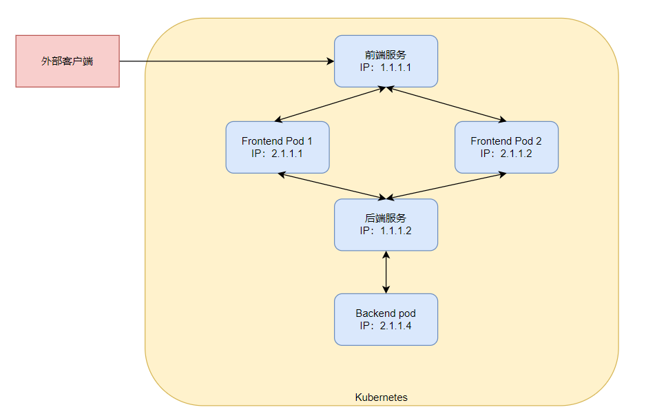

>本章内容包括：
>- 创建服务资源，利用单个地址访问一组pod
>- 发现集群中的服务
>- 将服务公开给外部客户端
>- 从集群内部连接外部服务
>- 控制pod与服务关联
>- 排除服务故障

上一章学习了如何通过`ReplicaSet`以及类似的资源部署运行pod的事。尽管特定的pod可以独立的应对外部刺激，但现在大多数的应用都需要根据外部请求做出响应。例如，就微服务而言，通常需要对集群内部其他应用，以及来自集群外部客户端的HTTP请求做出响应。

pod需要一种寻找其他pod的方法来使用其他pod提供的服务。如果没有kubernetes，系统管理员需要在应用的配置文件中明确指出服务的精确的IP地址或者主机名来配置每个客户端应用，但在kubernetes中不适用这种方法：
- pod是短暂的：它们随时会启动或者关闭，无论是为了给其他pod提供空间而从节点中移除，或者是pod的副本数增加或减少，以及节点异常导致的pod变动。
- kubernetes会在pod启动前给已经调度到节点上的pod分配IP地址，因此客户端不可能提前知道提供服务pod的IP地址。
- 水平伸缩意味着多个pod可以提供相同的服务，每个pod都有自己的地址。
为了解决以上问题，kubernetes提供了一种解决方法----服务(service)。

# 服务介绍

kubernetes服务是一种为一组功能相同的pod提供单一不变的接入点的资源。当服务存在时，它的IP和端口不会改变。客户端通过IP地址和端口号建立连接，这些连接会被路由到提供该服务的任意一个pod上。通过这种方式，客户端不需要知道每个提供服务的pod的地址，这样这些pod就能被随意的在集群中增加或删除。

举个例子，现在有三个pod对外提供前端服务，一个pod为前端提供后端服务，结合上服务如下图所示：


# 创建服务

服务的后端可能不止一个pod。服务的连接对所有的后端pod是负载均衡的，可以使用标签选择器来指定哪些pod属于同一组。

创建服务最简单的办法就是使用`kubectl expose`，但推荐使用yaml描述文件来创建服务。
```yaml
apiVersion: v1
kind: Service
metadata:
  name: kubia
spec:
  ports:
  - port: 80    # 服务可用段都
    targetPort: 8080  # 转发到的容器端口
  selector:
    app: kubia   # 转到具有指定标签的pod上
```
以上的yaml创建了一个叫kubia的Service资源，对外开放80端口，将外部请求转发到具有`app: kibia`标签的pod上的8080端口。

创建好后，我们来查看一下服务的信息
```bash
[root@master ~]# kubectl get svc
NAME         TYPE        CLUSTER-IP   EXTERNAL-IP   PORT(S)   AGE
kubernetes   ClusterIP   10.96.0.1    <none>        443/TCP   13d
```
创建好之后，看到SVC有一个集群地址，类型是`ClusterIP`，这个因为只是集群地址，所以只能集群内部访问。

**测试服务**

可以通过以下几种方法向服务发送请求：
- 创建一个pod，它将请求发送到服务的集群IP并记录响应。可以通过查看pod日志检查服务的响应。
- 使用ssh远程登录到一个Kubernetes节点上使用curl命令。
- 通过`kubectl exec`命令在一个已经存在的pod上执行curl命令。

**在运行的容器中执行命令**

```bash
# -- 代表这kubectl命令项的结束
# 如果不适用--,那么后面的-s会被解析成kubectl的选项，意思为连接到一个http://10.96.0.1的API服务器
[root@master ~]# kubectl exec kubia-97qvk -- curl -s http://10.96.0.1
You've hit kubi-gzwik
```

以上命令在执行时的顺序为：
- 利用Kubernetes执行curl命令，curl命令向一个后端有三个pod服务的IP发送了HTTP请求；
- Kubernetes服务代理截取该连接，在三个pod中随机选取一个pod，将请求转发给它；
- Node.js在pod中运行处理请求，并返回带有pod名称的HTTP响应；
- curl命令向标准输出打印返回值，该返回值被kubectl截取并打印到主机的标准输出。

**会话亲和性**

如果执行多次同样的命令，每次都会随机向不同的pod请求。因为服务代理通常将每个连接随机指向选择后端pod中的一个，即使连接来自于同一个客户端。如果想要把同一个客户端IP产生的请求每次都指向同一个pod，可以设置服务的`sessionAffinity`属性为`ClientIP`(默认为None)。
```yaml
apiVersion: v1
kind: Service
metadata:
  name: kubia
spec:
  sessionAffinity: ClientIP
  ports:
  - port: 80
    targetPort: 8080
  selector:
    app: kubia
```

Kubernetes服务并不支持基于cookie的亲和性，因为服务不在HTTP层面上工作。服务处理TCP和UDP包，并不关心其中的载荷内容，而cookie是HTTP协议中的一部分。

**同一个服务暴露多个端口**

创建的服务可以暴露一个端口也可以暴露多个端口。创建一个有多端口的服务时，必须给每个端口指定名字。
```yaml
apiVersion: v1
kind: Service
metadata:
  name: kubia
spec:
  ports:
  - name: http
    port: 80
    targetPort: 8080
  - name: https
    port: 443
    targetPort: 8443
  selector:
    app: kubia
```
这样创建的服务就能把80端口的流量转发给容器8080端口，443端口转发给8443端口。**标签选择器应用基于整个服务，不能对每个端口做单独的配置。如果不同的pod有不同的端口映射关系，需要创建两个服务。**

**使用命名的端口**

可以在pod的定义中给容器端口命名，这样就能在服务的声明中使用名字来指定特定的端口号，这样会使得服务更加清晰。
```
apiVersion: V1
kind: pod
metadata:
	name: kubia
spec:
	containers:
	- name: kunbia
	  ports:
	  - name: http
	    containerPort: 8080
	  - name: https
	    containerPort: 8443
---
apiVersion: v1
kind: Service
metadata:
  name: kubia
spec:
  ports:
  - name: http
    port: 80
    targetPort: http
  - name: https
    port: 443
    targetPort: https
  selector:
    app: kubia
```
采用命名端口的方式最大的好处就是即使更换端口号也无需更改服务spec。

# 服务发现

通过创建服务，现在就可以通过一个单一稳定的IP地址访问到pod。在服务整个生命周期内这个地址保持不变。Kubernetes为用户提供了发现服务的IP和端口的方式。

**通过环境变量连接服务**

在pod开始运行的时候，Kubernetes会初始化一系列的环境变量指向现在存在的服务。如果创建的服务遭遇客户端pod的创建，pod上的进程可以根据环境变量获得服务的IP地址和端口号。

可以在pod中查看这些环境变量，如果你的pod创建在服务之前，可以先删除所有pod，再重新创建。
```bash
kubectl delete po --all
```
如果服务在pod之前创建，Kubernetes会把相关服务的信息初始化为环境变量放到相关的pod上。
- `<SERVICE_NAME>_SERVICE_HOST`：服务的Cluster IP。
- `<SERVICE_NAME>_SERVICE_PORT`：服务的端口号。

**通过DNS连接服务**

如果pod在服务之前创建，推荐使用DNS来进行服务发现。在`kube-system`的命名空间中包含了一个名为`kube-dns`的pod，这个pod运行DNS服务，在集群中的其他pod都被配置使用其作为dns(Kubernetes通过修改每个容器中的/etc/resolv.conf文件实现)。运行在pod上的进程DNS查询都会被Kubernetes自身的DNS服务器响应，该服务知道系统中运行的所有服务。

**pod是否使用内部的DNS服务器是根据pod中spec的dnsPolicy属性来决定的。**

每个服务从内部DNS服务器中获得一个DNS条目，客户端的pod在知道服务名称的情况下可以通过全限定域名(FQDN)来访问，而不是通过环境变量。

**通过FQDN连接服务**

前端pod可以通过打开以下FQDN的连接来访问后端数据服务。
```
	backend-database.default.svc.cluster.local
```
`backend-database`对应服务名称，`default`表示服务所在的命名空间，`svc`表示这是一个服务`cluster.local`集群的域名，默认是`cluster.local`，但可以在集群配置时更改。

如果两个pod在同一个命名空间内，直接可以用服务名进行连接。如：`curl http://kubia`。客户端必须知道服务的端口号，如果服务使用的不是默认端口，那么需要`curl http://kubia:8055`明确指定服务的端口号。

且服务的集群IP是一个虚拟IP，并且只有在与服务端口结合时才有意义，所以在pod容器中去ping服务的IP是行不通的。且Kubernetes中的服务主要是基于OSI模型的四层协议（即传输层协议）进行流量转发的。Kubernetes服务使用四层协议（TCP/UDP/SCTP）来路由和负载均衡流量到后端的Pod，不包括ICMP协议。

# 连接集群外部的服务

服务的主要功能是负载均衡和服务发现。除了上面介绍的在集群内部连接服务外，还可以把集群内部运行的客户端像连接内部服务一样连接到外部服务。

## endpoint

服务并不是直接和pod相连的。有一种介于两者之间的`Endpoint`资源。如果运行`kubectl describe svc/pod-name`就会发现在服务的详情中有一个`Endpoints: 10.1.0.1:8080,10.1.0.2:8080,10.1.0.2:8080`。

Endpoint资源就是暴露一个服务的IP地址和端口的列表，Endpoint资源和其他Kubernetes资源一个，可以使用`kubectl get ep kubia`来获取基本信息。

虽然在spec服务中定义了pod选择器，但在重定向传入连接中一般不会直接使用它，选择器一般用来构建IP和端口列表，然后存储在Endpoint资源中。当客户端连接到服务时，服务代理选择这些IP和端口对中的一个，并将传入连接重定向到该位置的pod上。

## 配置endpoints


