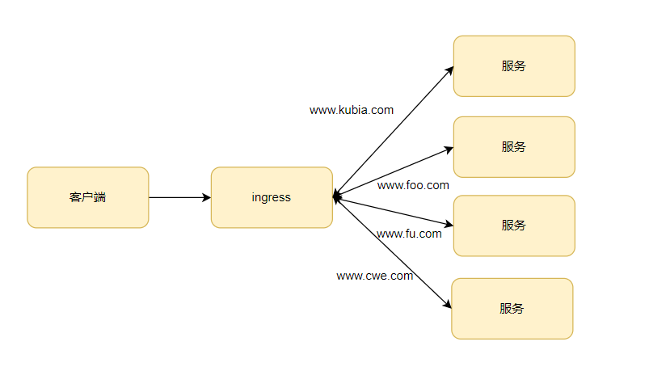
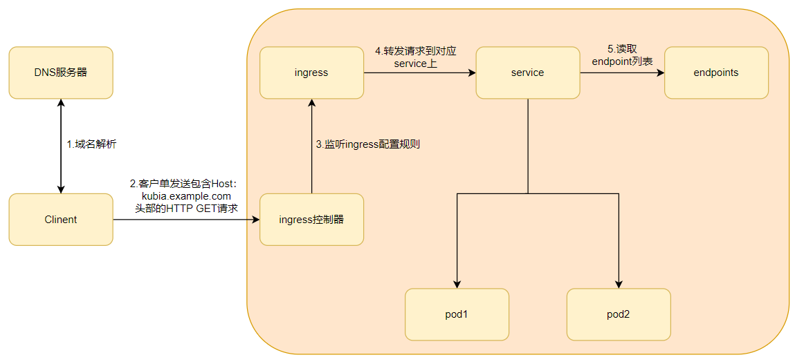

# 第四章：服务-让客户端发现pod并与之通信

> 本章内容包括：
>
> * 创建服务资源，利用单个地址访问一组pod
> * 发现集群中的服务
> * 将服务公开给外部客户端
> * 从集群内部连接外部服务
> * 控制pod与服务关联
> * 排除服务故障

上一章学习了如何通过`ReplicaSet`以及类似的资源部署运行pod的事。尽管特定的pod可以独立的应对外部刺激，但现在大多数的应用都需要根据外部请求做出响应。例如，就微服务而言，通常需要对集群内部其他应用，以及来自集群外部客户端的HTTP请求做出响应。

pod需要一种寻找其他pod的方法来使用其他pod提供的服务。如果没有kubernetes，系统管理员需要在应用的配置文件中明确指出服务的精确的IP地址或者主机名来配置每个客户端应用，但在kubernetes中不适用这种方法：

* pod是短暂的：它们随时会启动或者关闭，无论是为了给其他pod提供空间而从节点中移除，或者是pod的副本数增加或减少，以及节点异常导致的pod变动。
* kubernetes会在pod启动前给已经调度到节点上的pod分配IP地址，因此客户端不可能提前知道提供服务pod的IP地址。
* 水平伸缩意味着多个pod可以提供相同的服务，每个pod都有自己的地址。\
  为了解决以上问题，kubernetes提供了一种解决方法----服务(service)。

## 1 服务介绍

kubernetes服务是一种为一组功能相同的pod提供单一不变的接入点的资源。当服务存在时，它的IP和端口不会改变。客户端通过IP地址和端口号建立连接，这些连接会被路由到提供该服务的任意一个pod上。通过这种方式，客户端不需要知道每个提供服务的pod的地址，这样这些pod就能被随意的在集群中增加或删除。

举个例子，现在有三个pod对外提供前端服务，一个pod为前端提供后端服务，结合上服务如下图所示：

## 2 创建服务

服务的后端可能不止一个pod。服务的连接对所有的后端pod是负载均衡的，可以使用标签选择器来指定哪些pod属于同一组。

创建服务最简单的办法就是使用`kubectl expose`，但推荐使用yaml描述文件来创建服务。

```yaml
apiVersion: v1
kind: Service
metadata:
  name: kubia
spec:
  ports:
  - port: 80    # 服务可用端口
    targetPort: 8080  # 转发到的容器端口
    protocol: TCP # 默认TCP，支持TCP/UDP/SCTP
  selector:
    app: kubia   # 转到具有指定标签的pod上，不指定将无法转发流量
```

以上的yaml创建了一个叫kubia的Service资源，对外开放80端口，将外部请求转发到具有`app: kibia`标签的pod上的8080端口。

创建好后，我们来查看一下服务的信息

```bash
[root@master ~]# kubectl get svc
NAME         TYPE        CLUSTER-IP   EXTERNAL-IP   PORT(S)   AGE
kubernetes   ClusterIP   10.96.0.1    <none>        443/TCP   13d
```

创建好之后，看到SVC有一个集群地址，类型是`ClusterIP`，这个因为只是集群地址，所以只能集群内部访问。

**测试服务**

可以通过以下几种方法向服务发送请求：

* 创建一个pod，它将请求发送到服务的集群IP并记录响应。可以通过查看pod日志检查服务的响应。
* 使用ssh远程登录到一个Kubernetes节点上使用curl命令。
* 通过`kubectl exec`命令在一个已经存在的pod上执行curl命令。

**在运行的容器中执行命令**

```bash
# -- 代表这kubectl命令项的结束
# 如果不适用--,那么后面的-s会被解析成kubectl的选项，意思为连接到一个http://10.96.0.1的API服务器
[root@master ~]# kubectl exec kubia-97qvk -- curl -s http://10.96.0.1
You've hit kubi-gzwik
```

以上命令在执行时的顺序为：

* 利用Kubernetes执行curl命令，curl命令向一个后端有三个pod服务的IP发送了HTTP请求；
* Kubernetes服务代理截取该连接，在三个pod中随机选取一个pod，将请求转发给它；
* Node.js在pod中运行处理请求，并返回带有pod名称的HTTP响应；
* curl命令向标准输出打印返回值，该返回值被kubectl截取并打印到主机的标准输出。

**会话亲和性**

如果执行多次同样的命令，每次都会随机向不同的pod请求。因为服务代理通常将每个连接随机指向选择后端pod中的一个，即使连接来自于同一个客户端。如果想要把同一个客户端IP产生的请求每次都指向同一个pod，可以设置服务的`sessionAffinity`属性为`ClientIP`(默认为None)。

```yaml
apiVersion: v1
kind: Service
metadata:
  name: kubia
spec:
  sessionAffinity: ClientIP
  sessionAffinityConfig: 
	  clientIP: 
		  timeoutSeconds: 3600  # 亲和性过期时间
  ports:
  - port: 80
    targetPort: 8080
  selector:
    app: kubia
```

Kubernetes服务并不支持基于cookie的亲和性，因为服务不在HTTP层面上工作。服务处理TCP和UDP包，并不关心其中的载荷内容，而cookie是HTTP协议中的一部分。Web服务器可能会使用长连接导致就算不设置会话亲和性，请求也每次会打到同一个pod上。

**同一个服务暴露多个端口**

创建的服务可以暴露一个端口也可以暴露多个端口。创建一个有多端口的服务时，必须给每个端口指定名字。

```yaml
apiVersion: v1
kind: Service
metadata:
  name: kubia
spec:
  ports:
  - name: http
    port: 80
    targetPort: 8080
  - name: https
    port: 443
    targetPort: 8443
  selector:
    app: kubia
```

这样创建的服务就能把80端口的流量转发给容器8080端口，443端口转发给8443端口。**标签选择器应用基于整个服务，不能对每个端口做单独的配置。如果不同的pod有不同的端口映射关系，需要创建两个服务。**

**使用命名的端口**

可以在pod的定义中给容器端口命名，这样就能在服务的声明中使用名字来指定特定的端口号，这样会使得服务更加清晰。

```
apiVersion: V1
kind: pod
metadata:
	name: kubia
spec:
	containers:
	- name: kunbia
	  ports:
	  - name: http
	    containerPort: 8080
	  - name: https
	    containerPort: 8443
---
apiVersion: v1
kind: Service
metadata:
  name: kubia
spec:
  ports:
  - name: http
    port: 80
    targetPort: http
  - name: https
    port: 443
    targetPort: https
  selector:
    app: kubia
```

采用命名端口的方式最大的好处就是即使更换端口号也无需更改服务spec。

## 3 服务发现

通过创建服务，现在就可以通过一个单一稳定的IP地址访问到pod。在服务整个生命周期内这个地址保持不变。Kubernetes为用户提供了发现服务的IP和端口的方式。

**通过环境变量连接服务**

在pod开始运行的时候，Kubernetes会初始化一系列的环境变量指向现在存在的服务。如果创建的服务遭遇客户端pod的创建，pod上的进程可以根据环境变量获得服务的IP地址和端口号。

可以在pod中查看这些环境变量，如果你的pod创建在服务之前，可以先删除所有pod，再重新创建。

```bash
kubectl delete po --all
```

如果服务在pod之前创建，Kubernetes会把相关服务的信息初始化为环境变量放到相关的pod上。

* `<SERVICE_NAME>_SERVICE_HOST`：服务的Cluster IP。
* `<SERVICE_NAME>_SERVICE_PORT`：服务的端口号。

**通过DNS连接服务**

如果pod在服务之前创建，推荐使用DNS来进行服务发现。在`kube-system`的命名空间中包含了一个名为`kube-dns`的pod，这个pod运行DNS服务，在集群中的其他pod都被配置使用其作为dns(Kubernetes通过修改每个容器中的/etc/resolv.conf文件实现)。运行在pod上的进程DNS查询都会被Kubernetes自身的DNS服务器响应，该服务知道系统中运行的所有服务。

**pod是否使用内部的DNS服务器是根据pod中spec的dnsPolicy属性来决定的。**

每个服务从内部DNS服务器中获得一个DNS条目，客户端的pod在知道服务名称的情况下可以通过全限定域名(FQDN)来访问，而不是通过环境变量。

**通过FQDN连接服务**

前端pod可以通过打开以下FQDN的连接来访问后端数据服务。

```
	backend-database.default.svc.cluster.local
```

`backend-database`对应服务名称，`default`表示服务所在的命名空间，`svc`表示这是一个服务`cluster.local`集群的域名，默认是`cluster.local`，但可以在集群配置时更改。

如果两个pod在同一个命名空间内，直接可以用服务名进行连接。如：`curl http://kubia`。客户端必须知道服务的端口号，如果服务使用的不是默认端口，那么需要`curl http://kubia:8055`明确指定服务的端口号。

且服务的集群IP是一个虚拟IP，并且只有在与服务端口结合时才有意义，所以在pod容器中去ping服务的IP是行不通的。且Kubernetes中的服务主要是基于OSI模型的四层协议（即传输层协议）进行流量转发的。Kubernetes服务使用四层协议（TCP/UDP/SCTP）来路由和负载均衡流量到后端的Pod，不包括ICMP协议。

## 4 连接集群外部的服务

服务的主要功能是负载均衡和服务发现。除了上面介绍的在集群内部连接服务外，还可以把集群内部运行的客户端像连接内部服务一样连接到外部服务。

### 4.1 endpoint

服务并不是直接和pod相连的。有一种介于两者之间的`Endpoint`资源。如果运行`kubectl describe svc/pod-name`就会发现在服务的详情中有一个`Endpoints: 10.1.0.1:8080,10.1.0.2:8080,10.1.0.2:8080`。

Endpoint资源就是暴露一个服务的IP地址和端口的列表，Endpoint资源和其他Kubernetes资源一个，可以使用`kubectl get ep kubia`来获取基本信息。

虽然在spec服务中定义了pod选择器，但在重定向传入连接中一般不会直接使用它，选择器一般用来构建IP和端口列表，然后存储在Endpoint资源中。当客户端连接到服务时，服务代理选择这些IP和端口对中的一个，并将传入连接重定向到该位置的pod上。

### 4.2 配置endpoints

服务的endpoint与服务解耦之后，可以手动配置endpoint了。如果创建了不包含pod选择器的服务，Kubernetes将不会创建endpoint资源，这时候将需要手动endpoint资源。

```yaml
# 创建一个不包含pod选择器的service
apiVersion: v1
kind: Service
metadata:
  name: external-service
spec:
  ports:
  - port: 80
---
apiVersion: v1
kind: Endpoints
metadata:
  name: external-service
subsets:
  - addresses:      # IP列表
    - ip: 11.11.11.11
    - ip: 22.22.22.22
    ports:  # 端口列表
    - port: 80 
```

endpoint是一个单独的资源而不是服务的一个属性。endpoint对象需要和service具有相同的名称，在service和endpoint都发布之后，服务就能正常使用了，在创建完成后，可以对service进行编辑添加pod选择器，从而对endpoint进行自动化管理，会自动把符合pod选择器的IP接入到endpoint中。在使用pod选择器后，由于endpoint是一个独立的资源，所以我们可以手动把一些IP加入到endpoint中，但不推荐这么做。

### 4.3 为外部服务创建别名

除了手动配置服务的endpoint来代替公开外部服务的方法，还有一种更简单的方法，就是通过其完全限定域名访问外部服务。

**创建ExternalName类型的服务**

要创建一个具有别名的外部服务的服务时，要将创建服务资源的一个type字段设置为ExteralName。

```yaml
apiVersion: v1
kind: Service
metadata:
  name: external-service
spec:
  type: ExternalName  # 设置service的类型
  externalName: api.somecompany.com # 实际服务的完全限定域名
  ports:
  - port: 80
```

服务创建完成后，pod可以通过`external-service.default.svc.cluster.local`域名连接到外部服务器，而不是使用服务实际的FQDN。这隐藏了实际的服务名称及其使用该服务的pod的位置，允许修改服务定义，并且在以后如果将其指向不同的服务，只需简单的修改externalName属性即可。

ExternalName服务仅在DNS级别实施，为服务创建简单的`CNAME DNS`记录，因此连接服务的客户端将直接连接到外部服务，完全绕过服务代理，出于这个原因，这类型的服务甚至不会获得集群IP。

## 5 将服务暴露给外部客户端

以上说明了集群内部服务如何被pod使用，现在我们来说说怎么把集群内部的服务暴露给外部访问。比如部署一个web服务，让外部能够访问到。

在Kubernetes中有几种方法可以将服务暴露给外部客户端：

* 将服务的类型设置成NodePort：每个集群节点都会在节点上打开一个端口，对于NodePort服务，每个集群节点在节点本身上打开一个端口，并将该端口上接受到的流量重定向到基础服务。
* 将服务类型设置成LoadBalance：NodePort类型的一种扩展，这使得服务可以通过一个专用的负载均衡器来访问，这是由Kubernetes中正在运行的云基础设置提供的。负载均衡器将流量重定向到跨所有节点的节点端口，客户端通过访问负载均衡器的IP连接到服务。
* 创建一个Ingress资源：这是一个完全不同的机制，通过一个IP地址公开多个服务，它运行在HTTP层(网络协议第七层)上，因此可以提供比工作在第四层的服务更多的功能。

### 5.1 使用NodePort

将一组pod公开给外部客户端的第一种方法是创建一个服务并将其类型设置为`NodePort`。通过创建NodePort服务，可以让Kubernetes在其所有节点上保留一个端口(所有节点上都使用相同的端口号)，并将其传入的连接转发给作为服务部分的pod。

**创建NodePort服务**

```yaml
apiVersion: v1
kind: Service
metadata:
  name: kubia-nodeport
spec:
  type: NodePort
  externalTrafficPolicy: Local # 外部流量策略，默认为Cluster，Local会把流量转发到本节点pod，如果本节点没有pod则将请求挂起。
  ports:
  - port: 80   # 服务集群的port
    targetPort: 8080  # 容器内部的port
    nodePort: 30123   # 节点上的port
  selector:
    app: kubia
```

如果不指定节点端口，那么Kubernetes会随机选择一个端口。

```bash
[root@master ~]# kubectl get svc
NAME         TYPE        CLUSTER-IP       EXTERNAL-IP   PORT(S)        AGE
kubernetes   ClusterIP   10.96.0.1        <none>        443/TCP        13d
kubia        NodePort    10.105.236.252   <none>        80:30123/TCP   7s
```

在这里可以看到service对应的集群IP和port及nodeport。需要注意的是，通过NodeIP和Nodeport访问的是Service，所以请求到达的pod还是随机的。

### 5.2 负载均衡器暴露服务

在云提供商上运行的Kubernetes集群通常支持从云基础架构自动提供负载均衡器。所以需要做的就是设置服务的类型为LoadBaLancer。负载均衡器拥有自己独一无二的可公开访问的IP地址，并将所有连接重定向到服务，可以通过负载均衡器的IP地址访问服务。

**创建LoadBalance服务**

```yaml
apiVersion: v1
kind: Service
metadata:
  name: kubia-loadbalancer
spec:
  type: LoadBalancer
  ports:
  - port: 80
    targetPort: 8080
  selector:
    app: kubia
```

在创建好服务后，负载均衡器的IP需要一段时间后才能创建出来，当External-IP创建出来后，就可以直接通过这个IP访问服务了。

```bash
[root@master ~]# kubectl get svc
NAME                 TYPE           CLUSTER-IP      EXTERNAL-IP   PORT(S)        AGE
kubernetes           ClusterIP      10.96.0.1       <none>        443/TCP        13d
kubia-loadbalancer   LoadBalancer   10.110.56.216   <pending>     80:31431/TCP   4s
```

### 5.3 通过ingress暴露服务

为什么需要ingress？一个重要的原因是每个LoadBalancer服务都需要自己的负载均衡器，以及独有的公有IP地址。而ingress只需要一个公网IP就能为许多服务提供访问。当客户端向ingress发送HTTP请求时，Ingress会根据请求的主机名和路径决定请求转发到的服务。\
Ingress在网络栈的应用层操作，并且可以提供一些服务不能实现的功能，如基于cookie的会话亲和性等功能。在使用ingress之前，必须确保已经安装了Ingress Controller，Ingress需要一个控制器来处理Ingress资源。常见的Ingress Controller有nginx-ingress、traefik等。可以使用以下命令进行安装

```bash
kubectl apply -f https://raw.githubusercontent.com/kubernetes/ingress-nginx/main/deploy/static/provider/cloud/deploy.yaml
```

#### 5.3.1 创建ingress

```yaml
apiVersion: extensions/v1beta1
kind: Ingress
metadata:
  name: kubia
spec:
  rules:
  - host: kubia.example.com # 映射域名到服务，不允许使用IP
    http:
      paths:
      - path: /
        pathType: Exact # path匹配模式
        backend:
          serviceName: kubia-nodeport # 服务名
          servicePort: 80  # 端口
```

这里会将ingress控制器收到的所有请求主机的kubia.example.com的HTTP请求都会被发送到端口80的kubia-nodeport服务。记住域名的解析必须为ingress的IP。**一般ingress搭配Node Port类型和LoadBalancer类型的service使用**

```bash
[root@master ~]# kubectl get ingress
NAME    HOSTS               ADDRESS           PORTS   AGE
kubia   kubia.example.com   192.168.99.100     80      10s
```

可以在ingress的主机名设置通配符域名，但通配符仅支持覆盖第一个DNS标签，不能单独使用通配符作为标签（例如，Host=“\*”）。如果 host 是用通配符给出的，那么如果 HTTP `Host` 标头与通配符规则的后缀（删除第一个标签）相同， 则请求与此规则匹配。

| 主机                                                                           | host 头部           | 匹配与否？                |
| ---------------------------------------------------------------------------- | ----------------- | -------------------- |
| `*.foo.com`                                                                  | `bar.foo.com`     | 基于相同的后缀匹配            |
| `*.foo.com`                                                                  | `baz.bar.foo.com` | 不匹配，通配符仅覆盖了一个 DNS 标签 |
| `*.foo.com`                                                                  | `foo.com`         | 不匹配，通配符仅覆盖了一个 DNS 标签 |
| 在某些情况下，Ingress 中会有多条路径与同一个请求匹配。这时匹配路径最长者优先。 如果仍然有两条同等的匹配路径，则精确路径类型优先于前缀路径类型。 |                   |                      |

pathType支持三种匹配模式：

* `Exact`：与 URL 路径完全匹配。
* `Prefix`：前缀匹配，如 `/foo/bar` 匹配 `/foo/bar/baz`，但不匹配 `/foo/barbaz`）。
* ImplementationSpecific：由具体的Ingress Controller实现决定其行为。如果未指定 `pathType`，有些Ingress Controller可能会默认使用这种类型，但行为可能因实现而异。

#### 5.3.2 ingress工作原理

ingress的作用原理大概是这样：

1. 客户端首先对域名执行DNS查询，DNS服务器返回了ingress控制器的IP；
2. 客户端向Ingress控制器发送Http请求，并在Host头部指定域名；
3. 控制器从该头部确定客户端尝试访问哪个服务，通过该服务关联的Endpoint对象查看pod IP；
4. 最后service将客户端的请求转发给其中一个pod。\
   由于Ingress API建立在Service抽象之上，Ingress控制器可以选择通过Service转发流量或直接将其发送到Pod上。大多数Ingress控制器选择了后者。除了验证Ingress资源中引用的Service是否存在外，它们并不使用Service资源。当涉及路由时，大多数控制器将流量转发到相应Endpoints对象中列出的Pod IP地址。将流量直接路由到Pod，可以绕过Service层，从而减少延迟并增加不同的负载均衡策略。\
   详细可以查看这篇关于`nginx ingress`源码分析：[源码分析 kubernetes ingress nginx controller 控制器的实现原理](https://xiaorui.cc/archives/7340)

#### 5.3.3 ingress暴露多个服务

在ingress的配置文件中，rules字段和paths字段都是数组，因此可以包含多个条目。一个ingress可以将多个主机和路径映射到多个服务。

```yaml
# 将多个服务映射到不同的path
apiVersion: extensions/v1beta1
kind: Ingress
metadata:
  name: kubia
spec:
  rules:
  - host: kubia.example.com # 映射域名到服务
    http:
      paths:
      - path: /
        backend:
          serviceName: kubia-nodeport # 服务名
          servicePort: 80  # 端口
	  - path: /foo      # 通过不同的路径映射到不同的服务
	    backend:
	      serviveName: kubia-foo
	      servicePort: 80
  - host: bar.example.com   # 通过URL映射不同的服务
    http:
      paths:
      - path: /bar
        backend:
          serviceName: kubia-bar
          servicePort: 80
```

以上配置分别可以通过同一个URL的不同路径将请求转发到不同的服务，也可以根据不同的URL转发到不同的服务，以上两个域名的DNS解析都要是ingress的IP。

#### 5.3.4 配置TLS

以上的配置都是Ingress如何转发HTTP流量，那个Ingress如何转发HTTPS流量呢？当客户端创建到Ingress控制器的TLS连接时，控制器将终止TLS连接。客户端和控制器之间的通信是加密的，而控制器和后端pod之间的通信则不是。运行在pod上的容器不需要支持TLS。例如，如果pod运行web服务器，则它只需要接受HTTP通信，并让Ingress控制器负责处理与TLS相关的所有内容。要使控制器能够处理TLS相关内容，需要将证书和私钥附加到Ingress上。这两个必需资源存储在Secret上。

```yaml
# 创建secret
apiVersion: v1
kind: Secret
metadata:
  name: hello-app-tls
  namespace: dev
type: kubernetes.io/tls
data:
  server.crt: |
       <crt contents here>
  server.key: |
       <private key contents here>
---
# 创建ingress
apiVersion: extensions/v1beta1
kind: Ingress
metadata:
  name: kubia
spec:
  tls:
  - hosts:  
    - kubia.example.com   # 接收此域名的HTTPS请求
    secretName: tls-secret
  - hosts: 
    - example.org 
    secretName: example-org-tls
  rules:
  - host: kubia.example.com
    http:
      paths:
      - path: /
        backend:
          serviceName: kubia-nodeport
          servicePort: 80
```

## 6 就绪探针

当配置好Ingress和Service之后，就会自动匹配pod选择器，匹配好之后pod就将作为服务的后端接收外部请求了，但如果后端pod此时并没有准备好要接受请求呢？pod有可能需要时间来加载配置或数据，或者可能需要执行预热过程以防止第一个用户请求时间太长影响用户体验。这种情况下，我们需要一种机制来帮我们检查pod是否已经就绪，这就是接下来要介绍的接续探针。

### 6.1 介绍就绪探针

在之前的内容中，我们介绍了存活探针，就绪探针与存活探针一样，都会定期调用，确定特定的pod是否准备好接收客户端请求了。**与存活探针不同的是，就绪探针就算检查失败，也不会终止或重启pod。** 当容器的准备就绪探测返回成功时，表示容器已准备好接收请求。当容器未能通过就绪探针的检查，则从endpoint列表中删除该pod的IP，当通过就绪探针检查后再加入到endpoint列表中提供服务。

准备就绪的概念显然是每个容器特有的东西。Kubernetes只能检查在容器中运行的程序是否响应一个简单的请求，一般这种确切的准备就绪的判定是应用程序开发人员的工作。

就绪探针跟存活探针一样支持三种类型：

1. Exec探针：执行命令，状态由命令的退出状态码确定；
2. HTTP GET探针：向容器发送HTTP GET请求，通过响应的HTTP状态码判断容器状态；
3. TCP socket探针：打开一个TCP连接到容器指定端口，如果连接已建立，认为容器已就绪。

就绪探针的好处就在于一切转发请求的动作都在Kubernetes中进行，用户是无感知的，只与正常的pod进行交互，对系统可能出现的问题无察觉。

### 6.2 配置就绪探针

```yaml
apiVersion: v1
kind: ReplicationController
metadata:
  name: kubia
spec:
  replicas: 3
  selector:
    app: kubia
  template:
    metadata:
      labels:
        app: kubia
    spec:
      containers:
      - name: kubia
        image: luksa/kubia
        ports:
        - name: http
          containerPort: 8080
        readinessProbe:   # 就绪探针
          initialDelaySeconds: 10 # 10s之后再检查，默认0
          periodSeconds: 5 # 探测间隔时间，默认10s
          timeoutSeconds: 1 # 探测超时时间，默认1s
          successThreshold: 1 # 探测成功的阈值，表示在被认为就绪之前需要连续成功的次数（默认值：1）
          failureThreshold: 3 # 探测失败的阈值，表示在被认为不就绪之前需要连续失败的次数（默认值：3）
          exec:            # exec探针
            command:
            - ls
            - /var/ready
	      httpGet: 
		    path: /healthz 
		    port: 8080 
		    httpHeaders:   # 请求头信息
		    - name: Custom-Header 
		      value: Awesome
		  tcpSocket:   # tcp探针
		    port: 8080
```

上面这个就绪探针定期在pod中执行`ls /var/ready`命令。如果文件存在，则命令返回状态码0，否则返回非零状态码就绪探针失败。**注意：每个容器只能定义一个就绪探针（Readiness Probe）和一个存活探针（Liveness Probe）。**

## 7 handless服务

通过上面的介绍我们知道了如何将流量转发到特定的pod上，但如果客户端需要连接到所有的pod呢？如果后端pod需要连接到所有其他pod呢？

在Kubernetes中可以通过DNS查找发生pod IP。通常情况下，当执行服务的DNS查找时，DNS服务器会返回单个IP，也就是服务的集群IP，但如果把服务的`clusterIP`设置为None，那么DNS服务器将返回pod IP。DNS会返回该服务的多个A记录。无头服务主要用于 StatefulSet、数据库集群等需要直接访问 Pod 的场景。

### 7.1 创建handless

将服务的spec中的clusterIP字段设置为None会使服务成为handless服务，因为Kubernetes不会为其分配集群IP。

```yaml
apiVersion: v1
kind: Service
metadata:
  name: kubia-headless
spec:
  clusterIP: None
  ports:
  - port: 80
    targetPort: 8080
  selector:
    app: kubia
  publishNotReadyAddresses: true # 将未就绪的 Pod IP 地址也发布到 DNS 中
```

### 7.2 通过DNS发现pod

在service创建好之后，可以创建一个容器用来执行DNS解析。

```bash
kubectl exec dnspod nslookup kubia-headless
...
Name: kubia-headless.default.svc.cluster.local
Address: 10.108.1.4
Name: kubia-headless.default.svc.cluster.local
Address: 10.108.1.5
```

DNS服务器为该服务的FQDN返回了两个pod IP。如果是常规的service，那么将返回service的IP

```bash
kubectl exec dnspod nslookup kubia
...
Name: kubia-headless.default.svc.cluster.local
Address: 10.111.249.153
```

对于headless服务，由于DNS返回了pod的IP，客户端直接连接到该pod，而不是通过服务代理。headless服务仍然提供跨pod的负载均衡，但是通过DNS轮询机制而不是通过服务代理。
