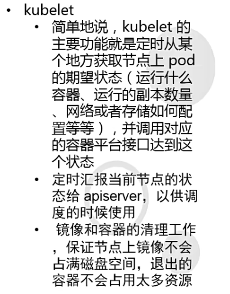

# 1.Kubernetes概述

- 官网：https://kubernetes.io
- GitHub：[kubernetes/kubernetes: Production-Grade Container Scheduling and Management (github.com)](https://github.com/kubernetes/kubernetes)

- 由来：谷歌的Borg系统，后经Go语言重写并捐献给CNCF基金会开源
- 作用：开源的容器编排框架工具(生态丰富)
- 学习意义：解决跑裸docker的痛点


> K8S优势

- 自动装箱，水平扩展、自我修复
- 服务发现和负载均衡
- 自动发布(默认滚动发布模式)和回滚
- 集中化配置管理和秘钥管理
- 存储编排
- 任务批处理运行
- ...


# 2.K8S快速入门

> 四组概念

- Pod/Pod控制器
- Name/Namespace
- Label/Label选择器
- Service/Ingress


## 2.1.Pod

- Pod
  - Pod是K8S里能够被运行的最小的逻辑单元(原子单位)
  - 1个Pod里面可以运行多个容器，它们共享UTS+NET+IPC名称空间
    - UTS命名空间用于隔离主机名和域名
    - NET命名空间用于隔离网络接口和网络栈
    - IPC命名空间用于隔离进程间通信资源
  - 可以把Pod理解成豌豆荚，而同一个Pod内的每个容器是一颗颗豌豆
  - 一个Pod里面运行容器，又叫边车(SideCar)模式
- Pod控制器
  - Pod控制器是Pod启动的一种模板，用来保证在K8S里启动的Pod应始终安装人们的预期运行(副本数、声明周期、健康状态检查)
  - K8S内提供了众多的Pod控制器，常用的有
    - **Deployment**：无状态的服务部署
    - **DaemonSet**：确保所有（或某些）节点运行一个Pod的副本
    - ReplicaSet：负责维护集群中运行的Pod数量
    - StatefulSet：有状态的服务部署
    - Job：任务
    - Cronjob：定时周期任务
    - Nod：监控节点状态，并在节点出现故障时及时做出响应


## 2.2.Name

- Name

  - 由于K8S内部，使用"资源"来定义每一种逻辑概念(功能)，故每种"资源"都应该有自己的名称
  - "资源"有api版本(apiVersion)、类别(kind)、元数据(metadata)、定义清单(spec)、状态(status)等配置信息
  - "名称"通常定义在"资源"的"元数据"信息里

- Namespace

  - 随着项目增多、人员增加、集群规模的扩大，需要一种能**隔离**K8S内各种"资源"的方法，这就是名称空间
  - 名称空间可以理解为K8S内部的虚拟集群组
  - 不同名称空间内的"资源",名称可以相同，相同名称空间内的同种"资源"，"名称"不能相同
  - 合理的使用K8S的名称空间，使得集群管理员能够更好的对交付到K8S里的服务进行**分类管理**和**浏览**
  - 查询K8S里特定"资源"要带上相应的名称空间
  - K8S里默认存在的名称空间有：default、kebu-system、kebu-public、kubu-node-lease
    - `default`：默认的Namespace，用于存放没有指定Namespace的对象。
    - `kube-system`：用于存放Kubernetes系统组件创建的对象。
    - `kube-public`：用于存放公共资源，所有用户（包括未经身份验证的用户）都可以访问。
    - `kube-node-lease`：用于存放与节点心跳相关的Lease对象。

  - 可以使用`kubectl get namespaces`命令查看集群中所有可用的Namespace


## 2.3.Label

- Label
  - 标签是K8S特色的管理方式，便于**分类管理**资源对象
  - 一个标签可以对应多个资源，一个资源也可以有多个标签，它们是**多对多**的关系
  - 一个资源拥有多个标签，可以实现**不同纬度**的管理
  - 标签的组成：**key=value**
  - 与标签类似的，还有一种"注释"(annotations)
    - Annotations不用于选择和查找对象，而是用于**存储**额外的信息，以便工具和库能够检索它们。
- Label选择器
  - 给资源打上标签后，可以使用标签选择器**过滤**指定的标签
  - 标签选择器目前有两个：基于等值关系(等于、不等于)和基于集合关系(属于、不属于、存在)
  - 许多资源支持内嵌标签选择器字段
    - matchLacels
    - matchExpressions


## 2.4.Service

- Service
  - 在K8S的世界里，虽然每个Pod都会被分配一个单独的IP地址，但这个IP地址会随着Pod的销毁而消失
  - Service(服务)就是用来解决这个问题的核心概念
  - 一个Service可以看做一组提供相关服务的Pod的对外访问接口
  - Service作用域那些Pod是通过标签选择器来定义的
- Ingress
  - Ingress是K8S集群里工作在OSI网络参考模型下，第7层的应用，对外暴露的接口
  - Service只能进行L4流量调度，表现形式是ip+port
  - Ingress则可以调度不同业务域、不同URL访问路径的业务流量


## 2.5.K8S架构

- K8S网络
  - Node网络
  - Pod网络
  - Service网络


- 核心组件

  - 配置存储中心--->etcd服务

    - 为了高可用性，最好配置奇数个

  - 主控(master)节点

    - kube-apiserver服务

     

    - kube-controller-manager服务

    

    - kube-scheduler服务

     

  - 运算(node)节点

    - kubu-kubelet服务

     

    - kubu-proxy服务

    

- CLI客户端

  - kubectl

- 核心组件

  - CNI网络插件--->flannel/calico
  - 服务发现用插件--->coredns
  - 服务暴露用插件--->traefik
  - GUI管理插件--->Dashboard


# 3.K8S集群架构


## 3.1.常见的K8S安装部署方式

1.  单节点微型K8S(仅供学习、预览使用)

   - [minikube start | minikube (k8s.io)](https://minikube.sigs.k8s.io/docs/start/)

   ```bash
   # 安装minikube
   curl -LO https://storage.googleapis.com/minikube/releases/latest/minikube-linux-amd64
   sudo install minikube-linux-amd64 /usr/local/bin/minikube
   
   # 一般运行minikube不使用root用户
   useradd newuser
   usermod -aG wheel newuser
   passwd
   su - newuser
   sudo usermod -aG docker $USER && newgrp docker
   minikube start --driver=docker
   ```

2. 二进制安装部署(生成首选，新手推荐)
3. 使用Kubeadmin进行部署，K8S的部署工具，跑在K8S里(相对简单，熟手推荐)


## 3.2.部署准备

- 准备五台虚拟机

- 关闭防火墙并安装阿里源和epel源

  ```bash
  [root@localhost ~]# systemctl stop firewalld
  [root@localhost ~]# curl -o /etc/yum.repos.d/CentOS-Base.repo 
  [root@localhost ~]# yum install -y epel-release
  ```

- 安装必要工具

  ```bash
  yum install -y wget net-tools telnet tree nmap sysstat lrzsz dos2unix bind-utils
  ```

  

### 1.搭建DNS服务

11

- 安装bind服务

```bash
yum install -y bind
```

- 配置DNS

```bash
配置bind
[root@hdss7-11 ~]# vi /etc/named.conf			# BIND进程的工作属性，区域的定义
13         listen-on port 53 { 192.168.154.11; };	# 监听本机IP
14         listen-on-v6 port 53 { ::1; };		# 删除，不监听IPV6
20         allow-query     { any; };			# 允许所有主机查看
21         forwarders      { 192.168.154.2; };		# 办公网上一级的DNS
33         recursion yes;				# dns采用递归的查询
35         dnssec-enable no;				# 关闭，节省资源（生产可能不需要关闭）
36         dnssec-validation no;			# 关闭，节省资源，不做互联网认证

检查配置文件是否正确
[root@hdss7-11 ~]# named-checkconf
[root@hdss7-11 ~]# echo $?
0

配置区域配置文件
[root@hdss7-11 ~]# vi /etc/named.rfc1912.zones
# 最后添加
zone "host.com" IN {
        type  master;
        file  "host.com.zone";
        allow-update { 192.168.154.11; };
};

zone "od.com" IN {
        type  master;
        file  "od.com.zone";
        allow-update { 192.168.154.11; };
};


配置区域数据文件
[root@hdss7-11 ~]# vi /var/named/host.com.zone
$ORIGIN host.com.
$TTL 600	; 10 minutes						# 过期时间2019.12.09+01序号				
@       IN SOA	dns.host.com. dnsadmin.host.com. (			# 区域授权文件的开始，OSA记录，dnsadmin.host.com为邮箱
				2019120901 ; serial			# 安装的当天时间
				10800      ; refresh (3 hours)
				900        ; retry (15 minutes)
				604800     ; expire (1 week)
				86400      ; minimum (1 day)
				)
			NS   dns.host.com.				# NS记录
$TTL 60	; 1 minute
dns                A    192.168.154.11					# A记录
HDSS7-11           A    192.168.154.11
HDSS7-12           A    192.168.154.12
HDSS7-21           A    192.168.154.21
HDSS7-22           A    192.168.154.22
HDSS7-200          A    192.168.154.200


[root@hdss7-11 ~]# vi /var/named/od.com.zone
$ORIGIN od.com.
$TTL 600	; 10 minutes
@   		IN SOA	dns.od.com. dnsadmin.od.com. (
				2019120901 ; serial
				10800      ; refresh (3 hours)
				900        ; retry (15 minutes)
				604800     ; expire (1 week)
				86400      ; minimum (1 day)
				)
				NS   dns.od.com.
$TTL 60	; 1 minute
dns                A    192.168.153.11


检查配置文件是否正确
[root@hdss7-11 ~]# named-checkconf
[root@hdss7-11 ~]# echo $?
0

检测区域数据文件
[root@hdss7-11 named]# named-checkzone "host.com" /var/named/host.com.zone
zone host.com/IN: loaded serial 2019121001
OK
[root@hdss7-11 named]# named-checkzone "od.com" /var/named/od.com.zone
zone od.com/IN: loaded serial 2019120901
OK

更改文件的属组，权限
[root@hdss7-11 named]# chown root:named /var/named/host.com.zone 
[root@hdss7-11 named]# chown root:named /var/named/od.com.zone
[root@hdss7-11 named]# chmod 640 /var/named/host.com.zone 
[root@hdss7-11 named]# chmod 640 /var/named/od.com.zone

启动named
[root@hdss7-11 named]# systemctl restart named
[root@hdss7-11 named]# systemctl enable named
```

- 验证解析

```bash
[root@hdss7-11 named]# dig -t A hdss7-21.host.com @192.168.153.11 +short
192.168.153.21
```

- 更改客户端DNS

  ```bash
  [root@hdss7-11 named]# cat /etc/resolv.conf 
  # Generated by NetworkManager
  search host.com
  nameserver 192.168.153.11
  search host.com         # 这样就可以直接使用短域名了
  ```

  

### 2.准备签发证书环境

200

- 安装证书签发工具CFSSL

  ```bash
  [root@hdss7-200 ~]# wget https://pkg.cfssl.org/R1.2/cfssl_linux-amd64 -O /usr/bin/cfssl
  [root@hdss7-200 ~]# wget https://pkg.cfssl.org/R1.2/cfssljson_linux-amd64 -O /usr/bin/cfssl-json
  [root@hdss7-200 ~]# wget https://pkg.cfssl.org/R1.2/cfssl-certinfo_linux-amd64 -O /usr/bin/cfssl-certinfo
  chmod +x /usr/bin/cfssl*
  ```

- 签发根证书

  ```bash
  [root@hdss7-200 ~]# cd /opt/
  [root@hdss7-200 opt]# mkdir certs
  [root@hdss7-200 opt]# cd certs/
  
  [root@hdss7-200 ~]# vi /opt/certs/ca-csr.json
  
  签发根证书 -- 创建生成CA证书签名请求（csr）的JSON配置文件
  
  {
      "CN": "OldboyEdu",		# 机构名称，浏览器使用该字段验证网站是否合法，一般写的是域名，非常重要，浏览器使用该字段验证网站是否合法
      "hosts": [	
      ],
      "key": {			
          "algo": "rsa",		# 算法
          "size": 2048		# 长度
      },
      "names": [
          {
              "C": "CN",		# C，国家
              "ST": "beijing",	# ST 州，省
              "L": "beijing",	# L 地区 城市
              "O": "od",		# O 组织名称，公司名称
              "OU": "ops"		# OU 组织单位名称，公司部门
          }
      ],
      "ca": {
          "expiry": "175200h"	# expiry 过期时间，任何证书都有过期时间.20年
      }
  }
  ```

- 签发承载式证书

  ```bash
  签发承载式证书
  [root@hdss7-200 certs]# cfssl gencert -initca ca-csr.json | cfssl-json -bare ca
  
  [root@hdss7-200 certs]# ll
  总用量 16
  -rw-r--r-- 1 root root  993 12月 10 11:54 ca.csr
  -rw-r--r-- 1 root root  328 12月 10 11:53 ca-csr.json
  -rw------- 1 root root 1679 12月 10 11:54 ca-key.pem	# 根证书的私钥
  -rw-r--r-- 1 root root 1346 12月 10 11:54 ca.pem		# 根证书
  ```


### 3.部署docker环境

21、22、200

- 部署docker环境

  ```bash
  curl -fsSL https://get.docker.com|bash -s docker --mirror Aliyun
  ```

- 编辑配置文件

  ```bash
  [root@hdss7-200 ]# vi /etc/docker/daemon.json
  {
    "graph": "/data/docker",
    "storage-driver": "overlay2",
    "insecure-registries": ["registry.access.redhat.com","quay.io","harbor.od.com"],
    "registry-mirrors": ["https://q2gr04ke.mirror.aliyuncs.com"],
    "bip": "172.7.200.1/24",			# 定义k8s主机上k8s pod的ip地址网段
    "exec-opts": ["native.cgroupdriver=systemd"],
    "live-restore": true
  }
  
  [root@hdss7-200 ~]# systemctl start docker
  [root@hdss7-200 ~]# systemctl enable docker
  ```

  

### 4.部署harbor

200

- 安装部署harbor

  ```bash
  安装1.7.6以上版本
  [root@hdss7-22 ~]# mkdir /opt/src
  [root@hdss7-22 ~]# cd /opt/src/
  [root@hdss7-22 src]# ls
  harbor-offline-installer-v1.9.1.tgz
  
  [root@hdss7-22 src]# tar zxvf harbor-offline-installer-v1.9.1.tgz -C /opt/
  
  # 把软件包做版本标识，做一个软链接，便于以后升级
  [root@hdss7-200 src]# cd ..
  [root@hdss7-22 opt]# mv harbor/ harbor-v1.9.1
  [root@hdss7-22 opt]# ln -s /opt/harbor-v1.9.1/ /opt/harbor
  [root@hdss7-22 opt]# ll
  总用量 0
  drwx--x--x 4 root root  28 12月 10 14:30 containerd
  lrwxrwxrwx 1 root root  19 12月 10 15:00 harbor -> /opt/harbor-v1.9.1/
  drwxr-xr-x 2 root root 100 12月 10 14:58 harbor-v1.9.1
  drwxr-xr-x 2 root root  49 12月 10 14:56 src
  
  编辑harbor文件
  [root@hdss7-22 opt]# cd harbor
  [root@hdss7-22 harbor]# vi harbor.yml
  5 hostname: harbor.od.com
  10   port: 180
  27 harbor_admin_password: Harbor12345
  40 data_volume: /data/harbor
  87     location: /data/harbor/logs	# 更改日志存储路径
  
  [root@hdss7-22 harbor]# mkdir -p /data/harbor/logs
  
  单机编排工具
  [root@hdss7-22 harbor]# yum install -y docker-compose
  [root@hdss7-22 harbor]# rpm -qa docker-compose
  docker-compose-1.18.0-4.el7.noarch
  安装
  [root@hdss7-22 harbor]# ./install.sh 
  ```

- 安装nginx做反向代理

  ```bash
  安装nginx做反向代理
  [root@hdss7-200 harbor]# yum install -y nginx
  
  [root@hdss7-200 harbor]# vi /etc/nginx/conf.d/harbor.od.com.conf
  server {
      listen       80;
      server_name  harbor.od.com;
  
      client_max_body_size 1000m;
  
      location / {
          proxy_pass http://127.0.0.1:180;
      }
  }
  
  检测配置文件
  [root@hdss7-200 harbor]# nginx -t
  nginx: the configuration file /etc/nginx/nginx.conf syntax is ok
  nginx: configuration file /etc/nginx/nginx.conf test is successful
  
  [root@hdss7-200 harbor]# systemctl start nginx
  [root@hdss7-200 harbor]# systemctl enable nginx
  ```

- 配置DNS，并使用harbor

  ```bash
  dns服务器
  [root@hdss7-11 named]# vi /var/named/od.com.zone 
  $ORIGIN od.com.
  $TTL 600        ; 10 minutes
  @               IN SOA  dns.od.com. dnsadmin.od.com. (
                                  2019120902 ; serial		# 往后滚动一个记录编号02，每次更改配置，必须滚动一个序号
                                  10800      ; refresh (3 hours)
                                  900        ; retry (15 minutes)
                                  604800     ; expire (1 week)
                                  86400      ; minimum (1 day)
                                  )
                                  NS   dns.od.com.
  $TTL 60 ; 1 minute
  dns                A    192.168.153.11
  harbor             A    192.168.153.200
  
  [root@hdss7-11 named]# systemctl restart named 
  
  验证
  [root@hdss7-11 named]# dig -t A harbor.od.com +short
  
  http://harbor.od.com/
  新建一个public项目，公开
  
  [root@hdss7-200 harbor]# docker pull nginx:1.7.9
  
  [root@hdss7-200 harbor]# docker tag nginx:1.7.9 harbor.od.com/public/nginx:v1.7.9 
  
  [root@hdss7-200 harbor]# docker login harbor.od.com
  
  [root@hdss7-200 harbor]# docker push harbor.od.com/public/nginx:v1.7.9
  ```

  

## 3.3.搭建K8S

### 1.搭建etcd集群

12/21/22

- 签署etcd证书

```bash
[root@hdss7-200 ~]# vi /opt/certs/ca-config.json
{
    "signing": {
        "default": {
            "expiry": "175200h"
        },
        "profiles": {
            "server": {
                "expiry": "175200h",
                "usages": [
                    "signing",
                    "key encipherment",
                    "server auth"
                ]
            },
            "client": {
                "expiry": "175200h",
                "usages": [
                    "signing",
                    "key encipherment",
                    "client auth"
                ]
            },
            "peer": {				
                "expiry": "175200h",
                "usages": [
                    "signing",
                    "key encipherment",
                    "server auth",
                    "client auth"
                ]
            }
        }
    }
}

此文档IP地址必须在文档内更改好再粘贴复制进去，IP地址为有可能装ETCD的主机，多一个IP为预备，-- 此文件夹内有，直接上传，不要粘贴复制
[root@hdss7-200 ~]# vi /opt/certs/etcd-peer-csr.json
{
    "CN": "k8s-etcd",
    "hosts": [
        "192.168.153.11",
        "192.168.153.12",
        "192.168.153.21",
        "192.168.153.22"
    ],
    "key": {
        "algo": "rsa",
        "size": 2048
    },
    "names": [
        {
            "C": "CN",
            "ST": "beijing",
            "L": "beijing",
            "O": "od",
            "OU": "ops"
        }
    ]
}

[root@hdss7-200 certs]# cfssl gencert -ca=ca.pem -ca-key=ca-key.pem -config=ca-config.json -profile=peer etcd-peer-csr.json |cfssl-json -bare etcd-peer
[root@hdss7-200 certs]# ll
总用量 36
-rw-r--r-- 1 root root  836 12月 10 16:29 ca-config.json
-rw-r--r-- 1 root root  993 12月 10 11:54 ca.csr
-rw-r--r-- 1 root root  328 12月 10 11:53 ca-csr.json
-rw------- 1 root root 1679 12月 10 11:54 ca-key.pem
-rw-r--r-- 1 root root 1346 12月 10 11:54 ca.pem
-rw-r--r-- 1 root root 1062 12月 10 16:31 etcd-peer.csr
-rw-r--r-- 1 root root  383 12月 10 16:31 etcd-peer-csr.json
-rw------- 1 root root 1679 12月 10 16:31 etcd-peer-key.pem
-rw-r--r-- 1 root root 1428 12月 10 16:31 etcd-peer.pem
```

- 部署etcd服务

```bash
#在etcd主机上创建etcd用户
useradd -s /sbin/nologin -M etcd

# 下载软件，去github上下载并传输到虚拟机
tar xfv etcd-v3.1.20-linux-amd64.tar.gz -C /opt/
# cd ..
# mv etcd-v3.1.20-linux-amd64 etcd-v3.1.20

#创建软链接方便以后更新版本
[root@hdss7-12 opt]# ln -s /opt/etcd-v3.1.20 /opt/etcd

#创建目录，拷贝证书、私钥
# mkdir -p /opt/etcd/certs /data/etcd /data/logs/etcd-server

#将运维主机上生成的ca.pem  etc-peer-key.pem etc-peer.pem 拷贝到/opt/etcd/certs目录中，私钥文件权限为600
[root@hdss7-200 certs]# scp ca.pem 192.168.153.22:/opt/etcd/certs 
[root@hdss7-200 certs]# scp etcd-peer-key.pem 192.168.153.22:/opt/etcd/certs
[root@hdss7-200 certs]# scp etcd-peer.pem 192.168.153.22:/opt/etcd/certs


#创建etcd服务启动脚本IP地址改成本机IP 
[root@hdss7-12 certs]# vi /opt/etcd/etcd-server-startup.sh
#!/bin/sh
./etcd --name etcd-server-7-12 \
       --data-dir /data/etcd/etcd-server \
       --listen-peer-urls https://192.168.153.12:2380 \
       --listen-client-urls https://192.168.153.12:2379,http://127.0.0.1:2379 \
       --quota-backend-bytes 8000000000 \
       --initial-advertise-peer-urls https://192.168.153.12:2380 \
       --advertise-client-urls https://192.168.153.12:2379,http://127.0.0.1:2379 \
       --initial-cluster  etcd-server-7-12=https://192.168.153.12:2380,etcd-server-7-21=https://192.168.153.21:2380,etcd-server-7-22=https://192.168.153.22:2380 \
       --ca-file ./certs/ca.pem \
       --cert-file ./certs/etcd-peer.pem \
       --key-file ./certs/etcd-peer-key.pem \
       --client-cert-auth  \
       --trusted-ca-file ./certs/ca.pem \
       --peer-ca-file ./certs/ca.pem \
       --peer-cert-file ./certs/etcd-peer.pem \
       --peer-key-file ./certs/etcd-peer-key.pem \
       --peer-client-cert-auth \
       --peer-trusted-ca-file ./certs/ca.pem \
       --log-output stdout
       
#赋予执行权限
[root@hdss7-12 certs]# chmod +x /opt/etcd/etcd-server-startup.sh
#更改属主属组
[root@hdss7-12 certs]# chown -R etcd.etcd /opt/etcd-v3.1.20/ /data/etcd /data/logs/etcd-server

#安装supervisor使etcd后端运行
[root@hdss7-12 logs]# yum install supervisor -y
[root@hdss7-12 logs]# systemctl start supervisord
[root@hdss7-12 logs]# systemctl enable supervisord

#更改supervisord的配置文件：[program:etcd-server-7-12]名字需要根据实际更改
[root@hdss7-12 logs]# vi /etc/supervisord.d/etcd-server.ini
[program:etcd-server-7-12]
command=/opt/etcd/etcd-server-startup.sh                        ; the program (relative uses PATH, can take args)	
numprocs=1                                                      ; number of processes copies to start (def 1)
directory=/opt/etcd                                             ; directory to cwd to before exec (def no cwd)
autostart=true                                                  ; start at supervisord start (default: true)
autorestart=true                                                ; retstart at unexpected quit (default: true)
startsecs=30                                                    ; number of secs prog must stay running (def. 1)
startretries=3                                                  ; max # of serial start failures (default 3)
exitcodes=0,2                                                   ; 'expected' exit codes for process (default 0,2)
stopsignal=QUIT                                                 ; signal used to kill process (default TERM)
stopwaitsecs=10                                                 ; max num secs to wait b4 SIGKILL (default 10)
user=etcd                                                       ; setuid to this UNIX account to run the program
redirect_stderr=true                                            ; redirect proc stderr to stdout (default false)
stdout_logfile=/data/logs/etcd-server/etcd.stdout.log           ; stdout log path, NONE for none; default AUTO
stdout_logfile_maxbytes=64MB                                    ; max # logfile bytes b4 rotation (default 50MB)
stdout_logfile_backups=4                                        ; # of stdout logfile backups (default 10)
stdout_capture_maxbytes=1MB                                     ; number of bytes in 'capturemode' (default 0)
stdout_events_enabled=false                                     ; emit events on stdout writes (default false)

#创建后端启动etcd
[root@hdss7-12 logs]# supervisorctl update
etcd-server-7-12: added process group

[root@hdss7-12 logs]# supervisorctl status
etcd-server-7-12                 STARTING 
```

- 检查etcd服务是否正常运行

```bash
[root@hdss7-12 logs]# netstat -luntp|grep etcd
tcp        0      0 192.168.153.12:2379     0.0.0.0:*               LISTEN      19395/./etcd        
tcp        0      0 127.0.0.1:2379          0.0.0.0:*               LISTEN      19395/./etcd        
tcp        0      0 192.168.153.12:2380     0.0.0.0:*               LISTEN      19395/./etcd 

# 在三台主机上运行成功后，检查etcd集群
[root@hdss7-12 etcd]# ./etcdctl cluster-health
member 90c0a8f640e660bf is healthy: got healthy result from http://127.0.0.1:2379
member bb9d1c6225d4546c is healthy: got healthy result from http://127.0.0.1:2379
member c7551e8cef122e8a is healthy: got healthy result from http://127.0.0.1:2379
cluster is healthy

[root@hdss7-12 etcd]# ./etcdctl member list
90c0a8f640e660bf: name=etcd-server-7-21 peerURLs=https://192.168.19.130:2380 clientURLs=http://127.0.0.1:2379,https://192.168.19.130:2379 isLeader=false
bb9d1c6225d4546c: name=etcd-server-7-22 peerURLs=https://192.168.19.133:2380 clientURLs=http://127.0.0.1:2379,https://192.168.19.133:2379 isLeader=false
c7551e8cef122e8a: name=etcd-server-7-12 peerURLs=https://192.168.19.132:2380 clientURLs=http://127.0.0.1:2379,https://192.168.19.132:2379 isLeader=true

```


### 2.部署kubu-apiserver集群

21/22安装kubu-apiserver，11/12使用nginx做4层负载均衡器


