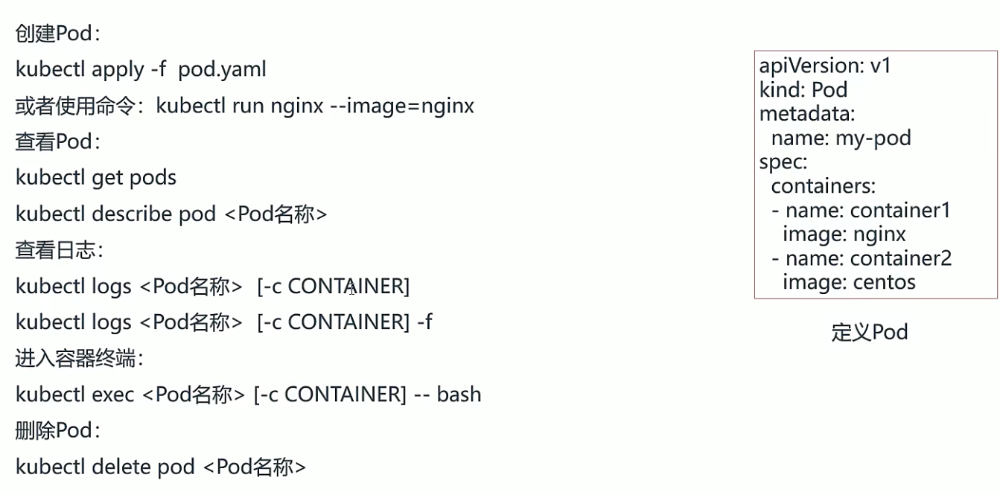

# 1.有了Docker，为什么还用Kubernetes


# 2.环境准备三台主机

```bash
# 1.设置主机名和时区
timedatectl set-timezone Asia/Shanghai
hostnamectl set-hostname master # master
hostnamectl set-hostname node1  # node1
hostnamectl set-hostname node2  # node2


# 配置hosts网络配置
vim /etc/hosts
192.168.19.137 master
192.168.19.138 node1
192.168.19.139 node2

# 关闭防火墙
[root@k8s-master ~]# systemctl stop firewalld
[root@k8s-master ~]# systemctl disable firewalld
sed -i 's/SELINUX=enforcing/SELINUX=disabled/g' /etc/selinux/config

# 安装docker
# step 1: 安装必要的一些系统工具
sudo yum install -y yum-utils device-mapper-persistent-data lvm2
# Step 2: 添加软件源信息
sudo yum-config-manager --add-repo https://mirrors.aliyun.com/docker-ce/linux/centos/docker-ce.repo
# Step 3
sudo sed -i 's+download.docker.com+mirrors.aliyun.com/docker-ce+' /etc/yum.repos.d/docker-ce.repo
# Step 4: 更新并安装Docker-CE
sudo yum makecache fast
sudo yum -y install docker-ce
# Step 4: 开启Docker服务
sudo service docker start


# 安装kubeadm
cat <<EOF > /etc/yum.repos.d/kubernetes.repo
[kubernetes]
name=Kubernetes
baseurl=https://mirrors.aliyun.com/kubernetes/yum/repos/kubernetes-el7-x86_64/
enabled=1
gpgcheck=1
repo_gpgcheck=1
gpgkey=https://mirrors.aliyun.com/kubernetes/yum/doc/yum-key.gpg https://mirrors.aliyun.com/kubernetes/yum/doc/rpm-package-key.gpg
EOF
setenforce 0
yum install -y kubelet kubeadm kubectl
systemctl enable kubelet && systemctl start kubelet

# 关闭交换分区
swapoff -a
vim /etc/fstab
# swap一行注释

# 配置网桥
cat > /etc/sysctl.d/k8s.conf <<EOF
net.bridge.bridge-nf-call-ip6tables = 1
net.bridge.bridge-nf-call-iptables = 1
EOF
sysctl --system

```


# 3.安装kubuadm

```bash
kubeadm join 192.168.19.137:6443 --token flknyj.dykek2mbjndszk2t \
    --discovery-token-ca-cert-hash sha256:b1ae30f0862edb021ff77901b05c95d2d8914bd5439e7871a1f7148599312b47 
```


# 4.快速部署一个网站


```bash
kubectl apply -f deployment.yaml
```


# 5.Deployment


```bash
# 发布
apiVersion: apps/v1
kind: Deployment
metadata:
  name: web
spec:
  replicas: 3
  selector:
    matchLabels:
      app: nginx
  template:
    metadata:
      labels:
        app: nginx
    spec:
      containers:
      - name: nginx
        image: nginx:1.16
        ports:
        - containerPort: 80

---
apiVersion: v1
kind: Service
metadata:
  name: web
spec:
  selector:
    app: nginx
  ports:
    - protocol: TCP
      port: 80
      targetPort: 80
  type: NodePort
```

```
# 升级
# 修改文件中的镜像
spec:
      containers:
      - name: nginx
        image: nginx
        
# 查看升级过程
kubectl describe deployment web
```


```bash
# 记录更新记录，在更新命令上加
--record=ture # 只能记录更新命令
```


```bash
# 可以直接使用文件
kubectl delete -f deployment.yaml
```


# 6.Pod




> Pod中使用Pause镜像启动Infra container，用来给pod中的容器提供共享卷和网络等功能


# 7.Service


```bash
# 把service导出为yaml格式
kubectl get service kubernetes -o yaml

# 找到selector中的app
# 查找service绑定的pods
kubectl getpods -l app=pvc
```


```bash
# 查看pod的标签
kubectl get pods --show-labels

apiVersion: v1
kind: Service
metadata:
  name: web
spec:
  selector:
    app: nginx
  ports:
    - protocol: TCP
      port: 80
      targetPort: 80
  type: NodePort
```


# 8.Ingress


# 9.实战

