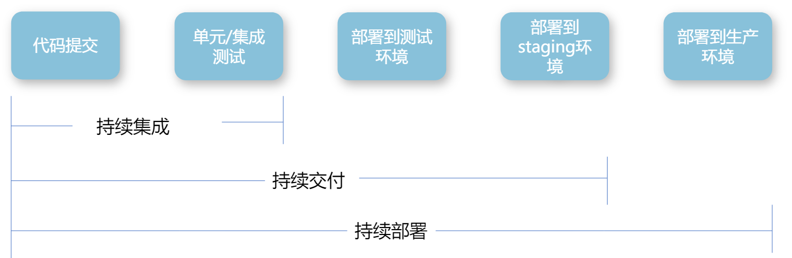

# 云原生

一般来说，云原生应用架构应该具备以下几个主要特征：

* 符合12-Factor应用
* 微服务
* 自服务敏捷基础设施
* 基于API的协作
* 抗脆弱性

云原生架构被定义为具有以下六个特质：

* 模块化(Modularity)
* 可观测性(Observability)
* 可部署性(Deployability)
* 可测试性(Testability)
* 可处理性(Disposability)
* 可替换性(Replaceability)

## 什么是云原生

云原生是一种方法，用于构建和运行充分利用云计算模型优势的应用。

云原生包含了一组应用的模式，用于帮助企业快速、持续、可靠、规模化的交付业务软件。云原生由微服务架构，devops和以容器为代表的敏捷基础架构组成。

云原生技术有利于各组织在公有云、私有云和混合云等新型动态环境中，构建和运行可弹性扩展的应用。云原生代表技术包括**容器、服务网格、微服务、不可变基础设施、声明式API、DevOps**。

* 采用微服务架构，服务与服务之间通过松耦合方式交互。
* 容器作为微服务的最佳载体，提供一个自包含的打包方式。
* 容器编排解决了微服务在生产环境的部署问题。
* 服务网络作为基础设施，解决了服务之间的通信。
* 不可变基础设施提升发布效率，方便快速扩展。
* 声明式API让系统更加健壮。
* DevOps缩短研发周期，增加部署频率，更安全方便。

云原生四大特点：

* 容器化封装
* 面向微服务
* 自动化管理
* 持续交付

这些技术能够构建容错性好、易于管理和便于观察的松耦合系统。结合可靠的自动化手段，云原生技术使工程师能够轻松的对系统做出频繁和可预测的重大变更。

## 云原生关键技术

### 微服务

微服务使一种用于构建应用的架构方案。它将一个复杂的应用拆分成多个独立自治的服务，服务与服务间通过松耦合的形式交互。

**单体应用存在的问题：**

* 系统间通常以API的形式互相访问，耦合紧密导致难以维护。
* 各业务领域只需要采用相同的技术栈，难以快速应用鑫技术，阻碍创新。
* 对系统的任何修改都必须整个系统一起重新部署/升级，运维成本高。
* 在系统负载增加时，难以进行水平扩展。
* 在系统中一处出现问题时，会影响整个系统。

### 微服务架构

* 服务网关：身份认证、路由服务、限流防刷、日志统计。
* 服务注册与发现。
* 服务通信：RPC、REST、异步消息。
* 可靠性：服务降级、容灾、断路器、舱壁模式。
  * 服务降级：组件出现故障时，能隔离这些故障并且能做到优雅的服务降级。
  * 断路器：断路器（Circuit Breaker）是一种用于防止故障级联和提高系统可用性的设计模式。当在短时间内多次发生指定类型的错误，断路器会开启。断路器通常在一定时间后关闭，以便为底层服务提供足够的空间来恢复。
  * 舱壁模式：通过使用舱壁模式来保护有限的资源不被耗尽。
  * 冗余与容灾：一个实例故障后，可以由其他实例继续提供服务。考虑采用跨数据中心的主备、主从甚至是多活。

### 容器

**容器运行时：容器是一种打包应用的方式，可以帮你打包应用中的所有软件和软件所依赖的环境，并且可以运行在任何运行容器的环境上。**

容器技术的优势：

* 更高效的利用系统资源。
* 更快速的启动时间。
* 一致的运行环境。
* 持续交付和部署。
* 更轻松的迁移。
* 更轻松的维护和扩展。

**容器编排：自动化管理和协调容器方方面面的系统；专注于容器的生命周期管理和调度。**

功能：

* 调度
* 资源管理
* 服务管理
  * 负载均衡
  * 健康检查

### 服务网格

服务网格(Service Mesh)是致力于解决服务间通讯的基础设施层。它负责在现代云原生应用程序的复杂服务拓扑来可靠的传递请求。实际上，service Mesh通常是通过一组轻量级网络代理(sidecar proxy)，与应用程序代码部署在一起来实现，且对应用程序透明。

Service Meth有以下几个特点：

* 应用程序间通讯的中间层。
* 轻量级网络代理。
* 应用程序无感知。
* 解耦应用程序的重试/超时/监控和服务发现。

### 不可变基础设施

不可变基础设施：任何基础设施的实例(包括服务器、容器等各种软硬件)一旦创建之后便成为一种只读状态，不可对其进行任何更改。如果需要修改或升级某些实例，唯一的方式就是创建一批鑫的实例进行替换。

不可变基础设施特点：

* 可以频繁通过代码或者配置定义和构建一组基础设施，并且是自动化的不可变的。
* 以API的方式提供弹性/按需的计算、存储能力。
* 业务可以随时拉取一套基础设施来服务于开发、测试、联调和灰度上线等需求。

不可变基础设施的优势：

* 提升发布应用效率。
* 没有雪花服务器。
* 快速水平扩展。
* 简单的回滚和恢复。

### 声明式API

声明式API：

* 在命令式API中，可以直接发出让服务器执行的命令，例如：运行容器等。
* 在声明式API中，可以声明期望的状态，系统将不断调整实际状态，直到与期望状态保持一致。
* 使用声明式API可以使系统更加健壮。

### DevOps

DevOps：

* 一组过程，方法和系统的统称。
* 开发和运维之间建立合作，更快速的发布新版本。
* 目标：缩短开发周期，增加部署频率，更可靠的发布。

持续集成，持续交付，持续部署流程：\
CI/CD（持续集成/持续交付或持续部署）是 SoftWare Enginerring（软件工程) 中实施 DevOps 方法的关键自动化组件。简而言之，CI/CD 是实践 DevOps 方法的一种手段，它们是相辅相成的。

DevOps 是一种跨职能团队协作、文化和方法，旨在将软件开发和运维团队更紧密地结合在一起。这一整套实践和理念帮助企业快速交付高质量、高性能的软件，以满足用户需求。

CI/CD 是实现 DevOps 的重要细节工具。CI（持续集成）指的是自动地将新代码集成到现有项目中，持续进行构建、测试并发现变更引入的错误。CD （持续交付或部署，取决于组织需要）是确保新的更改能够自动、可靠地部署到生产环境。

## 云原生和传统应用差异

|       | 部署可预测性 | 抽象性    | 弹性能力                   | 开发运维模式               | 服务架构    | 恢复能力                |
| ----- | ------ | ------ | ---------------------- | -------------------- | ------- | ------------------- |
| 云原生应用 | 可预测    | 操作系统抽象 | 弹性调度                   | DevOps               | 微服务解耦架构 | 自动化运维快速恢复           |
| 传统应用  | 不可预测   | 依赖操作系统 | 
资源冗余多 缺乏扩展能力
 | 
瀑布式开发 部门孤立
 | 单体耦合架构  | 
手动运维 恢复缓慢
 |

## 12-Factor

如今，软件通常会作为一种服务来交付，12-Factor为构建如下的SaaS应用提供了方法论：

* 使用标准化流程自动配置，从而使新的开发者花费最小的学习成本加入这个项目
* 和操作系统之间尽可能的划清界限，在各个系统中提供最大的可移植性
* 适合部署在现代的云计算平台，从而在服务器和系统管理方面节省资源
* 将开发环境和生产环境的差异降至最低，并使用持续交付实施敏捷开发
* 可以在工具、架构和开发流程不发生明显变化的前提下实现扩展

| Factor                        | 描述                  |
| ----------------------------- | ------------------- |
| 1.Codebase基准代码                | 一份基准代码，多份部署         |
| 2.Dependencies依赖              | 显示声明依赖关系            |
| 3.Config配置                    | 在环境中存储配置            |
| 4.Backing services后端服务        | 把后端服务当作附加资源         |
| 5.Build，Release，run构建，发布，运行   | 严格分离构建和运行           |
| 6.Processes进程                 | 以一个或多个无状态进程运行应用     |
| 7.Port binding端口绑定            | 通过端口绑定提供服务          |
| 8.Concurrency并发               | 通过进程模型进行扩展          |
| 9.Disposability可处理            | 快速启动和优雅终止可最大化健壮性    |
| 10.Dev/prod parity开发环境与线上环境等价 | 尽可能的保持开发，预发布，线上环境相同 |
| 11.Logs日志                     | 把日志当作事件流            |
| 12.Admin processes管理进程        | 后台管理任务当作一次性进程运行     |

### 基准代码

**一份基准代码，多份部署**
