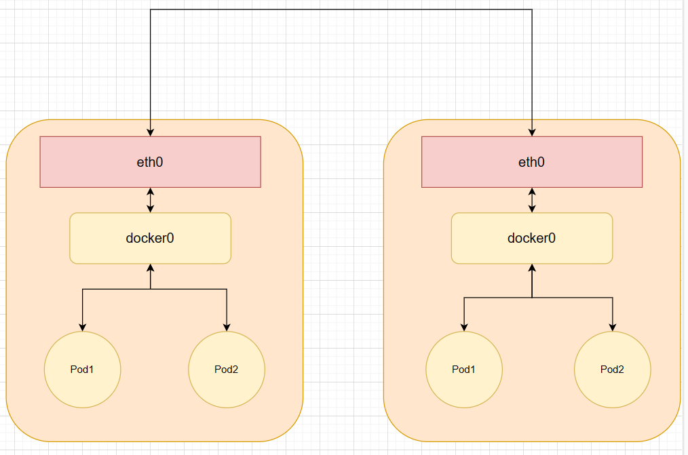

# kubernetes网络

kubernetes网络主要分为分为

1. **节点网络**
2. **Pod网络**
3. **服务网络**

## 1.Pod网络

每个Pod拥有一个IP，每个Pod中的容器共享一个网络空间，Pod中的容器分为pause容器和应用程序容器，应用程序容器通过networkmode字段设置container网络类型与pause共享一个网络空间，Pod网络一般与docker0网桥一个网段，但是Pod需要多主机通信，所以各个节点上Pod IP不能相同，所以kubernetes提供Flannel、calico等CNI（Container Network Interface）插件来解决这个问题，Pod网络本质\
上还是容器网络**相同节点的Pod通信过程**和容器之间的通信过程相同，都是通过docker0网桥进行通信


但是**不同节点的Pod通信**就不一样了，当Pod需要通信时，会发送消息到主机的veth(虚拟网络设备对)接口上，然后发送到另一个主机的虚拟网桥上，再由虚拟网桥将数据包路由到目标Pod veth接口\
具体过程如下：\
1、**Pod创建**：当在集群中创建一个Pod时，首先会通过apiserver将Pod的配置写入。然后，apiserver的一些管控组件（比如Scheduler）会将Pod调度到某个具体的节点上去。Node节点上的Kubelet监听到这个Pod的创建之后，它首先\
会读取配置目录中的配置文件，配置文件里面会声明所使用的是哪一个插件，然后去执行具体的CNI插件的二进制文件，再由CNI插件进入Pod的网络空间去配置Pod的网络。

2、**虚拟网桥和veth接口**：在这个过程中，CNI插件会为Pod创建一个网络命名空间，并将其中一个veth接口连接到该命名空间中，另一个veth接口保留在主机的网络命名空间中，并连接到CNI插件创建的虚拟网桥上。

3、**跨节点通信**：当跨节点的Pod需要通信时，本节点内无法找到目标Pod的MAC地址，则会查找三层路由表转发，这需要依靠不同节点间的网络配置来实现。对于如何来配置网络，k8s在网络这块自身并没有实现网络规划的具体逻辑，而是制定了一套CNI接口规范，开放给社区来实现。目前主流的网络配置方案有：Flannel、weave、calico，Macvlan等。

4、**Flannel覆盖网络**：在flannel覆盖网络中，不同节点上的Pod之间通信是通过overlay network（覆盖网络）实现的。当一个Pod发送数据包时，数据包会通过其veth接口被发送到主机网络命名空间中的veth接口，然后该veth接口\
会将数据包发送到虚拟网桥上。虚拟网桥又会将数据包路由到目标Pod的veth接口，最终将数据包发送到目标Pod。



## 2.Service网络

service与pod的通信：\
1、**创建Pod**：用户通过REST API创建一个Pod，apiserver将其写入etcd。然后，scheduler检测到未绑定Node的Pod，开始调度并更新Pod的Node绑定。kubelet检测到有新的Pod调度过来，通过container runtime运行该Pod。

2、**创建Service**：当我们在K8s中创建一个Service时，Kubernetes会为其分配一个虚拟IP地址。这个IP地址与Service的生命周期绑定在一起，只要Service存在，它就不会改变。

3、**Pod与Service通信**：Pod之间的网络通信是通过集群内的虚拟网络实现的，Kubernetes使用了一种名为"Overlay Network"的技术。当Service被创建时，Kubernetes会为其分配一个虚拟IP地址，并为每个Pod创建一个有唯一IP地址的虚拟子网。Pod中的应用程序可以通过Service的虚拟IP和端口与其他Pod进行通信。

4、**Endpoints**：当我们在创建service的时候如果我们设置了selector选中了需要关联的pod，那么就会创建一个与service同名的endpoints。他是用来记录service对应pod的访问地址。

5、**kube-proxy**：kube-proxy是对service的实现，也就是service只是用来抽象定义，真正具体化干活的是kube-proxy。它运行在每一个node节点上，负责该节点的网络代理。它是一个pod。

kubernetes中的Service与Pod之间的通信实际上是通过**iptables**进行的。kube-proxy可以运行在iptables模式下，当创建了一个Service之后，kube-proxy会为其创建一组iptables规则，用来实现流量的路由和负载均衡

当一个请求发送到Service的ClusterIp和端口时，iptables规则会将请求重定向到后端Pod的IP和端口。这样，就可以实现将流量从Service均匀的分发到后端的多个Pod上。

## 3.CNI

**CNI**：CNI，全称为**Container Network Interface**，即容器网络的API接口。它是Kubernetes（K8s）中标准的一个调用网络实现的接口。CNI最初是由CoreOS为rkt容器引擎创建的，随着不断发展，已经成为事实标准。目前绝大部\
分的容器平台都采用CNI标准（如rkt，Kubernetes ，OpenShift等）。

CNI通过JSON格式的配置文件来描述网络配置，当需要设置容器网络时，由容器运行时负责执行CNI插件，并通过CNI插件的标准输入（stdin）来传递配置文件信息，通过标准输出（stdout）接收插件的执行结果。

CNI仅关心容器创建时的网络分配，和当容器被删除时释放网络资源。这意味着CNI负责处理容器的网络设置，包括IP地址分配、路由设置和DNS设置等。

总的来说，CNI提供了一种通用、插件化的方式来配置和管理容器的网络连接，使得不同的网络解决方案可以以一种统一、标准化的方式与各种容器运行时进行交互

### 1.Flannel

**Flannel**是一个专为kubernetes定制的三层网络解决方案，主要用于解决容器的跨主机通信问题。

Flannel是一个kubernetes网络插件，专门用来设置kubernetes集群中容器的网络地址空间。Flannel利用etcd来存储整个集群的网络配置。

每个节点都运行着一个Flannel的代理服务flanneld。该代理程序会为当前节点从集群的网络地址空间中，获取一个子网，本节点的所有容器的IP地址都将从该子网中分配


**跨主机Pod通信，会由flanneld去向etcd查询路由信息后封装到udp报文中，发送给另一个主机的flanneld，然后由flanneld解封装后由flannel0网卡和docker0网卡转发到目的Pod中**

**Flannel工作流程大致如下**：

1. **启动flanneld**：当一个节点加入到集群中时，flanneld服务会在该节点上启动
2. **申请子网**：flanneld服务会向etcd发出请求，从预定义的更大的IP地址池中申请一个子网。
3. **生成subnet.env文件**：一旦子网被分配，flanneld服务会在本地生成一个名位subnet.env的文件，其中记录了该节点的子网信息，包括子网地址和网关等。
4. **更新etcd**：同时，flanneld服务也会将这个新分配的子网信息写回到etcd中，以便其他节点可以知道这个新节点的网络配置

**subnet.env文件记录信息：**

* **FLANNEL\_NETWORK**：整个Flannel网络的地址范围。
* **FLANNEL\_SUBNET**：当前主机分配的子网地址范围。
* **FLANNEL\_MTU**：Flannel网络的最大传输单元（MTU）。
* **FLANNEL\_IPMASQ**：是否启用IP伪装。

在所有节点安装完Flannel后，要在**Master节点**上配置网络信息

```bash
etcdctl --endpoints http://192.168.21.135:2379 set /coreos.comnetwork/config '{Network: "10.0.0.0/16", "SubnetLen":24, "SubnetMin": "10.0.1.0","SubnetMax":"10.0.20.0","Backend":{"Type":"vxlan"}}'
# set：etcd v3 api中使用put
# Network:整个Flannel网络的地址范围是10.0.0.0/16
# SubnetLen：每个子网的长度是24位
# SubnetMin和SubnetMax：设置子网范围，这里设置的是10.0.1.0-10.0.20.0，每个节点分配一个子网，所以能给20个节点分配
# Backend：使用后端类型为vxlan
```

Flannel的后端类型主要有三种：

1. **VXLAN**：
   * **通信过程**：VXLAN是一种overlay技术，它在内核中实现，只经过一次协议栈，在协议栈内就把VXLAN包组装好。flannel.1设备是一个VXLAN类型的设备，负责VXLAN封包解包。在发送端，flannel.1将原始L2报文封装成VXLAN UDP报文，然后从eth0发送。接收端收到UDP报文后，发现是一个VXLAN类型报文，交由flannel.1进行解包。
   * **优点**：VXLAN模式是二层实现，overlay是二层帧，属于mac in udp。因此，实现起来会设计mac地址学习，arp广播等二层知识。
   * **缺点**：性能较低，但是性能比udp性能高，只需要经历一次容器到docker0的用户态到内核态转换，flannel.1/主机网卡都处于内核。
2. **host-gw**：
   * **通信过程**：host-gw模式属于路由的方式，由于没有经过任何封装，纯路由实现，数据只经过协议栈一次。我们像划分物理网段那样，对所有主机划分虚拟网络段。当确保虚拟网段不会冲突时，我们就可以预先的在每一台主机上对路由表进行修改，把所有虚拟网段直接映射到其对应的物理地址上。
   * **优点**：全程都在内核中完成，是三种类型中性能最高的。
   * **缺点**：需要确保所有主机都在同一个子网内。
3. **UDP**：
   * **通信过程**：使用UDP模式的前提同样是对集群的虚拟网段进行划分。我们会把虚拟网段和物理地址的映射记录到数据库中，比如etcd。当用户尝试向某个虚拟地址发包时会被路由到TUN设备flannel0上，并传输给常驻进程flanneld，flanneld把用户报文通过UDP封装一层，并查询数据库，把UDP报头目的地址设为目标物理地址，然后再发出去。
   * **优点**：简单易用。
   * **缺点**：因为使用了flannel自定的一种包头协议性，数据是在用户态进行封包和解包的，所以在发出IP包的过程中需要经过3次用户态与内核态之间的数据拷贝，经历容器到docker0，docker0到flannel0，flannel0到网卡的三次用户态到内核态的切换。

flannel配置文件解析：

```bash
# Flanneld configuration options

# etcd url location. Point this to the server where etcd runs
FLANNEL_ETCD_ENDPOINTS="http://your-etcd-endpoint:2379"

# etcd config key. This is the configuration key that flannel queries
# For address range assignment
FLANNEL_ETCD_PREFIX="/atomic.io/network"

# Any additional options that you want to pass
# FLANNEL_OPTIONS=""


# FLANNEL_ETCD_ENDPOINTS字段定义了etcd服务的URL。你需要将这个值设置为你的etcd服务的实际地址，设置集群所有节点地址。
# FLANNEL_ETCD_PREFIX字段定义了flannel在etcd中查询地址范围分配信息的键。
# FLANNEL_OPTIONS字段可以用于传递任何其他你想要的选项。

# 重启
sudo systemctl daemon-reload
sudo systemctl restart flanneld
```

### 2.对Docker进行设置

安装设置完flannel后，对每个节点的docker进行设置，运行docker前必须先运行flannel

1.  在/etc/docker/daemon.json文件设置

    ```json
    {
      "bip": "10.244.1.1/24"
    }
    # 设置分配的子网ip
    ```
2.  配置systemd

    ```bash
    # 可以使用mk-docker-opts.sh把subnet.env文件转换为docker启动参数
    这个脚本接受以下选项：
    -f：flannel环境文件的路径。默认为/run/flannel/subnet.env。
    -d：要写入的Docker环境文件的路径。默认为/run/docker_opts.env。
    -i：将每个Docker选项输出为单独的变量。例如，DOCKER_OPT_MTU=1500。
    -c：将组合的Docker选项输出到DOCKER_OPTS变量。
    -k：将组合选项的键设置为此值（默认为DOCKER_OPTS=）。
    # /usr/lib/systemd/system/docker.service设置启动参数
    [Service]
    EnvironmentFile=-docker_opts.env
    ```

设置完参数后，记得重启docker。
