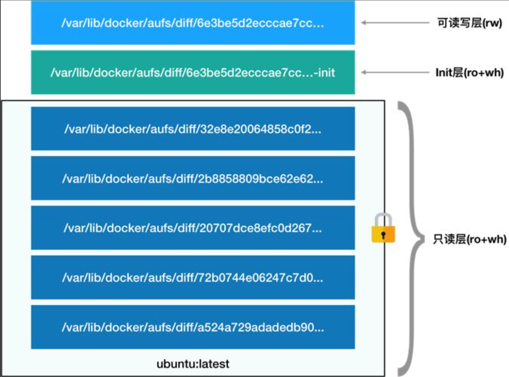

> 本章内容包括：
> - Mount Namespace工作原理
> - 容器的一致性
> - UnionFS
> - OverlayFS

在前面两节中，介绍了Linux容器最基础的两种技术：Namespace和Cgroups。希望此时，你已经彻底理解了"**容器的本质是一种特殊的进程**"这个最重要的概念。

正如前面所说的，Namespace的作用是隔离，它让应用只能看到该Namespace内的世界；而Cgroups的作用是限制，它给这个世界围上了一圈看不见的墙。这么一折腾，进程就真的被装在了一个与世隔绝的房间里，而这些房间就是PaaS项目赖以生存的应用沙盒。

可是，还有一个问题不知道你有没有仔细思考过：这个房间四周虽然有了墙，但是如果容器进程低头一看地面，又是怎样一副景象呢？

换句话说，**容器里的进程看到的文件系统又是什么样子的呢**？
# 1 Mount Namespace
可能你立刻就能想到，这一定是一个关于Mount Namespace的问题：容器里的应用进程，理应看到一份完全独立的文件系统。这样，它就可以在自己的容器目录（比如/tmp）下进行操作，而完全不会受宿主机以及其他容器的影响。

那么，真实情况是这样的吗？

事实上，就算真的为一个进程指定了一个新的Mount Namespace，但在这个进程里查看文件还是宿主机中的文件。

也就是说，就算开启了Mount Namespace，容器进程看到的文件系统也跟宿主机完全一样。

这是怎么一回事呢？

其实，**Mount Namespace修改的，是容器进程对文件系统"挂载点"的认知**。但是，这也意味着，只有在挂载这个操作发生之后，进程的视图才会被改变。而在此之前，新创建的容器会直接继承宿主机的各个挂载点。

这时，你可能已经想到了一个解决办法：创建新进程时，除了声明要启用Mount Namespace之外，我们还可以告诉容器进程，有哪些目录需要重新挂载，就比如这个/tmp目录。

这就是Mount Namespace跟其他Namespace使用略有不同的地方：**它对容器进程视图的改变，一定是伴随着挂载操作才能生效**。

可是，作为一个普通用户，我们希望的是一个更友好的情况：每当创建一个新容器时，我希望容器进程看到的文件系统就是一个独立的隔离环境，而不是继承自宿主机的文件系统。怎么才能做到这一点呢？

不难想到，我们可以在容器进程启动之前重新挂载它的整个根目录“/”​。而由于Mount Namespace的存在，这个挂载对宿主机不可见，所以容器进程就可以在里面随便折腾了。
# 2 rootfs

在Linux操作系统里，有一个名为chroot的命令可以帮助你在shell中方便地完成这个工作。顾名思义，它的作用就是帮你“change root file system”​，即改变进程的根目录到你指定的位置。它的用法也非常简单。

假设，我们现在有一个$HOME/test目录，想要把它作为一个/bin/bash进程的根目录。
```bash
chroot $HOME/test /bin/bash
```
这时，你如果执行"ls /"，就会看到，它返回的都是$HOME/test目录下面的内容，而不是宿主机的内容。

更重要的是，对于被chroot的进程来说，它并不会感受到自己的根目录已经被“修改”成$HOME/test了。

这种视图被修改的原理，是不是跟前面介绍的Linux Namespace很类似呢？

实际上，**Mount Namespace正是基于对chroot的不断改良才被发明出来的，它也是Linux操作系统里的第一个Namespace**。

当然，为了能够让容器的这个根目录看起来更“真实”​，我们一般会在这个容器的根目录下挂载一个完整操作系统的文件系统，比如Ubuntu16.04的ISO。这样，在容器启动之后，我们在容器里通过执行"ls /"查看根目录下的内容，就是Ubuntu 16.04的所有目录和文件。

而**这个挂载在容器根目录上，用来为容器进程提供隔离后执行环境的文件系统，就是所谓的容器镜像。它还有个更为专业的名字，叫做：rootfs(根文件系统)**。

所以，一个最常见的rootfs，或者说容器镜像，会包括一个操作系统的常见目录和文件。

所以，对Docker项目来说，它最核心的原理实际上就是为待创建的用户进程：
- 启用Linux Namespace配置；
- 设置指定的Cgroups参数；
- 切换进程根目录(Change root)。

这样，一个完整的容器就诞生了。不过，Docker项目在最后一步的切换上会优先使用pivot_root系统调用，如果系统不支持，才会使用chroot。这两个系统调用虽然功能类似，但是也有细微的区别，这一部分小知识就交给你课后去探索了

另外，**需要明确的是，rootfs只是一个操作系统所包含的文件、配置和目录，并不包括操作系统内核。在Linux操作系统中，这两部分是分开存放的，操作系统只有在开机启动时才会加载指定版本的内核镜像**。

所以说，rootfs只包括了操作系统的“躯壳”​，并没有包括操作系统的“灵魂”​。那么，对于容器来说，这个操作系统的“灵魂”又在哪里呢？

实际上，同一台机器上的所有容器，都共享宿主机操作系统的内核。

这就意味着，如果你的应用程序需要配置内核参数、加载额外的内核模块，以及跟内核进行直接的交互，你就需要注意了：**这些操作和依赖的对象，都是宿主机操作系统的内核，它对于该机器上的所有容器来说是一个“全局变量”​，牵一发而动全身**。

这也是容器相比于虚拟机的主要缺陷之一：**毕竟后者不仅有模拟出来的硬件机器充当沙盒，而且每个沙盒里还运行着一个完整的Guest OS给应用随便折腾**。

不过，**正是由于rootfs的存在，容器才有了一个被反复宣传至今的重要特性：一致性**。
# 3 容器的一致性

什么是容器的一致性呢？

还没有容器的时候，由于云端与本地服务器环境不同，应用的打包过程，一直是使用PaaS时最“痛苦”的一个步骤。

但有了容器之后，更准确地说，有了容器镜像（即rootfs）之后，这个问题被非常优雅地解决了。

**由于rootfs里打包的不只是应用，而是整个操作系统的文件和目录，也就意味着，应用以及它运行所需要的所有依赖都被封装在了一起。**

事实上，对于大多数开发者而言，他们对应用依赖的理解，一直局限在编程语言层面。比如Golang的Godeps.json。但实际上，一个一直以来很容易被忽视的事实是，**对一个应用来说，操作系统本身才是它运行所需要的最完整的“依赖库”**​。

有了容器镜像打包操作系统的能力，这个最基础的依赖环境也终于变成了应用沙盒的一部分。这就赋予了容器所谓的一致性：**无论在本地、云端，还是在一台任何地方的机器上，用户只需要解压打包好的容器镜像，那么这个应用运行所需要的完整的执行环境就被重现出来了。**

**这种深入到操作系统级别的运行环境一致性，打通了应用在本地开发和远端执行环境之间难以逾越的鸿沟。**

不过，这时你可能已经发现了另一个非常棘手的问题：难道我每开发一个应用，或者升级一下现有的应用，都要重复制作一次rootfs吗？

比如，我现在用Ubuntu操作系统的ISO做了一个rootfs，然后又在里面安装了Java环境，用来部署我的Java应用。那么，我的另一个同事在发布他的Java应用时，显然希望能够直接使用我安装过Java环境的rootfs，而不是重复这个流程。

一种比较直观的解决办法是，我在制作rootfs的时候，每做一步“有意义”的操作，就保存一个rootfs出来，这样其他同事就可以按需求去用他需要的rootfs了。

但是，这个解决办法并不具备推广性。原因在于，一旦你的同事们修改了这个rootfs，新旧两个rootfs之间就没有任何关系了。这样做的结果就是极度的碎片化。

那么，既然这些修改都基于一个旧的rootfs，我们能不能以增量的方式去做这些修改呢？这样做的好处是，所有人都只需要维护相对于base rootfs修改的增量内容，而不是每次修改都制造一个“fork”​。

答案是肯定的。这也是为何，Docker公司在实现Docker镜像时并没有沿用以前制作rootfs的标准流程，而是做了一个小小的创新：
>**Docker在镜像的设计中，引入了层(layer)的概念。也就是说，用户制作镜像的每一步操作，都会生成一个层，也就是一个增量rootfs。**

当然，这个想法不是凭空臆造出来的，而是用到了一种叫做联合文件系统(Union File System)的能力。
# 4 UnionFS
**Union File System也叫UnionFS，最主要的功能是将多个不同位置的目录联合挂载（union mount）到同一个目录下。** 比如，我现在有两个目录A和B，它们分别有两个文件：
```bash
$ tree
.
├── A
│   ├── a
│   └── x
└── B
    ├── b
    └── x
```

然后，我使用联合挂载的方式，将这两个目录挂载到一个公共的目录C上：
```bash
$ mkdir C 
$ mount -t aufs -o dirs=./A:./B none ./C
```
这时，我再查看目录C的内容，就能看到目录A和B下的文件被合并到了一起：
```bash
$ tree ./C 
./C 
├── a 
├── b 
└── x
```
可以看到，在这个合并后的目录C里，有a、b、x三个文件，并且x文件只有一份。这，就是“合并”的含义。此外，如果你在目录C里对a、b、x文件做修改，这些修改也会在对应的目录A、B中生效。

那么，在Docker项目中，又是如何使用这种Union File System的呢？

可以在命令`docker info`中查看使用的联合文件系统类型。
```bash
$ sudo docker info
```
Centos系统使用的是`overlay`，而Ubuntu使用的是`aufs`。

可以启动一个容器，比如：
```bash
$ docker run -d ubuntu:latest sleep 3600
```
这时候，Docker就会从Docker Hub上拉取一个Ubuntu镜像到本地。

这个所谓的“镜像”​，实际上就是一个Ubuntu操作系统的rootfs，它的内容是Ubuntu操作系统的所有文件和目录。不过，与之前我们讲述的rootfs稍微不同的是，Docker镜像使用的rootfs，往往由多个“层”组成：
```bash
$ docker image inspect ubuntu:latest 
... 
"RootFS": { 
"Type": "layers", 
"Layers": [ 
"sha256:f49017d4d5ce9c0f544c...", 
"sha256:8f2b771487e9d6354080...", 
"sha256:ccd4d61916aaa2159429...", 
"sha256:c01d74f99de40e097c73...", 
"sha256:268a067217b5fe78e000..." 
] 
}
```
可以看到，这个Ubuntu镜像，实际上由五个层组成。这五个层就是五个增量rootfs，每一层都是Ubuntu操作系统文件与目录的一部分；而在使用镜像时，Docker会把这些增量联合挂载在一个统一的挂载点上（等价于前面例子里的“/C”目录）​。

这个挂载点就是/var/lib/docker/aufs/mnt/，比如：
```bash
/var/lib/docker/aufs/mnt/6e3be5d2ecccae7cc0fcfa2a2f5c89dc21ee30e166be823ceaeba15dce645b3e
```
不出意外的，这个目录里面正是一个完整的Ubuntu操作系统：
```bash
$ ls /var/lib/docker/aufs/mnt/6e3be5d2ecccae7cc0fcfa2a2f5c89dc21ee30e166be823ceaeba15dce645b3e 
bin boot dev etc home lib lib64 media mnt opt proc root run sbin srv sys tmp usr var
```

那么，前面提到的五个镜像层，又是如何被联合挂载成这样一个完整的Ubuntu文件系统的呢？

这个信息记录在AuFS的系统目录/sys/fs/aufs下面。

首先，通过查看AuFS的挂载信息，我们可以找到这个目录对应的AuFS的内部ID（也叫：si）​：
```bash
$ cat /proc/mounts| grep aufs 
none /var/lib/docker/aufs/mnt/6e3be5d2ecccae7cc0fc... aufs rw,relatime,si=972c6d361e6b32ba,dio,dirperm1 0 0
```
即，si=972c6d361e6b32ba。

然后使用这个ID，你就可以在/sys/fs/aufs下查看被联合挂载在一起的各个层的信息：
```bash
$ cat /sys/fs/aufs/si_972c6d361e6b32ba/br[0-9]* /var/lib/docker/aufs/diff/6e3be5d2ecccae7cc...=rw /var/lib/docker/aufs/diff/6e3be5d2ecccae7cc...-init=ro+wh /var/lib/docker/aufs/diff/32e8e20064858c0f2...=ro+wh /var/lib/docker/aufs/diff/2b8858809bce62e62...=ro+wh /var/lib/docker/aufs/diff/20707dce8efc0d267...=ro+wh /var/lib/docker/aufs/diff/72b0744e06247c7d0...=ro+wh /var/lib/docker/aufs/diff/a524a729adadedb90...=ro+wh
```
从这些信息里，我们可以看到，镜像的层都放置在/var/lib/docker/aufs/diff目录下，然后被联合挂载在/var/lib/docker/aufs/mnt里面。

而且，从这个结构可以看出来，这个容器的rootfs由如下图所示的三部分组成：


**第一部分：只读层**

它是这个容器的rootfs最下面的五层，对应的正是ubuntu:latest镜像的五层。可以看到，它们的挂载方式都是只读的（ro+wh，即readonly+whiteout）​。
```bash
$ ls /var/lib/docker/aufs/diff/72b0744e06247c7d0... 
etc sbin usr var 
$ ls /var/lib/docker/aufs/diff/32e8e20064858c0f2... 
run 
$ ls /var/lib/docker/aufs/diff/a524a729adadedb900... 
bin boot dev etc home lib lib64 media mnt opt proc root run sbin srv sys tmp usr var
```
可以看到，这些层，都以增量的方式分别包含了Ubuntu操作系统的一部分。

**第二部分：可读写层**

它是这个容器的rootfs最上面的一层（6e3be5d2ecccae7cc）​，它的挂载方式为：rw，即read write。在没有写入文件之前，这个目录是空的。而一旦在容器里做了写操作，你修改产生的内容就会以增量的方式出现在这个层中。

可是，你有没有想到这样一个问题：如果我现在要做的，是删除只读层里的一个文件呢？

为了实现这样的删除操作，AuFS会在可读写层创建一个whiteout文件，把只读层里的文件“遮挡”起来。

比如，你要删除只读层里一个名叫foo的文件，那么这个删除操作实际上是在可读写层创建了一个名叫.wh.foo的文件。这样，当这两个层被联合挂载之后，foo文件就会被.wh.foo文件“遮挡”起来，​“消失”了。这个功能，就是“ro+wh”的挂载方式，即只读+whiteout的含义​。

所以，最上面这个可读写层的作用，就是专门用来存放你修改rootfs后产生的增量，无论是增、删、改，都发生在这里。而当我们使用完了这个被修改过的容器之后，还可以使用docker 。采用的方法为Copy-on-Write，**核心思想是：在需要修改资源（如文件或内存页）之前，不实际复制资源，而是共享资源的只读副本。只有在第一次写操作时，才进行实际的复制操作。这种方式可以显著减少不必要的复制操作，提高资源利用效率**。

commit和push指令，保存这个被修改过的可读写层，并上传到Docker Hub上，供其他人使用；而与此同时，原先的只读层里的内容则不会有任何变化。这，就是增量rootfs的好处。

**第三部分：init层**

它是一个以“-init”结尾的层，夹在只读层和读写层之间。Init层是Docker项目单独生成的一个内部层，专门用来存放/etc/hosts、/etc/resolv.conf等信息。

需要这样一层的原因是，这些文件本来属于只读的Ubuntu镜像的一部分，但是用户往往需要在启动容器时写入一些指定的值比如hostname，所以就需要在可读写层对它们进行修改。

可是，这些修改往往只对当前的容器有效，我们并不希望执行docker commit时，把这些信息连同可读写层一起提交掉。

所以，Docker做法是，在修改了这些文件之后，以一个单独的层挂载了出来。而用户执行docker commit只会提交可读写层，所以是不包含这些内容的。

最终，这7个层都被联合挂载到/var/lib/docker/aufs/mnt目录下，表现为一个完整的Ubuntu操作系统供容器使用。
# 5 OverlayFS

`overlay2` 是 Docker 默认的存储驱动，支持多层叠加，性能较好，适合大多数场景。适用于大多数现代 Linux 发行版，如 Ubuntu、Debian、CentOS 等。AUFS在某些老旧Linux发行版中使用。

可以使用docker命令来查看使用的存储驱动
```bash
$ docker info --format '{{.Driver}}'                  
overlay2
```
你也可能会看到其他不同的结果，可以在启动 docker daemon 的时候，通过 `--storage-driver` 参数进行指定，也可以在 `/etc/docker/daemon.json` 文件中通过 `storage-driver` 字段进行配置。
```bash
# 检查无在运行的容器和 overlay 挂载
$ mount |grep overlay
$ docker ps
CONTAINER ID        IMAGE               COMMAND             CREATED             STATUS              PORTS               NAMES

# 启动一个容器
$ docker run --rm -d alpine sleep 99999                         
caa9517ce0d799602735a30aaaaf123c07e07ff6e44c5a4b07e776af85780abe
$ docker ps
CONTAINER ID        IMAGE               COMMAND             CREATED             STATUS              PORTS               NAMES
caa9517ce0d7        alpine              "sleep 99999"       23 seconds ago      Up 22 seconds                           hopeful_dubinsky

# 检查 overlay 挂载
$ mount |grep overlay                  
overlay on /var/lib/docker/overlay2/f4356a8f14342008fc298bf3d313b863d10f30ef447a3b2f51ea9ece0dec09db/merged type overlay (rw,relatime,seclabel,lowerdir=/var/lib/docker/overlay2/l/5OO3RLRXHJPEH3IFEXNCTO4PY5:/var/lib/docker/overlay2/l/UVA7IR67ZZTN2BNTKCZ7T6HUWU,upperdir=/var/lib/docker/overlay2/f4356a8f14342008fc298bf3d313b863d10f30ef447a3b2f51ea9ece0dec09db/diff,workdir=/var/lib/docker/overlay2/f4356a8f14342008fc298bf3d313b863d10f30ef447a3b2f51ea9ece0dec09db/work)
```
可以看到，在启动容器后，系统上多了一个 OverlayFS (overlay) 的挂载。注意看其中的几个内容：
- 挂载点在：`/var/lib/docker/overlay2/f4356a8f14342008fc298bf3d313b863d10f30ef447a3b2f51ea9ece0dec09db/merged`
```bash
sudo ls /var/lib/docker/overlay2/f4356a8f14342008fc298bf3d313b863d10f30ef447a3b2f51ea9ece0dec09db/merged
bin  dev  etc  home  lib  media  mnt  opt  proc  root  run  sbin  srv  sys  tmp  usr  var
```

- `lowerdir`: 这是是我们 mount 中指定的目录。
这个 `lowerdir` 中包含两个目录，这是使用了内核对 OverlayFS multi layer 特性的支持，我们分别查看下其中内容：
```bash
$  ls -a /var/lib/docker/overlay2/l/5OO3RLRXHJPEH3IFEXNCTO4PY5
.  ..  dev  .dockerenv  etc
$  ls -a /var/lib/docker/overlay2/l/UVA7IR67ZZTN2BNTKCZ7T6HUWU
.  ..  bin  dev  etc  home  lib  media  mnt  opt  proc  root  run  sbin  srv  sys  tmp  usr  var
```
这两个目录，是不是看着很熟悉？

是的，它们就是我们所启动容器根目录中的大部分内容。为什么说是大部分内容呢？当我们查看其中的内容时，你也会发现它们的内容也并不完整。比如我们刚才新写入的 `moelove-info` 文件，或者当我们查看 `etc` 目录下的文件，你也会发现其中都只是常规系统 `/etc` 目录下的部分内容。
```bash
$ ls /var/lib/docker/overlay2/l/5OO3RLRXHJPEH3IFEXNCTO4PY5/etc   
hostname  hosts  mtab  resolv.conf
$ ls /var/lib/docker/overlay2/l/UVA7IR67ZZTN2BNTKCZ7T6HUWU/etc 
alpine-release  fstab     init.d       modprobe.d      mtab        passwd     protocols  shells       udhcpd.conf
apk             group     inittab      modules         network     periodic   securetty  ssl
conf.d          hostname  issue        modules-load.d  opt         profile    services   sysctl.conf
crontabs        hosts     logrotate.d  motd            os-release  profile.d  shadow     sysctl.d
```

- `upperdir` 是另一个重要的目录，我们来看看其中的内容
```bash
$ ls -a /var/lib/docker/overlay2/f4356a8f14342008fc298bf3d313b863d10f30ef447a3b2f51ea9ece0dec09db/diff  
.  ..  moelove-info  root
```
我们发现这个目录中包含着刚才创建的 `moelove-info` 文件。同时，其中也包含一个 `root` 目录，这个目录便是我们默认使用的 `root` 用户的家目录。

如果去查看其中的内容，也会发现刚才我们执行命令的历史记录。

- `workdir` 这个目录和 `upperdir` 在同一个父目录下，查看其内容发现里面只有一个 `work` 目录
```bash
$ ls -a /var/lib/docker/overlay2/f4356a8f14342008fc298bf3d313b863d10f30ef447a3b2f51ea9ece0dec09db/work
.  ..  work
```

看完以上的介绍，想必你已经发现了它们之间的部分联系，在此之前，我们在额外看一个目录，那就是 `upperdir` 和 `workdir` 以及挂载点共同的父目录：
```bash
$ ls  /var/lib/docker/overlay2/f4356a8f14342008fc298bf3d313b863d10f30ef447a3b2f51ea9ece0dec09db 
diff  link  lower  merged  work
```

你会发现这个目录下的内容就比较直观了。我们刚才已经看了其中 `diff`，`merged` 和 `work` 目录的内容了，现在看看 `lower` 中的内容吧：
```bash
$ cat /var/lib/docker/overlay2/f4356a8f14342008fc298bf3d313b863d10f30ef447a3b2f51ea9ece0dec09db/lower
l/5OO3RLRXHJPEH3IFEXNCTO4PY5:l/UVA7IR67ZZTN2BNTKCZ7T6HUWU
```
我们发现，`lower` 文件中的内容是以 `:` 分隔的两个 `lowerdir` 的目录名称。

至此，我们可以得到以下结论：

- `lower` 是只读层，可以包含多个 `lowerdir`，包含基础镜像文件；
- `diff` 是可写层，即挂载时的 `upperdir`，在容器内变更的文件都在这一层存储；
- `merged` 是最终的合并结果，即容器给我们呈现出来的结果；
- `Workdir`工作目录，用于存储临时文件和操作状态，挂载后内容被清空。

所以Overlay2的工作原理其实就是**将镜像各层作为 `lower` 基础层，同时增加 `diff` 这个可写层，通过 OverlayFS 的工作机制，最终将 `merged` 作为容器内的文件目录展示给用户**。

```go
// daemon/graphdriver/overlay2/overlay.go#L442
func (d *Driver) getLower(parent string) (string, error) {
// 省略部分内容
	if len(lowers) > maxDepth {
		return "", errors.New("max depth exceeded")
	}
}
```
可以看到其对 lower 的深度有硬编码的限制，当前硬编码的限制是 128 。如果你在使用的过程中遇到这个错误，那表示你超过了最大深度限制，你就需要找些办法来减少层级了。

**init层是以一个uuid+-init结尾表示，夹在只读层和读写层之间，作用是专门存放/etc/hosts、/etc/resolv.conf等信息**，需要这一层的原因是当容器启动时候，这些本该属于image层的文件或目录，比如hostname，用户需要修改，但是image层又不允许修改，所以启动时候通过单独挂载一层init层，通过修改init层中的文件达到修改这些文件目的。而这些修改往往只读当前容器生效，而在docker commit提交为镜像时候，并不会将init层提交。该层文件存放的目录为/var/lib/docker/overlay2/<init_id>/diff
# 6 总结

在这一章介绍了Linux容器文件系统的实现方式。而这种机制，正是我们经常提到的容器镜像，也叫作：rootfs。它只是一个操作系统的所有文件和目录，并不包含内核，最多也就几百兆。而相比之下，传统虚拟机的镜像大多是一个磁盘的“快照”​，磁盘有多大，镜像就至少有多大。

通过结合使用Mount Namespace和rootfs，容器就能够为进程构建出一个完善的文件系统隔离环境。当然，这个功能的实现还必须感谢chroot和pivot_root这两个系统调用切换进程根目录的能力。

而在rootfs的基础上，Docker公司创新性地提出了使用多个增量rootfs联合挂载一个完整rootfs的方案，这就是容器镜像中“层”的概念。

通过“分层镜像”的设计，以Docker镜像为核心，来自不同公司、不同团队的技术人员被紧密地联系在了一起。而且，由于容器镜像的操作是增量式的，这样每次镜像拉取、推送的内容，比原本多个完整的操作系统的大小要小得多；而**共享层的存在，可以使得所有这些容器镜像需要的总空间，也比每个镜像的总和要小**。这样就使得基于容器镜像的团队协作，要比基于动则几个GB的虚拟机磁盘镜像的协作要敏捷得多。

更重要的是，一旦这个镜像被发布，那么你在全世界的任何一个地方下载这个镜像，得到的内容都完全一致，可以完全复现这个镜像制作者当初的完整环境。这，就是容器技术“强一致性”的重要体现。


